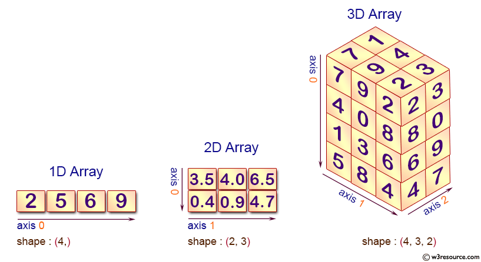
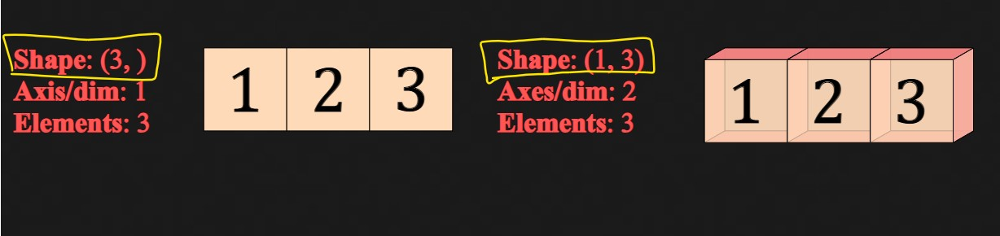

# NumPy

- [NumPy](#numpy)
  - [NumPy arrays](#numpy-arrays)
    - [Array Dimension](#array-dimension)
    - [Representation of Scalars, Vectors, Matrices and Tensors](#representation-of-scalars-vectors-matrices-and-tensors)
    - [Difference between array shape `(n,)` vs `(1,n)` vs `(n,1)` 🚀🚀🚀](#difference-between-array-shape-n-vs-1n-vs-n1-)
    - [Using `axis` keyword in aggregation functions](#using-axis-keyword-in-aggregation-functions)
    - [Axis concept in 🚀  `Pandas` 🚀](#axis-concept-in---pandas-)
    - [N-dimensional arrays 🌟🌟🌟](#n-dimensional-arrays-)
  - [Resources](#resources)


```python
import numpy as np
"""
jupyter nbconvert --to markdown numpy.ipynb --output README.md
"""
```

## NumPy arrays

NumPy fundamental object is the `ndarray`. Arrays are simply ordered collections of elements, like single numbers, `lists`, `sets`, `vectors`, `matrices`, or `tensors`. In Additionally, elements in an array have of the same type. For instance, an array can’t have integers and text at the same time. The reason is simple: mathematical operations with objects containing multiple data types would be slow, and NumPy main goal is fast and efficient numerical computation.

The `“n”` in `“ndarray”` makes references to the arbitrary number of `dimensions` it can take. An array with one element and one dimension, it’s a “singleton” or just a number. An array with four elements and two dimensions is a 2x2 matrix. Put simply, an array is like an Excel sheet with the caveat that instead of being restricted to two dimensions, it can be extended to 3, 4, or higher dimensions, and that you can’t combine data types in a “sheet”.

In NumPy, `dimensions` are called `axes`, so I will use such term interchangeably with dimensions from now.

> In Numpy dimensions are called axes. The number of axes is rank.

The first axis ( i.e. `axis-0` ) is running **vertically downwards across rows**, and the second (`axis-1`) running **horizontally across columns**.

<div align="center"></div>

**Basically simplest to remember it as `0=down` and `1=across`.**

*So a mean calculation on axis-0 will be the mean of all the rows in each column, and a mean on axis-1 will be a mean of all the columns in each row.*

Also explaining more, by definition, the axis number of the dimension is the index of that dimension within the array’s shape. **It is also the position used to access that dimension during indexing**.

For example, if a 2D array a has shape `(5,6)`, then you can access `a[0,0]` up to `a[4,5]`. `Axis 0` is thus the first dimension (the "rows"), and `axis 1` is the second dimension (the "columns").

Then we can use the array method constructor to build an array as:


```python
# 1 axis/dimensions array
one_dim = np.array([1, 2, 3])

# 2 axis/dimensions array
two_dim_1 = np.array([[1, 2, 3]])

# 2 axis/dimensions array
two_dim_2 = np.array([[1, 2, 3],
                     [4, 5, 6]])

# 3 axis/dimensions array
three_dim = np.array([[[1, 2, 3],
                       [4, 5, 6]],
                      [[1, 2, 3],
                       [4, 5, 6]]])

```

Visually, we can represent the above arrays as:


<div align="center">

</div>

to see the difference between the  shape `(n,)` vs `(n,1)`: visit [here]()

This is how arrays look when printed:


```python
print(f'1D with 3 elements:\n{one_dim}\n')
print(f'2D with 1 row and 3 cols:\n{two_dim_1}\n')
print(f'2D with 2 row and 3 cols:\n{two_dim_2}\n')
print(f'3D array:\n{three_dim}')
```

    1D with 3 elements:
    [1 2 3]

    2D with 1 row and 3 cols:
    [[1 2 3]]

    2D with 2 row and 3 cols:
    [[1 2 3]
     [4 5 6]]

    3D array:
    [[[1 2 3]
      [4 5 6]]

     [[1 2 3]
      [4 5 6]]]


### Array Dimension

* In NumPy, each dimension is called an **axis**.
* The number of axes is called the **rank**.
    * For example, the above 3x4 matrix is an array of rank 2 (it is 2-dimensional).
    * The first axis has length 3, the second has length 4.
* An array's list of axis lengths is called the **shape** of the array.
    * For example, the above matrix's shape is `(3, 4)`.
    * The rank is equal to the shape's length.
* The **size** of an array is the total number of elements, which is the product of all axis lengths (eg. 3*4=12)


Basic Attributes of the ndarray Class in numpy:

<div align="center"></div>

[https://medium.com/analytics-vidhya/axes-and-dimensions-in-numpy-and-pandas-array-a2490f72631c](https://medium.com/analytics-vidhya/axes-and-dimensions-in-numpy-and-pandas-array-a2490f72631c)

We can inspect and confirm `dimensionality` as:


```python
print(f'Number of dimensions array one: {one_dim.ndim}')
print(f'Number of dimensions array two-1: {two_dim_1.ndim}')
print(f'Number of dimensions array two-2: {two_dim_2.ndim}')
print(f'Number of dimensions array three: {three_dim.ndim}')
```

    Number of dimensions array one: 1
    Number of dimensions array two-1: 2
    Number of dimensions array two-2: 2
    Number of dimensions array three: 3


> The `shape` of an array must not be confused with its `dimensionality`, as **`shape` reflects the number of elements along each axis**, and **`dimensionality` only the number of axes or dimensions**.


```python
print(f'Shape array one: {one_dim.shape}')
print(f'Shape array two-1: {two_dim_1.shape}')
print(f'Shape array two-2: {two_dim_2.shape}')
print(f'Shape array three: {three_dim.shape}')
```

    Shape array one: (3,)
    Shape array two-1: (1, 3)
    Shape array two-2: (2, 3)
    Shape array three: (2, 2, 3)


The first number in the parenthesis represents the number of elements within the first axis/dimension; the second number the number of elements within the second axis/dimension, the third number the number of elements within the third axis/dimensions, and so on.

For instance, the (2, 2, 3) indicates 2 elements along the first axis, 2 elements along the second axis, and 3 elements along the third axis.

More in [N-dimensional arrays 🌟🌟🌟](#n-dimensional-arrays-)

To count the number of elements within an array type:


```python
print(f'Number of elements array one:{one_dim.size}')
print(f'Number of elements array two-1:{two_dim_1.size}')
print(f'Number of elements array two-2:{two_dim_2.size}')
print(f'Number of elements array three:{three_dim.size}')

```

    Number of elements array one:3
    Number of elements array two-1:3
    Number of elements array two-2:6
    Number of elements array three:12


### Representation of Scalars, Vectors, Matrices and Tensors

- `Scalar`: a **single number** like 7, -4.2, π, etc.
- `Vector`: a **list of numbers of numbers**. The list can be shown as a `row` or `column`.
  - A vector can be used to represent speed and direction (eg: wind),
  - can be used to indicate a point in 2D (eg: x & y coordinates, or r & θ radial distance and angle),
  - can be used for a point in 3D (x, y and z coordinates) and so on.
- `Matrix`: a **2-dimensional array of numbers**, usually `m x n` with `m rows` and `n columns`.
  -  In a sense, **`1 x n` or `n x 1` matrix is also a vector**.
- `Tensor`: an **n-dimensional array** and generalised recursive representation of any of the above objects.
  - A `0D` tensor is a scalar, a `1D` tensor is a vector, etc.
  - Hence, these can be used very effectively in solving complex computational problems. In Machine Learning, the whole set of features, or the weights and biases on a neural network can be expressed as a tensor.

<div align="center">

</div>


```python
Not_ROW_VECTOR = np.array([1, 2, 3])
ROW_VECTOR = np.array([[1, 2, 3]])

print(f'Not a row vector: {Not_ROW_VECTOR.shape}')
print(f"because dimension is {Not_ROW_VECTOR.ndim}")
print()
print(f'Row vector: {ROW_VECTOR.shape}')
print(f"because dimension is {ROW_VECTOR.ndim}")
print()
COLUMN_VECTOR = np.array([[1],
						  [2],
						  [3]])
print(f'Column vector: {COLUMN_VECTOR.shape}')
print(f"because dimension is {ROW_VECTOR.ndim}")
```

    Not a row vector: (3,)
    because dimension is 1

    Row vector: (1, 3)
    because dimension is 2

    Column vector: (3, 1)
    because dimension is 2


- More in [Difference between array shape `(n,)` vs `(1,n)` vs `(n,1)` 🚀🚀🚀](#difference-between-array-shape-n-vs-1n-vs-n1-)
- For more operation on `vector` see Notes on linear algebra.

### Difference between array shape `(n,)` vs `(1,n)` vs `(n,1)` 🚀🚀🚀


<div align="center">

</div>


```python
s = np.array([1, 2, 3])  # 1D array
print(s)
# 3 element across axis=0
print("ndim:", s.ndim, ", shape: ", s.shape)
# vs
r = np.array([[1, 2, 3]])  # 2D Row Vector
print(r)
# 1 element across axis=0, 3 element axis=1
print("ndim:", r.ndim, ", shape: ", r.shape)
# vs
c = np.array([  # 2D Column Vector
	[1],
	[2],
	[3]
])
print(c)
# 3 element across axis=0, 1 element axis=1
print("ndim:", c.ndim, ", shape: ", c.shape)
print()

```

    [1 2 3]
    ndim: 1 , shape:  (3,)
    [[1 2 3]]
    ndim: 2 , shape:  (1, 3)
    [[1]
     [2]
     [3]]
    ndim: 2 , shape:  (3, 1)


`(3,)` Python here tells us the object has three items along the first axis i.e. trailing comma is needed in Python to
indicate that the purpose is a tuple with only one element.


`(n,)` is called a rank 1 array. It doesn't behave consistently as a row vector or column vector which makes some of its operation and effect not intuitive. If we take transpose of this `(n,)` data structure, it will look exactly the same and the dot product will give you a number and not a matrix.

The vector of shape `(n,1)` or `(1,n)` row or column vectors are much more intuitive and consistent.


```python
from sklearn.linear_model import LinearRegression
a = np.array([1, 2, 3, 4])
b = np.array([10, 20, 30, 40])
regr = LinearRegression()
try:
	regr.fit(a, b)
except ValueError as v:
	print(v)

```

    Expected 2D array, got 1D array instead:
    array=[1 2 3 4].
    Reshape your data either using array.reshape(-1, 1) if your data has a single feature or array.reshape(1, -1) if it contains a single sample.


```python
a = a.reshape(-1, 1)  # reshape to (n,1)
try:
	regr.fit(a, b)
except ValueError as v:
	print(v)

```

### Using `axis` keyword in aggregation functions

  - [Matrix Aggregation](#matrix-aggregation)

### Axis concept in 🚀  `Pandas` 🚀

Same Array and Axis concept apply to `Pandas` as well Which is `0=down` and `1=across`.

So a mean calculation on axis-0 will be the mean of all the rows in each column, and a mean on axis-1 will be a mean of all the columns in each row.


```python
import pandas as pd
df = pd.DataFrame([[10, 20, 30, 40], [2, 2, 2, 2], [3, 3, 3, 3]], columns=[
    "col1", "col2", "col3", "col4"])
df

```


<div>
<table border="1" class="dataframe">
  <thead>
    <tr style="text-align: right;">
      <th></th>
      <th>col1</th>
      <th>col2</th>
      <th>col3</th>
      <th>col4</th>
    </tr>
  </thead>
  <tbody>
    <tr>
      <th>0</th>
      <td>10</td>
      <td>20</td>
      <td>30</td>
      <td>40</td>
    </tr>
    <tr>
      <th>1</th>
      <td>2</td>
      <td>2</td>
      <td>2</td>
      <td>2</td>
    </tr>
    <tr>
      <th>2</th>
      <td>3</td>
      <td>3</td>
      <td>3</td>
      <td>3</td>
    </tr>
  </tbody>
</table>
</div>


So if I call df.mean(axis=1), we'll get a mean across the rows:


```python
df.mean(axis=1)
```


    0    25.0
    1     2.0
    2     3.0
    dtype: float64


### N-dimensional arrays 🌟🌟🌟

NumPy can do everything we’ve mentioned in any number of dimensions. Its central data structure is called ndarray (N-Dimensional Array) for a reason.


<div align="center"></div>

In a lot of ways, dealing with a new dimension is just adding a comma to the parameters of a NumPy function:

<div align="center"></div>

> **Note: Keep in mind that when you print a 3-dimensional NumPy array, the text output visualizes the array differently than shown here. NumPy’s order for printing n-dimensional arrays is that the last axis (axis=2) is looped over the fastest, while the first is the slowest(axis=0). Which means that `np.ones((4,3,2))` would be printed as:**


```python
np.zeros((4, 3, 2))  # should've print (height=4,width=3,depth=2)
# but it prints as (depth=4,height=3,width=2)
```


    array([[[0., 0.],
            [0., 0.],
            [0., 0.]],

           [[0., 0.],
            [0., 0.],
            [0., 0.]],

           [[0., 0.],
            [0., 0.],
            [0., 0.]],

           [[0., 0.],
            [0., 0.],
            [0., 0.]]])


<div align="center">

</div>


```python
three_dim = np.array([[[1, 2],
                       [3, 4],
                       [5, 6]],

                      [[7, 8],
                       [9, 10],
                       [11, 12]],

                      [[13, 14],
                       [15, 16],
                       [17, 18]],

                      [[19, 20],
                       [21, 22],
                       [23, 24]]])
print(three_dim)
print(f"shape: {three_dim.shape}")

```

    [[[ 1  2]
      [ 3  4]
      [ 5  6]]

     [[ 7  8]
      [ 9 10]
      [11 12]]

     [[13 14]
      [15 16]
      [17 18]]

     [[19 20]
      [21 22]
      [23 24]]]
    shape: (4, 3, 2)


```python
three_dim = np.array([[[1, 2, 3],
                       [4, 5, 6],
                       [7, 8, 9],
                       [10, 11, 12]],

                     [[13, 14, 15, ],
                      [16, 17, 18],
                      [19, 20, 21],
                      [22, 23, 24]]])
print(three_dim)
print(f"shape: {three_dim.shape}")

```

    [[[ 1  2  3]
      [ 4  5  6]
      [ 7  8  9]
      [10 11 12]]

     [[13 14 15]
      [16 17 18]
      [19 20 21]
      [22 23 24]]]
    shape: (2, 4, 3)


The meaning of the dimensions comes from the application and user, not from Python/numpy. Images are often `(height, width, channels)`. Computationally it may be convenient to keep the 3 (or 4) elements of a channel for one pixel together, that is, make it that last dimension. So `(2,4,3)` shape could be thought of as a `(2,4)` image with `3` colors (rgb). The normal `numpy` print isn't the best for visualizing that.

**But if the image is something of `(400, 600, 3)` shape, we don't want a 'print' of the array. We want a plot or image display, a picture, that renders that last dimension as colors.**

If the image is colored, then each pixel is represented by three numbers - a value for each of red, green, and blue. In that case we need a 3rd dimension (because each cell can only contain one number). So a colored image is represented by an ndarray of dimensions: (height x width x 3).

<div align="center"></div>

[why-is-the-print-result-of-3d-arrays-different-from-the-mental-visualisation-of](https://stackoverflow.com/questions/58354395/why-is-the-print-result-of-3d-arrays-different-from-the-mental-visualisation-of)

[https://jalammar.github.io/visual-numpy/](https://jalammar.github.io/visual-numpy/)


```python
import cv2
import matplotlib.pyplot as plt
```


```python
img_cv2 = cv2.imread("img/dog.jpg")
img_plt = plt.imread("img/dog.jpg")
```


```python
print(type(img_cv2))
print(img_cv2.shape)
print()
print(type(img_plt))
print(img_plt.shape)

```

    <class 'numpy.ndarray'>
    (2820, 3760, 3)

    <class 'numpy.ndarray'>
    (2820, 3760, 3)


```python
plt.imshow(img_cv2)

```


    <matplotlib.image.AxesImage at 0x262deed8790>


```python
img_cv2[0:2]

```


    array([[[199, 245, 252],
            [199, 245, 252],
            [199, 245, 252],
            ...,
            [ 76, 186, 186],
            [ 76, 186, 186],
            [ 76, 186, 186]],

           [[199, 245, 252],
            [199, 245, 252],
            [199, 245, 252],
            ...,
            [ 76, 186, 186],
            [ 76, 186, 186],
            [ 76, 186, 186]]], dtype=uint8)


```python
img_cv2[0:2]

```


    array([[[199, 245, 252],
            [199, 245, 252],
            [199, 245, 252],
            ...,
            [ 76, 186, 186],
            [ 76, 186, 186],
            [ 76, 186, 186]],

           [[199, 245, 252],
            [199, 245, 252],
            [199, 245, 252],
            ...,
            [ 76, 186, 186],
            [ 76, 186, 186],
            [ 76, 186, 186]]], dtype=uint8)


```python
# Convert Colorspaces
img_rgb = cv2.cvtColor(img_cv2, cv2.COLOR_BGR2RGB)
print(img_rgb.shape)

```

    (2820, 3760, 3)


```python
plt.imshow(img_rgb)

```


    <matplotlib.image.AxesImage at 0x262def78910>


## Resources

[https://pabloinsente.github.io/intro-numpy-fundamentals](https://pabloinsente.github.io/intro-numpy-fundamentals)
