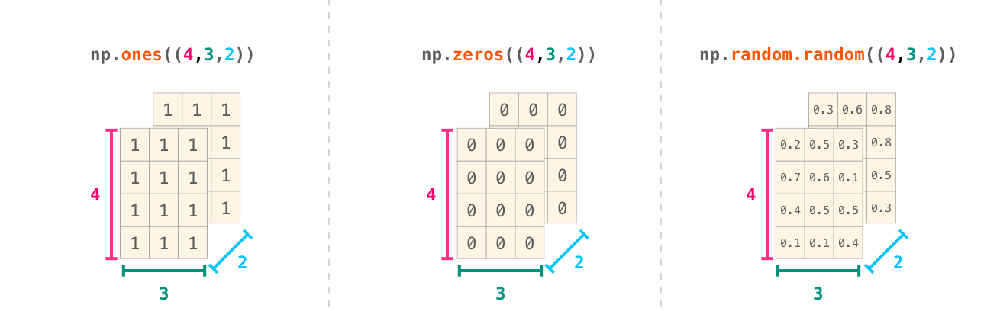
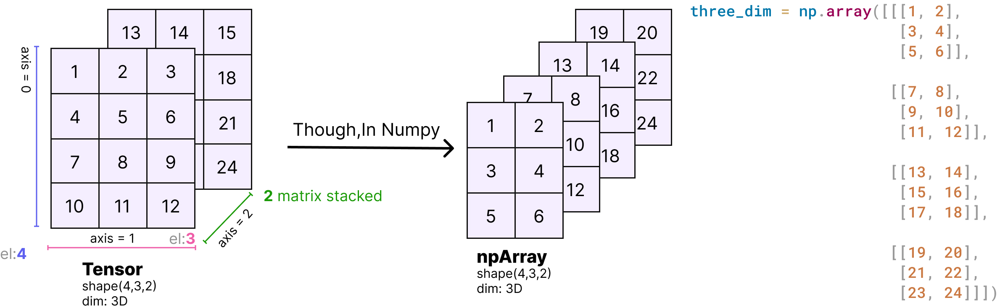

# NumPy


```python
"""
jupyter nbconvert --to markdown numpy.ipynb --output README.md
"""
import numpy as np

```

- [NumPy](#numpy)
  - [NumPy arrays](#numpy-arrays)
    - [Array Dimension](#array-dimension)
    - [Representation of Scalars, Vectors, Matrices and Tensors](#representation-of-scalars-vectors-matrices-and-tensors)
    - [Difference between array shape `(n,)` vs `(1,n)` vs `(n,1)` 🚀🚀🚀](#difference-between-array-shape-n-vs-1n-vs-n1-)
    - [Using `axis` keyword in aggregation functions](#using-axis-keyword-in-aggregation-functions)
    - [Axis concept in 🚀  `Pandas` 🚀](#axis-concept-in---pandas-)
    - [N-dimensional arrays 🌟🌟🌟](#n-dimensional-arrays-)
  - [Why Numpy? - `Vectorization`](#why-numpy---vectorization)
    - [Why Vectorize](#why-vectorize)
  - [Array Creation](#array-creation)
    - [Conversion from other Python structures - `np.array`](#conversion-from-other-python-structures---nparray)
    - [Intrinsic NumPy array creation objects](#intrinsic-numpy-array-creation-objects)
      - [`arange(start, end [exclusive], step)`](#arangestart-end-exclusive-step)
        - [🚀 Creating n-dimensional arrays with `arange`](#-creating-n-dimensional-arrays-with-arange)
      - [`linspace(s,en,equally spaced between)`](#linspacesenequally-spaced-between)
      - [`zeros()`](#zeros)
      - [`ones()`](#ones)
      - [`full()`](#full)
      - [`indices()`](#indices)
    - [Use of special library functions](#use-of-special-library-functions)
      - [`np.diag()` , `np.identity()` and `np.eye()`](#npdiag--npidentity-and-npeye)
    - [Random number generation and sampling](#random-number-generation-and-sampling)
      - [`random.rand()`](#randomrand)
      - [`randint()`](#randint)
      - [`random.randn()` and `random.normal()`](#randomrandn-and-randomnormal)
      - [`choice`](#choice)
      - [Setting a seed for reproducibility](#setting-a-seed-for-reproducibility)
  - [Indexing and Masking](#indexing-and-masking)
    - [Indexing: One-dimensional array](#indexing-one-dimensional-array)
      - [Differences with regular python arrays](#differences-with-regular-python-arrays)
    - [Indexing: Two-dimensional array](#indexing-two-dimensional-array)
      - [`arr[start_row_idx : end_row_idx + 1, start_col_idx : end_col_idx + 1]`](#arrstart_row_idx--end_row_idx--1-start_col_idx--end_col_idx--1)
      - [More In Depth - shape,dimensionality](#more-in-depth---shapedimensionality)
      - [Negative slicing of NumPy arrays + reversing array](#negative-slicing-of-numpy-arrays--reversing-array)
      - [🚀🚀Split Input and Output Features](#split-input-and-output-features)
      - [🚀🚀 Split Train and Test Rows](#-split-train-and-test-rows)
      - [Fancy indexing](#fancy-indexing)
      - [Stride](#stride)
    - [Indexing: Multi-dimensional array](#indexing-multi-dimensional-array)
      - [Ellipsis (`...`)](#ellipsis-)
    - [Boolean indexing](#boolean-indexing)
      - [`np.ix_`](#npix_)
    - [Iterating](#iterating)
    - [Masking (Conditional operators)](#masking-conditional-operators)
      - [More Example](#more-example)
      - [Indexing with a mask can be very useful to assign a new value to a sub-array](#indexing-with-a-mask-can-be-very-useful-to-assign-a-new-value-to-a-sub-array)
      - [`np.where()` to select elements or indices from an array.](#npwhere-to-select-elements-or-indices-from-an-array)
  - [Mathematical Operations](#mathematical-operations)
    - [Matrix Arithmetic](#matrix-arithmetic)
    - [with scalars](#with-scalars)
    - [Transcendental/Universal functions](#transcendentaluniversal-functions)
    - [Binary ufuncs](#binary-ufuncs)
    - [Shape Mismatch](#shape-mismatch)
    - [Dot Product](#dot-product)
    - [Matrix Aggregation](#matrix-aggregation)
    - [Logical Operations](#logical-operations)
  - [Statistic](#statistic)
  - [Miscellaneous Operations](#miscellaneous-operations)
    - [Unique Items and Count](#unique-items-and-count)
    - [Reversing Rows and Columns](#reversing-rows-and-columns)
  - [Shape Manipulation - Transposing, Reshaping, Stacking etc...](#shape-manipulation---transposing-reshaping-stacking-etc)
    - [`shape` attribute](#shape-attribute)
    - [`reshape`](#reshape)
      - [Reshape 1D to 2D Array](#reshape-1d-to-2d-array)
      - [Reshape 2D to 3D Array](#reshape-2d-to-3d-array)
    - [`flatten`](#flatten)
    - [`ravel`](#ravel)
    - [Transpose](#transpose)
      - [transposing 3d array](#transposing-3d-array)
    - [Adding a Dimension](#adding-a-dimension)
    - [Stacking of Array](#stacking-of-array)
      - [`vstack`](#vstack)
      - [`hstack`](#hstack)
      - [`concatenate`](#concatenate)
      - [`stack`](#stack)
    - [Splitting arrays](#splitting-arrays)
  - [Broadcasting](#broadcasting)
    - [Limitations of Broadcasting](#limitations-of-broadcasting)
  - [Vectorization](#vectorization)
    - [Machine Learning context](#machine-learning-context)
  - [Resources](#resources)


## NumPy arrays

NumPy fundamental object is the `ndarray`. Arrays are simply ordered collections of elements, like single numbers, `lists`, `sets`, `vectors`, `matrices`, or `tensors`. In Additionally, elements in an array have of the same type. For instance, an array can’t have integers and text at the same time. The reason is simple: mathematical operations with objects containing multiple data types would be slow, and NumPy main goal is fast and efficient numerical computation.

The `“n”` in `“ndarray”` makes references to the arbitrary number of `dimensions` it can take. An array with one element and one dimension, it’s a “singleton” or just a number. An array with four elements and two dimensions is a 2x2 matrix. Put simply, an array is like an Excel sheet with the caveat that instead of being restricted to two dimensions, it can be extended to 3, 4, or higher dimensions, and that you can’t combine data types in a “sheet”.

In NumPy, `dimensions` are called `axes`, so I will use such term interchangeably with dimensions from now.


```python
# 1 axis/dimensions array
one_dim = np.array([1, 2, 3])

# 2 axis/dimensions array
two_dim_1 = np.array([[1, 2, 3]])

# 2 axis/dimensions array
two_dim_2 = np.array([[1, 2, 3],
                     [4, 5, 6]])

# 3 axis/dimensions array
three_dim = np.array([[[1, 2, 3],
                       [4, 5, 6]],
                      [[1, 2, 3],
                       [4, 5, 6]]])

```

This is how arrays look when printed:


```python
print(f'1D with 3 elements:\n{one_dim}\n')
print(f'2D with 1 row and 3 cols:\n{two_dim_1}\n')
print(f'2D with 2 row and 3 cols:\n{two_dim_2}\n')
print(f'3D array:\n{three_dim}')
```

    1D with 3 elements:
    [1 2 3]

    2D with 1 row and 3 cols:
    [[1 2 3]]

    2D with 2 row and 3 cols:
    [[1 2 3]
     [4 5 6]]

    3D array:
    [[[1 2 3]
      [4 5 6]]

     [[1 2 3]
      [4 5 6]]]


### Array Dimension

* In NumPy, each dimension is called an **axis**.
* The number of axes is called the **rank**.
    * For example, the above 3x4 matrix is an array of rank 2 (it is 2-dimensional).
    * The first axis has length 3, the second has length 4.
* An array's list of axis lengths is called the **shape** of the array.
    * For example, the above matrix's shape is `(3, 4)`.
    * The rank is equal to the shape's length.
* The **size** of an array is the total number of elements, which is the product of all axis lengths (eg. 3*4=12)


Basic Attributes of the ndarray Class in numpy:

<div align="center"></div>

[https://medium.com/analytics-vidhya/axes-and-dimensions-in-numpy-and-pandas-array-a2490f72631c](https://medium.com/analytics-vidhya/axes-and-dimensions-in-numpy-and-pandas-array-a2490f72631c)

We can inspect and confirm `dimensionality` as:


```python
print(f'Number of dimensions array one: {one_dim.ndim}')
print(f'Number of dimensions array two-1: {two_dim_1.ndim}')
print(f'Number of dimensions array two-2: {two_dim_2.ndim}')
print(f'Number of dimensions array three: {three_dim.ndim}')
```

    Number of dimensions array one: 1
    Number of dimensions array two-1: 2
    Number of dimensions array two-2: 2
    Number of dimensions array three: 3


> In Numpy dimensions are called axes. The number of axes is rank.

The first axis ( i.e. `axis-0` ) is running **vertically downwards across rows**, and the second (`axis-1`) running **horizontally across columns**.

**Basically simplest to remember it as `0=down` and `1=across`.**

<div align="center">

</div>

*So a mean calculation on axis-0 will be the mean of all the rows in each column, and a mean on axis-1 will be a mean of all the columns in each row.*

Also explaining more, by definition, the axis number of the dimension is the index of that dimension within the array’s shape. **It is also the position used to access that dimension during indexing**.

For example, if a 2D array a has shape `(5,6)`, then you can access `a[0,0]` up to `a[4,5]`. `Axis 0` is thus the first dimension (the "rows"), and `axis 1` is the second dimension (the "columns").

Then we can use the array method constructor to build an array as:

> The `shape` of an array must not be confused with its `dimensionality`, as **`shape` reflects the number of elements along each axis**, and **`dimensionality` only the number of axes or dimensions**.


```python
print(f'Shape array one: {one_dim.shape}')
print(f'Shape array two-1: {two_dim_1.shape}')
print(f'Shape array two-2: {two_dim_2.shape}')
print(f'Shape array three: {three_dim.shape}')
```

    Shape array one: (3,)
    Shape array two-1: (1, 3)
    Shape array two-2: (2, 3)
    Shape array three: (2, 2, 3)


Visually, we can represent the above arrays as:


<div align="center">

</div>

to see the difference between the  shape `(n,)` vs `(n,1)`: visit [here]()


The first number in the parenthesis represents the number of elements within the first axis/dimension; the second number the number of elements within the second axis/dimension, the third number the number of elements within the third axis/dimensions, and so on.

For instance, the (2, 2, 3) indicates 2 elements along the first axis, 2 elements along the second axis, and 3 elements along the third axis.

More in [N-dimensional arrays 🌟🌟🌟](#n-dimensional-arrays-)

To count the number of elements within an array type:


```python
print(f'Number of elements array one:{one_dim.size}')
print(f'Number of elements array two-1:{two_dim_1.size}')
print(f'Number of elements array two-2:{two_dim_2.size}')
print(f'Number of elements array three:{three_dim.size}')

```

    Number of elements array one:3
    Number of elements array two-1:3
    Number of elements array two-2:6
    Number of elements array three:12


### Representation of Scalars, Vectors, Matrices and Tensors

- `Scalar`: a **single number** like 7, -4.2, π, etc.
- `Vector`: a **list of numbers of numbers**. The list can be shown as a `row` or `column`.
  - A vector can be used to represent speed and direction (eg: wind),
  - can be used to indicate a point in 2D (eg: x & y coordinates, or r & θ radial distance and angle),
  - can be used for a point in 3D (x, y and z coordinates) and so on.
- `Matrix`: a **2-dimensional array of numbers**, usually `m x n` with `m rows` and `n columns`.
  -  In a sense, **`1 x n` or `n x 1` matrix is also a vector**.
- `Tensor`: an **n-dimensional array** and generalised recursive representation of any of the above objects.
  - A `0D` tensor is a scalar, a `1D` tensor is a vector, etc.
  - Hence, these can be used very effectively in solving complex computational problems. In Machine Learning, the whole set of features, or the weights and biases on a neural network can be expressed as a tensor.

<div align="center">

</div>


```python
Not_ROW_VECTOR = np.array([1, 2, 3])
ROW_VECTOR = np.array([[1, 2, 3]])

print(f'Not a row vector: {Not_ROW_VECTOR.shape}')
print(f"because dimension is {Not_ROW_VECTOR.ndim}")
print()
print(f'Row vector: {ROW_VECTOR.shape}')
print(f"because dimension is {ROW_VECTOR.ndim}")
print()
COLUMN_VECTOR = np.array([[1],
						  [2],
						  [3]])
print(f'Column vector: {COLUMN_VECTOR.shape}')
print(f"because dimension is {ROW_VECTOR.ndim}")
```

    Not a row vector: (3,)
    because dimension is 1

    Row vector: (1, 3)
    because dimension is 2

    Column vector: (3, 1)
    because dimension is 2


- More in [Difference between array shape `(n,)` vs `(1,n)` vs `(n,1)` 🚀🚀🚀](#difference-between-array-shape-n-vs-1n-vs-n1-)
- For more operation on `vector` see Notes on linear algebra.

### Difference between array shape `(n,)` vs `(1,n)` vs `(n,1)` 🚀🚀🚀


<div align="center">

</div>


```python
s = np.array([1, 2, 3])  # 1D array
print(s)
# 3 element across axis=0
print("ndim:", s.ndim, ", shape: ", s.shape)
# vs
r = np.array([[1, 2, 3]])  # 2D Row Vector
print(r)
# 1 element across axis=0, 3 element axis=1
print("ndim:", r.ndim, ", shape: ", r.shape)
# vs
c = np.array([  # 2D Column Vector
	[1],
	[2],
	[3]
])
print(c)
# 3 element across axis=0, 1 element axis=1
print("ndim:", c.ndim, ", shape: ", c.shape)
print()

```

    [1 2 3]
    ndim: 1 , shape:  (3,)
    [[1 2 3]]
    ndim: 2 , shape:  (1, 3)
    [[1]
     [2]
     [3]]
    ndim: 2 , shape:  (3, 1)


`(3,)` Python here tells us the object has three items along the first axis i.e. trailing comma is needed in Python to
indicate that the purpose is a tuple with only one element.


`(n,)` is called a rank 1 array. It doesn't behave consistently as a row vector or column vector which makes some of its operation and effect not intuitive. If we take transpose of this `(n,)` data structure, it will look exactly the same and the dot product will give you a number and not a matrix.

The vector of shape `(n,1)` or `(1,n)` row or column vectors are much more intuitive and consistent.


```python
from sklearn.linear_model import LinearRegression
a = np.array([1, 2, 3, 4])
b = np.array([10, 20, 30, 40])
regr = LinearRegression()
try:
	regr.fit(a, b)
except ValueError as v:
	print(v)

```

    Expected 2D array, got 1D array instead:
    array=[1 2 3 4].
    Reshape your data either using array.reshape(-1, 1) if your data has a single feature or array.reshape(1, -1) if it contains a single sample.


```python
a = a.reshape(-1, 1)  # reshape to (n,1)
try:
	regr.fit(a, b)
except ValueError as v:
	print(v)

```

### Using `axis` keyword in aggregation functions

  - [Matrix Aggregation](#matrix-aggregation)

### Axis concept in 🚀  `Pandas` 🚀

Same Array and Axis concept apply to `Pandas` as well Which is `0=down` and `1=across`.

So a mean calculation on axis-0 will be the mean of all the rows in each column, and a mean on axis-1 will be a mean of all the columns in each row.


```python
import pandas as pd
df = pd.DataFrame([[10, 20, 30, 40], [2, 2, 2, 2], [3, 3, 3, 3]], columns=[
    "col1", "col2", "col3", "col4"])
df

```


<div>

<table border="1" class="dataframe">
  <thead>
    <tr style="text-align: right;">
      <th></th>
      <th>col1</th>
      <th>col2</th>
      <th>col3</th>
      <th>col4</th>
    </tr>
  </thead>
  <tbody>
    <tr>
      <th>0</th>
      <td>10</td>
      <td>20</td>
      <td>30</td>
      <td>40</td>
    </tr>
    <tr>
      <th>1</th>
      <td>2</td>
      <td>2</td>
      <td>2</td>
      <td>2</td>
    </tr>
    <tr>
      <th>2</th>
      <td>3</td>
      <td>3</td>
      <td>3</td>
      <td>3</td>
    </tr>
  </tbody>
</table>
</div>


So if I call df.mean(axis=1), we'll get a mean across the rows:


```python
df.mean(axis=1)
```


    0    25.0
    1     2.0
    2     3.0
    dtype: float64


### N-dimensional arrays 🌟🌟🌟

NumPy can do everything we’ve mentioned in any number of dimensions. Its central data structure is called ndarray (N-Dimensional Array) for a reason.


<div align="center"></div>

In a lot of ways, dealing with a new dimension is just adding a comma to the parameters of a NumPy function:

<div align="center"></div>

> **Note: Keep in mind that when you print a 3-dimensional NumPy array, the text output visualizes the array differently than shown here. NumPy’s order for printing n-dimensional arrays is that the last axis (axis=2) is looped over the fastest, while the first is the slowest(axis=0). Which means that `np.ones((4,3,2))` would be printed as:**


```python
np.zeros((4, 3, 2))  # should've print (height=4,width=3,depth=2)
# but it prints as (depth=4,height=3,width=2)
```


    array([[[0., 0.],
            [0., 0.],
            [0., 0.]],

           [[0., 0.],
            [0., 0.],
            [0., 0.]],

           [[0., 0.],
            [0., 0.],
            [0., 0.]],

           [[0., 0.],
            [0., 0.],
            [0., 0.]]])


<div align="center">

</div>


```python
three_dim = np.array([[[1, 2],
                       [3, 4],
                       [5, 6]],

                      [[7, 8],
                       [9, 10],
                       [11, 12]],

                      [[13, 14],
                       [15, 16],
                       [17, 18]],

                      [[19, 20],
                       [21, 22],
                       [23, 24]]])
print(three_dim)
print(f"shape: {three_dim.shape}")

```

    [[[ 1  2]
      [ 3  4]
      [ 5  6]]

     [[ 7  8]
      [ 9 10]
      [11 12]]

     [[13 14]
      [15 16]
      [17 18]]

     [[19 20]
      [21 22]
      [23 24]]]
    shape: (4, 3, 2)


```python
three_dim = np.array([[[1, 2, 3],
                       [4, 5, 6],
                       [7, 8, 9],
                       [10, 11, 12]],

                     [[13, 14, 15, ],
                      [16, 17, 18],
                      [19, 20, 21],
                      [22, 23, 24]]])
print(three_dim)
print(f"shape: {three_dim.shape}")

```

    [[[ 1  2  3]
      [ 4  5  6]
      [ 7  8  9]
      [10 11 12]]

     [[13 14 15]
      [16 17 18]
      [19 20 21]
      [22 23 24]]]
    shape: (2, 4, 3)


The meaning of the dimensions comes from the application and user, not from Python/numpy. Images are often `(height, width, channels)`. Computationally it may be convenient to keep the 3 (or 4) elements of a channel for one pixel together, that is, make it that last dimension. So `(2,4,3)` shape could be thought of as a `(2,4)` image with `3` colors (rgb). The normal `numpy` print isn't the best for visualizing that.

**But if the image is something of `(400, 600, 3)` shape, we don't want a 'print' of the array. We want a plot or image display, a picture, that renders that last dimension as colors.**

If the image is colored, then each pixel is represented by three numbers - a value for each of red, green, and blue. In that case we need a 3rd dimension (because each cell can only contain one number). So a colored image is represented by an ndarray of dimensions: (height x width x 3).

<div align="center"></div>

[why-is-the-print-result-of-3d-arrays-different-from-the-mental-visualisation-of](https://stackoverflow.com/questions/58354395/why-is-the-print-result-of-3d-arrays-different-from-the-mental-visualisation-of)

[https://jalammar.github.io/visual-numpy/](https://jalammar.github.io/visual-numpy/)


```python
import cv2
import matplotlib.pyplot as plt
```


```python
img_cv2 = cv2.imread("img/dog.jpg")
img_plt = plt.imread("img/dog.jpg")
```


```python
print(type(img_cv2))
print(img_cv2.shape)
print()
print(type(img_plt))
print(img_plt.shape)

```

    <class 'numpy.ndarray'>
    (2820, 3760, 3)

    <class 'numpy.ndarray'>
    (2820, 3760, 3)


```python
plt.imshow(img_cv2)

```


    <matplotlib.image.AxesImage at 0x262deed8790>


```python
img_cv2[0:2]

```


    array([[[199, 245, 252],
            [199, 245, 252],
            [199, 245, 252],
            ...,
            [ 76, 186, 186],
            [ 76, 186, 186],
            [ 76, 186, 186]],

           [[199, 245, 252],
            [199, 245, 252],
            [199, 245, 252],
            ...,
            [ 76, 186, 186],
            [ 76, 186, 186],
            [ 76, 186, 186]]], dtype=uint8)


```python
img_cv2[0:2]

```


    array([[[199, 245, 252],
            [199, 245, 252],
            [199, 245, 252],
            ...,
            [ 76, 186, 186],
            [ 76, 186, 186],
            [ 76, 186, 186]],

           [[199, 245, 252],
            [199, 245, 252],
            [199, 245, 252],
            ...,
            [ 76, 186, 186],
            [ 76, 186, 186],
            [ 76, 186, 186]]], dtype=uint8)


```python
# Convert Colorspaces
img_rgb = cv2.cvtColor(img_cv2, cv2.COLOR_BGR2RGB)
print(img_rgb.shape)

```

    (2820, 3760, 3)


```python
plt.imshow(img_rgb)

```


    <matplotlib.image.AxesImage at 0x262def78910>


## Why Numpy? - `Vectorization`


- performs fast operations (because of `Vectorization`)
- `numpy` arrays can be treated as vectors and matrices from linear algebra (Vectorization)

`Loops` are bad for performance for complicated reasons related to Python design as a dynamically typed language. The shortest answer to why loops are slow is that Python takes multiple actions for each call (e.g., it access memory several times, type checking, etc.), that compound and hurt performance the more loops you execute.

In scientific computing we want speed, meaning we want to get rid of loops. This is precisely what’s `vectorization` all about: **getting rid of loops by performing computations on multiple components of a vector at the same time**. Hence, performing operations in `“vector”` form.

<div align="center">

</div>

Now let’s compare the performance gain of vectorization against looping in a simple sum.


```python
x = np.random.rand(1000)
y = np.random.rand(1000)

```

Sum two array with a Python loop (`non-vectorized`)


```python
%%timeit
for i in range(0, len(x)):
    x[i] + y[i]
```

    426 µs ± 75.9 µs per loop (mean ± std. dev. of 7 runs, 1000 loops each)


Sum arrays with NumPy (`vectorized`)


```python
%%timeit
x+y
```

    1.38 µs ± 277 ns per loop (mean ± std. dev. of 7 runs, 100000 loops each)


As you can see, the NumPy vectorized implementation is several orders of magnitude faster.

### Why Vectorize

Vectorization is the process of converting an algorithm from operating on a single value at a time to operating on a set of values (vector) at one time.

Modern CPUs provide direct support for vector operations where a single instruction is applied to multiple data (SIMD). For example a CPU with a 512 bit register could hold 16 32-bit single precision doubles and do a single calculation 16 times faster than executing a single instruction at a time. Combine this with threading and multi-core CPUs leads to orders of magnitude performance gains.

<div align="center">

</div>

Source: [vectorization-why-and-what](https://www.quantifisolutions.com/vectorization-part-2-why-and-what/)


## Array Creation

NumPy offers several alternatives to create arrays.

I will review three cases:

1. Conversion from other Python structures
2. Intrinsic NumPy array creation objects
3. Use of special library functions

### Conversion from other Python structures - `np.array`


```python
array_list = np.array([1, 2, 3])
array_tuple = np.array(((1, 2, 3), (4, 5, 6)))
array_set = np.array({"pikachu", "snorlax", "charizard"})


print(f'Array from list:\n{array_list}\n')
print(f'Array from tuple:\n{array_tuple}\n')
print(f'Array from set:\n{array_set}')

```

    Array from list:
    [1 2 3]

    Array from tuple:
    [[1 2 3]
     [4 5 6]]

    Array from set:
    {'snorlax', 'pikachu', 'charizard'}


### Intrinsic NumPy array creation objects

Manual input of data into arrays can be cumbersome, so NumPy offers a series of convenience methods to create arrays for special cases, like `zeros`, `ones`, and others. Below some common examples.

#### `arange(start, end [exclusive], step)`


`numpy.arange` creates arrays with regularly **incrementing values**. `arange` is an array-valued version of the built-in Python `range` function


```python
print(np.arange(10))  # 0.... n-1

print()

print(np.arange(1, 10))  # start, end (exclusive)

print()

print(np.arange(1, 10, 2))  # start, end (exclusive), step
```

    [0 1 2 3 4 5 6 7 8 9]

    [1 2 3 4 5 6 7 8 9]

    [1 3 5 7 9]


It also works with floats:


```python
print(np.arange(1.0, 5.0))
print(np.arange(1, 5, 0.5))

```

    [1. 2. 3. 4.]
    [1.  1.5 2.  2.5 3.  3.5 4.  4.5]


##### 🚀 Creating n-dimensional arrays with `arange`


```python
np.arange(1, 13).reshape(3, 4)
```


    array([[ 1,  2,  3,  4],
           [ 5,  6,  7,  8],
           [ 9, 10, 11, 12]])


```python
np.arange(1, 4).reshape(-1, 1) # (n,1) column vector
```


    array([[1],
           [2],
           [3]])


```python
row_vector = np.arange(1, 4).reshape(1, -1)  # (1,n) row vector
print(row_vector)
print(f"shape: {row_vector.shape}")

```

    [[1 2 3]]
    shape: (1, 3)


```python
not_row_vector = np.arange(1, 4)
print(not_row_vector)
print(f"shape: {not_row_vector.shape}")
```

    [1 2 3]
    shape: (3,)


#### `linspace(s,en,equally spaced between)`


`numpy.linspace`  will create arrays with a specified number of elements, and spaced equally between the specified beginning and end values.


```python
print(np.linspace(1, 10, 5))  # start, end, number of points
print(np.linspace(0, 5/3, 6))
```

    [ 1.    3.25  5.5   7.75 10.  ]
    [0.         0.33333333 0.66666667 1.         1.33333333 1.66666667]


```python
np.linspace(-1.0, 1.0, num=10)
```


    array([-1.        , -0.77777778, -0.55555556, -0.33333333, -0.11111111,
            0.11111111,  0.33333333,  0.55555556,  0.77777778,  1.        ])


####  `zeros()`


```python
print(np.zeros(10))
print("2d..............")
print(np.zeros((3, 3)))
print("3d.............")
print(np.zeros((2, 3, 3)))

```

    [0. 0. 0. 0. 0. 0. 0. 0. 0. 0.]
    2d..............
    [[0. 0. 0.]
     [0. 0. 0.]
     [0. 0. 0.]]
    3d.............
    [[[0. 0. 0.]
      [0. 0. 0.]
      [0. 0. 0.]]

     [[0. 0. 0.]
      [0. 0. 0.]
      [0. 0. 0.]]]


#### `ones()`


```python
print(np.ones(10))
print()
print(np.ones((3, 3)) * 5)

```

    [1. 1. 1. 1. 1. 1. 1. 1. 1. 1.]

    [[5. 5. 5.]
     [5. 5. 5.]
     [5. 5. 5.]]


#### `full()`

Creates an array of the given shape initialized with the given value. Here's a 3x4 matrix full of `π`.


```python
np.full((3, 4), np.pi)

```


    array([[3.14159265, 3.14159265, 3.14159265, 3.14159265],
           [3.14159265, 3.14159265, 3.14159265, 3.14159265],
           [3.14159265, 3.14159265, 3.14159265, 3.14159265]])


#### `indices()`


```python
indices = np.indices((3, 3))
indices

```


    array([[[0, 0, 0],
            [1, 1, 1],
            [2, 2, 2]],

           [[0, 1, 2],
            [0, 1, 2],
            [0, 1, 2]]])


```python
indices[0]
```


    array([[0, 0, 0],
           [1, 1, 1],
           [2, 2, 2]])


```python
indices[1]
```


    array([[0, 1, 2],
           [0, 1, 2],
           [0, 1, 2]])


### Use of special library functions

#### `np.diag()` , `np.identity()` and `np.eye()`


```python
np.diag([1, 2, 3, 4])

```


    array([[1, 0, 0, 0],
           [0, 2, 0, 0],
           [0, 0, 3, 0],
           [0, 0, 0, 4]])


```python
np.identity(4)

```


    array([[1., 0., 0., 0.],
           [0., 1., 0., 0.],
           [0., 0., 1., 0.],
           [0., 0., 0., 1.]])


```python
# Return a 2-D array with ones on the diagonal and zeros elsewhere.
c = np.eye(4)
print(c)
print()
# 3 is number of rows, 2 is number of columns, index of diagonal start with 0
d = np.eye(3, 2)
print(d)

```

    [[1. 0. 0. 0.]
     [0. 1. 0. 0.]
     [0. 0. 1. 0.]
     [0. 0. 0. 1.]]

    [[1. 0.]
     [0. 1.]
     [0. 0.]]


### Random number generation and sampling


We can generate an array of random numbers using `rand()`, `randn()` or `randint()` functions.

#### `random.rand()`

- Using `random.rand()`, we can generate an array of random numbers of the shape we pass to it from uniform distribution over 0 to 1.


```python
# For example, say we want a one-dimensional array of 4 objects that are uniformly
# distributed from 0 to 1, we can do this:

r = np.random.rand(4)
print(r)

# And if we want a two-dimensional array of 3rows and 2columns:
print()
r = np.random.rand(3, 2)
print(r)

```

    [0.78549495 0.01183299 0.29721769 0.11280867]

    [[0.48595205 0.00479117]
     [0.03902156 0.86074538]
     [0.96199799 0.77233877]]


#### `randint()`

Generating an array of random integers using `rand()`.


```python
s = 5
e = 10
randomNums = np.random.rand(100) * e+s
randomInts = np.floor(randomNums)
randomInts

```


    array([11., 14.,  6.,  7.,  8.,  5.,  7.,  7.,  8.,  8.,  9.,  9., 12.,
            8., 13.,  6.,  6.,  7.,  5.,  8., 12.,  6.,  6., 14., 11.,  8.,
           11., 12., 12., 12.,  7., 12.,  9., 11., 12., 13., 12., 13.,  8.,
           10., 12.,  5., 10.,  9.,  8., 11., 12., 14., 10.,  5., 10., 12.,
            7.,  7.,  8., 13., 11.,  6.,  9., 11., 10.,  5.,  5., 10.,  8.,
           14., 13., 10., 14.,  5., 12.,  5.,  6.,  6.,  5.,  6., 14.,  8.,
            7.,  8.,  6., 12.,  9.,  9.,  6.,  7.,  8., 10., 14.,  5., 13.,
           10., 13.,  8., 10., 13.,  5., 14.,  6., 13.])


Alternatively:

- We can use the `randint()` function to generate an array of integers.
- The `randint()` function can take up to 3 arguments;
    - the low(inclusive),
    - high(exclusive)
    - size of the array.


```python
print(np.arange(10))  # Remember!! not random but sequential
print(np.random.randint(20))  # generates a random integer exclusive of 20
print()
# generates 1 random integer including 2 but excluding 20
print(np.random.randint(2, 20))
print()
# generates 7 random integers including 2 but excluding 20
print(np.random.randint(2, 20, 7))
print()
print(np.random.randint(2, 20, (2, 3)))  # generates 2D array of shape 2,3
```

    [0 1 2 3 4 5 6 7 8 9]
    15

    18

    [ 9 14  2 12  8  7 11]

    [[11  9 11]
     [ 8  4 17]]


    6


#### `random.randn()` and `random.normal()`

- Using `randn()`, we can generate random samples from **Standard, normal or Gaussian distributioncentered around 0** . For example, let’s generate 7 random numbers:


```python
np.random.randn(100)
```


    array([-0.3614899 ,  0.61992002, -0.81899306,  0.5597346 , -0.69842678,
           -1.10341849,  0.60009591, -0.19849157, -0.96945883,  0.24886778,
           -0.8221463 , -0.61736156,  0.10923973, -0.64572419,  1.83666219,
           -1.09222327,  0.59906901, -1.2106451 , -0.56185519, -0.80355863,
            0.61203993,  0.67333876, -1.43365291, -0.81315673, -0.74114243,
           -0.08063148,  1.34222607,  2.17400434, -0.10810503,  1.8685854 ,
           -0.75899791, -0.36442177, -0.08593771,  0.74434067,  0.22885863,
           -1.16889105, -0.58590705,  1.04832189,  0.76148084,  0.06747364,
            0.01204344,  0.26440331,  1.33591303,  0.60597311,  1.96391443,
           -0.7735585 ,  1.71440306,  2.34752693,  0.64626332, -0.65285576,
           -0.95856418,  0.10018449, -1.03344648,  0.28576619, -0.32557142,
            0.24176193,  0.1498766 , -1.25343047, -0.15559337,  0.89513823,
            1.34432922, -1.18712654, -0.43285232,  0.74600572, -1.34526112,
           -0.00588216,  0.77291594,  0.87437671, -0.45775305,  0.81400561,
           -0.85307578, -2.16185924, -0.28103173,  0.15001287,  1.16040504,
           -0.31481882,  0.11257005, -0.24675071, -0.74760369, -1.53069464,
           -0.26905523, -0.83893937,  0.42501343, -0.48903115,  1.27919486,
           -1.23346517,  0.18932659, -1.04301141, -0.65068497,  0.52856365,
            1.34967198,  0.66819414,  1.56857528,  1.25025443, -1.9558503 ,
           -1.13701265, -1.46386432, -0.32294535, -0.10042653,  0.29906629])


```python
np.random.randn(3, 4)
```


    array([[-2.28836912,  0.34780917, -0.26313536,  1.10909225],
           [-1.52027014, -0.55933807, -0.17053124, -0.87400218],
           [-0.95256885, -0.17311184, -0.55471297,  0.7243533 ]])


To give you a feel of what these distributions look like, let's use matplotlib:


```python
import matplotlib.pyplot as plt
from IPython import display
display.set_matplotlib_formats('svg')
plt.hist(np.random.rand(100000), density=True, bins=100,
         histtype="step", color="blue", label="rand")
plt.hist(np.random.randn(100000), density=True, bins=100,
         histtype="step", color="red", label="randn")
plt.axis([-2.5, 2.5, 0, 1.1])
plt.legend(loc="upper left")
plt.title("Random distributions")
plt.xlabel("Value")
plt.ylabel("Density")
plt.show()

```


`randn` seems to give a distribution from some **standardized normal distribution** (mean 0 and variance 1). `normal` takes more parameters for more control. So `randn` seems to simply be a convenience function.


```python
np.random.normal(loc=0.0, scale=1.0, size=(10,))

```


    array([ 0.82568769,  0.19124701,  0.06701997,  0.53760613, -2.72269938,
            1.76775545, -1.47150379,  0.06819547,  0.85028911, -0.81503108])


```python
np.random.normal(loc=10, scale=1.0, size=(10,))

```


    array([ 9.17580685, 10.07913585, 10.36891076, 10.24278277,  9.73299089,
            9.55017388,  9.16834682,  9.05820677,  9.25025099,  9.8336638 ])


equivalent to:


```python
np.random.randn(10)+10
```


    array([ 9.69332601,  9.59079965,  9.22760526, 10.08452443,  9.16150081,
            8.73582941,  9.4521861 , 10.69172902, 10.58660354,  8.67882242])


#### `choice`

A random number from an array [1, 10] (inclusive):


```python
np.random.choice(np.arange(10))
```


    4


```python
np.random.choice(np.arange(10))
```


    7


5 random numbers from an array [1, 10] (inclusive):


```python
np.random.choice(np.arange(10),5)
```


    array([7, 2, 3, 5, 7])


The previous examples were sampling with replacement. We can sample without replacement as well:


```python
print(f'Uniform sample of random numbers from an array [1, 10] (inclusive): \n{np.random.choice(np.arange(10), 5, replace=False)}\n\n')

```

    Uniform sample of random numbers from an array [1, 10] (inclusive):
    [3 7 5 9 1]


#### Setting a seed for reproducibility


In the previous examples, there is no way to reproduce the numbers we generated because we didn’t specify a “seed”. “Wait, we are generating random numbers, why on earth I would want to repeat the same random number?”. To allow others to reproduce your results. In Data Science and Machine Learning different starting points (seeds) may lead to widely different results. There is a joke going around the Internet saying that the “seed” of a random number generator is another parameter of the model to be adjusted, and indeed, it is.

If we set the `np.random.seed(a_fixed_number)` every time you call the numpy's other random function, the result will be the same:


```python
print(f'{np.random.randint(5, size=5)}')
print(f'{np.random.randint(5, size=5)}')
print(f'{np.random.randint(5, size=5)}')
# changes each time
```

    [0 4 0 2 4]
    [0 1 2 0 4]
    [4 0 4 1 4]


Setting a seed for generating reproducible random numbers is simple:


```python
np.random.seed(43)
print(f'{np.random.randint(5, size=5)}')
print(f'{np.random.randint(5, size=5)}')
print(f'{np.random.randint(5, size=5)}')
```

    [4 0 1 2 0]
    [3 1 3 3 2]
    [0 3 2 3 3]


Now, to get the same sequence of random integers, we just need to use the same seed:


```python
np.random.seed(43)
print(f'{np.random.randint(5, size=5)}')
print(f'{np.random.randint(5, size=5)}')
print(f'{np.random.randint(5, size=5)}')
```

    [4 0 1 2 0]
    [3 1 3 3 2]
    [0 3 2 3 3]


## Indexing and Masking

### Indexing: One-dimensional array

One-dimensional NumPy arrays can be accessed more or less like regular python arrays:

Remember that numpy indices start from `0` and the element at any particular index can be found by `n-1`. For
instance, you access the rst element by referencing the cell at `a[0]` and the second element at `a[1]`.

<div align="center"></div>


```python
a = np.array([1, 5, 3, 19, 13, 7, 3])
a[3]
```


    19


`:` is the delimiter of the slice syntax to select a sub-part of a sequence, like: `[begin:end]`.


```python
a[2:5]

```


    array([ 3, 19, 13])


```python
a[2:-1]

```


    array([ 3, 19, 13,  7])


```python
a[:2]
```


    array([1, 5])


```python
a[::-1]
# reverse
```


    array([ 3,  7, 13, 19,  3,  5,  1])


Of course, you can modify elements:


```python
a[3] = 999
a

```


    array([  1,   5,   3, 999,  13,   7,   3])


```python
a[2:5] = [997, 998, 999]
a

```


    array([  1,   5, 997, 998, 999,   7,   3])


#### Differences with regular python arrays

Contrary to regular python arrays, if you assign a single value to an `ndarray` slice, it is copied across the whole slice, thanks to broadcasting rules discussed above.


```python
a[2:5] = -1
a

```


    array([ 1,  5, -1, -1, -1,  7,  3])


Also, you cannot grow or shrink `ndarray`s this way:


```python
try:
    a[2:5] = [1, 2, 3, 4, 5, 6]  # too long
except ValueError as e:
    print(e)

```

    could not broadcast input array from shape (6,) into shape (3,)


You cannot delete elements either:


```python
try:
    del a[2:5]
except ValueError as e:
    print(e)

```

    cannot delete array elements


Last but not least, `ndarray` **slices are actually *views*** on the same data buffer. This means that if you create a slice and modify it, you are actually going to modify the original `ndarray` as well!


```python
a_slice = a[2:6]
a_slice[1] = 1000
a  # the original array was modified!

```


    array([   1,    5,   -1, 1000,   -1,    7,    3])


```python
a[3] = 2000
a_slice  # similarly, modifying the original array modifies the slice!

```


    array([  -1, 2000,   -1,    7])


So, If you want a copy of the data, you need to use the `copy` method:


```python
another_slice = a[2:6].copy()
another_slice[1] = 3000
a  # the original array is untouched
```


    array([   1,    5,   -1, 2000,   -1,    7,    3])


```python
a[3] = 4000
another_slice
# similary, modifying the original array does not affect the slice copy
```


    array([  -1, 3000,   -1,    7])


For more see [shallow-and-deep-copies]()

### Indexing: Two-dimensional array

2D arrays can be accessed in a similar way by providing an index or slice for each axis, separated by commas  `[i,j]`.

<div align="center"></div>

If a 2D array a has `shape(4,3)`, then you can access `a[0,0]` up to `a[3,2]`. `Axis 0` is thus the first dimension (the "rows"), and `axis 1` is the second dimension (the "columns").


```python
b = np.arange(1, 17).reshape(4, 4)  # 4*4=16
b

```


    array([[ 1,  2,  3,  4],
           [ 5,  6,  7,  8],
           [ 9, 10, 11, 12],
           [13, 14, 15, 16]])


```python
# first row
print(b[0])
# last row
print(b[-1])

```

    [1 2 3 4]
    [13 14 15 16]


```python
b[1, 2]  # row 1, col 2

```


    7


```python
b[1, :]  # row 1, all columns

```


    array([5, 6, 7, 8])


```python
b[:, 1]  # all rows, column 1

```


    array([ 2,  6, 10, 14])


#### `arr[start_row_idx : end_row_idx + 1, start_col_idx : end_col_idx + 1]`

<div align="center"></div>


```python
b[:, 1:2]  # all rows, columns 1

```


    array([[ 2],
           [ 6],
           [10],
           [14]])


#### More In Depth - shape,dimensionality


```python
a = np.arange(1, 17).reshape(4, 4)
a
```


    array([[ 1,  2,  3,  4],
           [ 5,  6,  7,  8],
           [ 9, 10, 11, 12],
           [13, 14, 15, 16]])


> **Caution**: note the subtle difference between these two expressions:


```python
print(a[0])
print("*"*40)
v1 = a[0, :]
# gets all the element of 1st row,
#  with all the columns
print(v1)
print("shape: ",v1.shape)
print("dimension: ",v1.ndim)
print("*"*40)
v2 = a[0:1,:]
# get all the element of all the rows till 1st row,
#  with all the columns
print(v2)
print("shape: ", v2.shape)
print("dimension: ",v2.ndim)

```

    [1 2 3 4]
    ****************************************
    [1 2 3 4]
    shape:  (4,)
    dimension:  1
    ****************************************
    [[1 2 3 4]]
    shape:  (1, 4)
    dimension:  2


The first expression returns row 1 as a 1D array of shape `(4,)`, while the second returns that same row as a 2D array of shape `(1, 4)`.

- `[0,:]` gets **all the element** of **_1st row_**
- `[:1,:] or [0:1,:]` gets **all the element** of **_all the rows till 1st row_**


> Already Discussed in [Difference between array shape `(n,)` vs `(1,n)` vs `(n,1)` 🚀🚀🚀](#difference-between-array-shape-n-vs-1n-vs-n1-)


```python
v3 = a[:2, :]  # get  all the `rows` till 2nd, with all the columns
print(v3)
```

    [[1 2 3 4]
     [5 6 7 8]]


```python
v1 = a[:, 1]
print(v1)
print(v1.shape)
print("vs")
v2 = a[:, 1:2]
print(v2)
print(v2.shape)
```

    [ 2  6 10 14]
    (4,)
    vs
    [[ 2]
     [ 6]
     [10]
     [14]]
    (4, 1)


```python
print(a[1, :])
print("vs")
print(a[1:2, :])

```

    [5 6 7 8]
    vs
    [[5 6 7 8]]


#### Negative slicing of NumPy arrays + reversing array


```python
a = np.arange(1, 17).reshape(4, 4)  # 4*4=16
print(a, '\n')
# last column only
print(a[:, -1])
```

    [[ 1  2  3  4]
     [ 5  6  7  8]
     [ 9 10 11 12]
     [13 14 15 16]]

    [ 4  8 12 16]


```python
#  last two  column only
a[:, -2:]
```


    array([[ 3,  4],
           [ 7,  8],
           [11, 12],
           [15, 16]])


If, however, we wanted to extract from the end, we would have to explicitly provide a negative step-size otherwise the result would be an empty list.


```python
print(a[:, -1:-3:-1])

```

    [[ 4  3]
     [ 8  7]
     [12 11]
     [16 15]]


```python
print('Reversed array :', '\n', a[::-1, ::-1])

```

    Reversed array :
     [[16 15 14 13]
     [12 11 10  9]
     [ 8  7  6  5]
     [ 4  3  2  1]]


#### 🚀🚀Split Input and Output Features

It is common to split your loaded data into input variables `X` and the output variable `y`. We
can do this by slicing **all rows and all columns up to, but before the last column**, then **separately
indexing the last column**.

For the `input` features, we can select **all rows** and **all columns except
the last one** by specifying `:` for in the `rows` index, and `:-1` in the `columns` index.

`X = [:, :-1]`

For the `output` column, we can select **all rows** again using `:` and index just the **last column**
by specifying the `-1` index.

`y = [:, -2:-1]` for 2D and  `[:, -1]` for 1D


```python
# split input and output data
data = np.array([
    [11, 22, 33],
    [44, 55, 66],
    [77, 88, 99]])
# separate data
X, y = data[:, :-1], data[:, -2:-1]
print(X)
print()
print(y)
print(y.shape)

```

    [[11 22]
     [44 55]
     [77 88]]

    [[22]
     [55]
     [88]]
    (3, 1)


```python
X, y = data[:, :-1], data[:, -1]
print(X)
print()
print(y)
print(y.shape)

```

    [[11 22]
     [44 55]
     [77 88]]

    [33 66 99]
    (3,)


#### 🚀🚀 Split Train and Test Rows

It is common to split a loaded dataset into separate train and test sets. This is a splitting of
rows where some portion will be used to train the model and the remaining portion will be used
to estimate the skill of the trained model. This would involve slicing **all columns** by specifying `:`
in the second dimension index.


The training dataset would be **all rows** from the beginning to the **split point**.

`train = data[:split, :]`

The test dataset would be **all rows** starting from the **split point to the end of the dimension**.

`test = data[split:, :]`


```python
# split train and test data
data = np.array([
    [11, 22, 33],
    [44, 55, 66],
    [77, 88, 99]])
# separate data
split = 2
train, test = data[:split, :], data[split:, :]
print(train)
print()
print(test)
```

    [[11 22 33]
     [44 55 66]]

    [[77 88 99]]


#### Fancy indexing

You may also specify a list of indices that you are interested in. This is referred to as *fancy indexing*.


```python
b = np.arange(1, 17).reshape(4, 4)  # 4*4=16
b
```


    array([[ 1,  2,  3,  4],
           [ 5,  6,  7,  8],
           [ 9, 10, 11, 12],
           [13, 14, 15, 16]])


```python
b[(0, 2), 2:5]
# rows 0 and 2, columns 2 to 4 (5-1)
```


    array([[ 3,  4],
           [11, 12]])


```python
b[:, (-1, 2, -1)]
# all rows, columns -1 (last), 2 and -1 (again, and in this order)

```


    array([[ 4,  3,  4],
           [ 8,  7,  8],
           [12, 11, 12],
           [16, 15, 16]])


If you provide multiple index arrays, you get a 1D `ndarray` containing the values of the elements at the specified coordinates.


```python
# returns a 1D array with b[-1, 3], b[1, 3], b[-1, 1] and b[2, 3] (again)
b[(-1, 1, -1, 2), (3, 3, 1, 3)]
```


    array([16,  8, 14, 12])


#### Stride

We can also select regularly spaced elements by specifying a step size a er a second `:`. For example, to select
the first and third element in a we can type:


```python
a = np.arange(1, 17).reshape(4, 4)
print(a)
a[0:-1:2]

```

    [[ 1  2  3  4]
     [ 5  6  7  8]
     [ 9 10 11 12]
     [13 14 15 16]]


    array([[ 1,  2,  3,  4],
           [ 9, 10, 11, 12]])


```python
# or, simply:
a[::2]

```


    array([[ 1,  2,  3,  4],
           [ 9, 10, 11, 12]])


### Indexing: Multi-dimensional array


```python
a = np.array([
    [
        [1, 2],
        [3, 4],
        [5, 6]
    ],
    [
        [7, 8],
        [9, 10],
        [11, 12]
    ],
    [[13, 14], [15, 16], [17, 18]],
    [[13, 14], [15, 16], [17, 18]]
])
a
```


    array([[[ 1,  2],
            [ 3,  4],
            [ 5,  6]],

           [[ 7,  8],
            [ 9, 10],
            [11, 12]],

           [[13, 14],
            [15, 16],
            [17, 18]],

           [[13, 14],
            [15, 16],
            [17, 18]]])


```python
print(a.shape)
print(a.ndim)
```

    (4, 3, 2)
    3


```python
print(a[0], '\n')
print(a[0, 0], '\n')  # ~ a[0][0] chanel 0, row 0
# chanel 0, first row, first column value
print(a[0, 0, 0], '\n')
print(a[1], '\n')
```

    [[1 2]
     [3 4]
     [5 6]]

    [1 2]

    1

    [[ 7  8]
     [ 9 10]
     [11 12]]


```python
print("first row from each channel:", '\n')
print(a[:, 0, :])
```

    first row from each channel:

    [[ 1  2]
     [ 7  8]
     [13 14]
     [13 14]]


```python
# First one rows for second and third channel:
print(a[1:, :1, :])
print('\n', "watch out!!", '\n')
# First one rows for second and third channel:
print(a[1:, 0, :], '\n')
```

    [[[ 7  8]]

     [[13 14]]

     [[13 14]]]

     watch out!!

    [[ 7  8]
     [13 14]
     [13 14]]


```python
print('Printing as a single array :', '\n', a[1:, 0:2, 0:2].flatten())
```

    Printing as a single array :
     [ 7  8  9 10 13 14 15 16 13 14 15 16]


#### Ellipsis (`...`)


```python
a[1, ...]  	# matrix 1th, all rows, all columns.
			# This is equivalent to c[1, :, :]
```


    array([[ 7,  8],
           [ 9, 10],
           [11, 12]])


```python
a[1, 1, ...]  # matrix 1th, row 1, all columns.
# This is equivalent to c[1, 1, :]
```


    array([ 9, 10])


```python
a[1, ..., 1]  # matrix 1th, all rows, column 1.
# This is equivalent to c[1, :, 1]
```


    array([ 8, 10, 12])


### Boolean indexing

You can also provide an `ndarray` of boolean values on one axis to specify the indices that you want to access.


```python
b = np.arange(48).reshape(4, 12)
b
```


    array([[ 0,  1,  2,  3,  4,  5,  6,  7,  8,  9, 10, 11],
           [12, 13, 14, 15, 16, 17, 18, 19, 20, 21, 22, 23],
           [24, 25, 26, 27, 28, 29, 30, 31, 32, 33, 34, 35],
           [36, 37, 38, 39, 40, 41, 42, 43, 44, 45, 46, 47]])


```python
rows_on = np.array([True, False, True, False])
b[rows_on, :]  # Rows 0 and 2, all columns. Equivalent to b[(0, 2), :]
```


    array([[ 0,  1,  2,  3,  4,  5,  6,  7,  8,  9, 10, 11],
           [24, 25, 26, 27, 28, 29, 30, 31, 32, 33, 34, 35]])


```python
cols_on = np.array([False, True, False] * 4)
b[:, cols_on]  # All rows, columns 1, 4, 7 and 10
```


    array([[ 1,  4,  7, 10],
           [13, 16, 19, 22],
           [25, 28, 31, 34],
           [37, 40, 43, 46]])


#### `np.ix_`

You cannot use boolean indexing this way on multiple axes, but you can work around this by using the `ix_` function:


```python
b[np.ix_(rows_on, cols_on)]
```


    array([[ 1,  4,  7, 10],
           [25, 28, 31, 34]])


```python
np.ix_(rows_on, cols_on)
```


    (array([[0],
            [2]], dtype=int64),
     array([[ 1,  4,  7, 10]], dtype=int64))


If you use a boolean array that has the same shape as the `ndarray`, then you get in return a 1D array containing all the values that have `True` at their coordinate. This is generally used along with conditional operators:


```python
b[b % 3 == 1]
```


    array([ 1,  4,  7, 10, 13, 16, 19, 22, 25, 28, 31, 34, 37, 40, 43, 46])


### Iterating


Iterating over `ndarray`s is very similar to iterating over regular python arrays. Note that iterating over multidimensional arrays is done with respect to the first axis.


```python
c = np.arange(16).reshape(2, 2, 4)  # A 3D array (composed of two 3x4 matrices)
c
```


    array([[[ 0,  1,  2,  3],
            [ 4,  5,  6,  7]],

           [[ 8,  9, 10, 11],
            [12, 13, 14, 15]]])


```python
for m in c:
    print("Item:")
    print(m)
```

    Item:
    [[0 1 2 3]
     [4 5 6 7]]
    Item:
    [[ 8  9 10 11]
     [12 13 14 15]]


```python
for i in range(len(c)):  # Note that len(c) == c.shape[0]
    print("Item:")
    print(c[i])
```

    Item:
    [[0 1 2 3]
     [4 5 6 7]]
    Item:
    [[ 8  9 10 11]
     [12 13 14 15]]


```python
for i in c.flat:
    if i % 3 == 0:
        print(i, end=" ")
```

    0 3 6 9 12 15

### Masking (Conditional operators)

NumPy arrays can be indexed with slices, but also with boolean or integer arrays **(masks)**. This method is called **fancy indexing**. It creates copies not views.


```python
a = np.array([[1, 2, 3, 4],
              [5, 6, 7, 8],
              [9, 10, 11, 12],
              [1, 2, 3, 4]])

a[1:3, 1:3] = 0
print(a)
```

    [[ 1  2  3  4]
     [ 5  0  0  8]
     [ 9  0  0 12]
     [ 1  2  3  4]]


The conditional operators also apply element wise:


```python
m = np.array([20, -5, 30, 40])
m < [15, 16, 35, 36]

```


    array([False,  True,  True, False])


And using broadcasting:


```python
m < 25  # equivalent to m < [25, 25, 25, 25]
```


    array([ True,  True, False, False])


This is most useful in conjunction with boolean indexing (discussed below).


```python
# mask = a>5
# m[mask]
m[m < 25]
```


    array([20, -5])


#### More Example


```python
# print all of the values in the array that are less than 5.
print(a[a < 5])

# numbers that are equal to or greater than 5
print()
five_up = (a >= 5)
print(a[five_up])

# elements that are divisible by 2:
print()
divisible_by_2 = a[a % 2 == 0]
print(divisible_by_2)

# elements that satisfy two conditions using the & and | operators:
print()
c = a[(a > 2) & (a < 11)]
print(c)
```

    [1 2 3 4 0 0 0 0 1 2 3 4]

    [ 5  8  9 12]

    [ 2  4  0  0  8  0  0 12  2  4]

    [3 4 5 8 9 3 4]


#### Indexing with a mask can be very useful to assign a new value to a sub-array


```python
a = np.random.randint(0, 20, 15)
print(a)
mask = (a % 2 == 0)
a[mask] = -1
a
```

    [15  8  0  3  2  9 11 16  8 10  7  3 19  2 14]


    array([15, -1, -1,  3, -1,  9, 11, -1, -1, -1,  7,  3, 19, -1, -1])


#### `np.where()` to select elements or indices from an array.


```python
# print the indices of elements that are, for example, less than 5:
a = np.array([[1, 5, 6, 4],
              [5, 1, 7, 8],
              [9, 10, 11, 1]])
b = np.where(a < 5)
print(b)
```

    (array([0, 0, 1, 2], dtype=int64), array([0, 3, 1, 3], dtype=int64))


In this example, a tuple of arrays was returned: one for each dimension.
The first array represents the row indices where these values are found, and
the second array represents the column indices where the values are found.

## Mathematical Operations

### Matrix Arithmetic

We can add and multiply matrices using `arithmetic operators (+-*/)` if the two matrices are the **same size**. NumPy handles those as **`position-wise`** operations:

<div align="center"></div>

We can get away with doing these arithmetic operations on matrices of **different size** only if the different dimension is one (e.g. the matrix has only one column or one row), in which case NumPy uses its **`broadcast`** rules for that operation:

<div align="center"></div>


```python
a = np.array([10, 20, 30, 40])
b = np.arange(1, 5)
print(a)
print(b)
```

    [10 20 30 40]
    [1 2 3 4]


```python
a = np.array([14, 23, 32, 41])
b = np.array([5,  4,  3,  2])
print("a + b  =", a + b)
print("a - b  =", a - b)
print("a * b  =", a * b)
print("a / b  =", a / b)
print("a // b  =", a // b)
print("a % b  =", a % b)
print("a ** b =", a ** b)
```

    a + b  = [19 27 35 43]
    a - b  = [ 9 19 29 39]
    a * b  = [70 92 96 82]
    a / b  = [ 2.8         5.75       10.66666667 20.5       ]
    a // b  = [ 2  5 10 20]
    a % b  = [4 3 2 1]
    a ** b = [537824 279841  32768   1681]


These functions accept an optional argument `axis` which lets you ask for the operation to be performed on elements along the given axis. For example:


```python
c = np.arange(24).reshape(2, 3, 4)
c
```


    array([[[ 0,  1,  2,  3],
            [ 4,  5,  6,  7],
            [ 8,  9, 10, 11]],

           [[12, 13, 14, 15],
            [16, 17, 18, 19],
            [20, 21, 22, 23]]])


```python
c.sum(axis=0)  # sum across matrices

```


    array([[12, 14, 16, 18],
           [20, 22, 24, 26],
           [28, 30, 32, 34]])


```python
c.sum(axis=1)  # sum across rows
```


    array([[12, 15, 18, 21],
           [48, 51, 54, 57]])


```python
c.sum(axis=(0, 2))  # sum across matrices and columns
```


    array([ 60,  92, 124])


### with scalars


```python
a = np.array([1, 2, 3, 4])  # create an array
a*2
```


    array([2, 4, 6, 8])


```python
a = a ** 2
a
```


    array([ 1,  4,  9, 16], dtype=int32)


```python
# Masking
a > 15
```


    array([False, False, False,  True])


### Transcendental/Universal functions

NumPy also provides fast elementwise functions called *universal functions*, or **ufunc**. They are vectorized wrappers of simple functions. For example `square` returns a new `ndarray` which is a copy of the original `ndarray` except that each element is squared:


```python
a = np.array([[-2.5, 3.1, 7], [10, 11, 12]])
np.square(a)
```


    array([[  6.25,   9.61,  49.  ],
           [100.  , 121.  , 144.  ]])


```python
print("Original ndarray")
print(a)
for func in (np.abs, np.sqrt, np.exp, np.log, np.sign, np.ceil, np.modf, np.isnan, np.cos):
    print("\n", func.__name__)
    print(func(a))
```

    Original ndarray
    [[-2.5  3.1  7. ]
     [10.  11.  12. ]]

     absolute
    [[ 2.5  3.1  7. ]
     [10.  11.  12. ]]

     sqrt
    [[       nan 1.76068169 2.64575131]
     [3.16227766 3.31662479 3.46410162]]

     exp
    [[8.20849986e-02 2.21979513e+01 1.09663316e+03]
     [2.20264658e+04 5.98741417e+04 1.62754791e+05]]

     log
    [[       nan 1.13140211 1.94591015]
     [2.30258509 2.39789527 2.48490665]]

     sign
    [[-1.  1.  1.]
     [ 1.  1.  1.]]

     ceil
    [[-2.  4.  7.]
     [10. 11. 12.]]

     modf
    (array([[-0.5,  0.1,  0. ],
           [ 0. ,  0. ,  0. ]]), array([[-2.,  3.,  7.],
           [10., 11., 12.]]))

     isnan
    [[False False False]
     [False False False]]

     cos
    [[-0.80114362 -0.99913515  0.75390225]
     [-0.83907153  0.0044257   0.84385396]]


    <ipython-input-171-d7de681c1882>:5: RuntimeWarning: invalid value encountered in sqrt
      print(func(a))
    <ipython-input-171-d7de681c1882>:5: RuntimeWarning: invalid value encountered in log
      print(func(a))


### Binary ufuncs

There are also many binary ufuncs, that apply elementwise on two `ndarray`s.  Broadcasting rules are applied if the arrays do not have the same shape:


```python
a = np.array([1, -2, 3, 4])
b = np.array([2, 8, -1, 7])
np.add(a, b)  # equivalent to a + b
```


    array([ 3,  6,  2, 11])


```python
np.greater(a, b)  # equivalent to a > b
```


    array([False, False,  True, False])


```python
np.maximum(a, b)
```


    array([2, 8, 3, 7])


### Shape Mismatch


```python
a = np.arange(4)
a + np.array([1, 2])

```


    ---------------------------------------------------------------------------

    ValueError                                Traceback (most recent call last)

    <ipython-input-176-7ded08b2ed74> in <module>
          1 a = np.arange(4)
    ----> 2 a + np.array([1, 2])


    ValueError: operands could not be broadcast together with shapes (4,) (2,)


```python
a = np.array([[1, 2], [3, 4]])
b = np.array([1, 1])
a + b
```


    array([[2, 3],
           [4, 5]])


### Dot Product

To multiply an `m×n` matrix by an `n×p` matrix, the `n`s must be the same,
and the result is an `m×p` matrix.

A key distinction to make with arithmetic is the case of matrix multiplication using the dot product. NumPy gives every matrix a dot() method we can use to carry-out dot product operations with other matrices:

<div align="center"></div>

I’ve added matrix dimensions at the bottom of this figure to stress that the two matrices have to have the same dimension on the side they face each other with. You can visualize this operation as looking like this:

<div align="center"></div>


```python
# A = np.random.randint(0,5,(3,4))
# B = np.random.randint(0,5,(4,2))
A = np.array([1, 2, 3])
B = np.array([[1, 10], [100, 1000], [10000, 100000]])
print(A)
print()
print(B)

```

    [1 2 3]

    [[     1     10]
     [   100   1000]
     [ 10000 100000]]


```python
# Dot product
A.dot(B)

```


    array([ 30201, 302010])


### Matrix Aggregation

We can aggregate matrices the same way we aggregated vectors:

<div align="center"></div>

Not only can we aggregate all the values in a matrix, but we can also aggregate across the rows or columns by using the `axis` parameter:

<div align="center"></div>


```python
print("1:------------\n", np.sum(B))
print("2:------------\n", np.sum(B, axis=0))
print("3:------------\n", np.sum(B, axis=1))

print("4:------------\n", np.sqrt(B))
print("5:------------\n", np.mean(B))
print("6:------------\n", np.mean(B, axis=0))

```

    1:------------
     111111
    2:------------
     [ 10101 101010]
    3:------------
     [    11   1100 110000]
    4:------------
     [[  1.           3.16227766]
     [ 10.          31.6227766 ]
     [100.         316.22776602]]
    5:------------
     18518.5
    6:------------
     [ 3367. 33670.]


**NUMPY SUM WITH AXIS = 0**

When we set axis = 0, the function actually sums down the columns.

<div align="center"></div>

Remember that axis 0 refers to the vertical direction across the rows. That means that the code np.sum(2d_array, axis = 0) collapses the rows during the summation.So when we set axis = 0, we’re not summing across the rows. Rather we collapse axis 0.

**NUMPY SUM WITH AXIS = 1**

axis 1 refers to the horizontal direction across the columns. That means that the code np.sum(np_array_2d, axis = 1) collapses the columns during the summation.
<div align="center"></div>

So Generally
If you do `.sum(axis=n)`, for example, then dimension `n` is collapsed and deleted, with each value in the new matrix equal to the sum of the corresponding collapsed values. For example, if `b` has shape `(5,6,7,8)`, and you do `c = b.sum(axis=2)`, then axis 2 (dimension with size 7) is collapsed, and the result has shape `(5,6,8)`.


<div align="center"></div>

Similarly, while executing another Numpy aggregation function `np.mean()`, we can specify what axis we want to calculate the values across.


### Logical Operations


```python
np.all([True, True, False])
```


    False


```python
np.any([True, False, False])
```


    True


```python
#Note: can be used for array comparisions
a = np.zeros((50, 50))
np.any(a != 0)

```


    False


```python
np.all(a == a)

```


    True


```python
a = np.array([1, 2, 3, 2])
b = np.array([2, 2, 3, 2])
c = np.array([6, 4, 4, 5])
((a <= b) & (b <= c)).all()

```


    True


## Statistic


```python
a = np.array([[-2.5, 3.1, 7], [10, 11, 12]])
print(a)
print("mean =", a.mean())
```

    [[-2.5  3.1  7. ]
     [10.  11.  12. ]]
    mean = 6.766666666666667


```python
for func in (a.min, a.max, a.sum, a.prod, a.std, a.var):
    print(func.__name__, "=", func())
```

    min = -2.5
    max = 12.0
    sum = 40.6
    prod = -71610.0
    std = 5.084835843520964
    var = 25.855555555555554


```python
x = np.array([1, 2, 3, 1])
y = np.array([[1, 2, 3], [5, 6, 1]])
x.mean()
```


    1.75


```python
np.median(x)
```


    1.5


```python
np.median(y, axis=-1)  # last axis
```


    array([2., 5.])


```python
x.std()          # full population standard dev.
```


    0.82915619758885


## Miscellaneous Operations

### Unique Items and Count


```python
a = [[1, 4, 5, 2, 2, 5],
     [4, 4, 1, 7, 4, 5]]
u_val, count = np.unique(a, return_counts=True)
print(u_val)
print(count)
```

    [1 2 4 5 7]
    [2 2 4 3 1]


### Reversing Rows and Columns


```python
a = np.array([[1, 2, 3],
              [5, 6, 7]])
```


```python
a[::-1]
```


    array([[5, 6, 7],
           [1, 2, 3]])


```python
a[::-1, ::-1]
```


    array([[7, 6, 5],
           [3, 2, 1]])


## Shape Manipulation - Transposing, Reshaping, Stacking etc...

### `shape` attribute

Changing the shape of an `ndarray` is as simple as setting its `shape` attribute. However, the array's size must remain the same.


```python
g = np.arange(24)
print(g)
print("Rank:", g.ndim)
```

    [ 0  1  2  3  4  5  6  7  8  9 10 11 12 13 14 15 16 17 18 19 20 21 22 23]
    Rank: 1


```python
g.shape = (6, 4)
print(g)
print("Rank:", g.ndim)
```

    [[ 0  1  2  3]
     [ 4  5  6  7]
     [ 8  9 10 11]
     [12 13 14 15]
     [16 17 18 19]
     [20 21 22 23]]
    Rank: 2


```python
g.shape = (2, 3, 4)
print(g)
print("Rank:", g.ndim)
```

    [[[ 0  1  2  3]
      [ 4  5  6  7]
      [ 8  9 10 11]]

     [[12 13 14 15]
      [16 17 18 19]
      [20 21 22 23]]]
    Rank: 3


### `reshape`

The `reshape` function returns a new `ndarray` object pointing at the *same* data. This means that modifying one array will also modify the other.


```python
A = np.array([1, 2, 3, 4, 5, 6])
print(A.reshape(2, 3))
print()
print(A.reshape(3, 2))
```

    [[1 2 3]
     [4 5 6]]

    [[1 2]
     [3 4]
     [5 6]]


<div align="center"></div>

#### Reshape 1D to 2D Array

In the case of reshaping a one-dimensional array into a two-dimensional array with one column, the tuple would be the shape of the array as the first dimension `data.shape[0]` and `1` for the second dimension.


```python
# reshape 1D array to 2D
from numpy import array
# define array
data = array([11, 22, 33, 44, 55])
print(data.shape)
print(data)
# reshape
data = data.reshape((data.shape[0], 1))
print(data.shape)
print(data)

```

    (5,)
    [11 22 33 44 55]
    (5, 1)
    [[11]
     [22]
     [33]
     [44]
     [55]]


#### Reshape 2D to 3D Array

It is common to need to reshape two-dimensional data where each row represents a sequence
into a three-dimensional array for algorithms that expect multiple samples of one or more time
steps and one or more features. A good example is the **LSTM recurrent neural network** model
in the Keras deep learning library.

The reshape function can be used directly, specifying the new dimensionality. This is clear with an example where each sequence has multiple time steps with one observation (feature) at each time step. We can use the sizes in the shape attribute on the array to specify the number of samples (rows) and columns (time steps) and fix the number of features at 1.

`data.reshape((data.shape[0], data.shape[1], 1))`


```python
# reshape 2D array to 3D
data = np.array([[11, 22],
              [33, 44],
              [55, 66]])
print(data.shape)
# reshape
data = data.reshape((data.shape[0], data.shape[1], 1))
print(data.shape)

```

    (3, 2)
    (3, 2, 1)


### `flatten`


```python
A = np.array(
	[
		[1, 2, 3],
		[4, 5, 6]
	])
a = A.flatten()
print(a)
print(type(a))
```

    [1 2 3 4 5 6]
    <class 'numpy.ndarray'>


### `ravel`

The `ravel` function returns a new one-dimensional `ndarray` that also points to the same data:


```python
A = np.array(
	[
		[1, 2, 3],
		[4, 5, 6]
	])
a = A.ravel()
print(a)
print(type(a))
```

    [1 2 3 4 5 6]
    <class 'numpy.ndarray'>


### Transpose

A common need when dealing with matrices is the need to **rotate** them. This is often the case when we need to take the dot product of two matrices and need to align the dimension they share. NumPy arrays have a convenient property called T to get the `transpose` of a matrix:

<div align="center"></div>


```python
X = np.arange(6).reshape(2, 3)
Y = np.arange(6).reshape(3, 2)
print()
print("X:---------------\n", X)
print()
print("X.T:-----------\n", X.T)
print()
print("Y:---------------\n", Y)
print()
print("Y.T:-----------\n", Y.T)

```


    X:---------------
     [[0 1 2]
     [3 4 5]]

    X.T:-----------
     [[0 3]
     [1 4]
     [2 5]]

    Y:---------------
     [[0 1]
     [2 3]
     [4 5]]

    Y.T:-----------
     [[0 2 4]
     [1 3 5]]


We can get the desired transposition by first reshaping the 1D array to a single-row matrix (2D):


```python
m = np.arange(5).reshape(1, 5)
m
```


    array([[0, 1, 2, 3, 4]])


```python
m.T

```


    array([[0],
           [1],
           [2],
           [3],
           [4]])


#### transposing 3d array


```python
t = np.arange(24).reshape(4, 2, 3)
t
```


    array([[[ 0,  1,  2],
            [ 3,  4,  5]],

           [[ 6,  7,  8],
            [ 9, 10, 11]],

           [[12, 13, 14],
            [15, 16, 17]],

           [[18, 19, 20],
            [21, 22, 23]]])


Now let's create an `ndarray` such that the axes `0, 1, 2` `(depth, height, width)` are re-ordered to `1, 2, 0` 	(`depth→width`, `height→depth`, `width→height`):


```python
t1 = t.transpose((1, 2, 0))
t1
```


    array([[[ 0,  6, 12, 18],
            [ 1,  7, 13, 19],
            [ 2,  8, 14, 20]],

           [[ 3,  9, 15, 21],
            [ 4, 10, 16, 22],
            [ 5, 11, 17, 23]]])


```python
t1.shape
```


    (2, 3, 4)


By default, `transpose` reverses the order of the dimensions:


```python
t2 = t.transpose()  # equivalent to t.transpose((2, 1, 0))
t2
```


    array([[[ 0,  6, 12, 18],
            [ 3,  9, 15, 21]],

           [[ 1,  7, 13, 19],
            [ 4, 10, 16, 22]],

           [[ 2,  8, 14, 20],
            [ 5, 11, 17, 23]]])


```python
t2.shape

```


    (3, 2, 4)


NumPy provides a convenience function `swapaxes` to swap two axes. For example, let's create a new view of `t` with depth and height swapped:


```python
t3 = t.swapaxes(0, 1)  # equivalent to t.transpose((1, 0, 2))
t3
```


    array([[[ 0,  1,  2],
            [ 6,  7,  8],
            [12, 13, 14],
            [18, 19, 20]],

           [[ 3,  4,  5],
            [ 9, 10, 11],
            [15, 16, 17],
            [21, 22, 23]]])


```python
t3.shape
```


    (2, 4, 3)


### Adding a Dimension

Indexing with the np.newaxis object allows us to add an axis to an array

`newaxis` is used to increase the dimension of the existing array by one more dimension, when used once. Thus,

1D array will become 2D array

2D array will become 3D array

3D array will become 4D array and so on


```python
z = np.array([1, 2, 3])
z
```


    array([1, 2, 3])


```python
z[:, np.newaxis]
```


    array([[1],
           [2],
           [3]])


### Stacking of Array

It is often useful to stack together different arrays. NumPy offers several functions to do just that. Let's start by creating a few arrays.


```python
q1 = np.full((3, 4), 1.0)
q2 = np.full((4, 4), 2.0)
q3 = np.full((3, 4), 3.0)
```

#### `vstack`

Now let's stack them vertically using `vstack`:


```python
q4 = np.vstack((q1, q2, q3))
q4
```


    array([[1., 1., 1., 1.],
           [1., 1., 1., 1.],
           [1., 1., 1., 1.],
           [2., 2., 2., 2.],
           [2., 2., 2., 2.],
           [2., 2., 2., 2.],
           [2., 2., 2., 2.],
           [3., 3., 3., 3.],
           [3., 3., 3., 3.],
           [3., 3., 3., 3.]])


This was possible because q1, q2 and q3 all have the same shape (except for the vertical axis, but that's ok since we are stacking on that axis).

#### `hstack`

We can also stack arrays horizontally using `hstack`:


```python
q5 = np.hstack((q1, q3))
q5
```


    array([[1., 1., 1., 1., 3., 3., 3., 3.],
           [1., 1., 1., 1., 3., 3., 3., 3.],
           [1., 1., 1., 1., 3., 3., 3., 3.]])


This is possible because q1 and q3 both have 3 rows. But since q2 has 4 rows, it cannot be stacked horizontally with q1 and q3:


```python
try:
    q5 = np.hstack((q1, q2, q3))
except ValueError as e:
    print(e)
```

    all the input array dimensions for the concatenation axis must match exactly, but along dimension 0, the array at index 0 has size 3 and the array at index 1 has size 4


#### `concatenate`


The `concatenate` function stacks arrays along any given existing axis.


```python
q7 = np.concatenate((q1, q2, q3), axis=0)  # Equivalent to vstack
q7
```


    array([[1., 1., 1., 1.],
           [1., 1., 1., 1.],
           [1., 1., 1., 1.],
           [2., 2., 2., 2.],
           [2., 2., 2., 2.],
           [2., 2., 2., 2.],
           [2., 2., 2., 2.],
           [3., 3., 3., 3.],
           [3., 3., 3., 3.],
           [3., 3., 3., 3.]])


As you might guess, `hstack` is equivalent to calling `concatenate` with `axis=1`.

#### `stack`

The `stack` function stacks arrays along a new axis. All arrays have to have the same shape.


```python
q8 = np.stack((q1, q3))
q8
```


    array([[[1., 1., 1., 1.],
            [1., 1., 1., 1.],
            [1., 1., 1., 1.]],

           [[3., 3., 3., 3.],
            [3., 3., 3., 3.],
            [3., 3., 3., 3.]]])


```python
q8.shape
```


    (2, 3, 4)


### Splitting arrays

Splitting is the opposite of stacking. For example, let's use the `vsplit` function to split a matrix vertically.

First let's create a 6x4 matrix:


```python
r = np.arange(24).reshape(6, 4)
r
```


    array([[ 0,  1,  2,  3],
           [ 4,  5,  6,  7],
           [ 8,  9, 10, 11],
           [12, 13, 14, 15],
           [16, 17, 18, 19],
           [20, 21, 22, 23]])


Now let's split it in three equal parts, vertically:


```python
r1, r2, r3 = np.vsplit(r, 3)
r1
```


    array([[0, 1, 2, 3],
           [4, 5, 6, 7]])


```python
r2
```


    array([[ 8,  9, 10, 11],
           [12, 13, 14, 15]])


```python
r3
```


    array([[16, 17, 18, 19],
           [20, 21, 22, 23]])


There is also a `split` function which splits an array along any given axis. Calling `vsplit` is equivalent to calling `split` with `axis=0`. There is also an `hsplit` function, equivalent to calling `split` with `axis=1`:


```python
r4, r5 = np.hsplit(r, 2)
r4
```


    array([[ 0,  1],
           [ 4,  5],
           [ 8,  9],
           [12, 13],
           [16, 17],
           [20, 21]])


```python
r5
```


    array([[ 2,  3],
           [ 6,  7],
           [10, 11],
           [14, 15],
           [18, 19],
           [22, 23]])


## Broadcasting

Broadcasting is the name given to the method that NumPy uses to **allow array arithmetic between arrays with a different shape or size**. Although the technique was developed for NumPy, it has also been adopted more broadly in other numerical computational libraries, such as **Theano, TensorFlow, and Octave**.

Broadcasting solves the problem of arithmetic between arrays of different shapes by in effect re**plicating the smaller array along the last mismatched dimension.**

- First rule of Numpy: 2 Array can perform operation only when they have same shapes
- `Broadcasting` let two Arrays of different shapes to do some operations.
 - The `small` Array will repeat itself, and convert to the same shape as of another array.

<div align="center"></div>

<div align="center"></div>

_In the context of deep learning, we also use some less conventional notation. We allow the addition of matrix and a vector, yielding another matrix: `C = A+b`, where `Ci;j = Ai;j + bj` . In other words, the vector b is added to each row of the matrix. This shorthand eliminates the need to define a matrix with `b` copied into each row before doing the addition. This implicit copying of b to many locations is called **broadcasting**....Page 34, Deep Learning, 2016._

### Limitations of Broadcasting

Broadcasting is a handy shortcut that proves very useful in practice when working with NumPy arrays. That being said, it does not work for all cases, and in fact imposes a strict rule that must be satisfied for broadcasting to be performed.

Arithmetic, including broadcasting, can only be performed **when the shape of each dimension in the arrays are equal** or **one has the dimension size of 1**. The dimensions are considered in reverse order, starting with the trailing dimension; for example, looking at columns before rows in a two-dimensional case.

This make more sense when we consider that NumPy will in effect pad missing dimensions with a size of 1 when comparing arrays. Therefore, the comparison between a two-dimensional array A with 2 rows and 3 columns and a vector b with 3 elements:

```
A.shape = (2 x 3)
b.shape = (3)
```

In effect, this becomes a comparison between:

```
A.shape = (2 x 3)
b.shape = (1 x 3)
```

This same notion applies to the comparison between a scalar that is treated as an array with
the required number of dimensions:

```
A.shape = (2 x 3)
b.shape = (1)
```
This becomes a comparison between:

```
A.shape = (2 x 3)
b.shape = (1 x 1)
```

When the comparison fails, the broadcast cannot be performed, and an error is raised.
The example below attempts to broadcast a two-element array to a `2 ✖ 3` array. This
comparison is in effect:

```
A.shape = (2 x 3)
b.shape = (1 x 2)
```

We can see that the last dimensions (columns) do not match and we would expect the
broadcast to fail. The example below demonstrates this in NumPy.


```python
# broadcasting error
# define two-dimensional array
A = np.array([
    [1, 2, 3],
    [1, 2, 3]])
print(A.shape)
# define one-dimensional array
b = array([1, 2])
print(b.shape)
# attempt broadcast
try:
	C = A + b
	print(C)
except ValueError as V:
	print(V)

```

    (2, 3)
    (2,)
    operands could not be broadcast together with shapes (2,3) (2,)


## Vectorization

- performing operation directly on Arrays

Vectorization is the process of modifying code to utilize array operation methods. Array operations can be computed internally by NumPy using a lower-level language, which leads to many benefits:

- Vectorized code tends to execute much faster than equivalent code that uses loops (such as for-loops and while-loops). Usually a lot faster. Therefore, vectorization can be very important for machine learning, where we often work with large datasets

- Vectorized code can often be more compact. Having fewer lines of code to write can potentially speed-up the code-writing process, make code more readable, and reduce the risk of errors


```python
# The Euclidean distance between point p and q is
# the length of the line segment connecting them(p, q).
# In Cartesian coordinates, if p = (p1, p2, ..., pn)
# and q = (q1, q2, ..., qn) are two points in Euclidean n-space,
# then the distance from p to q, or from q to p is given by:
#  sqrt(sum(p_i - q_i)^2)
# https://hlab.stanford.edu/brian/euclidean_distance_in.html

p1 = np.array([1, 2, 3, 4])  # [x1,x2,x3.....,xn]
p2 = np.array([5, 5, 3, 4])  # [y1,y2,x3.....,xn]
```


```python
s = 0
for i in range(3):
    s += (p2[i] - p1[i])**2  # [(x1-y1)^2 + (x2-y2)^2 + (x3-y3)^2 +....]

print(s**0.5)  # √[(x1-y1)^2 + (x2-y2)^2 + (x3-y3)^2 +....]
```

    5.0


```python
# efficient
def point_distance(p1, p2):
    return np.sqrt(np.sum((p2-p1)**2))


print(point_distance(p1, p2))

```

    5.0


### Machine Learning context


Let's imagine a machine learning problem where we use a linear regression algorithm to model the cost of electricity.

Let's denote our model features as `x1,x2...xn`. Features could represent things like **the amount of available wind energy**, **the current gas price**, and **the current load on the grid**.

After we train the algorithm, we obtain model parameters, `θ0,θ1,θ2...θn`. These model parameters constitute the _weights_ that should be used for each feature.

For instance, `x2` might represent the price of gas. The model might find that gas prices are particularly decisive in determining the price of electricity. The corresponding weight of `θ2` would then be expected to be much larger in magnitude than other weights for less important features. The result (hypothesis/prediction) returned by our linear regression model for a given set of x is a linear expression:

`h=θo+x1.θ1+x2.θ2+...+xn.θn`

Furthermore, let's assume we have a set of `m` test examples. In other words, we have `m` sets of `x` for which we would like to obtain the model's prediction. The linear expression, `h`, is to be calculated for each of the test examples. There will be a total of `m` individual hypothesis outputs.

First, define a `10x4` array (x) in which each row is a training set. Here, m=10 and n=4:


```python
x = np.arange(1, 41).reshape(10, 4)
# x is now a range of 40 numbers reshaped to be 10 rows by 4 columns.
print('x:\n', x)

```

    x:
     [[ 1  2  3  4]
     [ 5  6  7  8]
     [ 9 10 11 12]
     [13 14 15 16]
     [17 18 19 20]
     [21 22 23 24]
     [25 26 27 28]
     [29 30 31 32]
     [33 34 35 36]
     [37 38 39 40]]


Now, add a column of ones to represent `x0`, known in machine learning as the `bias` term. `x` is now a `10x5` array:


```python
# print(np.full((4,1),1)) # uncomment before run
ones = np.full((10, 1), 1)
x = np.hstack((ones, x))
print('x:\n', x)
# Using np.full, we created a 10x1 array full of ones then horizontally stacked it (np.hstack) to the front of x.
print('shape : \n', x.shape)
print('x.shape[0] : \n', x.shape[0])
print('x.shape[1] : \n', x.shape[1])

```

    x:
     [[ 1  1  2  3  4]
     [ 1  5  6  7  8]
     [ 1  9 10 11 12]
     [ 1 13 14 15 16]
     [ 1 17 18 19 20]
     [ 1 21 22 23 24]
     [ 1 25 26 27 28]
     [ 1 29 30 31 32]
     [ 1 33 34 35 36]
     [ 1 37 38 39 40]]
    shape :
     (10, 5)
    x.shape[0] :
     10
    x.shape[1] :
     5


Now let's initialize our model parameters as a `5x1` array


```python
theta = np.arange(1, 6).reshape(5, 1)
print('theta:\n', theta)

```

    theta:
     [[1]
     [2]
     [3]
     [4]
     [5]]


Armed with our matrix `x` and vector `θ`, we'll proceed to define vectorized and non-vectorized versions of evaluating the linear expressions to compare the computation time.


```python
#Non-vectorized version
def non_vectorized_output(x, theta):
    h = []
    for i in range(x.shape[0]):  # number of elements in axis=0
        total = 0
        for j in range(x.shape[1]):  # number of elements in axis=1
            total = total + x[i, j] * theta[j, 0]
            # ∑Xeach_row_all_colum_el.θeach_row`~~`h=θo+x1.θ1+x2.θ2+...+xn.θn`
        h.append(total)
    return h

#Vectorized version


def vectorized_output(x, theta):
    h = np.matmul(x, theta)  # NumPy's matrix multiplication function
    return h

```


```python
print(vectorized_output(x,theta))
```

    [[ 41]
     [ 97]
     [153]
     [209]
     [265]
     [321]
     [377]
     [433]
     [489]
     [545]]


```python
nv_time = %timeit - o non_vectorized_output(x, theta)

```

    47.6 µs ± 18.4 µs per loop (mean ± std. dev. of 7 runs, 10000 loops each)


```python
v_time = %timeit - o vectorized_output(x, theta)

```

    2.56 µs ± 561 ns per loop (mean ± std. dev. of 7 runs, 100000 loops each)


```python
print('Non-vectorized version:',
      f'{1E6 * nv_time.average:0.2f}', 'microseconds per execution, average')

print('Vectorized version:',
      f'{1E6 * v_time.average:0.2f}', 'microseconds per execution, average')

print('Computation was', "%.0f" %
      (nv_time.average / v_time.average), 'times faster using vectorization')

```

    Non-vectorized version: 47.61 microseconds per execution, average
    Vectorized version: 2.56 microseconds per execution, average
    Computation was 19 times faster using vectorization


Note that in both examples, NumPy's vectorized calculations significantly outperformed native Python calculations using loops. The improved performance is substantial.

However, vectorization does have potential disadvantages. Vectorized code can be less intuitive to those who do not know how to read it. It can also be more memory intensive.

## Resources

[https://pabloinsente.github.io/intro-numpy-fundamentals](https://pabloinsente.github.io/intro-numpy-fundamentals)
