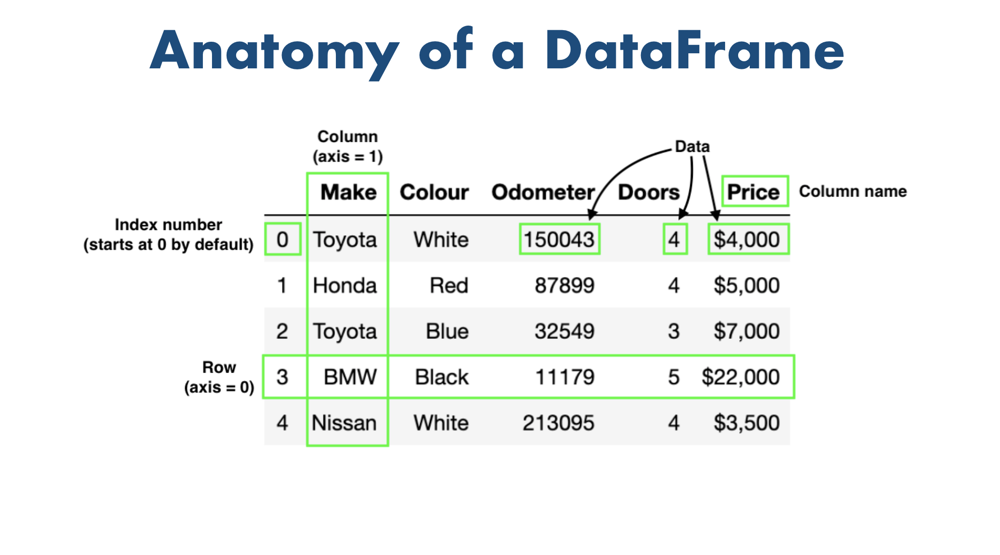

# Pandas

## Introduction

- library for Data Analysis and Manipulation

**Why Pandas?**

- provides ability to work with Tabular data
  - `Tabular Data` : data that is organized into tables having rows and cols


```python
"""
cd .\01pandas\
jupyter nbconvert --to markdown pandas.ipynb --output README.md


"""
import pandas as pd
import numpy as np
import matplotlib.pyplot as plt
from IPython.display import display
import seaborn as sns
from matplotlib_inline.backend_inline import set_matplotlib_formats
set_matplotlib_formats('png')
plt.rcParams.update({
    "figure.facecolor": "white",
    "axes.facecolor": "white",
})

```

## `Series` objects

- A `Series` object is 1D array that can hold/store data.

### Creating a `Series`


```python
l = ["C", "C++", "Python", "Javascript"]
s = pd.Series(l)
s
```


    0             C
    1           C++
    2        Python
    3    Javascript
    dtype: object


#### Init from `dict`


```python
weights = {"a": 68, "b": 83, "c": 86, "d": 68}
s3 = pd.Series(weights)
s3

```


    a    68
    b    83
    c    86
    d    68
    dtype: int64


### Similar to a 1D `ndarray`

`Series` objects behave much like one-dimensional NumPy `ndarray`s, and you can often pass them as parameters to NumPy functions:


```python
import numpy as np

s = pd.Series([2,4,6,8])
np.exp(s)
```


    0       7.389056
    1      54.598150
    2     403.428793
    3    2980.957987
    dtype: float64


Arithmetic operations on `Series` are also possible, and they apply *elementwise*, just like for `ndarray`s:


```python
s + [1000,2000,3000,4000]
```


    0    1002
    1    2004
    2    3006
    3    4008
    dtype: int64


Similar to NumPy, if you add a single number to a `Series`, that number is added to all items in the `Series`. This is called * broadcasting*:


```python
s + 1000
```


    0    1002
    1    1004
    2    1006
    3    1008
    dtype: int64


The same is true for all binary operations such as `*` or `/`, and even conditional operations:


```python
s < 0
```


    0    False
    1    False
    2    False
    3    False
    dtype: bool


### Indexing


```python
s2 = pd.Series(l, index=["a", "b", "c", "d"])
s2
```


    a             C
    b           C++
    c        Python
    d    Javascript
    dtype: object


You can then use the `Series` just like a `dict`:


```python
s2["b"]
```


    'C++'


You can still access the items by integer location, like in a regular array:


```python
s2[1]
```


    'C++'


To make it clear when you are accessing by label or by integer location, it is recommended to always use the `loc` attribute when accessing by label, and the `iloc` attribute when accessing by integer location:


```python
s2.loc["b"]
```


    'C++'


```python
s2.iloc[1]
```


    'C++'


#### Slicing a `Series` also slices the index labels:


```python
s2.iloc[1:3]
```


    b       C++
    c    Python
    dtype: object


This can lead to unexpected results when using the default numeric labels, so be careful:


```python
surprise = pd.Series([1000, 1001, 1002, 1003])
surprise
```


    0    1000
    1    1001
    2    1002
    3    1003
    dtype: int64


```python
surprise_slice = surprise[2:]
surprise_slice
```


    2    1002
    3    1003
    dtype: int64


Oh look! The first element has index label `2`. The element with index label `0` is absent from the slice:


```python
try:
    surprise_slice[0]
except KeyError as e:
    print("Key error:", e)
```

    Key error: 0


But remember that you can access elements by integer location using the `iloc` attribute. This illustrates another reason why it's always better to use `loc` and `iloc` to access `Series` objects:


```python
surprise_slice.iloc[0]
```


    1002


You can create a `Series` object from a `dict`. The keys will be used as index labels:


```python

```


    a    68
    b    83
    c    86
    d    68
    dtype: int64


## `DataFrame` objects

A `DataFrame` is a table. It contains an array of individual entries, each of which has a certain value. Each entry corresponds to a row (or record) and a column.

- A DataFrame object represents a 2d labelled array, with cell values, column names and row index labels
- You can see `DataFrame`s as dictionaries of `Series`.


<div align="center">

</div>

## Creating `DataFrame`

### From Numpy Array


```python
arr = np.random.randint(10,100,size=(6,4))
arr
```


    array([[30, 27, 82, 14],
           [94, 66, 75, 56],
           [53, 19, 72, 20],
           [32, 91, 10, 14],
           [88, 65, 70, 49],
           [31, 57, 27, 95]])


```python
df = pd.DataFrame(data=arr)
df
```


<div>

<table border="1" class="dataframe">
  <thead>
    <tr style="text-align: right;">
      <th></th>
      <th>0</th>
      <th>1</th>
      <th>2</th>
      <th>3</th>
    </tr>
  </thead>
  <tbody>
    <tr>
      <th>0</th>
      <td>30</td>
      <td>27</td>
      <td>82</td>
      <td>14</td>
    </tr>
    <tr>
      <th>1</th>
      <td>94</td>
      <td>66</td>
      <td>75</td>
      <td>56</td>
    </tr>
    <tr>
      <th>2</th>
      <td>53</td>
      <td>19</td>
      <td>72</td>
      <td>20</td>
    </tr>
    <tr>
      <th>3</th>
      <td>32</td>
      <td>91</td>
      <td>10</td>
      <td>14</td>
    </tr>
    <tr>
      <th>4</th>
      <td>88</td>
      <td>65</td>
      <td>70</td>
      <td>49</td>
    </tr>
    <tr>
      <th>5</th>
      <td>31</td>
      <td>57</td>
      <td>27</td>
      <td>95</td>
    </tr>
  </tbody>
</table>
</div>


```python
arr = np.random.randint(10, 100, size=(6, 4))
df = pd.DataFrame(data=arr)
df.columns = ["a", "b", "c", "d"]
df.index = "p q r s t u".split()
df

```


<div>

<table border="1" class="dataframe">
  <thead>
    <tr style="text-align: right;">
      <th></th>
      <th>a</th>
      <th>b</th>
      <th>c</th>
      <th>d</th>
    </tr>
  </thead>
  <tbody>
    <tr>
      <th>p</th>
      <td>19</td>
      <td>51</td>
      <td>72</td>
      <td>11</td>
    </tr>
    <tr>
      <th>q</th>
      <td>92</td>
      <td>26</td>
      <td>88</td>
      <td>15</td>
    </tr>
    <tr>
      <th>r</th>
      <td>68</td>
      <td>10</td>
      <td>90</td>
      <td>14</td>
    </tr>
    <tr>
      <th>s</th>
      <td>46</td>
      <td>61</td>
      <td>37</td>
      <td>41</td>
    </tr>
    <tr>
      <th>t</th>
      <td>12</td>
      <td>78</td>
      <td>48</td>
      <td>93</td>
    </tr>
    <tr>
      <th>u</th>
      <td>29</td>
      <td>28</td>
      <td>17</td>
      <td>40</td>
    </tr>
  </tbody>
</table>
</div>


```python
np.random.seed(5)
arr=np.random.randint(100, size=(5, 5))
df = pd.DataFrame(arr,
				columns=list("ABCDE"),
                index=["R" + str(i) for i in range(5)])
df
```


<div>

<table border="1" class="dataframe">
  <thead>
    <tr style="text-align: right;">
      <th></th>
      <th>A</th>
      <th>B</th>
      <th>C</th>
      <th>D</th>
      <th>E</th>
    </tr>
  </thead>
  <tbody>
    <tr>
      <th>R0</th>
      <td>99</td>
      <td>78</td>
      <td>61</td>
      <td>16</td>
      <td>73</td>
    </tr>
    <tr>
      <th>R1</th>
      <td>8</td>
      <td>62</td>
      <td>27</td>
      <td>30</td>
      <td>80</td>
    </tr>
    <tr>
      <th>R2</th>
      <td>7</td>
      <td>76</td>
      <td>15</td>
      <td>53</td>
      <td>80</td>
    </tr>
    <tr>
      <th>R3</th>
      <td>27</td>
      <td>44</td>
      <td>77</td>
      <td>75</td>
      <td>65</td>
    </tr>
    <tr>
      <th>R4</th>
      <td>47</td>
      <td>30</td>
      <td>84</td>
      <td>86</td>
      <td>18</td>
    </tr>
  </tbody>
</table>
</div>


### 🚀🚀 lists of lists: row wise data


```python
list(np.random.random(3))
```


    [0.4199111706306522, 0.7491701900315496, 0.2603523272964693]


```python
np.random.seed(100)
row1 = ['TeKET'] + list(np.random.random(3))
row2 = ['Yake'] + list(np.random.random(3))
row3 = ['TP'] + list(np.random.random(3))
row4 = ['IFTDF'] + list(np.random.random(3))

values = [
            row1,
            row2,
            row3,
            row4
         ]
d3 = pd.DataFrame(
        values,
        columns=['Model', 'precision', 'recall', 'f1'],
      #   index=["alice", "bob", "charles"]
     )
d3
```


<div>

<table border="1" class="dataframe">
  <thead>
    <tr style="text-align: right;">
      <th></th>
      <th>Model</th>
      <th>precision</th>
      <th>recall</th>
      <th>f1</th>
    </tr>
  </thead>
  <tbody>
    <tr>
      <th>0</th>
      <td>TeKET</td>
      <td>0.543405</td>
      <td>0.278369</td>
      <td>0.424518</td>
    </tr>
    <tr>
      <th>1</th>
      <td>Yake</td>
      <td>0.844776</td>
      <td>0.004719</td>
      <td>0.121569</td>
    </tr>
    <tr>
      <th>2</th>
      <td>TP</td>
      <td>0.670749</td>
      <td>0.825853</td>
      <td>0.136707</td>
    </tr>
    <tr>
      <th>3</th>
      <td>IFTDF</td>
      <td>0.575093</td>
      <td>0.891322</td>
      <td>0.209202</td>
    </tr>
  </tbody>
</table>
</div>


```python
# 🚀 filling missing values with list unpacking
values = [
    [1985, *([None]*3)],
    [1984, 3, *([np.nan] * 2)],
    [1992, 0, np.nan, 112]
]
d4 = pd.DataFrame(
        values,
        columns=["birthyear", "children", "hobby", "weight"],
     )
d4

```


<div>

<table border="1" class="dataframe">
  <thead>
    <tr style="text-align: right;">
      <th></th>
      <th>birthyear</th>
      <th>children</th>
      <th>hobby</th>
      <th>weight</th>
    </tr>
  </thead>
  <tbody>
    <tr>
      <th>0</th>
      <td>1985</td>
      <td>NaN</td>
      <td>NaN</td>
      <td>NaN</td>
    </tr>
    <tr>
      <th>1</th>
      <td>1984</td>
      <td>3.0</td>
      <td>NaN</td>
      <td>NaN</td>
    </tr>
    <tr>
      <th>2</th>
      <td>1992</td>
      <td>0.0</td>
      <td>NaN</td>
      <td>112.0</td>
    </tr>
  </tbody>
</table>
</div>


### dict of narray/lists

To specify missing values, you can either use `np.nan` or NumPy's masked arrays:

Instead of an `ndarray`, you can also pass a `DataFrame` object:


```python
data = {'Name': ['Tom', 'nick', 'jhon', 'jack'],
        'Age': [20, 21, 19, 18]}

df = pd.DataFrame(data)

df

```


<div>

<table border="1" class="dataframe">
  <thead>
    <tr style="text-align: right;">
      <th></th>
      <th>Name</th>
      <th>Age</th>
    </tr>
  </thead>
  <tbody>
    <tr>
      <th>0</th>
      <td>Tom</td>
      <td>20</td>
    </tr>
    <tr>
      <th>1</th>
      <td>nick</td>
      <td>21</td>
    </tr>
    <tr>
      <th>2</th>
      <td>jhon</td>
      <td>19</td>
    </tr>
    <tr>
      <th>3</th>
      <td>jack</td>
      <td>18</td>
    </tr>
  </tbody>
</table>
</div>


### 🚀🚀list of dicts: column wise data


```python
data = [{'a': 1, 'b': 2, 'c': 3},
        {'a': 10, 'b': 20, 'c': 30}]

# Creates DataFrame.
df = pd.DataFrame(data)

# Print the data
df

```


<div>

<table border="1" class="dataframe">
  <thead>
    <tr style="text-align: right;">
      <th></th>
      <th>a</th>
      <th>b</th>
      <th>c</th>
    </tr>
  </thead>
  <tbody>
    <tr>
      <th>0</th>
      <td>1</td>
      <td>2</td>
      <td>3</td>
    </tr>
    <tr>
      <th>1</th>
      <td>10</td>
      <td>20</td>
      <td>30</td>
    </tr>
  </tbody>
</table>
</div>


### 🚀using `zip()`; list of tuple

Two lists can be merged by using `list(zip())` function.


```python
# List1
Name = ['tom', 'jhon', 'nick', 'juli']

# List2
Age = [25, 30, 26, 22]

# get the list of tuples from two lists.
# and merge them by using zip().
list_of_tuples = list(zip(Name, Age))
print(list_of_tuples)

# Assign data to tuples.
list_of_tuples


# Converting lists of tuples into
# pandas Dataframe.
df = pd.DataFrame(list_of_tuples,
                  columns=['Name', 'Age'])

# Print data.
df

```

    [('tom', 25), ('jhon', 30), ('nick', 26), ('juli', 22)]


<div>

<table border="1" class="dataframe">
  <thead>
    <tr style="text-align: right;">
      <th></th>
      <th>Name</th>
      <th>Age</th>
    </tr>
  </thead>
  <tbody>
    <tr>
      <th>0</th>
      <td>tom</td>
      <td>25</td>
    </tr>
    <tr>
      <th>1</th>
      <td>jhon</td>
      <td>30</td>
    </tr>
    <tr>
      <th>2</th>
      <td>nick</td>
      <td>26</td>
    </tr>
    <tr>
      <th>3</th>
      <td>juli</td>
      <td>22</td>
    </tr>
  </tbody>
</table>
</div>


### Dicts of series.


```python
d = {'one': pd.Series([10, 20, 30, 40],
                      index=['a', 'b', 'c', 'd']),
     'two': pd.Series([10, 20, 30, 40],
                      index=['a', 'b', 'c', 'd'])}

# creates Dataframe.
df = pd.DataFrame(d)

# print the data.
df

```


<div>

<table border="1" class="dataframe">
  <thead>
    <tr style="text-align: right;">
      <th></th>
      <th>one</th>
      <th>two</th>
    </tr>
  </thead>
  <tbody>
    <tr>
      <th>a</th>
      <td>10</td>
      <td>10</td>
    </tr>
    <tr>
      <th>b</th>
      <td>20</td>
      <td>20</td>
    </tr>
    <tr>
      <th>c</th>
      <td>30</td>
      <td>30</td>
    </tr>
    <tr>
      <th>d</th>
      <td>40</td>
      <td>40</td>
    </tr>
  </tbody>
</table>
</div>


## Saving & loading files

Pandas can save `DataFrame`s to various backends, including file formats such as CSV, Excel, JSON, HTML and HDF5, or to a SQL database. Let's create a `DataFrame` to demonstrate this:


```python
df = pd.DataFrame({
	"id":np.arange(10),
	'b':np.random.normal(size=10),
	"c":pd.Series(np.random.choice(["cat",'dog',"hippo"],replace=True,size=10))
})
df.head()
```


<div>

<table border="1" class="dataframe">
  <thead>
    <tr style="text-align: right;">
      <th></th>
      <th>id</th>
      <th>b</th>
      <th>c</th>
    </tr>
  </thead>
  <tbody>
    <tr>
      <th>0</th>
      <td>0</td>
      <td>0.212280</td>
      <td>cat</td>
    </tr>
    <tr>
      <th>1</th>
      <td>1</td>
      <td>0.492354</td>
      <td>hippo</td>
    </tr>
    <tr>
      <th>2</th>
      <td>2</td>
      <td>1.667453</td>
      <td>dog</td>
    </tr>
    <tr>
      <th>3</th>
      <td>3</td>
      <td>-1.904760</td>
      <td>cat</td>
    </tr>
    <tr>
      <th>4</th>
      <td>4</td>
      <td>-0.520301</td>
      <td>hippo</td>
    </tr>
  </tbody>
</table>
</div>


### Saving: creating new file


Let's save it to CSV, HTML and JSON:


```python
df.to_csv("my_df.csv")
df.to_csv("my_df_index_false.csv", index=False)
df.to_html("my_df.html")
df.to_json("my_df.json")

```

### Saving: Append to Existing File


```python
data = {
    'Name': [ 'Bob', 'Jessica', 'Mary'],
    'Run': [50, 63, 15],
    'Wicket': [0, 2, 3],
    'Catch': [4, 2, 1]
}

# Make data frame of above data
df = pd.DataFrame(data)

# append data frame to CSV file
df.to_csv('d.csv', mode='a', index=False, header=False)
```

### Loading

Now let's load our CSV file back into a `DataFrame`:

- Loading from file saved without `index=False`


```python
my_df_loaded = pd.read_csv("my_df.csv")
my_df_loaded.head()
```


<div>

<table border="1" class="dataframe">
  <thead>
    <tr style="text-align: right;">
      <th></th>
      <th>Unnamed: 0</th>
      <th>id</th>
      <th>b</th>
      <th>c</th>
    </tr>
  </thead>
  <tbody>
    <tr>
      <th>0</th>
      <td>0</td>
      <td>0</td>
      <td>1.106266</td>
      <td>hippo</td>
    </tr>
    <tr>
      <th>1</th>
      <td>1</td>
      <td>1</td>
      <td>-1.612778</td>
      <td>cat</td>
    </tr>
    <tr>
      <th>2</th>
      <td>2</td>
      <td>2</td>
      <td>-0.264879</td>
      <td>cat</td>
    </tr>
    <tr>
      <th>3</th>
      <td>3</td>
      <td>3</td>
      <td>-0.213137</td>
      <td>cat</td>
    </tr>
    <tr>
      <th>4</th>
      <td>4</td>
      <td>4</td>
      <td>-0.184308</td>
      <td>hippo</td>
    </tr>
  </tbody>
</table>
</div>


- Loading from file saved with `index=False`


```python
my_df_loaded_index_false = pd.read_csv("my_df_index_false.csv")
my_df_loaded_index_false.head()
```


<div>

<table border="1" class="dataframe">
  <thead>
    <tr style="text-align: right;">
      <th></th>
      <th>id</th>
      <th>b</th>
      <th>c</th>
    </tr>
  </thead>
  <tbody>
    <tr>
      <th>0</th>
      <td>0</td>
      <td>1.106266</td>
      <td>hippo</td>
    </tr>
    <tr>
      <th>1</th>
      <td>1</td>
      <td>-1.612778</td>
      <td>cat</td>
    </tr>
    <tr>
      <th>2</th>
      <td>2</td>
      <td>-0.264879</td>
      <td>cat</td>
    </tr>
    <tr>
      <th>3</th>
      <td>3</td>
      <td>-0.213137</td>
      <td>cat</td>
    </tr>
    <tr>
      <th>4</th>
      <td>4</td>
      <td>-0.184308</td>
      <td>hippo</td>
    </tr>
  </tbody>
</table>
</div>


- Loading from file saved without `index=False`, without `Unnamed: 0` column

The `pd.read_csv()` function is well-endowed, with over 30 optional parameters you can specify. For example, you can see in this dataset that the CSV file has a built-in index, which pandas did not pick up on automatically. To make pandas use that column for the index (instead of creating a new one from scratch), we can specify an `index_col`.


```python
my_df_loaded = pd.read_csv("my_df.csv",index_col=0)
my_df_loaded.head()
```


<div>

<table border="1" class="dataframe">
  <thead>
    <tr style="text-align: right;">
      <th></th>
      <th>id</th>
      <th>b</th>
      <th>c</th>
    </tr>
  </thead>
  <tbody>
    <tr>
      <th>0</th>
      <td>0</td>
      <td>1.106266</td>
      <td>hippo</td>
    </tr>
    <tr>
      <th>1</th>
      <td>1</td>
      <td>-1.612778</td>
      <td>cat</td>
    </tr>
    <tr>
      <th>2</th>
      <td>2</td>
      <td>-0.264879</td>
      <td>cat</td>
    </tr>
    <tr>
      <th>3</th>
      <td>3</td>
      <td>-0.213137</td>
      <td>cat</td>
    </tr>
    <tr>
      <th>4</th>
      <td>4</td>
      <td>-0.184308</td>
      <td>hippo</td>
    </tr>
  </tbody>
</table>
</div>


- Or Dropping "Unnamed: 0" Column


```python
my_df_loaded = pd.read_csv("my_df.csv")
my_df_loaded = my_df_loaded.drop(columns=['Unnamed: 0'])
my_df_loaded.head()

```


<div>

<table border="1" class="dataframe">
  <thead>
    <tr style="text-align: right;">
      <th></th>
      <th>id</th>
      <th>b</th>
      <th>c</th>
    </tr>
  </thead>
  <tbody>
    <tr>
      <th>0</th>
      <td>0</td>
      <td>1.106266</td>
      <td>hippo</td>
    </tr>
    <tr>
      <th>1</th>
      <td>1</td>
      <td>-1.612778</td>
      <td>cat</td>
    </tr>
    <tr>
      <th>2</th>
      <td>2</td>
      <td>-0.264879</td>
      <td>cat</td>
    </tr>
    <tr>
      <th>3</th>
      <td>3</td>
      <td>-0.213137</td>
      <td>cat</td>
    </tr>
    <tr>
      <th>4</th>
      <td>4</td>
      <td>-0.184308</td>
      <td>hippo</td>
    </tr>
  </tbody>
</table>
</div>


As you might guess, there are similar `read_json`, `read_html`, `read_excel` functions as well.  We can also read data straight from the Internet. For example, let's load the top 1,000 U.S. cities from github:


```python
us_cities = None
try:
    csv_url = "https://raw.githubusercontent.com/plotly/datasets/master/us-cities-top-1k.csv"
    us_cities = pd.read_csv(csv_url, index_col=0)
    us_cities = us_cities.head()
except IOError as e:
    print(e)
us_cities
```


<div>

<table border="1" class="dataframe">
  <thead>
    <tr style="text-align: right;">
      <th></th>
      <th>State</th>
      <th>Population</th>
      <th>lat</th>
      <th>lon</th>
    </tr>
    <tr>
      <th>City</th>
      <th></th>
      <th></th>
      <th></th>
      <th></th>
    </tr>
  </thead>
  <tbody>
    <tr>
      <th>Marysville</th>
      <td>Washington</td>
      <td>63269</td>
      <td>48.051764</td>
      <td>-122.177082</td>
    </tr>
    <tr>
      <th>Perris</th>
      <td>California</td>
      <td>72326</td>
      <td>33.782519</td>
      <td>-117.228648</td>
    </tr>
    <tr>
      <th>Cleveland</th>
      <td>Ohio</td>
      <td>390113</td>
      <td>41.499320</td>
      <td>-81.694361</td>
    </tr>
    <tr>
      <th>Worcester</th>
      <td>Massachusetts</td>
      <td>182544</td>
      <td>42.262593</td>
      <td>-71.802293</td>
    </tr>
    <tr>
      <th>Columbia</th>
      <td>South Carolina</td>
      <td>133358</td>
      <td>34.000710</td>
      <td>-81.034814</td>
    </tr>
  </tbody>
</table>
</div>


### Minimize the size of Large DataSet; `nrows=n`

[wine-reviews-dataset](https://www.kaggle.com/zynicide/wine-reviews)


```python
data = pd.read_csv('winemag-data-130k-v2.csv')
print(f"Pre Shape : {data.shape}")
# read only first 100 rows
data = pd.read_csv('winemag-data-130k-v2.csv', nrows=100, index_col=0)
data.head(n=2)
```

    Pre Shape : (129971, 14)


<div>

<table border="1" class="dataframe">
  <thead>
    <tr style="text-align: right;">
      <th></th>
      <th>country</th>
      <th>description</th>
      <th>designation</th>
      <th>points</th>
      <th>price</th>
      <th>province</th>
      <th>region_1</th>
      <th>region_2</th>
      <th>taster_name</th>
      <th>taster_twitter_handle</th>
      <th>title</th>
      <th>variety</th>
      <th>winery</th>
    </tr>
  </thead>
  <tbody>
    <tr>
      <th>0</th>
      <td>Italy</td>
      <td>Aromas include tropical fruit, broom, brimston...</td>
      <td>Vulkà Bianco</td>
      <td>87</td>
      <td>NaN</td>
      <td>Sicily &amp; Sardinia</td>
      <td>Etna</td>
      <td>NaN</td>
      <td>Kerin O’Keefe</td>
      <td>@kerinokeefe</td>
      <td>Nicosia 2013 Vulkà Bianco  (Etna)</td>
      <td>White Blend</td>
      <td>Nicosia</td>
    </tr>
    <tr>
      <th>1</th>
      <td>Portugal</td>
      <td>This is ripe and fruity, a wine that is smooth...</td>
      <td>Avidagos</td>
      <td>87</td>
      <td>15.0</td>
      <td>Douro</td>
      <td>NaN</td>
      <td>NaN</td>
      <td>Roger Voss</td>
      <td>@vossroger</td>
      <td>Quinta dos Avidagos 2011 Avidagos Red (Douro)</td>
      <td>Portuguese Red</td>
      <td>Quinta dos Avidagos</td>
    </tr>
  </tbody>
</table>
</div>


```python
# Save the dataframe to a csv file
data.to_csv("winemag-data-130k-v2-mod.csv")
```

### 🔥Load All Csv Files In A Folder

Read all csv files in a folder and process them one by one:


```python
import glob
import os
all_files = glob.glob("data/reports/*.csv")
for file in all_files:
		reviewer = os.path.basename(file).split(".")[0]
		print(reviewer)
		report = pd.read_csv(file)
		# generate_report_plot(report,reviewer,with_similarity_threshold=True)
```

Read all csv files in a folder and combine them into a single dataframe:


```python
import glob
import os
all_files = glob.glob("animals/*.csv")
df = pd. concat((pd.read_csv(f) for f in all_files))
df
```

Without `glob`, you would have to manually list all the files you want to read:


```python
folder = "example_folder"
files = [x for x in os.listdir(folder) if x.endswith(".csv")]
# get full path
files = [os.path.join(folder, x) for x in files]
files[0]
```


## Edit Whole Row/Columns

- [https://www.geeksforgeeks.org/adding-new-column-to-existing-dataframe-in-pandas/](https://www.geeksforgeeks.org/adding-new-column-to-existing-dataframe-in-pandas/)

###  Adding Columns


```python
df = pd.DataFrame({
    "a": [1, 2, 3, 4],
    "b": ["Bob", "Alice", "Bob", "Alice"],
})
df
```


<div>

<table border="1" class="dataframe">
  <thead>
    <tr style="text-align: right;">
      <th></th>
      <th>a</th>
      <th>b</th>
    </tr>
  </thead>
  <tbody>
    <tr>
      <th>0</th>
      <td>1</td>
      <td>Bob</td>
    </tr>
    <tr>
      <th>1</th>
      <td>2</td>
      <td>Alice</td>
    </tr>
    <tr>
      <th>2</th>
      <td>3</td>
      <td>Bob</td>
    </tr>
    <tr>
      <th>3</th>
      <td>4</td>
      <td>Alice</td>
    </tr>
  </tbody>
</table>
</div>


#### `d['new_col'] = list()`


```python
# df['c'] = [1, 2, 3, 4,5] # not valid
# df['c'] = [1, 2, 3] # not valid
df['c'] = [1, 2, 3, 4]
df
```


<div>

<table border="1" class="dataframe">
  <thead>
    <tr style="text-align: right;">
      <th></th>
      <th>a</th>
      <th>b</th>
      <th>c</th>
    </tr>
  </thead>
  <tbody>
    <tr>
      <th>0</th>
      <td>1</td>
      <td>Bob</td>
      <td>1</td>
    </tr>
    <tr>
      <th>1</th>
      <td>2</td>
      <td>Alice</td>
      <td>2</td>
    </tr>
    <tr>
      <th>2</th>
      <td>3</td>
      <td>Bob</td>
      <td>3</td>
    </tr>
    <tr>
      <th>3</th>
      <td>4</td>
      <td>Alice</td>
      <td>4</td>
    </tr>
  </tbody>
</table>
</div>


#### `d['new_col'] = constant`


```python
df['d'] = np.nan
df
```


<div>

<table border="1" class="dataframe">
  <thead>
    <tr style="text-align: right;">
      <th></th>
      <th>a</th>
      <th>b</th>
      <th>c</th>
      <th>d</th>
    </tr>
  </thead>
  <tbody>
    <tr>
      <th>0</th>
      <td>1</td>
      <td>Bob</td>
      <td>1</td>
      <td>NaN</td>
    </tr>
    <tr>
      <th>1</th>
      <td>2</td>
      <td>Alice</td>
      <td>2</td>
      <td>NaN</td>
    </tr>
    <tr>
      <th>2</th>
      <td>3</td>
      <td>Bob</td>
      <td>3</td>
      <td>NaN</td>
    </tr>
    <tr>
      <th>3</th>
      <td>4</td>
      <td>Alice</td>
      <td>4</td>
      <td>NaN</td>
    </tr>
  </tbody>
</table>
</div>


```python
df['d'] = None
df
```


<div>

<table border="1" class="dataframe">
  <thead>
    <tr style="text-align: right;">
      <th></th>
      <th>a</th>
      <th>b</th>
      <th>c</th>
      <th>d</th>
    </tr>
  </thead>
  <tbody>
    <tr>
      <th>0</th>
      <td>1</td>
      <td>Bob</td>
      <td>1</td>
      <td>None</td>
    </tr>
    <tr>
      <th>1</th>
      <td>2</td>
      <td>Alice</td>
      <td>2</td>
      <td>None</td>
    </tr>
    <tr>
      <th>2</th>
      <td>3</td>
      <td>Bob</td>
      <td>3</td>
      <td>None</td>
    </tr>
    <tr>
      <th>3</th>
      <td>4</td>
      <td>Alice</td>
      <td>4</td>
      <td>None</td>
    </tr>
  </tbody>
</table>
</div>


#### `d['new_col'] = range(len(d))`


```python
df['d'] = range(len(df))
df

```


<div>

<table border="1" class="dataframe">
  <thead>
    <tr style="text-align: right;">
      <th></th>
      <th>a</th>
      <th>b</th>
      <th>c</th>
      <th>d</th>
    </tr>
  </thead>
  <tbody>
    <tr>
      <th>0</th>
      <td>1</td>
      <td>Bob</td>
      <td>1</td>
      <td>0</td>
    </tr>
    <tr>
      <th>1</th>
      <td>2</td>
      <td>Alice</td>
      <td>2</td>
      <td>1</td>
    </tr>
    <tr>
      <th>2</th>
      <td>3</td>
      <td>Bob</td>
      <td>3</td>
      <td>2</td>
    </tr>
    <tr>
      <th>3</th>
      <td>4</td>
      <td>Alice</td>
      <td>4</td>
      <td>3</td>
    </tr>
  </tbody>
</table>
</div>


```python
df['d'] = [None]*len(df)
df

```


<div>

<table border="1" class="dataframe">
  <thead>
    <tr style="text-align: right;">
      <th></th>
      <th>a</th>
      <th>b</th>
      <th>c</th>
      <th>d</th>
    </tr>
  </thead>
  <tbody>
    <tr>
      <th>0</th>
      <td>1</td>
      <td>Bob</td>
      <td>1</td>
      <td>None</td>
    </tr>
    <tr>
      <th>1</th>
      <td>2</td>
      <td>Alice</td>
      <td>2</td>
      <td>None</td>
    </tr>
    <tr>
      <th>2</th>
      <td>3</td>
      <td>Bob</td>
      <td>3</td>
      <td>None</td>
    </tr>
    <tr>
      <th>3</th>
      <td>4</td>
      <td>Alice</td>
      <td>4</td>
      <td>None</td>
    </tr>
  </tbody>
</table>
</div>


#### `d['new_col'] = d['col1'] + d['col2']` from existing columns


```python
df['e'] = df['a'] + df['c']
df
```


<div>

<table border="1" class="dataframe">
  <thead>
    <tr style="text-align: right;">
      <th></th>
      <th>a</th>
      <th>b</th>
      <th>c</th>
      <th>d</th>
      <th>e</th>
    </tr>
  </thead>
  <tbody>
    <tr>
      <th>0</th>
      <td>1</td>
      <td>Bob</td>
      <td>1</td>
      <td>0</td>
      <td>2</td>
    </tr>
    <tr>
      <th>1</th>
      <td>2</td>
      <td>Alice</td>
      <td>2</td>
      <td>1</td>
      <td>4</td>
    </tr>
    <tr>
      <th>2</th>
      <td>3</td>
      <td>Bob</td>
      <td>3</td>
      <td>2</td>
      <td>6</td>
    </tr>
    <tr>
      <th>3</th>
      <td>4</td>
      <td>Alice</td>
      <td>4</td>
      <td>3</td>
      <td>8</td>
    </tr>
  </tbody>
</table>
</div>


more:

- [Create a new column in Pandas DataFrame based on the existing columns](https://www.geeksforgeeks.org/create-a-new-column-in-pandas-dataframe-based-on-the-existing-columns/?ref=lbp)
- [Creating a Pandas dataframe column based on a given condition](https://www.geeksforgeeks.org/python-creating-a-pandas-dataframe-column-based-on-a-given-condition/?ref=lbp)

#### `insert(position,column,value)`

When adding a new column, it is added at the end (on the right) by default. You can also insert a column anywhere else using the `insert()` method:


```python
df.insert(1, "i", range(len(df)))
df
```


<div>

<table border="1" class="dataframe">
  <thead>
    <tr style="text-align: right;">
      <th></th>
      <th>a</th>
      <th>i</th>
      <th>b</th>
      <th>c</th>
      <th>d</th>
    </tr>
  </thead>
  <tbody>
    <tr>
      <th>0</th>
      <td>1</td>
      <td>0</td>
      <td>Bob</td>
      <td>1</td>
      <td>None</td>
    </tr>
    <tr>
      <th>1</th>
      <td>2</td>
      <td>1</td>
      <td>Alice</td>
      <td>2</td>
      <td>None</td>
    </tr>
    <tr>
      <th>2</th>
      <td>3</td>
      <td>2</td>
      <td>Bob</td>
      <td>3</td>
      <td>None</td>
    </tr>
    <tr>
      <th>3</th>
      <td>4</td>
      <td>3</td>
      <td>Alice</td>
      <td>4</td>
      <td>None</td>
    </tr>
  </tbody>
</table>
</div>


#### `assign(new_col,value)`

This method will create a new dataframe with a new column added to the old dataframe. Note that this returns a new `DataFrame` object, **the original is not modified:**


```python
df2 = df.assign(new=range(len(df)))
df2

```


<div>

<table border="1" class="dataframe">
  <thead>
    <tr style="text-align: right;">
      <th></th>
      <th>a</th>
      <th>i</th>
      <th>b</th>
      <th>c</th>
      <th>d</th>
      <th>new</th>
    </tr>
  </thead>
  <tbody>
    <tr>
      <th>0</th>
      <td>1</td>
      <td>0</td>
      <td>Bob</td>
      <td>1</td>
      <td>NaN</td>
      <td>0</td>
    </tr>
    <tr>
      <th>1</th>
      <td>2</td>
      <td>1</td>
      <td>Alice</td>
      <td>2</td>
      <td>NaN</td>
      <td>1</td>
    </tr>
    <tr>
      <th>2</th>
      <td>3</td>
      <td>2</td>
      <td>Bob</td>
      <td>3</td>
      <td>NaN</td>
      <td>2</td>
    </tr>
    <tr>
      <th>3</th>
      <td>4</td>
      <td>3</td>
      <td>Alice</td>
      <td>4</td>
      <td>NaN</td>
      <td>3</td>
    </tr>
  </tbody>
</table>
</div>


Note that you cannot access columns created within the same assignment:

### Moving Columns Position


```python
import numpy as np
import pandas as pd

df = pd.DataFrame(np.random.rand(5, 3))
df['mean'] = df.mean(1)
df
```


<div>

<table border="1" class="dataframe">
  <thead>
    <tr style="text-align: right;">
      <th></th>
      <th>0</th>
      <th>1</th>
      <th>2</th>
      <th>mean</th>
    </tr>
  </thead>
  <tbody>
    <tr>
      <th>0</th>
      <td>0.016342</td>
      <td>0.861809</td>
      <td>0.225315</td>
      <td>0.367822</td>
    </tr>
    <tr>
      <th>1</th>
      <td>0.226359</td>
      <td>0.728893</td>
      <td>0.477359</td>
      <td>0.477537</td>
    </tr>
    <tr>
      <th>2</th>
      <td>0.623582</td>
      <td>0.774813</td>
      <td>0.920502</td>
      <td>0.772966</td>
    </tr>
    <tr>
      <th>3</th>
      <td>0.950771</td>
      <td>0.064937</td>
      <td>0.622619</td>
      <td>0.546109</td>
    </tr>
    <tr>
      <th>4</th>
      <td>0.392424</td>
      <td>0.147109</td>
      <td>0.299565</td>
      <td>0.279699</td>
    </tr>
  </tbody>
</table>
</div>


```python
popped_col = df.pop('mean')
df.insert(0, 'mean', popped_col)
df
```


<div>

<table border="1" class="dataframe">
  <thead>
    <tr style="text-align: right;">
      <th></th>
      <th>mean</th>
      <th>0</th>
      <th>1</th>
      <th>2</th>
    </tr>
  </thead>
  <tbody>
    <tr>
      <th>0</th>
      <td>0.367822</td>
      <td>0.016342</td>
      <td>0.861809</td>
      <td>0.225315</td>
    </tr>
    <tr>
      <th>1</th>
      <td>0.477537</td>
      <td>0.226359</td>
      <td>0.728893</td>
      <td>0.477359</td>
    </tr>
    <tr>
      <th>2</th>
      <td>0.772966</td>
      <td>0.623582</td>
      <td>0.774813</td>
      <td>0.920502</td>
    </tr>
    <tr>
      <th>3</th>
      <td>0.546109</td>
      <td>0.950771</td>
      <td>0.064937</td>
      <td>0.622619</td>
    </tr>
    <tr>
      <th>4</th>
      <td>0.279699</td>
      <td>0.392424</td>
      <td>0.147109</td>
      <td>0.299565</td>
    </tr>
  </tbody>
</table>
</div>


```python
df.insert(0, 'mean', df.pop('mean'))
df
```


<div>

<table border="1" class="dataframe">
  <thead>
    <tr style="text-align: right;">
      <th></th>
      <th>mean</th>
      <th>0</th>
      <th>1</th>
      <th>2</th>
    </tr>
  </thead>
  <tbody>
    <tr>
      <th>0</th>
      <td>0.367822</td>
      <td>0.016342</td>
      <td>0.861809</td>
      <td>0.225315</td>
    </tr>
    <tr>
      <th>1</th>
      <td>0.477537</td>
      <td>0.226359</td>
      <td>0.728893</td>
      <td>0.477359</td>
    </tr>
    <tr>
      <th>2</th>
      <td>0.772966</td>
      <td>0.623582</td>
      <td>0.774813</td>
      <td>0.920502</td>
    </tr>
    <tr>
      <th>3</th>
      <td>0.546109</td>
      <td>0.950771</td>
      <td>0.064937</td>
      <td>0.622619</td>
    </tr>
    <tr>
      <th>4</th>
      <td>0.279699</td>
      <td>0.392424</td>
      <td>0.147109</td>
      <td>0.299565</td>
    </tr>
  </tbody>
</table>
</div>


### Adding/Appending Rows

- [https://www.geeksforgeeks.org/how-to-add-one-row-in-an-existing-pandas-dataframe/](https://www.geeksforgeeks.org/how-to-add-one-row-in-an-existing-pandas-dataframe/)
 - [https://www.geeksforgeeks.org/how-to-append-a-list-as-a-row-to-a-pandas-dataframe-in-python/](https://www.geeksforgeeks.org/how-to-append-a-list-as-a-row-to-a-pandas-dataframe-in-python/)

#### `append()` [deprecated]


```python
employees.append({"Name":"Berkay","Department":"Finance","Income":6000,"Age":24},ignore_index=True)
```

    C:\Users\soiko\AppData\Local\Temp\ipykernel_924\3498463607.py:1: FutureWarning: The frame.append method is deprecated and will be removed from pandas in a future version. Use pandas.concat instead.
      employees.append({"Name":"Berkay","Department":"Finance","Income":6000,"Age":24},ignore_index=True)


<div>

<table border="1" class="dataframe">
  <thead>
    <tr style="text-align: right;">
      <th></th>
      <th>Name</th>
      <th>Department</th>
      <th>Income</th>
      <th>Age</th>
    </tr>
  </thead>
  <tbody>
    <tr>
      <th>0</th>
      <td>Josh</td>
      <td>IT</td>
      <td>4800</td>
      <td>24</td>
    </tr>
    <tr>
      <th>1</th>
      <td>Mike</td>
      <td>Human Resources</td>
      <td>5200</td>
      <td>28</td>
    </tr>
    <tr>
      <th>2</th>
      <td>Julia</td>
      <td>Finance</td>
      <td>6600</td>
      <td>33</td>
    </tr>
    <tr>
      <th>3</th>
      <td>Sergio</td>
      <td>Supply Chain</td>
      <td>5700</td>
      <td>41</td>
    </tr>
    <tr>
      <th>4</th>
      <td>Berkay</td>
      <td>Finance</td>
      <td>6000</td>
      <td>24</td>
    </tr>
  </tbody>
</table>
</div>


#### 🌰 `concat()`


```python
# appending to an empty dataframe
# output = pd.DataFrame()
# or
# output = pd.DataFrame(columns=["Name","Department","Income","Age"])
# or
# append to an existing dataframe
# output = pd.DataFrame({"Name":["Josh","Mike","Julia"],
#                           "Department":["IT","Human Resources","Finance"],
#                           "Income":[4800,5200,6600],
#                           "Age":[24,28,33]})
# output
```


```python
output = pd.DataFrame()
# data
dictionary = {"Name": "Berkay", "Department": "Finance", "Income": 6000, "Age": 24}
df_dictionary = pd.DataFrame([dictionary])
# append
output = pd.concat([output, df_dictionary], ignore_index=True)
output
```


<div>

<table border="1" class="dataframe">
  <thead>
    <tr style="text-align: right;">
      <th></th>
      <th>Name</th>
      <th>Department</th>
      <th>Income</th>
      <th>Age</th>
    </tr>
  </thead>
  <tbody>
    <tr>
      <th>0</th>
      <td>Berkay</td>
      <td>Finance</td>
      <td>6000</td>
      <td>24</td>
    </tr>
  </tbody>
</table>
</div>


#### `loc()` - dict


```python
n = { "Ex": "loc() dict", "value": 10 }
# df.loc[len(df.index)] = n
# or
df.loc[df.shape[0]] = n

display(df)

```


<div>

<table border="1" class="dataframe">
  <thead>
    <tr style="text-align: right;">
      <th></th>
      <th>Ex</th>
      <th>value</th>
    </tr>
  </thead>
  <tbody>
    <tr>
      <th>0</th>
      <td>A</td>
      <td>87</td>
    </tr>
    <tr>
      <th>1</th>
      <td>B</td>
      <td>91</td>
    </tr>
    <tr>
      <th>2</th>
      <td>C</td>
      <td>97</td>
    </tr>
    <tr>
      <th>3</th>
      <td>A</td>
      <td>95</td>
    </tr>
    <tr>
      <th>4</th>
      <td>append() dict</td>
      <td>10</td>
    </tr>
    <tr>
      <th>5</th>
      <td>append() list</td>
      <td>25</td>
    </tr>
    <tr>
      <th>6</th>
      <td>loc() dict</td>
      <td>10</td>
    </tr>
  </tbody>
</table>
</div>


#### `loc()` - list


```python
# New list for append into df
l = ["loc() list", 25]

# using loc methods
df.loc[len(df)] = l

# display
display(df)
```


<div>

<table border="1" class="dataframe">
  <thead>
    <tr style="text-align: right;">
      <th></th>
      <th>Ex</th>
      <th>value</th>
    </tr>
  </thead>
  <tbody>
    <tr>
      <th>0</th>
      <td>A</td>
      <td>87</td>
    </tr>
    <tr>
      <th>1</th>
      <td>B</td>
      <td>91</td>
    </tr>
    <tr>
      <th>2</th>
      <td>C</td>
      <td>97</td>
    </tr>
    <tr>
      <th>3</th>
      <td>A</td>
      <td>95</td>
    </tr>
    <tr>
      <th>4</th>
      <td>append() dict</td>
      <td>10</td>
    </tr>
    <tr>
      <th>5</th>
      <td>append() list</td>
      <td>25</td>
    </tr>
    <tr>
      <th>6</th>
      <td>loc() dict</td>
      <td>10</td>
    </tr>
    <tr>
      <th>7</th>
      <td>loc() list</td>
      <td>25</td>
    </tr>
  </tbody>
</table>
</div>


#### `iloc[]` - list


```python
df.iloc[2] = ["iloc() list", 25]
display(df)
```


<div>

<table border="1" class="dataframe">
  <thead>
    <tr style="text-align: right;">
      <th></th>
      <th>Ex</th>
      <th>value</th>
    </tr>
  </thead>
  <tbody>
    <tr>
      <th>0</th>
      <td>A</td>
      <td>87</td>
    </tr>
    <tr>
      <th>1</th>
      <td>B</td>
      <td>91</td>
    </tr>
    <tr>
      <th>2</th>
      <td>iloc() list</td>
      <td>25</td>
    </tr>
    <tr>
      <th>3</th>
      <td>A</td>
      <td>95</td>
    </tr>
    <tr>
      <th>4</th>
      <td>append() dict</td>
      <td>10</td>
    </tr>
    <tr>
      <th>5</th>
      <td>append() list</td>
      <td>25</td>
    </tr>
    <tr>
      <th>6</th>
      <td>loc() dict</td>
      <td>10</td>
    </tr>
    <tr>
      <th>7</th>
      <td>loc() list</td>
      <td>25</td>
    </tr>
  </tbody>
</table>
</div>


### Combine Pd Dataframes /Py dict to Pd Dataframe

- [https://realpython.com/pandas-merge-join-and-concat/](https://realpython.com/pandas-merge-join-and-concat/)

#### `concat()`


```python
df1 = pd.DataFrame({'id': ['A01', 'A02', 'A03', 'A04'],
                    'Name': ['ABC', 'PQR', 'DEF', 'GHI']})
df2 = pd.DataFrame({'id': ['B05', 'B06', 'B07', 'B08'],
                    'Name': ['XYZ', 'TUV', 'MNO', 'JKL']})
frames = [df1, df2]
pd.concat(frames)
```


<div>

<table border="1" class="dataframe">
  <thead>
    <tr style="text-align: right;">
      <th></th>
      <th>id</th>
      <th>Name</th>
    </tr>
  </thead>
  <tbody>
    <tr>
      <th>0</th>
      <td>A01</td>
      <td>ABC</td>
    </tr>
    <tr>
      <th>1</th>
      <td>A02</td>
      <td>PQR</td>
    </tr>
    <tr>
      <th>2</th>
      <td>A03</td>
      <td>DEF</td>
    </tr>
    <tr>
      <th>3</th>
      <td>A04</td>
      <td>GHI</td>
    </tr>
    <tr>
      <th>0</th>
      <td>B05</td>
      <td>XYZ</td>
    </tr>
    <tr>
      <th>1</th>
      <td>B06</td>
      <td>TUV</td>
    </tr>
    <tr>
      <th>2</th>
      <td>B07</td>
      <td>MNO</td>
    </tr>
    <tr>
      <th>3</th>
      <td>B08</td>
      <td>JKL</td>
    </tr>
  </tbody>
</table>
</div>


```python
pd.concat(frames,ignore_index = True)
```


<div>

<table border="1" class="dataframe">
  <thead>
    <tr style="text-align: right;">
      <th></th>
      <th>id</th>
      <th>Name</th>
    </tr>
  </thead>
  <tbody>
    <tr>
      <th>0</th>
      <td>A01</td>
      <td>ABC</td>
    </tr>
    <tr>
      <th>1</th>
      <td>A02</td>
      <td>PQR</td>
    </tr>
    <tr>
      <th>2</th>
      <td>A03</td>
      <td>DEF</td>
    </tr>
    <tr>
      <th>3</th>
      <td>A04</td>
      <td>GHI</td>
    </tr>
    <tr>
      <th>4</th>
      <td>B05</td>
      <td>XYZ</td>
    </tr>
    <tr>
      <th>5</th>
      <td>B06</td>
      <td>TUV</td>
    </tr>
    <tr>
      <th>6</th>
      <td>B07</td>
      <td>MNO</td>
    </tr>
    <tr>
      <th>7</th>
      <td>B08</td>
      <td>JKL</td>
    </tr>
  </tbody>
</table>
</div>


```python
result = pd.concat(frames,axis=1)
result
```


<div>

<table border="1" class="dataframe">
  <thead>
    <tr style="text-align: right;">
      <th></th>
      <th>id</th>
      <th>Name</th>
      <th>id</th>
      <th>Name</th>
    </tr>
  </thead>
  <tbody>
    <tr>
      <th>0</th>
      <td>A01</td>
      <td>ABC</td>
      <td>B05</td>
      <td>XYZ</td>
    </tr>
    <tr>
      <th>1</th>
      <td>A02</td>
      <td>PQR</td>
      <td>B06</td>
      <td>TUV</td>
    </tr>
    <tr>
      <th>2</th>
      <td>A03</td>
      <td>DEF</td>
      <td>B07</td>
      <td>MNO</td>
    </tr>
    <tr>
      <th>3</th>
      <td>A04</td>
      <td>GHI</td>
      <td>B08</td>
      <td>JKL</td>
    </tr>
  </tbody>
</table>
</div>


#### `join()`


```python
data1 = {
    "name": ["Sally", "Mary", "John"],
    "age": [50, 40, 30]
}
data2 = {
    "qualified": [True, False, False]
}
df1 = pd.DataFrame(data1)
df2 = pd.DataFrame(data2)
df1.join(df2)
```


<div>

<table border="1" class="dataframe">
  <thead>
    <tr style="text-align: right;">
      <th></th>
      <th>name</th>
      <th>age</th>
      <th>qualified</th>
    </tr>
  </thead>
  <tbody>
    <tr>
      <th>0</th>
      <td>Sally</td>
      <td>50</td>
      <td>True</td>
    </tr>
    <tr>
      <th>1</th>
      <td>Mary</td>
      <td>40</td>
      <td>False</td>
    </tr>
    <tr>
      <th>2</th>
      <td>John</td>
      <td>30</td>
      <td>False</td>
    </tr>
  </tbody>
</table>
</div>


### Removing Rows/Columns

#### `drop()` - column


```python
arr = np.random.randint(10, 100, size=(4,8))
df = pd.DataFrame(data=arr,columns=["a", "b", "c", "d", "e", "f", "g", "h"])
df
```


<div>

<table border="1" class="dataframe">
  <thead>
    <tr style="text-align: right;">
      <th></th>
      <th>a</th>
      <th>b</th>
      <th>c</th>
      <th>d</th>
      <th>e</th>
      <th>f</th>
      <th>g</th>
      <th>h</th>
    </tr>
  </thead>
  <tbody>
    <tr>
      <th>0</th>
      <td>11</td>
      <td>51</td>
      <td>81</td>
      <td>84</td>
      <td>63</td>
      <td>65</td>
      <td>36</td>
      <td>18</td>
    </tr>
    <tr>
      <th>1</th>
      <td>56</td>
      <td>16</td>
      <td>48</td>
      <td>10</td>
      <td>15</td>
      <td>52</td>
      <td>63</td>
      <td>81</td>
    </tr>
    <tr>
      <th>2</th>
      <td>25</td>
      <td>27</td>
      <td>99</td>
      <td>24</td>
      <td>77</td>
      <td>94</td>
      <td>11</td>
      <td>79</td>
    </tr>
    <tr>
      <th>3</th>
      <td>39</td>
      <td>61</td>
      <td>11</td>
      <td>31</td>
      <td>93</td>
      <td>97</td>
      <td>28</td>
      <td>16</td>
    </tr>
  </tbody>
</table>
</div>


```python
delC = df.pop('c')  # removes column c
del df["d"] # removes column d
df
```


<div>

<table border="1" class="dataframe">
  <thead>
    <tr style="text-align: right;">
      <th></th>
      <th>a</th>
      <th>b</th>
      <th>e</th>
      <th>f</th>
      <th>g</th>
      <th>h</th>
    </tr>
  </thead>
  <tbody>
    <tr>
      <th>0</th>
      <td>11</td>
      <td>51</td>
      <td>63</td>
      <td>65</td>
      <td>36</td>
      <td>18</td>
    </tr>
    <tr>
      <th>1</th>
      <td>56</td>
      <td>16</td>
      <td>15</td>
      <td>52</td>
      <td>63</td>
      <td>81</td>
    </tr>
    <tr>
      <th>2</th>
      <td>25</td>
      <td>27</td>
      <td>77</td>
      <td>94</td>
      <td>11</td>
      <td>79</td>
    </tr>
    <tr>
      <th>3</th>
      <td>39</td>
      <td>61</td>
      <td>93</td>
      <td>97</td>
      <td>28</td>
      <td>16</td>
    </tr>
  </tbody>
</table>
</div>


```python
df.drop(columns=['e','f']) # removes columns e, f
```


<div>

<table border="1" class="dataframe">
  <thead>
    <tr style="text-align: right;">
      <th></th>
      <th>a</th>
      <th>b</th>
      <th>g</th>
      <th>h</th>
    </tr>
  </thead>
  <tbody>
    <tr>
      <th>0</th>
      <td>11</td>
      <td>51</td>
      <td>36</td>
      <td>18</td>
    </tr>
    <tr>
      <th>1</th>
      <td>56</td>
      <td>16</td>
      <td>63</td>
      <td>81</td>
    </tr>
    <tr>
      <th>2</th>
      <td>25</td>
      <td>27</td>
      <td>11</td>
      <td>79</td>
    </tr>
    <tr>
      <th>3</th>
      <td>39</td>
      <td>61</td>
      <td>28</td>
      <td>16</td>
    </tr>
  </tbody>
</table>
</div>


```python
df
```


<div>

<table border="1" class="dataframe">
  <thead>
    <tr style="text-align: right;">
      <th></th>
      <th>a</th>
      <th>b</th>
      <th>e</th>
      <th>f</th>
      <th>g</th>
      <th>h</th>
    </tr>
  </thead>
  <tbody>
    <tr>
      <th>0</th>
      <td>11</td>
      <td>51</td>
      <td>63</td>
      <td>65</td>
      <td>36</td>
      <td>18</td>
    </tr>
    <tr>
      <th>1</th>
      <td>56</td>
      <td>16</td>
      <td>15</td>
      <td>52</td>
      <td>63</td>
      <td>81</td>
    </tr>
    <tr>
      <th>2</th>
      <td>25</td>
      <td>27</td>
      <td>77</td>
      <td>94</td>
      <td>11</td>
      <td>79</td>
    </tr>
    <tr>
      <th>3</th>
      <td>39</td>
      <td>61</td>
      <td>93</td>
      <td>97</td>
      <td>28</td>
      <td>16</td>
    </tr>
  </tbody>
</table>
</div>


`drop` creates a new copy for you with the required changes. To modify the original Dataframe use `inplace=True` options.


```python
df.drop(columns=['e', 'f'], inplace=True)  # original df is modified
df
```


<div>

<table border="1" class="dataframe">
  <thead>
    <tr style="text-align: right;">
      <th></th>
      <th>a</th>
      <th>b</th>
      <th>g</th>
      <th>h</th>
    </tr>
  </thead>
  <tbody>
    <tr>
      <th>0</th>
      <td>11</td>
      <td>51</td>
      <td>36</td>
      <td>18</td>
    </tr>
    <tr>
      <th>1</th>
      <td>56</td>
      <td>16</td>
      <td>63</td>
      <td>81</td>
    </tr>
    <tr>
      <th>2</th>
      <td>25</td>
      <td>27</td>
      <td>11</td>
      <td>79</td>
    </tr>
    <tr>
      <th>3</th>
      <td>39</td>
      <td>61</td>
      <td>28</td>
      <td>16</td>
    </tr>
  </tbody>
</table>
</div>


#### `drop()` - row


```python
data = {'Name': ['Tom', 'nick', 'jhon', 'jack', 'jane', 'jill', 'joe'],
        'Age': [20, 21, 19, 18, 19, 20, 18]}

df = pd.DataFrame(data)

df.head()

```


<div>

<table border="1" class="dataframe">
  <thead>
    <tr style="text-align: right;">
      <th></th>
      <th>Name</th>
      <th>Age</th>
    </tr>
  </thead>
  <tbody>
    <tr>
      <th>0</th>
      <td>Tom</td>
      <td>20</td>
    </tr>
    <tr>
      <th>1</th>
      <td>nick</td>
      <td>21</td>
    </tr>
    <tr>
      <th>2</th>
      <td>jhon</td>
      <td>19</td>
    </tr>
    <tr>
      <th>3</th>
      <td>jack</td>
      <td>18</td>
    </tr>
    <tr>
      <th>4</th>
      <td>jane</td>
      <td>19</td>
    </tr>
  </tbody>
</table>
</div>


```python
df.drop(index=1,inplace=True) # removes row 1
df
```


<div>

<table border="1" class="dataframe">
  <thead>
    <tr style="text-align: right;">
      <th></th>
      <th>Name</th>
      <th>Age</th>
    </tr>
  </thead>
  <tbody>
    <tr>
      <th>0</th>
      <td>Tom</td>
      <td>20</td>
    </tr>
    <tr>
      <th>2</th>
      <td>jhon</td>
      <td>19</td>
    </tr>
    <tr>
      <th>3</th>
      <td>jack</td>
      <td>18</td>
    </tr>
    <tr>
      <th>4</th>
      <td>jane</td>
      <td>19</td>
    </tr>
    <tr>
      <th>5</th>
      <td>jill</td>
      <td>20</td>
    </tr>
    <tr>
      <th>6</th>
      <td>joe</td>
      <td>18</td>
    </tr>
  </tbody>
</table>
</div>


```python
df.drop(index=[2,4]) # removes row 2,4
```


<div>

<table border="1" class="dataframe">
  <thead>
    <tr style="text-align: right;">
      <th></th>
      <th>Name</th>
      <th>Age</th>
    </tr>
  </thead>
  <tbody>
    <tr>
      <th>0</th>
      <td>Tom</td>
      <td>20</td>
    </tr>
    <tr>
      <th>3</th>
      <td>jack</td>
      <td>18</td>
    </tr>
    <tr>
      <th>5</th>
      <td>jill</td>
      <td>20</td>
    </tr>
    <tr>
      <th>6</th>
      <td>joe</td>
      <td>18</td>
    </tr>
  </tbody>
</table>
</div>


##### 🔥Conditional Drop🔥


```python
df
```


<div>

<table border="1" class="dataframe">
  <thead>
    <tr style="text-align: right;">
      <th></th>
      <th>Name</th>
      <th>Age</th>
    </tr>
  </thead>
  <tbody>
    <tr>
      <th>0</th>
      <td>Tom</td>
      <td>20</td>
    </tr>
    <tr>
      <th>2</th>
      <td>jhon</td>
      <td>19</td>
    </tr>
    <tr>
      <th>3</th>
      <td>jack</td>
      <td>18</td>
    </tr>
    <tr>
      <th>4</th>
      <td>jane</td>
      <td>19</td>
    </tr>
    <tr>
      <th>5</th>
      <td>jill</td>
      <td>20</td>
    </tr>
    <tr>
      <th>6</th>
      <td>joe</td>
      <td>18</td>
    </tr>
  </tbody>
</table>
</div>


```python
filteredDf = df[df['Age'] != 18]
display(filteredDf)
```


<div>

<table border="1" class="dataframe">
  <thead>
    <tr style="text-align: right;">
      <th></th>
      <th>Name</th>
      <th>Age</th>
    </tr>
  </thead>
  <tbody>
    <tr>
      <th>0</th>
      <td>Tom</td>
      <td>20</td>
    </tr>
    <tr>
      <th>2</th>
      <td>jhon</td>
      <td>19</td>
    </tr>
    <tr>
      <th>4</th>
      <td>jane</td>
      <td>19</td>
    </tr>
    <tr>
      <th>5</th>
      <td>jill</td>
      <td>20</td>
    </tr>
  </tbody>
</table>
</div>


```python
filteredDf = df[~df.Age.isin([18,19])]
display(filteredDf)
```


<div>

<table border="1" class="dataframe">
  <thead>
    <tr style="text-align: right;">
      <th></th>
      <th>Name</th>
      <th>Age</th>
    </tr>
  </thead>
  <tbody>
    <tr>
      <th>0</th>
      <td>Tom</td>
      <td>20</td>
    </tr>
    <tr>
      <th>5</th>
      <td>jill</td>
      <td>20</td>
    </tr>
  </tbody>
</table>
</div>


```python
idx = df.index[df['Age'] == 18]
# idx = df.index[df['Age'] == 18].tolist()
# idx = df[df['Age'] == 18].index
# idx = df[df['Age'] == 18].index.values.tolist()
print(idx)
filteredDf = df.drop(index=idx)
filteredDf

```

    Int64Index([3, 6], dtype='int64')


<div>

<table border="1" class="dataframe">
  <thead>
    <tr style="text-align: right;">
      <th></th>
      <th>Name</th>
      <th>Age</th>
    </tr>
  </thead>
  <tbody>
    <tr>
      <th>0</th>
      <td>Tom</td>
      <td>20</td>
    </tr>
    <tr>
      <th>2</th>
      <td>jhon</td>
      <td>19</td>
    </tr>
    <tr>
      <th>4</th>
      <td>jane</td>
      <td>19</td>
    </tr>
    <tr>
      <th>5</th>
      <td>jill</td>
      <td>20</td>
    </tr>
  </tbody>
</table>
</div>


### 👫Duplicate Rows👫

#### Find Duplicates

You can use the `duplicated()` function to find duplicate values in a pandas DataFrame.


```python
#find duplicate rows across all columns
duplicateRows = df[df.duplicated()]
duplicateRows = df[df.duplicated(keep='last')]

#find duplicate rows across specific columns
duplicateRows = df[df.duplicated(['col1', 'col2'])]
```


```python
#create DataFrame
df = pd.DataFrame({'team': ['A', 'A', 'A', 'A', 'B', 'B', 'B', 'B','C'],
                   'points': [10, 10, 12, 12, 15, 17, 20, 20,11],
                   'assists': [5, 5, 7, 9, 12, 9, 6, 6,4]})
df
```


<div>

<table border="1" class="dataframe">
  <thead>
    <tr style="text-align: right;">
      <th></th>
      <th>team</th>
      <th>points</th>
      <th>assists</th>
    </tr>
  </thead>
  <tbody>
    <tr>
      <th>0</th>
      <td>A</td>
      <td>10</td>
      <td>5</td>
    </tr>
    <tr>
      <th>1</th>
      <td>A</td>
      <td>10</td>
      <td>5</td>
    </tr>
    <tr>
      <th>2</th>
      <td>A</td>
      <td>12</td>
      <td>7</td>
    </tr>
    <tr>
      <th>3</th>
      <td>A</td>
      <td>12</td>
      <td>9</td>
    </tr>
    <tr>
      <th>4</th>
      <td>B</td>
      <td>15</td>
      <td>12</td>
    </tr>
    <tr>
      <th>5</th>
      <td>B</td>
      <td>17</td>
      <td>9</td>
    </tr>
    <tr>
      <th>6</th>
      <td>B</td>
      <td>20</td>
      <td>6</td>
    </tr>
    <tr>
      <th>7</th>
      <td>B</td>
      <td>20</td>
      <td>6</td>
    </tr>
    <tr>
      <th>8</th>
      <td>C</td>
      <td>11</td>
      <td>4</td>
    </tr>
  </tbody>
</table>
</div>


```python
#identify duplicate rows
df[df.duplicated()]
```


<div>

<table border="1" class="dataframe">
  <thead>
    <tr style="text-align: right;">
      <th></th>
      <th>team</th>
      <th>points</th>
      <th>assists</th>
    </tr>
  </thead>
  <tbody>
    <tr>
      <th>1</th>
      <td>A</td>
      <td>10</td>
      <td>5</td>
    </tr>
    <tr>
      <th>7</th>
      <td>B</td>
      <td>20</td>
      <td>6</td>
    </tr>
  </tbody>
</table>
</div>


```python
df[df.duplicated(['team', 'points'])]

```


<div>

<table border="1" class="dataframe">
  <thead>
    <tr style="text-align: right;">
      <th></th>
      <th>team</th>
      <th>points</th>
      <th>assists</th>
    </tr>
  </thead>
  <tbody>
    <tr>
      <th>1</th>
      <td>A</td>
      <td>10</td>
      <td>5</td>
    </tr>
    <tr>
      <th>3</th>
      <td>A</td>
      <td>12</td>
      <td>9</td>
    </tr>
    <tr>
      <th>7</th>
      <td>B</td>
      <td>20</td>
      <td>6</td>
    </tr>
  </tbody>
</table>
</div>


#### Drop Duplicate Rows

The easiest way to drop duplicate rows in a pandas DataFrame is by using the `drop_duplicates()` function, which uses the following syntax:


```python
df.drop_duplicates(subset=None, keep='first', inplace=False)
```

where:

- `subset`: Which columns to consider for identifying duplicates. Default is all columns.
- `keep`: Indicates which duplicates (if any) to keep.
  - `first`: Delete all duplicate rows except first.
  - `last`: Delete all duplicate rows except last.
  - `False`: Delete all duplicates.
- `inplace`: Indicates whether to drop duplicates in place or return a copy of the DataFrame.


```python
df.drop_duplicates(subset=['team'])
```


<div>

<table border="1" class="dataframe">
  <thead>
    <tr style="text-align: right;">
      <th></th>
      <th>team</th>
      <th>points</th>
      <th>assists</th>
    </tr>
  </thead>
  <tbody>
    <tr>
      <th>0</th>
      <td>A</td>
      <td>10</td>
      <td>5</td>
    </tr>
    <tr>
      <th>4</th>
      <td>B</td>
      <td>15</td>
      <td>12</td>
    </tr>
    <tr>
      <th>8</th>
      <td>C</td>
      <td>11</td>
      <td>4</td>
    </tr>
  </tbody>
</table>
</div>


```python
df.drop_duplicates(subset=['team'],keep='last')
```


<div>

<table border="1" class="dataframe">
  <thead>
    <tr style="text-align: right;">
      <th></th>
      <th>team</th>
      <th>points</th>
      <th>assists</th>
    </tr>
  </thead>
  <tbody>
    <tr>
      <th>3</th>
      <td>A</td>
      <td>12</td>
      <td>9</td>
    </tr>
    <tr>
      <th>7</th>
      <td>B</td>
      <td>20</td>
      <td>6</td>
    </tr>
    <tr>
      <th>8</th>
      <td>C</td>
      <td>11</td>
      <td>4</td>
    </tr>
  </tbody>
</table>
</div>


```python
# However, we could use the keep=False argument to delete all duplicates entirely:
df.drop_duplicates(keep=False)
```


<div>

<table border="1" class="dataframe">
  <thead>
    <tr style="text-align: right;">
      <th></th>
      <th>team</th>
      <th>points</th>
      <th>assists</th>
    </tr>
  </thead>
  <tbody>
    <tr>
      <th>2</th>
      <td>A</td>
      <td>12</td>
      <td>7</td>
    </tr>
    <tr>
      <th>3</th>
      <td>A</td>
      <td>12</td>
      <td>9</td>
    </tr>
    <tr>
      <th>4</th>
      <td>B</td>
      <td>15</td>
      <td>12</td>
    </tr>
    <tr>
      <th>5</th>
      <td>B</td>
      <td>17</td>
      <td>9</td>
    </tr>
    <tr>
      <th>8</th>
      <td>C</td>
      <td>11</td>
      <td>4</td>
    </tr>
  </tbody>
</table>
</div>


### Renaming Columns


```python
data = pd.read_csv('spam.csv')
data.head()
```


<div>

<table border="1" class="dataframe">
  <thead>
    <tr style="text-align: right;">
      <th></th>
      <th>v1</th>
      <th>v2</th>
      <th>Unnamed: 2</th>
      <th>Unnamed: 3</th>
      <th>Unnamed: 4</th>
    </tr>
  </thead>
  <tbody>
    <tr>
      <th>0</th>
      <td>ham</td>
      <td>Go until jurong point, crazy.. Available only ...</td>
      <td>NaN</td>
      <td>NaN</td>
      <td>NaN</td>
    </tr>
    <tr>
      <th>1</th>
      <td>ham</td>
      <td>Ok lar... Joking wif u oni...</td>
      <td>NaN</td>
      <td>NaN</td>
      <td>NaN</td>
    </tr>
    <tr>
      <th>2</th>
      <td>spam</td>
      <td>Free entry in 2 a wkly comp to win FA Cup fina...</td>
      <td>NaN</td>
      <td>NaN</td>
      <td>NaN</td>
    </tr>
    <tr>
      <th>3</th>
      <td>ham</td>
      <td>U dun say so early hor... U c already then say...</td>
      <td>NaN</td>
      <td>NaN</td>
      <td>NaN</td>
    </tr>
    <tr>
      <th>4</th>
      <td>ham</td>
      <td>Nah I don't think he goes to usf, he lives aro...</td>
      <td>NaN</td>
      <td>NaN</td>
      <td>NaN</td>
    </tr>
  </tbody>
</table>
</div>


```python
data.drop(columns=['Unnamed: 2', 'Unnamed: 3', 'Unnamed: 4'], inplace=True)
```


```python
data.head()
```


<div>

<table border="1" class="dataframe">
  <thead>
    <tr style="text-align: right;">
      <th></th>
      <th>v1</th>
      <th>v2</th>
    </tr>
  </thead>
  <tbody>
    <tr>
      <th>0</th>
      <td>ham</td>
      <td>Go until jurong point, crazy.. Available only ...</td>
    </tr>
    <tr>
      <th>1</th>
      <td>ham</td>
      <td>Ok lar... Joking wif u oni...</td>
    </tr>
    <tr>
      <th>2</th>
      <td>spam</td>
      <td>Free entry in 2 a wkly comp to win FA Cup fina...</td>
    </tr>
    <tr>
      <th>3</th>
      <td>ham</td>
      <td>U dun say so early hor... U c already then say...</td>
    </tr>
    <tr>
      <th>4</th>
      <td>ham</td>
      <td>Nah I don't think he goes to usf, he lives aro...</td>
    </tr>
  </tbody>
</table>
</div>


```python
data.rename(columns={'v1': 'label', 'v2': 'messages'}, inplace=True)
```


```python
data.head()
```


<div>

<table border="1" class="dataframe">
  <thead>
    <tr style="text-align: right;">
      <th></th>
      <th>label</th>
      <th>messages</th>
    </tr>
  </thead>
  <tbody>
    <tr>
      <th>0</th>
      <td>ham</td>
      <td>Go until jurong point, crazy.. Available only ...</td>
    </tr>
    <tr>
      <th>1</th>
      <td>ham</td>
      <td>Ok lar... Joking wif u oni...</td>
    </tr>
    <tr>
      <th>2</th>
      <td>spam</td>
      <td>Free entry in 2 a wkly comp to win FA Cup fina...</td>
    </tr>
    <tr>
      <th>3</th>
      <td>ham</td>
      <td>U dun say so early hor... U c already then say...</td>
    </tr>
    <tr>
      <th>4</th>
      <td>ham</td>
      <td>Nah I don't think he goes to usf, he lives aro...</td>
    </tr>
  </tbody>
</table>
</div>


### 👉Shuffle a DataFrame rows

#### Using `pd.sample()`

The first option you have for shuffling pandas DataFrames is the `panads.DataFrame.sample` method that **returns a random sample of items**. In this method you can specify either the exact number or the fraction of records that you wish to sample. Since we want to shuffle the whole DataFrame, we are going to use `frac=1 `so that all records are returned.


```python
original = pd.DataFrame({
    'colA': [10, 20, 30, 40, 50],
    'colB': ['a', 'b', 'c', 'd', 'e'],
    'colC': [True, False, False, True, False],
    'colD': [0.5, 1.2, 2.4, 3.3, 5.5],
})
original

```


<div>

<table border="1" class="dataframe">
  <thead>
    <tr style="text-align: right;">
      <th></th>
      <th>colA</th>
      <th>colB</th>
      <th>colC</th>
      <th>colD</th>
    </tr>
  </thead>
  <tbody>
    <tr>
      <th>0</th>
      <td>10</td>
      <td>a</td>
      <td>True</td>
      <td>0.5</td>
    </tr>
    <tr>
      <th>1</th>
      <td>20</td>
      <td>b</td>
      <td>False</td>
      <td>1.2</td>
    </tr>
    <tr>
      <th>2</th>
      <td>30</td>
      <td>c</td>
      <td>False</td>
      <td>2.4</td>
    </tr>
    <tr>
      <th>3</th>
      <td>40</td>
      <td>d</td>
      <td>True</td>
      <td>3.3</td>
    </tr>
    <tr>
      <th>4</th>
      <td>50</td>
      <td>e</td>
      <td>False</td>
      <td>5.5</td>
    </tr>
  </tbody>
</table>
</div>


```python
a = original.sample(frac=1)
a
```


<div>

<table border="1" class="dataframe">
  <thead>
    <tr style="text-align: right;">
      <th></th>
      <th>colA</th>
      <th>colB</th>
      <th>colC</th>
      <th>colD</th>
    </tr>
  </thead>
  <tbody>
    <tr>
      <th>2</th>
      <td>30</td>
      <td>c</td>
      <td>False</td>
      <td>2.4</td>
    </tr>
    <tr>
      <th>1</th>
      <td>20</td>
      <td>b</td>
      <td>False</td>
      <td>1.2</td>
    </tr>
    <tr>
      <th>4</th>
      <td>50</td>
      <td>e</td>
      <td>False</td>
      <td>5.5</td>
    </tr>
    <tr>
      <th>0</th>
      <td>10</td>
      <td>a</td>
      <td>True</td>
      <td>0.5</td>
    </tr>
    <tr>
      <th>3</th>
      <td>40</td>
      <td>d</td>
      <td>True</td>
      <td>3.3</td>
    </tr>
  </tbody>
</table>
</div>


```python
b = original.sample(frac=1, random_state=42).reset_index(drop=True)
b

```


<div>

<table border="1" class="dataframe">
  <thead>
    <tr style="text-align: right;">
      <th></th>
      <th>colA</th>
      <th>colB</th>
      <th>colC</th>
      <th>colD</th>
    </tr>
  </thead>
  <tbody>
    <tr>
      <th>0</th>
      <td>20</td>
      <td>b</td>
      <td>False</td>
      <td>1.2</td>
    </tr>
    <tr>
      <th>1</th>
      <td>50</td>
      <td>e</td>
      <td>False</td>
      <td>5.5</td>
    </tr>
    <tr>
      <th>2</th>
      <td>30</td>
      <td>c</td>
      <td>False</td>
      <td>2.4</td>
    </tr>
    <tr>
      <th>3</th>
      <td>10</td>
      <td>a</td>
      <td>True</td>
      <td>0.5</td>
    </tr>
    <tr>
      <th>4</th>
      <td>40</td>
      <td>d</td>
      <td>True</td>
      <td>3.3</td>
    </tr>
  </tbody>
</table>
</div>


- `frac=1` means all rows of a dataframe
- `random_state=42` means keeping same order in each execution
- `reset_index(drop=True)` means reinitialize index for randomized dataframe

#### Using `sklearn.utils.shuffle()`


```python
from sklearn.utils import shuffle
c = shuffle(original, random_state=42)
c
```


<div>

<table border="1" class="dataframe">
  <thead>
    <tr style="text-align: right;">
      <th></th>
      <th>colA</th>
      <th>colB</th>
      <th>colC</th>
      <th>colD</th>
    </tr>
  </thead>
  <tbody>
    <tr>
      <th>1</th>
      <td>20</td>
      <td>b</td>
      <td>False</td>
      <td>1.2</td>
    </tr>
    <tr>
      <th>4</th>
      <td>50</td>
      <td>e</td>
      <td>False</td>
      <td>5.5</td>
    </tr>
    <tr>
      <th>2</th>
      <td>30</td>
      <td>c</td>
      <td>False</td>
      <td>2.4</td>
    </tr>
    <tr>
      <th>0</th>
      <td>10</td>
      <td>a</td>
      <td>True</td>
      <td>0.5</td>
    </tr>
    <tr>
      <th>3</th>
      <td>40</td>
      <td>d</td>
      <td>True</td>
      <td>3.3</td>
    </tr>
  </tbody>
</table>
</div>


- https://www.geeksforgeeks.org/different-ways-to-create-pandas-dataframe/

## Indexing

### 🚀Extracting Columns `df[col]`, `df[[col1,col2,..]]` + `.values` property


```python
np.random.seed(10)
arr = np.random.randint(10, 100, size=(6, 4))
df = pd.DataFrame(data=arr,columns=["a", "b", "c", "d"])
# df.columns = ["a", "b", "c", "d"]
df
```


<div>

<table border="1" class="dataframe">
  <thead>
    <tr style="text-align: right;">
      <th></th>
      <th>a</th>
      <th>b</th>
      <th>c</th>
      <th>d</th>
    </tr>
  </thead>
  <tbody>
    <tr>
      <th>0</th>
      <td>19</td>
      <td>25</td>
      <td>74</td>
      <td>38</td>
    </tr>
    <tr>
      <th>1</th>
      <td>99</td>
      <td>39</td>
      <td>18</td>
      <td>83</td>
    </tr>
    <tr>
      <th>2</th>
      <td>10</td>
      <td>50</td>
      <td>46</td>
      <td>26</td>
    </tr>
    <tr>
      <th>3</th>
      <td>21</td>
      <td>64</td>
      <td>98</td>
      <td>72</td>
    </tr>
    <tr>
      <th>4</th>
      <td>43</td>
      <td>82</td>
      <td>88</td>
      <td>59</td>
    </tr>
    <tr>
      <th>5</th>
      <td>61</td>
      <td>64</td>
      <td>87</td>
      <td>79</td>
    </tr>
  </tbody>
</table>
</div>


In Python, we can access the property of an object by accessing it as an attribute. A `book` object, for example, might have a `title` property, which we can access by calling` book.title`. `Columns` in a pandas DataFrame work in much the same way.


```python
df.c
# If column name has spaces, this will not work
```


    0    74
    1    18
    2    46
    3    98
    4    88
    5    87
    Name: c, dtype: int32


If we have a Python dictionary, we can access its values using the indexing (`[]`) operator. We can do the same with `columns` in a DataFrame:


```python
''' SELECT c from df '''

df['c']
```


    0    74
    1    18
    2    46
    3    98
    4    88
    5    87
    Name: c, dtype: int32


Indexing operator `[]` does have the advantage that it can handle `column` names with **reserved characters** in them (e.g. if we had a `country providence` column, `reviews.country providence` wouldn't work).

Doesn't a pandas Series look kind of like a fancy dictionary? It pretty much is, so it's no surprise that, to drill down to a **single specific value**, we need only use the indexing operator `[]` once more:


```python
df['c'][0]
```


    74


use `.values` to get the values in a array


```python
df['c'].values
```


    array([74, 18, 46, 98, 88, 87])


multiple columns can be extracted at once:


```python
''' SELECT b,c,a from df '''

df[['b','c','a']]
```


<div>

<table border="1" class="dataframe">
  <thead>
    <tr style="text-align: right;">
      <th></th>
      <th>b</th>
      <th>c</th>
      <th>a</th>
    </tr>
  </thead>
  <tbody>
    <tr>
      <th>0</th>
      <td>25</td>
      <td>74</td>
      <td>19</td>
    </tr>
    <tr>
      <th>1</th>
      <td>39</td>
      <td>18</td>
      <td>99</td>
    </tr>
    <tr>
      <th>2</th>
      <td>50</td>
      <td>46</td>
      <td>10</td>
    </tr>
    <tr>
      <th>3</th>
      <td>64</td>
      <td>98</td>
      <td>21</td>
    </tr>
    <tr>
      <th>4</th>
      <td>82</td>
      <td>88</td>
      <td>43</td>
    </tr>
    <tr>
      <th>5</th>
      <td>64</td>
      <td>87</td>
      <td>61</td>
    </tr>
  </tbody>
</table>
</div>


```python
df[['b', 'c', 'a']].values

```


    array([[25, 74, 19],
           [39, 18, 99],
           [50, 46, 10],
           [64, 98, 21],
           [82, 88, 43],
           [64, 87, 61]])


### 🚀Index-based selection - `iloc[row_indexer,col_indexer]`


```python
np.random.seed(10)
arr = np.random.randint(10, 100, size=(6, 4))
df = pd.DataFrame(data=arr)
df.columns = ["a", "b", "c", "d"]
df.index = "p q r s t u".split()
df
```


<div>

<table border="1" class="dataframe">
  <thead>
    <tr style="text-align: right;">
      <th></th>
      <th>a</th>
      <th>b</th>
      <th>c</th>
      <th>d</th>
    </tr>
  </thead>
  <tbody>
    <tr>
      <th>p</th>
      <td>19</td>
      <td>25</td>
      <td>74</td>
      <td>38</td>
    </tr>
    <tr>
      <th>q</th>
      <td>99</td>
      <td>39</td>
      <td>18</td>
      <td>83</td>
    </tr>
    <tr>
      <th>r</th>
      <td>10</td>
      <td>50</td>
      <td>46</td>
      <td>26</td>
    </tr>
    <tr>
      <th>s</th>
      <td>21</td>
      <td>64</td>
      <td>98</td>
      <td>72</td>
    </tr>
    <tr>
      <th>t</th>
      <td>43</td>
      <td>82</td>
      <td>88</td>
      <td>59</td>
    </tr>
    <tr>
      <th>u</th>
      <td>61</td>
      <td>64</td>
      <td>87</td>
      <td>79</td>
    </tr>
  </tbody>
</table>
</div>


Pandas indexing works in one of two paradigms. The first is **index-based selection**: ***selecting data based on its numerical position in the data***. `iloc` follows this paradigm.


```python
first_row = df.iloc[0]
first_row
```


    a    19
    b    25
    c    74
    d    38
    Name: p, dtype: int32


Both `loc` and `iloc` are `row-first, column-second`. This is the opposite of what we do in native `Python`, which is `column-first, row-second`.

This means that it's marginally easier to retrieve `rows`, and marginally harder to get retrieve `columns`. To get a column with `iloc`, we can do the following:


```python
df.iloc[:, 0] # all rows, first column
```


    p    19
    q    99
    r    10
    s    21
    t    43
    u    61
    Name: a, dtype: int32


On its own, the `:` operator, which also comes from native Python, means `"everything"`. When combined with other selectors, however, it can be used to indicate a range of values. For example, to select the country column from just the first, second, and third row, we would do:

Or, to select just the second and third entries, we would do:


```python
df.iloc[1:3, 0] # second and third row, first column
```


    q    99
    r    10
    Name: a, dtype: int32


It's also possible to pass a list:


```python
df.iloc[[0, 1, 2], 0] # first three rows, first column
```


    p    19
    q    99
    r    10
    Name: a, dtype: int32


```python
df.iloc[:, 0:3] # all rows, first three columns
```


<div>

<table border="1" class="dataframe">
  <thead>
    <tr style="text-align: right;">
      <th></th>
      <th>a</th>
      <th>b</th>
      <th>c</th>
    </tr>
  </thead>
  <tbody>
    <tr>
      <th>p</th>
      <td>19</td>
      <td>25</td>
      <td>74</td>
    </tr>
    <tr>
      <th>q</th>
      <td>99</td>
      <td>39</td>
      <td>18</td>
    </tr>
    <tr>
      <th>r</th>
      <td>10</td>
      <td>50</td>
      <td>46</td>
    </tr>
    <tr>
      <th>s</th>
      <td>21</td>
      <td>64</td>
      <td>98</td>
    </tr>
    <tr>
      <th>t</th>
      <td>43</td>
      <td>82</td>
      <td>88</td>
    </tr>
    <tr>
      <th>u</th>
      <td>61</td>
      <td>64</td>
      <td>87</td>
    </tr>
  </tbody>
</table>
</div>


```python
df.iloc[:2,:3] # first two rows, first three columns
```


<div>

<table border="1" class="dataframe">
  <thead>
    <tr style="text-align: right;">
      <th></th>
      <th>a</th>
      <th>b</th>
      <th>c</th>
    </tr>
  </thead>
  <tbody>
    <tr>
      <th>p</th>
      <td>19</td>
      <td>25</td>
      <td>74</td>
    </tr>
    <tr>
      <th>q</th>
      <td>99</td>
      <td>39</td>
      <td>18</td>
    </tr>
  </tbody>
</table>
</div>


```python
df.iloc[:2, [1,3]] # first two rows, second and fourth columns
```


<div>

<table border="1" class="dataframe">
  <thead>
    <tr style="text-align: right;">
      <th></th>
      <th>b</th>
      <th>d</th>
    </tr>
  </thead>
  <tbody>
    <tr>
      <th>p</th>
      <td>25</td>
      <td>38</td>
    </tr>
    <tr>
      <th>q</th>
      <td>39</td>
      <td>83</td>
    </tr>
  </tbody>
</table>
</div>


```python
df.iloc[1,3]
```


    83


```python
df.iloc[1:3][['a','b']]
```


<div>

<table border="1" class="dataframe">
  <thead>
    <tr style="text-align: right;">
      <th></th>
      <th>a</th>
      <th>b</th>
    </tr>
  </thead>
  <tbody>
    <tr>
      <th>q</th>
      <td>99</td>
      <td>39</td>
    </tr>
    <tr>
      <th>r</th>
      <td>10</td>
      <td>50</td>
    </tr>
  </tbody>
</table>
</div>


```python
df.iloc[1:3,[df.columns.get_loc(v) for v in ['a','b']]]
```


<div>

<table border="1" class="dataframe">
  <thead>
    <tr style="text-align: right;">
      <th></th>
      <th>a</th>
      <th>b</th>
    </tr>
  </thead>
  <tbody>
    <tr>
      <th>q</th>
      <td>99</td>
      <td>39</td>
    </tr>
    <tr>
      <th>r</th>
      <td>10</td>
      <td>50</td>
    </tr>
  </tbody>
</table>
</div>


### 🚀Label-based selection - `loc[row_indexer,col_indexer]`

The second paradigm for attribute selection is the one followed by the `loc` operator: **label-based selection**. In this paradigm, it's the **data index value**, **not its position**, which matters.


```python
x = df.loc["p"]
print(type(x))
x
```

    <class 'pandas.core.series.Series'>


    a    19
    b    25
    c    74
    d    38
    Name: p, dtype: int32


Accessing a single row with list of labels returns a `DataFrame` object:


```python
x1= df.loc[["p"]]
print(type(x1))
x1
```

    <class 'pandas.core.frame.DataFrame'>


<div>

<table border="1" class="dataframe">
  <thead>
    <tr style="text-align: right;">
      <th></th>
      <th>a</th>
      <th>b</th>
      <th>c</th>
      <th>d</th>
    </tr>
  </thead>
  <tbody>
    <tr>
      <th>p</th>
      <td>19</td>
      <td>25</td>
      <td>74</td>
      <td>38</td>
    </tr>
  </tbody>
</table>
</div>


`iloc` is conceptually simpler than loc because it ignores the dataset's indices. When we use iloc we treat the dataset like a big matrix (a list of lists), one that we have to index into by position. `loc`, by contrast, uses the information in the indices to do its work. Since your dataset usually has meaningful indices, it's usually easier to do things using loc instead.


```python
df.loc[["p","u"]]
```


<div>

<table border="1" class="dataframe">
  <thead>
    <tr style="text-align: right;">
      <th></th>
      <th>a</th>
      <th>b</th>
      <th>c</th>
      <th>d</th>
    </tr>
  </thead>
  <tbody>
    <tr>
      <th>p</th>
      <td>19</td>
      <td>25</td>
      <td>74</td>
      <td>38</td>
    </tr>
    <tr>
      <th>u</th>
      <td>61</td>
      <td>64</td>
      <td>87</td>
      <td>79</td>
    </tr>
  </tbody>
</table>
</div>


```python
df.loc["p","a"]
```


    19


```python
df.loc[["p","u"],["a"]]
```


<div>

<table border="1" class="dataframe">
  <thead>
    <tr style="text-align: right;">
      <th></th>
      <th>a</th>
    </tr>
  </thead>
  <tbody>
    <tr>
      <th>p</th>
      <td>19</td>
    </tr>
    <tr>
      <th>u</th>
      <td>61</td>
    </tr>
  </tbody>
</table>
</div>


#### Choosing between loc and iloc

When choosing or transitioning between `loc` and `iloc`, there is one "gotcha" worth keeping in mind, which is that the two methods use slightly different indexing schemes.

iloc uses the Python stdlib indexing scheme, where the first element of the range is included and the last one excluded. So 0:10 will select entries 0,...,9. loc, meanwhile, indexes inclusively. So 0:10 will select entries 0,...,10.

Why the change? Remember that `loc` can **index any stdlib type:** `strings`, for example. If we have a `DataFrame` with `index` values `Apples,...,Potatoes, ...`, and we want to select *"all the alphabetical fruit choices between Apples and Potatoes"*, then it's a lot more convenient to index `df.loc['Apples':'Potatoes']` than it is to index something like `df.loc['Apples', 'Potatoet']` (t coming after s in the alphabet).

This is particularly **confusing when the DataFrame index is a simple numerical list**, e.g. `0,...,1000`. In this case `df.iloc[0:1000]` will return `1000` entries, while `df.loc[0:1000]` return `1001` of them! To get `1000` elements using `loc`, you will need to go one lower and ask for `df.loc[0:999]`.

Otherwise, the semantics of using `loc` are the same as those for `iloc`.

cols = ['country', 'variety']
df = reviews.loc[:99, cols]

equivalent to:

cols_idx = [0, 11]
df = reviews.iloc[:100, cols_idx]

### 🚀🚀 Split Input and Output Features and convert to NumPy arrays


```python
data = pd.read_csv("weight-height-min.csv")
data.head()

```


<div>

<table border="1" class="dataframe">
  <thead>
    <tr style="text-align: right;">
      <th></th>
      <th>Gender</th>
      <th>Height</th>
      <th>Weight</th>
    </tr>
  </thead>
  <tbody>
    <tr>
      <th>0</th>
      <td>Male</td>
      <td>73.847017</td>
      <td>241.893563</td>
    </tr>
    <tr>
      <th>1</th>
      <td>Male</td>
      <td>68.781904</td>
      <td>162.310473</td>
    </tr>
    <tr>
      <th>2</th>
      <td>Male</td>
      <td>74.110105</td>
      <td>212.740856</td>
    </tr>
    <tr>
      <th>3</th>
      <td>Male</td>
      <td>71.730978</td>
      <td>220.042470</td>
    </tr>
    <tr>
      <th>4</th>
      <td>Male</td>
      <td>69.881796</td>
      <td>206.349801</td>
    </tr>
  </tbody>
</table>
</div>


```python
X = data['Height']
print("Type of X:", type(X))
print("Shape of X:", X.shape)

X = data[['Height']]
print("Type of X:", type(X))
print("Shape of X:", X.shape)

X = data['Height'].values
print("Type of X:", type(X))
print("Shape of X:", X.shape)

X = data['Height'].values.reshape(-1,1)
print("Type of X:", type(X))
print("Shape of X:", X.shape)

```

    Type of X: <class 'pandas.core.series.Series'>
    Shape of X: (100,)
    Type of X: <class 'pandas.core.frame.DataFrame'>
    Shape of X: (100, 1)
    Type of X: <class 'numpy.ndarray'>
    Shape of X: (100,)
    Type of X: <class 'numpy.ndarray'>
    Shape of X: (100, 1)


```python
X = data.iloc[:, 1].values
print("Shape of X:", X.shape)
X =  X.reshape(-1, 1)
y = data.iloc[:, 2].values
print("Shape of X:", X.shape)
print("Shape of y:", y.shape)
print("Type of X:", type(X))
print("Type of y:", type(y))

```

    Shape of X: (100,)
    Shape of X: (100, 1)
    Shape of y: (100,)
    Type of X: <class 'numpy.ndarray'>
    Type of y: <class 'numpy.ndarray'>


```python
X = data.drop(['Weight'], axis=1)
y = data['Weight']
X.shape, y.shape
```


    ((100, 2), (100,))


### ♻️Reset Index


```python
df = pd.DataFrame({"Name": ["Josh", "Mike", "Ana", "Yohanna"], "Employee_Number": [11286474, 17588462, 26735655, 18653472],
                   "Income": [5000, 7000, 9000, 6000], "Age": [35, 19, 26, 32]})
df

```


<div>

<table border="1" class="dataframe">
  <thead>
    <tr style="text-align: right;">
      <th></th>
      <th>Name</th>
      <th>Employee_Number</th>
      <th>Income</th>
      <th>Age</th>
    </tr>
  </thead>
  <tbody>
    <tr>
      <th>0</th>
      <td>Josh</td>
      <td>11286474</td>
      <td>5000</td>
      <td>35</td>
    </tr>
    <tr>
      <th>1</th>
      <td>Mike</td>
      <td>17588462</td>
      <td>7000</td>
      <td>19</td>
    </tr>
    <tr>
      <th>2</th>
      <td>Ana</td>
      <td>26735655</td>
      <td>9000</td>
      <td>26</td>
    </tr>
    <tr>
      <th>3</th>
      <td>Yohanna</td>
      <td>18653472</td>
      <td>6000</td>
      <td>32</td>
    </tr>
  </tbody>
</table>
</div>


```python
# Inplace argument assign new indexes directly
df.set_index("Employee_Number", inplace=True)
df

```


<div>

<table border="1" class="dataframe">
  <thead>
    <tr style="text-align: right;">
      <th></th>
      <th>Name</th>
      <th>Income</th>
      <th>Age</th>
    </tr>
    <tr>
      <th>Employee_Number</th>
      <th></th>
      <th></th>
      <th></th>
    </tr>
  </thead>
  <tbody>
    <tr>
      <th>11286474</th>
      <td>Josh</td>
      <td>5000</td>
      <td>35</td>
    </tr>
    <tr>
      <th>17588462</th>
      <td>Mike</td>
      <td>7000</td>
      <td>19</td>
    </tr>
    <tr>
      <th>26735655</th>
      <td>Ana</td>
      <td>9000</td>
      <td>26</td>
    </tr>
    <tr>
      <th>18653472</th>
      <td>Yohanna</td>
      <td>6000</td>
      <td>32</td>
    </tr>
  </tbody>
</table>
</div>


```python
df.reset_index(inplace=True)
df

```


<div>

<table border="1" class="dataframe">
  <thead>
    <tr style="text-align: right;">
      <th></th>
      <th>Employee_Number</th>
      <th>Name</th>
      <th>Income</th>
      <th>Age</th>
    </tr>
  </thead>
  <tbody>
    <tr>
      <th>0</th>
      <td>11286474</td>
      <td>Josh</td>
      <td>5000</td>
      <td>35</td>
    </tr>
    <tr>
      <th>1</th>
      <td>17588462</td>
      <td>Mike</td>
      <td>7000</td>
      <td>19</td>
    </tr>
    <tr>
      <th>2</th>
      <td>26735655</td>
      <td>Ana</td>
      <td>9000</td>
      <td>26</td>
    </tr>
    <tr>
      <th>3</th>
      <td>18653472</td>
      <td>Yohanna</td>
      <td>6000</td>
      <td>32</td>
    </tr>
  </tbody>
</table>
</div>


## 🚀🚀Masking - logical filtering


```python
drinks = pd.read_csv('drinks.csv')
display(drinks.head(n=2))

drinks['total_servings'] = drinks.beer_servings + drinks.spirit_servings + drinks.wine_servings
display(drinks.head(n=2))
```


<div>

<table border="1" class="dataframe">
  <thead>
    <tr style="text-align: right;">
      <th></th>
      <th>country</th>
      <th>beer_servings</th>
      <th>spirit_servings</th>
      <th>wine_servings</th>
      <th>total_litres_of_pure_alcohol</th>
      <th>continent</th>
    </tr>
  </thead>
  <tbody>
    <tr>
      <th>0</th>
      <td>Afghanistan</td>
      <td>0</td>
      <td>0</td>
      <td>0</td>
      <td>0.0</td>
      <td>AS</td>
    </tr>
    <tr>
      <th>1</th>
      <td>Albania</td>
      <td>89</td>
      <td>132</td>
      <td>54</td>
      <td>4.9</td>
      <td>EU</td>
    </tr>
  </tbody>
</table>
</div>


<div>

<table border="1" class="dataframe">
  <thead>
    <tr style="text-align: right;">
      <th></th>
      <th>country</th>
      <th>beer_servings</th>
      <th>spirit_servings</th>
      <th>wine_servings</th>
      <th>total_litres_of_pure_alcohol</th>
      <th>continent</th>
      <th>total_servings</th>
    </tr>
  </thead>
  <tbody>
    <tr>
      <th>0</th>
      <td>Afghanistan</td>
      <td>0</td>
      <td>0</td>
      <td>0</td>
      <td>0.0</td>
      <td>AS</td>
      <td>0</td>
    </tr>
    <tr>
      <th>1</th>
      <td>Albania</td>
      <td>89</td>
      <td>132</td>
      <td>54</td>
      <td>4.9</td>
      <td>EU</td>
      <td>275</td>
    </tr>
  </tbody>
</table>
</div>


### `SELECT * FROM df WHERE columnX = value`


```python
'''
How it works:
    drinks.continent=='EU' by itself returns a bunch
        of Trues and Falses

drinks.continent=='EU'

See?


when you wrap drinks around it with square brackets
you're telling the drinks dataframe to select
only those that are True, and not the False ones

drinks[drinks.continent=='EU']
'''
drinks.continent == 'EU'  # this is a series of T and F

# we put tht series of Trues and Falses directly into the square brackets of justice
drinks[drinks.continent == 'EU'].head(n=2)

```


<div>

<table border="1" class="dataframe">
  <thead>
    <tr style="text-align: right;">
      <th></th>
      <th>country</th>
      <th>beer_servings</th>
      <th>spirit_servings</th>
      <th>wine_servings</th>
      <th>total_litres_of_pure_alcohol</th>
      <th>continent</th>
    </tr>
  </thead>
  <tbody>
    <tr>
      <th>1</th>
      <td>Albania</td>
      <td>89</td>
      <td>132</td>
      <td>54</td>
      <td>4.9</td>
      <td>EU</td>
    </tr>
    <tr>
      <th>3</th>
      <td>Andorra</td>
      <td>245</td>
      <td>138</td>
      <td>312</td>
      <td>12.4</td>
      <td>EU</td>
    </tr>
  </tbody>
</table>
</div>


This result can then be used inside of `loc` to select the relevant data:


```python
res = drinks.loc[drinks.continent == 'EU']
res.head(n=2)
```


<div>

<table border="1" class="dataframe">
  <thead>
    <tr style="text-align: right;">
      <th></th>
      <th>country</th>
      <th>beer_servings</th>
      <th>spirit_servings</th>
      <th>wine_servings</th>
      <th>total_litres_of_pure_alcohol</th>
      <th>continent</th>
    </tr>
  </thead>
  <tbody>
    <tr>
      <th>1</th>
      <td>Albania</td>
      <td>89</td>
      <td>132</td>
      <td>54</td>
      <td>4.9</td>
      <td>EU</td>
    </tr>
    <tr>
      <th>3</th>
      <td>Andorra</td>
      <td>245</td>
      <td>138</td>
      <td>312</td>
      <td>12.4</td>
      <td>EU</td>
    </tr>
  </tbody>
</table>
</div>


### 🔥`SELECT col1,col2.. FROM df WHERE columnX = value`


```python
# North American countries with total servings
# drinks[['country', 'total_servings']][drinks.continent=='NA']

new_df = drinks[['country', 'total_servings']]  # selection of two columns
new_df[drinks.continent == 'EU'].head(n=2)
```


<div>

<table border="1" class="dataframe">
  <thead>
    <tr style="text-align: right;">
      <th></th>
      <th>country</th>
      <th>total_servings</th>
    </tr>
  </thead>
  <tbody>
    <tr>
      <th>1</th>
      <td>Albania</td>
      <td>275</td>
    </tr>
    <tr>
      <th>3</th>
      <td>Andorra</td>
      <td>695</td>
    </tr>
  </tbody>
</table>
</div>


Filtering with `loc` gives us flexibility.


```python
# res = drinks.loc[drinks.continent == 'EU', ['country', 'total_servings']]
mask = drinks.continent == 'EU'
cols = ['country', 'total_servings']
res = drinks.loc[mask,cols]

res.head(n=2)

```


<div>

<table border="1" class="dataframe">
  <thead>
    <tr style="text-align: right;">
      <th></th>
      <th>country</th>
      <th>total_servings</th>
    </tr>
  </thead>
  <tbody>
    <tr>
      <th>1</th>
      <td>Albania</td>
      <td>275</td>
    </tr>
    <tr>
      <th>3</th>
      <td>Andorra</td>
      <td>695</td>
    </tr>
  </tbody>
</table>
</div>


### `SELECT * FROM df WHERE col1 = value 🤝AND🤝 col2 = value`


```python
# countries with wine servings over 300 and spirit_servings over 12
drinks[drinks.wine_servings > 300][drinks.spirit_servings > 100]

```

    C:\Users\soiko\AppData\Local\Temp/ipykernel_10756/3627733318.py:2: UserWarning: Boolean Series key will be reindexed to match DataFrame index.
      drinks[drinks.wine_servings > 300][drinks.spirit_servings > 100]


<div>

<table border="1" class="dataframe">
  <thead>
    <tr style="text-align: right;">
      <th></th>
      <th>country</th>
      <th>beer_servings</th>
      <th>spirit_servings</th>
      <th>wine_servings</th>
      <th>total_litres_of_pure_alcohol</th>
      <th>continent</th>
      <th>total_servings</th>
    </tr>
  </thead>
  <tbody>
    <tr>
      <th>3</th>
      <td>Andorra</td>
      <td>245</td>
      <td>138</td>
      <td>312</td>
      <td>12.4</td>
      <td>EU</td>
      <td>695</td>
    </tr>
    <tr>
      <th>61</th>
      <td>France</td>
      <td>127</td>
      <td>151</td>
      <td>370</td>
      <td>11.8</td>
      <td>EU</td>
      <td>648</td>
    </tr>
  </tbody>
</table>
</div>


```python
# Same result but using python logic operators
# Note the paranthesis around each filter when using logical operators
drinks[(drinks.wine_servings > 300) & (drinks.spirit_servings > 100)]

```


<div>

<table border="1" class="dataframe">
  <thead>
    <tr style="text-align: right;">
      <th></th>
      <th>country</th>
      <th>beer_servings</th>
      <th>spirit_servings</th>
      <th>wine_servings</th>
      <th>total_litres_of_pure_alcohol</th>
      <th>continent</th>
      <th>total_servings</th>
    </tr>
  </thead>
  <tbody>
    <tr>
      <th>3</th>
      <td>Andorra</td>
      <td>245</td>
      <td>138</td>
      <td>312</td>
      <td>12.4</td>
      <td>EU</td>
      <td>695</td>
    </tr>
    <tr>
      <th>61</th>
      <td>France</td>
      <td>127</td>
      <td>151</td>
      <td>370</td>
      <td>11.8</td>
      <td>EU</td>
      <td>648</td>
    </tr>
  </tbody>
</table>
</div>


### `SELECT * FROM df WHERE col1 = value 🤝OR🤝 col2 = value`


```python
drinks[(drinks.continent == 'EU') | (drinks.continent == 'AS')].head(n=2)

```


<div>

<table border="1" class="dataframe">
  <thead>
    <tr style="text-align: right;">
      <th></th>
      <th>country</th>
      <th>beer_servings</th>
      <th>spirit_servings</th>
      <th>wine_servings</th>
      <th>total_litres_of_pure_alcohol</th>
      <th>continent</th>
      <th>total_servings</th>
    </tr>
  </thead>
  <tbody>
    <tr>
      <th>0</th>
      <td>Afghanistan</td>
      <td>0</td>
      <td>0</td>
      <td>0</td>
      <td>0.0</td>
      <td>AS</td>
      <td>0</td>
    </tr>
    <tr>
      <th>1</th>
      <td>Albania</td>
      <td>89</td>
      <td>132</td>
      <td>54</td>
      <td>4.9</td>
      <td>EU</td>
      <td>275</td>
    </tr>
  </tbody>
</table>
</div>


### `SELECT * FROM df WHERE condition1 SORT BY col1`

- [https://www.geeksforgeeks.org/how-to-sort-pandas-dataframe/](https://www.geeksforgeeks.org/how-to-sort-pandas-dataframe/)


```python
drinks[['country', 'total_servings']][drinks.continent ==
                                      'EU'].sort_values(by=['total_servings'], ascending=False).head()

```


<div>

<table border="1" class="dataframe">
  <thead>
    <tr style="text-align: right;">
      <th></th>
      <th>country</th>
      <th>total_servings</th>
    </tr>
  </thead>
  <tbody>
    <tr>
      <th>3</th>
      <td>Andorra</td>
      <td>695</td>
    </tr>
    <tr>
      <th>45</th>
      <td>Czech Republic</td>
      <td>665</td>
    </tr>
    <tr>
      <th>61</th>
      <td>France</td>
      <td>648</td>
    </tr>
    <tr>
      <th>98</th>
      <td>Lithuania</td>
      <td>643</td>
    </tr>
    <tr>
      <th>99</th>
      <td>Luxembourg</td>
      <td>640</td>
    </tr>
  </tbody>
</table>
</div>


```python
# 2. What are the top three beer drinking countries?
drinks[['country', 'beer_servings']].sort_values(by='beer_servings').tail(3)

```


<div>

<table border="1" class="dataframe">
  <thead>
    <tr style="text-align: right;">
      <th></th>
      <th>country</th>
      <th>beer_servings</th>
    </tr>
  </thead>
  <tbody>
    <tr>
      <th>62</th>
      <td>Gabon</td>
      <td>347</td>
    </tr>
    <tr>
      <th>45</th>
      <td>Czech Republic</td>
      <td>361</td>
    </tr>
    <tr>
      <th>117</th>
      <td>Namibia</td>
      <td>376</td>
    </tr>
  </tbody>
</table>
</div>


```python
# 3. What are the top three beer drinking countries in Europe?
drinks[drinks.continent == 'EU'][['country', 'beer_servings']
                                 ].sort_values(by='beer_servings', ascending=False).head(3)

```


<div>

<table border="1" class="dataframe">
  <thead>
    <tr style="text-align: right;">
      <th></th>
      <th>country</th>
      <th>beer_servings</th>
    </tr>
  </thead>
  <tbody>
    <tr>
      <th>45</th>
      <td>Czech Republic</td>
      <td>361</td>
    </tr>
    <tr>
      <th>65</th>
      <td>Germany</td>
      <td>346</td>
    </tr>
    <tr>
      <th>135</th>
      <td>Poland</td>
      <td>343</td>
    </tr>
  </tbody>
</table>
</div>


### Opposite Filter `(~)`

We can get opposite of a filter with `~(Tilde)` sign.


```python
employees = pd.DataFrame({"Name": ["Josh", "Mike", "Julia", "Sergio"],
                          "Department": ["IT", "Human Resources", "Finance", "Supply Chain"],
                          "Income": [4800, 5200, 6600, 5700],
                          "Age": [24, 28, 33, 41]})
employees

```


<div>

<table border="1" class="dataframe">
  <thead>
    <tr style="text-align: right;">
      <th></th>
      <th>Name</th>
      <th>Department</th>
      <th>Income</th>
      <th>Age</th>
    </tr>
  </thead>
  <tbody>
    <tr>
      <th>0</th>
      <td>Josh</td>
      <td>IT</td>
      <td>4800</td>
      <td>24</td>
    </tr>
    <tr>
      <th>1</th>
      <td>Mike</td>
      <td>Human Resources</td>
      <td>5200</td>
      <td>28</td>
    </tr>
    <tr>
      <th>2</th>
      <td>Julia</td>
      <td>Finance</td>
      <td>6600</td>
      <td>33</td>
    </tr>
    <tr>
      <th>3</th>
      <td>Sergio</td>
      <td>Supply Chain</td>
      <td>5700</td>
      <td>41</td>
    </tr>
  </tbody>
</table>
</div>


```python
employees[~(employees["Income"]>5300)]
```


<div>

<table border="1" class="dataframe">
  <thead>
    <tr style="text-align: right;">
      <th></th>
      <th>Name</th>
      <th>Department</th>
      <th>Income</th>
      <th>Age</th>
    </tr>
  </thead>
  <tbody>
    <tr>
      <th>0</th>
      <td>Josh</td>
      <td>IT</td>
      <td>4800</td>
      <td>24</td>
    </tr>
    <tr>
      <th>1</th>
      <td>Mike</td>
      <td>Human Resources</td>
      <td>5200</td>
      <td>28</td>
    </tr>
  </tbody>
</table>
</div>


```python
employees[~(employees["Age"]<35)]
```


<div>

<table border="1" class="dataframe">
  <thead>
    <tr style="text-align: right;">
      <th></th>
      <th>Name</th>
      <th>Department</th>
      <th>Income</th>
      <th>Age</th>
    </tr>
  </thead>
  <tbody>
    <tr>
      <th>3</th>
      <td>Sergio</td>
      <td>Supply Chain</td>
      <td>5700</td>
      <td>41</td>
    </tr>
  </tbody>
</table>
</div>


### `isin()` ; `SELECT * FROM df WHERE columnX IN (value1,value2,..)`

`isin` is lets you select data whose value `"is in"`**a list of values**. For example, here's how we can use it to select wines only from `Italy` or `France`:


```python
cols = ['country', 'spirit_servings', 'beer_servings']
res = drinks.loc[drinks.continent.isin(['EU', 'AS']),cols]
res.head(n=3)

```


<div>

<table border="1" class="dataframe">
  <thead>
    <tr style="text-align: right;">
      <th></th>
      <th>country</th>
      <th>spirit_servings</th>
      <th>beer_servings</th>
    </tr>
  </thead>
  <tbody>
    <tr>
      <th>0</th>
      <td>Afghanistan</td>
      <td>0</td>
      <td>0</td>
    </tr>
    <tr>
      <th>1</th>
      <td>Albania</td>
      <td>132</td>
      <td>89</td>
    </tr>
    <tr>
      <th>3</th>
      <td>Andorra</td>
      <td>138</td>
      <td>245</td>
    </tr>
  </tbody>
</table>
</div>


### "NOT IN" - `df[~df['col_name'].isin(values_list)]`

- [https://www.statology.org/pandas-not-in/](https://www.statology.org/pandas-not-in/)
- [https://www.geeksforgeeks.org/how-to-use-not-in-filter-in-pandas/](https://www.geeksforgeeks.org/how-to-use-not-in-filter-in-pandas/)


```python
#create DataFrame
df = pd.DataFrame({'star_team': ['A', 'A', 'B', 'B', 'B', 'B', 'C', 'C'],
                   'backup_team': ['B', 'B', 'C', 'C', 'D', 'D', 'D', 'E'],
                   'points': [25, 12, 15, 14, 19, 23, 25, 29],
                   'assists': [5, 7, 7, 9, 12, 9, 9, 4],
                   'rebounds': [11, 8, 10, 6, 6, 5, 9, 12]})

#define list of teams we don't want
values_list = ['A', 'B']

#filter for rows where team name is not in list
df[~df['star_team'].isin(values_list)]

```


<div>

<table border="1" class="dataframe">
  <thead>
    <tr style="text-align: right;">
      <th></th>
      <th>star_team</th>
      <th>backup_team</th>
      <th>points</th>
      <th>assists</th>
      <th>rebounds</th>
    </tr>
  </thead>
  <tbody>
    <tr>
      <th>6</th>
      <td>C</td>
      <td>D</td>
      <td>25</td>
      <td>9</td>
      <td>9</td>
    </tr>
    <tr>
      <th>7</th>
      <td>C</td>
      <td>E</td>
      <td>29</td>
      <td>4</td>
      <td>12</td>
    </tr>
  </tbody>
</table>
</div>


Example 2: Perform “NOT IN” Filter with Multiple Columns


```python
#define list of teams we don't want
values_list = ['C', 'E']

#filter for rows where team name is not in one of several columns
df[~df[['star_team', 'backup_team']].isin(values_list).any(axis=1)]

```


<div>

<table border="1" class="dataframe">
  <thead>
    <tr style="text-align: right;">
      <th></th>
      <th>star_team</th>
      <th>backup_team</th>
      <th>points</th>
      <th>assists</th>
      <th>rebounds</th>
    </tr>
  </thead>
  <tbody>
    <tr>
      <th>0</th>
      <td>A</td>
      <td>B</td>
      <td>25</td>
      <td>5</td>
      <td>11</td>
    </tr>
    <tr>
      <th>1</th>
      <td>A</td>
      <td>B</td>
      <td>12</td>
      <td>7</td>
      <td>8</td>
    </tr>
    <tr>
      <th>4</th>
      <td>B</td>
      <td>D</td>
      <td>19</td>
      <td>12</td>
      <td>6</td>
    </tr>
    <tr>
      <th>5</th>
      <td>B</td>
      <td>D</td>
      <td>23</td>
      <td>9</td>
      <td>5</td>
    </tr>
  </tbody>
</table>
</div>


### 🔥🔥Replacing/Updating on condition

DataFrame update can be done in the same statement of selection and filter with a slight change in syntax. You can update values in columns applying different conditions.

For example, we will update the degree of persons whose age is greater than 28 to “PhD”.


```python
raw_data = {'first_name': ['Sam', 'Ziva', 'Kia', 'Robin', 'Kim'],
         'degree': ["MBA", "MS", "Graduate", "Arts", "MS"],
         'nationality': ["USA", "India", "UK", "France", "Canada"],
         'age': [25, 29, 19, 21, 33],
         'grade':['A+',  'A', 'C', np.nan, 'B-']}

df = pd.DataFrame(raw_data, columns = ['first_name', 'degree','nationality',
         'age','grade'])
df
```


<div>

<table border="1" class="dataframe">
  <thead>
    <tr style="text-align: right;">
      <th></th>
      <th>first_name</th>
      <th>degree</th>
      <th>nationality</th>
      <th>age</th>
      <th>grade</th>
    </tr>
  </thead>
  <tbody>
    <tr>
      <th>0</th>
      <td>Sam</td>
      <td>MBA</td>
      <td>USA</td>
      <td>25</td>
      <td>A+</td>
    </tr>
    <tr>
      <th>1</th>
      <td>Ziva</td>
      <td>MS</td>
      <td>India</td>
      <td>29</td>
      <td>A</td>
    </tr>
    <tr>
      <th>2</th>
      <td>Kia</td>
      <td>Graduate</td>
      <td>UK</td>
      <td>19</td>
      <td>C</td>
    </tr>
    <tr>
      <th>3</th>
      <td>Robin</td>
      <td>Arts</td>
      <td>France</td>
      <td>21</td>
      <td>NaN</td>
    </tr>
    <tr>
      <th>4</th>
      <td>Kim</td>
      <td>MS</td>
      <td>Canada</td>
      <td>33</td>
      <td>B-</td>
    </tr>
  </tbody>
</table>
</div>


```python
#Update the degree to "PhD" for the selected persons

df.loc[df['age'] > 28, "degree"] = "PhD"
df

```


<div>

<table border="1" class="dataframe">
  <thead>
    <tr style="text-align: right;">
      <th></th>
      <th>first_name</th>
      <th>degree</th>
      <th>nationality</th>
      <th>age</th>
      <th>grade</th>
    </tr>
  </thead>
  <tbody>
    <tr>
      <th>0</th>
      <td>Sam</td>
      <td>MBA</td>
      <td>USA</td>
      <td>25</td>
      <td>A+</td>
    </tr>
    <tr>
      <th>1</th>
      <td>Ziva</td>
      <td>PhD</td>
      <td>India</td>
      <td>29</td>
      <td>A</td>
    </tr>
    <tr>
      <th>2</th>
      <td>Kia</td>
      <td>Graduate</td>
      <td>UK</td>
      <td>19</td>
      <td>C</td>
    </tr>
    <tr>
      <th>3</th>
      <td>Robin</td>
      <td>Arts</td>
      <td>France</td>
      <td>21</td>
      <td>NaN</td>
    </tr>
    <tr>
      <th>4</th>
      <td>Kim</td>
      <td>PhD</td>
      <td>Canada</td>
      <td>33</td>
      <td>B-</td>
    </tr>
  </tbody>
</table>
</div>


###  Select all rows containing a sub string


```python
df[df.degree.str.contains('duate', case=False)]

```


<div>

<table border="1" class="dataframe">
  <thead>
    <tr style="text-align: right;">
      <th></th>
      <th>first_name</th>
      <th>degree</th>
      <th>nationality</th>
      <th>age</th>
      <th>grade</th>
    </tr>
  </thead>
  <tbody>
    <tr>
      <th>2</th>
      <td>Kia</td>
      <td>Graduate</td>
      <td>UK</td>
      <td>19</td>
      <td>C</td>
    </tr>
  </tbody>
</table>
</div>


###  `isnull`

The second is `isnull` (and its companion `notnull`). These methods let you highlight values which are (or are not) e`mpty (`NaN`). For example, to filter out wines lacking a price tag in the dataset, here's what we would do:


```python
res = drinks.loc[drinks.continent.isnull(), ['country', 'wine_servings']]
res.head(n=3)

```


<div>

<table border="1" class="dataframe">
  <thead>
    <tr style="text-align: right;">
      <th></th>
      <th>country</th>
      <th>wine_servings</th>
    </tr>
  </thead>
  <tbody>
    <tr>
      <th>5</th>
      <td>Antigua &amp; Barbuda</td>
      <td>45</td>
    </tr>
    <tr>
      <th>11</th>
      <td>Bahamas</td>
      <td>51</td>
    </tr>
    <tr>
      <th>14</th>
      <td>Barbados</td>
      <td>36</td>
    </tr>
  </tbody>
</table>
</div>


### Filtering with filter() function


```python
employees

```


<div>

<table border="1" class="dataframe">
  <thead>
    <tr style="text-align: right;">
      <th></th>
      <th>Name</th>
      <th>Department</th>
      <th>Income</th>
      <th>Age</th>
    </tr>
  </thead>
  <tbody>
    <tr>
      <th>0</th>
      <td>Josh</td>
      <td>IT</td>
      <td>4800</td>
      <td>24</td>
    </tr>
    <tr>
      <th>1</th>
      <td>Mike</td>
      <td>Human Resources</td>
      <td>5200</td>
      <td>28</td>
    </tr>
    <tr>
      <th>2</th>
      <td>Julia</td>
      <td>Finance</td>
      <td>6600</td>
      <td>33</td>
    </tr>
    <tr>
      <th>3</th>
      <td>Sergio</td>
      <td>Supply Chain</td>
      <td>5700</td>
      <td>41</td>
    </tr>
  </tbody>
</table>
</div>


```python
employees.filter(items=["Department", "Age"])

```


<div>

<table border="1" class="dataframe">
  <thead>
    <tr style="text-align: right;">
      <th></th>
      <th>Department</th>
      <th>Age</th>
    </tr>
  </thead>
  <tbody>
    <tr>
      <th>0</th>
      <td>IT</td>
      <td>24</td>
    </tr>
    <tr>
      <th>1</th>
      <td>Human Resources</td>
      <td>28</td>
    </tr>
    <tr>
      <th>2</th>
      <td>Finance</td>
      <td>33</td>
    </tr>
    <tr>
      <th>3</th>
      <td>Supply Chain</td>
      <td>41</td>
    </tr>
  </tbody>
</table>
</div>


Regex is another thema but we can also filter by using regex.


```python
employees.filter(regex='e$', axis=1)  # Columns end with "e"

```


<div>

<table border="1" class="dataframe">
  <thead>
    <tr style="text-align: right;">
      <th></th>
      <th>Name</th>
      <th>Income</th>
      <th>Age</th>
    </tr>
  </thead>
  <tbody>
    <tr>
      <th>0</th>
      <td>Josh</td>
      <td>4800</td>
      <td>24</td>
    </tr>
    <tr>
      <th>1</th>
      <td>Mike</td>
      <td>5200</td>
      <td>28</td>
    </tr>
    <tr>
      <th>2</th>
      <td>Julia</td>
      <td>6600</td>
      <td>33</td>
    </tr>
    <tr>
      <th>3</th>
      <td>Sergio</td>
      <td>5700</td>
      <td>41</td>
    </tr>
  </tbody>
</table>
</div>


## Querying a `DataFrame`

The `query()` method lets you filter a `DataFrame` based on a query expression:

## Aggregation and Summary Functions

Pandas has a number of aggregating functions that reduce the dimension of the grouped object.

Common Aggregation Functions

- `count()`
- `value_count()`
- `mean()`
- `median()`
- `sum()`
- `min()`
- `max()`
- `std()`
- `var()`
- `describe()`
- `sem()`

### Aggregation


```python
employees = pd.DataFrame({"Name":["Josh","Mike","Julia","Sergio","Julia","Michael","Sarath","Jakub","Chris"],
                          "Department":["IT","Human Resources","Finance","Supply Chain","Finance","Marketing","IT","Human Resources","Law"],
                          "Income":[4800,5200,6600,5700,7200,8400,7700,4200,9400],
                          "Age":[24,28,33,41,22,46,31,27,39],
                          "Experience":[2,5,9,17,1,24,10,6,13]})
employees.head()
```


<div>

<table border="1" class="dataframe">
  <thead>
    <tr style="text-align: right;">
      <th></th>
      <th>Name</th>
      <th>Department</th>
      <th>Income</th>
      <th>Age</th>
      <th>Experience</th>
    </tr>
  </thead>
  <tbody>
    <tr>
      <th>0</th>
      <td>Josh</td>
      <td>IT</td>
      <td>4800</td>
      <td>24</td>
      <td>2</td>
    </tr>
    <tr>
      <th>1</th>
      <td>Mike</td>
      <td>Human Resources</td>
      <td>5200</td>
      <td>28</td>
      <td>5</td>
    </tr>
    <tr>
      <th>2</th>
      <td>Julia</td>
      <td>Finance</td>
      <td>6600</td>
      <td>33</td>
      <td>9</td>
    </tr>
    <tr>
      <th>3</th>
      <td>Sergio</td>
      <td>Supply Chain</td>
      <td>5700</td>
      <td>41</td>
      <td>17</td>
    </tr>
    <tr>
      <th>4</th>
      <td>Julia</td>
      <td>Finance</td>
      <td>7200</td>
      <td>22</td>
      <td>1</td>
    </tr>
  </tbody>
</table>
</div>


```python
employees.count() #It count elements by columns
```


    Name          9
    Department    9
    Income        9
    Age           9
    Experience    9
    dtype: int64


```python
employees.mean() #Compute mean of each column if it's numeric
```

    C:\Users\soiko\AppData\Local\Temp\ipykernel_924\979836247.py:1: FutureWarning: Dropping of nuisance columns in DataFrame reductions (with 'numeric_only=None') is deprecated; in a future version this will raise TypeError.  Select only valid columns before calling the reduction.
      employees.mean() #Compute mean of each column if it's numeric


    Income        6577.777778
    Age             32.333333
    Experience       9.666667
    dtype: float64


```python
employees["Income"].mean() # We can also compute mean of a spesific column

```


    6577.777777777777


```python
employees.sum()  # Compute sum of each column if it's numeric

```


    Name            JoshMikeJuliaSergioJuliaMichaelSarathJakubChris
    Department    ITHuman ResourcesFinanceSupply ChainFinanceMar...
    Income                                                    59200
    Age                                                         291
    Experience                                                   87
    dtype: object


```python
employees["Income"].sum()  # We can also compute sum of a spesific column

```


    59200


```python
employees.min()  # Compute mminimum value of each column

```


    Name            Chris
    Department    Finance
    Income           4200
    Age                22
    Experience          1
    dtype: object


```python
# We can also compute minimum value of a spesific column
employees["Age"].min()

```


    22


```python
# We can also compute maximum value of a spesific column
employees["Age"].max()

```


    46


```python
employees.std()  # Compute standart deviation of each column if it's numeric

```

    C:\Users\soiko\AppData\Local\Temp\ipykernel_924\3187459354.py:1: FutureWarning: Dropping of nuisance columns in DataFrame reductions (with 'numeric_only=None') is deprecated; in a future version this will raise TypeError.  Select only valid columns before calling the reduction.
      employees.std() #Compute standart deviation of each column if it's numeric


    Income        1746.981524
    Age              8.154753
    Experience       7.416198
    dtype: float64


```python
employees.var()  # Compute variance of each column if it's numeric

```

    C:\Users\soiko\AppData\Local\Temp\ipykernel_924\3917970784.py:1: FutureWarning: Dropping of nuisance columns in DataFrame reductions (with 'numeric_only=None') is deprecated; in a future version this will raise TypeError.  Select only valid columns before calling the reduction.
      employees.var() #Compute variance of each column if it's numeric


    Income        3.051944e+06
    Age           6.650000e+01
    Experience    5.500000e+01
    dtype: float64


```python
# It computes standard error of the mean values for each column if it's numeric.
employees.sem()

```

    C:\Users\soiko\AppData\Local\Temp\ipykernel_924\1066356533.py:1: FutureWarning: Dropping of nuisance columns in DataFrame reductions (with 'numeric_only=None') is deprecated; in a future version this will raise TypeError.  Select only valid columns before calling the reduction.
      employees.sem() #It computes standard error of the mean values for each column if it's numeric.


    Income        582.327175
    Age             2.718251
    Experience      2.472066
    dtype: float64


```python
employees.corr() #correlation between columns
```


<div>

<table border="1" class="dataframe">
  <thead>
    <tr style="text-align: right;">
      <th></th>
      <th>Income</th>
      <th>Age</th>
      <th>Experience</th>
    </tr>
  </thead>
  <tbody>
    <tr>
      <th>Income</th>
      <td>1.00000</td>
      <td>0.541080</td>
      <td>0.509740</td>
    </tr>
    <tr>
      <th>Age</th>
      <td>0.54108</td>
      <td>1.000000</td>
      <td>0.979707</td>
    </tr>
    <tr>
      <th>Experience</th>
      <td>0.50974</td>
      <td>0.979707</td>
      <td>1.000000</td>
    </tr>
  </tbody>
</table>
</div>


### Summary Function

Example Dataset: [wine-reviews-dataset](https://www.kaggle.com/zynicide/wine-reviews)


```python
reviews = pd.read_csv('winemag-data-130k-v2-mod.csv', index_col=0)
reviews.head(n=2)
```


<div>

<table border="1" class="dataframe">
  <thead>
    <tr style="text-align: right;">
      <th></th>
      <th>country</th>
      <th>description</th>
      <th>designation</th>
      <th>points</th>
      <th>price</th>
      <th>province</th>
      <th>region_1</th>
      <th>region_2</th>
      <th>taster_name</th>
      <th>taster_twitter_handle</th>
      <th>title</th>
      <th>variety</th>
      <th>winery</th>
    </tr>
  </thead>
  <tbody>
    <tr>
      <th>0</th>
      <td>Italy</td>
      <td>Aromas include tropical fruit, broom, brimston...</td>
      <td>Vulkà Bianco</td>
      <td>77</td>
      <td>NaN</td>
      <td>Sicily &amp; Sardinia</td>
      <td>Etna</td>
      <td>NaN</td>
      <td>Kerin O’Keefe</td>
      <td>@kerinokeefe</td>
      <td>Nicosia 2013 Vulkà Bianco  (Etna)</td>
      <td>White Blend</td>
      <td>Nicosia</td>
    </tr>
    <tr>
      <th>1</th>
      <td>Portugal</td>
      <td>This is ripe and fruity, a wine that is smooth...</td>
      <td>Avidagos</td>
      <td>87</td>
      <td>15.0</td>
      <td>Douro</td>
      <td>NaN</td>
      <td>NaN</td>
      <td>Roger Voss</td>
      <td>@vossroger</td>
      <td>Quinta dos Avidagos 2011 Avidagos Red (Douro)</td>
      <td>Portuguese Red</td>
      <td>Quinta dos Avidagos</td>
    </tr>
  </tbody>
</table>
</div>


#### `shape` , `dtypes` , `info()`, `describe()`


```python
reviews.shape

```


    (100, 13)


```python
reviews.dtypes

```


    country                   object
    description               object
    designation               object
    points                     int64
    price                    float64
    province                  object
    region_1                  object
    region_2                  object
    taster_name               object
    taster_twitter_handle     object
    title                     object
    variety                   object
    winery                    object
    dtype: object


```python
reviews.info()
```

    <class 'pandas.core.frame.DataFrame'>
    Int64Index: 100 entries, 0 to 99
    Data columns (total 13 columns):
     #   Column                 Non-Null Count  Dtype
    ---  ------                 --------------  -----
     0   country                100 non-null    object
     1   description            100 non-null    object
     2   designation            70 non-null     object
     3   points                 100 non-null    int64
     4   price                  92 non-null     float64
     5   province               100 non-null    object
     6   region_1               88 non-null     object
     7   region_2               37 non-null     object
     8   taster_name            82 non-null     object
     9   taster_twitter_handle  74 non-null     object
     10  title                  100 non-null    object
     11  variety                100 non-null    object
     12  winery                 100 non-null    object
    dtypes: float64(1), int64(1), object(11)
    memory usage: 10.9+ KB


```python
reviews.describe()

```


<div>

<table border="1" class="dataframe">
  <thead>
    <tr style="text-align: right;">
      <th></th>
      <th>points</th>
      <th>price</th>
    </tr>
  </thead>
  <tbody>
    <tr>
      <th>count</th>
      <td>100.000000</td>
      <td>92.000000</td>
    </tr>
    <tr>
      <th>mean</th>
      <td>85.500000</td>
      <td>26.271739</td>
    </tr>
    <tr>
      <th>std</th>
      <td>5.086127</td>
      <td>18.320170</td>
    </tr>
    <tr>
      <th>min</th>
      <td>50.000000</td>
      <td>9.000000</td>
    </tr>
    <tr>
      <th>25%</th>
      <td>86.000000</td>
      <td>14.000000</td>
    </tr>
    <tr>
      <th>50%</th>
      <td>86.000000</td>
      <td>20.000000</td>
    </tr>
    <tr>
      <th>75%</th>
      <td>87.000000</td>
      <td>30.000000</td>
    </tr>
    <tr>
      <th>max</th>
      <td>99.000000</td>
      <td>100.000000</td>
    </tr>
  </tbody>
</table>
</div>


```python
reviews.describe().T

```


<div>

<table border="1" class="dataframe">
  <thead>
    <tr style="text-align: right;">
      <th></th>
      <th>count</th>
      <th>mean</th>
      <th>std</th>
      <th>min</th>
      <th>25%</th>
      <th>50%</th>
      <th>75%</th>
      <th>max</th>
    </tr>
  </thead>
  <tbody>
    <tr>
      <th>points</th>
      <td>100.0</td>
      <td>85.500000</td>
      <td>5.086127</td>
      <td>50.0</td>
      <td>86.0</td>
      <td>86.0</td>
      <td>87.0</td>
      <td>99.0</td>
    </tr>
    <tr>
      <th>price</th>
      <td>92.0</td>
      <td>26.271739</td>
      <td>18.320170</td>
      <td>9.0</td>
      <td>14.0</td>
      <td>20.0</td>
      <td>30.0</td>
      <td>100.0</td>
    </tr>
  </tbody>
</table>
</div>


```python
reviews.describe(include=object).T

```


<div>

<table border="1" class="dataframe">
  <thead>
    <tr style="text-align: right;">
      <th></th>
      <th>count</th>
      <th>unique</th>
      <th>top</th>
      <th>freq</th>
    </tr>
  </thead>
  <tbody>
    <tr>
      <th>country</th>
      <td>100</td>
      <td>10</td>
      <td>US</td>
      <td>43</td>
    </tr>
    <tr>
      <th>description</th>
      <td>100</td>
      <td>100</td>
      <td>Aromas include tropical fruit, broom, brimston...</td>
      <td>1</td>
    </tr>
    <tr>
      <th>designation</th>
      <td>70</td>
      <td>65</td>
      <td>Estate</td>
      <td>2</td>
    </tr>
    <tr>
      <th>province</th>
      <td>100</td>
      <td>30</td>
      <td>California</td>
      <td>25</td>
    </tr>
    <tr>
      <th>region_1</th>
      <td>88</td>
      <td>56</td>
      <td>Sicilia</td>
      <td>11</td>
    </tr>
    <tr>
      <th>region_2</th>
      <td>37</td>
      <td>10</td>
      <td>Napa</td>
      <td>9</td>
    </tr>
    <tr>
      <th>taster_name</th>
      <td>82</td>
      <td>12</td>
      <td>Roger Voss</td>
      <td>16</td>
    </tr>
    <tr>
      <th>taster_twitter_handle</th>
      <td>74</td>
      <td>10</td>
      <td>@vossroger</td>
      <td>16</td>
    </tr>
    <tr>
      <th>title</th>
      <td>100</td>
      <td>100</td>
      <td>Nicosia 2013 Vulkà Bianco  (Etna)</td>
      <td>1</td>
    </tr>
    <tr>
      <th>variety</th>
      <td>100</td>
      <td>44</td>
      <td>Red Blend</td>
      <td>9</td>
    </tr>
    <tr>
      <th>winery</th>
      <td>100</td>
      <td>91</td>
      <td>Henry Fessy</td>
      <td>3</td>
    </tr>
  </tbody>
</table>
</div>


```python
reviews.taster_name.describe()
# reviews['taster_name'].describe()
```


    count             82
    unique            12
    top       Roger Voss
    freq              16
    Name: taster_name, dtype: object


#### `head()` and `tail()`

- `head`: prints the first 5 rows
- `tail`: prints the last 5 rows


```python
reviews.head()
```


<div>

<table border="1" class="dataframe">
  <thead>
    <tr style="text-align: right;">
      <th></th>
      <th>country</th>
      <th>description</th>
      <th>designation</th>
      <th>points</th>
      <th>price</th>
      <th>province</th>
      <th>region_1</th>
      <th>region_2</th>
      <th>taster_name</th>
      <th>taster_twitter_handle</th>
      <th>title</th>
      <th>variety</th>
      <th>winery</th>
    </tr>
  </thead>
  <tbody>
    <tr>
      <th>0</th>
      <td>Italy</td>
      <td>Aromas include tropical fruit, broom, brimston...</td>
      <td>Vulkà Bianco</td>
      <td>87</td>
      <td>NaN</td>
      <td>Sicily &amp; Sardinia</td>
      <td>Etna</td>
      <td>NaN</td>
      <td>Kerin O’Keefe</td>
      <td>@kerinokeefe</td>
      <td>Nicosia 2013 Vulkà Bianco  (Etna)</td>
      <td>White Blend</td>
      <td>Nicosia</td>
    </tr>
    <tr>
      <th>1</th>
      <td>Portugal</td>
      <td>This is ripe and fruity, a wine that is smooth...</td>
      <td>Avidagos</td>
      <td>87</td>
      <td>15.0</td>
      <td>Douro</td>
      <td>NaN</td>
      <td>NaN</td>
      <td>Roger Voss</td>
      <td>@vossroger</td>
      <td>Quinta dos Avidagos 2011 Avidagos Red (Douro)</td>
      <td>Portuguese Red</td>
      <td>Quinta dos Avidagos</td>
    </tr>
    <tr>
      <th>2</th>
      <td>US</td>
      <td>Tart and snappy, the flavors of lime flesh and...</td>
      <td>NaN</td>
      <td>87</td>
      <td>14.0</td>
      <td>Oregon</td>
      <td>Willamette Valley</td>
      <td>Willamette Valley</td>
      <td>Paul Gregutt</td>
      <td>@paulgwine</td>
      <td>Rainstorm 2013 Pinot Gris (Willamette Valley)</td>
      <td>Pinot Gris</td>
      <td>Rainstorm</td>
    </tr>
    <tr>
      <th>3</th>
      <td>US</td>
      <td>Pineapple rind, lemon pith and orange blossom ...</td>
      <td>Reserve Late Harvest</td>
      <td>87</td>
      <td>13.0</td>
      <td>Michigan</td>
      <td>Lake Michigan Shore</td>
      <td>NaN</td>
      <td>Alexander Peartree</td>
      <td>NaN</td>
      <td>St. Julian 2013 Reserve Late Harvest Riesling ...</td>
      <td>Riesling</td>
      <td>St. Julian</td>
    </tr>
    <tr>
      <th>4</th>
      <td>US</td>
      <td>Much like the regular bottling from 2012, this...</td>
      <td>Vintner's Reserve Wild Child Block</td>
      <td>87</td>
      <td>65.0</td>
      <td>Oregon</td>
      <td>Willamette Valley</td>
      <td>Willamette Valley</td>
      <td>Paul Gregutt</td>
      <td>@paulgwine</td>
      <td>Sweet Cheeks 2012 Vintner's Reserve Wild Child...</td>
      <td>Pinot Noir</td>
      <td>Sweet Cheeks</td>
    </tr>
  </tbody>
</table>
</div>


```python
reviews.head(2)
reviews.head(n=2)

```


<div>

<table border="1" class="dataframe">
  <thead>
    <tr style="text-align: right;">
      <th></th>
      <th>country</th>
      <th>description</th>
      <th>designation</th>
      <th>points</th>
      <th>price</th>
      <th>province</th>
      <th>region_1</th>
      <th>region_2</th>
      <th>taster_name</th>
      <th>taster_twitter_handle</th>
      <th>title</th>
      <th>variety</th>
      <th>winery</th>
    </tr>
  </thead>
  <tbody>
    <tr>
      <th>0</th>
      <td>Italy</td>
      <td>Aromas include tropical fruit, broom, brimston...</td>
      <td>Vulkà Bianco</td>
      <td>87</td>
      <td>NaN</td>
      <td>Sicily &amp; Sardinia</td>
      <td>Etna</td>
      <td>NaN</td>
      <td>Kerin O’Keefe</td>
      <td>@kerinokeefe</td>
      <td>Nicosia 2013 Vulkà Bianco  (Etna)</td>
      <td>White Blend</td>
      <td>Nicosia</td>
    </tr>
    <tr>
      <th>1</th>
      <td>Portugal</td>
      <td>This is ripe and fruity, a wine that is smooth...</td>
      <td>Avidagos</td>
      <td>87</td>
      <td>15.0</td>
      <td>Douro</td>
      <td>NaN</td>
      <td>NaN</td>
      <td>Roger Voss</td>
      <td>@vossroger</td>
      <td>Quinta dos Avidagos 2011 Avidagos Red (Douro)</td>
      <td>Portuguese Red</td>
      <td>Quinta dos Avidagos</td>
    </tr>
  </tbody>
</table>
</div>


```python
reviews.tail(n=2)

```


<div>

<table border="1" class="dataframe">
  <thead>
    <tr style="text-align: right;">
      <th></th>
      <th>country</th>
      <th>description</th>
      <th>designation</th>
      <th>points</th>
      <th>price</th>
      <th>province</th>
      <th>region_1</th>
      <th>region_2</th>
      <th>taster_name</th>
      <th>taster_twitter_handle</th>
      <th>title</th>
      <th>variety</th>
      <th>winery</th>
    </tr>
  </thead>
  <tbody>
    <tr>
      <th>98</th>
      <td>Italy</td>
      <td>Forest floor, menthol, espresso, cranberry and...</td>
      <td>Dono Riserva</td>
      <td>88</td>
      <td>30.0</td>
      <td>Tuscany</td>
      <td>Morellino di Scansano</td>
      <td>NaN</td>
      <td>Kerin O’Keefe</td>
      <td>@kerinokeefe</td>
      <td>Serpaia di Endrizzi 2010 Dono Riserva  (Morell...</td>
      <td>Sangiovese</td>
      <td>Serpaia di Endrizzi</td>
    </tr>
    <tr>
      <th>99</th>
      <td>US</td>
      <td>This blends 20% each of all five red-Bordeaux ...</td>
      <td>Intreccio Library Selection</td>
      <td>88</td>
      <td>75.0</td>
      <td>California</td>
      <td>Napa Valley</td>
      <td>Napa</td>
      <td>Virginie Boone</td>
      <td>@vboone</td>
      <td>Soquel Vineyards 2013 Intreccio Library Select...</td>
      <td>Bordeaux-style Red Blend</td>
      <td>Soquel Vineyards</td>
    </tr>
  </tbody>
</table>
</div>


#### `columns`


```python
reviews.columns

```


    Index(['country', 'description', 'designation', 'points', 'price', 'province',
           'region_1', 'region_2', 'taster_name', 'taster_twitter_handle', 'title',
           'variety', 'winery'],
          dtype='object')


```python
[{i: v} for i, v in enumerate(reviews.columns.tolist())]

```


    [{0: 'country'},
     {1: 'description'},
     {2: 'designation'},
     {3: 'points'},
     {4: 'price'},
     {5: 'province'},
     {6: 'region_1'},
     {7: 'region_2'},
     {8: 'taster_name'},
     {9: 'taster_twitter_handle'},
     {10: 'title'},
     {11: 'variety'},
     {12: 'winery'}]


#### `unique()` and `nunique()`

The Pandas Unique technique identifies the unique values of a Pandas Series.

Count Not of Unique Values


```python
reviews.nunique()

```


    country                   10
    description              100
    designation               65
    points                     4
    price                     34
    province                  30
    region_1                  56
    region_2                  10
    taster_name               12
    taster_twitter_handle     10
    title                    100
    variety                   44
    winery                    91
    dtype: int64


```python
# reviews['country'].nunique()
reviews.country.nunique()
```


    10


```python
reviews['country'].unique()
```


    array(['Italy', 'Portugal', 'US', 'Spain', 'France', 'Germany',
           'Argentina', 'Chile', 'Australia', 'Austria'], dtype=object)


#### `value_counts()`

count occupance of each unique element


```python
reviews['country'].value_counts()
```


    US           43
    Italy        24
    France       14
    Chile         5
    Germany       4
    Spain         3
    Portugal      2
    Argentina     2
    Australia     2
    Austria       1
    Name: country, dtype: int64


```python
reviews['country'].value_counts()['US']
```


    43


## Data Types and Missing Values


```python
reviews = pd.read_csv('winemag-data-130k-v2-mod.csv', index_col=0)
reviews.head(n=2)

```


<div>

<table border="1" class="dataframe">
  <thead>
    <tr style="text-align: right;">
      <th></th>
      <th>country</th>
      <th>description</th>
      <th>designation</th>
      <th>points</th>
      <th>price</th>
      <th>province</th>
      <th>region_1</th>
      <th>region_2</th>
      <th>taster_name</th>
      <th>taster_twitter_handle</th>
      <th>title</th>
      <th>variety</th>
      <th>winery</th>
    </tr>
  </thead>
  <tbody>
    <tr>
      <th>0</th>
      <td>Italy</td>
      <td>Aromas include tropical fruit, broom, brimston...</td>
      <td>Vulkà Bianco</td>
      <td>77</td>
      <td>NaN</td>
      <td>Sicily &amp; Sardinia</td>
      <td>Etna</td>
      <td>NaN</td>
      <td>Kerin O’Keefe</td>
      <td>@kerinokeefe</td>
      <td>Nicosia 2013 Vulkà Bianco  (Etna)</td>
      <td>White Blend</td>
      <td>Nicosia</td>
    </tr>
    <tr>
      <th>1</th>
      <td>Portugal</td>
      <td>This is ripe and fruity, a wine that is smooth...</td>
      <td>Avidagos</td>
      <td>87</td>
      <td>15.0</td>
      <td>Douro</td>
      <td>NaN</td>
      <td>NaN</td>
      <td>Roger Voss</td>
      <td>@vossroger</td>
      <td>Quinta dos Avidagos 2011 Avidagos Red (Douro)</td>
      <td>Portuguese Red</td>
      <td>Quinta dos Avidagos</td>
    </tr>
  </tbody>
</table>
</div>


### `dtypes`, `astype()`

The data type for a column in a DataFrame or a Series is known as the dtype.


```python
reviews.dtypes

```


    country                   object
    description               object
    designation               object
    points                     int64
    price                    float64
    province                  object
    region_1                  object
    region_2                  object
    taster_name               object
    taster_twitter_handle     object
    title                     object
    variety                   object
    winery                    object
    dtype: object


You can use the dtype property to grab the type of a specific column. For instance, we can get the dtype of the price column in the reviews DataFrame:


```python
reviews.price.dtype
```


    dtype('float64')


It's possible to convert a column of one type into another wherever such a conversion makes sense by using the `astype()` function. For example, we may transform the points column from its existing int64 data type into a float64 data type:


```python
reviews.points.astype('float64')
```


    0     77.0
    1     87.0
    2     87.0
    3     87.0
    4     90.0
          ...
    95    88.0
    96    88.0
    97    88.0
    98    88.0
    99    88.0
    Name: points, Length: 100, dtype: float64


### Missing data


Entries missing values are given the value `NaN`, short for `"Not a Number"`. For technical reasons these NaN values are always of the float64 dtype.


```python
data = {
	'roll_no': np.random.randint(1, 100, size=5),
	'ppr_id':np.random.randint(1000, 2000, size=5),
	'marks':np.random.randint(50,100,size=5)
}
df = pd.DataFrame(data)
df
```


<div>

<table border="1" class="dataframe">
  <thead>
    <tr style="text-align: right;">
      <th></th>
      <th>roll_no</th>
      <th>ppr_id</th>
      <th>marks</th>
    </tr>
  </thead>
  <tbody>
    <tr>
      <th>0</th>
      <td>17</td>
      <td>1020</td>
      <td>52</td>
    </tr>
    <tr>
      <th>1</th>
      <td>19</td>
      <td>1467</td>
      <td>52</td>
    </tr>
    <tr>
      <th>2</th>
      <td>49</td>
      <td>1747</td>
      <td>86</td>
    </tr>
    <tr>
      <th>3</th>
      <td>57</td>
      <td>1187</td>
      <td>67</td>
    </tr>
    <tr>
      <th>4</th>
      <td>77</td>
      <td>1867</td>
      <td>74</td>
    </tr>
  </tbody>
</table>
</div>


```python
nan_idx = np.random.randint(0,5,3)
df['marks'][nan_idx] = np.nan
# df['marks'][[1,4,3]] = np.nan
df
```


<div>

<table border="1" class="dataframe">
  <thead>
    <tr style="text-align: right;">
      <th></th>
      <th>roll_no</th>
      <th>ppr_id</th>
      <th>marks</th>
    </tr>
  </thead>
  <tbody>
    <tr>
      <th>0</th>
      <td>17</td>
      <td>1020</td>
      <td>NaN</td>
    </tr>
    <tr>
      <th>1</th>
      <td>19</td>
      <td>1467</td>
      <td>NaN</td>
    </tr>
    <tr>
      <th>2</th>
      <td>49</td>
      <td>1747</td>
      <td>NaN</td>
    </tr>
    <tr>
      <th>3</th>
      <td>57</td>
      <td>1187</td>
      <td>67.0</td>
    </tr>
    <tr>
      <th>4</th>
      <td>77</td>
      <td>1867</td>
      <td>74.0</td>
    </tr>
  </tbody>
</table>
</div>


#### `isnull()`, `isnull().sum()` and `notnull()`


Pandas provides some methods specific to missing data. To select NaN entries you can use `pd.isnull()` (or its companion `pd.notnull()`). This is meant to be used thusly:


```python
df.isnull()
```


<div>

<table border="1" class="dataframe">
  <thead>
    <tr style="text-align: right;">
      <th></th>
      <th>roll_no</th>
      <th>ppr_id</th>
      <th>marks</th>
    </tr>
  </thead>
  <tbody>
    <tr>
      <th>0</th>
      <td>False</td>
      <td>False</td>
      <td>True</td>
    </tr>
    <tr>
      <th>1</th>
      <td>False</td>
      <td>False</td>
      <td>True</td>
    </tr>
    <tr>
      <th>2</th>
      <td>False</td>
      <td>False</td>
      <td>True</td>
    </tr>
    <tr>
      <th>3</th>
      <td>False</td>
      <td>False</td>
      <td>False</td>
    </tr>
    <tr>
      <th>4</th>
      <td>False</td>
      <td>False</td>
      <td>False</td>
    </tr>
  </tbody>
</table>
</div>


```python
df.isnull().sum()
```


    roll_no    0
    ppr_id     0
    marks      3
    dtype: int64


```python
df['marks'].isnull()

```


    0     True
    1     True
    2     True
    3    False
    4    False
    Name: marks, dtype: bool


```python
''' SELECT * from df where marks is NULL '''
df[df['marks'].isnull()]         # DataFrame of values with null continent value

```


<div>

<table border="1" class="dataframe">
  <thead>
    <tr style="text-align: right;">
      <th></th>
      <th>roll_no</th>
      <th>ppr_id</th>
      <th>marks</th>
    </tr>
  </thead>
  <tbody>
    <tr>
      <th>0</th>
      <td>96</td>
      <td>1142</td>
      <td>NaN</td>
    </tr>
    <tr>
      <th>1</th>
      <td>80</td>
      <td>1557</td>
      <td>NaN</td>
    </tr>
    <tr>
      <th>2</th>
      <td>6</td>
      <td>1402</td>
      <td>NaN</td>
    </tr>
  </tbody>
</table>
</div>


```python
missing_marks = df[df.marks.isnull()]
n_missing_marks = len(missing_marks)
# Cute alternative solution: if we sum a boolean series, True is treated as 1 and False as 0
n_missing_marks = df.marks.isnull().sum()
# or equivalently:
n_missing_marks = pd.isnull(df.marks).sum()
n_missing_marks

```


    3


#### `fillna`


```python
df.fillna("FILLED")
```


<div>

<table border="1" class="dataframe">
  <thead>
    <tr style="text-align: right;">
      <th></th>
      <th>roll_no</th>
      <th>ppr_id</th>
      <th>marks</th>
    </tr>
  </thead>
  <tbody>
    <tr>
      <th>0</th>
      <td>37</td>
      <td>1690</td>
      <td>56.0</td>
    </tr>
    <tr>
      <th>1</th>
      <td>15</td>
      <td>1700</td>
      <td>FILLED</td>
    </tr>
    <tr>
      <th>2</th>
      <td>53</td>
      <td>1364</td>
      <td>55.0</td>
    </tr>
    <tr>
      <th>3</th>
      <td>94</td>
      <td>1372</td>
      <td>FILLED</td>
    </tr>
    <tr>
      <th>4</th>
      <td>44</td>
      <td>1291</td>
      <td>FILLED</td>
    </tr>
  </tbody>
</table>
</div>


```python
df
```


<div>

<table border="1" class="dataframe">
  <thead>
    <tr style="text-align: right;">
      <th></th>
      <th>roll_no</th>
      <th>ppr_id</th>
      <th>marks</th>
    </tr>
  </thead>
  <tbody>
    <tr>
      <th>0</th>
      <td>37</td>
      <td>1690</td>
      <td>56.0</td>
    </tr>
    <tr>
      <th>1</th>
      <td>15</td>
      <td>1700</td>
      <td>NaN</td>
    </tr>
    <tr>
      <th>2</th>
      <td>53</td>
      <td>1364</td>
      <td>55.0</td>
    </tr>
    <tr>
      <th>3</th>
      <td>94</td>
      <td>1372</td>
      <td>NaN</td>
    </tr>
    <tr>
      <th>4</th>
      <td>44</td>
      <td>1291</td>
      <td>NaN</td>
    </tr>
  </tbody>
</table>
</div>


```python
df = df.fillna("FILLED")
df.fillna("FILLED",inplace=True)
df

```


<div>

<table border="1" class="dataframe">
  <thead>
    <tr style="text-align: right;">
      <th></th>
      <th>roll_no</th>
      <th>ppr_id</th>
      <th>marks</th>
    </tr>
  </thead>
  <tbody>
    <tr>
      <th>0</th>
      <td>37</td>
      <td>1690</td>
      <td>56.0</td>
    </tr>
    <tr>
      <th>1</th>
      <td>15</td>
      <td>1700</td>
      <td>FILLED</td>
    </tr>
    <tr>
      <th>2</th>
      <td>53</td>
      <td>1364</td>
      <td>55.0</td>
    </tr>
    <tr>
      <th>3</th>
      <td>94</td>
      <td>1372</td>
      <td>FILLED</td>
    </tr>
    <tr>
      <th>4</th>
      <td>44</td>
      <td>1291</td>
      <td>FILLED</td>
    </tr>
  </tbody>
</table>
</div>


```python
data = {
	'roll_no': np.random.randint(1, 100, size=5),
	'ppr_id': np.random.randint(1000, 2000, size=5),
	'marks': np.random.randint(50, 100, size=5)
}
df = pd.DataFrame(data)
nan_idx = np.random.randint(0, 5, 3)
df['marks'][nan_idx] = np.nan
df
```


<div>

<table border="1" class="dataframe">
  <thead>
    <tr style="text-align: right;">
      <th></th>
      <th>roll_no</th>
      <th>ppr_id</th>
      <th>marks</th>
    </tr>
  </thead>
  <tbody>
    <tr>
      <th>0</th>
      <td>60</td>
      <td>1764</td>
      <td>53.0</td>
    </tr>
    <tr>
      <th>1</th>
      <td>58</td>
      <td>1443</td>
      <td>NaN</td>
    </tr>
    <tr>
      <th>2</th>
      <td>23</td>
      <td>1603</td>
      <td>96.0</td>
    </tr>
    <tr>
      <th>3</th>
      <td>18</td>
      <td>1626</td>
      <td>NaN</td>
    </tr>
    <tr>
      <th>4</th>
      <td>21</td>
      <td>1656</td>
      <td>NaN</td>
    </tr>
  </tbody>
</table>
</div>


```python
df.marks.fillna(df.marks.mean(), inplace=True)
```


```python
df
```


<div>

<table border="1" class="dataframe">
  <thead>
    <tr style="text-align: right;">
      <th></th>
      <th>roll_no</th>
      <th>ppr_id</th>
      <th>marks</th>
    </tr>
  </thead>
  <tbody>
    <tr>
      <th>0</th>
      <td>60</td>
      <td>1764</td>
      <td>53.0</td>
    </tr>
    <tr>
      <th>1</th>
      <td>58</td>
      <td>1443</td>
      <td>74.5</td>
    </tr>
    <tr>
      <th>2</th>
      <td>23</td>
      <td>1603</td>
      <td>96.0</td>
    </tr>
    <tr>
      <th>3</th>
      <td>18</td>
      <td>1626</td>
      <td>74.5</td>
    </tr>
    <tr>
      <th>4</th>
      <td>21</td>
      <td>1656</td>
      <td>74.5</td>
    </tr>
  </tbody>
</table>
</div>


#### `dropna`


```python
import warnings
warnings.filterwarnings('ignore')
```


```python
data = {
	'roll_no': np.random.randint(1, 100, size=5),
	'ppr_id': np.random.randint(1000, 2000, size=5),
	'marks': np.random.randint(50, 100, size=5)
}
df = pd.DataFrame(data)
df['marks'][[0, 2, 4]] = np.nan
df['ppr_id'][[0, 3]] = np.nan
df['roll_no'][[0, 2]] = np.nan
df

```


<div>

<table border="1" class="dataframe">
  <thead>
    <tr style="text-align: right;">
      <th></th>
      <th>roll_no</th>
      <th>ppr_id</th>
      <th>marks</th>
    </tr>
  </thead>
  <tbody>
    <tr>
      <th>0</th>
      <td>NaN</td>
      <td>NaN</td>
      <td>NaN</td>
    </tr>
    <tr>
      <th>1</th>
      <td>74.0</td>
      <td>1647.0</td>
      <td>82.0</td>
    </tr>
    <tr>
      <th>2</th>
      <td>NaN</td>
      <td>1843.0</td>
      <td>NaN</td>
    </tr>
    <tr>
      <th>3</th>
      <td>2.0</td>
      <td>NaN</td>
      <td>83.0</td>
    </tr>
    <tr>
      <th>4</th>
      <td>1.0</td>
      <td>1227.0</td>
      <td>NaN</td>
    </tr>
  </tbody>
</table>
</div>


```python
df.dropna(subset=['ppr_id'])
```


<div>

<table border="1" class="dataframe">
  <thead>
    <tr style="text-align: right;">
      <th></th>
      <th>roll_no</th>
      <th>ppr_id</th>
      <th>marks</th>
    </tr>
  </thead>
  <tbody>
    <tr>
      <th>1</th>
      <td>74.0</td>
      <td>1647.0</td>
      <td>82.0</td>
    </tr>
    <tr>
      <th>2</th>
      <td>NaN</td>
      <td>1843.0</td>
      <td>NaN</td>
    </tr>
    <tr>
      <th>4</th>
      <td>1.0</td>
      <td>1227.0</td>
      <td>NaN</td>
    </tr>
  </tbody>
</table>
</div>


```python
df.dropna()
```


<div>

<table border="1" class="dataframe">
  <thead>
    <tr style="text-align: right;">
      <th></th>
      <th>roll_no</th>
      <th>ppr_id</th>
      <th>marks</th>
    </tr>
  </thead>
  <tbody>
    <tr>
      <th>1</th>
      <td>74.0</td>
      <td>1647.0</td>
      <td>82.0</td>
    </tr>
  </tbody>
</table>
</div>


## Iterate over rows


```python
df = pd.DataFrame({"Name":["Josh","Mike","Julia","Sergio","Julia","Michael","Sarath","Jakub","Chris"],
                          "Department":["IT","Human Resources","Finance","Supply Chain","Finance","Marketing","IT","Human Resources","Law"],
                          "Income":[4800,5200,6600,5700,7200,8400,7700,4200,9400],
                          "Age":[24,28,33,41,22,46,31,27,39],
                          "Experience":[2,5,9,17,1,24,10,6,13]})
df.head()

```


<div>

<table border="1" class="dataframe">
  <thead>
    <tr style="text-align: right;">
      <th></th>
      <th>Name</th>
      <th>Department</th>
      <th>Income</th>
      <th>Age</th>
      <th>Experience</th>
    </tr>
  </thead>
  <tbody>
    <tr>
      <th>0</th>
      <td>Josh</td>
      <td>IT</td>
      <td>4800</td>
      <td>24</td>
      <td>2</td>
    </tr>
    <tr>
      <th>1</th>
      <td>Mike</td>
      <td>Human Resources</td>
      <td>5200</td>
      <td>28</td>
      <td>5</td>
    </tr>
    <tr>
      <th>2</th>
      <td>Julia</td>
      <td>Finance</td>
      <td>6600</td>
      <td>33</td>
      <td>9</td>
    </tr>
    <tr>
      <th>3</th>
      <td>Sergio</td>
      <td>Supply Chain</td>
      <td>5700</td>
      <td>41</td>
      <td>17</td>
    </tr>
    <tr>
      <th>4</th>
      <td>Julia</td>
      <td>Finance</td>
      <td>7200</td>
      <td>22</td>
      <td>1</td>
    </tr>
  </tbody>
</table>
</div>


```python
%%timeit -n 10
# v1
for i in df.index:
    name = df['Name'][i]
    dept = df['Department'][i]

```

    154 µs ± 6.99 µs per loop (mean ± std. dev. of 7 runs, 10 loops each)


```python
%%timeit -n 10

# v2
for i in range(len(df)):
    name = df.loc[i, "Name"]
    dept= df.loc[i, "Department"]
```

    233 µs ± 37.3 µs per loop (mean ± std. dev. of 7 runs, 10 loops each)


```python
%%timeit -n 10

# v3
for i in range(len(df)):
    name = df.iloc[i, 0]
    dept= df.iloc[i, 1]

```

    586 µs ± 99.1 µs per loop (mean ± std. dev. of 7 runs, 10 loops each)


```python
%%timeit -n 10

for index, row in df.iterrows():
	name = row["Name"]
	dept = row["Department"]

```

    575 µs ± 65 µs per loop (mean ± std. dev. of 7 runs, 10 loops each)


```python
%%timeit -n 10

l = [{name,dept} for name, dept in zip(df['Name'], df['Department'])]

```

    22.8 µs ± 8.35 µs per loop (mean ± std. dev. of 7 runs, 10 loops each)


## Applying functions: `apply()`, `map()` and `applymap()`

- For DataFrame:
  - `apply()`: It is used when you want to apply a function along the row or column. `axis = 0` `(default)` for **column** and `axis = 1` for **row**.
  - `applymap()`: It is used for element-wise operation across the whole DataFrame.
- For Series:
  - `apply()`: It is used when you want to apply a function on the values of Series.
  - `map()`: It is used to substitute each value with another value.

<div align="center">

</div>

- [https://towardsdatascience.com/introduction-to-pandas-apply-applymap-and-map-5d3e044e93ff](https://towardsdatascience.com/introduction-to-pandas-apply-applymap-and-map-5d3e044e93ff)

### `apply()`


```python
employees = pd.DataFrame({"Name":["Josh","Mike","Julia","Sergio","Julia","Michael","Sarath","Jakub","Chris"],
                          "Department":["IT","Human Resources","Finance","Supply Chain","Finance","Marketing","IT","Human Resources","Law"],
                          "Income":[4800,5200,6600,5700,7200,8400,7700,4200,9400],
                          "Age":[24,28,33,41,22,46,31,27,39],
                          "Experience":[2,5,9,17,1,24,10,6,13]})
employees.head(2)
```


<div>

<table border="1" class="dataframe">
  <thead>
    <tr style="text-align: right;">
      <th></th>
      <th>Name</th>
      <th>Department</th>
      <th>Income</th>
      <th>Age</th>
      <th>Experience</th>
    </tr>
  </thead>
  <tbody>
    <tr>
      <th>0</th>
      <td>Josh</td>
      <td>IT</td>
      <td>4800</td>
      <td>24</td>
      <td>2</td>
    </tr>
    <tr>
      <th>1</th>
      <td>Mike</td>
      <td>Human Resources</td>
      <td>5200</td>
      <td>28</td>
      <td>5</td>
    </tr>
  </tbody>
</table>
</div>


```python
employees["Name"].apply(len) #We get length of all names
```


    0    4
    1    4
    2    5
    3    6
    4    5
    5    7
    6    6
    7    5
    8    5
    Name: Name, dtype: int64


```python
def increase_age(x):
    return x + 1

```


```python
employees["Age"].apply(increase_age)  # We increase each age.

```


    0    25
    1    29
    2    34
    3    42
    4    23
    5    47
    6    32
    7    28
    8    40
    Name: Age, dtype: int64


```python
employees["Age"].apply(lambda x: x+1) #We increase each age.

```


    0    25
    1    29
    2    34
    3    42
    4    23
    5    47
    6    32
    7    28
    8    40
    Name: Age, dtype: int64


```python
employees.groupby("Department")["Income"].apply(np.sum) #We get sum of salaries by each department.
```


    Department
    Finance            13800
    Human Resources     9400
    IT                 12500
    Law                 9400
    Marketing           8400
    Supply Chain        5700
    Name: Income, dtype: int64


```python
# We get smallest age by each department.
employees.groupby("Department")["Age"].apply(min)

```


    Department
    Finance            22
    Human Resources    27
    IT                 24
    Law                39
    Marketing          46
    Supply Chain       41
    Name: Age, dtype: int64


```python
employees.loc[:, ["Income", "Age"]].apply(["max", "min"])

```


<div>

<table border="1" class="dataframe">
  <thead>
    <tr style="text-align: right;">
      <th></th>
      <th>Income</th>
      <th>Age</th>
    </tr>
  </thead>
  <tbody>
    <tr>
      <th>max</th>
      <td>9400</td>
      <td>46</td>
    </tr>
    <tr>
      <th>min</th>
      <td>4200</td>
      <td>22</td>
    </tr>
  </tbody>
</table>
</div>


### `applymap()`

We can also use `applymap()` function in order to apply a function to a Dataframe elementwise.


```python
employees.head()

```


<div>

<table border="1" class="dataframe">
  <thead>
    <tr style="text-align: right;">
      <th></th>
      <th>Name</th>
      <th>Department</th>
      <th>Income</th>
      <th>Age</th>
      <th>Experience</th>
    </tr>
  </thead>
  <tbody>
    <tr>
      <th>0</th>
      <td>Josh</td>
      <td>IT</td>
      <td>4800</td>
      <td>24</td>
      <td>2</td>
    </tr>
    <tr>
      <th>1</th>
      <td>Mike</td>
      <td>Human Resources</td>
      <td>5200</td>
      <td>28</td>
      <td>5</td>
    </tr>
    <tr>
      <th>2</th>
      <td>Julia</td>
      <td>Finance</td>
      <td>6600</td>
      <td>33</td>
      <td>9</td>
    </tr>
    <tr>
      <th>3</th>
      <td>Sergio</td>
      <td>Supply Chain</td>
      <td>5700</td>
      <td>41</td>
      <td>17</td>
    </tr>
    <tr>
      <th>4</th>
      <td>Julia</td>
      <td>Finance</td>
      <td>7200</td>
      <td>22</td>
      <td>1</td>
    </tr>
  </tbody>
</table>
</div>


```python
employees[["Name","Department"]].applymap(len)
```


<div>

<table border="1" class="dataframe">
  <thead>
    <tr style="text-align: right;">
      <th></th>
      <th>Name</th>
      <th>Department</th>
    </tr>
  </thead>
  <tbody>
    <tr>
      <th>0</th>
      <td>4</td>
      <td>2</td>
    </tr>
    <tr>
      <th>1</th>
      <td>4</td>
      <td>15</td>
    </tr>
    <tr>
      <th>2</th>
      <td>5</td>
      <td>7</td>
    </tr>
    <tr>
      <th>3</th>
      <td>6</td>
      <td>12</td>
    </tr>
    <tr>
      <th>4</th>
      <td>5</td>
      <td>7</td>
    </tr>
    <tr>
      <th>5</th>
      <td>7</td>
      <td>9</td>
    </tr>
    <tr>
      <th>6</th>
      <td>6</td>
      <td>2</td>
    </tr>
    <tr>
      <th>7</th>
      <td>5</td>
      <td>15</td>
    </tr>
    <tr>
      <th>8</th>
      <td>5</td>
      <td>3</td>
    </tr>
  </tbody>
</table>
</div>


```python
employees[["Name"]].applymap(str.upper) #We get upper values of each name.
```


<div>

<table border="1" class="dataframe">
  <thead>
    <tr style="text-align: right;">
      <th></th>
      <th>Name</th>
    </tr>
  </thead>
  <tbody>
    <tr>
      <th>0</th>
      <td>JOSH</td>
    </tr>
    <tr>
      <th>1</th>
      <td>MIKE</td>
    </tr>
    <tr>
      <th>2</th>
      <td>JULIA</td>
    </tr>
    <tr>
      <th>3</th>
      <td>SERGIO</td>
    </tr>
    <tr>
      <th>4</th>
      <td>JULIA</td>
    </tr>
    <tr>
      <th>5</th>
      <td>MICHAEL</td>
    </tr>
    <tr>
      <th>6</th>
      <td>SARATH</td>
    </tr>
    <tr>
      <th>7</th>
      <td>JAKUB</td>
    </tr>
    <tr>
      <th>8</th>
      <td>CHRIS</td>
    </tr>
  </tbody>
</table>
</div>


### `map()`

We can use `map()` function in order to map values of Series according to input correspondence.


```python
employees["Department"].map({"IT":"Information Technology"})
```


    0    Information Technology
    1                       NaN
    2                       NaN
    3                       NaN
    4                       NaN
    5                       NaN
    6    Information Technology
    7                       NaN
    8                       NaN
    Name: Department, dtype: object


But it also looks other values. In order to apply that just to `IT`, we will use `replace()` method.


```python
employees["Department"].replace({"IT":"Information Technology"},inplace=True)
```


```python
employees
```


<div>

<table border="1" class="dataframe">
  <thead>
    <tr style="text-align: right;">
      <th></th>
      <th>Name</th>
      <th>Department</th>
      <th>Income</th>
      <th>Age</th>
      <th>Experience</th>
    </tr>
  </thead>
  <tbody>
    <tr>
      <th>0</th>
      <td>Josh</td>
      <td>Information Technology</td>
      <td>4800</td>
      <td>24</td>
      <td>2</td>
    </tr>
    <tr>
      <th>1</th>
      <td>Mike</td>
      <td>Human Resources</td>
      <td>5200</td>
      <td>28</td>
      <td>5</td>
    </tr>
    <tr>
      <th>2</th>
      <td>Julia</td>
      <td>Finance</td>
      <td>6600</td>
      <td>33</td>
      <td>9</td>
    </tr>
    <tr>
      <th>3</th>
      <td>Sergio</td>
      <td>Supply Chain</td>
      <td>5700</td>
      <td>41</td>
      <td>17</td>
    </tr>
    <tr>
      <th>4</th>
      <td>Julia</td>
      <td>Finance</td>
      <td>7200</td>
      <td>22</td>
      <td>1</td>
    </tr>
    <tr>
      <th>5</th>
      <td>Michael</td>
      <td>Marketing</td>
      <td>8400</td>
      <td>46</td>
      <td>24</td>
    </tr>
    <tr>
      <th>6</th>
      <td>Sarath</td>
      <td>Information Technology</td>
      <td>7700</td>
      <td>31</td>
      <td>10</td>
    </tr>
    <tr>
      <th>7</th>
      <td>Jakub</td>
      <td>Human Resources</td>
      <td>4200</td>
      <td>27</td>
      <td>6</td>
    </tr>
    <tr>
      <th>8</th>
      <td>Chris</td>
      <td>Law</td>
      <td>9400</td>
      <td>39</td>
      <td>13</td>
    </tr>
  </tbody>
</table>
</div>


## Converting to/from `DataFrame`


```python
data = [
	{'a': 1, 'b': 2, 'c': 3},
	{'a': 10, 'b': 20, 'c': 30},
	{'a': 100, 'b': None, 'c': 300}
]

df = pd.DataFrame(data)
df

```


<div>

<table border="1" class="dataframe">
  <thead>
    <tr style="text-align: right;">
      <th></th>
      <th>a</th>
      <th>b</th>
      <th>c</th>
    </tr>
  </thead>
  <tbody>
    <tr>
      <th>0</th>
      <td>1</td>
      <td>2.0</td>
      <td>3</td>
    </tr>
    <tr>
      <th>1</th>
      <td>10</td>
      <td>20.0</td>
      <td>30</td>
    </tr>
    <tr>
      <th>2</th>
      <td>100</td>
      <td>NaN</td>
      <td>300</td>
    </tr>
  </tbody>
</table>
</div>


### To Numpy Representation: `values/to_numpy()`

- `DataFrame.to_numpy()` is recommended.


```python
df.to_numpy()

```


    array([[  1.,   2.,   3.],
           [ 10.,  20.,  30.],
           [100.,  nan, 300.]])


```python
df.values
```


    array([[  1.,   2.,   3.],
           [ 10.,  20.,  30.],
           [100.,  nan, 300.]])


### To python list of dicts: `to_dict()`


```python
df
```


<div>

<table border="1" class="dataframe">
  <thead>
    <tr style="text-align: right;">
      <th></th>
      <th>a</th>
      <th>b</th>
      <th>c</th>
    </tr>
  </thead>
  <tbody>
    <tr>
      <th>0</th>
      <td>1</td>
      <td>2.0</td>
      <td>3</td>
    </tr>
    <tr>
      <th>1</th>
      <td>10</td>
      <td>20.0</td>
      <td>30</td>
    </tr>
    <tr>
      <th>2</th>
      <td>100</td>
      <td>NaN</td>
      <td>300</td>
    </tr>
  </tbody>
</table>
</div>


```python
df.to_dict()
```


    {'a': {0: 1, 1: 10, 2: 100},
     'b': {0: 2.0, 1: 20.0, 2: nan},
     'c': {0: 3, 1: 30, 2: 300}}


```python
df.to_dict(orient='records')
```


    [{'a': 1, 'b': 2.0, 'c': 3},
     {'a': 10, 'b': 20.0, 'c': 30},
     {'a': 100, 'b': nan, 'c': 300}]


Note: With `.to_dict()`, pandas converts `NaN` to `nan` in python dictionary ; How to check if `nan` in python?


```python
# using `pd.isna()`
d = df.to_dict(orient='records')
for i, v in enumerate(d):
    if pd.isna(v['b']):
        print(i)

```

    2


Pandas `dataframe.isna()` function is used to detect missing values. It return a boolean same-sized object indicating if the values are NA. NA values, such as None or numpy.NaN, gets mapped to True values. Everything else gets mapped to False values. Characters such as empty strings ” or numpy.inf are not considered NA values (unless you set pandas.options.mode.use_inf_as_na = True).

- [with-to-dict-pandas-converts-nan-to-nan-in-python-dictionary-how-to](https://stackoverflow.com/questions/72348490/with-to-dict-pandas-converts-nan-to-nan-in-python-dictionary-how-to)
- [https://www.geeksforgeeks.org/python-pandas-dataframe-isna/](https://www.geeksforgeeks.org/python-pandas-dataframe-isna/)

### To python List: `to_list()/tolist()`

- `Series.tolist()`:Panda -> > Python List |  NumPy -> Python List
- `to_list()`: Panda -> Python List


```python
df['a'].tolist()
```


    [1, 10, 100]


```python
df['a'].values
```


    array([  1,  10, 100], dtype=int64)


```python
df['a'].values.tolist()
```


    [1, 10, 100]


```python
df['a'].values.to_list()
```


    ---------------------------------------------------------------------------

    AttributeError                            Traceback (most recent call last)

    d:\CSE\Programs\ML-py\01pandas\pandas.ipynb Cell 372 in <cell line: 1>()
    ----> <a href='vscode-notebook-cell:/d%3A/CSE/Programs/ML-py/01pandas/pandas.ipynb#Z1360sZmlsZQ%3D%3D?line=0'>1</a> df['a'].values.to_list()


    AttributeError: 'numpy.ndarray' object has no attribute 'to_list'


```python
df['a'].to_list()
```


    [1, 10, 100]


## 🔥Pivot Tables

It creates a spreadsheet-style pivot table as a DataFrame.

The levels in the pivot table will be stored in MultiIndex objects (hierarchical indexes) on the index and columns of the result DataFrame.

<div align="center">

</div>


```python
employees = pd.DataFrame({"Name": ["Josh", "Mike", "Julia", "Sergio", "Julia", "Michael", "Sarath", "Jakub", "Chris"],
                          "Department": ["IT", "Human Resources", "Finance", "Supply Chain", "Finance", "Marketing", "IT", "Human Resources", "Law"],
                          "Work Level": ["WL3", "WL2", "WL2", "WL1", "WL3", "WL2", "WL1", "WL3", "WL1"],
                          "Income": [4800, 5200, 6600, 5700, 7200, 8400, 7700, 4200, 9400],
                          "Age": [24, 28, 33, 41, 22, 46, 31, 27, 39],
                          "Experience": [2, 5, 9, 17, 1, 24, 10, 6, 13]})
employees.head()

```


<div>

<table border="1" class="dataframe">
  <thead>
    <tr style="text-align: right;">
      <th></th>
      <th>Name</th>
      <th>Department</th>
      <th>Work Level</th>
      <th>Income</th>
      <th>Age</th>
      <th>Experience</th>
    </tr>
  </thead>
  <tbody>
    <tr>
      <th>0</th>
      <td>Josh</td>
      <td>IT</td>
      <td>WL3</td>
      <td>4800</td>
      <td>24</td>
      <td>2</td>
    </tr>
    <tr>
      <th>1</th>
      <td>Mike</td>
      <td>Human Resources</td>
      <td>WL2</td>
      <td>5200</td>
      <td>28</td>
      <td>5</td>
    </tr>
    <tr>
      <th>2</th>
      <td>Julia</td>
      <td>Finance</td>
      <td>WL2</td>
      <td>6600</td>
      <td>33</td>
      <td>9</td>
    </tr>
    <tr>
      <th>3</th>
      <td>Sergio</td>
      <td>Supply Chain</td>
      <td>WL1</td>
      <td>5700</td>
      <td>41</td>
      <td>17</td>
    </tr>
    <tr>
      <th>4</th>
      <td>Julia</td>
      <td>Finance</td>
      <td>WL3</td>
      <td>7200</td>
      <td>22</td>
      <td>1</td>
    </tr>
  </tbody>
</table>
</div>


```python
employees.groupby("Department")["Income"].mean()

```


    Department
    Finance            6900.0
    Human Resources    4700.0
    IT                 6250.0
    Law                9400.0
    Marketing          8400.0
    Supply Chain       5700.0
    Name: Income, dtype: float64


```python
employees.groupby(["Department", "Work Level"])[["Income"]].agg("mean")
#We get mean of income according to department and work level. We see no nan values here, because it does not get na values.

```


<div>

<table border="1" class="dataframe">
  <thead>
    <tr style="text-align: right;">
      <th></th>
      <th></th>
      <th>Income</th>
    </tr>
    <tr>
      <th>Department</th>
      <th>Work Level</th>
      <th></th>
    </tr>
  </thead>
  <tbody>
    <tr>
      <th rowspan="2" valign="top">Finance</th>
      <th>WL2</th>
      <td>6600.0</td>
    </tr>
    <tr>
      <th>WL3</th>
      <td>7200.0</td>
    </tr>
    <tr>
      <th rowspan="2" valign="top">Human Resources</th>
      <th>WL2</th>
      <td>5200.0</td>
    </tr>
    <tr>
      <th>WL3</th>
      <td>4200.0</td>
    </tr>
    <tr>
      <th rowspan="2" valign="top">IT</th>
      <th>WL1</th>
      <td>7700.0</td>
    </tr>
    <tr>
      <th>WL3</th>
      <td>4800.0</td>
    </tr>
    <tr>
      <th>Law</th>
      <th>WL1</th>
      <td>9400.0</td>
    </tr>
    <tr>
      <th>Marketing</th>
      <th>WL2</th>
      <td>8400.0</td>
    </tr>
    <tr>
      <th>Supply Chain</th>
      <th>WL1</th>
      <td>5700.0</td>
    </tr>
  </tbody>
</table>
</div>


```python
employees.groupby(["Department", "Work Level"])[
    ["Income"]].agg("mean").unstack()
#We get mean of income according to department and work level. Unstack() helps to see better.

```


<div>

<table border="1" class="dataframe">
  <thead>
    <tr>
      <th></th>
      <th colspan="3" halign="left">Income</th>
    </tr>
    <tr>
      <th>Work Level</th>
      <th>WL1</th>
      <th>WL2</th>
      <th>WL3</th>
    </tr>
    <tr>
      <th>Department</th>
      <th></th>
      <th></th>
      <th></th>
    </tr>
  </thead>
  <tbody>
    <tr>
      <th>Finance</th>
      <td>NaN</td>
      <td>6600.0</td>
      <td>7200.0</td>
    </tr>
    <tr>
      <th>Human Resources</th>
      <td>NaN</td>
      <td>5200.0</td>
      <td>4200.0</td>
    </tr>
    <tr>
      <th>IT</th>
      <td>7700.0</td>
      <td>NaN</td>
      <td>4800.0</td>
    </tr>
    <tr>
      <th>Law</th>
      <td>9400.0</td>
      <td>NaN</td>
      <td>NaN</td>
    </tr>
    <tr>
      <th>Marketing</th>
      <td>NaN</td>
      <td>8400.0</td>
      <td>NaN</td>
    </tr>
    <tr>
      <th>Supply Chain</th>
      <td>5700.0</td>
      <td>NaN</td>
      <td>NaN</td>
    </tr>
  </tbody>
</table>
</div>


```python
df = employees.groupby(["Department", "Work Level"])[["Income"]].agg("mean").unstack()
df.plot(kind='bar')
```


    <AxesSubplot:xlabel='Department'>


```python
df.plot(kind='bar', stacked=True)

```


    <AxesSubplot:xlabel='Department'>


```python
employees.pivot_table("Income",index="Department",columns="Work Level") #We can make it easier.
```


<div>

<table border="1" class="dataframe">
  <thead>
    <tr style="text-align: right;">
      <th>Work Level</th>
      <th>WL1</th>
      <th>WL2</th>
      <th>WL3</th>
    </tr>
    <tr>
      <th>Department</th>
      <th></th>
      <th></th>
      <th></th>
    </tr>
  </thead>
  <tbody>
    <tr>
      <th>Finance</th>
      <td>NaN</td>
      <td>6600.0</td>
      <td>7200.0</td>
    </tr>
    <tr>
      <th>Human Resources</th>
      <td>NaN</td>
      <td>5200.0</td>
      <td>4200.0</td>
    </tr>
    <tr>
      <th>IT</th>
      <td>7700.0</td>
      <td>NaN</td>
      <td>4800.0</td>
    </tr>
    <tr>
      <th>Law</th>
      <td>9400.0</td>
      <td>NaN</td>
      <td>NaN</td>
    </tr>
    <tr>
      <th>Marketing</th>
      <td>NaN</td>
      <td>8400.0</td>
      <td>NaN</td>
    </tr>
    <tr>
      <th>Supply Chain</th>
      <td>5700.0</td>
      <td>NaN</td>
      <td>NaN</td>
    </tr>
  </tbody>
</table>
</div>


```python
exp = pd.cut(employees["Experience"],[0,9,16,24])
exp #We will create a new column
```


    0      (0, 9]
    1      (0, 9]
    2      (0, 9]
    3    (16, 24]
    4      (0, 9]
    5    (16, 24]
    6     (9, 16]
    7      (0, 9]
    8     (9, 16]
    Name: Experience, dtype: category
    Categories (3, interval[int64, right]): [(0, 9] < (9, 16] < (16, 24]]


```python
employees.pivot_table("Income",index=["Department",exp],columns="Work Level")
#We can make it easier.
```


<div>

<table border="1" class="dataframe">
  <thead>
    <tr style="text-align: right;">
      <th></th>
      <th>Work Level</th>
      <th>WL1</th>
      <th>WL2</th>
      <th>WL3</th>
    </tr>
    <tr>
      <th>Department</th>
      <th>Experience</th>
      <th></th>
      <th></th>
      <th></th>
    </tr>
  </thead>
  <tbody>
    <tr>
      <th>Finance</th>
      <th>(0, 9]</th>
      <td>NaN</td>
      <td>6600.0</td>
      <td>7200.0</td>
    </tr>
    <tr>
      <th>Human Resources</th>
      <th>(0, 9]</th>
      <td>NaN</td>
      <td>5200.0</td>
      <td>4200.0</td>
    </tr>
    <tr>
      <th rowspan="2" valign="top">IT</th>
      <th>(0, 9]</th>
      <td>NaN</td>
      <td>NaN</td>
      <td>4800.0</td>
    </tr>
    <tr>
      <th>(9, 16]</th>
      <td>7700.0</td>
      <td>NaN</td>
      <td>NaN</td>
    </tr>
    <tr>
      <th>Law</th>
      <th>(9, 16]</th>
      <td>9400.0</td>
      <td>NaN</td>
      <td>NaN</td>
    </tr>
    <tr>
      <th>Marketing</th>
      <th>(16, 24]</th>
      <td>NaN</td>
      <td>8400.0</td>
      <td>NaN</td>
    </tr>
    <tr>
      <th>Supply Chain</th>
      <th>(16, 24]</th>
      <td>5700.0</td>
      <td>NaN</td>
      <td>NaN</td>
    </tr>
  </tbody>
</table>
</div>


### Visualize Pivot Table

- [https://opendatascience.com/how-to-pivot-and-plot-data-with-pandas/](https://opendatascience.com/how-to-pivot-and-plot-data-with-pandas/)

## Grouping and Sorting


### Groupwise analysis


Any groupby operation involves one of the following operations on the original object. They are;

- Splitting the Object
- Applying a function
- Combining the results

Value which is used for grouping must be categorical variable.


```python
employees = pd.DataFrame({"Name":["Josh","Mike","Julia","Sergio","Julia","Michael","Sarath","Jakub","Chris"],
                          "Department":["IT","Human Resources","Finance","Supply Chain","Finance","Marketing","IT","Human Resources","Law"],
                          "Income":[4800,5200,6600,5700,7200,8400,7700,4200,9400],
                          "Age":[24,28,33,41,22,46,31,27,39],
                          "Experience":[2,5,9,17,1,24,10,6,13]})
employees.head()
```


<div>

<table border="1" class="dataframe">
  <thead>
    <tr style="text-align: right;">
      <th></th>
      <th>Name</th>
      <th>Department</th>
      <th>Income</th>
      <th>Age</th>
      <th>Experience</th>
    </tr>
  </thead>
  <tbody>
    <tr>
      <th>0</th>
      <td>Josh</td>
      <td>IT</td>
      <td>4800</td>
      <td>24</td>
      <td>2</td>
    </tr>
    <tr>
      <th>1</th>
      <td>Mike</td>
      <td>Human Resources</td>
      <td>5200</td>
      <td>28</td>
      <td>5</td>
    </tr>
    <tr>
      <th>2</th>
      <td>Julia</td>
      <td>Finance</td>
      <td>6600</td>
      <td>33</td>
      <td>9</td>
    </tr>
    <tr>
      <th>3</th>
      <td>Sergio</td>
      <td>Supply Chain</td>
      <td>5700</td>
      <td>41</td>
      <td>17</td>
    </tr>
    <tr>
      <th>4</th>
      <td>Julia</td>
      <td>Finance</td>
      <td>7200</td>
      <td>22</td>
      <td>1</td>
    </tr>
  </tbody>
</table>
</div>


Departments are categorical variables and we can to group employees by their department. In order to do that, we use groupby() function.


```python
employees.groupby("Department") #It will create an object
```


    <pandas.core.groupby.generic.DataFrameGroupBy object at 0x00000281DD836640>


```python
employees_departments = employees.groupby("Department")
employees_departments.get_group("IT") #We can get the rows that employee is working in IT department.
```


<div>

<table border="1" class="dataframe">
  <thead>
    <tr style="text-align: right;">
      <th></th>
      <th>Name</th>
      <th>Department</th>
      <th>Income</th>
      <th>Age</th>
      <th>Experience</th>
    </tr>
  </thead>
  <tbody>
    <tr>
      <th>0</th>
      <td>Josh</td>
      <td>IT</td>
      <td>4800</td>
      <td>24</td>
      <td>2</td>
    </tr>
    <tr>
      <th>6</th>
      <td>Sarath</td>
      <td>IT</td>
      <td>7700</td>
      <td>31</td>
      <td>10</td>
    </tr>
  </tbody>
</table>
</div>


```python
employees[employees["Department"] == "IT"]

```


<div>

<table border="1" class="dataframe">
  <thead>
    <tr style="text-align: right;">
      <th></th>
      <th>Name</th>
      <th>Department</th>
      <th>Income</th>
      <th>Age</th>
      <th>Experience</th>
    </tr>
  </thead>
  <tbody>
    <tr>
      <th>0</th>
      <td>Josh</td>
      <td>IT</td>
      <td>4800</td>
      <td>24</td>
      <td>2</td>
    </tr>
    <tr>
      <th>6</th>
      <td>Sarath</td>
      <td>IT</td>
      <td>7700</td>
      <td>31</td>
      <td>10</td>
    </tr>
  </tbody>
</table>
</div>


We can apply a function to the group.


```python
employees.groupby("Department").mean() #We can get mean of every department.
```


<div>

<table border="1" class="dataframe">
  <thead>
    <tr style="text-align: right;">
      <th></th>
      <th>Income</th>
      <th>Age</th>
      <th>Experience</th>
    </tr>
    <tr>
      <th>Department</th>
      <th></th>
      <th></th>
      <th></th>
    </tr>
  </thead>
  <tbody>
    <tr>
      <th>Finance</th>
      <td>6900.0</td>
      <td>27.5</td>
      <td>5.0</td>
    </tr>
    <tr>
      <th>Human Resources</th>
      <td>4700.0</td>
      <td>27.5</td>
      <td>5.5</td>
    </tr>
    <tr>
      <th>IT</th>
      <td>6250.0</td>
      <td>27.5</td>
      <td>6.0</td>
    </tr>
    <tr>
      <th>Law</th>
      <td>9400.0</td>
      <td>39.0</td>
      <td>13.0</td>
    </tr>
    <tr>
      <th>Marketing</th>
      <td>8400.0</td>
      <td>46.0</td>
      <td>24.0</td>
    </tr>
    <tr>
      <th>Supply Chain</th>
      <td>5700.0</td>
      <td>41.0</td>
      <td>17.0</td>
    </tr>
  </tbody>
</table>
</div>


```python
employees.groupby("Department").mean()["Income"] #We can also get mean of each department by a spesific column.
```


    Department
    Finance            6900.0
    Human Resources    4700.0
    IT                 6250.0
    Law                9400.0
    Marketing          8400.0
    Supply Chain       5700.0
    Name: Income, dtype: float64


```python
employees.groupby("Department")["Experience"].sum()
```


    Department
    Finance            10
    Human Resources    11
    IT                 12
    Law                13
    Marketing          24
    Supply Chain       17
    Name: Experience, dtype: int64


```python
employees.groupby("Department").sum()["Experience"]
```


    Department
    Finance            10
    Human Resources    11
    IT                 12
    Law                13
    Marketing          24
    Supply Chain       17
    Name: Experience, dtype: int64


```python
employees.groupby("Department")["Age"].describe()
```


<div>

<table border="1" class="dataframe">
  <thead>
    <tr style="text-align: right;">
      <th></th>
      <th>count</th>
      <th>mean</th>
      <th>std</th>
      <th>min</th>
      <th>25%</th>
      <th>50%</th>
      <th>75%</th>
      <th>max</th>
    </tr>
    <tr>
      <th>Department</th>
      <th></th>
      <th></th>
      <th></th>
      <th></th>
      <th></th>
      <th></th>
      <th></th>
      <th></th>
    </tr>
  </thead>
  <tbody>
    <tr>
      <th>Finance</th>
      <td>2.0</td>
      <td>27.5</td>
      <td>7.778175</td>
      <td>22.0</td>
      <td>24.75</td>
      <td>27.5</td>
      <td>30.25</td>
      <td>33.0</td>
    </tr>
    <tr>
      <th>Human Resources</th>
      <td>2.0</td>
      <td>27.5</td>
      <td>0.707107</td>
      <td>27.0</td>
      <td>27.25</td>
      <td>27.5</td>
      <td>27.75</td>
      <td>28.0</td>
    </tr>
    <tr>
      <th>IT</th>
      <td>2.0</td>
      <td>27.5</td>
      <td>4.949747</td>
      <td>24.0</td>
      <td>25.75</td>
      <td>27.5</td>
      <td>29.25</td>
      <td>31.0</td>
    </tr>
    <tr>
      <th>Law</th>
      <td>1.0</td>
      <td>39.0</td>
      <td>NaN</td>
      <td>39.0</td>
      <td>39.00</td>
      <td>39.0</td>
      <td>39.00</td>
      <td>39.0</td>
    </tr>
    <tr>
      <th>Marketing</th>
      <td>1.0</td>
      <td>46.0</td>
      <td>NaN</td>
      <td>46.0</td>
      <td>46.00</td>
      <td>46.0</td>
      <td>46.00</td>
      <td>46.0</td>
    </tr>
    <tr>
      <th>Supply Chain</th>
      <td>1.0</td>
      <td>41.0</td>
      <td>NaN</td>
      <td>41.0</td>
      <td>41.00</td>
      <td>41.0</td>
      <td>41.00</td>
      <td>41.0</td>
    </tr>
  </tbody>
</table>
</div>


If we want to apply more than 1 function, we need to use `agg()`. It is same as `aggregate()`.


```python
employees.groupby("Department")["Age"].agg(["mean", "max", "median"])
#We get mean, max and median of Age in each department.

```


<div>

<table border="1" class="dataframe">
  <thead>
    <tr style="text-align: right;">
      <th></th>
      <th>mean</th>
      <th>max</th>
      <th>median</th>
    </tr>
    <tr>
      <th>Department</th>
      <th></th>
      <th></th>
      <th></th>
    </tr>
  </thead>
  <tbody>
    <tr>
      <th>Finance</th>
      <td>27.5</td>
      <td>33</td>
      <td>27.5</td>
    </tr>
    <tr>
      <th>Human Resources</th>
      <td>27.5</td>
      <td>28</td>
      <td>27.5</td>
    </tr>
    <tr>
      <th>IT</th>
      <td>27.5</td>
      <td>31</td>
      <td>27.5</td>
    </tr>
    <tr>
      <th>Law</th>
      <td>39.0</td>
      <td>39</td>
      <td>39.0</td>
    </tr>
    <tr>
      <th>Marketing</th>
      <td>46.0</td>
      <td>46</td>
      <td>46.0</td>
    </tr>
    <tr>
      <th>Supply Chain</th>
      <td>41.0</td>
      <td>41</td>
      <td>41.0</td>
    </tr>
  </tbody>
</table>
</div>


```python
employees.groupby("Department")["Income"].agg(["mean","max","median"]).loc["Finance"]
```


    mean      6900.0
    max       7200.0
    median    6900.0
    Name: Finance, dtype: float64


```python
employees.groupby("Department").aggregate(["max", "min"])
#We get max and min values in each department.

```


<div>

<table border="1" class="dataframe">
  <thead>
    <tr>
      <th></th>
      <th colspan="2" halign="left">Name</th>
      <th colspan="2" halign="left">Income</th>
      <th colspan="2" halign="left">Age</th>
      <th colspan="2" halign="left">Experience</th>
    </tr>
    <tr>
      <th></th>
      <th>max</th>
      <th>min</th>
      <th>max</th>
      <th>min</th>
      <th>max</th>
      <th>min</th>
      <th>max</th>
      <th>min</th>
    </tr>
    <tr>
      <th>Department</th>
      <th></th>
      <th></th>
      <th></th>
      <th></th>
      <th></th>
      <th></th>
      <th></th>
      <th></th>
    </tr>
  </thead>
  <tbody>
    <tr>
      <th>Finance</th>
      <td>Julia</td>
      <td>Julia</td>
      <td>7200</td>
      <td>6600</td>
      <td>33</td>
      <td>22</td>
      <td>9</td>
      <td>1</td>
    </tr>
    <tr>
      <th>Human Resources</th>
      <td>Mike</td>
      <td>Jakub</td>
      <td>5200</td>
      <td>4200</td>
      <td>28</td>
      <td>27</td>
      <td>6</td>
      <td>5</td>
    </tr>
    <tr>
      <th>IT</th>
      <td>Sarath</td>
      <td>Josh</td>
      <td>7700</td>
      <td>4800</td>
      <td>31</td>
      <td>24</td>
      <td>10</td>
      <td>2</td>
    </tr>
    <tr>
      <th>Law</th>
      <td>Chris</td>
      <td>Chris</td>
      <td>9400</td>
      <td>9400</td>
      <td>39</td>
      <td>39</td>
      <td>13</td>
      <td>13</td>
    </tr>
    <tr>
      <th>Marketing</th>
      <td>Michael</td>
      <td>Michael</td>
      <td>8400</td>
      <td>8400</td>
      <td>46</td>
      <td>46</td>
      <td>24</td>
      <td>24</td>
    </tr>
    <tr>
      <th>Supply Chain</th>
      <td>Sergio</td>
      <td>Sergio</td>
      <td>5700</td>
      <td>5700</td>
      <td>41</td>
      <td>41</td>
      <td>17</td>
      <td>17</td>
    </tr>
  </tbody>
</table>
</div>


```python
employees.groupby("Department").aggregate({"Income": "mean", "Age": "max"})
#We can get different statistics for different columns thanks to dictionary.
```


<div>

<table border="1" class="dataframe">
  <thead>
    <tr style="text-align: right;">
      <th></th>
      <th>Income</th>
      <th>Age</th>
    </tr>
    <tr>
      <th>Department</th>
      <th></th>
      <th></th>
    </tr>
  </thead>
  <tbody>
    <tr>
      <th>Finance</th>
      <td>6900.0</td>
      <td>33</td>
    </tr>
    <tr>
      <th>Human Resources</th>
      <td>4700.0</td>
      <td>28</td>
    </tr>
    <tr>
      <th>IT</th>
      <td>6250.0</td>
      <td>31</td>
    </tr>
    <tr>
      <th>Law</th>
      <td>9400.0</td>
      <td>39</td>
    </tr>
    <tr>
      <th>Marketing</th>
      <td>8400.0</td>
      <td>46</td>
    </tr>
    <tr>
      <th>Supply Chain</th>
      <td>5700.0</td>
      <td>41</td>
    </tr>
  </tbody>
</table>
</div>


#### Example:


```python
ipl = pd.read_csv('ipl.csv')
ipl.head()
```


<div>

<table border="1" class="dataframe">
  <thead>
    <tr style="text-align: right;">
      <th></th>
      <th>batting_team</th>
      <th>bowling_team</th>
      <th>city</th>
      <th>runs_left</th>
      <th>balls_left</th>
      <th>wickets</th>
      <th>total_runs_x</th>
      <th>cur_run_rate</th>
      <th>req_run_rate</th>
      <th>result</th>
    </tr>
  </thead>
  <tbody>
    <tr>
      <th>0</th>
      <td>Royal Challengers Bangalore</td>
      <td>Sunrisers Hyderabad</td>
      <td>Hyderabad</td>
      <td>207</td>
      <td>119</td>
      <td>10</td>
      <td>208</td>
      <td>6.0</td>
      <td>10.436975</td>
      <td>0</td>
    </tr>
    <tr>
      <th>1</th>
      <td>Royal Challengers Bangalore</td>
      <td>Sunrisers Hyderabad</td>
      <td>Hyderabad</td>
      <td>207</td>
      <td>118</td>
      <td>10</td>
      <td>208</td>
      <td>3.0</td>
      <td>10.525424</td>
      <td>0</td>
    </tr>
    <tr>
      <th>2</th>
      <td>Royal Challengers Bangalore</td>
      <td>Sunrisers Hyderabad</td>
      <td>Hyderabad</td>
      <td>207</td>
      <td>117</td>
      <td>10</td>
      <td>208</td>
      <td>2.0</td>
      <td>10.615385</td>
      <td>0</td>
    </tr>
    <tr>
      <th>3</th>
      <td>Royal Challengers Bangalore</td>
      <td>Sunrisers Hyderabad</td>
      <td>Hyderabad</td>
      <td>205</td>
      <td>116</td>
      <td>10</td>
      <td>208</td>
      <td>4.5</td>
      <td>10.603448</td>
      <td>0</td>
    </tr>
    <tr>
      <th>4</th>
      <td>Royal Challengers Bangalore</td>
      <td>Sunrisers Hyderabad</td>
      <td>Hyderabad</td>
      <td>201</td>
      <td>115</td>
      <td>10</td>
      <td>208</td>
      <td>8.4</td>
      <td>10.486957</td>
      <td>0</td>
    </tr>
  </tbody>
</table>
</div>


```python
batting_team_wining = ipl[['batting_team','result']].groupby(['batting_team','result']).agg({'result':'count'}).rename(columns={'result':'count'}).reset_index()
plt.figure(figsize=(25,5))
sns.barplot(x='batting_team',y='count',hue='result',data=batting_team_wining)
batting_team_wining.head()
```


<div>

<table border="1" class="dataframe">
  <thead>
    <tr style="text-align: right;">
      <th></th>
      <th>batting_team</th>
      <th>result</th>
      <th>count</th>
    </tr>
  </thead>
  <tbody>
    <tr>
      <th>0</th>
      <td>Chennai Super Kings</td>
      <td>0</td>
      <td>2984</td>
    </tr>
    <tr>
      <th>1</th>
      <td>Chennai Super Kings</td>
      <td>1</td>
      <td>5358</td>
    </tr>
    <tr>
      <th>2</th>
      <td>Deccan Chargers</td>
      <td>0</td>
      <td>2509</td>
    </tr>
    <tr>
      <th>3</th>
      <td>Deccan Chargers</td>
      <td>1</td>
      <td>1108</td>
    </tr>
    <tr>
      <th>4</th>
      <td>Delhi Capitals</td>
      <td>0</td>
      <td>341</td>
    </tr>
  </tbody>
</table>
</div>


```python
bowling_team = ipl[['bowling_team','result']].groupby(['bowling_team','result']).agg({'result':'count'}).rename(columns={'result':'count'}).reset_index()
plt.figure(figsize=(25,5))
sns.barplot(x='bowling_team',y='count',hue='result',data=bowling_team)
```


    <AxesSubplot:xlabel='bowling_team', ylabel='count'>


```python
city = ipl[['bowling_team','city','result']].groupby(['bowling_team','city','result']).agg({'result':'count'}).rename(columns={'result':'count'})
city
```


<div>

<table border="1" class="dataframe">
  <thead>
    <tr style="text-align: right;">
      <th></th>
      <th></th>
      <th></th>
      <th>count</th>
    </tr>
    <tr>
      <th>bowling_team</th>
      <th>city</th>
      <th>result</th>
      <th></th>
    </tr>
  </thead>
  <tbody>
    <tr>
      <th rowspan="5" valign="top">Chennai Super Kings</th>
      <th rowspan="2" valign="top">Abu Dhabi</th>
      <th>0</th>
      <td>96</td>
    </tr>
    <tr>
      <th>1</th>
      <td>118</td>
    </tr>
    <tr>
      <th>Ahmedabad</th>
      <th>1</th>
      <td>111</td>
    </tr>
    <tr>
      <th rowspan="2" valign="top">Bangalore</th>
      <th>0</th>
      <td>369</td>
    </tr>
    <tr>
      <th>1</th>
      <td>116</td>
    </tr>
    <tr>
      <th>...</th>
      <th>...</th>
      <th>...</th>
      <td>...</td>
    </tr>
    <tr>
      <th rowspan="5" valign="top">Sunrisers Hyderabad</th>
      <th rowspan="2" valign="top">Raipur</th>
      <th>0</th>
      <td>120</td>
    </tr>
    <tr>
      <th>1</th>
      <td>125</td>
    </tr>
    <tr>
      <th>Sharjah</th>
      <th>1</th>
      <td>117</td>
    </tr>
    <tr>
      <th rowspan="2" valign="top">Visakhapatnam</th>
      <th>0</th>
      <td>103</td>
    </tr>
    <tr>
      <th>1</th>
      <td>246</td>
    </tr>
  </tbody>
</table>
<p>244 rows × 1 columns</p>
</div>


```python
grouped = city.groupby(['bowling_team','city','result','count']).count().reset_index()
grouped

```


<div>

<table border="1" class="dataframe">
  <thead>
    <tr style="text-align: right;">
      <th></th>
      <th>bowling_team</th>
      <th>city</th>
      <th>result</th>
      <th>count</th>
    </tr>
  </thead>
  <tbody>
    <tr>
      <th>0</th>
      <td>Chennai Super Kings</td>
      <td>Abu Dhabi</td>
      <td>0</td>
      <td>96</td>
    </tr>
    <tr>
      <th>1</th>
      <td>Chennai Super Kings</td>
      <td>Abu Dhabi</td>
      <td>1</td>
      <td>118</td>
    </tr>
    <tr>
      <th>2</th>
      <td>Chennai Super Kings</td>
      <td>Ahmedabad</td>
      <td>1</td>
      <td>111</td>
    </tr>
    <tr>
      <th>3</th>
      <td>Chennai Super Kings</td>
      <td>Bangalore</td>
      <td>0</td>
      <td>369</td>
    </tr>
    <tr>
      <th>4</th>
      <td>Chennai Super Kings</td>
      <td>Bangalore</td>
      <td>1</td>
      <td>116</td>
    </tr>
    <tr>
      <th>...</th>
      <td>...</td>
      <td>...</td>
      <td>...</td>
      <td>...</td>
    </tr>
    <tr>
      <th>239</th>
      <td>Sunrisers Hyderabad</td>
      <td>Raipur</td>
      <td>0</td>
      <td>120</td>
    </tr>
    <tr>
      <th>240</th>
      <td>Sunrisers Hyderabad</td>
      <td>Raipur</td>
      <td>1</td>
      <td>125</td>
    </tr>
    <tr>
      <th>241</th>
      <td>Sunrisers Hyderabad</td>
      <td>Sharjah</td>
      <td>1</td>
      <td>117</td>
    </tr>
    <tr>
      <th>242</th>
      <td>Sunrisers Hyderabad</td>
      <td>Visakhapatnam</td>
      <td>0</td>
      <td>103</td>
    </tr>
    <tr>
      <th>243</th>
      <td>Sunrisers Hyderabad</td>
      <td>Visakhapatnam</td>
      <td>1</td>
      <td>246</td>
    </tr>
  </tbody>
</table>
<p>244 rows × 4 columns</p>
</div>


```python
chn = grouped[grouped['bowling_team'] == 'Chennai Super Kings']
plt.figure(figsize=(25,5))
sns.barplot(x='city',y='count',hue='result',data=chn)
```


    <AxesSubplot:xlabel='city', ylabel='count'>


```python
sh = grouped[grouped['bowling_team'] == 'Sunrisers Hyderabad']
plt.figure(figsize=(25,5))
sns.barplot(x='city',y='count',hue='result',data=sh)
```


    <AxesSubplot:xlabel='city', ylabel='count'>


### Sorting: `sort_index`, `sort_values`

#### `sort_index`

You can sort a `DataFrame` by calling its `sort_index` method. By default it sorts the rows by their **index label**, in ascending order, but let's reverse the order:


```python
df = pd.DataFrame({"Name": ["Josh", "Mike", "Ana", "Yohanna"], "Employee_Number": [11286474, 17588462, 26735655, 18653472],
                   "Income": [5000, 7000, 9000, 6000], "Age": [35, 19, 26, 32]}, index=[21, 43, 32, 1])
df

```


<div>

<table border="1" class="dataframe">
  <thead>
    <tr style="text-align: right;">
      <th></th>
      <th>Name</th>
      <th>Employee_Number</th>
      <th>Income</th>
      <th>Age</th>
    </tr>
  </thead>
  <tbody>
    <tr>
      <th>21</th>
      <td>Josh</td>
      <td>11286474</td>
      <td>5000</td>
      <td>35</td>
    </tr>
    <tr>
      <th>43</th>
      <td>Mike</td>
      <td>17588462</td>
      <td>7000</td>
      <td>19</td>
    </tr>
    <tr>
      <th>32</th>
      <td>Ana</td>
      <td>26735655</td>
      <td>9000</td>
      <td>26</td>
    </tr>
    <tr>
      <th>1</th>
      <td>Yohanna</td>
      <td>18653472</td>
      <td>6000</td>
      <td>32</td>
    </tr>
  </tbody>
</table>
</div>


```python
df.sort_index(inplace=True)
df

```


<div>

<table border="1" class="dataframe">
  <thead>
    <tr style="text-align: right;">
      <th></th>
      <th>Name</th>
      <th>Employee_Number</th>
      <th>Income</th>
      <th>Age</th>
    </tr>
  </thead>
  <tbody>
    <tr>
      <th>1</th>
      <td>Yohanna</td>
      <td>18653472</td>
      <td>6000</td>
      <td>32</td>
    </tr>
    <tr>
      <th>21</th>
      <td>Josh</td>
      <td>11286474</td>
      <td>5000</td>
      <td>35</td>
    </tr>
    <tr>
      <th>32</th>
      <td>Ana</td>
      <td>26735655</td>
      <td>9000</td>
      <td>26</td>
    </tr>
    <tr>
      <th>43</th>
      <td>Mike</td>
      <td>17588462</td>
      <td>7000</td>
      <td>19</td>
    </tr>
  </tbody>
</table>
</div>


Note that `sort_index` returned a sorted *copy* of the `DataFrame`. To modify `people` directly, we can set the `inplace` argument to `True`. Also, we can sort the columns instead of the rows by setting `axis=1`:


```python
people.sort_index(axis=1,ascending=False, inplace=True)
people
```


<div>

<table border="1" class="dataframe">
  <thead>
    <tr style="text-align: right;">
      <th></th>
      <th>name</th>
      <th>country</th>
      <th>cgpa</th>
    </tr>
  </thead>
  <tbody>
    <tr>
      <th>0</th>
      <td>A</td>
      <td>BD</td>
      <td>3.56</td>
    </tr>
    <tr>
      <th>1</th>
      <td>B</td>
      <td>IN</td>
      <td>4.00</td>
    </tr>
    <tr>
      <th>2</th>
      <td>C</td>
      <td>PAK</td>
      <td>3.55</td>
    </tr>
    <tr>
      <th>3</th>
      <td>D</td>
      <td>SL</td>
      <td>3.86</td>
    </tr>
    <tr>
      <th>4</th>
      <td>E</td>
      <td>US</td>
      <td>3.99</td>
    </tr>
    <tr>
      <th>5</th>
      <td>F</td>
      <td>IN</td>
      <td>3.89</td>
    </tr>
  </tbody>
</table>
</div>


#### `sort_values`

To sort the `DataFrame` by the values instead of the labels, we can use `sort_values` and specify the column to sort by:


```python
employees = pd.DataFrame({"Name": ["Josh", "Mike", "Julia", "Sergio", "Julia"],
                          "Department": ["IT", "Human Resources", "Finance", "Supply Chain", "Finance"],
                          "Income": [4800, 5200, 6600, 5700, 7200],
                          "Age": [24, 28, 33, 41, 22]})
employees

```


<div>

<table border="1" class="dataframe">
  <thead>
    <tr style="text-align: right;">
      <th></th>
      <th>Name</th>
      <th>Department</th>
      <th>Income</th>
      <th>Age</th>
    </tr>
  </thead>
  <tbody>
    <tr>
      <th>0</th>
      <td>Josh</td>
      <td>IT</td>
      <td>4800</td>
      <td>24</td>
    </tr>
    <tr>
      <th>1</th>
      <td>Mike</td>
      <td>Human Resources</td>
      <td>5200</td>
      <td>28</td>
    </tr>
    <tr>
      <th>2</th>
      <td>Julia</td>
      <td>Finance</td>
      <td>6600</td>
      <td>33</td>
    </tr>
    <tr>
      <th>3</th>
      <td>Sergio</td>
      <td>Supply Chain</td>
      <td>5700</td>
      <td>41</td>
    </tr>
    <tr>
      <th>4</th>
      <td>Julia</td>
      <td>Finance</td>
      <td>7200</td>
      <td>22</td>
    </tr>
  </tbody>
</table>
</div>


```python
employees.sort_values(by="Age")  # We sort it by age column

```


<div>

<table border="1" class="dataframe">
  <thead>
    <tr style="text-align: right;">
      <th></th>
      <th>Name</th>
      <th>Department</th>
      <th>Income</th>
      <th>Age</th>
    </tr>
  </thead>
  <tbody>
    <tr>
      <th>4</th>
      <td>Julia</td>
      <td>Finance</td>
      <td>7200</td>
      <td>22</td>
    </tr>
    <tr>
      <th>0</th>
      <td>Josh</td>
      <td>IT</td>
      <td>4800</td>
      <td>24</td>
    </tr>
    <tr>
      <th>1</th>
      <td>Mike</td>
      <td>Human Resources</td>
      <td>5200</td>
      <td>28</td>
    </tr>
    <tr>
      <th>2</th>
      <td>Julia</td>
      <td>Finance</td>
      <td>6600</td>
      <td>33</td>
    </tr>
    <tr>
      <th>3</th>
      <td>Sergio</td>
      <td>Supply Chain</td>
      <td>5700</td>
      <td>41</td>
    </tr>
  </tbody>
</table>
</div>


```python
# We sort it by descending age
employees.sort_values(by="Age", ascending=False)

```


<div>

<table border="1" class="dataframe">
  <thead>
    <tr style="text-align: right;">
      <th></th>
      <th>Name</th>
      <th>Department</th>
      <th>Income</th>
      <th>Age</th>
    </tr>
  </thead>
  <tbody>
    <tr>
      <th>3</th>
      <td>Sergio</td>
      <td>Supply Chain</td>
      <td>5700</td>
      <td>41</td>
    </tr>
    <tr>
      <th>2</th>
      <td>Julia</td>
      <td>Finance</td>
      <td>6600</td>
      <td>33</td>
    </tr>
    <tr>
      <th>1</th>
      <td>Mike</td>
      <td>Human Resources</td>
      <td>5200</td>
      <td>28</td>
    </tr>
    <tr>
      <th>0</th>
      <td>Josh</td>
      <td>IT</td>
      <td>4800</td>
      <td>24</td>
    </tr>
    <tr>
      <th>4</th>
      <td>Julia</td>
      <td>Finance</td>
      <td>7200</td>
      <td>22</td>
    </tr>
  </tbody>
</table>
</div>


```python
employees.sort_values(by=["Name","Income"]) #It will first sort by name and then it will compare income column
```


<div>

<table border="1" class="dataframe">
  <thead>
    <tr style="text-align: right;">
      <th></th>
      <th>Name</th>
      <th>Department</th>
      <th>Income</th>
      <th>Age</th>
    </tr>
  </thead>
  <tbody>
    <tr>
      <th>0</th>
      <td>Josh</td>
      <td>IT</td>
      <td>4800</td>
      <td>24</td>
    </tr>
    <tr>
      <th>2</th>
      <td>Julia</td>
      <td>Finance</td>
      <td>6600</td>
      <td>33</td>
    </tr>
    <tr>
      <th>4</th>
      <td>Julia</td>
      <td>Finance</td>
      <td>7200</td>
      <td>22</td>
    </tr>
    <tr>
      <th>1</th>
      <td>Mike</td>
      <td>Human Resources</td>
      <td>5200</td>
      <td>28</td>
    </tr>
    <tr>
      <th>3</th>
      <td>Sergio</td>
      <td>Supply Chain</td>
      <td>5700</td>
      <td>41</td>
    </tr>
  </tbody>
</table>
</div>


```python
employees.sort_values(by=["Name", "Age"], ascending=[True, False])
#We can also sort one column ascending order and descending with other column

```


<div>

<table border="1" class="dataframe">
  <thead>
    <tr style="text-align: right;">
      <th></th>
      <th>Name</th>
      <th>Department</th>
      <th>Income</th>
      <th>Age</th>
    </tr>
  </thead>
  <tbody>
    <tr>
      <th>0</th>
      <td>Josh</td>
      <td>IT</td>
      <td>4800</td>
      <td>24</td>
    </tr>
    <tr>
      <th>2</th>
      <td>Julia</td>
      <td>Finance</td>
      <td>6600</td>
      <td>33</td>
    </tr>
    <tr>
      <th>4</th>
      <td>Julia</td>
      <td>Finance</td>
      <td>7200</td>
      <td>22</td>
    </tr>
    <tr>
      <th>1</th>
      <td>Mike</td>
      <td>Human Resources</td>
      <td>5200</td>
      <td>28</td>
    </tr>
    <tr>
      <th>3</th>
      <td>Sergio</td>
      <td>Supply Chain</td>
      <td>5700</td>
      <td>41</td>
    </tr>
  </tbody>
</table>
</div>


#### `nlargest()` and `nsmallest()`


```python
employees["Income"].nlargest(2)

```


    4    7200
    2    6600
    Name: Income, dtype: int64


```python
employees["Income"].nsmallest(2)
```


    0    4800
    1    5200
    Name: Income, dtype: int64


### More example:


```python
reviews_written = reviews.groupby('taster_twitter_handle').size()
reviews_written
```


    taster_twitter_handle
    @AnneInVino          1
    @JoeCz               2
    @gordone_cellars     1
    @kerinokeefe        13
    @mattkettmann        3
    @paulgwine           6
    @vboone             16
    @vossroger          16
    @wawinereport        6
    @wineschach         10
    dtype: int64


What is the **best** wine I can buy for a given amount of money? Create a `Series` whose index is wine prices and whose values is the maximum number of points a wine costing that much was given in a review. Sort the values by price, ascending (so that `4.0` dollars is at the top and `3300.0` dollars is at the bottom).


```python
best_rating_per_price = reviews.groupby('price')['points'].max().sort_index()
best_rating_per_price
```


    price
    9.0      86
    10.0     86
    11.0     86
    12.0     88
    13.0     87
    14.0     87
    15.0     87
    16.0     87
    17.0     87
    18.0     88
    19.0     88
    20.0     88
    21.0     86
    22.0     88
    23.0     88
    24.0     87
    25.0     86
    26.0     86
    27.0     87
    28.0     50
    29.0     86
    30.0     88
    32.0     87
    34.0     87
    35.0     87
    40.0     86
    46.0     86
    50.0     86
    55.0     88
    58.0     86
    65.0     90
    69.0     87
    75.0     88
    100.0    86
    Name: points, dtype: int64


What are the minimum and maximum prices for each `variety` of wine? Create a `DataFrame` whose index is the `variety` category from the dataset and whose values are the `min` and `max` values thereof.


```python
price_extremes = reviews.groupby('variety').price.agg([min, max])
price_extremes[:3]

```


<div>

<table border="1" class="dataframe">
  <thead>
    <tr style="text-align: right;">
      <th></th>
      <th>min</th>
      <th>max</th>
    </tr>
    <tr>
      <th>variety</th>
      <th></th>
      <th></th>
    </tr>
  </thead>
  <tbody>
    <tr>
      <th>Aglianico</th>
      <td>32.0</td>
      <td>32.0</td>
    </tr>
    <tr>
      <th>Albariño</th>
      <td>16.0</td>
      <td>20.0</td>
    </tr>
    <tr>
      <th>Bordeaux-style Red Blend</th>
      <td>46.0</td>
      <td>75.0</td>
    </tr>
  </tbody>
</table>
</div>


Create a `Series` whose index is reviewers and whose values is the average review score given out by that reviewer. Hint: you will need the `taster_name` and `points` columns.


```python
reviewer_mean_ratings=reviews.groupby('taster_name').points.mean()
reviewer_mean_ratings
```


    taster_name
    Alexander Peartree    87.000000
    Anna Lee C. Iijima    86.800000
    Anne Krebiehl MW      88.000000
    Jim Gordon            86.000000
    Joe Czerwinski        86.000000
    Kerin O’Keefe         86.000000
    Matt Kettmann         86.666667
    Michael Schachner     80.800000
    Paul Gregutt          87.000000
    Roger Voss            86.812500
    Sean P. Sullivan      86.333333
    Virginie Boone        86.625000
    Name: points, dtype: float64


What combination of countries and varieties are most common? Create a `Series` whose index is a `MultiIndex`of `{country, variety}` pairs. For example, a pinot noir produced in the US should map to `{"US", "Pinot Noir"}`. Sort the values in the `Series` in descending order based on wine count.


```python
country_variety_counts = reviews.groupby(
    ['country', 'variety']).size().sort_values(ascending=False)
country_variety_counts

```


    country    variety
    US         Pinot Noir                    6
               Red Blend                     5
               Cabernet Sauvignon            5
    France     Gamay                         5
    Italy      Red Blend                     4
    US         Sauvignon Blanc               4
               Chardonnay                    4
    Italy      White Blend                   4
    US         Riesling                      3
    Italy      Nero d'Avola                  3
    US         Bordeaux-style Red Blend      3
    Germany    Riesling                      3
    Argentina  Malbec                        2
    US         Meritage                      2
    Italy      Sangiovese                    2
    France     Gewürztraminer                2
               Chardonnay                    2
               Champagne Blend               2
    US         Merlot                        2
               Pinot Gris                    2
               Chenin Blanc                  1
               Cabernet Franc                1
               Petite Sirah                  1
               Albariño                      1
    Spain      Tempranillo-Merlot            1
               Tempranillo Blend             1
               Albariño                      1
    Portugal   Touriga Nacional              1
    US         Viognier                      1
    Portugal   Portuguese Red                1
    US         Malbec                        1
    Italy      Primitivo                     1
               Vernaccia                     1
    France     Pinot Gris                    1
    Australia  Rosé                          1
    Austria    Grüner Veltliner              1
    Chile      Carmenère                     1
               Merlot                        1
               Petit Verdot                  1
               Pinot Noir                    1
               Viognier-Chardonnay           1
    France     Bordeaux-style White Blend    1
               Petit Manseng                 1
    Germany    Gewürztraminer                1
    Italy      Rosato                        1
               Aglianico                     1
               Cabernet Sauvignon            1
               Catarratto                    1
               Frappato                      1
               Grillo                        1
               Inzolia                       1
               Monica                        1
               Nerello Mascalese             1
    Australia  Chardonnay                    1
    US         Zinfandel                     1
    dtype: int64


## Categorical encoding

### Introduction

In many Machine-learning or Data Science activities, the**data set might contain text or categorical values** (basically non-numerical values). For example, color feature having values like red, orange, blue, white etc. Meal plan having values like breakfast, lunch, snacks, dinner, tea etc. Few algorithms such as CATBOAST, decision-trees can handle categorical values very well but **most of the algorithms expect numerical values** to achieve state-of-the-art results.

Over your learning curve in AI and Machine Learning, one thing you would notice that **most of the algorithms work better with numerical inputs**. *Therefore, the main challenge faced by an analyst is to convert text/categorical data into numerical data and still make an algorithm/model to make sense out of it*. **Neural networks, which is a base of deep-learning, expects input values to be numerical.**

There are many ways to convert categorical values into numerical values. Each approach has its own trade-offs and impact on the feature set. Hereby, I would focus on 2 main methods:` One-Hot-Encoding` and `Label-Encoder`.

<div align="center">

</div>


[More](https://towardsdatascience.com/categorical-encoding-using-label-encoding-and-one-hot-encoder-911ef77fb5bd)

### Label Encoding

#### 🌟🌟Custom Map Function


```python
# creating initial dataframe
gender_types = ['male','female','other','male','female','male','male','female','other']
gender_df = pd.DataFrame(gender_types, columns=['gender'])
gender_df['gender'].unique()

```


    array(['male', 'female', 'other'], dtype=object)


```python
def f(g):
	if g == 'male':
		return 0
	elif g == "female":
		return 1
	else:
		return 2

gender_df['label'] = gender_df.gender.apply(f)
gender_df['label'].unique()

```


    array([0, 1, 2], dtype=int64)


##### 🚀Unique Values with labels assigned side-by-side🚀


```python
gender_df[['gender','label']].drop_duplicates()
```


<div>

<table border="1" class="dataframe">
  <thead>
    <tr style="text-align: right;">
      <th></th>
      <th>gender</th>
      <th>label</th>
    </tr>
  </thead>
  <tbody>
    <tr>
      <th>0</th>
      <td>male</td>
      <td>0</td>
    </tr>
    <tr>
      <th>1</th>
      <td>female</td>
      <td>1</td>
    </tr>
    <tr>
      <th>2</th>
      <td>other</td>
      <td>2</td>
    </tr>
  </tbody>
</table>
</div>


#### 🌟🌟`sklearn.LabelEncoder()`


```python
# creating initial dataframe
gender_types = ['male','female','other','male','female','male','male','female','other']
gender_df = pd.DataFrame(gender_types, columns=['gender'])
gender_df['gender'].unique()

```


    array(['male', 'female', 'other'], dtype=object)


```python
# creating instance of labelencoder
from sklearn.preprocessing import LabelEncoder
labelencoder = LabelEncoder()
```


```python
# Assigning numerical values and storing in another column
gender_df['label'] = labelencoder.fit_transform( gender_df['gender'])
gender_df['label'].unique()

```


    array([1, 0, 2])


```python
gender_df[['gender','label']].drop_duplicates()
```


<div>

<table border="1" class="dataframe">
  <thead>
    <tr style="text-align: right;">
      <th></th>
      <th>gender</th>
      <th>label</th>
    </tr>
  </thead>
  <tbody>
    <tr>
      <th>0</th>
      <td>male</td>
      <td>1</td>
    </tr>
    <tr>
      <th>1</th>
      <td>female</td>
      <td>0</td>
    </tr>
    <tr>
      <th>2</th>
      <td>other</td>
      <td>2</td>
    </tr>
  </tbody>
</table>
</div>


##### Decoding


```python
labelencoder.inverse_transform([0])
```


    array(['female'], dtype=object)


```python
labelencoder.inverse_transform([0,0,1,1,1,2])
```


    array(['female', 'female', 'male', 'male', 'male', 'other'], dtype=object)


### One-Hot-Encoding

Though label encoding is straight but it has the disadvantage that the numeric values can be misinterpreted by algorithms as having some sort of hierarchy/order in them. This ordering issue is addressed in another common alternative approach called ‘One-Hot Encoding’. In this strategy, each category value is converted into a new column and assigned a 1 or 0 (notation for true/false) value to the column.

##### Using `Pandas.get_dummies()`


```python
gender_df
```


<div>

<table border="1" class="dataframe">
  <thead>
    <tr style="text-align: right;">
      <th></th>
      <th>gender</th>
      <th>label</th>
    </tr>
  </thead>
  <tbody>
    <tr>
      <th>0</th>
      <td>male</td>
      <td>1</td>
    </tr>
    <tr>
      <th>1</th>
      <td>female</td>
      <td>0</td>
    </tr>
    <tr>
      <th>2</th>
      <td>other</td>
      <td>2</td>
    </tr>
  </tbody>
</table>
</div>


```python
pd.get_dummies(gender_df.gender)
```


<div>

<table border="1" class="dataframe">
  <thead>
    <tr style="text-align: right;">
      <th></th>
      <th>female</th>
      <th>male</th>
      <th>other</th>
    </tr>
  </thead>
  <tbody>
    <tr>
      <th>0</th>
      <td>0</td>
      <td>1</td>
      <td>0</td>
    </tr>
    <tr>
      <th>1</th>
      <td>1</td>
      <td>0</td>
      <td>0</td>
    </tr>
    <tr>
      <th>2</th>
      <td>0</td>
      <td>0</td>
      <td>1</td>
    </tr>
  </tbody>
</table>
</div>


```python
pd.get_dummies(gender_df.gender,prefix='Sex')
```


<div>

<table border="1" class="dataframe">
  <thead>
    <tr style="text-align: right;">
      <th></th>
      <th>Sex_female</th>
      <th>Sex_male</th>
      <th>Sex_other</th>
    </tr>
  </thead>
  <tbody>
    <tr>
      <th>0</th>
      <td>0</td>
      <td>1</td>
      <td>0</td>
    </tr>
    <tr>
      <th>1</th>
      <td>1</td>
      <td>0</td>
      <td>0</td>
    </tr>
    <tr>
      <th>2</th>
      <td>0</td>
      <td>0</td>
      <td>1</td>
    </tr>
  </tbody>
</table>
</div>


Attaching to the DataFrame:


```python
dummies = pd.get_dummies(gender_df.gender,prefix='Sex')
gender_df = pd.concat([gender_df, dummies], axis=1)
gender_df
```


<div>

<table border="1" class="dataframe">
  <thead>
    <tr style="text-align: right;">
      <th></th>
      <th>gender</th>
      <th>label</th>
      <th>Sex_female</th>
      <th>Sex_male</th>
      <th>Sex_other</th>
    </tr>
  </thead>
  <tbody>
    <tr>
      <th>0</th>
      <td>male</td>
      <td>1</td>
      <td>0</td>
      <td>1</td>
      <td>0</td>
    </tr>
    <tr>
      <th>1</th>
      <td>female</td>
      <td>0</td>
      <td>1</td>
      <td>0</td>
      <td>0</td>
    </tr>
    <tr>
      <th>2</th>
      <td>other</td>
      <td>2</td>
      <td>0</td>
      <td>0</td>
      <td>1</td>
    </tr>
  </tbody>
</table>
</div>


Multiple Columns can be transform at a time : i.e df = pd.get_dummies(df, columns=['Sex', 'Embarked'])


[More](https://towardsdatascience.com/what-is-one-hot-encoding-and-how-to-use-pandas-get-dummies-function-922eb9bd4970)

#### Using 🌟`sklearn.OneHotEncoder()`🌟


```python
gender_df
```


<div>

<table border="1" class="dataframe">
  <thead>
    <tr style="text-align: right;">
      <th></th>
      <th>gender</th>
      <th>label</th>
    </tr>
  </thead>
  <tbody>
    <tr>
      <th>0</th>
      <td>male</td>
      <td>1</td>
    </tr>
    <tr>
      <th>1</th>
      <td>female</td>
      <td>0</td>
    </tr>
    <tr>
      <th>2</th>
      <td>other</td>
      <td>2</td>
    </tr>
  </tbody>
</table>
</div>


```python
from sklearn.preprocessing import OneHotEncoder
# creating instance of one-hot-encoder
enc = OneHotEncoder(handle_unknown='ignore')
# passing bridge-types-cat column (label encoded values of bridge_types)
enc_df = pd.DataFrame(enc.fit_transform(gender_df[['label']]).toarray())
enc_df
```


<div>

<table border="1" class="dataframe">
  <thead>
    <tr style="text-align: right;">
      <th></th>
      <th>0</th>
      <th>1</th>
      <th>2</th>
    </tr>
  </thead>
  <tbody>
    <tr>
      <th>0</th>
      <td>0.0</td>
      <td>1.0</td>
      <td>0.0</td>
    </tr>
    <tr>
      <th>1</th>
      <td>1.0</td>
      <td>0.0</td>
      <td>0.0</td>
    </tr>
    <tr>
      <th>2</th>
      <td>0.0</td>
      <td>0.0</td>
      <td>1.0</td>
    </tr>
  </tbody>
</table>
</div>


```python
# merge with main df gender_df on key values
gender_df = gender_df.join(enc_df)
gender_df
```


<div>

<table border="1" class="dataframe">
  <thead>
    <tr style="text-align: right;">
      <th></th>
      <th>gender</th>
      <th>label</th>
      <th>0</th>
      <th>1</th>
      <th>2</th>
    </tr>
  </thead>
  <tbody>
    <tr>
      <th>0</th>
      <td>male</td>
      <td>1</td>
      <td>0.0</td>
      <td>1.0</td>
      <td>0.0</td>
    </tr>
    <tr>
      <th>1</th>
      <td>female</td>
      <td>0</td>
      <td>1.0</td>
      <td>0.0</td>
      <td>0.0</td>
    </tr>
    <tr>
      <th>2</th>
      <td>other</td>
      <td>2</td>
      <td>0.0</td>
      <td>0.0</td>
      <td>1.0</td>
    </tr>
  </tbody>
</table>
</div>


### Discretization


```python
data = [['Alex',10],['Bob',16],['Clarke',26],['James',24],['John',69]]
df = pd.DataFrame(data,columns=['name','age'])
```


```python
category = ['Child', 'Young', 'Adults', 'Senior']

df['category']=pd.cut(x=df['age'], bins=[0,14,24,64,100],labels=category)
df
```


<div>

<table border="1" class="dataframe">
  <thead>
    <tr style="text-align: right;">
      <th></th>
      <th>name</th>
      <th>age</th>
      <th>category</th>
    </tr>
  </thead>
  <tbody>
    <tr>
      <th>0</th>
      <td>Alex</td>
      <td>10</td>
      <td>Child</td>
    </tr>
    <tr>
      <th>1</th>
      <td>Bob</td>
      <td>16</td>
      <td>Young</td>
    </tr>
    <tr>
      <th>2</th>
      <td>Clarke</td>
      <td>26</td>
      <td>Adults</td>
    </tr>
    <tr>
      <th>3</th>
      <td>James</td>
      <td>24</td>
      <td>Young</td>
    </tr>
    <tr>
      <th>4</th>
      <td>John</td>
      <td>69</td>
      <td>Senior</td>
    </tr>
  </tbody>
</table>
</div>


## Visualization with Pandas


```python
df = pd.DataFrame(np.random.rand(5, 4), columns=('col_1', 'col_2', 'col_3', 'col_4'))
df
```


<div>

<table border="1" class="dataframe">
  <thead>
    <tr style="text-align: right;">
      <th></th>
      <th>col_1</th>
      <th>col_2</th>
      <th>col_3</th>
      <th>col_4</th>
    </tr>
  </thead>
  <tbody>
    <tr>
      <th>0</th>
      <td>0.783665</td>
      <td>0.129221</td>
      <td>0.116408</td>
      <td>0.615972</td>
    </tr>
    <tr>
      <th>1</th>
      <td>0.378006</td>
      <td>0.832395</td>
      <td>0.056807</td>
      <td>0.249400</td>
    </tr>
    <tr>
      <th>2</th>
      <td>0.907770</td>
      <td>0.255317</td>
      <td>0.941790</td>
      <td>0.821238</td>
    </tr>
    <tr>
      <th>3</th>
      <td>0.664070</td>
      <td>0.922278</td>
      <td>0.519170</td>
      <td>0.080435</td>
    </tr>
    <tr>
      <th>4</th>
      <td>0.535642</td>
      <td>0.290582</td>
      <td>0.804460</td>
      <td>0.769953</td>
    </tr>
  </tbody>
</table>
</div>


### Line plot


```python
df.plot()
```


    <AxesSubplot:>


```python
df.plot(x="col_1", y="col_2")
```


    <AxesSubplot:xlabel='col_1'>


```python
df.plot(subplots=True, figsize=(8, 8));
```


### Scatter plot


```python
df.plot.scatter(x='col_1', y='col_3');
```


```python
fig,ax= plt.subplots(figsize=(8,6))
df.plot.scatter(x="col_1", y="col_3", color="red", marker="*", s=100, ax=ax)
df.plot.scatter(x="col_2", y="col_4", color="orange", s=100, ax=ax)

```


    <AxesSubplot:xlabel='col_2', ylabel='col_4'>


```python
df.plot.scatter(x="col_2", y="col_4", c='col_1', s=100)

```


    <AxesSubplot:xlabel='col_2', ylabel='col_4'>


```python

```


    <AxesSubplot:xlabel='col_2', ylabel='col_4'>


### Bar plot


```python
df.plot(kind="bar")
```


    <AxesSubplot:>


```python
df.plot.bar(stacked=True);

```


```python
df.plot.barh(stacked=True)

```


### Box plot


```python
df.plot.box()
```


    <AxesSubplot:>


```python
df.plot.box(vert=False, positions=[1, 2, 3, 4]);
```


### Area plot


```python
df.plot.area()
```


    <AxesSubplot:>


```python
df.plot.area(stacked=False)

```


    <AxesSubplot:>


### Pie chart


```python
pie = pd.Series(np.random.rand(5))
pie
```


    0    0.470897
    1    0.461236
    2    0.572479
    3    0.003232
    4    0.742008
    dtype: float64


```python
pie.plot.pie()
```


    <AxesSubplot:ylabel='None'>


```python
df.plot.pie(subplots=True, figsize=(15, 15))

```


    array([<AxesSubplot:ylabel='col_1'>, <AxesSubplot:ylabel='col_2'>,
           <AxesSubplot:ylabel='col_3'>, <AxesSubplot:ylabel='col_4'>],
          dtype=object)


