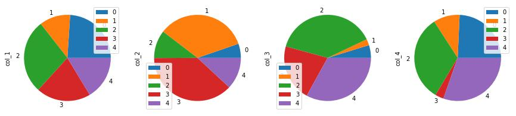

# Pandas

- [Pandas](#pandas)
  - [Introduction](#introduction)
  - [Series](#series)
    - [Series to py list + numpy](#series-to-py-list--numpy)
    - [🟡Series to python dict](#series-to-python-dict)
  - [`DataFrame` objects](#dataframe-objects)
  - [Creating `DataFrame`](#creating-dataframe)
    - [From Numpy Array](#from-numpy-array)
    - [🚀 lists of lists: row wise data](#-lists-of-lists-row-wise-data)
    - [dict of narray/lists](#dict-of-narraylists)
    - [🚀🚀list of dicts: column wise data](#list-of-dicts-column-wise-data)
    - [🚀using `zip()`; list of tuple](#using-zip-list-of-tuple)
  - [Saving \& loading files](#saving--loading-files)
    - [Saving: creating new file](#saving-creating-new-file)
    - [Saving: Append to Existing File](#saving-append-to-existing-file)
    - [Loading](#loading)
      - [Minimize the size of Large DataSet; `nrows=n`](#minimize-the-size-of-large-dataset-nrowsn)
      - [🔥Load All Csv Files In A Folder](#load-all-csv-files-in-a-folder)
  - [Indexing](#indexing)
    - [🚀Extracting Columns `df[col]`, `df[[col1,col2,..]]` + `.values` property](#extracting-columns-dfcol-dfcol1col2--values-property)
    - [🚀Index-based selection - `iloc[row_indexer,col_indexer]`](#index-based-selection---ilocrow_indexercol_indexer)
    - [🚀Label-based selection - `loc[row_indexer,col_indexer]`](#label-based-selection---locrow_indexercol_indexer)
      - [Choosing between loc and iloc](#choosing-between-loc-and-iloc)
    - [🚀🚀 Split Input and Output Features and convert to NumPy arrays](#-split-input-and-output-features-and-convert-to-numpy-arrays)
    - [♻️Reset Index](#️reset-index)
  - [🚀Masking - logical filtering](#masking---logical-filtering)
    - [`SELECT * FROM df WHERE columnX = value`](#select--from-df-where-columnx--value)
    - [🔥`SELECT col1,col2.. FROM df WHERE columnX = value`](#select-col1col2-from-df-where-columnx--value)
    - [`SELECT * FROM df WHERE col1 = value 🤝AND🤝 col2 = value`](#select--from-df-where-col1--value-and-col2--value)
    - [`SELECT * FROM df WHERE col1 = value 🤝OR🤝 col2 = value`](#select--from-df-where-col1--value-or-col2--value)
    - [`SELECT * FROM df WHERE condition1 SORT BY col1`](#select--from-df-where-condition1-sort-by-col1)
    - [Opposite Filter `(~)`](#opposite-filter-)
    - [`isin()` ; `SELECT * FROM df WHERE columnX IN (value1,value2,..)`](#isin--select--from-df-where-columnx-in-value1value2)
    - ["NOT IN" - `df[~df['col_name'].isin(values_list)]`](#not-in---dfdfcol_nameisinvalues_list)
    - [🔥🔥Replacing/Updating on condition](#replacingupdating-on-condition)
    - [`isnull`](#isnull)
    - [String Operations](#string-operations)
  - [🚀Querying a `DataFrame`](#querying-a-dataframe)
    - [Introduction](#introduction-1)
    - [Specifying Multiple Conditions](#specifying-multiple-conditions)
    - [Methods within query](#methods-within-query)
    - [Comparing Numeric Columns](#comparing-numeric-columns)
    - [Comparing Multiple Columns](#comparing-multiple-columns)
  - [CRUD Row/Column Wise](#crud-rowcolumn-wise)
    - [Adding Columns](#adding-columns)
      - [`d['new_col'] = list()`](#dnew_col--list)
      - [`d['new_col'] = constant`](#dnew_col--constant)
      - [`d['new_col'] = range(len(d))`](#dnew_col--rangelend)
      - [`d['new_col'] = d['col1'] + d['col2']` from existing columns](#dnew_col--dcol1--dcol2-from-existing-columns)
      - [`insert(position,column,value)`](#insertpositioncolumnvalue)
      - [`assign(new_col,value)`](#assignnew_colvalue)
    - [Moving Columns Position](#moving-columns-position)
    - [Adding/Appending Rows](#addingappending-rows)
      - [`append()` \[deprecated\]](#append-deprecated)
      - [🌰 `concat()`](#-concat)
      - [`loc()` - dict](#loc---dict)
      - [`loc()` - list](#loc---list)
      - [`iloc[]` - list](#iloc---list)
    - [Removing Rows/Columns](#removing-rowscolumns)
      - [`drop()` - column](#drop---column)
      - [`drop()` - row](#drop---row)
        - [🔥Conditional Drop🔥](#conditional-drop)
    - [👫Duplicate Rows👫](#duplicate-rows)
      - [Find Duplicates](#find-duplicates)
      - [Drop Duplicate Rows](#drop-duplicate-rows)
      - [based on two columns combinations](#based-on-two-columns-combinations)
    - [Renaming Columns](#renaming-columns)
    - [👉Shuffle a DataFrame rows](#shuffle-a-dataframe-rows)
      - [Using `pd.sample()`](#using-pdsample)
      - [Using `sklearn.utils.shuffle()`](#using-sklearnutilsshuffle)
  - [Merge/Join/Concat DataFrame](#mergejoinconcat-dataframe)
    - [`concat()`: appending rows or columns](#concat-appending-rows-or-columns)
    - [`merge()`](#merge)
      - [Intro](#intro)
      - [Inner Join (Default)](#inner-join-default)
        - [1. Without any key column](#1-without-any-key-column)
        - [2. Specifying key columns using argument on](#2-specifying-key-columns-using-argument-on)
        - [3. Merging using left\_on and right\_on](#3-merging-using-left_on-and-right_on)
      - [left join](#left-join)
      - [right join](#right-join)
      - [outer join](#outer-join)
    - [`join()`](#join)
  - [Aggregation and Summary Functions](#aggregation-and-summary-functions)
    - [Mathematical Aggregation Functions](#mathematical-aggregation-functions)
    - [Summary Function](#summary-function)
      - [`shape` , `dtypes` , `info()`, `describe()`](#shape--dtypes--info-describe)
      - [`head()` and `tail()`](#head-and-tail)
      - [`columns`](#columns)
      - [`unique()` and `nunique()`](#unique-and-nunique)
      - [🦄 `value_counts()` count occupance of each unique element](#-value_counts-count-occupance-of-each-unique-element)
  - [Data Types and Missing Values](#data-types-and-missing-values)
    - [`dtypes`, `astype()`](#dtypes-astype)
    - [Missing data](#missing-data)
      - [`isnull()`, `isnull().sum()` and `notnull()`](#isnull-isnullsum-and-notnull)
      - [`fillna`](#fillna)
      - [`dropna`](#dropna)
  - [Iterate over rows](#iterate-over-rows)
  - [Applying functions: `apply()`, `map()` and `applymap()`](#applying-functions-apply-map-and-applymap)
    - [`apply()`](#apply)
    - [`map()`](#map)
    - [`applymap()`](#applymap)
  - [🌶️ Converting to/from `DataFrame`](#️-converting-tofrom-dataframe)
    - [To Numpy Representation](#to-numpy-representation)
      - [`to_numpy()`](#to_numpy)
      - [Avoid using `df.values`](#avoid-using-dfvalues)
      - [`to_records()` : to list of tuple](#to_records--to-list-of-tuple)
      - [`np.asarray(df)`](#npasarraydf)
    - [To python list of dicts: `to_dict()`](#to-python-list-of-dicts-to_dict)
    - [To Python List/List of List](#to-python-listlist-of-list)
  - [Grouping and Sorting](#grouping-and-sorting)
    - [`groupby()`](#groupby)
      - [Example:](#example)
    - [Sorting: `sort_index`, `sort_values`](#sorting-sort_index-sort_values)
      - [`sort_index`](#sort_index)
      - [`sort_values`](#sort_values)
      - [`nlargest()` and `nsmallest()`](#nlargest-and-nsmallest)
    - [`groupby()` + `transform()`](#groupby--transform)
  - [🔥Pivot Tables](#pivot-tables)
    - [Visualize Pivot Table](#visualize-pivot-table)
  - [Visualization with Pandas](#visualization-with-pandas)
    - [Line plot](#line-plot)
    - [Scatter plot](#scatter-plot)
    - [Bar plot](#bar-plot)
    - [Box plot](#box-plot)
    - [Area plot](#area-plot)
    - [Pie chart](#pie-chart)
  - [One hot encoding examples](#one-hot-encoding-examples)
    - [Multi-label one-hot encoding](#multi-label-one-hot-encoding)

## Introduction

- library for Data Analysis and Manipulation

**Why Pandas?**

- provides ability to work with Tabular data
  - `Tabular Data` : data that is organized into tables having rows and cols


```python
"""
cd .\01pandas\
jupyter nbconvert --to markdown pandas.ipynb --output README.md


"""
import pandas as pd
import numpy as np
import matplotlib.pyplot as plt
from IPython.display import display
import seaborn as sns
from matplotlib_inline.backend_inline import set_matplotlib_formats
set_matplotlib_formats('png')
plt.rcParams.update({
    "figure.facecolor": "white",
    "axes.facecolor": "white",
})

```

## Series

### Series to py list + numpy


```python
# Create a Pandas Series
series = pd.Series([1, 2, 3, 4, 5])
# Convert Series to List
my_list = series.tolist()
print(my_list)
# Convert Series to NumPy Array
my_array = series.to_numpy()
print(my_array)

```

    [1, 2, 3, 4, 5]
    [1 2 3 4 5]


### 🟡Series to python dict


```python
# Create a Pandas Series
series = pd.Series([1, 2, 3, 4, 5])
# Convert Series to Dict
print(series.to_dict())
# VS series with dictionary
series = pd.Series([1, 2, 3, 4, 5], index=['A', 'B', 'C', 'D', 'E'])
print(series.to_dict())

```

    {0: 1, 1: 2, 2: 3, 3: 4, 4: 5}
    {'A': 1, 'B': 2, 'C': 3, 'D': 4, 'E': 5}


This is helpful in scenarios like below:


```python
# Preparing Data
import random
X = ['cs.AI', 'cs.ML', 'cs.CV', 'cs.IT', 'cs.NI']
# Generate random value counts for each element in X
value_counts = {element: random.randint(10, 100) for element in X}
# Create a list of categories based on the value counts
categories = []
for category, count in value_counts.items():
    categories.extend([category] * count)

# Generate random values for the value column
values = [random.randint(0, 100) for _ in range(sum(value_counts.values()))]
# Create the sample DataFrame
df = pd.DataFrame({'Category': categories, 'Value': values})
df
```


<div>

<table border="1" class="dataframe">
  <thead>
    <tr style="text-align: right;">
      <th></th>
      <th>Category</th>
      <th>Value</th>
    </tr>
  </thead>
  <tbody>
    <tr>
      <th>0</th>
      <td>cs.AI</td>
      <td>47</td>
    </tr>
    <tr>
      <th>1</th>
      <td>cs.AI</td>
      <td>45</td>
    </tr>
    <tr>
      <th>2</th>
      <td>cs.AI</td>
      <td>21</td>
    </tr>
    <tr>
      <th>3</th>
      <td>cs.AI</td>
      <td>44</td>
    </tr>
    <tr>
      <th>4</th>
      <td>cs.AI</td>
      <td>77</td>
    </tr>
    <tr>
      <th>...</th>
      <td>...</td>
      <td>...</td>
    </tr>
    <tr>
      <th>366</th>
      <td>cs.NI</td>
      <td>2</td>
    </tr>
    <tr>
      <th>367</th>
      <td>cs.NI</td>
      <td>83</td>
    </tr>
    <tr>
      <th>368</th>
      <td>cs.NI</td>
      <td>80</td>
    </tr>
    <tr>
      <th>369</th>
      <td>cs.NI</td>
      <td>51</td>
    </tr>
    <tr>
      <th>370</th>
      <td>cs.NI</td>
      <td>29</td>
    </tr>
  </tbody>
</table>
<p>371 rows × 2 columns</p>
</div>


```python
series = df['Category'].value_counts()
filtered_series = series[series > 98]
# get list:
print(filtered_series.index.tolist())
# get record:
print(filtered_series.to_dict())
```

    ['cs.IT']
    {'cs.IT': 99}


## `DataFrame` objects

A `DataFrame` is a table. It contains an array of individual entries, each of which has a certain value. Each entry corresponds to a row (or record) and a column.

- A DataFrame object represents a 2d labelled array, with cell values, column names and row index labels
- You can see `DataFrame`s as dictionaries of `Series`.


<div align="center">

</div>

## Creating `DataFrame`

### From Numpy Array


```python
arr = np.random.randint(10,100,size=(6,4))
arr
```


    array([[90, 50, 90, 34],
           [68, 30, 90, 40],
           [96, 57, 18, 68],
           [86, 48, 25, 13],
           [43, 81, 82, 16],
           [29, 88, 21, 97]])


```python
df = pd.DataFrame(arr)
df
```


<div>

<table border="1" class="dataframe">
  <thead>
    <tr style="text-align: right;">
      <th></th>
      <th>0</th>
      <th>1</th>
      <th>2</th>
      <th>3</th>
    </tr>
  </thead>
  <tbody>
    <tr>
      <th>0</th>
      <td>90</td>
      <td>50</td>
      <td>90</td>
      <td>34</td>
    </tr>
    <tr>
      <th>1</th>
      <td>68</td>
      <td>30</td>
      <td>90</td>
      <td>40</td>
    </tr>
    <tr>
      <th>2</th>
      <td>96</td>
      <td>57</td>
      <td>18</td>
      <td>68</td>
    </tr>
    <tr>
      <th>3</th>
      <td>86</td>
      <td>48</td>
      <td>25</td>
      <td>13</td>
    </tr>
    <tr>
      <th>4</th>
      <td>43</td>
      <td>81</td>
      <td>82</td>
      <td>16</td>
    </tr>
    <tr>
      <th>5</th>
      <td>29</td>
      <td>88</td>
      <td>21</td>
      <td>97</td>
    </tr>
  </tbody>
</table>
</div>


```python
arr = np.random.randint(10, 100, size=(6, 4))
df = pd.DataFrame(data=arr)
df.columns = ["a", "b", "c", "d"]
df.index = "p q r s t u".split()
df

```


<div>

<table border="1" class="dataframe">
  <thead>
    <tr style="text-align: right;">
      <th></th>
      <th>a</th>
      <th>b</th>
      <th>c</th>
      <th>d</th>
    </tr>
  </thead>
  <tbody>
    <tr>
      <th>p</th>
      <td>57</td>
      <td>82</td>
      <td>15</td>
      <td>40</td>
    </tr>
    <tr>
      <th>q</th>
      <td>90</td>
      <td>98</td>
      <td>76</td>
      <td>56</td>
    </tr>
    <tr>
      <th>r</th>
      <td>21</td>
      <td>65</td>
      <td>82</td>
      <td>64</td>
    </tr>
    <tr>
      <th>s</th>
      <td>63</td>
      <td>26</td>
      <td>65</td>
      <td>45</td>
    </tr>
    <tr>
      <th>t</th>
      <td>14</td>
      <td>76</td>
      <td>31</td>
      <td>19</td>
    </tr>
    <tr>
      <th>u</th>
      <td>65</td>
      <td>33</td>
      <td>70</td>
      <td>41</td>
    </tr>
  </tbody>
</table>
</div>


### 🚀 lists of lists: row wise data


```python
list(np.random.random(3))
```


    [0.29607993273364797, 0.6287879088794833, 0.579837810189545]


```python
np.random.seed(100)
row1 = ['TeKET'] + list(np.random.random(3))
row2 = ['Yake'] + list(np.random.random(3))
row3 = ['TP'] + list(np.random.random(3))
row4 = ['IFTDF'] + list(np.random.random(3))

values = [
            row1,
            row2,
            row3,
            row4
         ]
d3 = pd.DataFrame(
        values,
        columns=['Model', 'precision', 'recall', 'f1'],
      #   index=["alice", "bob", "charles"]
     )
d3
```


<div>

<table border="1" class="dataframe">
  <thead>
    <tr style="text-align: right;">
      <th></th>
      <th>Model</th>
      <th>precision</th>
      <th>recall</th>
      <th>f1</th>
    </tr>
  </thead>
  <tbody>
    <tr>
      <th>0</th>
      <td>TeKET</td>
      <td>0.543405</td>
      <td>0.278369</td>
      <td>0.424518</td>
    </tr>
    <tr>
      <th>1</th>
      <td>Yake</td>
      <td>0.844776</td>
      <td>0.004719</td>
      <td>0.121569</td>
    </tr>
    <tr>
      <th>2</th>
      <td>TP</td>
      <td>0.670749</td>
      <td>0.825853</td>
      <td>0.136707</td>
    </tr>
    <tr>
      <th>3</th>
      <td>IFTDF</td>
      <td>0.575093</td>
      <td>0.891322</td>
      <td>0.209202</td>
    </tr>
  </tbody>
</table>
</div>


```python
# 🚀 filling missing values with list unpacking
values = [
    [1985, *([None]*3)],
    [1984, 3, *([np.nan] * 2)],
    [1992, 0, np.nan, 112]
]
d4 = pd.DataFrame(
        values,
        columns=["birthyear", "children", "hobby", "weight"],
     )
d4

```


<div>

<table border="1" class="dataframe">
  <thead>
    <tr style="text-align: right;">
      <th></th>
      <th>birthyear</th>
      <th>children</th>
      <th>hobby</th>
      <th>weight</th>
    </tr>
  </thead>
  <tbody>
    <tr>
      <th>0</th>
      <td>1985</td>
      <td>NaN</td>
      <td>NaN</td>
      <td>NaN</td>
    </tr>
    <tr>
      <th>1</th>
      <td>1984</td>
      <td>3.0</td>
      <td>NaN</td>
      <td>NaN</td>
    </tr>
    <tr>
      <th>2</th>
      <td>1992</td>
      <td>0.0</td>
      <td>NaN</td>
      <td>112.0</td>
    </tr>
  </tbody>
</table>
</div>


### dict of narray/lists

To specify missing values, you can either use `np.nan` or NumPy's masked arrays:

Instead of an `ndarray`, you can also pass a `DataFrame` object:


```python
data = {'Name': ['Tom', 'nick', 'jhon', 'jack'],
        'Age': [20, 21, 19, 18]}

df = pd.DataFrame(data)

df

```


<div>

<table border="1" class="dataframe">
  <thead>
    <tr style="text-align: right;">
      <th></th>
      <th>Name</th>
      <th>Age</th>
    </tr>
  </thead>
  <tbody>
    <tr>
      <th>0</th>
      <td>Tom</td>
      <td>20</td>
    </tr>
    <tr>
      <th>1</th>
      <td>nick</td>
      <td>21</td>
    </tr>
    <tr>
      <th>2</th>
      <td>jhon</td>
      <td>19</td>
    </tr>
    <tr>
      <th>3</th>
      <td>jack</td>
      <td>18</td>
    </tr>
  </tbody>
</table>
</div>


### 🚀🚀list of dicts: column wise data


```python
data = [{'a': 1, 'b': 2, 'c': 3},
        {'a': 10, 'b': 20, 'c': 30}]

# Creates DataFrame.
df = pd.DataFrame(data)

# Print the data
df

```


<div>

<table border="1" class="dataframe">
  <thead>
    <tr style="text-align: right;">
      <th></th>
      <th>a</th>
      <th>b</th>
      <th>c</th>
    </tr>
  </thead>
  <tbody>
    <tr>
      <th>0</th>
      <td>1</td>
      <td>2</td>
      <td>3</td>
    </tr>
    <tr>
      <th>1</th>
      <td>10</td>
      <td>20</td>
      <td>30</td>
    </tr>
  </tbody>
</table>
</div>


### 🚀using `zip()`; list of tuple

Two lists can be merged by using `list(zip())` function.


```python
# List1
Name = ['tom', 'jhon', 'nick', 'juli']

# List2
Age = [25, 30, 26, 22]

# get the list of tuples from two lists.
# and merge them by using zip().
list_of_tuples = list(zip(Name, Age))
print(list_of_tuples)

# Assign data to tuples.
list_of_tuples


# Converting lists of tuples into
# pandas Dataframe.
df = pd.DataFrame(list_of_tuples,
                  columns=['Name', 'Age'])

# Print data.
df

```

    [('tom', 25), ('jhon', 30), ('nick', 26), ('juli', 22)]


<div>

<table border="1" class="dataframe">
  <thead>
    <tr style="text-align: right;">
      <th></th>
      <th>Name</th>
      <th>Age</th>
    </tr>
  </thead>
  <tbody>
    <tr>
      <th>0</th>
      <td>tom</td>
      <td>25</td>
    </tr>
    <tr>
      <th>1</th>
      <td>jhon</td>
      <td>30</td>
    </tr>
    <tr>
      <th>2</th>
      <td>nick</td>
      <td>26</td>
    </tr>
    <tr>
      <th>3</th>
      <td>juli</td>
      <td>22</td>
    </tr>
  </tbody>
</table>
</div>


## Saving & loading files

Pandas can save `DataFrame`s to various backends, including file formats such as CSV, Excel, JSON, HTML and HDF5, or to a SQL database. Let's create a `DataFrame` to demonstrate this:


```python
df = pd.DataFrame({
	"id":np.arange(10),
	'b':np.random.normal(size=10),
	"c":pd.Series(np.random.choice(["cat",'dog',"hippo"],replace=True,size=10))
})
df.head()
```


<div>

<table border="1" class="dataframe">
  <thead>
    <tr style="text-align: right;">
      <th></th>
      <th>id</th>
      <th>b</th>
      <th>c</th>
    </tr>
  </thead>
  <tbody>
    <tr>
      <th>0</th>
      <td>0</td>
      <td>-0.458027</td>
      <td>cat</td>
    </tr>
    <tr>
      <th>1</th>
      <td>1</td>
      <td>0.435163</td>
      <td>hippo</td>
    </tr>
    <tr>
      <th>2</th>
      <td>2</td>
      <td>-0.583595</td>
      <td>dog</td>
    </tr>
    <tr>
      <th>3</th>
      <td>3</td>
      <td>0.816847</td>
      <td>dog</td>
    </tr>
    <tr>
      <th>4</th>
      <td>4</td>
      <td>0.672721</td>
      <td>hippo</td>
    </tr>
  </tbody>
</table>
</div>


### Saving: creating new file


Let's save it to CSV, HTML and JSON:


```python
df.to_csv("my_df.csv")
df.to_csv("my_df_index_false.csv", index=False)
df.to_html("my_df.html")
df.to_json("my_df.json")

```

### Saving: Append to Existing File


```python
data = {
    'Name': [ 'Bob', 'Jessica', 'Mary'],
    'Run': [50, 63, 15],
    'Wicket': [0, 2, 3],
    'Catch': [4, 2, 1]
}

# Make data frame of above data
df = pd.DataFrame(data)

# append data frame to CSV file
df.to_csv('d.csv', mode='a', index=False, header=False)
```

### Loading

Now let's load our CSV file back into a `DataFrame`:

- Loading from file saved without `index=False`


```python
my_df_loaded = pd.read_csv("my_df.csv")
my_df_loaded.head()
```


<div>

<table border="1" class="dataframe">
  <thead>
    <tr style="text-align: right;">
      <th></th>
      <th>Unnamed: 0</th>
      <th>id</th>
      <th>b</th>
      <th>c</th>
    </tr>
  </thead>
  <tbody>
    <tr>
      <th>0</th>
      <td>0</td>
      <td>0</td>
      <td>1.106266</td>
      <td>hippo</td>
    </tr>
    <tr>
      <th>1</th>
      <td>1</td>
      <td>1</td>
      <td>-1.612778</td>
      <td>cat</td>
    </tr>
    <tr>
      <th>2</th>
      <td>2</td>
      <td>2</td>
      <td>-0.264879</td>
      <td>cat</td>
    </tr>
    <tr>
      <th>3</th>
      <td>3</td>
      <td>3</td>
      <td>-0.213137</td>
      <td>cat</td>
    </tr>
    <tr>
      <th>4</th>
      <td>4</td>
      <td>4</td>
      <td>-0.184308</td>
      <td>hippo</td>
    </tr>
  </tbody>
</table>
</div>


- Loading from file saved with `index=False`


```python
my_df_loaded_index_false = pd.read_csv("my_df_index_false.csv")
my_df_loaded_index_false.head()
```


<div>

<table border="1" class="dataframe">
  <thead>
    <tr style="text-align: right;">
      <th></th>
      <th>id</th>
      <th>b</th>
      <th>c</th>
    </tr>
  </thead>
  <tbody>
    <tr>
      <th>0</th>
      <td>0</td>
      <td>1.106266</td>
      <td>hippo</td>
    </tr>
    <tr>
      <th>1</th>
      <td>1</td>
      <td>-1.612778</td>
      <td>cat</td>
    </tr>
    <tr>
      <th>2</th>
      <td>2</td>
      <td>-0.264879</td>
      <td>cat</td>
    </tr>
    <tr>
      <th>3</th>
      <td>3</td>
      <td>-0.213137</td>
      <td>cat</td>
    </tr>
    <tr>
      <th>4</th>
      <td>4</td>
      <td>-0.184308</td>
      <td>hippo</td>
    </tr>
  </tbody>
</table>
</div>


- Loading from file saved without `index=False`, without `Unnamed: 0` column

The `pd.read_csv()` function is well-endowed, with over 30 optional parameters you can specify. For example, you can see in this dataset that the CSV file has a built-in index, which pandas did not pick up on automatically. To make pandas use that column for the index (instead of creating a new one from scratch), we can specify an `index_col`.


```python
my_df_loaded = pd.read_csv("my_df.csv",index_col=0)
my_df_loaded.head()
```


<div>

<table border="1" class="dataframe">
  <thead>
    <tr style="text-align: right;">
      <th></th>
      <th>id</th>
      <th>b</th>
      <th>c</th>
    </tr>
  </thead>
  <tbody>
    <tr>
      <th>0</th>
      <td>0</td>
      <td>1.106266</td>
      <td>hippo</td>
    </tr>
    <tr>
      <th>1</th>
      <td>1</td>
      <td>-1.612778</td>
      <td>cat</td>
    </tr>
    <tr>
      <th>2</th>
      <td>2</td>
      <td>-0.264879</td>
      <td>cat</td>
    </tr>
    <tr>
      <th>3</th>
      <td>3</td>
      <td>-0.213137</td>
      <td>cat</td>
    </tr>
    <tr>
      <th>4</th>
      <td>4</td>
      <td>-0.184308</td>
      <td>hippo</td>
    </tr>
  </tbody>
</table>
</div>


- Or Dropping "Unnamed: 0" Column


```python
my_df_loaded = pd.read_csv("my_df.csv")
my_df_loaded = my_df_loaded.drop(columns=['Unnamed: 0'])
my_df_loaded.head()

```


<div>

<table border="1" class="dataframe">
  <thead>
    <tr style="text-align: right;">
      <th></th>
      <th>id</th>
      <th>b</th>
      <th>c</th>
    </tr>
  </thead>
  <tbody>
    <tr>
      <th>0</th>
      <td>0</td>
      <td>1.106266</td>
      <td>hippo</td>
    </tr>
    <tr>
      <th>1</th>
      <td>1</td>
      <td>-1.612778</td>
      <td>cat</td>
    </tr>
    <tr>
      <th>2</th>
      <td>2</td>
      <td>-0.264879</td>
      <td>cat</td>
    </tr>
    <tr>
      <th>3</th>
      <td>3</td>
      <td>-0.213137</td>
      <td>cat</td>
    </tr>
    <tr>
      <th>4</th>
      <td>4</td>
      <td>-0.184308</td>
      <td>hippo</td>
    </tr>
  </tbody>
</table>
</div>


As you might guess, there are similar `read_json`, `read_html`, `read_excel` functions as well.  We can also read data straight from the Internet. For example, let's load the top 1,000 U.S. cities from github:


```python
us_cities = None
try:
    csv_url = "https://raw.githubusercontent.com/plotly/datasets/master/us-cities-top-1k.csv"
    us_cities = pd.read_csv(csv_url, index_col=0)
    us_cities = us_cities.head()
except IOError as e:
    print(e)
us_cities
```


<div>

<table border="1" class="dataframe">
  <thead>
    <tr style="text-align: right;">
      <th></th>
      <th>State</th>
      <th>Population</th>
      <th>lat</th>
      <th>lon</th>
    </tr>
    <tr>
      <th>City</th>
      <th></th>
      <th></th>
      <th></th>
      <th></th>
    </tr>
  </thead>
  <tbody>
    <tr>
      <th>Marysville</th>
      <td>Washington</td>
      <td>63269</td>
      <td>48.051764</td>
      <td>-122.177082</td>
    </tr>
    <tr>
      <th>Perris</th>
      <td>California</td>
      <td>72326</td>
      <td>33.782519</td>
      <td>-117.228648</td>
    </tr>
    <tr>
      <th>Cleveland</th>
      <td>Ohio</td>
      <td>390113</td>
      <td>41.499320</td>
      <td>-81.694361</td>
    </tr>
    <tr>
      <th>Worcester</th>
      <td>Massachusetts</td>
      <td>182544</td>
      <td>42.262593</td>
      <td>-71.802293</td>
    </tr>
    <tr>
      <th>Columbia</th>
      <td>South Carolina</td>
      <td>133358</td>
      <td>34.000710</td>
      <td>-81.034814</td>
    </tr>
  </tbody>
</table>
</div>


#### Minimize the size of Large DataSet; `nrows=n`

[wine-reviews-dataset](https://www.kaggle.com/zynicide/wine-reviews)


```python
data = pd.read_csv('winemag-data-130k-v2.csv')
print(f"Pre Shape : {data.shape}")
# read only first 100 rows
data = pd.read_csv('winemag-data-130k-v2.csv', nrows=100, index_col=0)
data.head(n=2)
```

    Pre Shape : (129971, 14)


<div>

<table border="1" class="dataframe">
  <thead>
    <tr style="text-align: right;">
      <th></th>
      <th>country</th>
      <th>description</th>
      <th>designation</th>
      <th>points</th>
      <th>price</th>
      <th>province</th>
      <th>region_1</th>
      <th>region_2</th>
      <th>taster_name</th>
      <th>taster_twitter_handle</th>
      <th>title</th>
      <th>variety</th>
      <th>winery</th>
    </tr>
  </thead>
  <tbody>
    <tr>
      <th>0</th>
      <td>Italy</td>
      <td>Aromas include tropical fruit, broom, brimston...</td>
      <td>Vulkà Bianco</td>
      <td>87</td>
      <td>NaN</td>
      <td>Sicily &amp; Sardinia</td>
      <td>Etna</td>
      <td>NaN</td>
      <td>Kerin O’Keefe</td>
      <td>@kerinokeefe</td>
      <td>Nicosia 2013 Vulkà Bianco  (Etna)</td>
      <td>White Blend</td>
      <td>Nicosia</td>
    </tr>
    <tr>
      <th>1</th>
      <td>Portugal</td>
      <td>This is ripe and fruity, a wine that is smooth...</td>
      <td>Avidagos</td>
      <td>87</td>
      <td>15.0</td>
      <td>Douro</td>
      <td>NaN</td>
      <td>NaN</td>
      <td>Roger Voss</td>
      <td>@vossroger</td>
      <td>Quinta dos Avidagos 2011 Avidagos Red (Douro)</td>
      <td>Portuguese Red</td>
      <td>Quinta dos Avidagos</td>
    </tr>
  </tbody>
</table>
</div>


```python
# Save the dataframe to a csv file
data.to_csv("winemag-data-130k-v2-mod.csv")
```

#### 🔥Load All Csv Files In A Folder

Read all csv files in a folder and process them one by one:


```python
import glob
import os
all_files = glob.glob("data/reports/*.csv")
for file in all_files:
		reviewer = os.path.basename(file).split(".")[0]
		print(reviewer)
		report = pd.read_csv(file)
		# generate_report_plot(report,reviewer,with_similarity_threshold=True)
```

Read all csv files in a folder and combine them into a single dataframe:


```python
import glob
import os
all_files = glob.glob("animals/*.csv")
df = pd. concat((pd.read_csv(f) for f in all_files))
df
```

Without `glob`, you would have to manually list all the files you want to read:


```python
folder = "example_folder"
files = [x for x in os.listdir(folder) if x.endswith(".csv")]
# get full path
files = [os.path.join(folder, x) for x in files]
files[0]
```


## Indexing

### 🚀Extracting Columns `df[col]`, `df[[col1,col2,..]]` + `.values` property


```python
np.random.seed(10)
arr = np.random.randint(10, 100, size=(6, 4))
df = pd.DataFrame(data=arr,columns=["a", "b", "c", "d"])
# df.columns = ["a", "b", "c", "d"]
df
```


<div>

<table border="1" class="dataframe">
  <thead>
    <tr style="text-align: right;">
      <th></th>
      <th>a</th>
      <th>b</th>
      <th>c</th>
      <th>d</th>
    </tr>
  </thead>
  <tbody>
    <tr>
      <th>0</th>
      <td>19</td>
      <td>25</td>
      <td>74</td>
      <td>38</td>
    </tr>
    <tr>
      <th>1</th>
      <td>99</td>
      <td>39</td>
      <td>18</td>
      <td>83</td>
    </tr>
    <tr>
      <th>2</th>
      <td>10</td>
      <td>50</td>
      <td>46</td>
      <td>26</td>
    </tr>
    <tr>
      <th>3</th>
      <td>21</td>
      <td>64</td>
      <td>98</td>
      <td>72</td>
    </tr>
    <tr>
      <th>4</th>
      <td>43</td>
      <td>82</td>
      <td>88</td>
      <td>59</td>
    </tr>
    <tr>
      <th>5</th>
      <td>61</td>
      <td>64</td>
      <td>87</td>
      <td>79</td>
    </tr>
  </tbody>
</table>
</div>


In Python, we can access the property of an object by accessing it as an attribute. A `book` object, for example, might have a `title` property, which we can access by calling` book.title`. `Columns` in a pandas DataFrame work in much the same way.


```python
df.c
# If column name has spaces, this will not work
```


    0    74
    1    18
    2    46
    3    98
    4    88
    5    87
    Name: c, dtype: int32


If we have a Python dictionary, we can access its values using the indexing (`[]`) operator. We can do the same with `columns` in a DataFrame:


```python
''' SELECT c from df '''

df['c']
```


    0    74
    1    18
    2    46
    3    98
    4    88
    5    87
    Name: c, dtype: int32


Indexing operator `[]` does have the advantage that it can handle `column` names with **reserved characters** in them (e.g. if we had a `country providence` column, `reviews.country providence` wouldn't work).

Doesn't a pandas Series look kind of like a fancy dictionary? It pretty much is, so it's no surprise that, to drill down to a **single specific value**, we need only use the indexing operator `[]` once more:


```python
df['c'][0]
```


    74


use `.values` to get the values in a array


```python
df['c'].values
```


    array([74, 18, 46, 98, 88, 87])


multiple columns can be extracted at once:


```python
''' SELECT b,c,a from df '''

df[['b','c','a']]
```


<div>

<table border="1" class="dataframe">
  <thead>
    <tr style="text-align: right;">
      <th></th>
      <th>b</th>
      <th>c</th>
      <th>a</th>
    </tr>
  </thead>
  <tbody>
    <tr>
      <th>0</th>
      <td>25</td>
      <td>74</td>
      <td>19</td>
    </tr>
    <tr>
      <th>1</th>
      <td>39</td>
      <td>18</td>
      <td>99</td>
    </tr>
    <tr>
      <th>2</th>
      <td>50</td>
      <td>46</td>
      <td>10</td>
    </tr>
    <tr>
      <th>3</th>
      <td>64</td>
      <td>98</td>
      <td>21</td>
    </tr>
    <tr>
      <th>4</th>
      <td>82</td>
      <td>88</td>
      <td>43</td>
    </tr>
    <tr>
      <th>5</th>
      <td>64</td>
      <td>87</td>
      <td>61</td>
    </tr>
  </tbody>
</table>
</div>


```python
df[['b', 'c', 'a']].values

```


    array([[25, 74, 19],
           [39, 18, 99],
           [50, 46, 10],
           [64, 98, 21],
           [82, 88, 43],
           [64, 87, 61]])


### 🚀Index-based selection - `iloc[row_indexer,col_indexer]`


```python
np.random.seed(10)
arr = np.random.randint(10, 100, size=(6, 4))
df = pd.DataFrame(data=arr)
df.columns = ["a", "b", "c", "d"]
df.index = "p q r s t u".split()
df
```


<div>

<table border="1" class="dataframe">
  <thead>
    <tr style="text-align: right;">
      <th></th>
      <th>a</th>
      <th>b</th>
      <th>c</th>
      <th>d</th>
    </tr>
  </thead>
  <tbody>
    <tr>
      <th>p</th>
      <td>19</td>
      <td>25</td>
      <td>74</td>
      <td>38</td>
    </tr>
    <tr>
      <th>q</th>
      <td>99</td>
      <td>39</td>
      <td>18</td>
      <td>83</td>
    </tr>
    <tr>
      <th>r</th>
      <td>10</td>
      <td>50</td>
      <td>46</td>
      <td>26</td>
    </tr>
    <tr>
      <th>s</th>
      <td>21</td>
      <td>64</td>
      <td>98</td>
      <td>72</td>
    </tr>
    <tr>
      <th>t</th>
      <td>43</td>
      <td>82</td>
      <td>88</td>
      <td>59</td>
    </tr>
    <tr>
      <th>u</th>
      <td>61</td>
      <td>64</td>
      <td>87</td>
      <td>79</td>
    </tr>
  </tbody>
</table>
</div>


Pandas indexing works in one of two paradigms. The first is **index-based selection**: ***selecting data based on its numerical position in the data***. `iloc` follows this paradigm.


```python
first_row = df.iloc[0]
first_row
```


    a    19
    b    25
    c    74
    d    38
    Name: p, dtype: int32


Both `loc` and `iloc` are `row-first, column-second`. This is the opposite of what we do in native `Python`, which is `column-first, row-second`.

This means that it's marginally easier to retrieve `rows`, and marginally harder to get retrieve `columns`. To get a column with `iloc`, we can do the following:


```python
df.iloc[:, 0] # all rows, first column
```


    p    19
    q    99
    r    10
    s    21
    t    43
    u    61
    Name: a, dtype: int32


On its own, the `:` operator, which also comes from native Python, means `"everything"`. When combined with other selectors, however, it can be used to indicate a range of values. For example, to select the country column from just the first, second, and third row, we would do:

Or, to select just the second and third entries, we would do:


```python
df.iloc[1:3, 0] # second and third row, first column
```


    q    99
    r    10
    Name: a, dtype: int32


It's also possible to pass a list:


```python
df.iloc[[0, 1, 2], 0] # first three rows, first column
```


    p    19
    q    99
    r    10
    Name: a, dtype: int32


```python
df.iloc[:, 0:3] # all rows, first three columns
```


<div>

<table border="1" class="dataframe">
  <thead>
    <tr style="text-align: right;">
      <th></th>
      <th>a</th>
      <th>b</th>
      <th>c</th>
    </tr>
  </thead>
  <tbody>
    <tr>
      <th>p</th>
      <td>19</td>
      <td>25</td>
      <td>74</td>
    </tr>
    <tr>
      <th>q</th>
      <td>99</td>
      <td>39</td>
      <td>18</td>
    </tr>
    <tr>
      <th>r</th>
      <td>10</td>
      <td>50</td>
      <td>46</td>
    </tr>
    <tr>
      <th>s</th>
      <td>21</td>
      <td>64</td>
      <td>98</td>
    </tr>
    <tr>
      <th>t</th>
      <td>43</td>
      <td>82</td>
      <td>88</td>
    </tr>
    <tr>
      <th>u</th>
      <td>61</td>
      <td>64</td>
      <td>87</td>
    </tr>
  </tbody>
</table>
</div>


```python
df.iloc[:2,:3] # first two rows, first three columns
```


<div>

<table border="1" class="dataframe">
  <thead>
    <tr style="text-align: right;">
      <th></th>
      <th>a</th>
      <th>b</th>
      <th>c</th>
    </tr>
  </thead>
  <tbody>
    <tr>
      <th>p</th>
      <td>19</td>
      <td>25</td>
      <td>74</td>
    </tr>
    <tr>
      <th>q</th>
      <td>99</td>
      <td>39</td>
      <td>18</td>
    </tr>
  </tbody>
</table>
</div>


```python
df.iloc[:2, [1,3]] # first two rows, second and fourth columns
```


<div>

<table border="1" class="dataframe">
  <thead>
    <tr style="text-align: right;">
      <th></th>
      <th>b</th>
      <th>d</th>
    </tr>
  </thead>
  <tbody>
    <tr>
      <th>p</th>
      <td>25</td>
      <td>38</td>
    </tr>
    <tr>
      <th>q</th>
      <td>39</td>
      <td>83</td>
    </tr>
  </tbody>
</table>
</div>


```python
df.iloc[1,3]
```


    83


```python
df.iloc[1:3][['a','b']]
```


<div>

<table border="1" class="dataframe">
  <thead>
    <tr style="text-align: right;">
      <th></th>
      <th>a</th>
      <th>b</th>
    </tr>
  </thead>
  <tbody>
    <tr>
      <th>q</th>
      <td>99</td>
      <td>39</td>
    </tr>
    <tr>
      <th>r</th>
      <td>10</td>
      <td>50</td>
    </tr>
  </tbody>
</table>
</div>


```python
df.iloc[1:3,[df.columns.get_loc(v) for v in ['a','b']]]
```


<div>

<table border="1" class="dataframe">
  <thead>
    <tr style="text-align: right;">
      <th></th>
      <th>a</th>
      <th>b</th>
    </tr>
  </thead>
  <tbody>
    <tr>
      <th>q</th>
      <td>99</td>
      <td>39</td>
    </tr>
    <tr>
      <th>r</th>
      <td>10</td>
      <td>50</td>
    </tr>
  </tbody>
</table>
</div>


### 🚀Label-based selection - `loc[row_indexer,col_indexer]`

The second paradigm for attribute selection is the one followed by the `loc` operator: **label-based selection**. In this paradigm, it's the **data index value**, **not its position**, which matters.


```python
x = df.loc["p"]
print(type(x))
x
```

    <class 'pandas.core.series.Series'>


    a    19
    b    25
    c    74
    d    38
    Name: p, dtype: int32


Accessing a single row with list of labels returns a `DataFrame` object:


```python
x1= df.loc[["p"]]
print(type(x1))
x1
```

    <class 'pandas.core.frame.DataFrame'>


<div>

<table border="1" class="dataframe">
  <thead>
    <tr style="text-align: right;">
      <th></th>
      <th>a</th>
      <th>b</th>
      <th>c</th>
      <th>d</th>
    </tr>
  </thead>
  <tbody>
    <tr>
      <th>p</th>
      <td>19</td>
      <td>25</td>
      <td>74</td>
      <td>38</td>
    </tr>
  </tbody>
</table>
</div>


`iloc` is conceptually simpler than loc because it ignores the dataset's indices. When we use iloc we treat the dataset like a big matrix (a list of lists), one that we have to index into by position. `loc`, by contrast, uses the information in the indices to do its work. Since your dataset usually has meaningful indices, it's usually easier to do things using loc instead.


```python
df.loc[["p","u"]]
```


<div>

<table border="1" class="dataframe">
  <thead>
    <tr style="text-align: right;">
      <th></th>
      <th>a</th>
      <th>b</th>
      <th>c</th>
      <th>d</th>
    </tr>
  </thead>
  <tbody>
    <tr>
      <th>p</th>
      <td>19</td>
      <td>25</td>
      <td>74</td>
      <td>38</td>
    </tr>
    <tr>
      <th>u</th>
      <td>61</td>
      <td>64</td>
      <td>87</td>
      <td>79</td>
    </tr>
  </tbody>
</table>
</div>


```python
df.loc["p","a"]
```


    19


```python
df.loc[["p","u"],["a"]]
```


<div>

<table border="1" class="dataframe">
  <thead>
    <tr style="text-align: right;">
      <th></th>
      <th>a</th>
    </tr>
  </thead>
  <tbody>
    <tr>
      <th>p</th>
      <td>19</td>
    </tr>
    <tr>
      <th>u</th>
      <td>61</td>
    </tr>
  </tbody>
</table>
</div>


#### Choosing between loc and iloc

When choosing or transitioning between `loc` and `iloc`, there is one "gotcha" worth keeping in mind, which is that the two methods use slightly different indexing schemes.

iloc uses the Python stdlib indexing scheme, where the first element of the range is included and the last one excluded. So 0:10 will select entries 0,...,9. loc, meanwhile, indexes inclusively. So 0:10 will select entries 0,...,10.

Why the change? Remember that `loc` can **index any stdlib type:** `strings`, for example. If we have a `DataFrame` with `index` values `Apples,...,Potatoes, ...`, and we want to select *"all the alphabetical fruit choices between Apples and Potatoes"*, then it's a lot more convenient to index `df.loc['Apples':'Potatoes']` than it is to index something like `df.loc['Apples', 'Potatoet']` (t coming after s in the alphabet).

This is particularly **confusing when the DataFrame index is a simple numerical list**, e.g. `0,...,1000`. In this case `df.iloc[0:1000]` will return `1000` entries, while `df.loc[0:1000]` return `1001` of them! To get `1000` elements using `loc`, you will need to go one lower and ask for `df.loc[0:999]`.

Otherwise, the semantics of using `loc` are the same as those for `iloc`.

cols = ['country', 'variety']
df = reviews.loc[:99, cols]

equivalent to:

cols_idx = [0, 11]
df = reviews.iloc[:100, cols_idx]

### 🚀🚀 Split Input and Output Features and convert to NumPy arrays


```python
data = pd.read_csv("weight-height-min.csv")
data.head()

```


<div>

<table border="1" class="dataframe">
  <thead>
    <tr style="text-align: right;">
      <th></th>
      <th>Gender</th>
      <th>Height</th>
      <th>Weight</th>
    </tr>
  </thead>
  <tbody>
    <tr>
      <th>0</th>
      <td>Male</td>
      <td>73.847017</td>
      <td>241.893563</td>
    </tr>
    <tr>
      <th>1</th>
      <td>Male</td>
      <td>68.781904</td>
      <td>162.310473</td>
    </tr>
    <tr>
      <th>2</th>
      <td>Male</td>
      <td>74.110105</td>
      <td>212.740856</td>
    </tr>
    <tr>
      <th>3</th>
      <td>Male</td>
      <td>71.730978</td>
      <td>220.042470</td>
    </tr>
    <tr>
      <th>4</th>
      <td>Male</td>
      <td>69.881796</td>
      <td>206.349801</td>
    </tr>
  </tbody>
</table>
</div>


```python
X = data['Height']
print("Type of X:", type(X))
print("Shape of X:", X.shape)

X = data[['Height']]
print("Type of X:", type(X))
print("Shape of X:", X.shape)

X = data['Height'].values
print("Type of X:", type(X))
print("Shape of X:", X.shape)

X = data['Height'].values.reshape(-1,1)
print("Type of X:", type(X))
print("Shape of X:", X.shape)

```

    Type of X: <class 'pandas.core.series.Series'>
    Shape of X: (100,)
    Type of X: <class 'pandas.core.frame.DataFrame'>
    Shape of X: (100, 1)
    Type of X: <class 'numpy.ndarray'>
    Shape of X: (100,)
    Type of X: <class 'numpy.ndarray'>
    Shape of X: (100, 1)


```python
X = data.iloc[:, 1].values
print("Shape of X:", X.shape)
X =  X.reshape(-1, 1)
y = data.iloc[:, 2].values
print("Shape of X:", X.shape)
print("Shape of y:", y.shape)
print("Type of X:", type(X))
print("Type of y:", type(y))

```

    Shape of X: (100,)
    Shape of X: (100, 1)
    Shape of y: (100,)
    Type of X: <class 'numpy.ndarray'>
    Type of y: <class 'numpy.ndarray'>


```python
X = data.drop(['Weight'], axis=1)
y = data['Weight']
X.shape, y.shape
```


    ((100, 2), (100,))


### ♻️Reset Index


```python
df = pd.DataFrame({"Name": ["Josh", "Mike", "Ana", "Yohanna"], "Employee_Number": [11286474, 17588462, 26735655, 18653472],
                   "Income": [5000, 7000, 9000, 6000], "Age": [35, 19, 26, 32]})
df

```


<div>

<table border="1" class="dataframe">
  <thead>
    <tr style="text-align: right;">
      <th></th>
      <th>Name</th>
      <th>Employee_Number</th>
      <th>Income</th>
      <th>Age</th>
    </tr>
  </thead>
  <tbody>
    <tr>
      <th>0</th>
      <td>Josh</td>
      <td>11286474</td>
      <td>5000</td>
      <td>35</td>
    </tr>
    <tr>
      <th>1</th>
      <td>Mike</td>
      <td>17588462</td>
      <td>7000</td>
      <td>19</td>
    </tr>
    <tr>
      <th>2</th>
      <td>Ana</td>
      <td>26735655</td>
      <td>9000</td>
      <td>26</td>
    </tr>
    <tr>
      <th>3</th>
      <td>Yohanna</td>
      <td>18653472</td>
      <td>6000</td>
      <td>32</td>
    </tr>
  </tbody>
</table>
</div>


```python
# Inplace argument assign new indexes directly
df.set_index("Employee_Number", inplace=True)
df

```


<div>

<table border="1" class="dataframe">
  <thead>
    <tr style="text-align: right;">
      <th></th>
      <th>Name</th>
      <th>Income</th>
      <th>Age</th>
    </tr>
    <tr>
      <th>Employee_Number</th>
      <th></th>
      <th></th>
      <th></th>
    </tr>
  </thead>
  <tbody>
    <tr>
      <th>11286474</th>
      <td>Josh</td>
      <td>5000</td>
      <td>35</td>
    </tr>
    <tr>
      <th>17588462</th>
      <td>Mike</td>
      <td>7000</td>
      <td>19</td>
    </tr>
    <tr>
      <th>26735655</th>
      <td>Ana</td>
      <td>9000</td>
      <td>26</td>
    </tr>
    <tr>
      <th>18653472</th>
      <td>Yohanna</td>
      <td>6000</td>
      <td>32</td>
    </tr>
  </tbody>
</table>
</div>


```python
df.reset_index(inplace=True)
df

```


<div>

<table border="1" class="dataframe">
  <thead>
    <tr style="text-align: right;">
      <th></th>
      <th>Employee_Number</th>
      <th>Name</th>
      <th>Income</th>
      <th>Age</th>
    </tr>
  </thead>
  <tbody>
    <tr>
      <th>0</th>
      <td>11286474</td>
      <td>Josh</td>
      <td>5000</td>
      <td>35</td>
    </tr>
    <tr>
      <th>1</th>
      <td>17588462</td>
      <td>Mike</td>
      <td>7000</td>
      <td>19</td>
    </tr>
    <tr>
      <th>2</th>
      <td>26735655</td>
      <td>Ana</td>
      <td>9000</td>
      <td>26</td>
    </tr>
    <tr>
      <th>3</th>
      <td>18653472</td>
      <td>Yohanna</td>
      <td>6000</td>
      <td>32</td>
    </tr>
  </tbody>
</table>
</div>


## 🚀Masking - logical filtering


```python
drinks = pd.read_csv('drinks.csv')
display(drinks.head(n=2))

drinks['total_servings'] = drinks.beer_servings + drinks.spirit_servings + drinks.wine_servings
display(drinks.head(n=2))
```


<div>

<table border="1" class="dataframe">
  <thead>
    <tr style="text-align: right;">
      <th></th>
      <th>country</th>
      <th>beer_servings</th>
      <th>spirit_servings</th>
      <th>wine_servings</th>
      <th>total_litres_of_pure_alcohol</th>
      <th>continent</th>
    </tr>
  </thead>
  <tbody>
    <tr>
      <th>0</th>
      <td>Afghanistan</td>
      <td>0</td>
      <td>0</td>
      <td>0</td>
      <td>0.0</td>
      <td>AS</td>
    </tr>
    <tr>
      <th>1</th>
      <td>Albania</td>
      <td>89</td>
      <td>132</td>
      <td>54</td>
      <td>4.9</td>
      <td>EU</td>
    </tr>
  </tbody>
</table>
</div>


<div>

<table border="1" class="dataframe">
  <thead>
    <tr style="text-align: right;">
      <th></th>
      <th>country</th>
      <th>beer_servings</th>
      <th>spirit_servings</th>
      <th>wine_servings</th>
      <th>total_litres_of_pure_alcohol</th>
      <th>continent</th>
      <th>total_servings</th>
    </tr>
  </thead>
  <tbody>
    <tr>
      <th>0</th>
      <td>Afghanistan</td>
      <td>0</td>
      <td>0</td>
      <td>0</td>
      <td>0.0</td>
      <td>AS</td>
      <td>0</td>
    </tr>
    <tr>
      <th>1</th>
      <td>Albania</td>
      <td>89</td>
      <td>132</td>
      <td>54</td>
      <td>4.9</td>
      <td>EU</td>
      <td>275</td>
    </tr>
  </tbody>
</table>
</div>


### `SELECT * FROM df WHERE columnX = value`


```python
'''
How it works:
    drinks.continent=='EU' by itself returns a bunch
        of Trues and Falses

drinks.continent=='EU'

See?


when you wrap drinks around it with square brackets
you're telling the drinks dataframe to select
only those that are True, and not the False ones

drinks[drinks.continent=='EU']
'''
drinks.continent == 'EU'  # this is a series of T and F

# we put tht series of Trues and Falses directly into the square brackets of justice
drinks[drinks.continent == 'EU'].head(n=2)

```


<div>

<table border="1" class="dataframe">
  <thead>
    <tr style="text-align: right;">
      <th></th>
      <th>country</th>
      <th>beer_servings</th>
      <th>spirit_servings</th>
      <th>wine_servings</th>
      <th>total_litres_of_pure_alcohol</th>
      <th>continent</th>
    </tr>
  </thead>
  <tbody>
    <tr>
      <th>1</th>
      <td>Albania</td>
      <td>89</td>
      <td>132</td>
      <td>54</td>
      <td>4.9</td>
      <td>EU</td>
    </tr>
    <tr>
      <th>3</th>
      <td>Andorra</td>
      <td>245</td>
      <td>138</td>
      <td>312</td>
      <td>12.4</td>
      <td>EU</td>
    </tr>
  </tbody>
</table>
</div>


This result can then be used inside of `loc` to select the relevant data:


```python
res = drinks.loc[drinks.continent == 'EU']
res.head(n=2)
```


<div>

<table border="1" class="dataframe">
  <thead>
    <tr style="text-align: right;">
      <th></th>
      <th>country</th>
      <th>beer_servings</th>
      <th>spirit_servings</th>
      <th>wine_servings</th>
      <th>total_litres_of_pure_alcohol</th>
      <th>continent</th>
    </tr>
  </thead>
  <tbody>
    <tr>
      <th>1</th>
      <td>Albania</td>
      <td>89</td>
      <td>132</td>
      <td>54</td>
      <td>4.9</td>
      <td>EU</td>
    </tr>
    <tr>
      <th>3</th>
      <td>Andorra</td>
      <td>245</td>
      <td>138</td>
      <td>312</td>
      <td>12.4</td>
      <td>EU</td>
    </tr>
  </tbody>
</table>
</div>


### 🔥`SELECT col1,col2.. FROM df WHERE columnX = value`


```python
# North American countries with total servings
# drinks[['country', 'total_servings']][drinks.continent=='NA']

new_df = drinks[['country', 'total_servings']]  # selection of two columns
new_df[drinks.continent == 'EU'].head(n=2)
```


<div>

<table border="1" class="dataframe">
  <thead>
    <tr style="text-align: right;">
      <th></th>
      <th>country</th>
      <th>total_servings</th>
    </tr>
  </thead>
  <tbody>
    <tr>
      <th>1</th>
      <td>Albania</td>
      <td>275</td>
    </tr>
    <tr>
      <th>3</th>
      <td>Andorra</td>
      <td>695</td>
    </tr>
  </tbody>
</table>
</div>


Filtering with `loc` gives us flexibility.


```python
# res = drinks.loc[drinks.continent == 'EU', ['country', 'total_servings']]
mask = drinks.continent == 'EU'
cols = ['country', 'total_servings']
res = drinks.loc[mask,cols]

res.head(n=2)

```


<div>

<table border="1" class="dataframe">
  <thead>
    <tr style="text-align: right;">
      <th></th>
      <th>country</th>
      <th>total_servings</th>
    </tr>
  </thead>
  <tbody>
    <tr>
      <th>1</th>
      <td>Albania</td>
      <td>275</td>
    </tr>
    <tr>
      <th>3</th>
      <td>Andorra</td>
      <td>695</td>
    </tr>
  </tbody>
</table>
</div>


### `SELECT * FROM df WHERE col1 = value 🤝AND🤝 col2 = value`


```python
# countries with wine servings over 300 and spirit_servings over 12
drinks[drinks.wine_servings > 300][drinks.spirit_servings > 100]

```

    C:\Users\soiko\AppData\Local\Temp/ipykernel_10756/3627733318.py:2: UserWarning: Boolean Series key will be reindexed to match DataFrame index.
      drinks[drinks.wine_servings > 300][drinks.spirit_servings > 100]


<div>

<table border="1" class="dataframe">
  <thead>
    <tr style="text-align: right;">
      <th></th>
      <th>country</th>
      <th>beer_servings</th>
      <th>spirit_servings</th>
      <th>wine_servings</th>
      <th>total_litres_of_pure_alcohol</th>
      <th>continent</th>
      <th>total_servings</th>
    </tr>
  </thead>
  <tbody>
    <tr>
      <th>3</th>
      <td>Andorra</td>
      <td>245</td>
      <td>138</td>
      <td>312</td>
      <td>12.4</td>
      <td>EU</td>
      <td>695</td>
    </tr>
    <tr>
      <th>61</th>
      <td>France</td>
      <td>127</td>
      <td>151</td>
      <td>370</td>
      <td>11.8</td>
      <td>EU</td>
      <td>648</td>
    </tr>
  </tbody>
</table>
</div>


```python
# Same result but using python logic operators
# Note the paranthesis around each filter when using logical operators
drinks[(drinks.wine_servings > 300) & (drinks.spirit_servings > 100)]

```


<div>

<table border="1" class="dataframe">
  <thead>
    <tr style="text-align: right;">
      <th></th>
      <th>country</th>
      <th>beer_servings</th>
      <th>spirit_servings</th>
      <th>wine_servings</th>
      <th>total_litres_of_pure_alcohol</th>
      <th>continent</th>
      <th>total_servings</th>
    </tr>
  </thead>
  <tbody>
    <tr>
      <th>3</th>
      <td>Andorra</td>
      <td>245</td>
      <td>138</td>
      <td>312</td>
      <td>12.4</td>
      <td>EU</td>
      <td>695</td>
    </tr>
    <tr>
      <th>61</th>
      <td>France</td>
      <td>127</td>
      <td>151</td>
      <td>370</td>
      <td>11.8</td>
      <td>EU</td>
      <td>648</td>
    </tr>
  </tbody>
</table>
</div>


### `SELECT * FROM df WHERE col1 = value 🤝OR🤝 col2 = value`


```python
drinks[(drinks.continent == 'EU') | (drinks.continent == 'AS')].head(n=2)

```


<div>

<table border="1" class="dataframe">
  <thead>
    <tr style="text-align: right;">
      <th></th>
      <th>country</th>
      <th>beer_servings</th>
      <th>spirit_servings</th>
      <th>wine_servings</th>
      <th>total_litres_of_pure_alcohol</th>
      <th>continent</th>
      <th>total_servings</th>
    </tr>
  </thead>
  <tbody>
    <tr>
      <th>0</th>
      <td>Afghanistan</td>
      <td>0</td>
      <td>0</td>
      <td>0</td>
      <td>0.0</td>
      <td>AS</td>
      <td>0</td>
    </tr>
    <tr>
      <th>1</th>
      <td>Albania</td>
      <td>89</td>
      <td>132</td>
      <td>54</td>
      <td>4.9</td>
      <td>EU</td>
      <td>275</td>
    </tr>
  </tbody>
</table>
</div>


### `SELECT * FROM df WHERE condition1 SORT BY col1`

- [https://www.geeksforgeeks.org/how-to-sort-pandas-dataframe/](https://www.geeksforgeeks.org/how-to-sort-pandas-dataframe/)


```python
drinks[['country', 'total_servings']][drinks.continent ==
                                      'EU'].sort_values(by=['total_servings'], ascending=False).head()

```


<div>

<table border="1" class="dataframe">
  <thead>
    <tr style="text-align: right;">
      <th></th>
      <th>country</th>
      <th>total_servings</th>
    </tr>
  </thead>
  <tbody>
    <tr>
      <th>3</th>
      <td>Andorra</td>
      <td>695</td>
    </tr>
    <tr>
      <th>45</th>
      <td>Czech Republic</td>
      <td>665</td>
    </tr>
    <tr>
      <th>61</th>
      <td>France</td>
      <td>648</td>
    </tr>
    <tr>
      <th>98</th>
      <td>Lithuania</td>
      <td>643</td>
    </tr>
    <tr>
      <th>99</th>
      <td>Luxembourg</td>
      <td>640</td>
    </tr>
  </tbody>
</table>
</div>


```python
# 2. What are the top three beer drinking countries?
drinks[['country', 'beer_servings']].sort_values(by='beer_servings').tail(3)

```


<div>

<table border="1" class="dataframe">
  <thead>
    <tr style="text-align: right;">
      <th></th>
      <th>country</th>
      <th>beer_servings</th>
    </tr>
  </thead>
  <tbody>
    <tr>
      <th>62</th>
      <td>Gabon</td>
      <td>347</td>
    </tr>
    <tr>
      <th>45</th>
      <td>Czech Republic</td>
      <td>361</td>
    </tr>
    <tr>
      <th>117</th>
      <td>Namibia</td>
      <td>376</td>
    </tr>
  </tbody>
</table>
</div>


```python
# 3. What are the top three beer drinking countries in Europe?
drinks[drinks.continent == 'EU'][['country', 'beer_servings']
                                 ].sort_values(by='beer_servings', ascending=False).head(3)

```


<div>

<table border="1" class="dataframe">
  <thead>
    <tr style="text-align: right;">
      <th></th>
      <th>country</th>
      <th>beer_servings</th>
    </tr>
  </thead>
  <tbody>
    <tr>
      <th>45</th>
      <td>Czech Republic</td>
      <td>361</td>
    </tr>
    <tr>
      <th>65</th>
      <td>Germany</td>
      <td>346</td>
    </tr>
    <tr>
      <th>135</th>
      <td>Poland</td>
      <td>343</td>
    </tr>
  </tbody>
</table>
</div>


### Opposite Filter `(~)`

We can get opposite of a filter with `~(Tilde)` sign.


```python
employees = pd.DataFrame({"Name": ["Josh", "Mike", "Julia", "Sergio"],
                          "Department": ["IT", "Human Resources", "Finance", "Supply Chain"],
                          "Income": [4800, 5200, 6600, 5700],
                          "Age": [24, 28, 33, 41]})
employees

```


<div>

<table border="1" class="dataframe">
  <thead>
    <tr style="text-align: right;">
      <th></th>
      <th>Name</th>
      <th>Department</th>
      <th>Income</th>
      <th>Age</th>
    </tr>
  </thead>
  <tbody>
    <tr>
      <th>0</th>
      <td>Josh</td>
      <td>IT</td>
      <td>4800</td>
      <td>24</td>
    </tr>
    <tr>
      <th>1</th>
      <td>Mike</td>
      <td>Human Resources</td>
      <td>5200</td>
      <td>28</td>
    </tr>
    <tr>
      <th>2</th>
      <td>Julia</td>
      <td>Finance</td>
      <td>6600</td>
      <td>33</td>
    </tr>
    <tr>
      <th>3</th>
      <td>Sergio</td>
      <td>Supply Chain</td>
      <td>5700</td>
      <td>41</td>
    </tr>
  </tbody>
</table>
</div>


```python
employees[~(employees["Income"]>5300)]
```


<div>

<table border="1" class="dataframe">
  <thead>
    <tr style="text-align: right;">
      <th></th>
      <th>Name</th>
      <th>Department</th>
      <th>Income</th>
      <th>Age</th>
    </tr>
  </thead>
  <tbody>
    <tr>
      <th>0</th>
      <td>Josh</td>
      <td>IT</td>
      <td>4800</td>
      <td>24</td>
    </tr>
    <tr>
      <th>1</th>
      <td>Mike</td>
      <td>Human Resources</td>
      <td>5200</td>
      <td>28</td>
    </tr>
  </tbody>
</table>
</div>


```python
employees[~(employees["Age"]<35)]
```


<div>

<table border="1" class="dataframe">
  <thead>
    <tr style="text-align: right;">
      <th></th>
      <th>Name</th>
      <th>Department</th>
      <th>Income</th>
      <th>Age</th>
    </tr>
  </thead>
  <tbody>
    <tr>
      <th>3</th>
      <td>Sergio</td>
      <td>Supply Chain</td>
      <td>5700</td>
      <td>41</td>
    </tr>
  </tbody>
</table>
</div>


### `isin()` ; `SELECT * FROM df WHERE columnX IN (value1,value2,..)`

`isin` is lets you select data whose value `"is in"`**a list of values**. For example, here's how we can use it to select wines only from `Italy` or `France`:


```python
cols = ['country', 'spirit_servings', 'beer_servings']
res = drinks.loc[drinks.continent.isin(['EU', 'AS']),cols]
res.head(n=3)

```


<div>

<table border="1" class="dataframe">
  <thead>
    <tr style="text-align: right;">
      <th></th>
      <th>country</th>
      <th>spirit_servings</th>
      <th>beer_servings</th>
    </tr>
  </thead>
  <tbody>
    <tr>
      <th>0</th>
      <td>Afghanistan</td>
      <td>0</td>
      <td>0</td>
    </tr>
    <tr>
      <th>1</th>
      <td>Albania</td>
      <td>132</td>
      <td>89</td>
    </tr>
    <tr>
      <th>3</th>
      <td>Andorra</td>
      <td>138</td>
      <td>245</td>
    </tr>
  </tbody>
</table>
</div>


### "NOT IN" - `df[~df['col_name'].isin(values_list)]`

- [https://www.statology.org/pandas-not-in/](https://www.statology.org/pandas-not-in/)
- [https://www.geeksforgeeks.org/how-to-use-not-in-filter-in-pandas/](https://www.geeksforgeeks.org/how-to-use-not-in-filter-in-pandas/)


```python
#create DataFrame
df = pd.DataFrame({'star_team': ['A', 'A', 'B', 'B', 'B', 'B', 'C', 'C'],
                   'backup_team': ['B', 'B', 'C', 'C', 'D', 'D', 'D', 'E'],
                   'points': [25, 12, 15, 14, 19, 23, 25, 29],
                   'assists': [5, 7, 7, 9, 12, 9, 9, 4],
                   'rebounds': [11, 8, 10, 6, 6, 5, 9, 12]})

#define list of teams we don't want
values_list = ['A', 'B']

#filter for rows where team name is not in list
df[~df['star_team'].isin(values_list)]

```


<div>

<table border="1" class="dataframe">
  <thead>
    <tr style="text-align: right;">
      <th></th>
      <th>star_team</th>
      <th>backup_team</th>
      <th>points</th>
      <th>assists</th>
      <th>rebounds</th>
    </tr>
  </thead>
  <tbody>
    <tr>
      <th>6</th>
      <td>C</td>
      <td>D</td>
      <td>25</td>
      <td>9</td>
      <td>9</td>
    </tr>
    <tr>
      <th>7</th>
      <td>C</td>
      <td>E</td>
      <td>29</td>
      <td>4</td>
      <td>12</td>
    </tr>
  </tbody>
</table>
</div>


Example 2: Perform “NOT IN” Filter with Multiple Columns


```python
#define list of teams we don't want
values_list = ['C', 'E']

#filter for rows where team name is not in one of several columns
df[~df[['star_team', 'backup_team']].isin(values_list).any(axis=1)]

```


<div>

<table border="1" class="dataframe">
  <thead>
    <tr style="text-align: right;">
      <th></th>
      <th>star_team</th>
      <th>backup_team</th>
      <th>points</th>
      <th>assists</th>
      <th>rebounds</th>
    </tr>
  </thead>
  <tbody>
    <tr>
      <th>0</th>
      <td>A</td>
      <td>B</td>
      <td>25</td>
      <td>5</td>
      <td>11</td>
    </tr>
    <tr>
      <th>1</th>
      <td>A</td>
      <td>B</td>
      <td>12</td>
      <td>7</td>
      <td>8</td>
    </tr>
    <tr>
      <th>4</th>
      <td>B</td>
      <td>D</td>
      <td>19</td>
      <td>12</td>
      <td>6</td>
    </tr>
    <tr>
      <th>5</th>
      <td>B</td>
      <td>D</td>
      <td>23</td>
      <td>9</td>
      <td>5</td>
    </tr>
  </tbody>
</table>
</div>


### 🔥🔥Replacing/Updating on condition

DataFrame update can be done in the same statement of selection and filter with a slight change in syntax. You can update values in columns applying different conditions.

For example, we will update the degree of persons whose age is greater than 28 to “PhD”.


```python
raw_data = {'first_name': ['Sam', 'Ziva', 'Kia', 'Robin', 'Kim'],
         'degree': ["MBA", "MS", "Graduate", "Arts", "MS"],
         'nationality': ["USA", "India", "UK", "France", "Canada"],
         'age': [25, 29, 19, 21, 33],
         'grade':['A+',  'A', 'C', np.nan, 'B-']}

df = pd.DataFrame(raw_data, columns = ['first_name', 'degree','nationality',
         'age','grade'])
df
```


<div>

<table border="1" class="dataframe">
  <thead>
    <tr style="text-align: right;">
      <th></th>
      <th>first_name</th>
      <th>degree</th>
      <th>nationality</th>
      <th>age</th>
      <th>grade</th>
    </tr>
  </thead>
  <tbody>
    <tr>
      <th>0</th>
      <td>Sam</td>
      <td>MBA</td>
      <td>USA</td>
      <td>25</td>
      <td>A+</td>
    </tr>
    <tr>
      <th>1</th>
      <td>Ziva</td>
      <td>MS</td>
      <td>India</td>
      <td>29</td>
      <td>A</td>
    </tr>
    <tr>
      <th>2</th>
      <td>Kia</td>
      <td>Graduate</td>
      <td>UK</td>
      <td>19</td>
      <td>C</td>
    </tr>
    <tr>
      <th>3</th>
      <td>Robin</td>
      <td>Arts</td>
      <td>France</td>
      <td>21</td>
      <td>NaN</td>
    </tr>
    <tr>
      <th>4</th>
      <td>Kim</td>
      <td>MS</td>
      <td>Canada</td>
      <td>33</td>
      <td>B-</td>
    </tr>
  </tbody>
</table>
</div>


```python
#Update the degree to "PhD" for the selected persons

df.loc[df['age'] > 28, "degree"] = "PhD"
df

```


<div>

<table border="1" class="dataframe">
  <thead>
    <tr style="text-align: right;">
      <th></th>
      <th>first_name</th>
      <th>degree</th>
      <th>nationality</th>
      <th>age</th>
      <th>grade</th>
    </tr>
  </thead>
  <tbody>
    <tr>
      <th>0</th>
      <td>Sam</td>
      <td>MBA</td>
      <td>USA</td>
      <td>25</td>
      <td>A+</td>
    </tr>
    <tr>
      <th>1</th>
      <td>Ziva</td>
      <td>PhD</td>
      <td>India</td>
      <td>29</td>
      <td>A</td>
    </tr>
    <tr>
      <th>2</th>
      <td>Kia</td>
      <td>Graduate</td>
      <td>UK</td>
      <td>19</td>
      <td>C</td>
    </tr>
    <tr>
      <th>3</th>
      <td>Robin</td>
      <td>Arts</td>
      <td>France</td>
      <td>21</td>
      <td>NaN</td>
    </tr>
    <tr>
      <th>4</th>
      <td>Kim</td>
      <td>PhD</td>
      <td>Canada</td>
      <td>33</td>
      <td>B-</td>
    </tr>
  </tbody>
</table>
</div>


###  `isnull`

The second is `isnull` (and its companion `notnull`). These methods let you highlight values which are (or are not) e`mpty (`NaN`). For example, to filter out wines lacking a price tag in the dataset, here's what we would do:


```python
res = drinks.loc[drinks.continent.isnull(), ['country', 'wine_servings']]
res.head(n=3)

```


<div>

<table border="1" class="dataframe">
  <thead>
    <tr style="text-align: right;">
      <th></th>
      <th>country</th>
      <th>wine_servings</th>
    </tr>
  </thead>
  <tbody>
    <tr>
      <th>5</th>
      <td>Antigua &amp; Barbuda</td>
      <td>45</td>
    </tr>
    <tr>
      <th>11</th>
      <td>Bahamas</td>
      <td>51</td>
    </tr>
    <tr>
      <th>14</th>
      <td>Barbados</td>
      <td>36</td>
    </tr>
  </tbody>
</table>
</div>


### String Operations


```python
categories = ['cs.AI', 'cs.ML', 'cs.CV']
paper_titles = ['DEEPCAL0: Deep Learning for Image Classification', 'Generative Adversarial Networks in Machine Learning', 'Computer Vision: Techniques and Applications', ]

df = pd.DataFrame({'Category': categories, 'Paper Title': paper_titles})
df
```


<div>

<table border="1" class="dataframe">
  <thead>
    <tr style="text-align: right;">
      <th></th>
      <th>Category</th>
      <th>Paper Title</th>
    </tr>
  </thead>
  <tbody>
    <tr>
      <th>0</th>
      <td>cs.AI</td>
      <td>DEEPCAL0: Deep Learning for Image Classification</td>
    </tr>
    <tr>
      <th>1</th>
      <td>cs.ML</td>
      <td>Generative Adversarial Networks in Machine Lea...</td>
    </tr>
    <tr>
      <th>2</th>
      <td>cs.CV</td>
      <td>Computer Vision: Techniques and Applications</td>
    </tr>
  </tbody>
</table>
</div>


```python
len_series = df['Paper Title'].str.len()
len_series
```


    0    48
    1    51
    2    44
    Name: Paper Title, dtype: int64


```python
match_series = df['Paper Title'].str.contains('machine learning',case=False)
match_series
```


    0    False
    1     True
    2    False
    Name: Paper Title, dtype: bool


```python
# Filter rows where the title contains a specific word:
match_df = df[df['Paper Title'].str.contains('machine learning',case=False)]
match_df
```


<div>

<table border="1" class="dataframe">
  <thead>
    <tr style="text-align: right;">
      <th></th>
      <th>Category</th>
      <th>Paper Title</th>
    </tr>
  </thead>
  <tbody>
    <tr>
      <th>1</th>
      <td>cs.ML</td>
      <td>Generative Adversarial Networks in Machine Lea...</td>
    </tr>
  </tbody>
</table>
</div>


```python
# Filter rows where the title matches any of multiple specific words:
keywords = ['machine learning', 'computer vision', 'natural language processing']
filtered_df = df[df['Paper Title'].str.contains('|'.join(keywords),case=False)]
filtered_df
```


<div>

<table border="1" class="dataframe">
  <thead>
    <tr style="text-align: right;">
      <th></th>
      <th>Category</th>
      <th>Paper Title</th>
    </tr>
  </thead>
  <tbody>
    <tr>
      <th>1</th>
      <td>cs.ML</td>
      <td>Generative Adversarial Networks in Machine Lea...</td>
    </tr>
    <tr>
      <th>2</th>
      <td>cs.CV</td>
      <td>Computer Vision: Techniques and Applications</td>
    </tr>
  </tbody>
</table>
</div>


```python
import re
filtered_df = df[df['Paper Title'].str.contains(r'^.*\d+.*$')]
filtered_df
```


<div>

<table border="1" class="dataframe">
  <thead>
    <tr style="text-align: right;">
      <th></th>
      <th>Category</th>
      <th>Paper Title</th>
    </tr>
  </thead>
  <tbody>
    <tr>
      <th>0</th>
      <td>cs.AI</td>
      <td>DEEPCAL0: Deep Learning for Image Classification</td>
    </tr>
  </tbody>
</table>
</div>


```python
import re
filtered_df = df[df['Paper Title'].str.match(r'^.*\d+.*$')]
filtered_df
```


<div>

<table border="1" class="dataframe">
  <thead>
    <tr style="text-align: right;">
      <th></th>
      <th>Category</th>
      <th>Paper Title</th>
    </tr>
  </thead>
  <tbody>
    <tr>
      <th>0</th>
      <td>cs.AI</td>
      <td>DEEPCAL0: Deep Learning for Image Classification</td>
    </tr>
  </tbody>
</table>
</div>


```python
# Filter rows where the title starts with a specific word:
filtered_df = df[df['Paper Title'].str.startswith('Deep')]
# Filter rows where the title ends with a specific word:
filtered_df = df[df['Paper Title'].str.endswith('Networks')]
```


```python
# Filter rows where the title has a certain length range:
df[(df['Paper Title'].str.len() >= 30) & (df['Paper Title'].str.len() <= 50)]
```


<div>

<table border="1" class="dataframe">
  <thead>
    <tr style="text-align: right;">
      <th></th>
      <th>Category</th>
      <th>Paper Title</th>
    </tr>
  </thead>
  <tbody>
    <tr>
      <th>0</th>
      <td>cs.AI</td>
      <td>DEEPCAL0: Deep Learning for Image Classification</td>
    </tr>
    <tr>
      <th>2</th>
      <td>cs.CV</td>
      <td>Computer Vision: Techniques and Applications</td>
    </tr>
  </tbody>
</table>
</div>


```python
# Length of the title:
ex = df.copy()
ex['Title Length'] = ex['Paper Title'].str.len()
# Convert the title to lowercase:
ex['Lowercase Title'] = ex['Paper Title'].str.lower()
# Check if the title starts with a specific word:
ex['Starts with Computer'] = ex['Paper Title'].str.startswith('Computer')
# Check if the title ends with a specific word:
ex['Ends with Networks'] = ex['Paper Title'].str.endswith('Networks')
# Count the occurrences of a specific word in the title:
ex['Word Count'] = ex['Paper Title'].str.count('Machine')
# Extract a substring from the title based on position:
ex['Substring'] = ex['Paper Title'].str[5:15]
# Replace a specific word in the title:
ex['Replaced Title'] = ex['Paper Title'].str.replace('Learning', 'Training')
# Split the title into a list of words:
ex['Title Words'] = ex['Paper Title'].str.split()
# Join a list of words into a single string:
ex['Joined Title'] = ex['Title Words'].str.join(' ')
# Extract the first word from the title:
ex['First Word'] = ex['Paper Title'].str.split().str[0]
ex.head(2)

```


<div>

<table border="1" class="dataframe">
  <thead>
    <tr style="text-align: right;">
      <th></th>
      <th>Category</th>
      <th>Paper Title</th>
      <th>Title Length</th>
      <th>Lowercase Title</th>
      <th>Starts with Computer</th>
      <th>Ends with Networks</th>
      <th>Word Count</th>
      <th>Substring</th>
      <th>Replaced Title</th>
      <th>Title Words</th>
      <th>Joined Title</th>
      <th>First Word</th>
    </tr>
  </thead>
  <tbody>
    <tr>
      <th>0</th>
      <td>cs.AI</td>
      <td>DEEPCAL0: Deep Learning for Image Classification</td>
      <td>48</td>
      <td>deepcal0: deep learning for image classification</td>
      <td>False</td>
      <td>False</td>
      <td>0</td>
      <td>AL0: Deep</td>
      <td>DEEPCAL0: Deep Training for Image Classification</td>
      <td>[DEEPCAL0:, Deep, Learning, for, Image, Classi...</td>
      <td>DEEPCAL0: Deep Learning for Image Classification</td>
      <td>DEEPCAL0:</td>
    </tr>
    <tr>
      <th>1</th>
      <td>cs.ML</td>
      <td>Generative Adversarial Networks in Machine Lea...</td>
      <td>51</td>
      <td>generative adversarial networks in machine lea...</td>
      <td>False</td>
      <td>False</td>
      <td>1</td>
      <td>ative Adve</td>
      <td>Generative Adversarial Networks in Machine Tra...</td>
      <td>[Generative, Adversarial, Networks, in, Machin...</td>
      <td>Generative Adversarial Networks in Machine Lea...</td>
      <td>Generative</td>
    </tr>
  </tbody>
</table>
</div>


same with apply()


```python
ex = df.copy()
# Length of the title
ex['Title Length'] = ex['Paper Title'].apply(lambda x: len(x))
# Convert the title to lowercase
ex['Lowercase Title'] = ex['Paper Title'].apply(lambda x: x.lower())
# Check if the title starts with a specific word
ex['Starts with Computer'] = ex['Paper Title'].apply(lambda x: x.startswith('Computer'))
# Check if the title ends with a specific word
ex['Ends with Networks'] = ex['Paper Title'].apply(lambda x: x.endswith('Networks'))
# Count the occurrences of a specific word in the title
ex['Word Count'] = ex['Paper Title'].apply(lambda x: x.count('Machine'))
# Extract a substring from the title based on position
ex['Substring'] = ex['Paper Title'].apply(lambda x: x[5:15])
# Replace a specific word in the title
ex['Replaced Title'] = ex['Paper Title'].apply(lambda x: x.replace('Learning', 'Training'))
# Split the title into a list of words
ex['Title Words'] = ex['Paper Title'].apply(lambda x: x.split())
# Join a list of words into a single string
ex['Joined Title'] = ex['Title Words'].apply(lambda x: ' '.join(x))
# Extract the first word from the title
ex['First Word'] = ex['Paper Title'].apply(lambda x: x.split()[0])
ex.head(1)
```


<div>

<table border="1" class="dataframe">
  <thead>
    <tr style="text-align: right;">
      <th></th>
      <th>Category</th>
      <th>Paper Title</th>
      <th>Title Length</th>
      <th>Lowercase Title</th>
      <th>Starts with Computer</th>
      <th>Ends with Networks</th>
      <th>Word Count</th>
      <th>Substring</th>
      <th>Replaced Title</th>
      <th>Title Words</th>
      <th>Joined Title</th>
      <th>First Word</th>
    </tr>
  </thead>
  <tbody>
    <tr>
      <th>0</th>
      <td>cs.AI</td>
      <td>DEEPCAL0: Deep Learning for Image Classification</td>
      <td>48</td>
      <td>deepcal0: deep learning for image classification</td>
      <td>False</td>
      <td>False</td>
      <td>0</td>
      <td>AL0: Deep</td>
      <td>DEEPCAL0: Deep Training for Image Classification</td>
      <td>[DEEPCAL0:, Deep, Learning, for, Image, Classi...</td>
      <td>DEEPCAL0: Deep Learning for Image Classification</td>
      <td>DEEPCAL0:</td>
    </tr>
  </tbody>
</table>
</div>


## 🚀Querying a `DataFrame`

### Introduction

The `query()` method lets you filter a `DataFrame` based on a query expression:


```python
df = pd.read_csv('titanic_train.csv')
df.head(n=2)
```


<div>

<table border="1" class="dataframe">
  <thead>
    <tr style="text-align: right;">
      <th></th>
      <th>PassengerId</th>
      <th>Survived</th>
      <th>Pclass</th>
      <th>Name</th>
      <th>Sex</th>
      <th>Age</th>
      <th>SibSp</th>
      <th>Parch</th>
      <th>Ticket</th>
      <th>Fare</th>
      <th>Cabin</th>
      <th>Embarked</th>
    </tr>
  </thead>
  <tbody>
    <tr>
      <th>0</th>
      <td>1</td>
      <td>0</td>
      <td>3</td>
      <td>Braund, Mr. Owen Harris</td>
      <td>male</td>
      <td>22.0</td>
      <td>1</td>
      <td>0</td>
      <td>A/5 21171</td>
      <td>7.2500</td>
      <td>NaN</td>
      <td>S</td>
    </tr>
    <tr>
      <th>1</th>
      <td>2</td>
      <td>1</td>
      <td>1</td>
      <td>Cumings, Mrs. John Bradley (Florence Briggs Th...</td>
      <td>female</td>
      <td>38.0</td>
      <td>1</td>
      <td>0</td>
      <td>PC 17599</td>
      <td>71.2833</td>
      <td>C85</td>
      <td>C</td>
    </tr>
  </tbody>
</table>
</div>


Let’s find all the passengers that embarked from `Southampton (‘S’)`. Using `square` bracket indexing, the code looks like this:

`df[df['Embarked'] == 'S'].head(n=2)`

However, if you use the `query()` method, it looks neater:

`df.query('Embarked == "S"')`


```python
df.query('Embarked == "S"').head(n=2)
```


<div>

<table border="1" class="dataframe">
  <thead>
    <tr style="text-align: right;">
      <th></th>
      <th>PassengerId</th>
      <th>Survived</th>
      <th>Pclass</th>
      <th>Name</th>
      <th>Sex</th>
      <th>Age</th>
      <th>SibSp</th>
      <th>Parch</th>
      <th>Ticket</th>
      <th>Fare</th>
      <th>Cabin</th>
      <th>Embarked</th>
    </tr>
  </thead>
  <tbody>
    <tr>
      <th>0</th>
      <td>1</td>
      <td>0</td>
      <td>3</td>
      <td>Braund, Mr. Owen Harris</td>
      <td>male</td>
      <td>22.0</td>
      <td>1</td>
      <td>0</td>
      <td>A/5 21171</td>
      <td>7.250</td>
      <td>NaN</td>
      <td>S</td>
    </tr>
    <tr>
      <th>2</th>
      <td>3</td>
      <td>1</td>
      <td>3</td>
      <td>Heikkinen, Miss. Laina</td>
      <td>female</td>
      <td>26.0</td>
      <td>0</td>
      <td>0</td>
      <td>STON/O2. 3101282</td>
      <td>7.925</td>
      <td>NaN</td>
      <td>S</td>
    </tr>
  </tbody>
</table>
</div>


Very often, you might want to pass in values of variables into your query string. You can do so using the `@` character:


```python
embarked = 'S'
df.query('Embarked == @embarked').head(n=2)
```


<div>

<table border="1" class="dataframe">
  <thead>
    <tr style="text-align: right;">
      <th></th>
      <th>PassengerId</th>
      <th>Survived</th>
      <th>Pclass</th>
      <th>Name</th>
      <th>Sex</th>
      <th>Age</th>
      <th>SibSp</th>
      <th>Parch</th>
      <th>Ticket</th>
      <th>Fare</th>
      <th>Cabin</th>
      <th>Embarked</th>
    </tr>
  </thead>
  <tbody>
    <tr>
      <th>0</th>
      <td>1</td>
      <td>0</td>
      <td>3</td>
      <td>Braund, Mr. Owen Harris</td>
      <td>male</td>
      <td>22.0</td>
      <td>1</td>
      <td>0</td>
      <td>A/5 21171</td>
      <td>7.250</td>
      <td>NaN</td>
      <td>S</td>
    </tr>
    <tr>
      <th>2</th>
      <td>3</td>
      <td>1</td>
      <td>3</td>
      <td>Heikkinen, Miss. Laina</td>
      <td>female</td>
      <td>26.0</td>
      <td>0</td>
      <td>0</td>
      <td>STON/O2. 3101282</td>
      <td>7.925</td>
      <td>NaN</td>
      <td>S</td>
    </tr>
  </tbody>
</table>
</div>


Alternatively, you can also use a f-string, like this:


```python
df.query(f'Embarked == "{embarked}"').head(n=2)
```


<div>

<table border="1" class="dataframe">
  <thead>
    <tr style="text-align: right;">
      <th></th>
      <th>PassengerId</th>
      <th>Survived</th>
      <th>Pclass</th>
      <th>Name</th>
      <th>Sex</th>
      <th>Age</th>
      <th>SibSp</th>
      <th>Parch</th>
      <th>Ticket</th>
      <th>Fare</th>
      <th>Cabin</th>
      <th>Embarked</th>
    </tr>
  </thead>
  <tbody>
    <tr>
      <th>0</th>
      <td>1</td>
      <td>0</td>
      <td>3</td>
      <td>Braund, Mr. Owen Harris</td>
      <td>male</td>
      <td>22.0</td>
      <td>1</td>
      <td>0</td>
      <td>A/5 21171</td>
      <td>7.250</td>
      <td>NaN</td>
      <td>S</td>
    </tr>
    <tr>
      <th>2</th>
      <td>3</td>
      <td>1</td>
      <td>3</td>
      <td>Heikkinen, Miss. Laina</td>
      <td>female</td>
      <td>26.0</td>
      <td>0</td>
      <td>0</td>
      <td>STON/O2. 3101282</td>
      <td>7.925</td>
      <td>NaN</td>
      <td>S</td>
    </tr>
  </tbody>
</table>
</div>


### Specifying Multiple Conditions


```python
df[(df['Embarked'] == 'S') | (df['Embarked'] == 'C')].head(n=2)
```


<div>

<table border="1" class="dataframe">
  <thead>
    <tr style="text-align: right;">
      <th></th>
      <th>PassengerId</th>
      <th>Survived</th>
      <th>Pclass</th>
      <th>Name</th>
      <th>Sex</th>
      <th>Age</th>
      <th>SibSp</th>
      <th>Parch</th>
      <th>Ticket</th>
      <th>Fare</th>
      <th>Cabin</th>
      <th>Embarked</th>
    </tr>
  </thead>
  <tbody>
    <tr>
      <th>0</th>
      <td>1</td>
      <td>0</td>
      <td>3</td>
      <td>Braund, Mr. Owen Harris</td>
      <td>male</td>
      <td>22.0</td>
      <td>1</td>
      <td>0</td>
      <td>A/5 21171</td>
      <td>7.2500</td>
      <td>NaN</td>
      <td>S</td>
    </tr>
    <tr>
      <th>1</th>
      <td>2</td>
      <td>1</td>
      <td>1</td>
      <td>Cumings, Mrs. John Bradley (Florence Briggs Th...</td>
      <td>female</td>
      <td>38.0</td>
      <td>1</td>
      <td>0</td>
      <td>PC 17599</td>
      <td>71.2833</td>
      <td>C85</td>
      <td>C</td>
    </tr>
  </tbody>
</table>
</div>


Notice that you need to reference your dataframe (df) twice in your condition. Using the query() method, this is a walk in the park:


```python
df.query('Embarked in ("S","C")').head(n=2)
```


<div>

<table border="1" class="dataframe">
  <thead>
    <tr style="text-align: right;">
      <th></th>
      <th>PassengerId</th>
      <th>Survived</th>
      <th>Pclass</th>
      <th>Name</th>
      <th>Sex</th>
      <th>Age</th>
      <th>SibSp</th>
      <th>Parch</th>
      <th>Ticket</th>
      <th>Fare</th>
      <th>Cabin</th>
      <th>Embarked</th>
    </tr>
  </thead>
  <tbody>
    <tr>
      <th>0</th>
      <td>1</td>
      <td>0</td>
      <td>3</td>
      <td>Braund, Mr. Owen Harris</td>
      <td>male</td>
      <td>22.0</td>
      <td>1</td>
      <td>0</td>
      <td>A/5 21171</td>
      <td>7.2500</td>
      <td>NaN</td>
      <td>S</td>
    </tr>
    <tr>
      <th>1</th>
      <td>2</td>
      <td>1</td>
      <td>1</td>
      <td>Cumings, Mrs. John Bradley (Florence Briggs Th...</td>
      <td>female</td>
      <td>38.0</td>
      <td>1</td>
      <td>0</td>
      <td>PC 17599</td>
      <td>71.2833</td>
      <td>C85</td>
      <td>C</td>
    </tr>
  </tbody>
</table>
</div>


```python
# or

Embarked = ("S","C")
df.query('Embarked in @Embarked').head(n=2)

```


<div>

<table border="1" class="dataframe">
  <thead>
    <tr style="text-align: right;">
      <th></th>
      <th>PassengerId</th>
      <th>Survived</th>
      <th>Pclass</th>
      <th>Name</th>
      <th>Sex</th>
      <th>Age</th>
      <th>SibSp</th>
      <th>Parch</th>
      <th>Ticket</th>
      <th>Fare</th>
      <th>Cabin</th>
      <th>Embarked</th>
    </tr>
  </thead>
  <tbody>
    <tr>
      <th>0</th>
      <td>1</td>
      <td>0</td>
      <td>3</td>
      <td>Braund, Mr. Owen Harris</td>
      <td>male</td>
      <td>22.0</td>
      <td>1</td>
      <td>0</td>
      <td>A/5 21171</td>
      <td>7.2500</td>
      <td>NaN</td>
      <td>S</td>
    </tr>
    <tr>
      <th>1</th>
      <td>2</td>
      <td>1</td>
      <td>1</td>
      <td>Cumings, Mrs. John Bradley (Florence Briggs Th...</td>
      <td>female</td>
      <td>38.0</td>
      <td>1</td>
      <td>0</td>
      <td>PC 17599</td>
      <td>71.2833</td>
      <td>C85</td>
      <td>C</td>
    </tr>
  </tbody>
</table>
</div>


If you want to find all passengers who did not embarked from Southampton (‘S’) or Cherbourg (‘C’), you can use the negation operator `(~)` in Pandas: `df[~((df['Embarked'] == 'S') | (df['Embarked'] == 'C'))]`


```python
df.query('Embarked not in @Embarked').head(n=2)
```


<div>

<table border="1" class="dataframe">
  <thead>
    <tr style="text-align: right;">
      <th></th>
      <th>PassengerId</th>
      <th>Survived</th>
      <th>Pclass</th>
      <th>Name</th>
      <th>Sex</th>
      <th>Age</th>
      <th>SibSp</th>
      <th>Parch</th>
      <th>Ticket</th>
      <th>Fare</th>
      <th>Cabin</th>
      <th>Embarked</th>
    </tr>
  </thead>
  <tbody>
    <tr>
      <th>5</th>
      <td>6</td>
      <td>0</td>
      <td>3</td>
      <td>Moran, Mr. James</td>
      <td>male</td>
      <td>NaN</td>
      <td>0</td>
      <td>0</td>
      <td>330877</td>
      <td>8.4583</td>
      <td>NaN</td>
      <td>Q</td>
    </tr>
    <tr>
      <th>16</th>
      <td>17</td>
      <td>0</td>
      <td>3</td>
      <td>Rice, Master. Eugene</td>
      <td>male</td>
      <td>2.0</td>
      <td>4</td>
      <td>1</td>
      <td>382652</td>
      <td>29.1250</td>
      <td>NaN</td>
      <td>Q</td>
    </tr>
  </tbody>
</table>
</div>


### Methods within query

Talking about missing values, how do you query for missing values? You can find missing values using the `isnull()` method, when it is applied to column name:


```python
df.query('Embarked.isnull()').head(n=2)
```


<div>

<table border="1" class="dataframe">
  <thead>
    <tr style="text-align: right;">
      <th></th>
      <th>PassengerId</th>
      <th>Survived</th>
      <th>Pclass</th>
      <th>Name</th>
      <th>Sex</th>
      <th>Age</th>
      <th>SibSp</th>
      <th>Parch</th>
      <th>Ticket</th>
      <th>Fare</th>
      <th>Cabin</th>
      <th>Embarked</th>
    </tr>
  </thead>
  <tbody>
    <tr>
      <th>61</th>
      <td>62</td>
      <td>1</td>
      <td>1</td>
      <td>Icard, Miss. Amelie</td>
      <td>female</td>
      <td>38.0</td>
      <td>0</td>
      <td>0</td>
      <td>113572</td>
      <td>80.0</td>
      <td>B28</td>
      <td>NaN</td>
    </tr>
    <tr>
      <th>829</th>
      <td>830</td>
      <td>1</td>
      <td>1</td>
      <td>Stone, Mrs. George Nelson (Martha Evelyn)</td>
      <td>female</td>
      <td>62.0</td>
      <td>0</td>
      <td>0</td>
      <td>113572</td>
      <td>80.0</td>
      <td>B28</td>
      <td>NaN</td>
    </tr>
  </tbody>
</table>
</div>


In fact, you can call various Series methods directly on the column name. Here are some examples:


```python
df.query('Name.str.len() < 20').head(n=2)  # find passengers whose name is
                                 					# less than 20 characters
```


<div>

<table border="1" class="dataframe">
  <thead>
    <tr style="text-align: right;">
      <th></th>
      <th>PassengerId</th>
      <th>Survived</th>
      <th>Pclass</th>
      <th>Name</th>
      <th>Sex</th>
      <th>Age</th>
      <th>SibSp</th>
      <th>Parch</th>
      <th>Ticket</th>
      <th>Fare</th>
      <th>Cabin</th>
      <th>Embarked</th>
    </tr>
  </thead>
  <tbody>
    <tr>
      <th>5</th>
      <td>6</td>
      <td>0</td>
      <td>3</td>
      <td>Moran, Mr. James</td>
      <td>male</td>
      <td>NaN</td>
      <td>0</td>
      <td>0</td>
      <td>330877</td>
      <td>8.4583</td>
      <td>NaN</td>
      <td>Q</td>
    </tr>
    <tr>
      <th>29</th>
      <td>30</td>
      <td>0</td>
      <td>3</td>
      <td>Todoroff, Mr. Lalio</td>
      <td>male</td>
      <td>NaN</td>
      <td>0</td>
      <td>0</td>
      <td>349216</td>
      <td>7.8958</td>
      <td>NaN</td>
      <td>S</td>
    </tr>
  </tbody>
</table>
</div>


```python
df.query(f'Ticket.str.startswith("A")').head(n=2) # find all passengers whose
                                        # ticket starts with A
```


<div>

<table border="1" class="dataframe">
  <thead>
    <tr style="text-align: right;">
      <th></th>
      <th>PassengerId</th>
      <th>Survived</th>
      <th>Pclass</th>
      <th>Name</th>
      <th>Sex</th>
      <th>Age</th>
      <th>SibSp</th>
      <th>Parch</th>
      <th>Ticket</th>
      <th>Fare</th>
      <th>Cabin</th>
      <th>Embarked</th>
    </tr>
  </thead>
  <tbody>
    <tr>
      <th>0</th>
      <td>1</td>
      <td>0</td>
      <td>3</td>
      <td>Braund, Mr. Owen Harris</td>
      <td>male</td>
      <td>22.0</td>
      <td>1</td>
      <td>0</td>
      <td>A/5 21171</td>
      <td>7.25</td>
      <td>NaN</td>
      <td>S</td>
    </tr>
    <tr>
      <th>12</th>
      <td>13</td>
      <td>0</td>
      <td>3</td>
      <td>Saundercock, Mr. William Henry</td>
      <td>male</td>
      <td>20.0</td>
      <td>0</td>
      <td>0</td>
      <td>A/5. 2151</td>
      <td>8.05</td>
      <td>NaN</td>
      <td>S</td>
    </tr>
  </tbody>
</table>
</div>


### Comparing Numeric Columns


```python
df.query('Fare > 50').head(n=2)
```


<div>

<table border="1" class="dataframe">
  <thead>
    <tr style="text-align: right;">
      <th></th>
      <th>PassengerId</th>
      <th>Survived</th>
      <th>Pclass</th>
      <th>Name</th>
      <th>Sex</th>
      <th>Age</th>
      <th>SibSp</th>
      <th>Parch</th>
      <th>Ticket</th>
      <th>Fare</th>
      <th>Cabin</th>
      <th>Embarked</th>
    </tr>
  </thead>
  <tbody>
    <tr>
      <th>1</th>
      <td>2</td>
      <td>1</td>
      <td>1</td>
      <td>Cumings, Mrs. John Bradley (Florence Briggs Th...</td>
      <td>female</td>
      <td>38.0</td>
      <td>1</td>
      <td>0</td>
      <td>PC 17599</td>
      <td>71.2833</td>
      <td>C85</td>
      <td>C</td>
    </tr>
    <tr>
      <th>3</th>
      <td>4</td>
      <td>1</td>
      <td>1</td>
      <td>Futrelle, Mrs. Jacques Heath (Lily May Peel)</td>
      <td>female</td>
      <td>35.0</td>
      <td>1</td>
      <td>0</td>
      <td>113803</td>
      <td>53.1000</td>
      <td>C123</td>
      <td>S</td>
    </tr>
  </tbody>
</table>
</div>


### Comparing Multiple Columns

You can also compare multiple columns using the `and`, `or`, and `not` operators. The following statement retrieves all the rows that has Fare greater than 50 and Age greater than 30:


```python
df.query('Fare > 50 and Age > 30').head(n=2)
```


<div>

<table border="1" class="dataframe">
  <thead>
    <tr style="text-align: right;">
      <th></th>
      <th>PassengerId</th>
      <th>Survived</th>
      <th>Pclass</th>
      <th>Name</th>
      <th>Sex</th>
      <th>Age</th>
      <th>SibSp</th>
      <th>Parch</th>
      <th>Ticket</th>
      <th>Fare</th>
      <th>Cabin</th>
      <th>Embarked</th>
    </tr>
  </thead>
  <tbody>
    <tr>
      <th>1</th>
      <td>2</td>
      <td>1</td>
      <td>1</td>
      <td>Cumings, Mrs. John Bradley (Florence Briggs Th...</td>
      <td>female</td>
      <td>38.0</td>
      <td>1</td>
      <td>0</td>
      <td>PC 17599</td>
      <td>71.2833</td>
      <td>C85</td>
      <td>C</td>
    </tr>
    <tr>
      <th>3</th>
      <td>4</td>
      <td>1</td>
      <td>1</td>
      <td>Futrelle, Mrs. Jacques Heath (Lily May Peel)</td>
      <td>female</td>
      <td>35.0</td>
      <td>1</td>
      <td>0</td>
      <td>113803</td>
      <td>53.1000</td>
      <td>C123</td>
      <td>S</td>
    </tr>
  </tbody>
</table>
</div>


## CRUD Row/Column Wise

- [https://www.geeksforgeeks.org/adding-new-column-to-existing-dataframe-in-pandas/](https://www.geeksforgeeks.org/adding-new-column-to-existing-dataframe-in-pandas/)

###  Adding Columns


```python
df = pd.DataFrame({
    "a": [1, 2, 3, 4],
    "b": ["Bob", "Alice", "Bob", "Alice"],
})
df
```


<div>

<table border="1" class="dataframe">
  <thead>
    <tr style="text-align: right;">
      <th></th>
      <th>a</th>
      <th>b</th>
    </tr>
  </thead>
  <tbody>
    <tr>
      <th>0</th>
      <td>1</td>
      <td>Bob</td>
    </tr>
    <tr>
      <th>1</th>
      <td>2</td>
      <td>Alice</td>
    </tr>
    <tr>
      <th>2</th>
      <td>3</td>
      <td>Bob</td>
    </tr>
    <tr>
      <th>3</th>
      <td>4</td>
      <td>Alice</td>
    </tr>
  </tbody>
</table>
</div>


#### `d['new_col'] = list()`


```python
# df['c'] = [1, 2, 3, 4,5] # not valid
# df['c'] = [1, 2, 3] # not valid
df['c'] = [1, 2, 3, 4]
df
```


<div>

<table border="1" class="dataframe">
  <thead>
    <tr style="text-align: right;">
      <th></th>
      <th>a</th>
      <th>b</th>
      <th>c</th>
    </tr>
  </thead>
  <tbody>
    <tr>
      <th>0</th>
      <td>1</td>
      <td>Bob</td>
      <td>1</td>
    </tr>
    <tr>
      <th>1</th>
      <td>2</td>
      <td>Alice</td>
      <td>2</td>
    </tr>
    <tr>
      <th>2</th>
      <td>3</td>
      <td>Bob</td>
      <td>3</td>
    </tr>
    <tr>
      <th>3</th>
      <td>4</td>
      <td>Alice</td>
      <td>4</td>
    </tr>
  </tbody>
</table>
</div>


#### `d['new_col'] = constant`


```python
df['d'] = np.nan
df
```


<div>

<table border="1" class="dataframe">
  <thead>
    <tr style="text-align: right;">
      <th></th>
      <th>a</th>
      <th>b</th>
      <th>c</th>
      <th>d</th>
    </tr>
  </thead>
  <tbody>
    <tr>
      <th>0</th>
      <td>1</td>
      <td>Bob</td>
      <td>1</td>
      <td>NaN</td>
    </tr>
    <tr>
      <th>1</th>
      <td>2</td>
      <td>Alice</td>
      <td>2</td>
      <td>NaN</td>
    </tr>
    <tr>
      <th>2</th>
      <td>3</td>
      <td>Bob</td>
      <td>3</td>
      <td>NaN</td>
    </tr>
    <tr>
      <th>3</th>
      <td>4</td>
      <td>Alice</td>
      <td>4</td>
      <td>NaN</td>
    </tr>
  </tbody>
</table>
</div>


```python
df['d'] = None
df
```


<div>

<table border="1" class="dataframe">
  <thead>
    <tr style="text-align: right;">
      <th></th>
      <th>a</th>
      <th>b</th>
      <th>c</th>
      <th>d</th>
    </tr>
  </thead>
  <tbody>
    <tr>
      <th>0</th>
      <td>1</td>
      <td>Bob</td>
      <td>1</td>
      <td>None</td>
    </tr>
    <tr>
      <th>1</th>
      <td>2</td>
      <td>Alice</td>
      <td>2</td>
      <td>None</td>
    </tr>
    <tr>
      <th>2</th>
      <td>3</td>
      <td>Bob</td>
      <td>3</td>
      <td>None</td>
    </tr>
    <tr>
      <th>3</th>
      <td>4</td>
      <td>Alice</td>
      <td>4</td>
      <td>None</td>
    </tr>
  </tbody>
</table>
</div>


#### `d['new_col'] = range(len(d))`


```python
df['d'] = range(len(df))
df

```


<div>

<table border="1" class="dataframe">
  <thead>
    <tr style="text-align: right;">
      <th></th>
      <th>a</th>
      <th>b</th>
      <th>c</th>
      <th>d</th>
    </tr>
  </thead>
  <tbody>
    <tr>
      <th>0</th>
      <td>1</td>
      <td>Bob</td>
      <td>1</td>
      <td>0</td>
    </tr>
    <tr>
      <th>1</th>
      <td>2</td>
      <td>Alice</td>
      <td>2</td>
      <td>1</td>
    </tr>
    <tr>
      <th>2</th>
      <td>3</td>
      <td>Bob</td>
      <td>3</td>
      <td>2</td>
    </tr>
    <tr>
      <th>3</th>
      <td>4</td>
      <td>Alice</td>
      <td>4</td>
      <td>3</td>
    </tr>
  </tbody>
</table>
</div>


```python
df['d'] = [None]*len(df)
df

```


<div>

<table border="1" class="dataframe">
  <thead>
    <tr style="text-align: right;">
      <th></th>
      <th>a</th>
      <th>b</th>
      <th>c</th>
      <th>d</th>
    </tr>
  </thead>
  <tbody>
    <tr>
      <th>0</th>
      <td>1</td>
      <td>Bob</td>
      <td>1</td>
      <td>None</td>
    </tr>
    <tr>
      <th>1</th>
      <td>2</td>
      <td>Alice</td>
      <td>2</td>
      <td>None</td>
    </tr>
    <tr>
      <th>2</th>
      <td>3</td>
      <td>Bob</td>
      <td>3</td>
      <td>None</td>
    </tr>
    <tr>
      <th>3</th>
      <td>4</td>
      <td>Alice</td>
      <td>4</td>
      <td>None</td>
    </tr>
  </tbody>
</table>
</div>


#### `d['new_col'] = d['col1'] + d['col2']` from existing columns


```python
df['e'] = df['a'] + df['c']
df
```


<div>

<table border="1" class="dataframe">
  <thead>
    <tr style="text-align: right;">
      <th></th>
      <th>a</th>
      <th>b</th>
      <th>c</th>
      <th>d</th>
      <th>e</th>
    </tr>
  </thead>
  <tbody>
    <tr>
      <th>0</th>
      <td>1</td>
      <td>Bob</td>
      <td>1</td>
      <td>0</td>
      <td>2</td>
    </tr>
    <tr>
      <th>1</th>
      <td>2</td>
      <td>Alice</td>
      <td>2</td>
      <td>1</td>
      <td>4</td>
    </tr>
    <tr>
      <th>2</th>
      <td>3</td>
      <td>Bob</td>
      <td>3</td>
      <td>2</td>
      <td>6</td>
    </tr>
    <tr>
      <th>3</th>
      <td>4</td>
      <td>Alice</td>
      <td>4</td>
      <td>3</td>
      <td>8</td>
    </tr>
  </tbody>
</table>
</div>


more:

- [Create a new column in Pandas DataFrame based on the existing columns](https://www.geeksforgeeks.org/create-a-new-column-in-pandas-dataframe-based-on-the-existing-columns/?ref=lbp)
- [Creating a Pandas dataframe column based on a given condition](https://www.geeksforgeeks.org/python-creating-a-pandas-dataframe-column-based-on-a-given-condition/?ref=lbp)

#### `insert(position,column,value)`

When adding a new column, it is added at the end (on the right) by default. You can also insert a column anywhere else using the `insert()` method:


```python
df.insert(1, "i", range(len(df)))
df
```


<div>

<table border="1" class="dataframe">
  <thead>
    <tr style="text-align: right;">
      <th></th>
      <th>a</th>
      <th>i</th>
      <th>b</th>
      <th>c</th>
      <th>d</th>
    </tr>
  </thead>
  <tbody>
    <tr>
      <th>0</th>
      <td>1</td>
      <td>0</td>
      <td>Bob</td>
      <td>1</td>
      <td>None</td>
    </tr>
    <tr>
      <th>1</th>
      <td>2</td>
      <td>1</td>
      <td>Alice</td>
      <td>2</td>
      <td>None</td>
    </tr>
    <tr>
      <th>2</th>
      <td>3</td>
      <td>2</td>
      <td>Bob</td>
      <td>3</td>
      <td>None</td>
    </tr>
    <tr>
      <th>3</th>
      <td>4</td>
      <td>3</td>
      <td>Alice</td>
      <td>4</td>
      <td>None</td>
    </tr>
  </tbody>
</table>
</div>


#### `assign(new_col,value)`

This method will create a new dataframe with a new column added to the old dataframe. Note that this returns a new `DataFrame` object, **the original is not modified:**


```python
df2 = df.assign(new=range(len(df)))
df2

```


<div>

<table border="1" class="dataframe">
  <thead>
    <tr style="text-align: right;">
      <th></th>
      <th>a</th>
      <th>i</th>
      <th>b</th>
      <th>c</th>
      <th>d</th>
      <th>new</th>
    </tr>
  </thead>
  <tbody>
    <tr>
      <th>0</th>
      <td>1</td>
      <td>0</td>
      <td>Bob</td>
      <td>1</td>
      <td>NaN</td>
      <td>0</td>
    </tr>
    <tr>
      <th>1</th>
      <td>2</td>
      <td>1</td>
      <td>Alice</td>
      <td>2</td>
      <td>NaN</td>
      <td>1</td>
    </tr>
    <tr>
      <th>2</th>
      <td>3</td>
      <td>2</td>
      <td>Bob</td>
      <td>3</td>
      <td>NaN</td>
      <td>2</td>
    </tr>
    <tr>
      <th>3</th>
      <td>4</td>
      <td>3</td>
      <td>Alice</td>
      <td>4</td>
      <td>NaN</td>
      <td>3</td>
    </tr>
  </tbody>
</table>
</div>


Note that you cannot access columns created within the same assignment:

### Moving Columns Position


```python
import numpy as np
import pandas as pd

df = pd.DataFrame(np.random.rand(5, 3))
df['mean'] = df.mean(1)
df
```


<div>

<table border="1" class="dataframe">
  <thead>
    <tr style="text-align: right;">
      <th></th>
      <th>0</th>
      <th>1</th>
      <th>2</th>
      <th>mean</th>
    </tr>
  </thead>
  <tbody>
    <tr>
      <th>0</th>
      <td>0.016342</td>
      <td>0.861809</td>
      <td>0.225315</td>
      <td>0.367822</td>
    </tr>
    <tr>
      <th>1</th>
      <td>0.226359</td>
      <td>0.728893</td>
      <td>0.477359</td>
      <td>0.477537</td>
    </tr>
    <tr>
      <th>2</th>
      <td>0.623582</td>
      <td>0.774813</td>
      <td>0.920502</td>
      <td>0.772966</td>
    </tr>
    <tr>
      <th>3</th>
      <td>0.950771</td>
      <td>0.064937</td>
      <td>0.622619</td>
      <td>0.546109</td>
    </tr>
    <tr>
      <th>4</th>
      <td>0.392424</td>
      <td>0.147109</td>
      <td>0.299565</td>
      <td>0.279699</td>
    </tr>
  </tbody>
</table>
</div>


```python
popped_col = df.pop('mean')
df.insert(0, 'mean', popped_col)
df
```


<div>

<table border="1" class="dataframe">
  <thead>
    <tr style="text-align: right;">
      <th></th>
      <th>mean</th>
      <th>0</th>
      <th>1</th>
      <th>2</th>
    </tr>
  </thead>
  <tbody>
    <tr>
      <th>0</th>
      <td>0.367822</td>
      <td>0.016342</td>
      <td>0.861809</td>
      <td>0.225315</td>
    </tr>
    <tr>
      <th>1</th>
      <td>0.477537</td>
      <td>0.226359</td>
      <td>0.728893</td>
      <td>0.477359</td>
    </tr>
    <tr>
      <th>2</th>
      <td>0.772966</td>
      <td>0.623582</td>
      <td>0.774813</td>
      <td>0.920502</td>
    </tr>
    <tr>
      <th>3</th>
      <td>0.546109</td>
      <td>0.950771</td>
      <td>0.064937</td>
      <td>0.622619</td>
    </tr>
    <tr>
      <th>4</th>
      <td>0.279699</td>
      <td>0.392424</td>
      <td>0.147109</td>
      <td>0.299565</td>
    </tr>
  </tbody>
</table>
</div>


```python
df.insert(0, 'mean', df.pop('mean'))
df
```


<div>

<table border="1" class="dataframe">
  <thead>
    <tr style="text-align: right;">
      <th></th>
      <th>mean</th>
      <th>0</th>
      <th>1</th>
      <th>2</th>
    </tr>
  </thead>
  <tbody>
    <tr>
      <th>0</th>
      <td>0.367822</td>
      <td>0.016342</td>
      <td>0.861809</td>
      <td>0.225315</td>
    </tr>
    <tr>
      <th>1</th>
      <td>0.477537</td>
      <td>0.226359</td>
      <td>0.728893</td>
      <td>0.477359</td>
    </tr>
    <tr>
      <th>2</th>
      <td>0.772966</td>
      <td>0.623582</td>
      <td>0.774813</td>
      <td>0.920502</td>
    </tr>
    <tr>
      <th>3</th>
      <td>0.546109</td>
      <td>0.950771</td>
      <td>0.064937</td>
      <td>0.622619</td>
    </tr>
    <tr>
      <th>4</th>
      <td>0.279699</td>
      <td>0.392424</td>
      <td>0.147109</td>
      <td>0.299565</td>
    </tr>
  </tbody>
</table>
</div>


### Adding/Appending Rows

- [https://www.geeksforgeeks.org/how-to-add-one-row-in-an-existing-pandas-dataframe/](https://www.geeksforgeeks.org/how-to-add-one-row-in-an-existing-pandas-dataframe/)
 - [https://www.geeksforgeeks.org/how-to-append-a-list-as-a-row-to-a-pandas-dataframe-in-python/](https://www.geeksforgeeks.org/how-to-append-a-list-as-a-row-to-a-pandas-dataframe-in-python/)

#### `append()` [deprecated]


```python
employees.append({"Name":"Berkay","Department":"Finance","Income":6000,"Age":24},ignore_index=True)
```

    C:\Users\soiko\AppData\Local\Temp\ipykernel_924\3498463607.py:1: FutureWarning: The frame.append method is deprecated and will be removed from pandas in a future version. Use pandas.concat instead.
      employees.append({"Name":"Berkay","Department":"Finance","Income":6000,"Age":24},ignore_index=True)


<div>

<table border="1" class="dataframe">
  <thead>
    <tr style="text-align: right;">
      <th></th>
      <th>Name</th>
      <th>Department</th>
      <th>Income</th>
      <th>Age</th>
    </tr>
  </thead>
  <tbody>
    <tr>
      <th>0</th>
      <td>Josh</td>
      <td>IT</td>
      <td>4800</td>
      <td>24</td>
    </tr>
    <tr>
      <th>1</th>
      <td>Mike</td>
      <td>Human Resources</td>
      <td>5200</td>
      <td>28</td>
    </tr>
    <tr>
      <th>2</th>
      <td>Julia</td>
      <td>Finance</td>
      <td>6600</td>
      <td>33</td>
    </tr>
    <tr>
      <th>3</th>
      <td>Sergio</td>
      <td>Supply Chain</td>
      <td>5700</td>
      <td>41</td>
    </tr>
    <tr>
      <th>4</th>
      <td>Berkay</td>
      <td>Finance</td>
      <td>6000</td>
      <td>24</td>
    </tr>
  </tbody>
</table>
</div>


#### 🌰 `concat()`


```python
# appending to an empty dataframe
# output = pd.DataFrame()
# or
# output = pd.DataFrame(columns=["Name","Department","Income","Age"])
# or
# append to an existing dataframe
# output = pd.DataFrame({"Name":["Josh","Mike","Julia"],
#                           "Department":["IT","Human Resources","Finance"],
#                           "Income":[4800,5200,6600],
#                           "Age":[24,28,33]})
# output
```


```python
output = pd.DataFrame()
# data
dictionary = {"Name": "Berkay", "Department": "Finance", "Income": 6000, "Age": 24}
df_dictionary = pd.DataFrame([dictionary])
# append
output = pd.concat([output, df_dictionary], ignore_index=True)
output
```


<div>

<table border="1" class="dataframe">
  <thead>
    <tr style="text-align: right;">
      <th></th>
      <th>Name</th>
      <th>Department</th>
      <th>Income</th>
      <th>Age</th>
    </tr>
  </thead>
  <tbody>
    <tr>
      <th>0</th>
      <td>Berkay</td>
      <td>Finance</td>
      <td>6000</td>
      <td>24</td>
    </tr>
  </tbody>
</table>
</div>


#### `loc()` - dict


```python
n = { "Ex": "loc() dict", "value": 10 }
# df.loc[len(df.index)] = n
# or
df.loc[df.shape[0]] = n

display(df)

```


<div>

<table border="1" class="dataframe">
  <thead>
    <tr style="text-align: right;">
      <th></th>
      <th>Ex</th>
      <th>value</th>
    </tr>
  </thead>
  <tbody>
    <tr>
      <th>0</th>
      <td>A</td>
      <td>87</td>
    </tr>
    <tr>
      <th>1</th>
      <td>B</td>
      <td>91</td>
    </tr>
    <tr>
      <th>2</th>
      <td>C</td>
      <td>97</td>
    </tr>
    <tr>
      <th>3</th>
      <td>A</td>
      <td>95</td>
    </tr>
    <tr>
      <th>4</th>
      <td>append() dict</td>
      <td>10</td>
    </tr>
    <tr>
      <th>5</th>
      <td>append() list</td>
      <td>25</td>
    </tr>
    <tr>
      <th>6</th>
      <td>loc() dict</td>
      <td>10</td>
    </tr>
  </tbody>
</table>
</div>


#### `loc()` - list


```python
# New list for append into df
l = ["loc() list", 25]

# using loc methods
df.loc[len(df)] = l

# display
display(df)
```


<div>

<table border="1" class="dataframe">
  <thead>
    <tr style="text-align: right;">
      <th></th>
      <th>Ex</th>
      <th>value</th>
    </tr>
  </thead>
  <tbody>
    <tr>
      <th>0</th>
      <td>A</td>
      <td>87</td>
    </tr>
    <tr>
      <th>1</th>
      <td>B</td>
      <td>91</td>
    </tr>
    <tr>
      <th>2</th>
      <td>C</td>
      <td>97</td>
    </tr>
    <tr>
      <th>3</th>
      <td>A</td>
      <td>95</td>
    </tr>
    <tr>
      <th>4</th>
      <td>append() dict</td>
      <td>10</td>
    </tr>
    <tr>
      <th>5</th>
      <td>append() list</td>
      <td>25</td>
    </tr>
    <tr>
      <th>6</th>
      <td>loc() dict</td>
      <td>10</td>
    </tr>
    <tr>
      <th>7</th>
      <td>loc() list</td>
      <td>25</td>
    </tr>
  </tbody>
</table>
</div>


#### `iloc[]` - list


```python
df.iloc[2] = ["iloc() list", 25]
display(df)
```


<div>

<table border="1" class="dataframe">
  <thead>
    <tr style="text-align: right;">
      <th></th>
      <th>Ex</th>
      <th>value</th>
    </tr>
  </thead>
  <tbody>
    <tr>
      <th>0</th>
      <td>A</td>
      <td>87</td>
    </tr>
    <tr>
      <th>1</th>
      <td>B</td>
      <td>91</td>
    </tr>
    <tr>
      <th>2</th>
      <td>iloc() list</td>
      <td>25</td>
    </tr>
    <tr>
      <th>3</th>
      <td>A</td>
      <td>95</td>
    </tr>
    <tr>
      <th>4</th>
      <td>append() dict</td>
      <td>10</td>
    </tr>
    <tr>
      <th>5</th>
      <td>append() list</td>
      <td>25</td>
    </tr>
    <tr>
      <th>6</th>
      <td>loc() dict</td>
      <td>10</td>
    </tr>
    <tr>
      <th>7</th>
      <td>loc() list</td>
      <td>25</td>
    </tr>
  </tbody>
</table>
</div>


### Removing Rows/Columns

#### `drop()` - column


```python
arr = np.random.randint(10, 100, size=(4,8))
df = pd.DataFrame(data=arr,columns=["a", "b", "c", "d", "e", "f", "g", "h"])
df
```


<div>

<table border="1" class="dataframe">
  <thead>
    <tr style="text-align: right;">
      <th></th>
      <th>a</th>
      <th>b</th>
      <th>c</th>
      <th>d</th>
      <th>e</th>
      <th>f</th>
      <th>g</th>
      <th>h</th>
    </tr>
  </thead>
  <tbody>
    <tr>
      <th>0</th>
      <td>11</td>
      <td>51</td>
      <td>81</td>
      <td>84</td>
      <td>63</td>
      <td>65</td>
      <td>36</td>
      <td>18</td>
    </tr>
    <tr>
      <th>1</th>
      <td>56</td>
      <td>16</td>
      <td>48</td>
      <td>10</td>
      <td>15</td>
      <td>52</td>
      <td>63</td>
      <td>81</td>
    </tr>
    <tr>
      <th>2</th>
      <td>25</td>
      <td>27</td>
      <td>99</td>
      <td>24</td>
      <td>77</td>
      <td>94</td>
      <td>11</td>
      <td>79</td>
    </tr>
    <tr>
      <th>3</th>
      <td>39</td>
      <td>61</td>
      <td>11</td>
      <td>31</td>
      <td>93</td>
      <td>97</td>
      <td>28</td>
      <td>16</td>
    </tr>
  </tbody>
</table>
</div>


```python
delC = df.pop('c')  # removes column c
del df["d"] # removes column d
df
```


<div>

<table border="1" class="dataframe">
  <thead>
    <tr style="text-align: right;">
      <th></th>
      <th>a</th>
      <th>b</th>
      <th>e</th>
      <th>f</th>
      <th>g</th>
      <th>h</th>
    </tr>
  </thead>
  <tbody>
    <tr>
      <th>0</th>
      <td>11</td>
      <td>51</td>
      <td>63</td>
      <td>65</td>
      <td>36</td>
      <td>18</td>
    </tr>
    <tr>
      <th>1</th>
      <td>56</td>
      <td>16</td>
      <td>15</td>
      <td>52</td>
      <td>63</td>
      <td>81</td>
    </tr>
    <tr>
      <th>2</th>
      <td>25</td>
      <td>27</td>
      <td>77</td>
      <td>94</td>
      <td>11</td>
      <td>79</td>
    </tr>
    <tr>
      <th>3</th>
      <td>39</td>
      <td>61</td>
      <td>93</td>
      <td>97</td>
      <td>28</td>
      <td>16</td>
    </tr>
  </tbody>
</table>
</div>


```python
df.drop(columns=['e','f']) # removes columns e, f
```


<div>

<table border="1" class="dataframe">
  <thead>
    <tr style="text-align: right;">
      <th></th>
      <th>a</th>
      <th>b</th>
      <th>g</th>
      <th>h</th>
    </tr>
  </thead>
  <tbody>
    <tr>
      <th>0</th>
      <td>11</td>
      <td>51</td>
      <td>36</td>
      <td>18</td>
    </tr>
    <tr>
      <th>1</th>
      <td>56</td>
      <td>16</td>
      <td>63</td>
      <td>81</td>
    </tr>
    <tr>
      <th>2</th>
      <td>25</td>
      <td>27</td>
      <td>11</td>
      <td>79</td>
    </tr>
    <tr>
      <th>3</th>
      <td>39</td>
      <td>61</td>
      <td>28</td>
      <td>16</td>
    </tr>
  </tbody>
</table>
</div>


```python
df
```


<div>

<table border="1" class="dataframe">
  <thead>
    <tr style="text-align: right;">
      <th></th>
      <th>a</th>
      <th>b</th>
      <th>e</th>
      <th>f</th>
      <th>g</th>
      <th>h</th>
    </tr>
  </thead>
  <tbody>
    <tr>
      <th>0</th>
      <td>11</td>
      <td>51</td>
      <td>63</td>
      <td>65</td>
      <td>36</td>
      <td>18</td>
    </tr>
    <tr>
      <th>1</th>
      <td>56</td>
      <td>16</td>
      <td>15</td>
      <td>52</td>
      <td>63</td>
      <td>81</td>
    </tr>
    <tr>
      <th>2</th>
      <td>25</td>
      <td>27</td>
      <td>77</td>
      <td>94</td>
      <td>11</td>
      <td>79</td>
    </tr>
    <tr>
      <th>3</th>
      <td>39</td>
      <td>61</td>
      <td>93</td>
      <td>97</td>
      <td>28</td>
      <td>16</td>
    </tr>
  </tbody>
</table>
</div>


`drop` creates a new copy for you with the required changes. To modify the original Dataframe use `inplace=True` options.


```python
df.drop(columns=['e', 'f'], inplace=True)  # original df is modified
df
```


<div>

<table border="1" class="dataframe">
  <thead>
    <tr style="text-align: right;">
      <th></th>
      <th>a</th>
      <th>b</th>
      <th>g</th>
      <th>h</th>
    </tr>
  </thead>
  <tbody>
    <tr>
      <th>0</th>
      <td>11</td>
      <td>51</td>
      <td>36</td>
      <td>18</td>
    </tr>
    <tr>
      <th>1</th>
      <td>56</td>
      <td>16</td>
      <td>63</td>
      <td>81</td>
    </tr>
    <tr>
      <th>2</th>
      <td>25</td>
      <td>27</td>
      <td>11</td>
      <td>79</td>
    </tr>
    <tr>
      <th>3</th>
      <td>39</td>
      <td>61</td>
      <td>28</td>
      <td>16</td>
    </tr>
  </tbody>
</table>
</div>


#### `drop()` - row


```python
data = {'Name': ['Tom', 'nick', 'jhon', 'jack', 'jane', 'jill', 'joe'],
        'Age': [20, 21, 19, 18, 19, 20, 18]}

df = pd.DataFrame(data)

df.head()

```


<div>

<table border="1" class="dataframe">
  <thead>
    <tr style="text-align: right;">
      <th></th>
      <th>Name</th>
      <th>Age</th>
    </tr>
  </thead>
  <tbody>
    <tr>
      <th>0</th>
      <td>Tom</td>
      <td>20</td>
    </tr>
    <tr>
      <th>1</th>
      <td>nick</td>
      <td>21</td>
    </tr>
    <tr>
      <th>2</th>
      <td>jhon</td>
      <td>19</td>
    </tr>
    <tr>
      <th>3</th>
      <td>jack</td>
      <td>18</td>
    </tr>
    <tr>
      <th>4</th>
      <td>jane</td>
      <td>19</td>
    </tr>
  </tbody>
</table>
</div>


```python
df.drop(index=1,inplace=True) # removes row 1
df
```


<div>

<table border="1" class="dataframe">
  <thead>
    <tr style="text-align: right;">
      <th></th>
      <th>Name</th>
      <th>Age</th>
    </tr>
  </thead>
  <tbody>
    <tr>
      <th>0</th>
      <td>Tom</td>
      <td>20</td>
    </tr>
    <tr>
      <th>2</th>
      <td>jhon</td>
      <td>19</td>
    </tr>
    <tr>
      <th>3</th>
      <td>jack</td>
      <td>18</td>
    </tr>
    <tr>
      <th>4</th>
      <td>jane</td>
      <td>19</td>
    </tr>
    <tr>
      <th>5</th>
      <td>jill</td>
      <td>20</td>
    </tr>
    <tr>
      <th>6</th>
      <td>joe</td>
      <td>18</td>
    </tr>
  </tbody>
</table>
</div>


```python
df.drop(index=[2,4]) # removes row 2,4
```


<div>

<table border="1" class="dataframe">
  <thead>
    <tr style="text-align: right;">
      <th></th>
      <th>Name</th>
      <th>Age</th>
    </tr>
  </thead>
  <tbody>
    <tr>
      <th>0</th>
      <td>Tom</td>
      <td>20</td>
    </tr>
    <tr>
      <th>3</th>
      <td>jack</td>
      <td>18</td>
    </tr>
    <tr>
      <th>5</th>
      <td>jill</td>
      <td>20</td>
    </tr>
    <tr>
      <th>6</th>
      <td>joe</td>
      <td>18</td>
    </tr>
  </tbody>
</table>
</div>


##### 🔥Conditional Drop🔥


```python
df
```


<div>

<table border="1" class="dataframe">
  <thead>
    <tr style="text-align: right;">
      <th></th>
      <th>Name</th>
      <th>Age</th>
    </tr>
  </thead>
  <tbody>
    <tr>
      <th>0</th>
      <td>Tom</td>
      <td>20</td>
    </tr>
    <tr>
      <th>2</th>
      <td>jhon</td>
      <td>19</td>
    </tr>
    <tr>
      <th>3</th>
      <td>jack</td>
      <td>18</td>
    </tr>
    <tr>
      <th>4</th>
      <td>jane</td>
      <td>19</td>
    </tr>
    <tr>
      <th>5</th>
      <td>jill</td>
      <td>20</td>
    </tr>
    <tr>
      <th>6</th>
      <td>joe</td>
      <td>18</td>
    </tr>
  </tbody>
</table>
</div>


```python
filteredDf = df[df['Age'] != 18]
display(filteredDf)
```


<div>

<table border="1" class="dataframe">
  <thead>
    <tr style="text-align: right;">
      <th></th>
      <th>Name</th>
      <th>Age</th>
    </tr>
  </thead>
  <tbody>
    <tr>
      <th>0</th>
      <td>Tom</td>
      <td>20</td>
    </tr>
    <tr>
      <th>2</th>
      <td>jhon</td>
      <td>19</td>
    </tr>
    <tr>
      <th>4</th>
      <td>jane</td>
      <td>19</td>
    </tr>
    <tr>
      <th>5</th>
      <td>jill</td>
      <td>20</td>
    </tr>
  </tbody>
</table>
</div>


```python
filteredDf = df[~df.Age.isin([18,19])]
display(filteredDf)
```


<div>

<table border="1" class="dataframe">
  <thead>
    <tr style="text-align: right;">
      <th></th>
      <th>Name</th>
      <th>Age</th>
    </tr>
  </thead>
  <tbody>
    <tr>
      <th>0</th>
      <td>Tom</td>
      <td>20</td>
    </tr>
    <tr>
      <th>5</th>
      <td>jill</td>
      <td>20</td>
    </tr>
  </tbody>
</table>
</div>


```python
idx = df.index[df['Age'] == 18]
# idx = df.index[df['Age'] == 18].tolist()
# idx = df[df['Age'] == 18].index
# idx = df[df['Age'] == 18].index.values.tolist()
print(idx)
filteredDf = df.drop(index=idx)
filteredDf

```

    Int64Index([3, 6], dtype='int64')


<div>

<table border="1" class="dataframe">
  <thead>
    <tr style="text-align: right;">
      <th></th>
      <th>Name</th>
      <th>Age</th>
    </tr>
  </thead>
  <tbody>
    <tr>
      <th>0</th>
      <td>Tom</td>
      <td>20</td>
    </tr>
    <tr>
      <th>2</th>
      <td>jhon</td>
      <td>19</td>
    </tr>
    <tr>
      <th>4</th>
      <td>jane</td>
      <td>19</td>
    </tr>
    <tr>
      <th>5</th>
      <td>jill</td>
      <td>20</td>
    </tr>
  </tbody>
</table>
</div>


### 👫Duplicate Rows👫

#### Find Duplicates

You can use the `duplicated()` function to find duplicate values in a pandas DataFrame.


```python
#find duplicate rows across all columns
duplicateRows = df[df.duplicated()]
duplicateRows = df[df.duplicated(keep='last')]

#find duplicate rows across specific columns
duplicateRows = df[df.duplicated(['col1', 'col2'])]
```


```python
#create DataFrame
df = pd.DataFrame({'team': ['A', 'A', 'A', 'A', 'B', 'B', 'B', 'B','C'],
                   'points': [10, 10, 12, 12, 15, 17, 20, 20,11],
                   'assists': [5, 5, 7, 9, 12, 9, 6, 6,4]})
df
```


<div>

<table border="1" class="dataframe">
  <thead>
    <tr style="text-align: right;">
      <th></th>
      <th>team</th>
      <th>points</th>
      <th>assists</th>
    </tr>
  </thead>
  <tbody>
    <tr>
      <th>0</th>
      <td>A</td>
      <td>10</td>
      <td>5</td>
    </tr>
    <tr>
      <th>1</th>
      <td>A</td>
      <td>10</td>
      <td>5</td>
    </tr>
    <tr>
      <th>2</th>
      <td>A</td>
      <td>12</td>
      <td>7</td>
    </tr>
    <tr>
      <th>3</th>
      <td>A</td>
      <td>12</td>
      <td>9</td>
    </tr>
    <tr>
      <th>4</th>
      <td>B</td>
      <td>15</td>
      <td>12</td>
    </tr>
    <tr>
      <th>5</th>
      <td>B</td>
      <td>17</td>
      <td>9</td>
    </tr>
    <tr>
      <th>6</th>
      <td>B</td>
      <td>20</td>
      <td>6</td>
    </tr>
    <tr>
      <th>7</th>
      <td>B</td>
      <td>20</td>
      <td>6</td>
    </tr>
    <tr>
      <th>8</th>
      <td>C</td>
      <td>11</td>
      <td>4</td>
    </tr>
  </tbody>
</table>
</div>


```python
#identify duplicate rows
df[df.duplicated()]
```


<div>

<table border="1" class="dataframe">
  <thead>
    <tr style="text-align: right;">
      <th></th>
      <th>team</th>
      <th>points</th>
      <th>assists</th>
    </tr>
  </thead>
  <tbody>
    <tr>
      <th>1</th>
      <td>A</td>
      <td>10</td>
      <td>5</td>
    </tr>
    <tr>
      <th>7</th>
      <td>B</td>
      <td>20</td>
      <td>6</td>
    </tr>
  </tbody>
</table>
</div>


```python
df[df.duplicated(['team', 'points'])]

```


<div>

<table border="1" class="dataframe">
  <thead>
    <tr style="text-align: right;">
      <th></th>
      <th>team</th>
      <th>points</th>
      <th>assists</th>
    </tr>
  </thead>
  <tbody>
    <tr>
      <th>1</th>
      <td>A</td>
      <td>10</td>
      <td>5</td>
    </tr>
    <tr>
      <th>3</th>
      <td>A</td>
      <td>12</td>
      <td>9</td>
    </tr>
    <tr>
      <th>7</th>
      <td>B</td>
      <td>20</td>
      <td>6</td>
    </tr>
  </tbody>
</table>
</div>


#### Drop Duplicate Rows

The easiest way to drop duplicate rows in a pandas DataFrame is by using the `drop_duplicates()` function, which uses the following syntax:


```python
df.drop_duplicates(subset=None, keep='first', inplace=False)
```

where:

- `subset`: Which columns to consider for identifying duplicates. Default is all columns.
- `keep`: Indicates which duplicates (if any) to keep.
  - `first`: Delete all duplicate rows except first.
  - `last`: Delete all duplicate rows except last.
  - `False`: Delete all duplicates.
- `inplace`: Indicates whether to drop duplicates in place or return a copy of the DataFrame.


```python
df.drop_duplicates(subset=['team'])
```


<div>

<table border="1" class="dataframe">
  <thead>
    <tr style="text-align: right;">
      <th></th>
      <th>team</th>
      <th>points</th>
      <th>assists</th>
    </tr>
  </thead>
  <tbody>
    <tr>
      <th>0</th>
      <td>A</td>
      <td>10</td>
      <td>5</td>
    </tr>
    <tr>
      <th>4</th>
      <td>B</td>
      <td>15</td>
      <td>12</td>
    </tr>
    <tr>
      <th>8</th>
      <td>C</td>
      <td>11</td>
      <td>4</td>
    </tr>
  </tbody>
</table>
</div>


```python
df.drop_duplicates(subset=['team'],keep='last')
```


<div>

<table border="1" class="dataframe">
  <thead>
    <tr style="text-align: right;">
      <th></th>
      <th>team</th>
      <th>points</th>
      <th>assists</th>
    </tr>
  </thead>
  <tbody>
    <tr>
      <th>3</th>
      <td>A</td>
      <td>12</td>
      <td>9</td>
    </tr>
    <tr>
      <th>7</th>
      <td>B</td>
      <td>20</td>
      <td>6</td>
    </tr>
    <tr>
      <th>8</th>
      <td>C</td>
      <td>11</td>
      <td>4</td>
    </tr>
  </tbody>
</table>
</div>


```python
# However, we could use the keep=False argument to delete all duplicates entirely:
df.drop_duplicates(keep=False)
```


<div>

<table border="1" class="dataframe">
  <thead>
    <tr style="text-align: right;">
      <th></th>
      <th>team</th>
      <th>points</th>
      <th>assists</th>
    </tr>
  </thead>
  <tbody>
    <tr>
      <th>2</th>
      <td>A</td>
      <td>12</td>
      <td>7</td>
    </tr>
    <tr>
      <th>3</th>
      <td>A</td>
      <td>12</td>
      <td>9</td>
    </tr>
    <tr>
      <th>4</th>
      <td>B</td>
      <td>15</td>
      <td>12</td>
    </tr>
    <tr>
      <th>5</th>
      <td>B</td>
      <td>17</td>
      <td>9</td>
    </tr>
    <tr>
      <th>8</th>
      <td>C</td>
      <td>11</td>
      <td>4</td>
    </tr>
  </tbody>
</table>
</div>


#### based on two columns combinations

eliminate the duplicates based on columns combinations.


```python
data = [{
	"A":"ML",
	"B":"AI",
	"similarity":.5,

},{
	"A":"AI",
	"B":"ML",
	"similarity":.5
},
{
	"A":"AI",
	"B":"CV",
	"similarity":.4
}]
df= pd.DataFrame(data)
df
```


<div>

<table border="1" class="dataframe">
  <thead>
    <tr style="text-align: right;">
      <th></th>
      <th>A</th>
      <th>B</th>
      <th>similarity</th>
    </tr>
  </thead>
  <tbody>
    <tr>
      <th>0</th>
      <td>ML</td>
      <td>AI</td>
      <td>0.5</td>
    </tr>
    <tr>
      <th>1</th>
      <td>AI</td>
      <td>ML</td>
      <td>0.5</td>
    </tr>
    <tr>
      <th>2</th>
      <td>AI</td>
      <td>CV</td>
      <td>0.4</td>
    </tr>
  </tbody>
</table>
</div>


```python
df[['A', 'B']].apply(set, axis=1)
```


    0    {AI, ML}
    1    {AI, ML}
    2    {AI, CV}
    dtype: object


```python
df[['A', 'B']].apply(set, axis=1).duplicated()
```


    0    False
    1     True
    2    False
    dtype: bool


```python
df[~df[['A', 'B']].apply(set, axis=1).duplicated()]
```


<div>

<table border="1" class="dataframe">
  <thead>
    <tr style="text-align: right;">
      <th></th>
      <th>A</th>
      <th>B</th>
      <th>similarity</th>
    </tr>
  </thead>
  <tbody>
    <tr>
      <th>0</th>
      <td>ML</td>
      <td>AI</td>
      <td>0.5</td>
    </tr>
    <tr>
      <th>2</th>
      <td>AI</td>
      <td>CV</td>
      <td>0.4</td>
    </tr>
  </tbody>
</table>
</div>


### Renaming Columns


```python
data = pd.read_csv('spam.csv')
data.head()
```


<div>

<table border="1" class="dataframe">
  <thead>
    <tr style="text-align: right;">
      <th></th>
      <th>v1</th>
      <th>v2</th>
      <th>Unnamed: 2</th>
      <th>Unnamed: 3</th>
      <th>Unnamed: 4</th>
    </tr>
  </thead>
  <tbody>
    <tr>
      <th>0</th>
      <td>ham</td>
      <td>Go until jurong point, crazy.. Available only ...</td>
      <td>NaN</td>
      <td>NaN</td>
      <td>NaN</td>
    </tr>
    <tr>
      <th>1</th>
      <td>ham</td>
      <td>Ok lar... Joking wif u oni...</td>
      <td>NaN</td>
      <td>NaN</td>
      <td>NaN</td>
    </tr>
    <tr>
      <th>2</th>
      <td>spam</td>
      <td>Free entry in 2 a wkly comp to win FA Cup fina...</td>
      <td>NaN</td>
      <td>NaN</td>
      <td>NaN</td>
    </tr>
    <tr>
      <th>3</th>
      <td>ham</td>
      <td>U dun say so early hor... U c already then say...</td>
      <td>NaN</td>
      <td>NaN</td>
      <td>NaN</td>
    </tr>
    <tr>
      <th>4</th>
      <td>ham</td>
      <td>Nah I don't think he goes to usf, he lives aro...</td>
      <td>NaN</td>
      <td>NaN</td>
      <td>NaN</td>
    </tr>
  </tbody>
</table>
</div>


```python
data.drop(columns=['Unnamed: 2', 'Unnamed: 3', 'Unnamed: 4'], inplace=True)
```


```python
data.head()
```


<div>

<table border="1" class="dataframe">
  <thead>
    <tr style="text-align: right;">
      <th></th>
      <th>v1</th>
      <th>v2</th>
    </tr>
  </thead>
  <tbody>
    <tr>
      <th>0</th>
      <td>ham</td>
      <td>Go until jurong point, crazy.. Available only ...</td>
    </tr>
    <tr>
      <th>1</th>
      <td>ham</td>
      <td>Ok lar... Joking wif u oni...</td>
    </tr>
    <tr>
      <th>2</th>
      <td>spam</td>
      <td>Free entry in 2 a wkly comp to win FA Cup fina...</td>
    </tr>
    <tr>
      <th>3</th>
      <td>ham</td>
      <td>U dun say so early hor... U c already then say...</td>
    </tr>
    <tr>
      <th>4</th>
      <td>ham</td>
      <td>Nah I don't think he goes to usf, he lives aro...</td>
    </tr>
  </tbody>
</table>
</div>


```python
data.rename(columns={'v1': 'label', 'v2': 'messages'}, inplace=True)
```


```python
data.head()
```


<div>

<table border="1" class="dataframe">
  <thead>
    <tr style="text-align: right;">
      <th></th>
      <th>label</th>
      <th>messages</th>
    </tr>
  </thead>
  <tbody>
    <tr>
      <th>0</th>
      <td>ham</td>
      <td>Go until jurong point, crazy.. Available only ...</td>
    </tr>
    <tr>
      <th>1</th>
      <td>ham</td>
      <td>Ok lar... Joking wif u oni...</td>
    </tr>
    <tr>
      <th>2</th>
      <td>spam</td>
      <td>Free entry in 2 a wkly comp to win FA Cup fina...</td>
    </tr>
    <tr>
      <th>3</th>
      <td>ham</td>
      <td>U dun say so early hor... U c already then say...</td>
    </tr>
    <tr>
      <th>4</th>
      <td>ham</td>
      <td>Nah I don't think he goes to usf, he lives aro...</td>
    </tr>
  </tbody>
</table>
</div>


### 👉Shuffle a DataFrame rows

#### Using `pd.sample()`

The first option you have for shuffling pandas DataFrames is the `panads.DataFrame.sample` method that **returns a random sample of items**. In this method you can specify either the exact number or the fraction of records that you wish to sample. Since we want to shuffle the whole DataFrame, we are going to use `frac=1 `so that all records are returned.


```python
original = pd.DataFrame({
    'colA': [10, 20, 30, 40, 50],
    'colB': ['a', 'b', 'c', 'd', 'e'],
    'colC': [True, False, False, True, False],
    'colD': [0.5, 1.2, 2.4, 3.3, 5.5],
})
original

```


<div>

<table border="1" class="dataframe">
  <thead>
    <tr style="text-align: right;">
      <th></th>
      <th>colA</th>
      <th>colB</th>
      <th>colC</th>
      <th>colD</th>
    </tr>
  </thead>
  <tbody>
    <tr>
      <th>0</th>
      <td>10</td>
      <td>a</td>
      <td>True</td>
      <td>0.5</td>
    </tr>
    <tr>
      <th>1</th>
      <td>20</td>
      <td>b</td>
      <td>False</td>
      <td>1.2</td>
    </tr>
    <tr>
      <th>2</th>
      <td>30</td>
      <td>c</td>
      <td>False</td>
      <td>2.4</td>
    </tr>
    <tr>
      <th>3</th>
      <td>40</td>
      <td>d</td>
      <td>True</td>
      <td>3.3</td>
    </tr>
    <tr>
      <th>4</th>
      <td>50</td>
      <td>e</td>
      <td>False</td>
      <td>5.5</td>
    </tr>
  </tbody>
</table>
</div>


```python
a = original.sample(frac=1)
a
```


<div>

<table border="1" class="dataframe">
  <thead>
    <tr style="text-align: right;">
      <th></th>
      <th>colA</th>
      <th>colB</th>
      <th>colC</th>
      <th>colD</th>
    </tr>
  </thead>
  <tbody>
    <tr>
      <th>2</th>
      <td>30</td>
      <td>c</td>
      <td>False</td>
      <td>2.4</td>
    </tr>
    <tr>
      <th>1</th>
      <td>20</td>
      <td>b</td>
      <td>False</td>
      <td>1.2</td>
    </tr>
    <tr>
      <th>4</th>
      <td>50</td>
      <td>e</td>
      <td>False</td>
      <td>5.5</td>
    </tr>
    <tr>
      <th>0</th>
      <td>10</td>
      <td>a</td>
      <td>True</td>
      <td>0.5</td>
    </tr>
    <tr>
      <th>3</th>
      <td>40</td>
      <td>d</td>
      <td>True</td>
      <td>3.3</td>
    </tr>
  </tbody>
</table>
</div>


```python
b = original.sample(frac=1, random_state=42).reset_index(drop=True)
b

```


<div>

<table border="1" class="dataframe">
  <thead>
    <tr style="text-align: right;">
      <th></th>
      <th>colA</th>
      <th>colB</th>
      <th>colC</th>
      <th>colD</th>
    </tr>
  </thead>
  <tbody>
    <tr>
      <th>0</th>
      <td>20</td>
      <td>b</td>
      <td>False</td>
      <td>1.2</td>
    </tr>
    <tr>
      <th>1</th>
      <td>50</td>
      <td>e</td>
      <td>False</td>
      <td>5.5</td>
    </tr>
    <tr>
      <th>2</th>
      <td>30</td>
      <td>c</td>
      <td>False</td>
      <td>2.4</td>
    </tr>
    <tr>
      <th>3</th>
      <td>10</td>
      <td>a</td>
      <td>True</td>
      <td>0.5</td>
    </tr>
    <tr>
      <th>4</th>
      <td>40</td>
      <td>d</td>
      <td>True</td>
      <td>3.3</td>
    </tr>
  </tbody>
</table>
</div>


- `frac=1` means all rows of a dataframe
- `random_state=42` means keeping same order in each execution
- `reset_index(drop=True)` means reinitialize index for randomized dataframe

#### Using `sklearn.utils.shuffle()`


```python
from sklearn.utils import shuffle
c = shuffle(original, random_state=42)
c
```


<div>

<table border="1" class="dataframe">
  <thead>
    <tr style="text-align: right;">
      <th></th>
      <th>colA</th>
      <th>colB</th>
      <th>colC</th>
      <th>colD</th>
    </tr>
  </thead>
  <tbody>
    <tr>
      <th>1</th>
      <td>20</td>
      <td>b</td>
      <td>False</td>
      <td>1.2</td>
    </tr>
    <tr>
      <th>4</th>
      <td>50</td>
      <td>e</td>
      <td>False</td>
      <td>5.5</td>
    </tr>
    <tr>
      <th>2</th>
      <td>30</td>
      <td>c</td>
      <td>False</td>
      <td>2.4</td>
    </tr>
    <tr>
      <th>0</th>
      <td>10</td>
      <td>a</td>
      <td>True</td>
      <td>0.5</td>
    </tr>
    <tr>
      <th>3</th>
      <td>40</td>
      <td>d</td>
      <td>True</td>
      <td>3.3</td>
    </tr>
  </tbody>
</table>
</div>


- https://www.geeksforgeeks.org/different-ways-to-create-pandas-dataframe/

## Merge/Join/Concat DataFrame

- [https://realpython.com/pandas-merge-join-and-concat/](https://realpython.com/pandas-merge-join-and-concat/)

### `concat()`: appending rows or columns


```python
df1 = pd.DataFrame({'key': ['K0', 'K1',],
                   'A': ['A0', 'A1']})
df1

```


<div>

<table border="1" class="dataframe">
  <thead>
    <tr style="text-align: right;">
      <th></th>
      <th>key</th>
      <th>A</th>
    </tr>
  </thead>
  <tbody>
    <tr>
      <th>0</th>
      <td>K0</td>
      <td>A0</td>
    </tr>
    <tr>
      <th>1</th>
      <td>K1</td>
      <td>A1</td>
    </tr>
  </tbody>
</table>
</div>


```python
more = pd.DataFrame({'key': [ 'K2', 'K3'],
                   'A': ['A2', 'A3', ]})
df1 = pd.concat([df1,more])
df1
```


<div>

<table border="1" class="dataframe">
  <thead>
    <tr style="text-align: right;">
      <th></th>
      <th>key</th>
      <th>A</th>
    </tr>
  </thead>
  <tbody>
    <tr>
      <th>0</th>
      <td>K0</td>
      <td>A0</td>
    </tr>
    <tr>
      <th>1</th>
      <td>K1</td>
      <td>A1</td>
    </tr>
    <tr>
      <th>0</th>
      <td>K2</td>
      <td>A2</td>
    </tr>
    <tr>
      <th>1</th>
      <td>K3</td>
      <td>A3</td>
    </tr>
  </tbody>
</table>
</div>


```python
# different column names
df2 = pd.DataFrame({'key': ['K0', 'K1'],
                      'B': ['B0', 'B1']})
df2
```


<div>

<table border="1" class="dataframe">
  <thead>
    <tr style="text-align: right;">
      <th></th>
      <th>key</th>
      <th>B</th>
    </tr>
  </thead>
  <tbody>
    <tr>
      <th>0</th>
      <td>K0</td>
      <td>B0</td>
    </tr>
    <tr>
      <th>1</th>
      <td>K1</td>
      <td>B1</td>
    </tr>
  </tbody>
</table>
</div>


```python
# concat with different column names
pd.concat([df1,df2])
```


<div>

<table border="1" class="dataframe">
  <thead>
    <tr style="text-align: right;">
      <th></th>
      <th>key</th>
      <th>A</th>
      <th>B</th>
    </tr>
  </thead>
  <tbody>
    <tr>
      <th>0</th>
      <td>K0</td>
      <td>A0</td>
      <td>NaN</td>
    </tr>
    <tr>
      <th>1</th>
      <td>K1</td>
      <td>A1</td>
      <td>NaN</td>
    </tr>
    <tr>
      <th>0</th>
      <td>K2</td>
      <td>A2</td>
      <td>NaN</td>
    </tr>
    <tr>
      <th>1</th>
      <td>K3</td>
      <td>A3</td>
      <td>NaN</td>
    </tr>
    <tr>
      <th>0</th>
      <td>K0</td>
      <td>NaN</td>
      <td>B0</td>
    </tr>
    <tr>
      <th>1</th>
      <td>K1</td>
      <td>NaN</td>
      <td>B1</td>
    </tr>
  </tbody>
</table>
</div>


```python
result = pd.concat([df1,df2],axis=1)
result
```


<div>

<table border="1" class="dataframe">
  <thead>
    <tr style="text-align: right;">
      <th></th>
      <th>key</th>
      <th>A</th>
      <th>key</th>
      <th>B</th>
    </tr>
  </thead>
  <tbody>
    <tr>
      <th>0</th>
      <td>K0</td>
      <td>A0</td>
      <td>K0</td>
      <td>B0</td>
    </tr>
    <tr>
      <th>1</th>
      <td>K1</td>
      <td>A1</td>
      <td>K1</td>
      <td>B1</td>
    </tr>
    <tr>
      <th>0</th>
      <td>K2</td>
      <td>A2</td>
      <td>K0</td>
      <td>B0</td>
    </tr>
    <tr>
      <th>1</th>
      <td>K3</td>
      <td>A3</td>
      <td>K1</td>
      <td>B1</td>
    </tr>
  </tbody>
</table>
</div>


### `merge()`

#### Intro

- [https://towardsdatascience.com/all-the-pandas-merge-you-should-know-for-combining-datasets-526b9ecaf184](https://towardsdatascience.com/all-the-pandas-merge-you-should-know-for-combining-datasets-526b9ecaf184)

They are 4 types of joins available to Pandas `merge()` function. The logic behind these joins is very much the same that you have in SQL when you join tables. You can perform a type of join by specifying the how argument with the following values:

- `inner`: the default join type in Pandas `merge()` function and it produces records that have matching values in both DataFrames
- `left`: produces all records from the left DataFrame and the matched records from the right DataFrame
- `right`: produces all records from the right DataFrame and the matched records from the left DataFrame
- `outer`: produces all records when there is a match in either left or right DataFrame


<div align="center">

</div>

`pd.merge(A, B, on='id', how=?)`

<div align="center">

</div>

#### Inner Join (Default)


By default, Pandas `merge()` is performing the inner join and it produces only the set of records that match in both DataFrame.


<div align="center">

</div>

##### 1. Without any key column


```python
df_customer = pd.DataFrame({
    'id': [1, 2, 3, 4],
    'name': ['Tom', 'Jenny', 'James', 'Dan'],
})
df_customer
```


<div>

<table border="1" class="dataframe">
  <thead>
    <tr style="text-align: right;">
      <th></th>
      <th>id</th>
      <th>name</th>
    </tr>
  </thead>
  <tbody>
    <tr>
      <th>0</th>
      <td>1</td>
      <td>Tom</td>
    </tr>
    <tr>
      <th>1</th>
      <td>2</td>
      <td>Jenny</td>
    </tr>
    <tr>
      <th>2</th>
      <td>3</td>
      <td>James</td>
    </tr>
    <tr>
      <th>3</th>
      <td>4</td>
      <td>Dan</td>
    </tr>
  </tbody>
</table>
</div>


```python
df_info = pd.DataFrame({
    'id': [2, 3, 4, 5],
    'age': [31, 20, 40, 70],
    'sex': ['F', 'M', 'M', 'F']
})
df_info
```


<div>

<table border="1" class="dataframe">
  <thead>
    <tr style="text-align: right;">
      <th></th>
      <th>id</th>
      <th>age</th>
      <th>sex</th>
    </tr>
  </thead>
  <tbody>
    <tr>
      <th>0</th>
      <td>2</td>
      <td>31</td>
      <td>F</td>
    </tr>
    <tr>
      <th>1</th>
      <td>3</td>
      <td>20</td>
      <td>M</td>
    </tr>
    <tr>
      <th>2</th>
      <td>4</td>
      <td>40</td>
      <td>M</td>
    </tr>
    <tr>
      <th>3</th>
      <td>5</td>
      <td>70</td>
      <td>F</td>
    </tr>
  </tbody>
</table>
</div>


```python
pd.merge(df_customer, df_info)
# or df_customer.merge(df_info)

```


<div>

<table border="1" class="dataframe">
  <thead>
    <tr style="text-align: right;">
      <th></th>
      <th>id</th>
      <th>name</th>
      <th>age</th>
      <th>sex</th>
    </tr>
  </thead>
  <tbody>
    <tr>
      <th>0</th>
      <td>2</td>
      <td>Jenny</td>
      <td>31</td>
      <td>F</td>
    </tr>
    <tr>
      <th>1</th>
      <td>3</td>
      <td>James</td>
      <td>20</td>
      <td>M</td>
    </tr>
    <tr>
      <th>2</th>
      <td>4</td>
      <td>Dan</td>
      <td>40</td>
      <td>M</td>
    </tr>
  </tbody>
</table>
</div>


By default, the function will combine data on common columns (It is the column `id` in our example) and produces only the result that matches in both left and right DataFrames.

##### 2. Specifying key columns using argument on

You can specify the common columns for merging. To do so, pass an additional argument on as the name of the common column, here `'id'` in our example, to `merge()` function:


```python
pd.merge(df_customer, df_info, on='id')
```


<div>

<table border="1" class="dataframe">
  <thead>
    <tr style="text-align: right;">
      <th></th>
      <th>id</th>
      <th>name</th>
      <th>age</th>
      <th>sex</th>
    </tr>
  </thead>
  <tbody>
    <tr>
      <th>0</th>
      <td>2</td>
      <td>Jenny</td>
      <td>31</td>
      <td>F</td>
    </tr>
    <tr>
      <th>1</th>
      <td>3</td>
      <td>James</td>
      <td>20</td>
      <td>M</td>
    </tr>
    <tr>
      <th>2</th>
      <td>4</td>
      <td>Dan</td>
      <td>40</td>
      <td>M</td>
    </tr>
  </tbody>
</table>
</div>


If you use on , you have to make sure the column you specify must be present in both left and right DataFrames.

To combine data on multiple common columns, you can pass a list toon:

`pd.merge(df_customer, df_order, on=['id', 'name'])`

##### 3. Merging using left_on and right_on


It might happen that the column on which you want to merge the DataFrames have **different columns names**. For such merges, you will have to specify the left_on as the left DataFrame name and right_on as the right DataFrame name, for example:


```python
df_info_2 = pd.DataFrame({
    'customer_id': [2, 3, 4, 5],
    'age': [31, 20, 40, 70],
    'sex': ['F', 'M', 'M', 'F']
})
df_info_2

```


<div>

<table border="1" class="dataframe">
  <thead>
    <tr style="text-align: right;">
      <th></th>
      <th>customer_id</th>
      <th>age</th>
      <th>sex</th>
    </tr>
  </thead>
  <tbody>
    <tr>
      <th>0</th>
      <td>2</td>
      <td>31</td>
      <td>F</td>
    </tr>
    <tr>
      <th>1</th>
      <td>3</td>
      <td>20</td>
      <td>M</td>
    </tr>
    <tr>
      <th>2</th>
      <td>4</td>
      <td>40</td>
      <td>M</td>
    </tr>
    <tr>
      <th>3</th>
      <td>5</td>
      <td>70</td>
      <td>F</td>
    </tr>
  </tbody>
</table>
</div>


```python
pd.merge(
  df_customer,
  df_info_2,
  left_on='id',
  right_on='customer_id'
)
```


<div>

<table border="1" class="dataframe">
  <thead>
    <tr style="text-align: right;">
      <th></th>
      <th>id</th>
      <th>name</th>
      <th>customer_id</th>
      <th>age</th>
      <th>sex</th>
    </tr>
  </thead>
  <tbody>
    <tr>
      <th>0</th>
      <td>2</td>
      <td>Jenny</td>
      <td>2</td>
      <td>31</td>
      <td>F</td>
    </tr>
    <tr>
      <th>1</th>
      <td>3</td>
      <td>James</td>
      <td>3</td>
      <td>20</td>
      <td>M</td>
    </tr>
    <tr>
      <th>2</th>
      <td>4</td>
      <td>Dan</td>
      <td>4</td>
      <td>40</td>
      <td>M</td>
    </tr>
  </tbody>
</table>
</div>


####  left join


The left join produces all records from the left DataFrame, and the matched records from the right DataFrame. If there is no match, the left side will contain NaN. You can set the argument `how='left'` to do left join:

`pd.merge(df_customer, df_info, how='left', on='id')`

<div align="center">

</div>

#### right join


The right join produces all records from the right DataFrame, and the matched records from the left DataFrame. If there is no match, the right side will contain NaN. You can set the argument how='right' to do right join:

`pd.merge(df_customer, df_info, how='right', on='id')`

<div align="center">

</div>

#### outer join


The outer join produces all records when there is a match in either left or right DataFrame. NaN will be filled for no match on either sides. You can set the argument how='outer' to do outer join:

`pd.merge(df_customer, df_info, how='outer', on='id')`

<div align="center">

</div>

### `join()`


```python
data1 = {
    "name": ["Sally", "Mary", "John"],
    "age": [50, 40, 30]
}
data2 = {
    "qualified": [True, False, False]
}
df1 = pd.DataFrame(data1)
df2 = pd.DataFrame(data2)
df1.join(df2)
```


<div>

<table border="1" class="dataframe">
  <thead>
    <tr style="text-align: right;">
      <th></th>
      <th>name</th>
      <th>age</th>
      <th>qualified</th>
    </tr>
  </thead>
  <tbody>
    <tr>
      <th>0</th>
      <td>Sally</td>
      <td>50</td>
      <td>True</td>
    </tr>
    <tr>
      <th>1</th>
      <td>Mary</td>
      <td>40</td>
      <td>False</td>
    </tr>
    <tr>
      <th>2</th>
      <td>John</td>
      <td>30</td>
      <td>False</td>
    </tr>
  </tbody>
</table>
</div>


```python
df1 = pd.DataFrame({'key': ['K0', 'K1', 'K2', 'K3', 'K4', 'K5'],
                   'A': ['A0', 'A1', 'A2', 'A3', 'A4', 'A5']})

df2 = pd.DataFrame({'key': ['K0', 'K1', 'K2'],
                      'B': ['B0', 'B1', 'B2']})

print(df1)
print(df2)
```

      key   A
    0  K0  A0
    1  K1  A1
    2  K2  A2
    3  K3  A3
    4  K4  A4
    5  K5  A5
      key   B
    0  K0  B0
    1  K1  B1
    2  K2  B2


```python
df1.join(df2, lsuffix='_A', rsuffix='_B')
```


<div>

<table border="1" class="dataframe">
  <thead>
    <tr style="text-align: right;">
      <th></th>
      <th>key_A</th>
      <th>A</th>
      <th>key_B</th>
      <th>B</th>
    </tr>
  </thead>
  <tbody>
    <tr>
      <th>0</th>
      <td>K0</td>
      <td>A0</td>
      <td>K0</td>
      <td>B0</td>
    </tr>
    <tr>
      <th>1</th>
      <td>K1</td>
      <td>A1</td>
      <td>K1</td>
      <td>B1</td>
    </tr>
    <tr>
      <th>2</th>
      <td>K2</td>
      <td>A2</td>
      <td>K2</td>
      <td>B2</td>
    </tr>
    <tr>
      <th>3</th>
      <td>K3</td>
      <td>A3</td>
      <td>NaN</td>
      <td>NaN</td>
    </tr>
    <tr>
      <th>4</th>
      <td>K4</td>
      <td>A4</td>
      <td>NaN</td>
      <td>NaN</td>
    </tr>
    <tr>
      <th>5</th>
      <td>K5</td>
      <td>A5</td>
      <td>NaN</td>
      <td>NaN</td>
    </tr>
  </tbody>
</table>
</div>


## Aggregation and Summary Functions

Pandas has a number of aggregating functions that reduce the dimension of the grouped object.

Common Aggregation Functions

- `count()`
- `value_count()`
- `mean()`
- `median()`
- `sum()`
- `min()`
- `max()`
- `std()`
- `var()`
- `describe()`
- `sem()`

### Mathematical Aggregation Functions


```python
employees = pd.DataFrame({"Name":["Josh","Mike","Julia","Sergio","Julia","Michael","Sarath","Jakub","Chris"],
                          "Department":["IT","Human Resources","Finance","Supply Chain","Finance","Marketing","IT","Human Resources","Law"],
                          "Income":[4800,5200,6600,5700,7200,8400,7700,4200,9400],
                          "Age":[24,28,33,41,22,46,31,27,39],
                          "Experience":[2,5,9,17,1,24,10,6,13]})
employees.head()
```


<div>

<table border="1" class="dataframe">
  <thead>
    <tr style="text-align: right;">
      <th></th>
      <th>Name</th>
      <th>Department</th>
      <th>Income</th>
      <th>Age</th>
      <th>Experience</th>
    </tr>
  </thead>
  <tbody>
    <tr>
      <th>0</th>
      <td>Josh</td>
      <td>IT</td>
      <td>4800</td>
      <td>24</td>
      <td>2</td>
    </tr>
    <tr>
      <th>1</th>
      <td>Mike</td>
      <td>Human Resources</td>
      <td>5200</td>
      <td>28</td>
      <td>5</td>
    </tr>
    <tr>
      <th>2</th>
      <td>Julia</td>
      <td>Finance</td>
      <td>6600</td>
      <td>33</td>
      <td>9</td>
    </tr>
    <tr>
      <th>3</th>
      <td>Sergio</td>
      <td>Supply Chain</td>
      <td>5700</td>
      <td>41</td>
      <td>17</td>
    </tr>
    <tr>
      <th>4</th>
      <td>Julia</td>
      <td>Finance</td>
      <td>7200</td>
      <td>22</td>
      <td>1</td>
    </tr>
  </tbody>
</table>
</div>


```python
employees.count() #It count elements by columns
```


    Name          9
    Department    9
    Income        9
    Age           9
    Experience    9
    dtype: int64


```python
employees.mean() #Compute mean of each column if it's numeric
```

    C:\Users\soiko\AppData\Local\Temp\ipykernel_6672\979836247.py:1: FutureWarning: Dropping of nuisance columns in DataFrame reductions (with 'numeric_only=None') is deprecated; in a future version this will raise TypeError.  Select only valid columns before calling the reduction.
      employees.mean() #Compute mean of each column if it's numeric


    Income        6577.777778
    Age             32.333333
    Experience       9.666667
    dtype: float64


```python
employees["Income"].mean() # We can also compute mean of a spesific column

```


    6577.777777777777


```python
employees.sum()  # Compute sum of each column if it's numeric

```


    Name            JoshMikeJuliaSergioJuliaMichaelSarathJakubChris
    Department    ITHuman ResourcesFinanceSupply ChainFinanceMar...
    Income                                                    59200
    Age                                                         291
    Experience                                                   87
    dtype: object


```python
employees["Income"].sum()  # We can also compute sum of a spesific column

```


    59200


```python
# We can also compute minimum value of a spesific column
employees["Age"].min(),employees["Age"].max()


```


    (22, 46)


```python
employees["Income"].std() ,employees["Income"].var()
```


    (1746.981523784509, 3051944.4444444445)


```python
employees.corr() #correlation between columns
```


<div>

<table border="1" class="dataframe">
  <thead>
    <tr style="text-align: right;">
      <th></th>
      <th>Income</th>
      <th>Age</th>
      <th>Experience</th>
    </tr>
  </thead>
  <tbody>
    <tr>
      <th>Income</th>
      <td>1.00000</td>
      <td>0.541080</td>
      <td>0.509740</td>
    </tr>
    <tr>
      <th>Age</th>
      <td>0.54108</td>
      <td>1.000000</td>
      <td>0.979707</td>
    </tr>
    <tr>
      <th>Experience</th>
      <td>0.50974</td>
      <td>0.979707</td>
      <td>1.000000</td>
    </tr>
  </tbody>
</table>
</div>


### Summary Function

Example Dataset: [wine-reviews-dataset](https://www.kaggle.com/zynicide/wine-reviews)


```python
reviews = pd.read_csv('winemag-data-130k-v2-mod.csv', index_col=0)
reviews.head(n=2)
```


<div>

<table border="1" class="dataframe">
  <thead>
    <tr style="text-align: right;">
      <th></th>
      <th>country</th>
      <th>description</th>
      <th>designation</th>
      <th>points</th>
      <th>price</th>
      <th>province</th>
      <th>region_1</th>
      <th>region_2</th>
      <th>taster_name</th>
      <th>taster_twitter_handle</th>
      <th>title</th>
      <th>variety</th>
      <th>winery</th>
    </tr>
  </thead>
  <tbody>
    <tr>
      <th>0</th>
      <td>Italy</td>
      <td>Aromas include tropical fruit, broom, brimston...</td>
      <td>Vulkà Bianco</td>
      <td>77</td>
      <td>NaN</td>
      <td>Sicily &amp; Sardinia</td>
      <td>Etna</td>
      <td>NaN</td>
      <td>Kerin O’Keefe</td>
      <td>@kerinokeefe</td>
      <td>Nicosia 2013 Vulkà Bianco  (Etna)</td>
      <td>White Blend</td>
      <td>Nicosia</td>
    </tr>
    <tr>
      <th>1</th>
      <td>Portugal</td>
      <td>This is ripe and fruity, a wine that is smooth...</td>
      <td>Avidagos</td>
      <td>87</td>
      <td>15.0</td>
      <td>Douro</td>
      <td>NaN</td>
      <td>NaN</td>
      <td>Roger Voss</td>
      <td>@vossroger</td>
      <td>Quinta dos Avidagos 2011 Avidagos Red (Douro)</td>
      <td>Portuguese Red</td>
      <td>Quinta dos Avidagos</td>
    </tr>
  </tbody>
</table>
</div>


#### `shape` , `dtypes` , `info()`, `describe()`


```python
reviews.shape
```


    (100, 13)


```python
reviews.dtypes
```


    country                   object
    description               object
    designation               object
    points                     int64
    price                    float64
    province                  object
    region_1                  object
    region_2                  object
    taster_name               object
    taster_twitter_handle     object
    title                     object
    variety                   object
    winery                    object
    dtype: object


```python
reviews.info()
```

    <class 'pandas.core.frame.DataFrame'>
    Int64Index: 100 entries, 0 to 99
    Data columns (total 13 columns):
     #   Column                 Non-Null Count  Dtype
    ---  ------                 --------------  -----
     0   country                100 non-null    object
     1   description            100 non-null    object
     2   designation            70 non-null     object
     3   points                 100 non-null    int64
     4   price                  92 non-null     float64
     5   province               100 non-null    object
     6   region_1               88 non-null     object
     7   region_2               37 non-null     object
     8   taster_name            82 non-null     object
     9   taster_twitter_handle  74 non-null     object
     10  title                  100 non-null    object
     11  variety                100 non-null    object
     12  winery                 100 non-null    object
    dtypes: float64(1), int64(1), object(11)
    memory usage: 10.9+ KB


```python
reviews.describe()

```


<div>

<table border="1" class="dataframe">
  <thead>
    <tr style="text-align: right;">
      <th></th>
      <th>points</th>
      <th>price</th>
    </tr>
  </thead>
  <tbody>
    <tr>
      <th>count</th>
      <td>100.000000</td>
      <td>92.000000</td>
    </tr>
    <tr>
      <th>mean</th>
      <td>85.500000</td>
      <td>26.271739</td>
    </tr>
    <tr>
      <th>std</th>
      <td>5.086127</td>
      <td>18.320170</td>
    </tr>
    <tr>
      <th>min</th>
      <td>50.000000</td>
      <td>9.000000</td>
    </tr>
    <tr>
      <th>25%</th>
      <td>86.000000</td>
      <td>14.000000</td>
    </tr>
    <tr>
      <th>50%</th>
      <td>86.000000</td>
      <td>20.000000</td>
    </tr>
    <tr>
      <th>75%</th>
      <td>87.000000</td>
      <td>30.000000</td>
    </tr>
    <tr>
      <th>max</th>
      <td>99.000000</td>
      <td>100.000000</td>
    </tr>
  </tbody>
</table>
</div>


```python
reviews.describe().T
```


<div>

<table border="1" class="dataframe">
  <thead>
    <tr style="text-align: right;">
      <th></th>
      <th>count</th>
      <th>mean</th>
      <th>std</th>
      <th>min</th>
      <th>25%</th>
      <th>50%</th>
      <th>75%</th>
      <th>max</th>
    </tr>
  </thead>
  <tbody>
    <tr>
      <th>points</th>
      <td>100.0</td>
      <td>85.500000</td>
      <td>5.086127</td>
      <td>50.0</td>
      <td>86.0</td>
      <td>86.0</td>
      <td>87.0</td>
      <td>99.0</td>
    </tr>
    <tr>
      <th>price</th>
      <td>92.0</td>
      <td>26.271739</td>
      <td>18.320170</td>
      <td>9.0</td>
      <td>14.0</td>
      <td>20.0</td>
      <td>30.0</td>
      <td>100.0</td>
    </tr>
  </tbody>
</table>
</div>


```python
reviews.describe(include=object).T
```


<div>

<table border="1" class="dataframe">
  <thead>
    <tr style="text-align: right;">
      <th></th>
      <th>count</th>
      <th>unique</th>
      <th>top</th>
      <th>freq</th>
    </tr>
  </thead>
  <tbody>
    <tr>
      <th>country</th>
      <td>100</td>
      <td>10</td>
      <td>US</td>
      <td>43</td>
    </tr>
    <tr>
      <th>description</th>
      <td>100</td>
      <td>100</td>
      <td>Aromas include tropical fruit, broom, brimston...</td>
      <td>1</td>
    </tr>
    <tr>
      <th>designation</th>
      <td>70</td>
      <td>65</td>
      <td>Estate</td>
      <td>2</td>
    </tr>
    <tr>
      <th>province</th>
      <td>100</td>
      <td>30</td>
      <td>California</td>
      <td>25</td>
    </tr>
    <tr>
      <th>region_1</th>
      <td>88</td>
      <td>56</td>
      <td>Sicilia</td>
      <td>11</td>
    </tr>
    <tr>
      <th>region_2</th>
      <td>37</td>
      <td>10</td>
      <td>Napa</td>
      <td>9</td>
    </tr>
    <tr>
      <th>taster_name</th>
      <td>82</td>
      <td>12</td>
      <td>Roger Voss</td>
      <td>16</td>
    </tr>
    <tr>
      <th>taster_twitter_handle</th>
      <td>74</td>
      <td>10</td>
      <td>@vossroger</td>
      <td>16</td>
    </tr>
    <tr>
      <th>title</th>
      <td>100</td>
      <td>100</td>
      <td>Nicosia 2013 Vulkà Bianco  (Etna)</td>
      <td>1</td>
    </tr>
    <tr>
      <th>variety</th>
      <td>100</td>
      <td>44</td>
      <td>Red Blend</td>
      <td>9</td>
    </tr>
    <tr>
      <th>winery</th>
      <td>100</td>
      <td>91</td>
      <td>Henry Fessy</td>
      <td>3</td>
    </tr>
  </tbody>
</table>
</div>


```python
reviews.taster_name.describe()
# reviews['taster_name'].describe()
```


    count             82
    unique            12
    top       Roger Voss
    freq              16
    Name: taster_name, dtype: object


#### `head()` and `tail()`

- `head`: prints the first 5 rows
- `tail`: prints the last 5 rows


```python
reviews.head()
```


<div>

<table border="1" class="dataframe">
  <thead>
    <tr style="text-align: right;">
      <th></th>
      <th>country</th>
      <th>description</th>
      <th>designation</th>
      <th>points</th>
      <th>price</th>
      <th>province</th>
      <th>region_1</th>
      <th>region_2</th>
      <th>taster_name</th>
      <th>taster_twitter_handle</th>
      <th>title</th>
      <th>variety</th>
      <th>winery</th>
    </tr>
  </thead>
  <tbody>
    <tr>
      <th>0</th>
      <td>Italy</td>
      <td>Aromas include tropical fruit, broom, brimston...</td>
      <td>Vulkà Bianco</td>
      <td>87</td>
      <td>NaN</td>
      <td>Sicily &amp; Sardinia</td>
      <td>Etna</td>
      <td>NaN</td>
      <td>Kerin O’Keefe</td>
      <td>@kerinokeefe</td>
      <td>Nicosia 2013 Vulkà Bianco  (Etna)</td>
      <td>White Blend</td>
      <td>Nicosia</td>
    </tr>
    <tr>
      <th>1</th>
      <td>Portugal</td>
      <td>This is ripe and fruity, a wine that is smooth...</td>
      <td>Avidagos</td>
      <td>87</td>
      <td>15.0</td>
      <td>Douro</td>
      <td>NaN</td>
      <td>NaN</td>
      <td>Roger Voss</td>
      <td>@vossroger</td>
      <td>Quinta dos Avidagos 2011 Avidagos Red (Douro)</td>
      <td>Portuguese Red</td>
      <td>Quinta dos Avidagos</td>
    </tr>
    <tr>
      <th>2</th>
      <td>US</td>
      <td>Tart and snappy, the flavors of lime flesh and...</td>
      <td>NaN</td>
      <td>87</td>
      <td>14.0</td>
      <td>Oregon</td>
      <td>Willamette Valley</td>
      <td>Willamette Valley</td>
      <td>Paul Gregutt</td>
      <td>@paulgwine</td>
      <td>Rainstorm 2013 Pinot Gris (Willamette Valley)</td>
      <td>Pinot Gris</td>
      <td>Rainstorm</td>
    </tr>
    <tr>
      <th>3</th>
      <td>US</td>
      <td>Pineapple rind, lemon pith and orange blossom ...</td>
      <td>Reserve Late Harvest</td>
      <td>87</td>
      <td>13.0</td>
      <td>Michigan</td>
      <td>Lake Michigan Shore</td>
      <td>NaN</td>
      <td>Alexander Peartree</td>
      <td>NaN</td>
      <td>St. Julian 2013 Reserve Late Harvest Riesling ...</td>
      <td>Riesling</td>
      <td>St. Julian</td>
    </tr>
    <tr>
      <th>4</th>
      <td>US</td>
      <td>Much like the regular bottling from 2012, this...</td>
      <td>Vintner's Reserve Wild Child Block</td>
      <td>87</td>
      <td>65.0</td>
      <td>Oregon</td>
      <td>Willamette Valley</td>
      <td>Willamette Valley</td>
      <td>Paul Gregutt</td>
      <td>@paulgwine</td>
      <td>Sweet Cheeks 2012 Vintner's Reserve Wild Child...</td>
      <td>Pinot Noir</td>
      <td>Sweet Cheeks</td>
    </tr>
  </tbody>
</table>
</div>


```python
reviews.head(2)
reviews.head(n=2)

```


<div>

<table border="1" class="dataframe">
  <thead>
    <tr style="text-align: right;">
      <th></th>
      <th>country</th>
      <th>description</th>
      <th>designation</th>
      <th>points</th>
      <th>price</th>
      <th>province</th>
      <th>region_1</th>
      <th>region_2</th>
      <th>taster_name</th>
      <th>taster_twitter_handle</th>
      <th>title</th>
      <th>variety</th>
      <th>winery</th>
    </tr>
  </thead>
  <tbody>
    <tr>
      <th>0</th>
      <td>Italy</td>
      <td>Aromas include tropical fruit, broom, brimston...</td>
      <td>Vulkà Bianco</td>
      <td>87</td>
      <td>NaN</td>
      <td>Sicily &amp; Sardinia</td>
      <td>Etna</td>
      <td>NaN</td>
      <td>Kerin O’Keefe</td>
      <td>@kerinokeefe</td>
      <td>Nicosia 2013 Vulkà Bianco  (Etna)</td>
      <td>White Blend</td>
      <td>Nicosia</td>
    </tr>
    <tr>
      <th>1</th>
      <td>Portugal</td>
      <td>This is ripe and fruity, a wine that is smooth...</td>
      <td>Avidagos</td>
      <td>87</td>
      <td>15.0</td>
      <td>Douro</td>
      <td>NaN</td>
      <td>NaN</td>
      <td>Roger Voss</td>
      <td>@vossroger</td>
      <td>Quinta dos Avidagos 2011 Avidagos Red (Douro)</td>
      <td>Portuguese Red</td>
      <td>Quinta dos Avidagos</td>
    </tr>
  </tbody>
</table>
</div>


```python
reviews.tail(n=2)

```


<div>

<table border="1" class="dataframe">
  <thead>
    <tr style="text-align: right;">
      <th></th>
      <th>country</th>
      <th>description</th>
      <th>designation</th>
      <th>points</th>
      <th>price</th>
      <th>province</th>
      <th>region_1</th>
      <th>region_2</th>
      <th>taster_name</th>
      <th>taster_twitter_handle</th>
      <th>title</th>
      <th>variety</th>
      <th>winery</th>
    </tr>
  </thead>
  <tbody>
    <tr>
      <th>98</th>
      <td>Italy</td>
      <td>Forest floor, menthol, espresso, cranberry and...</td>
      <td>Dono Riserva</td>
      <td>88</td>
      <td>30.0</td>
      <td>Tuscany</td>
      <td>Morellino di Scansano</td>
      <td>NaN</td>
      <td>Kerin O’Keefe</td>
      <td>@kerinokeefe</td>
      <td>Serpaia di Endrizzi 2010 Dono Riserva  (Morell...</td>
      <td>Sangiovese</td>
      <td>Serpaia di Endrizzi</td>
    </tr>
    <tr>
      <th>99</th>
      <td>US</td>
      <td>This blends 20% each of all five red-Bordeaux ...</td>
      <td>Intreccio Library Selection</td>
      <td>88</td>
      <td>75.0</td>
      <td>California</td>
      <td>Napa Valley</td>
      <td>Napa</td>
      <td>Virginie Boone</td>
      <td>@vboone</td>
      <td>Soquel Vineyards 2013 Intreccio Library Select...</td>
      <td>Bordeaux-style Red Blend</td>
      <td>Soquel Vineyards</td>
    </tr>
  </tbody>
</table>
</div>


#### `columns`


```python
reviews.columns

```


    Index(['country', 'description', 'designation', 'points', 'price', 'province',
           'region_1', 'region_2', 'taster_name', 'taster_twitter_handle', 'title',
           'variety', 'winery'],
          dtype='object')


```python
[{i: v} for i, v in enumerate(reviews.columns.tolist())]

```


    [{0: 'country'},
     {1: 'description'},
     {2: 'designation'},
     {3: 'points'},
     {4: 'price'},
     {5: 'province'},
     {6: 'region_1'},
     {7: 'region_2'},
     {8: 'taster_name'},
     {9: 'taster_twitter_handle'},
     {10: 'title'},
     {11: 'variety'},
     {12: 'winery'}]


#### `unique()` and `nunique()`

The Pandas Unique technique identifies the unique values of a Pandas Series.

Count Not of Unique Values


```python
reviews.nunique()

```


    country                   10
    description              100
    designation               65
    points                     4
    price                     34
    province                  30
    region_1                  56
    region_2                  10
    taster_name               12
    taster_twitter_handle     10
    title                    100
    variety                   44
    winery                    91
    dtype: int64


```python
# reviews['country'].nunique()
reviews.country.nunique()
```


    10


```python
reviews['country'].unique()
```


    array(['Italy', 'Portugal', 'US', 'Spain', 'France', 'Germany',
           'Argentina', 'Chile', 'Australia', 'Austria'], dtype=object)


#### 🦄 `value_counts()` count occupance of each unique element


```python
# Preparing Data
import random
X = ['cs.AI', 'cs.ML', 'cs.CV', 'cs.IR', 'cs.IT', 'cs.NI']
# Generate random value counts for each element in X
value_counts = {element: random.randint(10, 100) for element in X}
# Create a list of categories based on the value counts
categories = []
for category, count in value_counts.items():
    categories.extend([category] * count)

# Generate random values for the value column
values = [random.randint(0, 100) for _ in range(sum(value_counts.values()))]

# Create the sample DataFrame
df = pd.DataFrame({'Category': categories, 'Value': values})
df
```


<div>

<table border="1" class="dataframe">
  <thead>
    <tr style="text-align: right;">
      <th></th>
      <th>Category</th>
      <th>Value</th>
    </tr>
  </thead>
  <tbody>
    <tr>
      <th>0</th>
      <td>cs.AI</td>
      <td>46</td>
    </tr>
    <tr>
      <th>1</th>
      <td>cs.AI</td>
      <td>6</td>
    </tr>
    <tr>
      <th>2</th>
      <td>cs.AI</td>
      <td>4</td>
    </tr>
    <tr>
      <th>3</th>
      <td>cs.AI</td>
      <td>86</td>
    </tr>
    <tr>
      <th>4</th>
      <td>cs.AI</td>
      <td>61</td>
    </tr>
    <tr>
      <th>...</th>
      <td>...</td>
      <td>...</td>
    </tr>
    <tr>
      <th>385</th>
      <td>cs.NI</td>
      <td>8</td>
    </tr>
    <tr>
      <th>386</th>
      <td>cs.NI</td>
      <td>77</td>
    </tr>
    <tr>
      <th>387</th>
      <td>cs.NI</td>
      <td>71</td>
    </tr>
    <tr>
      <th>388</th>
      <td>cs.NI</td>
      <td>91</td>
    </tr>
    <tr>
      <th>389</th>
      <td>cs.NI</td>
      <td>16</td>
    </tr>
  </tbody>
</table>
<p>390 rows × 2 columns</p>
</div>


```python
value_counts_series = new_df['Category'].value_counts()
value_counts_series
```


    cs.IR    100
    cs.ML     92
    cs.AI     89
    cs.CV     63
    cs.IT     55
    cs.NI     36
    Name: Category, dtype: int64


```python
new_df['Category'].value_counts().to_dict()
```


    {'cs.IR': 100, 'cs.ML': 92, 'cs.AI': 89, 'cs.CV': 63, 'cs.IT': 55, 'cs.NI': 36}


```python
value_counts = new_df['Category'].value_counts()
filtered_values = value_counts[value_counts > 30]
# return series object
display(filtered_values)
# get count:
print(filtered_values['cs.ML'])
# get list:
print(filtered_values.index.tolist())
# get record:
print(filtered_values.to_dict())

```


    cs.IR    100
    cs.ML     92
    cs.AI     89
    cs.CV     63
    cs.IT     55
    cs.NI     36
    Name: Category, dtype: int64


    92
    ['cs.IR', 'cs.ML', 'cs.AI', 'cs.CV', 'cs.IT', 'cs.NI']
    {'cs.IR': 100, 'cs.ML': 92, 'cs.AI': 89, 'cs.CV': 63, 'cs.IT': 55, 'cs.NI': 36}


```python
import pandas as pd

# Sample DataFrame
df = pd.DataFrame({
    'Category': ['A', 'A', 'B', 'B', 'B', 'C', 'C', 'C', 'C', 'C'],
})

# Count the occurrences of each category
value_counts = df.groupby('Category').size().reset_index(name='Count')
value_counts
```


<div>

<table border="1" class="dataframe">
  <thead>
    <tr style="text-align: right;">
      <th></th>
      <th>Category</th>
      <th>Count</th>
    </tr>
  </thead>
  <tbody>
    <tr>
      <th>0</th>
      <td>A</td>
      <td>2</td>
    </tr>
    <tr>
      <th>1</th>
      <td>B</td>
      <td>3</td>
    </tr>
    <tr>
      <th>2</th>
      <td>C</td>
      <td>5</td>
    </tr>
  </tbody>
</table>
</div>


## Data Types and Missing Values


```python
reviews = pd.read_csv('winemag-data-130k-v2-mod.csv', index_col=0)
reviews.head(n=2)

```


<div>

<table border="1" class="dataframe">
  <thead>
    <tr style="text-align: right;">
      <th></th>
      <th>country</th>
      <th>description</th>
      <th>designation</th>
      <th>points</th>
      <th>price</th>
      <th>province</th>
      <th>region_1</th>
      <th>region_2</th>
      <th>taster_name</th>
      <th>taster_twitter_handle</th>
      <th>title</th>
      <th>variety</th>
      <th>winery</th>
    </tr>
  </thead>
  <tbody>
    <tr>
      <th>0</th>
      <td>Italy</td>
      <td>Aromas include tropical fruit, broom, brimston...</td>
      <td>Vulkà Bianco</td>
      <td>77</td>
      <td>NaN</td>
      <td>Sicily &amp; Sardinia</td>
      <td>Etna</td>
      <td>NaN</td>
      <td>Kerin O’Keefe</td>
      <td>@kerinokeefe</td>
      <td>Nicosia 2013 Vulkà Bianco  (Etna)</td>
      <td>White Blend</td>
      <td>Nicosia</td>
    </tr>
    <tr>
      <th>1</th>
      <td>Portugal</td>
      <td>This is ripe and fruity, a wine that is smooth...</td>
      <td>Avidagos</td>
      <td>87</td>
      <td>15.0</td>
      <td>Douro</td>
      <td>NaN</td>
      <td>NaN</td>
      <td>Roger Voss</td>
      <td>@vossroger</td>
      <td>Quinta dos Avidagos 2011 Avidagos Red (Douro)</td>
      <td>Portuguese Red</td>
      <td>Quinta dos Avidagos</td>
    </tr>
  </tbody>
</table>
</div>


### `dtypes`, `astype()`

The data type for a column in a DataFrame or a Series is known as the dtype.


```python
reviews.dtypes

```


    country                   object
    description               object
    designation               object
    points                     int64
    price                    float64
    province                  object
    region_1                  object
    region_2                  object
    taster_name               object
    taster_twitter_handle     object
    title                     object
    variety                   object
    winery                    object
    dtype: object


You can use the dtype property to grab the type of a specific column. For instance, we can get the dtype of the price column in the reviews DataFrame:


```python
reviews.price.dtype
```


    dtype('float64')


It's possible to convert a column of one type into another wherever such a conversion makes sense by using the `astype()` function. For example, we may transform the points column from its existing int64 data type into a float64 data type:


```python
reviews.points.astype('float64')
```


    0     77.0
    1     87.0
    2     87.0
    3     87.0
    4     90.0
          ...
    95    88.0
    96    88.0
    97    88.0
    98    88.0
    99    88.0
    Name: points, Length: 100, dtype: float64


### Missing data


Entries missing values are given the value `NaN`, short for `"Not a Number"`. For technical reasons these NaN values are always of the float64 dtype.


```python
data = {
	'roll_no': np.random.randint(1, 100, size=5),
	'ppr_id':np.random.randint(1000, 2000, size=5),
	'marks':np.random.randint(50,100,size=5)
}
df = pd.DataFrame(data)
df
```


<div>

<table border="1" class="dataframe">
  <thead>
    <tr style="text-align: right;">
      <th></th>
      <th>roll_no</th>
      <th>ppr_id</th>
      <th>marks</th>
    </tr>
  </thead>
  <tbody>
    <tr>
      <th>0</th>
      <td>17</td>
      <td>1020</td>
      <td>52</td>
    </tr>
    <tr>
      <th>1</th>
      <td>19</td>
      <td>1467</td>
      <td>52</td>
    </tr>
    <tr>
      <th>2</th>
      <td>49</td>
      <td>1747</td>
      <td>86</td>
    </tr>
    <tr>
      <th>3</th>
      <td>57</td>
      <td>1187</td>
      <td>67</td>
    </tr>
    <tr>
      <th>4</th>
      <td>77</td>
      <td>1867</td>
      <td>74</td>
    </tr>
  </tbody>
</table>
</div>


```python
nan_idx = np.random.randint(0,5,3)
df['marks'][nan_idx] = np.nan
# df['marks'][[1,4,3]] = np.nan
df
```


<div>

<table border="1" class="dataframe">
  <thead>
    <tr style="text-align: right;">
      <th></th>
      <th>roll_no</th>
      <th>ppr_id</th>
      <th>marks</th>
    </tr>
  </thead>
  <tbody>
    <tr>
      <th>0</th>
      <td>17</td>
      <td>1020</td>
      <td>NaN</td>
    </tr>
    <tr>
      <th>1</th>
      <td>19</td>
      <td>1467</td>
      <td>NaN</td>
    </tr>
    <tr>
      <th>2</th>
      <td>49</td>
      <td>1747</td>
      <td>NaN</td>
    </tr>
    <tr>
      <th>3</th>
      <td>57</td>
      <td>1187</td>
      <td>67.0</td>
    </tr>
    <tr>
      <th>4</th>
      <td>77</td>
      <td>1867</td>
      <td>74.0</td>
    </tr>
  </tbody>
</table>
</div>


#### `isnull()`, `isnull().sum()` and `notnull()`


Pandas provides some methods specific to missing data. To select NaN entries you can use `pd.isnull()` (or its companion `pd.notnull()`). This is meant to be used thusly:


```python
df.isnull()
```


<div>

<table border="1" class="dataframe">
  <thead>
    <tr style="text-align: right;">
      <th></th>
      <th>roll_no</th>
      <th>ppr_id</th>
      <th>marks</th>
    </tr>
  </thead>
  <tbody>
    <tr>
      <th>0</th>
      <td>False</td>
      <td>False</td>
      <td>True</td>
    </tr>
    <tr>
      <th>1</th>
      <td>False</td>
      <td>False</td>
      <td>True</td>
    </tr>
    <tr>
      <th>2</th>
      <td>False</td>
      <td>False</td>
      <td>True</td>
    </tr>
    <tr>
      <th>3</th>
      <td>False</td>
      <td>False</td>
      <td>False</td>
    </tr>
    <tr>
      <th>4</th>
      <td>False</td>
      <td>False</td>
      <td>False</td>
    </tr>
  </tbody>
</table>
</div>


```python
df.isnull().sum()
```


    roll_no    0
    ppr_id     0
    marks      3
    dtype: int64


```python
df['marks'].isnull()

```


    0     True
    1     True
    2     True
    3    False
    4    False
    Name: marks, dtype: bool


```python
''' SELECT * from df where marks is NULL '''
df[df['marks'].isnull()]         # DataFrame of values with null continent value

```


<div>

<table border="1" class="dataframe">
  <thead>
    <tr style="text-align: right;">
      <th></th>
      <th>roll_no</th>
      <th>ppr_id</th>
      <th>marks</th>
    </tr>
  </thead>
  <tbody>
    <tr>
      <th>0</th>
      <td>96</td>
      <td>1142</td>
      <td>NaN</td>
    </tr>
    <tr>
      <th>1</th>
      <td>80</td>
      <td>1557</td>
      <td>NaN</td>
    </tr>
    <tr>
      <th>2</th>
      <td>6</td>
      <td>1402</td>
      <td>NaN</td>
    </tr>
  </tbody>
</table>
</div>


```python
missing_marks = df[df.marks.isnull()]
n_missing_marks = len(missing_marks)
# Cute alternative solution: if we sum a boolean series, True is treated as 1 and False as 0
n_missing_marks = df.marks.isnull().sum()
# or equivalently:
n_missing_marks = pd.isnull(df.marks).sum()
n_missing_marks

```


    3


#### `fillna`


```python
df.fillna("FILLED")
```


<div>

<table border="1" class="dataframe">
  <thead>
    <tr style="text-align: right;">
      <th></th>
      <th>roll_no</th>
      <th>ppr_id</th>
      <th>marks</th>
    </tr>
  </thead>
  <tbody>
    <tr>
      <th>0</th>
      <td>37</td>
      <td>1690</td>
      <td>56.0</td>
    </tr>
    <tr>
      <th>1</th>
      <td>15</td>
      <td>1700</td>
      <td>FILLED</td>
    </tr>
    <tr>
      <th>2</th>
      <td>53</td>
      <td>1364</td>
      <td>55.0</td>
    </tr>
    <tr>
      <th>3</th>
      <td>94</td>
      <td>1372</td>
      <td>FILLED</td>
    </tr>
    <tr>
      <th>4</th>
      <td>44</td>
      <td>1291</td>
      <td>FILLED</td>
    </tr>
  </tbody>
</table>
</div>


```python
df
```


<div>

<table border="1" class="dataframe">
  <thead>
    <tr style="text-align: right;">
      <th></th>
      <th>roll_no</th>
      <th>ppr_id</th>
      <th>marks</th>
    </tr>
  </thead>
  <tbody>
    <tr>
      <th>0</th>
      <td>37</td>
      <td>1690</td>
      <td>56.0</td>
    </tr>
    <tr>
      <th>1</th>
      <td>15</td>
      <td>1700</td>
      <td>NaN</td>
    </tr>
    <tr>
      <th>2</th>
      <td>53</td>
      <td>1364</td>
      <td>55.0</td>
    </tr>
    <tr>
      <th>3</th>
      <td>94</td>
      <td>1372</td>
      <td>NaN</td>
    </tr>
    <tr>
      <th>4</th>
      <td>44</td>
      <td>1291</td>
      <td>NaN</td>
    </tr>
  </tbody>
</table>
</div>


```python
df = df.fillna("FILLED")
df.fillna("FILLED",inplace=True)
df

```


<div>

<table border="1" class="dataframe">
  <thead>
    <tr style="text-align: right;">
      <th></th>
      <th>roll_no</th>
      <th>ppr_id</th>
      <th>marks</th>
    </tr>
  </thead>
  <tbody>
    <tr>
      <th>0</th>
      <td>37</td>
      <td>1690</td>
      <td>56.0</td>
    </tr>
    <tr>
      <th>1</th>
      <td>15</td>
      <td>1700</td>
      <td>FILLED</td>
    </tr>
    <tr>
      <th>2</th>
      <td>53</td>
      <td>1364</td>
      <td>55.0</td>
    </tr>
    <tr>
      <th>3</th>
      <td>94</td>
      <td>1372</td>
      <td>FILLED</td>
    </tr>
    <tr>
      <th>4</th>
      <td>44</td>
      <td>1291</td>
      <td>FILLED</td>
    </tr>
  </tbody>
</table>
</div>


```python
data = {
	'roll_no': np.random.randint(1, 100, size=5),
	'ppr_id': np.random.randint(1000, 2000, size=5),
	'marks': np.random.randint(50, 100, size=5)
}
df = pd.DataFrame(data)
nan_idx = np.random.randint(0, 5, 3)
df['marks'][nan_idx] = np.nan
df
```


<div>

<table border="1" class="dataframe">
  <thead>
    <tr style="text-align: right;">
      <th></th>
      <th>roll_no</th>
      <th>ppr_id</th>
      <th>marks</th>
    </tr>
  </thead>
  <tbody>
    <tr>
      <th>0</th>
      <td>60</td>
      <td>1764</td>
      <td>53.0</td>
    </tr>
    <tr>
      <th>1</th>
      <td>58</td>
      <td>1443</td>
      <td>NaN</td>
    </tr>
    <tr>
      <th>2</th>
      <td>23</td>
      <td>1603</td>
      <td>96.0</td>
    </tr>
    <tr>
      <th>3</th>
      <td>18</td>
      <td>1626</td>
      <td>NaN</td>
    </tr>
    <tr>
      <th>4</th>
      <td>21</td>
      <td>1656</td>
      <td>NaN</td>
    </tr>
  </tbody>
</table>
</div>


```python
df.marks.fillna(df.marks.mean(), inplace=True)
```


```python
df
```


<div>

<table border="1" class="dataframe">
  <thead>
    <tr style="text-align: right;">
      <th></th>
      <th>roll_no</th>
      <th>ppr_id</th>
      <th>marks</th>
    </tr>
  </thead>
  <tbody>
    <tr>
      <th>0</th>
      <td>60</td>
      <td>1764</td>
      <td>53.0</td>
    </tr>
    <tr>
      <th>1</th>
      <td>58</td>
      <td>1443</td>
      <td>74.5</td>
    </tr>
    <tr>
      <th>2</th>
      <td>23</td>
      <td>1603</td>
      <td>96.0</td>
    </tr>
    <tr>
      <th>3</th>
      <td>18</td>
      <td>1626</td>
      <td>74.5</td>
    </tr>
    <tr>
      <th>4</th>
      <td>21</td>
      <td>1656</td>
      <td>74.5</td>
    </tr>
  </tbody>
</table>
</div>


#### `dropna`


```python
import warnings
warnings.filterwarnings('ignore')
```


```python
data = {
	'roll_no': np.random.randint(1, 100, size=5),
	'ppr_id': np.random.randint(1000, 2000, size=5),
	'marks': np.random.randint(50, 100, size=5)
}
df = pd.DataFrame(data)
df['marks'][[0, 2, 4]] = np.nan
df['ppr_id'][[0, 3]] = np.nan
df['roll_no'][[0, 2]] = np.nan
df

```


<div>

<table border="1" class="dataframe">
  <thead>
    <tr style="text-align: right;">
      <th></th>
      <th>roll_no</th>
      <th>ppr_id</th>
      <th>marks</th>
    </tr>
  </thead>
  <tbody>
    <tr>
      <th>0</th>
      <td>NaN</td>
      <td>NaN</td>
      <td>NaN</td>
    </tr>
    <tr>
      <th>1</th>
      <td>74.0</td>
      <td>1647.0</td>
      <td>82.0</td>
    </tr>
    <tr>
      <th>2</th>
      <td>NaN</td>
      <td>1843.0</td>
      <td>NaN</td>
    </tr>
    <tr>
      <th>3</th>
      <td>2.0</td>
      <td>NaN</td>
      <td>83.0</td>
    </tr>
    <tr>
      <th>4</th>
      <td>1.0</td>
      <td>1227.0</td>
      <td>NaN</td>
    </tr>
  </tbody>
</table>
</div>


```python
df.dropna(subset=['ppr_id'])
```


<div>

<table border="1" class="dataframe">
  <thead>
    <tr style="text-align: right;">
      <th></th>
      <th>roll_no</th>
      <th>ppr_id</th>
      <th>marks</th>
    </tr>
  </thead>
  <tbody>
    <tr>
      <th>1</th>
      <td>74.0</td>
      <td>1647.0</td>
      <td>82.0</td>
    </tr>
    <tr>
      <th>2</th>
      <td>NaN</td>
      <td>1843.0</td>
      <td>NaN</td>
    </tr>
    <tr>
      <th>4</th>
      <td>1.0</td>
      <td>1227.0</td>
      <td>NaN</td>
    </tr>
  </tbody>
</table>
</div>


```python
df.dropna()
```


<div>

<table border="1" class="dataframe">
  <thead>
    <tr style="text-align: right;">
      <th></th>
      <th>roll_no</th>
      <th>ppr_id</th>
      <th>marks</th>
    </tr>
  </thead>
  <tbody>
    <tr>
      <th>1</th>
      <td>74.0</td>
      <td>1647.0</td>
      <td>82.0</td>
    </tr>
  </tbody>
</table>
</div>


## Iterate over rows


```python
df = pd.DataFrame({"Name":["Josh","Mike","Julia","Sergio","Julia","Michael","Sarath","Jakub","Chris"],
                          "Department":["IT","Human Resources","Finance","Supply Chain","Finance","Marketing","IT","Human Resources","Law"],
                          "Income":[4800,5200,6600,5700,7200,8400,7700,4200,9400],
                          "Age":[24,28,33,41,22,46,31,27,39],
                          "Experience":[2,5,9,17,1,24,10,6,13]})
df.head()

```


<div>

<table border="1" class="dataframe">
  <thead>
    <tr style="text-align: right;">
      <th></th>
      <th>Name</th>
      <th>Department</th>
      <th>Income</th>
      <th>Age</th>
      <th>Experience</th>
    </tr>
  </thead>
  <tbody>
    <tr>
      <th>0</th>
      <td>Josh</td>
      <td>IT</td>
      <td>4800</td>
      <td>24</td>
      <td>2</td>
    </tr>
    <tr>
      <th>1</th>
      <td>Mike</td>
      <td>Human Resources</td>
      <td>5200</td>
      <td>28</td>
      <td>5</td>
    </tr>
    <tr>
      <th>2</th>
      <td>Julia</td>
      <td>Finance</td>
      <td>6600</td>
      <td>33</td>
      <td>9</td>
    </tr>
    <tr>
      <th>3</th>
      <td>Sergio</td>
      <td>Supply Chain</td>
      <td>5700</td>
      <td>41</td>
      <td>17</td>
    </tr>
    <tr>
      <th>4</th>
      <td>Julia</td>
      <td>Finance</td>
      <td>7200</td>
      <td>22</td>
      <td>1</td>
    </tr>
  </tbody>
</table>
</div>


```python
%%timeit -n 10
# v1
for i in df.index:
    name = df['Name'][i]
    dept = df['Department'][i]

```

    154 µs ± 6.99 µs per loop (mean ± std. dev. of 7 runs, 10 loops each)


```python
%%timeit -n 10

# v2
for i in range(len(df)):
    name = df.loc[i, "Name"]
    dept= df.loc[i, "Department"]
```

    233 µs ± 37.3 µs per loop (mean ± std. dev. of 7 runs, 10 loops each)


```python
%%timeit -n 10

# v3
for i in range(len(df)):
    name = df.iloc[i, 0]
    dept= df.iloc[i, 1]

```

    586 µs ± 99.1 µs per loop (mean ± std. dev. of 7 runs, 10 loops each)


```python
%%timeit -n 10

for index, row in df.iterrows():
	name = row["Name"]
	dept = row["Department"]

```

    575 µs ± 65 µs per loop (mean ± std. dev. of 7 runs, 10 loops each)


```python
%%timeit -n 10

l = [{name,dept} for name, dept in zip(df['Name'], df['Department'])]

```

    22.8 µs ± 8.35 µs per loop (mean ± std. dev. of 7 runs, 10 loops each)


## Applying functions: `apply()`, `map()` and `applymap()`

- For DataFrame:
  - `apply()`: It is used when you want to apply a function along the row or column. `axis = 0` `(default)` for **column** and `axis = 1` for **row**.
  - `applymap()`: It is used for element-wise operation across the whole DataFrame.
- For Series:
  - `apply()`: It is used when you want to apply a function on the values of Series.
  - `map()`: It is used to substitute each value with another value.

<div align="center">

</div>

- [https://towardsdatascience.com/introduction-to-pandas-apply-applymap-and-map-5d3e044e93ff](https://towardsdatascience.com/introduction-to-pandas-apply-applymap-and-map-5d3e044e93ff)

### `apply()`


```python
categories = ['cs.AI', 'cs.ML', 'cs.CV']
paper_titles = ['DEEPCAL0: Deep Learning for Image Classification', 'Generative Adversarial Networks in Machine Learning', 'Computer Vision: Techniques and Applications', ]

df = pd.DataFrame({'Category': categories, 'Paper Title': paper_titles})
df
```


<div>

<table border="1" class="dataframe">
  <thead>
    <tr style="text-align: right;">
      <th></th>
      <th>Category</th>
      <th>Paper Title</th>
    </tr>
  </thead>
  <tbody>
    <tr>
      <th>0</th>
      <td>cs.AI</td>
      <td>DEEPCAL0: Deep Learning for Image Classification</td>
    </tr>
    <tr>
      <th>1</th>
      <td>cs.ML</td>
      <td>Generative Adversarial Networks in Machine Lea...</td>
    </tr>
    <tr>
      <th>2</th>
      <td>cs.CV</td>
      <td>Computer Vision: Techniques and Applications</td>
    </tr>
  </tbody>
</table>
</div>


```python
# Apply a function to a `DataFrame`
df_result = df.apply(lambda x: x['Category'].replace("cs.",""), axis=1)
# VS
# Apply a function to a `Series`
series =  df['Category']
series_result = series.apply(lambda x:x.replace("cs.",""))

print(df_result)
print(series_result)
# Note: Both return series
```

    0    AI
    1    ML
    2    CV
    dtype: object
    0    AI
    1    ML
    2    CV
    Name: Category, dtype: object


```python

# Apply single column of a DataFrame vs All column of a DataFrame
df_result = df.apply(lambda x: x['Category'].replace("cs.",""), axis=1)
# axis=1 is used to indicate that the function should be applied along each row of the DataFrame.
display(df_result) # return series
# vs
df_result = df.apply(lambda x: x.str.replace("A","--X--"))
# This will replace the occurrences of "A" with an "--X--" string in each column of the DataFrame.
display(df_result) # return series

```


    0    AI
    1    ML
    2    CV
    dtype: object


<div>

<table border="1" class="dataframe">
  <thead>
    <tr style="text-align: right;">
      <th></th>
      <th>Category</th>
      <th>Paper Title</th>
    </tr>
  </thead>
  <tbody>
    <tr>
      <th>0</th>
      <td>cs.--X--I</td>
      <td>DEEPC--X--L0: Deep Learning for Image Classifi...</td>
    </tr>
    <tr>
      <th>1</th>
      <td>cs.ML</td>
      <td>Generative --X--dversarial Networks in Machine...</td>
    </tr>
    <tr>
      <th>2</th>
      <td>cs.CV</td>
      <td>Computer Vision: Techniques and --X--pplications</td>
    </tr>
  </tbody>
</table>
</div>


🟡 Utilizing returned value of apply


```python
ex = df.copy()
# Length of the title
ex['Title Length'] = ex['Paper Title'].apply(len)
# Convert the title to lowercase
ex['Lowercase Title'] = ex['Paper Title'].apply(lambda x: x.lower()[:10]+"...")
# Convert the title to lowercase
ex['Cat+Title'] = df.apply(lambda x: x['Category'] +" | "+ x['Paper Title'], axis=1)
ex
```


<div>

<table border="1" class="dataframe">
  <thead>
    <tr style="text-align: right;">
      <th></th>
      <th>Category</th>
      <th>Paper Title</th>
      <th>Title Length</th>
      <th>Lowercase Title</th>
      <th>Cat+Title</th>
    </tr>
  </thead>
  <tbody>
    <tr>
      <th>0</th>
      <td>cs.AI</td>
      <td>DEEPCAL0: Deep Learning for Image Classification</td>
      <td>48</td>
      <td>deepcal0: ...</td>
      <td>cs.AI | DEEPCAL0: Deep Learning for Image Clas...</td>
    </tr>
    <tr>
      <th>1</th>
      <td>cs.ML</td>
      <td>Generative Adversarial Networks in Machine Lea...</td>
      <td>51</td>
      <td>generative...</td>
      <td>cs.ML | Generative Adversarial Networks in Mac...</td>
    </tr>
    <tr>
      <th>2</th>
      <td>cs.CV</td>
      <td>Computer Vision: Techniques and Applications</td>
      <td>44</td>
      <td>computer v...</td>
      <td>cs.CV | Computer Vision: Techniques and Applic...</td>
    </tr>
  </tbody>
</table>
</div>


Other examples


```python
employees.groupby("Department")["Income"].apply(np.sum) #We get sum of salaries by each department.
```


    Department
    Finance            13800
    Human Resources     9400
    IT                 12500
    Law                 9400
    Marketing           8400
    Supply Chain        5700
    Name: Income, dtype: int64


```python
# We get smallest age by each department.
employees.groupby("Department")["Age"].apply(min)
```


    Department
    Finance            22
    Human Resources    27
    IT                 24
    Law                39
    Marketing          46
    Supply Chain       41
    Name: Age, dtype: int64


```python
employees.loc[:, ["Income", "Age"]].apply(["max", "min"])
```


<div>

<table border="1" class="dataframe">
  <thead>
    <tr style="text-align: right;">
      <th></th>
      <th>Income</th>
      <th>Age</th>
    </tr>
  </thead>
  <tbody>
    <tr>
      <th>max</th>
      <td>9400</td>
      <td>46</td>
    </tr>
    <tr>
      <th>min</th>
      <td>4200</td>
      <td>22</td>
    </tr>
  </tbody>
</table>
</div>


### `map()`


```python
ex = df.copy()
# Define the mapping
mapping = {
    'cs.AI': 'Artificial Intelligence',
    'cs.ML': 'Machine Learning',
    'cs.CV': 'Computer Vision'
}
# Apply the mapping using map()
ex['Category'] = ex['Category'].map(mapping)
ex

```


<div>

<table border="1" class="dataframe">
  <thead>
    <tr style="text-align: right;">
      <th></th>
      <th>Category</th>
      <th>Paper Title</th>
    </tr>
  </thead>
  <tbody>
    <tr>
      <th>0</th>
      <td>Artificial Intelligence</td>
      <td>DEEPCAL0: Deep Learning for Image Classification</td>
    </tr>
    <tr>
      <th>1</th>
      <td>Machine Learning</td>
      <td>Generative Adversarial Networks in Machine Lea...</td>
    </tr>
    <tr>
      <th>2</th>
      <td>Computer Vision</td>
      <td>Computer Vision: Techniques and Applications</td>
    </tr>
  </tbody>
</table>
</div>


### `applymap()`

The `applymap()` function in pandas is used to apply a function element-wise to a DataFrame. It is similar to the `apply()` function, but `applymap()` operates on each individual element of the DataFrame rather than on a column or row. Here's an example of using `applymap()`:


```python
df.applymap(lambda x:x.upper())
```


<div>

<table border="1" class="dataframe">
  <thead>
    <tr style="text-align: right;">
      <th></th>
      <th>Category</th>
      <th>Paper Title</th>
    </tr>
  </thead>
  <tbody>
    <tr>
      <th>0</th>
      <td>CS.AI</td>
      <td>DEEPCAL0: DEEP LEARNING FOR IMAGE CLASSIFICATION</td>
    </tr>
    <tr>
      <th>1</th>
      <td>CS.ML</td>
      <td>GENERATIVE ADVERSARIAL NETWORKS IN MACHINE LEA...</td>
    </tr>
    <tr>
      <th>2</th>
      <td>CS.CV</td>
      <td>COMPUTER VISION: TECHNIQUES AND APPLICATIONS</td>
    </tr>
  </tbody>
</table>
</div>


## 🌶️ Converting to/from `DataFrame`


```python
data = [
	{'a': 1, 'b': 2, 'c': 3},
	{'a': 10, 'b': 20, 'c': 30},
	{'a': 100, 'b': None, 'c': 300}
]

df = pd.DataFrame(data)
df

```


<div>

<table border="1" class="dataframe">
  <thead>
    <tr style="text-align: right;">
      <th></th>
      <th>a</th>
      <th>b</th>
      <th>c</th>
    </tr>
  </thead>
  <tbody>
    <tr>
      <th>0</th>
      <td>1</td>
      <td>2.0</td>
      <td>3</td>
    </tr>
    <tr>
      <th>1</th>
      <td>10</td>
      <td>20.0</td>
      <td>30</td>
    </tr>
    <tr>
      <th>2</th>
      <td>100</td>
      <td>NaN</td>
      <td>300</td>
    </tr>
  </tbody>
</table>
</div>


### To Numpy Representation

#### `to_numpy()`


- to convert a pandas DataFrame into a NumPy


```python
df.to_numpy()

```


    array([[  1.,   2.,   3.],
           [ 10.,  20.,  30.],
           [100.,  nan, 300.]])


```python
type(df.to_numpy())
```


    numpy.ndarray


#### Avoid using `df.values`


```python
df.values
```


    array([[  1.,   2.,   3.],
           [ 10.,  20.,  30.],
           [100.,  nan, 300.]])


```python
df.to_records(index=True)
```


    rec.array([(0,   1,  2.,   3), (1,  10, 20.,  30), (2, 100, nan, 300)],
              dtype=[('index', '<i8'), ('a', '<i8'), ('b', '<f8'), ('c', '<i8')])


#### `to_records()` : to list of tuple


```python
df.to_records()
```


    rec.array([(0,   1,  2.,   3), (1,  10, 20.,  30), (2, 100, nan, 300)],
              dtype=[('index', '<i8'), ('a', '<i8'), ('b', '<f8'), ('c', '<i8')])


```python
df.to_records(index=False)
```


    rec.array([(  1,  2.,   3), ( 10, 20.,  30), (100, nan, 300)],
              dtype=[('a', '<i8'), ('b', '<f8'), ('c', '<i8')])


```python
df.to_records(index=False).tolist()
```


    [(1, 2.0, 3), (10, 20.0, 30), (100, nan, 300)]


#### `np.asarray(df)`


```python
####
import numpy as np
ndarray = np.asarray(df)
ndarray
```


    array([[  1.,   2.,   3.],
           [ 10.,  20.,  30.],
           [100.,  nan, 300.]])


### To python list of dicts: `to_dict()`

- [https://pynative.com/convert-pandas-dataframe-to-dict/](https://pynative.com/convert-pandas-dataframe-to-dict/)

<div align="center">

</div>


```python
df
```


<div>

<table border="1" class="dataframe">
  <thead>
    <tr style="text-align: right;">
      <th></th>
      <th>a</th>
      <th>b</th>
      <th>c</th>
    </tr>
  </thead>
  <tbody>
    <tr>
      <th>0</th>
      <td>1</td>
      <td>2.0</td>
      <td>3</td>
    </tr>
    <tr>
      <th>1</th>
      <td>10</td>
      <td>20.0</td>
      <td>30</td>
    </tr>
    <tr>
      <th>2</th>
      <td>100</td>
      <td>NaN</td>
      <td>300</td>
    </tr>
  </tbody>
</table>
</div>


```python
df.to_dict()
```


    {'a': {0: 1, 1: 10, 2: 100},
     'b': {0: 2.0, 1: 20.0, 2: nan},
     'c': {0: 3, 1: 30, 2: 300}}


```python
df.to_dict(orient='records')
```


    [{'a': 1, 'b': 2.0, 'c': 3},
     {'a': 10, 'b': 20.0, 'c': 30},
     {'a': 100, 'b': nan, 'c': 300}]


Note: With `.to_dict()`, pandas converts `NaN` to `nan` in python dictionary ; How to check if `nan` in python?


```python
# using `pd.isna()`
d = df.to_dict(orient='records')
for i, v in enumerate(d):
    if pd.isna(v['b']):
        print(i)

```

    2


Pandas `dataframe.isna()` function is used to detect missing values. It return a boolean same-sized object indicating if the values are NA. NA values, such as None or numpy.NaN, gets mapped to True values. Everything else gets mapped to False values. Characters such as empty strings ” or numpy.inf are not considered NA values (unless you set pandas.options.mode.use_inf_as_na = True).

- [with-to-dict-pandas-converts-nan-to-nan-in-python-dictionary-how-to](https://stackoverflow.com/questions/72348490/with-to-dict-pandas-converts-nan-to-nan-in-python-dictionary-how-to)
- [https://www.geeksforgeeks.org/python-pandas-dataframe-isna/](https://www.geeksforgeeks.org/python-pandas-dataframe-isna/)

### To Python List/List of List

- Converting Pandas DataFrame into a List:
  - `df.values.tolist()` | `df.to_numpy().tolist()`
- Individual Column in the DataFrame into a List:
  - `df['column_name'].values.tolist()`


```python
data = {'product': ['Tablet', 'Printer', 'Laptop', 'Monitor'],
        'price': [250, 100, 1200, 300]
        }

df = pd.DataFrame(data)
df
```


<div>

<table border="1" class="dataframe">
  <thead>
    <tr style="text-align: right;">
      <th></th>
      <th>product</th>
      <th>price</th>
    </tr>
  </thead>
  <tbody>
    <tr>
      <th>0</th>
      <td>Tablet</td>
      <td>250</td>
    </tr>
    <tr>
      <th>1</th>
      <td>Printer</td>
      <td>100</td>
    </tr>
    <tr>
      <th>2</th>
      <td>Laptop</td>
      <td>1200</td>
    </tr>
    <tr>
      <th>3</th>
      <td>Monitor</td>
      <td>300</td>
    </tr>
  </tbody>
</table>
</div>


```python
df.tolist()
```


    ---------------------------------------------------------------------------

    AttributeError                            Traceback (most recent call last)

    d:\CSE\Programs\Learn\machine-learning\01pandas\pandas.ipynb Cell 415 in <cell line: 1>()
    ----> <a href='vscode-notebook-cell:/d%3A/CSE/Programs/Learn/machine-learning/01pandas/pandas.ipynb#Z1410sZmlsZQ%3D%3D?line=0'>1</a> df.tolist()


    File ~\AppData\Roaming\Python\Python39\site-packages\pandas\core\generic.py:5575, in NDFrame.__getattr__(self, name)
       5568 if (
       5569     name not in self._internal_names_set
       5570     and name not in self._metadata
       5571     and name not in self._accessors
       5572     and self._info_axis._can_hold_identifiers_and_holds_name(name)
       5573 ):
       5574     return self[name]
    -> 5575 return object.__getattribute__(self, name)


    AttributeError: 'DataFrame' object has no attribute 'tolist'


```python
df.values
```


    array([['Tablet', 250],
           ['Printer', 100],
           ['Laptop', 1200],
           ['Monitor', 300]], dtype=object)


```python
df.to_numpy().tolist()
```


    [['Tablet', 250], ['Printer', 100], ['Laptop', 1200], ['Monitor', 300]]


```python
df.values.tolist()
```


    [['Tablet', 250], ['Printer', 100], ['Laptop', 1200], ['Monitor', 300]]


```python
df['product'].tolist()
```


    ['Tablet', 'Printer', 'Laptop', 'Monitor']


```python
df['product'].to_list()
```


    ['Tablet', 'Printer', 'Laptop', 'Monitor']


```python
df['product'].values
```


    array(['Tablet', 'Printer', 'Laptop', 'Monitor'], dtype=object)


```python
df['product'].to_numpy()
```


    array(['Tablet', 'Printer', 'Laptop', 'Monitor'], dtype=object)


```python
df['product'].values.tolist()
```


    ['Tablet', 'Printer', 'Laptop', 'Monitor']


```python
df['product'].to_numpy().tolist()
```


    ['Tablet', 'Printer', 'Laptop', 'Monitor']


```python
df.iloc[0].to_numpy().tolist()
```


    ['Tablet', 250]


## Grouping and Sorting


### `groupby()`

Any groupby operation involves one of the following operations on the original object. They are;

- Splitting the Object
- Applying a function
- Combining the results

Value which is used for grouping must be categorical variable.


```python
employees = pd.DataFrame({"Name":["Josh","Mike","Julia","Sergio","Julia","Michael","Sarath","Jakub","Chris"],
                          "Department":["IT","Human Resources","Finance","Supply Chain","Finance","Marketing","IT","Human Resources","Law"],
                          "Income":[4800,5200,6600,5700,7200,8400,7700,4200,9400],
                          "Age":[24,28,33,41,22,46,31,27,39],
                          "Experience":[2,5,9,17,1,24,10,6,13]})
employees.head()
```


<div>

<table border="1" class="dataframe">
  <thead>
    <tr style="text-align: right;">
      <th></th>
      <th>Name</th>
      <th>Department</th>
      <th>Income</th>
      <th>Age</th>
      <th>Experience</th>
    </tr>
  </thead>
  <tbody>
    <tr>
      <th>0</th>
      <td>Josh</td>
      <td>IT</td>
      <td>4800</td>
      <td>24</td>
      <td>2</td>
    </tr>
    <tr>
      <th>1</th>
      <td>Mike</td>
      <td>Human Resources</td>
      <td>5200</td>
      <td>28</td>
      <td>5</td>
    </tr>
    <tr>
      <th>2</th>
      <td>Julia</td>
      <td>Finance</td>
      <td>6600</td>
      <td>33</td>
      <td>9</td>
    </tr>
    <tr>
      <th>3</th>
      <td>Sergio</td>
      <td>Supply Chain</td>
      <td>5700</td>
      <td>41</td>
      <td>17</td>
    </tr>
    <tr>
      <th>4</th>
      <td>Julia</td>
      <td>Finance</td>
      <td>7200</td>
      <td>22</td>
      <td>1</td>
    </tr>
  </tbody>
</table>
</div>


Departments are categorical variables and we can to group employees by their department. In order to do that, we use groupby() function.


```python
employees.groupby("Department") #It will create an object
```


    <pandas.core.groupby.generic.DataFrameGroupBy object at 0x0000019523A4DC70>


```python
employees_departments = employees.groupby("Department")
employees_departments.get_group("IT").head(5) #We can get the rows that employee is working in IT department.
```


<div>

<table border="1" class="dataframe">
  <thead>
    <tr style="text-align: right;">
      <th></th>
      <th>Name</th>
      <th>Department</th>
      <th>Income</th>
      <th>Age</th>
      <th>Experience</th>
    </tr>
  </thead>
  <tbody>
    <tr>
      <th>0</th>
      <td>Josh</td>
      <td>IT</td>
      <td>4800</td>
      <td>24</td>
      <td>2</td>
    </tr>
    <tr>
      <th>6</th>
      <td>Sarath</td>
      <td>IT</td>
      <td>7700</td>
      <td>31</td>
      <td>10</td>
    </tr>
  </tbody>
</table>
</div>


```python
employees[employees["Department"] == "IT"].head(5)

```


<div>

<table border="1" class="dataframe">
  <thead>
    <tr style="text-align: right;">
      <th></th>
      <th>Name</th>
      <th>Department</th>
      <th>Income</th>
      <th>Age</th>
      <th>Experience</th>
    </tr>
  </thead>
  <tbody>
    <tr>
      <th>0</th>
      <td>Josh</td>
      <td>IT</td>
      <td>4800</td>
      <td>24</td>
      <td>2</td>
    </tr>
    <tr>
      <th>6</th>
      <td>Sarath</td>
      <td>IT</td>
      <td>7700</td>
      <td>31</td>
      <td>10</td>
    </tr>
  </tbody>
</table>
</div>


We can apply a function to the group.


```python
employees.groupby("Department").mean() #We can get mean of every department.
```


<div>

<table border="1" class="dataframe">
  <thead>
    <tr style="text-align: right;">
      <th></th>
      <th>Income</th>
      <th>Age</th>
      <th>Experience</th>
    </tr>
    <tr>
      <th>Department</th>
      <th></th>
      <th></th>
      <th></th>
    </tr>
  </thead>
  <tbody>
    <tr>
      <th>Finance</th>
      <td>6900.0</td>
      <td>27.5</td>
      <td>5.0</td>
    </tr>
    <tr>
      <th>Human Resources</th>
      <td>4700.0</td>
      <td>27.5</td>
      <td>5.5</td>
    </tr>
    <tr>
      <th>IT</th>
      <td>6250.0</td>
      <td>27.5</td>
      <td>6.0</td>
    </tr>
    <tr>
      <th>Law</th>
      <td>9400.0</td>
      <td>39.0</td>
      <td>13.0</td>
    </tr>
    <tr>
      <th>Marketing</th>
      <td>8400.0</td>
      <td>46.0</td>
      <td>24.0</td>
    </tr>
    <tr>
      <th>Supply Chain</th>
      <td>5700.0</td>
      <td>41.0</td>
      <td>17.0</td>
    </tr>
  </tbody>
</table>
</div>


```python
income_series = employees.groupby("Department").mean()["Income"] #We can also get mean of each department by a spesific column.
display(income_series)
income_series.to_dict()
```


    Department
    Finance            6900.0
    Human Resources    4700.0
    IT                 6250.0
    Law                9400.0
    Marketing          8400.0
    Supply Chain       5700.0
    Name: Income, dtype: float64


    {'Finance': 6900.0,
     'Human Resources': 4700.0,
     'IT': 6250.0,
     'Law': 9400.0,
     'Marketing': 8400.0,
     'Supply Chain': 5700.0}


```python
sum_series = employees.groupby("Department")["Experience"].sum()
sum_series.to_dict()
```


    {'Finance': 10,
     'Human Resources': 11,
     'IT': 12,
     'Law': 13,
     'Marketing': 24,
     'Supply Chain': 17}


```python
# v2
employees.groupby("Department").sum()["Experience"].to_dict()
```


    {'Finance': 10,
     'Human Resources': 11,
     'IT': 12,
     'Law': 13,
     'Marketing': 24,
     'Supply Chain': 17}


```python
employees.groupby("Department")["Age"].describe()
```


<div>

<table border="1" class="dataframe">
  <thead>
    <tr style="text-align: right;">
      <th></th>
      <th>count</th>
      <th>mean</th>
      <th>std</th>
      <th>min</th>
      <th>25%</th>
      <th>50%</th>
      <th>75%</th>
      <th>max</th>
    </tr>
    <tr>
      <th>Department</th>
      <th></th>
      <th></th>
      <th></th>
      <th></th>
      <th></th>
      <th></th>
      <th></th>
      <th></th>
    </tr>
  </thead>
  <tbody>
    <tr>
      <th>Finance</th>
      <td>2.0</td>
      <td>27.5</td>
      <td>7.778175</td>
      <td>22.0</td>
      <td>24.75</td>
      <td>27.5</td>
      <td>30.25</td>
      <td>33.0</td>
    </tr>
    <tr>
      <th>Human Resources</th>
      <td>2.0</td>
      <td>27.5</td>
      <td>0.707107</td>
      <td>27.0</td>
      <td>27.25</td>
      <td>27.5</td>
      <td>27.75</td>
      <td>28.0</td>
    </tr>
    <tr>
      <th>IT</th>
      <td>2.0</td>
      <td>27.5</td>
      <td>4.949747</td>
      <td>24.0</td>
      <td>25.75</td>
      <td>27.5</td>
      <td>29.25</td>
      <td>31.0</td>
    </tr>
    <tr>
      <th>Law</th>
      <td>1.0</td>
      <td>39.0</td>
      <td>NaN</td>
      <td>39.0</td>
      <td>39.00</td>
      <td>39.0</td>
      <td>39.00</td>
      <td>39.0</td>
    </tr>
    <tr>
      <th>Marketing</th>
      <td>1.0</td>
      <td>46.0</td>
      <td>NaN</td>
      <td>46.0</td>
      <td>46.00</td>
      <td>46.0</td>
      <td>46.00</td>
      <td>46.0</td>
    </tr>
    <tr>
      <th>Supply Chain</th>
      <td>1.0</td>
      <td>41.0</td>
      <td>NaN</td>
      <td>41.0</td>
      <td>41.00</td>
      <td>41.0</td>
      <td>41.00</td>
      <td>41.0</td>
    </tr>
  </tbody>
</table>
</div>


If we want to apply more than 1 function, we need to use `agg()`. It is same as `aggregate()`.


```python
employees.groupby("Department")["Age"].agg(["mean", "max", "median"])
#We get mean, max and median of Age in each department.

```


<div>

<table border="1" class="dataframe">
  <thead>
    <tr style="text-align: right;">
      <th></th>
      <th>mean</th>
      <th>max</th>
      <th>median</th>
    </tr>
    <tr>
      <th>Department</th>
      <th></th>
      <th></th>
      <th></th>
    </tr>
  </thead>
  <tbody>
    <tr>
      <th>Finance</th>
      <td>27.5</td>
      <td>33</td>
      <td>27.5</td>
    </tr>
    <tr>
      <th>Human Resources</th>
      <td>27.5</td>
      <td>28</td>
      <td>27.5</td>
    </tr>
    <tr>
      <th>IT</th>
      <td>27.5</td>
      <td>31</td>
      <td>27.5</td>
    </tr>
    <tr>
      <th>Law</th>
      <td>39.0</td>
      <td>39</td>
      <td>39.0</td>
    </tr>
    <tr>
      <th>Marketing</th>
      <td>46.0</td>
      <td>46</td>
      <td>46.0</td>
    </tr>
    <tr>
      <th>Supply Chain</th>
      <td>41.0</td>
      <td>41</td>
      <td>41.0</td>
    </tr>
  </tbody>
</table>
</div>


```python
employees.groupby("Department")["Income"].agg(["mean","max","median"]).loc["Finance"].to_dict()
```


    {'mean': 6900.0, 'max': 7200.0, 'median': 6900.0}


```python
employees.groupby("Department").aggregate(["max", "min"])
#We get max and min values in each department.

```


<div>

<table border="1" class="dataframe">
  <thead>
    <tr>
      <th></th>
      <th colspan="2" halign="left">Name</th>
      <th colspan="2" halign="left">Income</th>
      <th colspan="2" halign="left">Age</th>
      <th colspan="2" halign="left">Experience</th>
    </tr>
    <tr>
      <th></th>
      <th>max</th>
      <th>min</th>
      <th>max</th>
      <th>min</th>
      <th>max</th>
      <th>min</th>
      <th>max</th>
      <th>min</th>
    </tr>
    <tr>
      <th>Department</th>
      <th></th>
      <th></th>
      <th></th>
      <th></th>
      <th></th>
      <th></th>
      <th></th>
      <th></th>
    </tr>
  </thead>
  <tbody>
    <tr>
      <th>Finance</th>
      <td>Julia</td>
      <td>Julia</td>
      <td>7200</td>
      <td>6600</td>
      <td>33</td>
      <td>22</td>
      <td>9</td>
      <td>1</td>
    </tr>
    <tr>
      <th>Human Resources</th>
      <td>Mike</td>
      <td>Jakub</td>
      <td>5200</td>
      <td>4200</td>
      <td>28</td>
      <td>27</td>
      <td>6</td>
      <td>5</td>
    </tr>
    <tr>
      <th>IT</th>
      <td>Sarath</td>
      <td>Josh</td>
      <td>7700</td>
      <td>4800</td>
      <td>31</td>
      <td>24</td>
      <td>10</td>
      <td>2</td>
    </tr>
    <tr>
      <th>Law</th>
      <td>Chris</td>
      <td>Chris</td>
      <td>9400</td>
      <td>9400</td>
      <td>39</td>
      <td>39</td>
      <td>13</td>
      <td>13</td>
    </tr>
    <tr>
      <th>Marketing</th>
      <td>Michael</td>
      <td>Michael</td>
      <td>8400</td>
      <td>8400</td>
      <td>46</td>
      <td>46</td>
      <td>24</td>
      <td>24</td>
    </tr>
    <tr>
      <th>Supply Chain</th>
      <td>Sergio</td>
      <td>Sergio</td>
      <td>5700</td>
      <td>5700</td>
      <td>41</td>
      <td>41</td>
      <td>17</td>
      <td>17</td>
    </tr>
  </tbody>
</table>
</div>


```python
employees.groupby("Department").aggregate({"Income": "mean", "Age": "max"})
#We can get different statistics for different columns thanks to dictionary.
```


<div>

<table border="1" class="dataframe">
  <thead>
    <tr style="text-align: right;">
      <th></th>
      <th>Income</th>
      <th>Age</th>
    </tr>
    <tr>
      <th>Department</th>
      <th></th>
      <th></th>
    </tr>
  </thead>
  <tbody>
    <tr>
      <th>Finance</th>
      <td>6900.0</td>
      <td>33</td>
    </tr>
    <tr>
      <th>Human Resources</th>
      <td>4700.0</td>
      <td>28</td>
    </tr>
    <tr>
      <th>IT</th>
      <td>6250.0</td>
      <td>31</td>
    </tr>
    <tr>
      <th>Law</th>
      <td>9400.0</td>
      <td>39</td>
    </tr>
    <tr>
      <th>Marketing</th>
      <td>8400.0</td>
      <td>46</td>
    </tr>
    <tr>
      <th>Supply Chain</th>
      <td>5700.0</td>
      <td>41</td>
    </tr>
  </tbody>
</table>
</div>


#### Example:


```python
ipl = pd.read_csv('ipl.csv')
ipl.head()
```


<div>

<table border="1" class="dataframe">
  <thead>
    <tr style="text-align: right;">
      <th></th>
      <th>batting_team</th>
      <th>bowling_team</th>
      <th>city</th>
      <th>runs_left</th>
      <th>balls_left</th>
      <th>wickets</th>
      <th>total_runs_x</th>
      <th>cur_run_rate</th>
      <th>req_run_rate</th>
      <th>result</th>
    </tr>
  </thead>
  <tbody>
    <tr>
      <th>0</th>
      <td>Royal Challengers Bangalore</td>
      <td>Sunrisers Hyderabad</td>
      <td>Hyderabad</td>
      <td>207</td>
      <td>119</td>
      <td>10</td>
      <td>208</td>
      <td>6.0</td>
      <td>10.436975</td>
      <td>0</td>
    </tr>
    <tr>
      <th>1</th>
      <td>Royal Challengers Bangalore</td>
      <td>Sunrisers Hyderabad</td>
      <td>Hyderabad</td>
      <td>207</td>
      <td>118</td>
      <td>10</td>
      <td>208</td>
      <td>3.0</td>
      <td>10.525424</td>
      <td>0</td>
    </tr>
    <tr>
      <th>2</th>
      <td>Royal Challengers Bangalore</td>
      <td>Sunrisers Hyderabad</td>
      <td>Hyderabad</td>
      <td>207</td>
      <td>117</td>
      <td>10</td>
      <td>208</td>
      <td>2.0</td>
      <td>10.615385</td>
      <td>0</td>
    </tr>
    <tr>
      <th>3</th>
      <td>Royal Challengers Bangalore</td>
      <td>Sunrisers Hyderabad</td>
      <td>Hyderabad</td>
      <td>205</td>
      <td>116</td>
      <td>10</td>
      <td>208</td>
      <td>4.5</td>
      <td>10.603448</td>
      <td>0</td>
    </tr>
    <tr>
      <th>4</th>
      <td>Royal Challengers Bangalore</td>
      <td>Sunrisers Hyderabad</td>
      <td>Hyderabad</td>
      <td>201</td>
      <td>115</td>
      <td>10</td>
      <td>208</td>
      <td>8.4</td>
      <td>10.486957</td>
      <td>0</td>
    </tr>
  </tbody>
</table>
</div>


```python
batting_team_wining = ipl[['batting_team','result']].groupby(['batting_team','result']).agg({'result':'count'}).rename(columns={'result':'count'}).reset_index()
plt.figure(figsize=(25,5))
sns.barplot(x='batting_team',y='count',hue='result',data=batting_team_wining)
batting_team_wining.head()
```


<div>

<table border="1" class="dataframe">
  <thead>
    <tr style="text-align: right;">
      <th></th>
      <th>batting_team</th>
      <th>result</th>
      <th>count</th>
    </tr>
  </thead>
  <tbody>
    <tr>
      <th>0</th>
      <td>Chennai Super Kings</td>
      <td>0</td>
      <td>2984</td>
    </tr>
    <tr>
      <th>1</th>
      <td>Chennai Super Kings</td>
      <td>1</td>
      <td>5358</td>
    </tr>
    <tr>
      <th>2</th>
      <td>Deccan Chargers</td>
      <td>0</td>
      <td>2509</td>
    </tr>
    <tr>
      <th>3</th>
      <td>Deccan Chargers</td>
      <td>1</td>
      <td>1108</td>
    </tr>
    <tr>
      <th>4</th>
      <td>Delhi Capitals</td>
      <td>0</td>
      <td>341</td>
    </tr>
  </tbody>
</table>
</div>


```python
bowling_team = ipl[['bowling_team','result']].groupby(['bowling_team','result']).agg({'result':'count'}).rename(columns={'result':'count'}).reset_index()
plt.figure(figsize=(25,5))
sns.barplot(x='bowling_team',y='count',hue='result',data=bowling_team)
```


    <AxesSubplot:xlabel='bowling_team', ylabel='count'>


```python
city = ipl[['bowling_team','city','result']].groupby(['bowling_team','city','result']).agg({'result':'count'}).rename(columns={'result':'count'})
city
```


<div>

<table border="1" class="dataframe">
  <thead>
    <tr style="text-align: right;">
      <th></th>
      <th></th>
      <th></th>
      <th>count</th>
    </tr>
    <tr>
      <th>bowling_team</th>
      <th>city</th>
      <th>result</th>
      <th></th>
    </tr>
  </thead>
  <tbody>
    <tr>
      <th rowspan="5" valign="top">Chennai Super Kings</th>
      <th rowspan="2" valign="top">Abu Dhabi</th>
      <th>0</th>
      <td>96</td>
    </tr>
    <tr>
      <th>1</th>
      <td>118</td>
    </tr>
    <tr>
      <th>Ahmedabad</th>
      <th>1</th>
      <td>111</td>
    </tr>
    <tr>
      <th rowspan="2" valign="top">Bangalore</th>
      <th>0</th>
      <td>369</td>
    </tr>
    <tr>
      <th>1</th>
      <td>116</td>
    </tr>
    <tr>
      <th>...</th>
      <th>...</th>
      <th>...</th>
      <td>...</td>
    </tr>
    <tr>
      <th rowspan="5" valign="top">Sunrisers Hyderabad</th>
      <th rowspan="2" valign="top">Raipur</th>
      <th>0</th>
      <td>120</td>
    </tr>
    <tr>
      <th>1</th>
      <td>125</td>
    </tr>
    <tr>
      <th>Sharjah</th>
      <th>1</th>
      <td>117</td>
    </tr>
    <tr>
      <th rowspan="2" valign="top">Visakhapatnam</th>
      <th>0</th>
      <td>103</td>
    </tr>
    <tr>
      <th>1</th>
      <td>246</td>
    </tr>
  </tbody>
</table>
<p>244 rows × 1 columns</p>
</div>


```python
grouped = city.groupby(['bowling_team','city','result','count']).count().reset_index()
grouped

```


<div>

<table border="1" class="dataframe">
  <thead>
    <tr style="text-align: right;">
      <th></th>
      <th>bowling_team</th>
      <th>city</th>
      <th>result</th>
      <th>count</th>
    </tr>
  </thead>
  <tbody>
    <tr>
      <th>0</th>
      <td>Chennai Super Kings</td>
      <td>Abu Dhabi</td>
      <td>0</td>
      <td>96</td>
    </tr>
    <tr>
      <th>1</th>
      <td>Chennai Super Kings</td>
      <td>Abu Dhabi</td>
      <td>1</td>
      <td>118</td>
    </tr>
    <tr>
      <th>2</th>
      <td>Chennai Super Kings</td>
      <td>Ahmedabad</td>
      <td>1</td>
      <td>111</td>
    </tr>
    <tr>
      <th>3</th>
      <td>Chennai Super Kings</td>
      <td>Bangalore</td>
      <td>0</td>
      <td>369</td>
    </tr>
    <tr>
      <th>4</th>
      <td>Chennai Super Kings</td>
      <td>Bangalore</td>
      <td>1</td>
      <td>116</td>
    </tr>
    <tr>
      <th>...</th>
      <td>...</td>
      <td>...</td>
      <td>...</td>
      <td>...</td>
    </tr>
    <tr>
      <th>239</th>
      <td>Sunrisers Hyderabad</td>
      <td>Raipur</td>
      <td>0</td>
      <td>120</td>
    </tr>
    <tr>
      <th>240</th>
      <td>Sunrisers Hyderabad</td>
      <td>Raipur</td>
      <td>1</td>
      <td>125</td>
    </tr>
    <tr>
      <th>241</th>
      <td>Sunrisers Hyderabad</td>
      <td>Sharjah</td>
      <td>1</td>
      <td>117</td>
    </tr>
    <tr>
      <th>242</th>
      <td>Sunrisers Hyderabad</td>
      <td>Visakhapatnam</td>
      <td>0</td>
      <td>103</td>
    </tr>
    <tr>
      <th>243</th>
      <td>Sunrisers Hyderabad</td>
      <td>Visakhapatnam</td>
      <td>1</td>
      <td>246</td>
    </tr>
  </tbody>
</table>
<p>244 rows × 4 columns</p>
</div>


```python
chn = grouped[grouped['bowling_team'] == 'Chennai Super Kings']
plt.figure(figsize=(25,5))
sns.barplot(x='city',y='count',hue='result',data=chn)
```


    <AxesSubplot:xlabel='city', ylabel='count'>


```python
sh = grouped[grouped['bowling_team'] == 'Sunrisers Hyderabad']
plt.figure(figsize=(25,5))
sns.barplot(x='city',y='count',hue='result',data=sh)
```


    <AxesSubplot:xlabel='city', ylabel='count'>


### Sorting: `sort_index`, `sort_values`

#### `sort_index`

You can sort a `DataFrame` by calling its `sort_index` method. By default it sorts the rows by their **index label**, in ascending order, but let's reverse the order:


```python
df = pd.DataFrame({"Name": ["Josh", "Mike", "Ana", "Yohanna"], "Employee_Number": [11286474, 17588462, 26735655, 18653472],
                   "Income": [5000, 7000, 9000, 6000], "Age": [35, 19, 26, 32]}, index=[21, 43, 32, 1])
df

```


<div>

<table border="1" class="dataframe">
  <thead>
    <tr style="text-align: right;">
      <th></th>
      <th>Name</th>
      <th>Employee_Number</th>
      <th>Income</th>
      <th>Age</th>
    </tr>
  </thead>
  <tbody>
    <tr>
      <th>21</th>
      <td>Josh</td>
      <td>11286474</td>
      <td>5000</td>
      <td>35</td>
    </tr>
    <tr>
      <th>43</th>
      <td>Mike</td>
      <td>17588462</td>
      <td>7000</td>
      <td>19</td>
    </tr>
    <tr>
      <th>32</th>
      <td>Ana</td>
      <td>26735655</td>
      <td>9000</td>
      <td>26</td>
    </tr>
    <tr>
      <th>1</th>
      <td>Yohanna</td>
      <td>18653472</td>
      <td>6000</td>
      <td>32</td>
    </tr>
  </tbody>
</table>
</div>


```python
df.sort_index(inplace=True)
df

```


<div>

<table border="1" class="dataframe">
  <thead>
    <tr style="text-align: right;">
      <th></th>
      <th>Name</th>
      <th>Employee_Number</th>
      <th>Income</th>
      <th>Age</th>
    </tr>
  </thead>
  <tbody>
    <tr>
      <th>1</th>
      <td>Yohanna</td>
      <td>18653472</td>
      <td>6000</td>
      <td>32</td>
    </tr>
    <tr>
      <th>21</th>
      <td>Josh</td>
      <td>11286474</td>
      <td>5000</td>
      <td>35</td>
    </tr>
    <tr>
      <th>32</th>
      <td>Ana</td>
      <td>26735655</td>
      <td>9000</td>
      <td>26</td>
    </tr>
    <tr>
      <th>43</th>
      <td>Mike</td>
      <td>17588462</td>
      <td>7000</td>
      <td>19</td>
    </tr>
  </tbody>
</table>
</div>


#### `sort_values`

To sort the `DataFrame` by the values instead of the labels, we can use `sort_values` and specify the column to sort by:


```python
employees = pd.DataFrame({"Name": ["Josh", "Mike", "Julia", "Sergio", "Julia"],
                          "Department": ["IT", "Human Resources", "Finance", "Supply Chain", "Finance"],
                          "Income": [4800, 5200, 6600, 5700, 7200],
                          "Age": [24, 28, 33, 41, 22]})
employees

```


<div>

<table border="1" class="dataframe">
  <thead>
    <tr style="text-align: right;">
      <th></th>
      <th>Name</th>
      <th>Department</th>
      <th>Income</th>
      <th>Age</th>
    </tr>
  </thead>
  <tbody>
    <tr>
      <th>0</th>
      <td>Josh</td>
      <td>IT</td>
      <td>4800</td>
      <td>24</td>
    </tr>
    <tr>
      <th>1</th>
      <td>Mike</td>
      <td>Human Resources</td>
      <td>5200</td>
      <td>28</td>
    </tr>
    <tr>
      <th>2</th>
      <td>Julia</td>
      <td>Finance</td>
      <td>6600</td>
      <td>33</td>
    </tr>
    <tr>
      <th>3</th>
      <td>Sergio</td>
      <td>Supply Chain</td>
      <td>5700</td>
      <td>41</td>
    </tr>
    <tr>
      <th>4</th>
      <td>Julia</td>
      <td>Finance</td>
      <td>7200</td>
      <td>22</td>
    </tr>
  </tbody>
</table>
</div>


```python
employees.sort_values(by="Age")  # We sort it by age column

```


<div>

<table border="1" class="dataframe">
  <thead>
    <tr style="text-align: right;">
      <th></th>
      <th>Name</th>
      <th>Department</th>
      <th>Income</th>
      <th>Age</th>
    </tr>
  </thead>
  <tbody>
    <tr>
      <th>4</th>
      <td>Julia</td>
      <td>Finance</td>
      <td>7200</td>
      <td>22</td>
    </tr>
    <tr>
      <th>0</th>
      <td>Josh</td>
      <td>IT</td>
      <td>4800</td>
      <td>24</td>
    </tr>
    <tr>
      <th>1</th>
      <td>Mike</td>
      <td>Human Resources</td>
      <td>5200</td>
      <td>28</td>
    </tr>
    <tr>
      <th>2</th>
      <td>Julia</td>
      <td>Finance</td>
      <td>6600</td>
      <td>33</td>
    </tr>
    <tr>
      <th>3</th>
      <td>Sergio</td>
      <td>Supply Chain</td>
      <td>5700</td>
      <td>41</td>
    </tr>
  </tbody>
</table>
</div>


```python
# We sort it by descending age
employees.sort_values(by="Age", ascending=False)

```


<div>

<table border="1" class="dataframe">
  <thead>
    <tr style="text-align: right;">
      <th></th>
      <th>Name</th>
      <th>Department</th>
      <th>Income</th>
      <th>Age</th>
    </tr>
  </thead>
  <tbody>
    <tr>
      <th>3</th>
      <td>Sergio</td>
      <td>Supply Chain</td>
      <td>5700</td>
      <td>41</td>
    </tr>
    <tr>
      <th>2</th>
      <td>Julia</td>
      <td>Finance</td>
      <td>6600</td>
      <td>33</td>
    </tr>
    <tr>
      <th>1</th>
      <td>Mike</td>
      <td>Human Resources</td>
      <td>5200</td>
      <td>28</td>
    </tr>
    <tr>
      <th>0</th>
      <td>Josh</td>
      <td>IT</td>
      <td>4800</td>
      <td>24</td>
    </tr>
    <tr>
      <th>4</th>
      <td>Julia</td>
      <td>Finance</td>
      <td>7200</td>
      <td>22</td>
    </tr>
  </tbody>
</table>
</div>


```python
employees.sort_values(by=["Name","Income"]) #It will first sort by name and then it will compare income column
```


<div>

<table border="1" class="dataframe">
  <thead>
    <tr style="text-align: right;">
      <th></th>
      <th>Name</th>
      <th>Department</th>
      <th>Income</th>
      <th>Age</th>
    </tr>
  </thead>
  <tbody>
    <tr>
      <th>0</th>
      <td>Josh</td>
      <td>IT</td>
      <td>4800</td>
      <td>24</td>
    </tr>
    <tr>
      <th>2</th>
      <td>Julia</td>
      <td>Finance</td>
      <td>6600</td>
      <td>33</td>
    </tr>
    <tr>
      <th>4</th>
      <td>Julia</td>
      <td>Finance</td>
      <td>7200</td>
      <td>22</td>
    </tr>
    <tr>
      <th>1</th>
      <td>Mike</td>
      <td>Human Resources</td>
      <td>5200</td>
      <td>28</td>
    </tr>
    <tr>
      <th>3</th>
      <td>Sergio</td>
      <td>Supply Chain</td>
      <td>5700</td>
      <td>41</td>
    </tr>
  </tbody>
</table>
</div>


```python
employees.sort_values(by=["Name", "Age"], ascending=[True, False])
#We can also sort one column ascending order and descending with other column

```


<div>

<table border="1" class="dataframe">
  <thead>
    <tr style="text-align: right;">
      <th></th>
      <th>Name</th>
      <th>Department</th>
      <th>Income</th>
      <th>Age</th>
    </tr>
  </thead>
  <tbody>
    <tr>
      <th>0</th>
      <td>Josh</td>
      <td>IT</td>
      <td>4800</td>
      <td>24</td>
    </tr>
    <tr>
      <th>2</th>
      <td>Julia</td>
      <td>Finance</td>
      <td>6600</td>
      <td>33</td>
    </tr>
    <tr>
      <th>4</th>
      <td>Julia</td>
      <td>Finance</td>
      <td>7200</td>
      <td>22</td>
    </tr>
    <tr>
      <th>1</th>
      <td>Mike</td>
      <td>Human Resources</td>
      <td>5200</td>
      <td>28</td>
    </tr>
    <tr>
      <th>3</th>
      <td>Sergio</td>
      <td>Supply Chain</td>
      <td>5700</td>
      <td>41</td>
    </tr>
  </tbody>
</table>
</div>


#### `nlargest()` and `nsmallest()`


```python
employees["Income"].nlargest(2)

```


    4    7200
    2    6600
    Name: Income, dtype: int64


```python
employees["Income"].nsmallest(2)
```


    0    4800
    1    5200
    Name: Income, dtype: int64


### `groupby()` + `transform()`

- [https://www.statology.org/pandas-groupby-transform/](https://www.statology.org/pandas-groupby-transform/)

The `groupby()` and `transform()` methods in Pandas are used to group and transform data, respectively.


```python
df = pd.DataFrame({'team': ['A', 'B', 'C', 'A', 'A', 'B', 'D'],
                   'points': [30, 22, 19, 14, 14, 11, 20]})
df.head(2)
```


<div>

<table border="1" class="dataframe">
  <thead>
    <tr style="text-align: right;">
      <th></th>
      <th>team</th>
      <th>points</th>
    </tr>
  </thead>
  <tbody>
    <tr>
      <th>0</th>
      <td>A</td>
      <td>30</td>
    </tr>
    <tr>
      <th>1</th>
      <td>B</td>
      <td>22</td>
    </tr>
  </tbody>
</table>
</div>


```python
# Group the data by column C
grouped_df = df.groupby(by='team')

# Compute the mean of column B for each group
mean_points = grouped_df['points'].transform('mean')

# Add the mean of column B to the original DataFrame
df['mean_points'] = mean_points

# adding count colum
df['team_count'] = df.groupby(by='team')['team'].transform('count')
df
```


<div>

<table border="1" class="dataframe">
  <thead>
    <tr style="text-align: right;">
      <th></th>
      <th>team</th>
      <th>points</th>
      <th>mean_points</th>
      <th>team_count</th>
    </tr>
  </thead>
  <tbody>
    <tr>
      <th>0</th>
      <td>A</td>
      <td>30</td>
      <td>19.333333</td>
      <td>3</td>
    </tr>
    <tr>
      <th>1</th>
      <td>B</td>
      <td>22</td>
      <td>16.500000</td>
      <td>2</td>
    </tr>
    <tr>
      <th>2</th>
      <td>C</td>
      <td>19</td>
      <td>19.000000</td>
      <td>1</td>
    </tr>
    <tr>
      <th>3</th>
      <td>A</td>
      <td>14</td>
      <td>19.333333</td>
      <td>3</td>
    </tr>
    <tr>
      <th>4</th>
      <td>A</td>
      <td>14</td>
      <td>19.333333</td>
      <td>3</td>
    </tr>
    <tr>
      <th>5</th>
      <td>B</td>
      <td>11</td>
      <td>16.500000</td>
      <td>2</td>
    </tr>
    <tr>
      <th>6</th>
      <td>D</td>
      <td>20</td>
      <td>20.000000</td>
      <td>1</td>
    </tr>
  </tbody>
</table>
</div>


## 🔥Pivot Tables

It creates a spreadsheet-style pivot table as a DataFrame.

The levels in the pivot table will be stored in MultiIndex objects (hierarchical indexes) on the index and columns of the result DataFrame.

<div align="center">

</div>


```python
employees = pd.DataFrame({"Name": ["Josh", "Mike", "Julia", "Sergio", "Julia", "Michael", "Sarath", "Jakub", "Chris"],
                          "Department": ["IT", "Human Resources", "Finance", "Supply Chain", "Finance", "Marketing", "IT", "Human Resources", "Law"],
                          "Work Level": ["WL3", "WL2", "WL2", "WL1", "WL3", "WL2", "WL1", "WL3", "WL1"],
                          "Income": [4800, 5200, 6600, 5700, 7200, 8400, 7700, 4200, 9400],
                          "Age": [24, 28, 33, 41, 22, 46, 31, 27, 39],
                          "Experience": [2, 5, 9, 17, 1, 24, 10, 6, 13]})
employees.head()

```


<div>

<table border="1" class="dataframe">
  <thead>
    <tr style="text-align: right;">
      <th></th>
      <th>Name</th>
      <th>Department</th>
      <th>Work Level</th>
      <th>Income</th>
      <th>Age</th>
      <th>Experience</th>
    </tr>
  </thead>
  <tbody>
    <tr>
      <th>0</th>
      <td>Josh</td>
      <td>IT</td>
      <td>WL3</td>
      <td>4800</td>
      <td>24</td>
      <td>2</td>
    </tr>
    <tr>
      <th>1</th>
      <td>Mike</td>
      <td>Human Resources</td>
      <td>WL2</td>
      <td>5200</td>
      <td>28</td>
      <td>5</td>
    </tr>
    <tr>
      <th>2</th>
      <td>Julia</td>
      <td>Finance</td>
      <td>WL2</td>
      <td>6600</td>
      <td>33</td>
      <td>9</td>
    </tr>
    <tr>
      <th>3</th>
      <td>Sergio</td>
      <td>Supply Chain</td>
      <td>WL1</td>
      <td>5700</td>
      <td>41</td>
      <td>17</td>
    </tr>
    <tr>
      <th>4</th>
      <td>Julia</td>
      <td>Finance</td>
      <td>WL3</td>
      <td>7200</td>
      <td>22</td>
      <td>1</td>
    </tr>
  </tbody>
</table>
</div>


```python
series_mean = employees.groupby("Department")["Income"].mean()
series_mean.to_dict()

```


    {'Finance': 6900.0,
     'Human Resources': 4700.0,
     'IT': 6250.0,
     'Law': 9400.0,
     'Marketing': 8400.0,
     'Supply Chain': 5700.0}


```python
employees.groupby(["Department", "Work Level"])[["Income"]].agg("mean")
#We get mean of income according to department and work level. We see no nan values here, because it does not get na values.

```


<div>

<table border="1" class="dataframe">
  <thead>
    <tr style="text-align: right;">
      <th></th>
      <th></th>
      <th>Income</th>
    </tr>
    <tr>
      <th>Department</th>
      <th>Work Level</th>
      <th></th>
    </tr>
  </thead>
  <tbody>
    <tr>
      <th rowspan="2" valign="top">Finance</th>
      <th>WL2</th>
      <td>6600.0</td>
    </tr>
    <tr>
      <th>WL3</th>
      <td>7200.0</td>
    </tr>
    <tr>
      <th rowspan="2" valign="top">Human Resources</th>
      <th>WL2</th>
      <td>5200.0</td>
    </tr>
    <tr>
      <th>WL3</th>
      <td>4200.0</td>
    </tr>
    <tr>
      <th rowspan="2" valign="top">IT</th>
      <th>WL1</th>
      <td>7700.0</td>
    </tr>
    <tr>
      <th>WL3</th>
      <td>4800.0</td>
    </tr>
    <tr>
      <th>Law</th>
      <th>WL1</th>
      <td>9400.0</td>
    </tr>
    <tr>
      <th>Marketing</th>
      <th>WL2</th>
      <td>8400.0</td>
    </tr>
    <tr>
      <th>Supply Chain</th>
      <th>WL1</th>
      <td>5700.0</td>
    </tr>
  </tbody>
</table>
</div>


```python
employees.groupby(["Department", "Work Level"])[
    ["Income"]].agg("mean").unstack()
#We get mean of income according to department and work level. Unstack() helps to see better.

```


<div>

<table border="1" class="dataframe">
  <thead>
    <tr>
      <th></th>
      <th colspan="3" halign="left">Income</th>
    </tr>
    <tr>
      <th>Work Level</th>
      <th>WL1</th>
      <th>WL2</th>
      <th>WL3</th>
    </tr>
    <tr>
      <th>Department</th>
      <th></th>
      <th></th>
      <th></th>
    </tr>
  </thead>
  <tbody>
    <tr>
      <th>Finance</th>
      <td>NaN</td>
      <td>6600.0</td>
      <td>7200.0</td>
    </tr>
    <tr>
      <th>Human Resources</th>
      <td>NaN</td>
      <td>5200.0</td>
      <td>4200.0</td>
    </tr>
    <tr>
      <th>IT</th>
      <td>7700.0</td>
      <td>NaN</td>
      <td>4800.0</td>
    </tr>
    <tr>
      <th>Law</th>
      <td>9400.0</td>
      <td>NaN</td>
      <td>NaN</td>
    </tr>
    <tr>
      <th>Marketing</th>
      <td>NaN</td>
      <td>8400.0</td>
      <td>NaN</td>
    </tr>
    <tr>
      <th>Supply Chain</th>
      <td>5700.0</td>
      <td>NaN</td>
      <td>NaN</td>
    </tr>
  </tbody>
</table>
</div>


```python
df = employees.groupby(["Department", "Work Level"])[["Income"]].agg("mean").unstack()
df.plot(kind='bar')
```


    <AxesSubplot:xlabel='Department'>


```python
df.plot(kind='bar', stacked=True)

```


    <AxesSubplot:xlabel='Department'>


```python
employees
```


<div>

<table border="1" class="dataframe">
  <thead>
    <tr style="text-align: right;">
      <th></th>
      <th>Name</th>
      <th>Department</th>
      <th>Work Level</th>
      <th>Income</th>
      <th>Age</th>
      <th>Experience</th>
    </tr>
  </thead>
  <tbody>
    <tr>
      <th>0</th>
      <td>Josh</td>
      <td>IT</td>
      <td>WL3</td>
      <td>4800</td>
      <td>24</td>
      <td>2</td>
    </tr>
    <tr>
      <th>1</th>
      <td>Mike</td>
      <td>Human Resources</td>
      <td>WL2</td>
      <td>5200</td>
      <td>28</td>
      <td>5</td>
    </tr>
    <tr>
      <th>2</th>
      <td>Julia</td>
      <td>Finance</td>
      <td>WL2</td>
      <td>6600</td>
      <td>33</td>
      <td>9</td>
    </tr>
    <tr>
      <th>3</th>
      <td>Sergio</td>
      <td>Supply Chain</td>
      <td>WL1</td>
      <td>5700</td>
      <td>41</td>
      <td>17</td>
    </tr>
    <tr>
      <th>4</th>
      <td>Julia</td>
      <td>Finance</td>
      <td>WL3</td>
      <td>7200</td>
      <td>22</td>
      <td>1</td>
    </tr>
    <tr>
      <th>5</th>
      <td>Michael</td>
      <td>Marketing</td>
      <td>WL2</td>
      <td>8400</td>
      <td>46</td>
      <td>24</td>
    </tr>
    <tr>
      <th>6</th>
      <td>Sarath</td>
      <td>IT</td>
      <td>WL1</td>
      <td>7700</td>
      <td>31</td>
      <td>10</td>
    </tr>
    <tr>
      <th>7</th>
      <td>Jakub</td>
      <td>Human Resources</td>
      <td>WL3</td>
      <td>4200</td>
      <td>27</td>
      <td>6</td>
    </tr>
    <tr>
      <th>8</th>
      <td>Chris</td>
      <td>Law</td>
      <td>WL1</td>
      <td>9400</td>
      <td>39</td>
      <td>13</td>
    </tr>
  </tbody>
</table>
</div>


```python
# We get mean of income according to department and work level.
"""
`index` : index is the column name which we want to group by.
`columns`: the columns that we want to see in the pivot table.
`values` : the values in each column.

 """
employees.pivot_table(index="Department",columns=["Work Level"],values="Income")


```


<div>

<table border="1" class="dataframe">
  <thead>
    <tr style="text-align: right;">
      <th>Work Level</th>
      <th>WL1</th>
      <th>WL2</th>
      <th>WL3</th>
    </tr>
    <tr>
      <th>Department</th>
      <th></th>
      <th></th>
      <th></th>
    </tr>
  </thead>
  <tbody>
    <tr>
      <th>Finance</th>
      <td>NaN</td>
      <td>6600.0</td>
      <td>7200.0</td>
    </tr>
    <tr>
      <th>Human Resources</th>
      <td>NaN</td>
      <td>5200.0</td>
      <td>4200.0</td>
    </tr>
    <tr>
      <th>IT</th>
      <td>7700.0</td>
      <td>NaN</td>
      <td>4800.0</td>
    </tr>
    <tr>
      <th>Law</th>
      <td>9400.0</td>
      <td>NaN</td>
      <td>NaN</td>
    </tr>
    <tr>
      <th>Marketing</th>
      <td>NaN</td>
      <td>8400.0</td>
      <td>NaN</td>
    </tr>
    <tr>
      <th>Supply Chain</th>
      <td>5700.0</td>
      <td>NaN</td>
      <td>NaN</td>
    </tr>
  </tbody>
</table>
</div>


```python
exp = pd.cut(employees["Experience"],[0,9,16,24])
exp #We will create a new column
```


    0      (0, 9]
    1      (0, 9]
    2      (0, 9]
    3    (16, 24]
    4      (0, 9]
    5    (16, 24]
    6     (9, 16]
    7      (0, 9]
    8     (9, 16]
    Name: Experience, dtype: category
    Categories (3, interval[int64, right]): [(0, 9] < (9, 16] < (16, 24]]


```python
employees.pivot_table(values="Income",index=["Department",exp],columns="Work Level")
#We can make it easier.
```


<div>

<table border="1" class="dataframe">
  <thead>
    <tr style="text-align: right;">
      <th></th>
      <th>Work Level</th>
      <th>WL1</th>
      <th>WL2</th>
      <th>WL3</th>
    </tr>
    <tr>
      <th>Department</th>
      <th>Experience</th>
      <th></th>
      <th></th>
      <th></th>
    </tr>
  </thead>
  <tbody>
    <tr>
      <th>Finance</th>
      <th>(0, 9]</th>
      <td>NaN</td>
      <td>6600.0</td>
      <td>7200.0</td>
    </tr>
    <tr>
      <th>Human Resources</th>
      <th>(0, 9]</th>
      <td>NaN</td>
      <td>5200.0</td>
      <td>4200.0</td>
    </tr>
    <tr>
      <th rowspan="2" valign="top">IT</th>
      <th>(0, 9]</th>
      <td>NaN</td>
      <td>NaN</td>
      <td>4800.0</td>
    </tr>
    <tr>
      <th>(9, 16]</th>
      <td>7700.0</td>
      <td>NaN</td>
      <td>NaN</td>
    </tr>
    <tr>
      <th>Law</th>
      <th>(9, 16]</th>
      <td>9400.0</td>
      <td>NaN</td>
      <td>NaN</td>
    </tr>
    <tr>
      <th>Marketing</th>
      <th>(16, 24]</th>
      <td>NaN</td>
      <td>8400.0</td>
      <td>NaN</td>
    </tr>
    <tr>
      <th>Supply Chain</th>
      <th>(16, 24]</th>
      <td>5700.0</td>
      <td>NaN</td>
      <td>NaN</td>
    </tr>
  </tbody>
</table>
</div>


### Visualize Pivot Table

- [https://opendatascience.com/how-to-pivot-and-plot-data-with-pandas/](https://opendatascience.com/how-to-pivot-and-plot-data-with-pandas/)


```python

```

## Visualization with Pandas


```python
df = pd.DataFrame(np.random.rand(5, 4), columns=('col_1', 'col_2', 'col_3', 'col_4'))
df
```


<div>

<table border="1" class="dataframe">
  <thead>
    <tr style="text-align: right;">
      <th></th>
      <th>col_1</th>
      <th>col_2</th>
      <th>col_3</th>
      <th>col_4</th>
    </tr>
  </thead>
  <tbody>
    <tr>
      <th>0</th>
      <td>0.783665</td>
      <td>0.129221</td>
      <td>0.116408</td>
      <td>0.615972</td>
    </tr>
    <tr>
      <th>1</th>
      <td>0.378006</td>
      <td>0.832395</td>
      <td>0.056807</td>
      <td>0.249400</td>
    </tr>
    <tr>
      <th>2</th>
      <td>0.907770</td>
      <td>0.255317</td>
      <td>0.941790</td>
      <td>0.821238</td>
    </tr>
    <tr>
      <th>3</th>
      <td>0.664070</td>
      <td>0.922278</td>
      <td>0.519170</td>
      <td>0.080435</td>
    </tr>
    <tr>
      <th>4</th>
      <td>0.535642</td>
      <td>0.290582</td>
      <td>0.804460</td>
      <td>0.769953</td>
    </tr>
  </tbody>
</table>
</div>


### Line plot


```python
df.plot()
```


    <AxesSubplot:>


```python
df.plot(x="col_1", y="col_2")
```


    <AxesSubplot:xlabel='col_1'>


```python
df.plot(subplots=True, figsize=(8, 8));
```


### Scatter plot


```python
df.plot.scatter(x='col_1', y='col_3');
```


```python
fig,ax= plt.subplots(figsize=(8,6))
df.plot.scatter(x="col_1", y="col_3", color="red", marker="*", s=100, ax=ax)
df.plot.scatter(x="col_2", y="col_4", color="orange", s=100, ax=ax)

```


    <AxesSubplot:xlabel='col_2', ylabel='col_4'>


```python
df.plot.scatter(x="col_2", y="col_4", c='col_1', s=100)

```


    <AxesSubplot:xlabel='col_2', ylabel='col_4'>


```python

```


    <AxesSubplot:xlabel='col_2', ylabel='col_4'>


### Bar plot


```python
df.plot(kind="bar")
```


    <AxesSubplot:>


```python
df.plot.bar(stacked=True);

```


```python
df.plot.barh(stacked=True)

```


### Box plot


```python
df.plot.box()
```


    <AxesSubplot:>


```python
df.plot.box(vert=False, positions=[1, 2, 3, 4]);
```


### Area plot


```python
df.plot.area()
```


    <AxesSubplot:>


```python
df.plot.area(stacked=False)

```


    <AxesSubplot:>


### Pie chart


```python
pie = pd.Series(np.random.rand(5))
pie
```


    0    0.470897
    1    0.461236
    2    0.572479
    3    0.003232
    4    0.742008
    dtype: float64


```python
pie.plot.pie()
```


    <AxesSubplot:ylabel='None'>


```python
df.plot.pie(subplots=True, figsize=(15, 15))

```


    array([<AxesSubplot:ylabel='col_1'>, <AxesSubplot:ylabel='col_2'>,
           <AxesSubplot:ylabel='col_3'>, <AxesSubplot:ylabel='col_4'>],
          dtype=object)





## One hot encoding examples

### Multi-label one-hot encoding


```python
df = pd.read_csv("multi-label.csv")
x = df['labels'].iloc[0]
print(type(x))
df
```

    <class 'str'>


<div>

<table border="1" class="dataframe">
  <thead>
    <tr style="text-align: right;">
      <th></th>
      <th>kps</th>
      <th>labels</th>
    </tr>
  </thead>
  <tbody>
    <tr>
      <th>0</th>
      <td>triangular charact</td>
      <td>['cs.GR', 'cs.CV']</td>
    </tr>
    <tr>
      <th>1</th>
      <td>activ analysi system</td>
      <td>['cs.MM', 'cs.HC']</td>
    </tr>
    <tr>
      <th>2</th>
      <td>memrist crossbar map</td>
      <td>['cs.ET']</td>
    </tr>
    <tr>
      <th>3</th>
      <td>pin-entri task</td>
      <td>['cs.HC', 'cs.AI', 'cs.LG']</td>
    </tr>
    <tr>
      <th>4</th>
      <td>memristor model base</td>
      <td>['cs.ET']</td>
    </tr>
    <tr>
      <th>5</th>
      <td>genet program agent</td>
      <td>['cs.NE']</td>
    </tr>
    <tr>
      <th>6</th>
      <td>machin program system</td>
      <td>['cs.SE', 'cs.AI', 'cs.LG']</td>
    </tr>
    <tr>
      <th>7</th>
      <td>enterpris comput</td>
      <td>['cs.NI']</td>
    </tr>
    <tr>
      <th>8</th>
      <td>act recognit</td>
      <td>['cs.CL']</td>
    </tr>
    <tr>
      <th>9</th>
      <td>sensorless photovolta system</td>
      <td>['cs.SY']</td>
    </tr>
  </tbody>
</table>
</div>


```python
df['labels'].tolist()
# values are in string literal form
```


    ["['cs.GR', 'cs.CV']",
     "['cs.MM', 'cs.HC']",
     "['cs.ET']",
     "['cs.HC', 'cs.AI', 'cs.LG']",
     "['cs.ET']",
     "['cs.NE']",
     "['cs.SE', 'cs.AI', 'cs.LG']",
     "['cs.NI']",
     "['cs.CL']",
     "['cs.SY']"]


```python
import ast

# Convert labels column from string literal to list
df['labels'] = df['labels'].apply(ast.literal_eval)
x = df['labels'].iloc[0]
print(type(x))
df
```

    <class 'list'>


<div>

<table border="1" class="dataframe">
  <thead>
    <tr style="text-align: right;">
      <th></th>
      <th>kps</th>
      <th>labels</th>
    </tr>
  </thead>
  <tbody>
    <tr>
      <th>0</th>
      <td>triangular charact</td>
      <td>[cs.GR, cs.CV]</td>
    </tr>
    <tr>
      <th>1</th>
      <td>activ analysi system</td>
      <td>[cs.MM, cs.HC]</td>
    </tr>
    <tr>
      <th>2</th>
      <td>memrist crossbar map</td>
      <td>[cs.ET]</td>
    </tr>
    <tr>
      <th>3</th>
      <td>pin-entri task</td>
      <td>[cs.HC, cs.AI, cs.LG]</td>
    </tr>
    <tr>
      <th>4</th>
      <td>memristor model base</td>
      <td>[cs.ET]</td>
    </tr>
    <tr>
      <th>5</th>
      <td>genet program agent</td>
      <td>[cs.NE]</td>
    </tr>
    <tr>
      <th>6</th>
      <td>machin program system</td>
      <td>[cs.SE, cs.AI, cs.LG]</td>
    </tr>
    <tr>
      <th>7</th>
      <td>enterpris comput</td>
      <td>[cs.NI]</td>
    </tr>
    <tr>
      <th>8</th>
      <td>act recognit</td>
      <td>[cs.CL]</td>
    </tr>
    <tr>
      <th>9</th>
      <td>sensorless photovolta system</td>
      <td>[cs.SY]</td>
    </tr>
  </tbody>
</table>
</div>


```python
df['labels'].tolist()
```


    [['cs.GR', 'cs.CV'],
     ['cs.MM', 'cs.HC'],
     ['cs.ET'],
     ['cs.HC', 'cs.AI', 'cs.LG'],
     ['cs.ET'],
     ['cs.NE'],
     ['cs.SE', 'cs.AI', 'cs.LG'],
     ['cs.NI'],
     ['cs.CL'],
     ['cs.SY']]


```python
from sklearn.preprocessing import MultiLabelBinarizer

# Extract the labels column
labels = df['labels']

# Create an instance of MultiLabelBinarizer and fit-transform the labels
mlb = MultiLabelBinarizer()
one_hot_labels = mlb.fit_transform(labels)

# Create a new DataFrame with the encoded labels
encoded_labels_df = pd.DataFrame(one_hot_labels, columns=mlb.classes_)

# Concatenate the original DataFrame with the encoded labels DataFrame
df = pd.concat([df['kps'], encoded_labels_df], axis=1)
df
```


<div>

<table border="1" class="dataframe">
  <thead>
    <tr style="text-align: right;">
      <th></th>
      <th>kps</th>
      <th>cs.AI</th>
      <th>cs.CL</th>
      <th>cs.CV</th>
      <th>cs.ET</th>
      <th>cs.GR</th>
      <th>cs.HC</th>
      <th>cs.LG</th>
      <th>cs.MM</th>
      <th>cs.NE</th>
      <th>cs.NI</th>
      <th>cs.SE</th>
      <th>cs.SY</th>
    </tr>
  </thead>
  <tbody>
    <tr>
      <th>0</th>
      <td>triangular charact</td>
      <td>0</td>
      <td>0</td>
      <td>1</td>
      <td>0</td>
      <td>1</td>
      <td>0</td>
      <td>0</td>
      <td>0</td>
      <td>0</td>
      <td>0</td>
      <td>0</td>
      <td>0</td>
    </tr>
    <tr>
      <th>1</th>
      <td>activ analysi system</td>
      <td>0</td>
      <td>0</td>
      <td>0</td>
      <td>0</td>
      <td>0</td>
      <td>1</td>
      <td>0</td>
      <td>1</td>
      <td>0</td>
      <td>0</td>
      <td>0</td>
      <td>0</td>
    </tr>
    <tr>
      <th>2</th>
      <td>memrist crossbar map</td>
      <td>0</td>
      <td>0</td>
      <td>0</td>
      <td>1</td>
      <td>0</td>
      <td>0</td>
      <td>0</td>
      <td>0</td>
      <td>0</td>
      <td>0</td>
      <td>0</td>
      <td>0</td>
    </tr>
    <tr>
      <th>3</th>
      <td>pin-entri task</td>
      <td>1</td>
      <td>0</td>
      <td>0</td>
      <td>0</td>
      <td>0</td>
      <td>1</td>
      <td>1</td>
      <td>0</td>
      <td>0</td>
      <td>0</td>
      <td>0</td>
      <td>0</td>
    </tr>
    <tr>
      <th>4</th>
      <td>memristor model base</td>
      <td>0</td>
      <td>0</td>
      <td>0</td>
      <td>1</td>
      <td>0</td>
      <td>0</td>
      <td>0</td>
      <td>0</td>
      <td>0</td>
      <td>0</td>
      <td>0</td>
      <td>0</td>
    </tr>
    <tr>
      <th>5</th>
      <td>genet program agent</td>
      <td>0</td>
      <td>0</td>
      <td>0</td>
      <td>0</td>
      <td>0</td>
      <td>0</td>
      <td>0</td>
      <td>0</td>
      <td>1</td>
      <td>0</td>
      <td>0</td>
      <td>0</td>
    </tr>
    <tr>
      <th>6</th>
      <td>machin program system</td>
      <td>1</td>
      <td>0</td>
      <td>0</td>
      <td>0</td>
      <td>0</td>
      <td>0</td>
      <td>1</td>
      <td>0</td>
      <td>0</td>
      <td>0</td>
      <td>1</td>
      <td>0</td>
    </tr>
    <tr>
      <th>7</th>
      <td>enterpris comput</td>
      <td>0</td>
      <td>0</td>
      <td>0</td>
      <td>0</td>
      <td>0</td>
      <td>0</td>
      <td>0</td>
      <td>0</td>
      <td>0</td>
      <td>1</td>
      <td>0</td>
      <td>0</td>
    </tr>
    <tr>
      <th>8</th>
      <td>act recognit</td>
      <td>0</td>
      <td>1</td>
      <td>0</td>
      <td>0</td>
      <td>0</td>
      <td>0</td>
      <td>0</td>
      <td>0</td>
      <td>0</td>
      <td>0</td>
      <td>0</td>
      <td>0</td>
    </tr>
    <tr>
      <th>9</th>
      <td>sensorless photovolta system</td>
      <td>0</td>
      <td>0</td>
      <td>0</td>
      <td>0</td>
      <td>0</td>
      <td>0</td>
      <td>0</td>
      <td>0</td>
      <td>0</td>
      <td>0</td>
      <td>0</td>
      <td>1</td>
    </tr>
  </tbody>
</table>
</div>


```python
cols = df.columns.tolist()
labels = cols[1:]
num_labels = len(labels)
print('Labels',labels)
print('Number of Labels: ' ,num_labels)
id2label = {idx:label for idx, label in enumerate(labels)}
label2id = {label:idx for idx, label in enumerate(labels)}
print(label2id)
print(id2label)
```

    Labels ['cs.AI', 'cs.CL', 'cs.CV', 'cs.ET', 'cs.GR', 'cs.HC', 'cs.LG', 'cs.MM', 'cs.NE', 'cs.NI', 'cs.SE', 'cs.SY']
    Number of Labels:  12
    {'cs.AI': 0, 'cs.CL': 1, 'cs.CV': 2, 'cs.ET': 3, 'cs.GR': 4, 'cs.HC': 5, 'cs.LG': 6, 'cs.MM': 7, 'cs.NE': 8, 'cs.NI': 9, 'cs.SE': 10, 'cs.SY': 11}
    {0: 'cs.AI', 1: 'cs.CL', 2: 'cs.CV', 3: 'cs.ET', 4: 'cs.GR', 5: 'cs.HC', 6: 'cs.LG', 7: 'cs.MM', 8: 'cs.NE', 9: 'cs.NI', 10: 'cs.SE', 11: 'cs.SY'}


```python
df['one_hot_labels'] = df[labels].values.tolist()
df.head(3)
```


<div>

<table border="1" class="dataframe">
  <thead>
    <tr style="text-align: right;">
      <th></th>
      <th>kps</th>
      <th>cs.AI</th>
      <th>cs.CL</th>
      <th>cs.CV</th>
      <th>cs.ET</th>
      <th>cs.GR</th>
      <th>cs.HC</th>
      <th>cs.LG</th>
      <th>cs.MM</th>
      <th>cs.NE</th>
      <th>cs.NI</th>
      <th>cs.SE</th>
      <th>cs.SY</th>
      <th>one_hot_labels</th>
    </tr>
  </thead>
  <tbody>
    <tr>
      <th>0</th>
      <td>triangular charact</td>
      <td>0</td>
      <td>0</td>
      <td>1</td>
      <td>0</td>
      <td>1</td>
      <td>0</td>
      <td>0</td>
      <td>0</td>
      <td>0</td>
      <td>0</td>
      <td>0</td>
      <td>0</td>
      <td>[0, 0, 1, 0, 1, 0, 0, 0, 0, 0, 0, 0]</td>
    </tr>
    <tr>
      <th>1</th>
      <td>activ analysi system</td>
      <td>0</td>
      <td>0</td>
      <td>0</td>
      <td>0</td>
      <td>0</td>
      <td>1</td>
      <td>0</td>
      <td>1</td>
      <td>0</td>
      <td>0</td>
      <td>0</td>
      <td>0</td>
      <td>[0, 0, 0, 0, 0, 1, 0, 1, 0, 0, 0, 0]</td>
    </tr>
    <tr>
      <th>2</th>
      <td>memrist crossbar map</td>
      <td>0</td>
      <td>0</td>
      <td>0</td>
      <td>1</td>
      <td>0</td>
      <td>0</td>
      <td>0</td>
      <td>0</td>
      <td>0</td>
      <td>0</td>
      <td>0</td>
      <td>0</td>
      <td>[0, 0, 0, 1, 0, 0, 0, 0, 0, 0, 0, 0]</td>
    </tr>
  </tbody>
</table>
</div>


```python
df.drop(inplace=True,columns=labels)
df
```


<div>

<table border="1" class="dataframe">
  <thead>
    <tr style="text-align: right;">
      <th></th>
      <th>kps</th>
      <th>one_hot_labels</th>
    </tr>
  </thead>
  <tbody>
    <tr>
      <th>0</th>
      <td>triangular charact</td>
      <td>[0, 0, 1, 0, 1, 0, 0, 0, 0, 0, 0, 0]</td>
    </tr>
    <tr>
      <th>1</th>
      <td>activ analysi system</td>
      <td>[0, 0, 0, 0, 0, 1, 0, 1, 0, 0, 0, 0]</td>
    </tr>
    <tr>
      <th>2</th>
      <td>memrist crossbar map</td>
      <td>[0, 0, 0, 1, 0, 0, 0, 0, 0, 0, 0, 0]</td>
    </tr>
    <tr>
      <th>3</th>
      <td>pin-entri task</td>
      <td>[1, 0, 0, 0, 0, 1, 1, 0, 0, 0, 0, 0]</td>
    </tr>
    <tr>
      <th>4</th>
      <td>memristor model base</td>
      <td>[0, 0, 0, 1, 0, 0, 0, 0, 0, 0, 0, 0]</td>
    </tr>
    <tr>
      <th>5</th>
      <td>genet program agent</td>
      <td>[0, 0, 0, 0, 0, 0, 0, 0, 1, 0, 0, 0]</td>
    </tr>
    <tr>
      <th>6</th>
      <td>machin program system</td>
      <td>[1, 0, 0, 0, 0, 0, 1, 0, 0, 0, 1, 0]</td>
    </tr>
    <tr>
      <th>7</th>
      <td>enterpris comput</td>
      <td>[0, 0, 0, 0, 0, 0, 0, 0, 0, 1, 0, 0]</td>
    </tr>
    <tr>
      <th>8</th>
      <td>act recognit</td>
      <td>[0, 1, 0, 0, 0, 0, 0, 0, 0, 0, 0, 0]</td>
    </tr>
    <tr>
      <th>9</th>
      <td>sensorless photovolta system</td>
      <td>[0, 0, 0, 0, 0, 0, 0, 0, 0, 0, 0, 1]</td>
    </tr>
  </tbody>
</table>
</div>


```python
df["one_hot_labels"].values.tolist()
```


    [[0, 0, 1, 0, 1, 0, 0, 0, 0, 0, 0, 0],
     [0, 0, 0, 0, 0, 1, 0, 1, 0, 0, 0, 0],
     [0, 0, 0, 1, 0, 0, 0, 0, 0, 0, 0, 0],
     [1, 0, 0, 0, 0, 1, 1, 0, 0, 0, 0, 0],
     [0, 0, 0, 1, 0, 0, 0, 0, 0, 0, 0, 0],
     [0, 0, 0, 0, 0, 0, 0, 0, 1, 0, 0, 0],
     [1, 0, 0, 0, 0, 0, 1, 0, 0, 0, 1, 0],
     [0, 0, 0, 0, 0, 0, 0, 0, 0, 1, 0, 0],
     [0, 1, 0, 0, 0, 0, 0, 0, 0, 0, 0, 0],
     [0, 0, 0, 0, 0, 0, 0, 0, 0, 0, 0, 1]]


