# Matplotlib

- [Matplotlib](#matplotlib)
  - [Line Plots](#line-plots)
    - [`plt.plot` and `plt.show()`](#pltplot-and-pltshow)
    - [Figsize \& Plot Dimensions](#figsize--plot-dimensions)
    - [Line style and color](#line-style-and-color)
      - [`style.available`](#styleavailable)
      - [`color`](#color)
      - [`linestyle`](#linestyle)
      - [`marker`](#marker)
    - [Labels \& Titles](#labels--titles)
    - [Changing X \& Y Ticks.](#changing-x--y-ticks)
    - [Adding Legends To Plots](#adding-legends-to-plots)
    - [Annotation](#annotation)
      - [Arrows](#arrows)
  - [Scatter Plots](#scatter-plots)
    - [Annotate Scatter Plot](#annotate-scatter-plot)
  - [Bar Graphs](#bar-graphs)
    - [Basic](#basic)
    - [Grouped Bar Chart :  Basic](#grouped-bar-chart---basic)
    - [Grouped Bar Chart :  Advanced](#grouped-bar-chart---advanced)
    - [Annotate Bar](#annotate-bar)
  - [Histograms](#histograms)
    - [Standard Deviation](#standard-deviation)
  - [Subplots](#subplots)
    - [`plt.subplots()`](#pltsubplots)
    - [`plt.GridSpec()`](#pltgridspec)
  - [3D projection](#3d-projection)
  - [Images](#images)
    - [cropping](#cropping)
    - [RGB Channel](#rgb-channel)
  - [Saving a figure](#saving-a-figure)


```python
"""
cd .\02matplotlib\
jupyter nbconvert --to markdown matplotlib.ipynb --output README.md
"""
# interactive plotting in separate window
# %matplotlib qt
#normal charts inside notebooks
# %matplotlib inline
import matplotlib.pyplot as plt
# plt.style.use('default')
import numpy as np
import pandas as pd
import warnings
warnings.filterwarnings('ignore')

# from IPython import display
# display.set_matplotlib_formats('svg')
from matplotlib_inline.backend_inline import set_matplotlib_formats
set_matplotlib_formats('png')
```


```python
# rc configuration
plt.rcParams.update({
    "figure.facecolor": "white",
    "axes.facecolor": "white",
    'font.size': 14
})

```

## Line Plots

### `plt.plot` and `plt.show()`


```python
x=np.arange(10)
print(x)
y1= x**2
print(y1)
y2=2*x+3
print(y2)
```

    [0 1 2 3 4 5 6 7 8 9]
    [ 0  1  4  9 16 25 36 49 64 81]
    [ 3  5  7  9 11 13 15 17 19 21]


```python
plt.plot(x, y1)
plt.plot(x,y2)
plt.show()

```


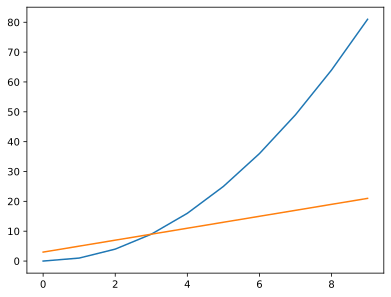


```python
plt.plot(x,y1)
plt.plot(x,y2,'*')
plt.show()
```


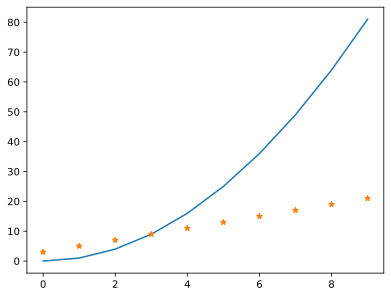


```python
plt.plot(x,y1)
plt.plot(x, y2)
plt.plot(x,y2,'*')
plt.show()

```


> vs


```python
plt.plot(x, y1)
plt.show()
plt.plot(x, y2)
plt.show()
plt.plot(x, y2, '*')
plt.show()

```


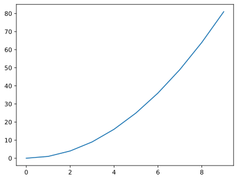


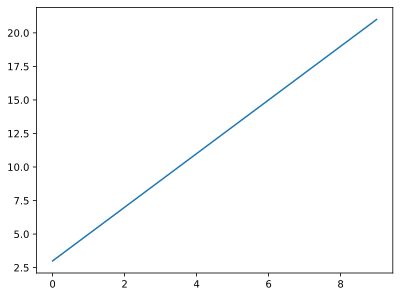


### Figsize & Plot Dimensions

`figsize`: width, height in inches


```python
plt.figure(figsize=(3,3))
plt.plot(x, y1)
plt.show()
```


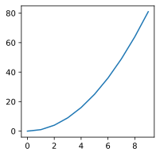


### Line style and color

#### `style.available`


```python
themes = plt.style.available
print(themes)
```

    ['Solarize_Light2', '_classic_test_patch', 'bmh', 'classic', 'dark_background', 'fast', 'fivethirtyeight', 'ggplot', 'grayscale', 'seaborn', 'seaborn-bright', 'seaborn-colorblind', 'seaborn-dark', 'seaborn-dark-palette', 'seaborn-darkgrid', 'seaborn-deep', 'seaborn-muted', 'seaborn-notebook', 'seaborn-paper', 'seaborn-pastel', 'seaborn-poster', 'seaborn-talk', 'seaborn-ticks', 'seaborn-white', 'seaborn-whitegrid', 'tableau-colorblind10']


```python
plt.style.use('seaborn')
```


```python
plt.plot(x, y1)
plt.plot(x, y2)
plt.show()

```


```python
plt.style.use('default')

```

#### `color`


```python
plt.plot(x, y1,color='red')
plt.plot(x, y2,color='blue')
plt.show()

```


#### `linestyle`


```python
plt.plot(x, y1, linestyle='--')
plt.plot(x, y2, linestyle='-.',linewidth=2)
plt.show()

```


#### `marker`


```python
plt.plot(x, y1,
			marker='o',
			color="red",
			markerfacecolor='yellow',
			markeredgecolor="blue")
plt.plot(x, y2, marker="P", markersize=10)
plt.show()
```


All available markers styles can be found in the [markers_api](https://matplotlib.org/stable/api/markers_api.html) module.

### Labels & Titles


```python
plt.plot(x, y1)
plt.plot(x, y2)
plt.xlabel('Time')
plt.ylabel('Price')
plt.title('Price vs Time')


```


    Text(0.5, 1.0, 'Price vs Time')


```python
plt.plot(x, y1)
plt.plot(x, y2)
plt.title('Price vs Time', loc='right', color='green', fontsize=20)
plt.xlabel('Time',labelpad=20,color='red',fontfamily="Fira Code",fontsize=20)
plt.ylabel('Price')

```


    Text(0, 0.5, 'Price')


[https://matplotlib.org/stable/api/_as_gen/matplotlib.pyplot.xlabel.html?highlight=xlabel#matplotlib.pyplot.xlabel](https://matplotlib.org/stable/api/_as_gen/matplotlib.pyplot.xlabel.html?highlight=xlabel#matplotlib.pyplot.xlabel)

FontTyle: [https://matplotlib.org/stable/api/text_api.html#matplotlib.text.Text](https://matplotlib.org/stable/api/text_api.html#matplotlib.text.Text)

### Changing X & Y Ticks.


```python
plt.plot(x, y1)
plt.plot(x, y2)
plt.xlabel('Time')
plt.ylabel('Price')
plt.title('Price vs Time')

```


    Text(0.5, 1.0, 'Price vs Time')


```python
plt.plot(x, y1)
plt.plot(x, y2)
plt.xlabel('Time')
plt.ylabel('Price')
plt.title('Price vs Time')
plt.xticks([0,2.5,5,7.5,10])
plt.show()

```


```python
plt.plot(x, y1)
plt.plot(x, y2)
plt.xlabel('Time')
plt.ylabel('Price')
plt.title('Price vs Time')
plt.yticks([0, 15, 30, 45], labels=["0tk", "15tk", "30tk", "45tk" ])
plt.show()

```


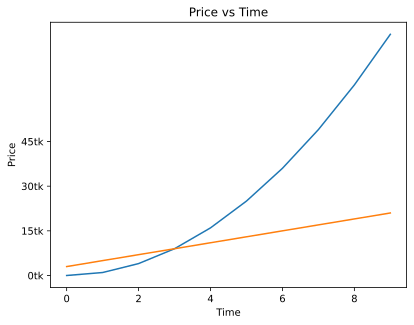


- `xlim`: Get or set the x limits of the current pltes.


```python
plt.plot(x, y1)
plt.plot(x, y2)
plt.xlabel('Time')
plt.ylabel('Price')
plt.title('Price vs Time')
print(plt.ylim())
plt.xlim()

```

    (-4.05, 85.05)


    (-0.45, 9.45)


```python
plt.plot(x, y1)
plt.plot(x, y2)
plt.xlabel('Time')
plt.ylabel('Price')
plt.title('Price vs Time')
plt.xlim(2,8)
plt.ylim(20,50)
plt.show()
```


### Adding Legends To Plots


```python
plt.style.use('seaborn')
plt.plot(x, y1, '--b')
plt.plot(x, y2)
plt.legend(['iPhone', 'Android'],shadow=True,frameon=True,facecolor='white')
plt.show()
# if....
# plt.plot(x, y1, label='iPhone')
# plt.plot(x, y2, label='Android')
# plt.lagend()

```


### Annotation


The `annotate()` function in pyplot module of matplotlib library is used to annotate the point xy with text s.

Parameters: This method accept the following parameters that are described below:

- `s`: This parameter is the `text` of the annotation.
- `xy`: This parameter is the `point (x, y)` to **annotate**.
- `xytext`: The position `(x, y)` to **place the text at**. The coordinate system is determined by textcoords.
- `xycoords`: This parameter is also an optional parameter and contains the string value.
- `textcoords`: This parameter contains the string value.Coordinate system that xytext is given, which may be different than the coordinate system used for xy
- `arrowprops` : The properties used to **draw a FancyArrowPatch** arrow **between** the positions `xy` and `xytext`.Its default value is None.
- `annotation_clip` : This parameter is also an optional parameter and contains boolean value.Its default value is None which behaves as True.

[https://matplotlib.org/stable/api/_as_gen/matplotlib.pyplot.annotate.html](https://matplotlib.org/stable/api/_as_gen/matplotlib.pyplot.annotate.html)


```python
plt.plot(x, y1, '--b')
plt.plot(x, y2)
plt.annotate(xy=[5.5, 40], s='iPhone')
plt.annotate(xy=[6, 17], s='Android')
plt.show()

```


#### Arrows


```python
t = np.arange(0.0, 5.0, 0.001)
s = np.cos(3 * np.pi * t)
line = plt.plot(t, s, lw=2)

# Annotation
plt.annotate('Local Mplt',
            xy=(3.3, 1),
            arrowprops=dict(facecolor='green',shrink=0.05))
plt.ylim(-2, 2)

```


    (-2.0, 2.0)


In an annotation, there are two points to consider:
- the location being **annotated** represented by the argument `xy` and
- the location of the **text** `xytext`.

Both of these arguments are (x, y) tuples and **arrow** is drawn between the positions `xy` and `xytext`


```python
t = np.arange(0.0, 5.0, 0.001)
s = np.cos(3 * np.pi * t)
line = plt.plot(t, s, lw=2)

plt.annotate('Local Mplt',
             xy=(3.3, 1),# annotated at (3.3,1)
             xytext=(2, 1.5),# text at (2,1.5)
             arrowprops=dict(facecolor='green'))
plt.ylim(-2, 2)

```


    (-2.0, 2.0)


More arrow options: [FancyArrowPatch](https://matplotlib.org/stable/api/_as_gen/matplotlib.patches.FancyArrowPatch.html#matplotlib.patches.FancyArrowPatch)


```python
x = np.linspace(0, 20, 100)
plt.plot(x, np.cos(x))
plt.axis('equal')

plt.annotate('local minimum',
            xy=(np.pi, -1),
            xytext=(0, -4),
            arrowprops=dict(arrowstyle="->"),
            )


plt.annotate('local minimum',
             xy=(3*np.pi, -1),
             xytext=(2, -6),
             arrowprops=dict(linestyle="-.", linewidth=2,
                                arrowstyle="-|>",
                                connectionstyle="angle,angleA=0,angleB=90"),
             bbox=dict(boxstyle="round", facecolor="yellow")
             )
plt.annotate('local minimum',
             xy=(5*np.pi, -1),
             xytext=(2, 4),
             arrowprops=dict(linestyle="-.", linewidth=2,
                                arrowstyle="-|>",
                                connectionstyle="angle3,angleA=0,angleB=90"),
             bbox=dict(boxstyle="round,pad=1", facecolor="yellow",alpha=0.4)
             )

```


    Text(2, 4, 'local minimum')


## Scatter Plots

- scatters data points across x and y pltis


```python
plt.scatter(x,y1)
```


    <matplotlib.collections.PathCollection at 0x1f586c09f10>


```python
plt.scatter(x,y1,color='red',marker="*",label='iPhone')
plt.scatter(x,y2,color='green',label='Android')
plt.xlabel('Time')
plt.ylabel('Price')
plt.title('Price vs Time')
plt.legend()
plt.show()
```


```python
data = np.random.randn(100,2)
data.shape
```


    (100, 2)


```python
plt.scatter(x=data[:,0],y=data[:,1])
plt.show()
```


```python
x, y = np.random.rand(2, 100)
plt.scatter(x, y)
plt.show()
```


[weight-height-dataset](https://www.kaggle.com/sonalisingh1411/linear-regression-using-weight-height/data)


```python
import pandas as pd
df = pd.read_csv('weight-height-min.csv')
df.head()
```


<div>

<table border="1" class="dataframe">
  <thead>
    <tr style="text-align: right;">
      <th></th>
      <th>Gender</th>
      <th>Height</th>
      <th>Weight</th>
    </tr>
  </thead>
  <tbody>
    <tr>
      <th>0</th>
      <td>Male</td>
      <td>73.847017</td>
      <td>241.893563</td>
    </tr>
    <tr>
      <th>1</th>
      <td>Male</td>
      <td>68.781904</td>
      <td>162.310473</td>
    </tr>
    <tr>
      <th>2</th>
      <td>Male</td>
      <td>74.110105</td>
      <td>212.740856</td>
    </tr>
    <tr>
      <th>3</th>
      <td>Male</td>
      <td>71.730978</td>
      <td>220.042470</td>
    </tr>
    <tr>
      <th>4</th>
      <td>Male</td>
      <td>69.881796</td>
      <td>206.349801</td>
    </tr>
  </tbody>
</table>
</div>


```python
plt.scatter(x=df['Height'], y=df["Weight"])
plt.xlabel('Height')
plt.ylabel('Weight')
plt.title('Height vs Weight')
plt.show()

```


You may also optionally provide the scale of each point.


```python
x, y, scale = np.random.rand(3, 100)
scale = 500 * scale ** 5
plt.scatter(x, y, s=scale)
plt.show()

```


And as usual there are a number of other attributes you can set, such as the fill and edge colors and the alpha level.


```python
for color in ['red', 'green', 'blue']:
    n = 100
    x, y = np.random.rand(2, n)
    scale = 500.0 * np.random.rand(n) ** 5
    plt.scatter(x, y, s=scale, c=color, alpha=0.3, edgecolors='blue')

plt.grid(True)

plt.show()

```


### Annotate Scatter Plot


```python
y = [3.2, 3.9, 3.7, 3.5, 3.02199]
x = [0.15, 0.3, 0.45, 0.6, 0.75]
n = ['AAA', "BBB", 'C', 'D', 'E']

plt.scatter(x, y)

for i, txt in enumerate(n):
    plt.annotate(txt, (x[i], y[i]))
plt.show()

```


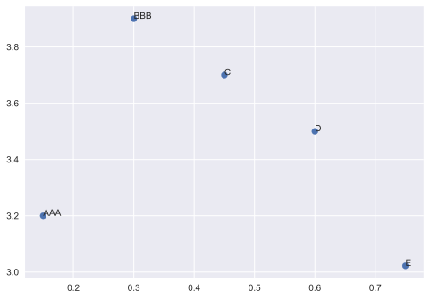


## Bar Graphs

### Basic

- plot a bar graph between heights and labels we provide


```python
x = np.arange(4)
print(x)
y= [40,17,12,9]

plt.bar(x,y,width=0.5,tick_label=['A','B','C','D'])

```

    [0 1 2 3]


    <BarContainer object of 4 artists>


### Grouped Bar Chart :  Basic


```python
x = np.arange(4)
print(x)
y = [40, 17, 12, 9]
y2= [30, 15, 10, 7]
plt.bar(x, y, width=0.5, tick_label=['A', 'B', 'C', 'D'])
plt.bar(x, y2, width=0.5, tick_label=['A', 'B', 'C', 'D'])
```

    [0 1 2 3]


    <BarContainer object of 4 artists>


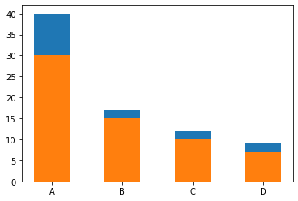


```python
x = np.arange(4)
print(x)
y = [40, 17, 12, 9]
y2 = [30, 15, 10, 7]
plt.bar(x, y, width=0.3, tick_label=[2010,2011,2012,2013],label='CarA') # see ticks and tickers
plt.bar(x+.3, y2, width=0.3, tick_label=[2010,2011,2012,2013],label='CarB')
plt.xlabel('Years')
plt.ylabel('Sales')
plt.legend()
plt.show()

```

    [0 1 2 3]


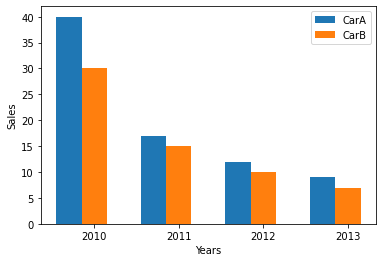


### Grouped Bar Chart :  Advanced


```python
df = pd.read_csv("grouped_data.csv")
df.head()
```


<div>

<table border="1" class="dataframe">
  <thead>
    <tr style="text-align: right;">
      <th></th>
      <th>Model</th>
      <th>F1</th>
      <th>F2</th>
      <th>F3</th>
    </tr>
  </thead>
  <tbody>
    <tr>
      <th>0</th>
      <td>A</td>
      <td>1</td>
      <td>2</td>
      <td>3</td>
    </tr>
    <tr>
      <th>1</th>
      <td>B</td>
      <td>2</td>
      <td>3</td>
      <td>4</td>
    </tr>
    <tr>
      <th>2</th>
      <td>A</td>
      <td>1</td>
      <td>2</td>
      <td>3</td>
    </tr>
    <tr>
      <th>3</th>
      <td>C</td>
      <td>5</td>
      <td>6</td>
      <td>7</td>
    </tr>
    <tr>
      <th>4</th>
      <td>B</td>
      <td>2</td>
      <td>3</td>
      <td>4</td>
    </tr>
  </tbody>
</table>
</div>


```python
df.groupby("Model").mean().reset_index()
```


<div>

<table border="1" class="dataframe">
  <thead>
    <tr style="text-align: right;">
      <th></th>
      <th>Model</th>
      <th>F1</th>
      <th>F2</th>
      <th>F3</th>
    </tr>
  </thead>
  <tbody>
    <tr>
      <th>0</th>
      <td>A</td>
      <td>1.0</td>
      <td>2.0</td>
      <td>3.0</td>
    </tr>
    <tr>
      <th>1</th>
      <td>B</td>
      <td>2.0</td>
      <td>3.0</td>
      <td>4.0</td>
    </tr>
    <tr>
      <th>2</th>
      <td>C</td>
      <td>5.0</td>
      <td>6.0</td>
      <td>7.0</td>
    </tr>
  </tbody>
</table>
</div>


```python
res_mean = df.groupby("Model").mean().reset_index()
res_mean.plot(kind="bar")
```


    <AxesSubplot:>


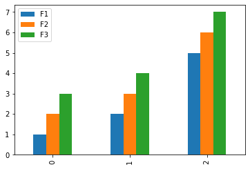


```python
res_mean = df.groupby("Model").mean().reset_index().set_index('Model')
res_mean.plot(kind="bar")
```


    <AxesSubplot:xlabel='Model'>


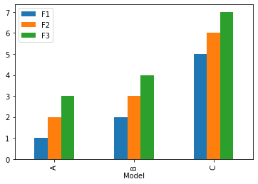


```python
# Grouping the DataFrame by 'Model'
grouped = df.groupby('Model').mean()

# Extracting columns and colors
y_cols = ['F1', 'F2', 'F3']
colors = ['#1c4cc3', '#1878a7', '#18a88f']
X = grouped.index
width = 0.2

# Creating the plot
fig, ax1 = plt.subplots(figsize=(10, 6))

for i, y_col in enumerate(y_cols):
    x_data = [x + width * i for x in range(len(X))]
    y_data = grouped[y_col]
    ax1.bar(x_data, y_data, width=width, color=colors[i], label=y_col)

ax1.set_xlabel('Model')
ax1.set_ylabel('Mean Value')
ax1.set_title('Grouped Bar Plot')
ax1.set_xticks([x + 0.5 * (len(y_cols) - 1) * width for x in range(len(X))])
ax1.set_xticklabels(X)
ax1.legend()

plt.tight_layout()
plt.show()

```


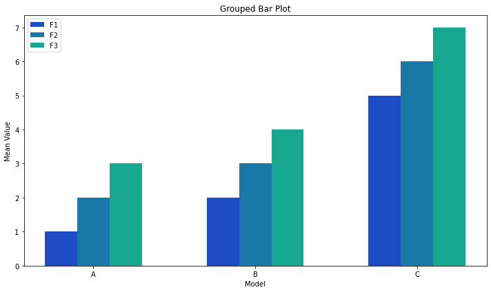


### Annotate Bar


```python
labels = ['Mon', 'Tue', 'Wed', 'Thu', 'Fri']
shop_a = [20, 33, 30, 28, 27]
shop_b = [25, 32, 33, 20, 25]

x = np.arange(len(labels))
width = 0.35  # the width of the bars

fig, ax = plt.subplots()
rects1 = ax.bar(x - width/2, shop_a, width, label='Sales-a')
rects2 = ax.bar(x + width/2, shop_b, width, label='sales-b')


ax.set_ylabel('Sales')
ax.set_title('Sales report of 2 shops')
ax.set_xticks(x)
ax.set_xticklabels(labels)
ax.legend()


def autolabel(rects):
    for rect in rects:
        height = rect.get_height()
        ax.annotate('{}'.format(height),
                    xy=(rect.get_x() + rect.get_width() / 2, height),
                    xytext=(0, 3),
                    textcoords="offset points", size=16,color="Green",
                    ha='center', va='bottom')


autolabel(rects1)
autolabel(rects2)

fig.tight_layout()

plt.show()
```


## Histograms

- creating dummy data using normal distribution


```python
data = [1, 1.1, 1.8, 2, 2.1, 3.2, 3, 3, 3, 3]
plt.subplot(211)
plt.hist(data, bins = 10, rwidth=0.8)

plt.subplot(212)
plt.hist(data, bins = [1, 1.5, 2, 2.5, 3], rwidth=0.95)
plt.xlabel("Value")
plt.ylabel("Frequency")

plt.show()
```


```python
data1 = np.random.randn(400)
data2 = np.random.randn(500) + 3
data3 = np.random.randn(450) + 6
data4a = np.random.randn(200) + 9
data4b = np.random.randn(100) + 10

plt.hist(data1, bins=5, color='g', alpha=0.75, label='bar hist') # default histtype='bar'
plt.hist(data2, color='b', alpha=0.65, histtype='stepfilled', label='stepfilled hist')
plt.hist(data3, color='r', histtype='step', label='step hist')
plt.hist((data4a, data4b), color=('r','m'), alpha=0.55, histtype='barstacked', label=('barstacked a', 'barstacked b'))

plt.xlabel("Value")
plt.ylabel("Frequency")
plt.legend()
plt.grid(True)
plt.show()
```


### Standard Deviation

<div align="center">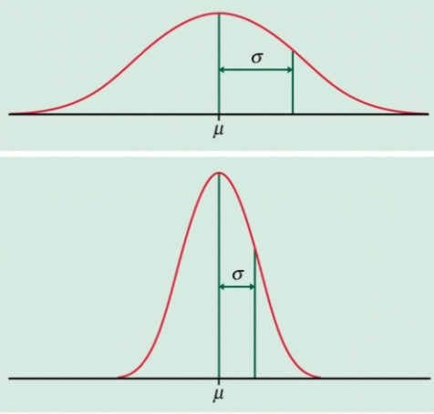</div>

<!-- $$
 \color{DarkOrange} \sigma=\sqrt{\frac{\sum{|x_{i} - \mu|^{2}}^{}}{N}}
$$ -->

<div align="center"></div>


```python
X = np.random.randn(500)
mu = 70
sigma = 8
data = np.round(mu + sigma*X)
```


```python
plt.hist(data,bins=10)
```


    (array([  3.,   9.,  26.,  53., 123., 148.,  72.,  46.,  15.,   5.]),
     array([43. , 48.2, 53.4, 58.6, 63.8, 69. , 74.2, 79.4, 84.6, 89.8, 95. ]),
     <BarContainer object of 10 artists>)


## Subplots


### `plt.subplots()`

- [https://jakevdp.github.io/PythonDataScienceHandbook/04.08-multiple-subplots.html](https://jakevdp.github.io/PythonDataScienceHandbook/04.08-multiple-subplots.html)
- [https://omz-software.com/pythonista/matplotlib/users/gridspec.html](https://omz-software.com/pythonista/matplotlib/users/gridspec.html)

A matplotlib figure may contain multiple subplots. These subplots are organized in a grid. To create a subplot, just call the `subplot` function, and specify the number of rows and columns in the figure, and the index of the subplot you want to draw on (starting from 1, then left to right, and top to bottom). Note that pyplot keeps track of the currently active subplot (which you can get a reference to by calling `plt.gca()`), so when you call the `plot` function, it draws on the *active* subplot.


```python
x = np.linspace(-1.4, 1.4, 30)
plt.subplot(2, 2, 1)  # 2 rows, 2 columns, [1st subplot = top left]
plt.plot(x, x)
plt.subplot(2, 2, 2)  # 2 rows, 2 columns, [2nd subplot = top right]
plt.plot(x, x**2)
plt.subplot(2, 2, 3)  # 2 rows, 2 columns, [3rd subplot = bottow left]
plt.plot(x, x**3)
plt.subplot(2, 2, 4)  # 2 rows, 2 columns, [4th subplot = bottom right]
plt.plot(x, x**4)
plt.show()
```


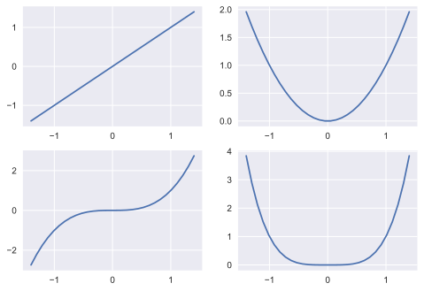


* Note that `subplot(223)` is a shorthand for `subplot(2, 2, 3)`.

It is easy to create subplots that span across multiple grid cells like so:


```python
plt.subplot(2, 2, 1)  # 2 rows, 2 columns, 1st subplot = top left
plt.plot(x, x)
plt.subplot(2, 2, 2)  # 2 rows, 2 columns, 2nd subplot = top right
plt.plot(x, x**2)
plt.subplot(2, 1, 2)  # 2 rows, *1* column, 2nd subplot = bottom
plt.plot(x, x**3)
plt.show()
```


### `plt.GridSpec()`

To go beyond a regular grid to subplots that span multiple rows and columns, `plt.GridSpec()` is the best tool. `The plt.GridSpec()` object does not create a plot by itself; it is simply a convenient interface that is recognized by the `plt.subplot()` command. For example, a `gridspec` for a grid of two rows and three columns with some specified width and height space looks like this:


```python
import matplotlib.gridspec as gridspec
gs = gridspec.GridSpec(2, 2) # 2 rows, 2 columns
ax1 = plt.subplot(gs[0, 0]) # 1st subplot = top left
ax2 = plt.subplot(gs[0, 1]) # 2nd subplot = top right
ax3 = plt.subplot(gs[1, :]) # 3rd subplot = bottom
x = np.linspace(-1.4, 1.4, 30)
ax1.plot(x, x)
ax2.plot(x, x**2)
ax3.plot(x, x**3)


```


    [<matplotlib.lines.Line2D at 0x1170b4b72e0>]


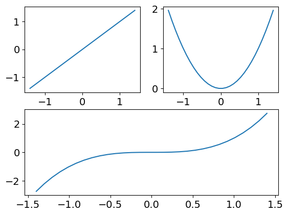


```python
df = pd.read_csv('keyphrase-evaluation.csv')
df
```


<div>

<table border="1" class="dataframe">
  <thead>
    <tr style="text-align: right;">
      <th></th>
      <th>Model</th>
      <th>Precision</th>
      <th>Recall</th>
      <th>F-1</th>
      <th>level</th>
    </tr>
  </thead>
  <tbody>
    <tr>
      <th>0</th>
      <td>TeKET</td>
      <td>0.252252</td>
      <td>0.116424</td>
      <td>0.159317</td>
      <td>1</td>
    </tr>
    <tr>
      <th>1</th>
      <td>YAKE</td>
      <td>0.283784</td>
      <td>0.130977</td>
      <td>0.179232</td>
      <td>1</td>
    </tr>
    <tr>
      <th>2</th>
      <td>IFTDF</td>
      <td>0.256757</td>
      <td>0.118503</td>
      <td>0.162162</td>
      <td>1</td>
    </tr>
    <tr>
      <th>3</th>
      <td>TR</td>
      <td>0.220721</td>
      <td>0.101871</td>
      <td>0.139403</td>
      <td>1</td>
    </tr>
    <tr>
      <th>4</th>
      <td>PR</td>
      <td>0.058559</td>
      <td>0.027027</td>
      <td>0.036984</td>
      <td>1</td>
    </tr>
    <tr>
      <th>5</th>
      <td>TeKET</td>
      <td>0.084719</td>
      <td>0.039067</td>
      <td>0.053473</td>
      <td>2</td>
    </tr>
    <tr>
      <th>6</th>
      <td>YAKE</td>
      <td>0.081648</td>
      <td>0.037684</td>
      <td>0.051567</td>
      <td>2</td>
    </tr>
    <tr>
      <th>7</th>
      <td>IFTDF</td>
      <td>0.078277</td>
      <td>0.036128</td>
      <td>0.049438</td>
      <td>2</td>
    </tr>
    <tr>
      <th>8</th>
      <td>TR</td>
      <td>0.064045</td>
      <td>0.029559</td>
      <td>0.040449</td>
      <td>2</td>
    </tr>
    <tr>
      <th>9</th>
      <td>PR</td>
      <td>0.007491</td>
      <td>0.003457</td>
      <td>0.004731</td>
      <td>2</td>
    </tr>
    <tr>
      <th>10</th>
      <td>TeKET</td>
      <td>0.017643</td>
      <td>0.008095</td>
      <td>0.011092</td>
      <td>3</td>
    </tr>
    <tr>
      <th>11</th>
      <td>YAKE</td>
      <td>0.015358</td>
      <td>0.007088</td>
      <td>0.009700</td>
      <td>3</td>
    </tr>
    <tr>
      <th>12</th>
      <td>IFTDF</td>
      <td>0.013061</td>
      <td>0.006028</td>
      <td>0.008249</td>
      <td>3</td>
    </tr>
    <tr>
      <th>13</th>
      <td>TR</td>
      <td>0.016506</td>
      <td>0.007618</td>
      <td>0.010425</td>
      <td>3</td>
    </tr>
    <tr>
      <th>14</th>
      <td>PR</td>
      <td>0.000746</td>
      <td>0.000344</td>
      <td>0.000471</td>
      <td>3</td>
    </tr>
  </tbody>
</table>
</div>


```python
from matplotlib.ticker import FormatStrFormatter

```


```python
y_cols = ['Precision','Recall','F-1']
barLabelFormat=.2
width=0.3
p1 = ['#1c4cc3', '#1878a7', '#18a88f']
```


```python
import matplotlib.gridspec as gridspec
gs = gridspec.GridSpec(1, 3)
plt.figure(figsize=(30,6))
ax1 = plt.subplot(gs[0, 0])
ax2 = plt.subplot(gs[0, 1])
ax3 = plt.subplot(gs[0, 2])

# subplot 1
L1 = df[df['level']==1]
L1_X = np.arange(len(L1['Model']))
L1_X_ticks = L1['Model'].tolist()
	# plot bars
for i,y_col in enumerate(y_cols):
	x_data = L1_X + width*i
	y_data = L1[y_col]
	ax1.bar(x_data, y_data, width=width, color=p1[i])
	# set ticks on each bar
	for x,y in zip(x_data,y_data):
		ax1.text(x,y,f'%{barLabelFormat}f'%y,ha='center',va='bottom')
ax1.yaxis.set_major_formatter(FormatStrFormatter('%.3f'))
# set ticks on x-axis
ax1.set_xticks(L1_X + width, L1_X_ticks, rotation=45)
ax1.legend(y_cols)
ax1.set_title('Level 1: Precision, Recall, F-1')
ax1.set_ylim((0,.35))

# subplot 2
L2 = df[df['level']==2]
L2_X = np.arange(len(L2['Model']))
L2_X_ticks = L2['Model'].tolist()
for i,y_col in enumerate(y_cols):
	x_data = L2_X + width*i
	y_data = L2[y_col]
	ax2.bar(x_data, y_data, width=width, color=p1[i])
	for x,y in zip(x_data,y_data):
		ax2.text(x,y,f'%{barLabelFormat}f'%y,ha='center',va='bottom')
ax2.yaxis.set_major_formatter(FormatStrFormatter('%.3f'))
ax2.set_xticks(L2_X + width, L2_X_ticks, rotation=45)
ax2.legend(y_cols)
ax2.set_title('Level 2: Precision, Recall, F-1')
ax2.set_ylim((0,.35))

# subplot 3
L3 = df[df['level']==2]
L3_X = np.arange(len(L3['Model']))
L3_X_ticks = L3['Model'].tolist()
for i,y_col in enumerate(y_cols):
	x_data = L3_X + width*i
	y_data = L3[y_col]
	ax3.bar(x_data, y_data, width=width, color=p1[i])
	for x,y in zip(x_data,y_data):
		ax3.text(x,y,f'%{barLabelFormat}f'%y,ha='center',va='bottom')
ax3.yaxis.set_major_formatter(FormatStrFormatter('%.3f'))
ax3.set_xticks(L3_X + width, L3_X_ticks, rotation=45)
ax3.legend(y_cols)
ax3.set_title('Level 3: Precision, Recall, F-1')
ax3.set_ylim((0,.35))

```


    (0.0, 0.35)


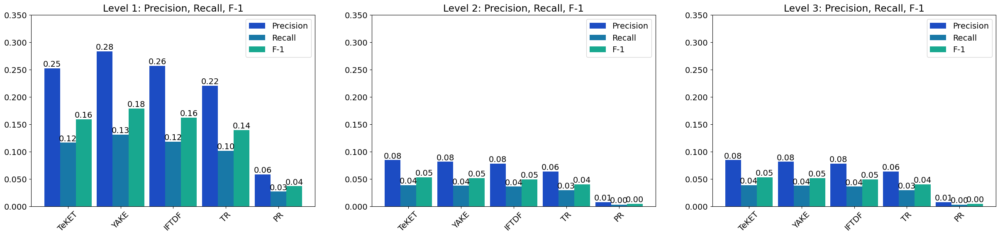


## 3D projection


```python
a = np.arange(0,4)
print(a)
b = np.arange(4,7)
print(b)
```

    [0 1 2 3]
    [4 5 6]


```python
x,y = np.meshgrid(a,b)
print(x)
print(y)
```

    [[0 1 2 3]
     [0 1 2 3]
     [0 1 2 3]]
    [[4 4 4 4]
     [5 5 5 5]
     [6 6 6 6]]


```python
fig = plt.figure()
fig.gca(projection='3d')
```


    <Axes3DSubplot:>


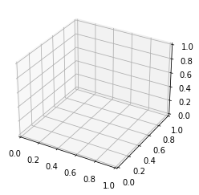


```python
a=np.arange(-1,1,0.005)
b=a
x,y = np.meshgrid(a,b)
```


```python
fig = plt.figure()
plt= fig.gca(projection='3d')
plt.plot_surface(x,y,x**2+y**2,cmap='viridis')
plt.show()
```


## Images

Reading, generating and plotting images in matplotlib is quite straightforward.

To read an image, just import the `matplotlib.image` module, and call its `imread` function, passing it the file name (or file object). This returns the image data, as a NumPy array. Let's try this with the `my_square_function.png` image we saved earlier.


```python
img = plt.imread('img/pikachu.jpg')
```


```python
print(type(img))
print(img.shape)

```

    <class 'numpy.ndarray'>
    (600, 400, 3)


```python
plt.imshow(img)
```


    <matplotlib.image.AxesImage at 0x161ccf058b0>


```python
plt.imshow(img)
plt.pltis('off')
plt.show()
```


### cropping


```python
#  img [rows,cols,channels]
pikachu_face =  img[300:515,190:390,:]
pikachu_face.shape
```


    (215, 200, 3)


```python
plt.imshow(pikachu_face)
plt.pltis('off')
plt.show()
```


### RGB Channel


```python
#  img [rows,cols,channels]
img_copy = img.copy()
```


```python
img_copy[:, :, 0] = 0
img_copy[0:1]
```


    array([[[  0, 179, 225],
            [  0, 178, 223],
            [  0, 178, 223],
            ...,
            [  0, 114, 183],
            [  0, 114, 183],
            [  0, 114, 183]]], dtype=uint8)


```python
plt.imshow(img_copy)
plt.pltis('off')
plt.show()
```


## Saving a figure
Saving a figure to disk is as simple as calling [`savefig`](http://matplotlib.org/api/pyplot_api.html#matplotlib.pyplot.savefig) with the name of the file (or a file object). The available image formats depend on the graphics backend you use.


```python
x = np.linspace(-1.4, 1.4, 30)
plt.plot(x, x**2)
plt.savefig("my_square_function.png", transparent=True)
```


