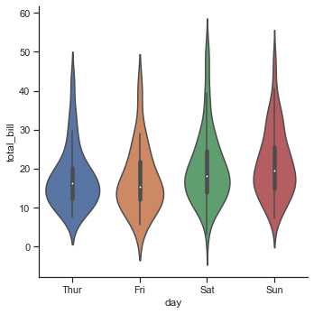
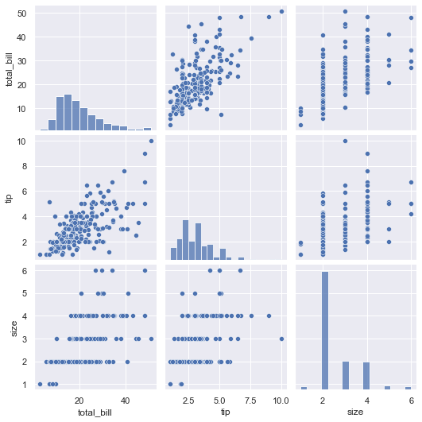
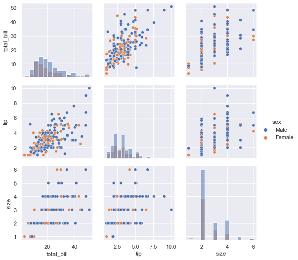
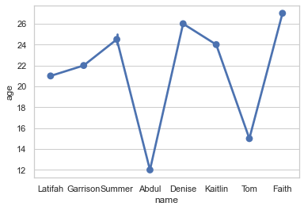

# Seaborn

- [Seaborn](#seaborn)
  - [Initialization](#initialization)
  - [Load Data To Construct Seaborn Plots](#load-data-to-construct-seaborn-plots)
  - [Seaborn For Statistical Analysis](#seaborn-for-statistical-analysis)
    - [`seaborn.scatterplot()`](#seabornscatterplot)
    - [`seaborn.lineplot()`](#seabornlineplot)
    - [`relplot()`](#relplot)
  - [Plotting with Categorical Data](#plotting-with-categorical-data)
    - [Categorical Estimate plots](#categorical-estimate-plots)
      - [`countplot()`](#countplot)
        - [Show value counts for a `single` categorical variable.](#show-value-counts-for-a-single-categorical-variable)
        - [Showing value counts for `two` categorical variables](#showing-value-counts-for-two-categorical-variables)
      - [`barplot()`](#barplot)
      - [`pointplot()`](#pointplot)
    - [Categorical Scatter plot](#categorical-scatter-plot)
      - [`seaborn.stripplot()`](#seabornstripplot)
      - [`saborn.swarmplot()`](#sabornswarmplot)
    - [Categorical Distribution Plots](#categorical-distribution-plots)
      - [`boxplot()`](#boxplot)
        - [Using hue parameter:](#using-hue-parameter)
      - [`violinplot()`](#violinplot)
        - [Using hue parameter:](#using-hue-parameter-1)
      - [`boxenplot()`](#boxenplot)
    - [`catplot()`](#catplot)
  - [Plotting univariate(single variable) Distributions](#plotting-univariatesingle-variable-distributions)
    - [`distplot()`](#distplot)
    - [`kdeplot()`](#kdeplot)
    - [`histplot()`](#histplot)
  - [Depicting bivariate distributions](#depicting-bivariate-distributions)
  - [Multi-Plot grids](#multi-plot-grids)
    - [Facetgrid](#facetgrid)
    - [🚀🚀Pair Grid + Pair Plot](#pair-grid--pair-plot)
  - [Heatmap and Correlation](#heatmap-and-correlation)
    - [Correlation](#correlation)
    - [Heatmap](#heatmap)
    - [`pd.pivot_table()`](#pdpivot_table)
    - [`clustermap()`](#clustermap)
  - [Customized Styles and Themes in Seaborn](#customized-styles-and-themes-in-seaborn)
  - [🚀🚀Seaborn with multiple columns](#seaborn-with-multiple-columns)


## Initialization

- `seaborne` is a Python library for creating attractive statistical graphics.
- It is based on `matplotlib` and provides a high-level interface for creating plots.


```python
"""
cd .\03seaborn\
jupyter nbconvert --to markdown sns.ipynb --output README.md

"""
import numpy as np
import seaborn as sns
import pandas as pd
import matplotlib.pyplot as plt

from matplotlib_inline.backend_inline import set_matplotlib_formats
set_matplotlib_formats('png')

```

## Load Data To Construct Seaborn Plots


Importing in-built datasets from seaborn that are automatically downloaded at the time of installation. You can also use Pandas to import any dataset but using in-built datasets can come really handy when practising Seaborn. Here is how we can get a list of all datasets that are in-built in Seaborn


```python
print(sns.get_dataset_names())

```

    ['anagrams', 'anscombe', 'attention', 'brain_networks', 'car_crashes', 'diamonds', 'dots', 'exercise', 'flights', 'fmri', 'gammas', 'geyser', 'iris', 'mpg', 'penguins', 'planets', 'taxis', 'tips', 'titanic']


```python
df = sns.load_dataset('iris')
```


```python
df.head()
```


<div>

<table border="1" class="dataframe">
  <thead>
    <tr style="text-align: right;">
      <th></th>
      <th>sepal_length</th>
      <th>sepal_width</th>
      <th>petal_length</th>
      <th>petal_width</th>
      <th>species</th>
    </tr>
  </thead>
  <tbody>
    <tr>
      <th>0</th>
      <td>5.1</td>
      <td>3.5</td>
      <td>1.4</td>
      <td>0.2</td>
      <td>setosa</td>
    </tr>
    <tr>
      <th>1</th>
      <td>4.9</td>
      <td>3.0</td>
      <td>1.4</td>
      <td>0.2</td>
      <td>setosa</td>
    </tr>
    <tr>
      <th>2</th>
      <td>4.7</td>
      <td>3.2</td>
      <td>1.3</td>
      <td>0.2</td>
      <td>setosa</td>
    </tr>
    <tr>
      <th>3</th>
      <td>4.6</td>
      <td>3.1</td>
      <td>1.5</td>
      <td>0.2</td>
      <td>setosa</td>
    </tr>
    <tr>
      <th>4</th>
      <td>5.0</td>
      <td>3.6</td>
      <td>1.4</td>
      <td>0.2</td>
      <td>setosa</td>
    </tr>
  </tbody>
</table>
</div>


## Seaborn For Statistical Analysis


Either of the following ways can be taken into consideration during the statistical analysis:

- `seaborn.scatterplot()`
- `seaborn.lineplot()`

### `seaborn.scatterplot()`


The seaborn.scatterplot() function is basically used to depict the relationship between the parameters on the given axes respectively. Every point on the graph depicts a value corresponding to it.

Syntax:`seaborn.scatterplot(x=col_name, y=col_name, data=data)`


```python
df = pd.read_csv('user.csv')
df.head()
```


<div>

<table border="1" class="dataframe">
  <thead>
    <tr style="text-align: right;">
      <th></th>
      <th>name</th>
      <th>age</th>
    </tr>
  </thead>
  <tbody>
    <tr>
      <th>0</th>
      <td>Latifah</td>
      <td>21</td>
    </tr>
    <tr>
      <th>1</th>
      <td>Garrison</td>
      <td>22</td>
    </tr>
    <tr>
      <th>2</th>
      <td>Summer</td>
      <td>24</td>
    </tr>
    <tr>
      <th>3</th>
      <td>Abdul</td>
      <td>12</td>
    </tr>
    <tr>
      <th>4</th>
      <td>Denise</td>
      <td>26</td>
    </tr>
  </tbody>
</table>
</div>


```python
plt.figure(figsize=(10, 10))
res = sns.scatterplot(x="name", y="age", data=df)
plt.show()
```


The column-`‘name’` is represented by the `x-axis` and the column-`‘age’` by the `y-axis`.


### `seaborn.lineplot()`


The seaborn.lineplot() function can be extensively used in situations wherein we feel the need to check the dependency of a parameter on the other in a continuous manner relative to time.


```python
plt.figure(figsize=(10, 10))
res = sns.lineplot(x="name", y="age", data=df)
plt.show()

```


### `relplot()`


This is a `figure-level-function` that makes use of two other axes functions for Visualizing Statistical Relationships which are:

- scatterplot()
- lineplot()

These functions can be specified using the ‘kind’ parameter of relplot(). In case this parameter is given, it takes the default one which is scatterplot(). Before you begin writing your code, make sure to import the required libraries as follows:


```python
f = sns.load_dataset("flights")
plt.figure(figsize=(10, 10))
sns.relplot(x="passengers", y="month", data=f)
plt.show()
```


    <Figure size 720x720 with 0 Axes>


As you can see, the points are plotted in 2-dimensions.

However, you can add another dimension using the `‘hue’` semantic. Let’s take a look at an example of the same:


```python
f = sns.load_dataset("flights")
plt.figure(figsize=(10, 10))
sns.relplot(x="passengers", y="month", hue="year", data=f)
plt.show()
```


    <Figure size 720x720 with 0 Axes>


However, there are many more customizations that you can try out such as colors, styles, size, etc. Let me just show how you can change the color in the following example:


```python
sns.set(style="darkgrid")
plt.figure(figsize=(10, 10))
f = sns.load_dataset("flights")
sns.relplot(x="passengers", y="month", hue="year",
            palette="ch:r=-.5,l=.75", data=f)
plt.show()
```


    <Figure size 720x720 with 0 Axes>


This function will allow you to draw a continuous line for your data. You can use this function by changing the `‘kind’` parameter as follows:


```python
g = sns.relplot(x="name", y="age", kind="line", data=df)
plt.figure(figsize=(10, 10))
g.fig.autofmt_xdate()

```


    <Figure size 720x720 with 0 Axes>


## Plotting with Categorical Data


### Categorical Estimate plots


The estimation of categorical data basically refers to the representation of certain estimation or prediction of the categorical data values to the corresponding data variable.

Python Seaborn has the following functions to be used for the estimation of categorical data:

- `countplot()`
- `barplot()`
- `pointplot()`

#### `countplot()`


##### Show value counts for a `single` categorical variable.


A countplot basically **counts the categories** and **returns a count of their occurrences**. It is one of


```python
df = sns.load_dataset("tips")
df.head(2)
```


<div>

<table border="1" class="dataframe">
  <thead>
    <tr style="text-align: right;">
      <th></th>
      <th>total_bill</th>
      <th>tip</th>
      <th>sex</th>
      <th>smoker</th>
      <th>day</th>
      <th>time</th>
      <th>size</th>
    </tr>
  </thead>
  <tbody>
    <tr>
      <th>0</th>
      <td>16.99</td>
      <td>1.01</td>
      <td>Female</td>
      <td>No</td>
      <td>Sun</td>
      <td>Dinner</td>
      <td>2</td>
    </tr>
    <tr>
      <th>1</th>
      <td>10.34</td>
      <td>1.66</td>
      <td>Male</td>
      <td>No</td>
      <td>Sun</td>
      <td>Dinner</td>
      <td>3</td>
    </tr>
  </tbody>
</table>
</div>


```python
df.groupby('sex').total_bill.count()
```


    sex
    Male      157
    Female     87
    Name: total_bill, dtype: int64


```python
plt.figure(figsize=(10, 10))
res = sns.countplot(x='sex',data=df)
plt.show()

```


Or


```python
plt.figure(figsize=(10, 10))
res = sns.countplot(x=df['size'])

plt.show()
```


```python
# load dataset
titanic = sns.load_dataset('titanic')
titanic.head(2)

```


<div>

<table border="1" class="dataframe">
  <thead>
    <tr style="text-align: right;">
      <th></th>
      <th>survived</th>
      <th>pclass</th>
      <th>sex</th>
      <th>age</th>
      <th>sibsp</th>
      <th>parch</th>
      <th>fare</th>
      <th>embarked</th>
      <th>class</th>
      <th>who</th>
      <th>adult_male</th>
      <th>deck</th>
      <th>embark_town</th>
      <th>alive</th>
      <th>alone</th>
    </tr>
  </thead>
  <tbody>
    <tr>
      <th>0</th>
      <td>0</td>
      <td>3</td>
      <td>male</td>
      <td>22.0</td>
      <td>1</td>
      <td>0</td>
      <td>7.2500</td>
      <td>S</td>
      <td>Third</td>
      <td>man</td>
      <td>True</td>
      <td>NaN</td>
      <td>Southampton</td>
      <td>no</td>
      <td>False</td>
    </tr>
    <tr>
      <th>1</th>
      <td>1</td>
      <td>1</td>
      <td>female</td>
      <td>38.0</td>
      <td>1</td>
      <td>0</td>
      <td>71.2833</td>
      <td>C</td>
      <td>First</td>
      <td>woman</td>
      <td>False</td>
      <td>C</td>
      <td>Cherbourg</td>
      <td>yes</td>
      <td>False</td>
    </tr>
  </tbody>
</table>
</div>


    <Figure size 720x720 with 0 Axes>


```python
titanic.groupby('class').count()

```


<div>

<table border="1" class="dataframe">
  <thead>
    <tr style="text-align: right;">
      <th></th>
      <th>survived</th>
      <th>pclass</th>
      <th>sex</th>
      <th>age</th>
      <th>sibsp</th>
      <th>parch</th>
      <th>fare</th>
      <th>embarked</th>
      <th>who</th>
      <th>adult_male</th>
      <th>deck</th>
      <th>embark_town</th>
      <th>alive</th>
      <th>alone</th>
    </tr>
    <tr>
      <th>class</th>
      <th></th>
      <th></th>
      <th></th>
      <th></th>
      <th></th>
      <th></th>
      <th></th>
      <th></th>
      <th></th>
      <th></th>
      <th></th>
      <th></th>
      <th></th>
      <th></th>
    </tr>
  </thead>
  <tbody>
    <tr>
      <th>First</th>
      <td>216</td>
      <td>216</td>
      <td>216</td>
      <td>186</td>
      <td>216</td>
      <td>216</td>
      <td>216</td>
      <td>214</td>
      <td>216</td>
      <td>216</td>
      <td>175</td>
      <td>214</td>
      <td>216</td>
      <td>216</td>
    </tr>
    <tr>
      <th>Second</th>
      <td>184</td>
      <td>184</td>
      <td>184</td>
      <td>173</td>
      <td>184</td>
      <td>184</td>
      <td>184</td>
      <td>184</td>
      <td>184</td>
      <td>184</td>
      <td>16</td>
      <td>184</td>
      <td>184</td>
      <td>184</td>
    </tr>
    <tr>
      <th>Third</th>
      <td>491</td>
      <td>491</td>
      <td>491</td>
      <td>355</td>
      <td>491</td>
      <td>491</td>
      <td>491</td>
      <td>491</td>
      <td>491</td>
      <td>491</td>
      <td>12</td>
      <td>491</td>
      <td>491</td>
      <td>491</td>
    </tr>
  </tbody>
</table>
</div>


    <Figure size 720x720 with 0 Axes>


```python
# create plot
plt.figure(figsize=(10, 10))
sns.countplot(x='class', data=titanic, palette='magma')
plt.title('Survivors')
plt.show()

```


##### Showing value counts for `two` categorical variables


Showing value counts for **two categorical variables** and using `hue` parameter:
- `hue` : (optional) This parameter take column name for colour encoding.

While the points are plotted in two dimensions, another dimension can be added to the plot by coloring the points according to a third variable.


```python
# create plot
plt.figure(figsize=(10, 10))
sns.countplot(x='class', hue='sex', data=titanic, palette='magma')
plt.title('Survivors')
plt.show()

```


```python
titanic.groupby(['class', 'sex']).count()
```


<div>

<table border="1" class="dataframe">
  <thead>
    <tr style="text-align: right;">
      <th></th>
      <th></th>
      <th>survived</th>
      <th>pclass</th>
      <th>age</th>
      <th>sibsp</th>
      <th>parch</th>
      <th>fare</th>
      <th>embarked</th>
      <th>who</th>
      <th>adult_male</th>
      <th>deck</th>
      <th>embark_town</th>
      <th>alive</th>
      <th>alone</th>
    </tr>
    <tr>
      <th>class</th>
      <th>sex</th>
      <th></th>
      <th></th>
      <th></th>
      <th></th>
      <th></th>
      <th></th>
      <th></th>
      <th></th>
      <th></th>
      <th></th>
      <th></th>
      <th></th>
      <th></th>
    </tr>
  </thead>
  <tbody>
    <tr>
      <th rowspan="2" valign="top">First</th>
      <th>female</th>
      <td>94</td>
      <td>94</td>
      <td>85</td>
      <td>94</td>
      <td>94</td>
      <td>94</td>
      <td>92</td>
      <td>94</td>
      <td>94</td>
      <td>81</td>
      <td>92</td>
      <td>94</td>
      <td>94</td>
    </tr>
    <tr>
      <th>male</th>
      <td>122</td>
      <td>122</td>
      <td>101</td>
      <td>122</td>
      <td>122</td>
      <td>122</td>
      <td>122</td>
      <td>122</td>
      <td>122</td>
      <td>94</td>
      <td>122</td>
      <td>122</td>
      <td>122</td>
    </tr>
    <tr>
      <th rowspan="2" valign="top">Second</th>
      <th>female</th>
      <td>76</td>
      <td>76</td>
      <td>74</td>
      <td>76</td>
      <td>76</td>
      <td>76</td>
      <td>76</td>
      <td>76</td>
      <td>76</td>
      <td>10</td>
      <td>76</td>
      <td>76</td>
      <td>76</td>
    </tr>
    <tr>
      <th>male</th>
      <td>108</td>
      <td>108</td>
      <td>99</td>
      <td>108</td>
      <td>108</td>
      <td>108</td>
      <td>108</td>
      <td>108</td>
      <td>108</td>
      <td>6</td>
      <td>108</td>
      <td>108</td>
      <td>108</td>
    </tr>
    <tr>
      <th rowspan="2" valign="top">Third</th>
      <th>female</th>
      <td>144</td>
      <td>144</td>
      <td>102</td>
      <td>144</td>
      <td>144</td>
      <td>144</td>
      <td>144</td>
      <td>144</td>
      <td>144</td>
      <td>6</td>
      <td>144</td>
      <td>144</td>
      <td>144</td>
    </tr>
    <tr>
      <th>male</th>
      <td>347</td>
      <td>347</td>
      <td>253</td>
      <td>347</td>
      <td>347</td>
      <td>347</td>
      <td>347</td>
      <td>347</td>
      <td>347</td>
      <td>6</td>
      <td>347</td>
      <td>347</td>
      <td>347</td>
    </tr>
  </tbody>
</table>
</div>


```python
titanic.groupby(['class', 'who']).count()

```


<div>

<table border="1" class="dataframe">
  <thead>
    <tr style="text-align: right;">
      <th></th>
      <th></th>
      <th>survived</th>
      <th>pclass</th>
      <th>sex</th>
      <th>age</th>
      <th>sibsp</th>
      <th>parch</th>
      <th>fare</th>
      <th>embarked</th>
      <th>adult_male</th>
      <th>deck</th>
      <th>embark_town</th>
      <th>alive</th>
      <th>alone</th>
    </tr>
    <tr>
      <th>class</th>
      <th>who</th>
      <th></th>
      <th></th>
      <th></th>
      <th></th>
      <th></th>
      <th></th>
      <th></th>
      <th></th>
      <th></th>
      <th></th>
      <th></th>
      <th></th>
      <th></th>
    </tr>
  </thead>
  <tbody>
    <tr>
      <th rowspan="3" valign="top">First</th>
      <th>child</th>
      <td>6</td>
      <td>6</td>
      <td>6</td>
      <td>6</td>
      <td>6</td>
      <td>6</td>
      <td>6</td>
      <td>6</td>
      <td>6</td>
      <td>6</td>
      <td>6</td>
      <td>6</td>
      <td>6</td>
    </tr>
    <tr>
      <th>man</th>
      <td>119</td>
      <td>119</td>
      <td>119</td>
      <td>98</td>
      <td>119</td>
      <td>119</td>
      <td>119</td>
      <td>119</td>
      <td>119</td>
      <td>91</td>
      <td>119</td>
      <td>119</td>
      <td>119</td>
    </tr>
    <tr>
      <th>woman</th>
      <td>91</td>
      <td>91</td>
      <td>91</td>
      <td>82</td>
      <td>91</td>
      <td>91</td>
      <td>91</td>
      <td>89</td>
      <td>91</td>
      <td>78</td>
      <td>89</td>
      <td>91</td>
      <td>91</td>
    </tr>
    <tr>
      <th rowspan="3" valign="top">Second</th>
      <th>child</th>
      <td>19</td>
      <td>19</td>
      <td>19</td>
      <td>19</td>
      <td>19</td>
      <td>19</td>
      <td>19</td>
      <td>19</td>
      <td>19</td>
      <td>4</td>
      <td>19</td>
      <td>19</td>
      <td>19</td>
    </tr>
    <tr>
      <th>man</th>
      <td>99</td>
      <td>99</td>
      <td>99</td>
      <td>90</td>
      <td>99</td>
      <td>99</td>
      <td>99</td>
      <td>99</td>
      <td>99</td>
      <td>3</td>
      <td>99</td>
      <td>99</td>
      <td>99</td>
    </tr>
    <tr>
      <th>woman</th>
      <td>66</td>
      <td>66</td>
      <td>66</td>
      <td>64</td>
      <td>66</td>
      <td>66</td>
      <td>66</td>
      <td>66</td>
      <td>66</td>
      <td>9</td>
      <td>66</td>
      <td>66</td>
      <td>66</td>
    </tr>
    <tr>
      <th rowspan="3" valign="top">Third</th>
      <th>child</th>
      <td>58</td>
      <td>58</td>
      <td>58</td>
      <td>58</td>
      <td>58</td>
      <td>58</td>
      <td>58</td>
      <td>58</td>
      <td>58</td>
      <td>3</td>
      <td>58</td>
      <td>58</td>
      <td>58</td>
    </tr>
    <tr>
      <th>man</th>
      <td>319</td>
      <td>319</td>
      <td>319</td>
      <td>225</td>
      <td>319</td>
      <td>319</td>
      <td>319</td>
      <td>319</td>
      <td>319</td>
      <td>5</td>
      <td>319</td>
      <td>319</td>
      <td>319</td>
    </tr>
    <tr>
      <th>woman</th>
      <td>114</td>
      <td>114</td>
      <td>114</td>
      <td>72</td>
      <td>114</td>
      <td>114</td>
      <td>114</td>
      <td>114</td>
      <td>114</td>
      <td>4</td>
      <td>114</td>
      <td>114</td>
      <td>114</td>
    </tr>
  </tbody>
</table>
</div>


```python
# create plot
plt.figure(figsize=(10, 10))
sns.countplot(x='class', hue='who', data=titanic, palette='magma')
plt.title('Survivors')
plt.show()

```


#### `barplot()`


The `barplot()` function basically represents the estimated data in the form of the central tendency of the data representation.A `barplot` is basically used to **aggregate the categorical data according to some methods and by default its the `mean`**. It can also be understood as a visualization of the group by action.

To use this plot we choose a `categorical` column for the `x-axis`  and a `numerical` column for the `y-axis`  and we see that it creates a plot taking a `mean` **per categorical column**.


```python
df = sns.load_dataset("tips")
df.groupby('sex').total_bill.mean()
```


    sex
    Male      20.744076
    Female    18.056897
    Name: total_bill, dtype: float64


```python
plt.figure(figsize=(10, 10))
sns.barplot(x="sex", y="total_bill", data=df)
plt.show()
```


Horizontal orientation requires numeric `x` variable.


```python
plt.figure(figsize=(10, 10))
sns.barplot(y="sex", x="total_bill", data=df,
            palette='PuRd', orient='h',)
plt.show()

```


`mean` is default


```python
df.groupby('sex').total_bill.std()
```


    sex
    Male      9.246469
    Female    8.009209
    Name: total_bill, dtype: float64


```python
plt.figure(figsize=(10, 10))
sns.barplot(x="sex", y="total_bill", data=df,estimator=np.std)
plt.show()
```


#### `pointplot()`


The seaborn.pointplot() function represents the estimation of the central tendency of the distribution with the help of scatter points and lines joining them.


```python
df = pd.read_csv("user.csv")
plt.figure(figsize=(10, 10))
res = sns.pointplot(x=df['name'], y=df['age'])
plt.show()

```


### Categorical Scatter plot

Categorical data divides and represents itself in the form of **discrete groups** i.e. a subset of the original data.

Python Seaborn module contains the following methods to represent and visualize categorical data:

- `seaborn.stripplot()`
- `seaborn.swarmplot()`

#### `seaborn.stripplot()`


The seaborn.stripplot() function considers one of the input columns as categorical data input and then it plots the points accordingly in an ordinal fashion despite the different data type of the input.


```python
plt.figure(figsize=(10, 10))
df = sns.load_dataset("tips")
res = sns.stripplot(x="tip", y="sex", data=df, jitter=0.05)
plt.show()

```


The parameter jitter is useful when the data set consists of data points that **overlap**. In such cases, setting a `jitter` value can help them get uniformly distributed.

#### `saborn.swarmplot()`

The seaborn.swarmplot() function resembles the seaborn.stripplot() function with a slight difference. The seaborn.swarmplot() function plots the data values along the categorical axis chosen. Thus, it completely avoids overlapping.


```python
plt.figure(figsize=(10, 10))

res = sns.swarmplot(x="tip", y="sex", data=df)
plt.show()

```


### Categorical Distribution Plots

Categorical Distribution data basically refers to the type of data wherein the result describes the certain possibility of the random/chosen variable to belong to one of the given possible categories.

Python Seaborn has the following functions to represent the categorical distributed data efficiently:

- `seaborn.violinplot()`
- `seaborn.boxplot()`
- `seaborn.boxenplot()`

#### `boxplot()`

The box plot, also called the box and whisker diagram is used for depicting groups of numerical data through the quartiles. It is known as the box and whisker diagram because it is composed of a box and whiskers. Boxplot is also used for detecting the outlier in a data set.

The `‘box’` structure represents the **main quartile of the data input**  while the `‘line’` structure represents the rest of the **distribution** of data. The outliers are represented by points using an **inter-quartile function**.

A box plot is composed of a summary of 5 different data points: the minimum, first quartile, median, third quartile, and maximum.

- Minimum
- First Quartile or 25%
- Median (Second Quartile) or 50%
- Third Quartile or 75%
- Maximum


```python
tips = sns.load_dataset("tips")
plt.figure(figsize=(10, 10))
sns.boxplot(x="day", y="total_bill", data=tips)
plt.show()
```


Let me briefly explain the above plot.

- The bottom black horizontal line of the box plot is the minimum value
- The first black horizontal line of the rectangle shape of the box plot is the first quartile
 or 25%
- The second black horizontal line of the rectangle shape of the box plot is Second quartile or 50% or median.
- The third black horizontal line of rectangle shape of the same box plot is third quartile or 75%
- The top black horizontal line of the rectangle shape of the box plot is the maximum value.
- The small diamond shape of the box plot is outlier data.

##### Using hue parameter:


While the points are plotted in two dimensions, another dimension can be added to the plot by coloring the points according to a third variable.


```python
tips = sns.load_dataset("tips")
plt.figure(figsize=(10, 10))
sns.boxplot(x="day", y="total_bill", data=tips, hue='smoker')
plt.show()

```


[https://www.geeksforgeeks.org/python-seaborn-tutorial/](https://www.geeksforgeeks.org/python-seaborn-tutorial/)

[https://www.geeksforgeeks.org/boxplot-using-seaborn-in-python/](https://www.geeksforgeeks.org/boxplot-using-seaborn-in-python/)

#### `violinplot()`

Violin plots also like `boxplots` **summarize** numeric data over a set of categories. They are essentially a box plot with a **kernel density estimate** (`KDE`) overlaid along with the range of the box and reflected to make it look nice. Unlike a box plot, in which all of the plot components correspond to actual data points, the violin plot features a kernel density estimation of the underlying distribution. Here are a few examples of violin plot:


```python

tips = sns.load_dataset("tips")
plt.figure(figsize=(10, 10))
ax = sns.violinplot(x=tips["total_bill"])
plt.show()
```


```python
tips = sns.load_dataset("tips")
plt.figure(figsize=(10, 10))
sns.violinplot(x="day", y="total_bill", data=tips)

```


    <AxesSubplot:xlabel='day', ylabel='total_bill'>


#####  Using hue parameter:

While the points are plotted in two dimensions, another dimension can be added to the plot by coloring the points according to a third variable.


```python
tips = sns.load_dataset("tips")
plt.figure(figsize=(10, 10))
sns.violinplot(x="day", y="total_bill", hue="sex", data=tips)
```


    <AxesSubplot:xlabel='day', ylabel='total_bill'>


```python
tips = sns.load_dataset("tips")
plt.figure(figsize=(10, 10))
sns.violinplot(x="day", y="total_bill", hue="sex", data=tips,split=True)

```


    <AxesSubplot:xlabel='day', ylabel='total_bill'>


[https://www.geeksforgeeks.org/python-seaborn-tutorial/](https://www.geeksforgeeks.org/python-seaborn-tutorial/)

[phttps://www.geeksforgeeks.org/violinplot-using-seaborn-in-python/](https://www.geeksforgeeks.org/violinplot-using-seaborn-in-python/)

#### `boxenplot()`

The `seaborn.boxenplot()` function is quite similar to `seaborn.boxplot()` function with a slight difference in the representation.

The `seaborn.boxenplot()` function represents the distribution of the categorical data in a way where the **large quartiles** represent the features corresponding to the actual data observations. It presents the data in a format that gives us a **detailed information in a visualized form**about the entire distribution of data.


```python
df = pd.read_csv("user.csv")
plt.figure(figsize=(10, 10))
res = sns.boxenplot(x=df['age'])
plt.show()

```


<div align="center">

</div>

If you analyze and compare the below output with the input data set, it is clearly understood that boxenplot represents the entire distribution of the data points ranging between 12-27, along with the distribution of the categorical data with a large quartile-box structure.


### `catplot()`

This approach comes into the picture when our main variable is further divided into discrete groups (categorical). This can be achieved using the `catplot()` function.

The `seaborn.catplot()` function, as mentioned above, is one of the techniques to analyze the **relationship between a `numeric` value and a `categorical` group of values together**.

This is a `figure-level-function` like `relplot()`. It can be characterized by three families of axes level functions namely:

- [Categorical Scatter Plot](#categorical-scatter-plot): These include` stripplot()`,` swarmplot()`
- [Categorical Distribution Plots](#categorical-distribution-plots): which are `boxplot()`, `violinplot()`, `boxenplot()`
- [Categorical Estimate Plots](#categorical-estimate-plots): namely `pointplot()`, `barplot()`,` countplot()`


```python
df = sns.load_dataset("tips")
df.head()
```


<div>

<table border="1" class="dataframe">
  <thead>
    <tr style="text-align: right;">
      <th></th>
      <th>total_bill</th>
      <th>tip</th>
      <th>sex</th>
      <th>smoker</th>
      <th>day</th>
      <th>time</th>
      <th>size</th>
    </tr>
  </thead>
  <tbody>
    <tr>
      <th>0</th>
      <td>16.99</td>
      <td>1.01</td>
      <td>Female</td>
      <td>No</td>
      <td>Sun</td>
      <td>Dinner</td>
      <td>2</td>
    </tr>
    <tr>
      <th>1</th>
      <td>10.34</td>
      <td>1.66</td>
      <td>Male</td>
      <td>No</td>
      <td>Sun</td>
      <td>Dinner</td>
      <td>3</td>
    </tr>
    <tr>
      <th>2</th>
      <td>21.01</td>
      <td>3.50</td>
      <td>Male</td>
      <td>No</td>
      <td>Sun</td>
      <td>Dinner</td>
      <td>3</td>
    </tr>
    <tr>
      <th>3</th>
      <td>23.68</td>
      <td>3.31</td>
      <td>Male</td>
      <td>No</td>
      <td>Sun</td>
      <td>Dinner</td>
      <td>2</td>
    </tr>
    <tr>
      <th>4</th>
      <td>24.59</td>
      <td>3.61</td>
      <td>Female</td>
      <td>No</td>
      <td>Sun</td>
      <td>Dinner</td>
      <td>4</td>
    </tr>
  </tbody>
</table>
</div>


```python
plt.figure(figsize=(10, 10))
sns.set(style="ticks", color_codes=True)
a = sns.load_dataset("tips")
sns.catplot(x="day", y="total_bill", data=a)

```


    <seaborn.axisgrid.FacetGrid at 0x259f8342100>


    <Figure size 720x720 with 0 Axes>


As you can see, in the above example I have not set the `‘kind’` parameter. Therefore it has returned the graph as the default scatterplot. You can specify any of the axes level function to change the graph as need be. Let’s take an example of this as well:


```python
plt.figure(figsize=(10, 10))
sns.set(style="ticks", color_codes=True)
a = sns.load_dataset("tips")
sns.catplot(x="day", y="total_bill", kind="violin", data=a)
```


    <seaborn.axisgrid.FacetGrid at 0x259f8685c10>


    <Figure size 720x720 with 0 Axes>





## Plotting univariate(single variable) Distributions

`Univariate distribution` basically refers to the distribution of the data with respect to a **single random `variable`/data item.**

### `distplot()`


Python Seaborn module’s `distplot()` function can be used to represent the univariate distribution of data set.

Syntax: `seaborn.distplot(data-column)`


```python
df = sns.load_dataset("tips")
df.head(2)
```


<div>

<table border="1" class="dataframe">
  <thead>
    <tr style="text-align: right;">
      <th></th>
      <th>total_bill</th>
      <th>tip</th>
      <th>sex</th>
      <th>smoker</th>
      <th>day</th>
      <th>time</th>
      <th>size</th>
    </tr>
  </thead>
  <tbody>
    <tr>
      <th>0</th>
      <td>16.99</td>
      <td>1.01</td>
      <td>Female</td>
      <td>No</td>
      <td>Sun</td>
      <td>Dinner</td>
      <td>2</td>
    </tr>
    <tr>
      <th>1</th>
      <td>10.34</td>
      <td>1.66</td>
      <td>Male</td>
      <td>No</td>
      <td>Sun</td>
      <td>Dinner</td>
      <td>3</td>
    </tr>
  </tbody>
</table>
</div>


```python
plt.figure(figsize=(10, 10))
sns.displot(df['total_bill'],kde=True)
plt.show()
```


    <Figure size 720x720 with 0 Axes>


```python
df = sns.load_dataset("tips")
plt.figure(figsize=(10, 10))
sns.displot(df['total_bill'], kde=False,bins=20)
plt.show()
```


    <Figure size 720x720 with 0 Axes>


### `kdeplot()`

`KDE` plot is a Kernel Density Estimate that is used for visualizing the Probability Density of the continuous or non-parametric data variables i.e. we can plot for the univariate or multiple variables altogether. Here are few of the examples


```python
df = sns.load_dataset("tips")
sns.kdeplot(df['total_bill'])
plt.figure(figsize=(10, 10))

plt.show()
```


    <Figure size 720x720 with 0 Axes>


### `histplot()`

`distplot` is a deprecated


```python
df = sns.load_dataset("tips")
plt.figure(figsize=(10, 10))
sns.histplot(df['total_bill'])
plt.show()

```


```python
df = sns.load_dataset("tips")
plt.figure(figsize=(10, 10))
sns.histplot(df['total_bill'],kde=True)
plt.show()

```


```python
np.random.seed(10)
a = np.random.normal(loc=5, size=100, scale=2)
plt.figure(figsize=(10, 10))
sns.histplot(a, kde=True, stat="density")
plt.show()
```


## Depicting bivariate distributions


**Bivariate distribution** refers to the visualization of data with respect to **two data columns or items of the data set.**

The `jointplot()` can be used to depict the relationship between the two data variables.

Syntax:`seaborn.jointplot(x=variable1, y=variable2)`


```python
sns.set_style("darkgrid")
df = pd.read_csv("user.csv")
plt.figure(figsize=(10, 10))
res = sns.jointplot(x=df['age'], y=df['age'])
plt.show()

```


    <Figure size 720x720 with 0 Axes>


```python
df = sns.load_dataset("tips")
df.head(2)

```


<div>

<table border="1" class="dataframe">
  <thead>
    <tr style="text-align: right;">
      <th></th>
      <th>total_bill</th>
      <th>tip</th>
      <th>sex</th>
      <th>smoker</th>
      <th>day</th>
      <th>time</th>
      <th>size</th>
    </tr>
  </thead>
  <tbody>
    <tr>
      <th>0</th>
      <td>16.99</td>
      <td>1.01</td>
      <td>Female</td>
      <td>No</td>
      <td>Sun</td>
      <td>Dinner</td>
      <td>2</td>
    </tr>
    <tr>
      <th>1</th>
      <td>10.34</td>
      <td>1.66</td>
      <td>Male</td>
      <td>No</td>
      <td>Sun</td>
      <td>Dinner</td>
      <td>3</td>
    </tr>
  </tbody>
</table>
</div>


```python
sns.set_style("darkgrid")
# df = pd.read_csv("user.csv")
plt.figure(figsize=(10, 10))
sns.jointplot(x=df['tip'], y=df['size'])
plt.show()

```


    <Figure size 720x720 with 0 Axes>


```python
df = sns.load_dataset("tips")
plt.figure(figsize=(10, 10))
sns.jointplot(x="total_bill", y="tip", data=df)
plt.show()
```


    <Figure size 720x720 with 0 Axes>


```python
df = sns.load_dataset("tips")
plt.figure(figsize=(10, 10))
sns.jointplot(x="total_bill", y="tip", data=df, kind="hex")
plt.show()
```


    <Figure size 720x720 with 0 Axes>


## Multi-Plot grids


In order to represent the large data set with categorical values in a precise manner, we can draw multiple plots of the sub-sets of data to visualize it.

### Facetgrid


Facet grid forms a matrix of panels defined by row and column by dividing the variables. Due to panels, a single plot looks like multiple plots. It is very helpful to analyze all combinations in two discrete variables.

The advantage of using Facet is, we can input another variable into the plot. The above plot is divided into two plots based on a third variable called ‘diet’ using the ‘col’ parameter. We can also one more parameter “row” which can help to add one more variable to our plot. Now the plot below shows that relation between tips and total bill and also show their relation with two more variables,i.e gender and time.

Syntax: `seaborn.FacetGird(data, col=value, col_wrap=value)`

- FacetGrid class helps in visualizing distribution of one variable as well as the relationship between multiple variables separately within subsets of your dataset using multiple panels.
- A FacetGrid can be drawn with up to three dimensions ? row, col, and hue. The first two have obvious correspondence with the resulting array of axes; think of the hue variable as a third dimension along a depth axis, where different levels are plotted with different colors.
- FacetGrid object takes a dataframe as input and the names of the variables that will form the row, column, or hue dimensions of the grid. The variables should be categorical and the data at each level of the variable will be used for a facet along that axis.


```python
tips = sns.load_dataset("tips")
plt.figure(figsize=(10, 10))
g = sns.FacetGrid(tips, col="time")
g.map(sns.scatterplot, "total_bill", "tip")
plt.show()
```


    <Figure size 720x720 with 0 Axes>


### 🚀🚀Pair Grid + Pair Plot


`Pairplot` represents pairwise relation across the entire dataframe and supports an additional argument called `hue` for categorical separation. What it does basically is create a `jointplot` between every possible numerical column and takes a while if the dataframe is really huge. It is plotted using the `pairplot()` method.


```python
tips = sns.load_dataset("tips")
sns.pairplot(tips)
plt.show()

```





```python
tips = sns.load_dataset("tips")
sns.pairplot(tips,hue='sex')
plt.show()
```


```python
tips = sns.load_dataset("tips")
cols = ['total_bill', 'size']
sns.pairplot(tips,hue='sex', vars=cols)
plt.show()

```


Using PairGrid:

- [https://seaborn.pydata.org/generated/seaborn.PairGrid.html](https://seaborn.pydata.org/generated/seaborn.PairGrid.html)


```python
# cols = ['total_bill', 'size']
# g = sns.PairGrid(tips,hue='sex', vars=cols)

g = sns.PairGrid(tips,hue='sex')
# g.map_diag(plt.hist)
# g.map_offdiag(plt.scatter);
g.map_diag(sns.histplot)
g.map_offdiag(sns.scatterplot)
g.add_legend()
plt.show()

```





## Heatmap and Correlation

### Correlation


```python
tips = sns.load_dataset("tips")
tips.head(3)
```


<div>

<table border="1" class="dataframe">
  <thead>
    <tr style="text-align: right;">
      <th></th>
      <th>total_bill</th>
      <th>tip</th>
      <th>sex</th>
      <th>smoker</th>
      <th>day</th>
      <th>time</th>
      <th>size</th>
    </tr>
  </thead>
  <tbody>
    <tr>
      <th>0</th>
      <td>16.99</td>
      <td>1.01</td>
      <td>Female</td>
      <td>No</td>
      <td>Sun</td>
      <td>Dinner</td>
      <td>2</td>
    </tr>
    <tr>
      <th>1</th>
      <td>10.34</td>
      <td>1.66</td>
      <td>Male</td>
      <td>No</td>
      <td>Sun</td>
      <td>Dinner</td>
      <td>3</td>
    </tr>
    <tr>
      <th>2</th>
      <td>21.01</td>
      <td>3.50</td>
      <td>Male</td>
      <td>No</td>
      <td>Sun</td>
      <td>Dinner</td>
      <td>3</td>
    </tr>
  </tbody>
</table>
</div>


Pandas `corr()` is used to find the pairwise correlation of all columns in the dataframe. Correlation is the measure of the linear relationship between the two variables.

The output of the methods is between `1` and `-1`.

- `1` indicates a strong positive relationship.
- `-1` indicates a strong negative relationship.
- `A result of zero indicates no relationship at all.


```python
tips_corr = tips.corr()
tips_corr

```


<div>

<table border="1" class="dataframe">
  <thead>
    <tr style="text-align: right;">
      <th></th>
      <th>total_bill</th>
      <th>tip</th>
      <th>size</th>
    </tr>
  </thead>
  <tbody>
    <tr>
      <th>total_bill</th>
      <td>1.000000</td>
      <td>0.675734</td>
      <td>0.598315</td>
    </tr>
    <tr>
      <th>tip</th>
      <td>0.675734</td>
      <td>1.000000</td>
      <td>0.489299</td>
    </tr>
    <tr>
      <th>size</th>
      <td>0.598315</td>
      <td>0.489299</td>
      <td>1.000000</td>
    </tr>
  </tbody>
</table>
</div>


### Heatmap

Heatmap is defined as a graphical representation of data using colors to visualize the value of the matrix. In this, to represent more common values or **higher activities brighter colors** basically reddish colors are used and to represent **less common or activity values, darker colors** are preferred. it can be plotted using the `heatmap()` function.


```python
tips = sns.load_dataset("tips")
tips_corr = tips.corr()
tips_corr
```


<div>

<table border="1" class="dataframe">
  <thead>
    <tr style="text-align: right;">
      <th></th>
      <th>total_bill</th>
      <th>tip</th>
      <th>size</th>
    </tr>
  </thead>
  <tbody>
    <tr>
      <th>total_bill</th>
      <td>1.000000</td>
      <td>0.675734</td>
      <td>0.598315</td>
    </tr>
    <tr>
      <th>tip</th>
      <td>0.675734</td>
      <td>1.000000</td>
      <td>0.489299</td>
    </tr>
    <tr>
      <th>size</th>
      <td>0.598315</td>
      <td>0.489299</td>
      <td>1.000000</td>
    </tr>
  </tbody>
</table>
</div>


```python
sns.heatmap(tips_corr)
```


    <AxesSubplot:>


```python
sns.heatmap(tips_corr, cmap="PiYG")

```


    <AxesSubplot:>


[Control color in seaborn heatmaps](https://www.python-graph-gallery.com/92-control-color-in-seaborn-heatmaps)


```python
sns.heatmap(tips_corr,annot=True)
```


    <AxesSubplot:>


### `pd.pivot_table()`


```python
flights = sns.load_dataset("flights")
flights
```


<div>

<table border="1" class="dataframe">
  <thead>
    <tr style="text-align: right;">
      <th></th>
      <th>year</th>
      <th>month</th>
      <th>passengers</th>
    </tr>
  </thead>
  <tbody>
    <tr>
      <th>0</th>
      <td>1949</td>
      <td>Jan</td>
      <td>112</td>
    </tr>
    <tr>
      <th>1</th>
      <td>1949</td>
      <td>Feb</td>
      <td>118</td>
    </tr>
    <tr>
      <th>2</th>
      <td>1949</td>
      <td>Mar</td>
      <td>132</td>
    </tr>
    <tr>
      <th>3</th>
      <td>1949</td>
      <td>Apr</td>
      <td>129</td>
    </tr>
    <tr>
      <th>4</th>
      <td>1949</td>
      <td>May</td>
      <td>121</td>
    </tr>
    <tr>
      <th>...</th>
      <td>...</td>
      <td>...</td>
      <td>...</td>
    </tr>
    <tr>
      <th>139</th>
      <td>1960</td>
      <td>Aug</td>
      <td>606</td>
    </tr>
    <tr>
      <th>140</th>
      <td>1960</td>
      <td>Sep</td>
      <td>508</td>
    </tr>
    <tr>
      <th>141</th>
      <td>1960</td>
      <td>Oct</td>
      <td>461</td>
    </tr>
    <tr>
      <th>142</th>
      <td>1960</td>
      <td>Nov</td>
      <td>390</td>
    </tr>
    <tr>
      <th>143</th>
      <td>1960</td>
      <td>Dec</td>
      <td>432</td>
    </tr>
  </tbody>
</table>
<p>144 rows × 3 columns</p>
</div>


```python
flights_pivot = flights.pivot_table(index="month", columns="year", values="passengers")
flights_pivot
```


<div>

<table border="1" class="dataframe">
  <thead>
    <tr style="text-align: right;">
      <th>year</th>
      <th>1949</th>
      <th>1950</th>
      <th>1951</th>
      <th>1952</th>
      <th>1953</th>
      <th>1954</th>
      <th>1955</th>
      <th>1956</th>
      <th>1957</th>
      <th>1958</th>
      <th>1959</th>
      <th>1960</th>
    </tr>
    <tr>
      <th>month</th>
      <th></th>
      <th></th>
      <th></th>
      <th></th>
      <th></th>
      <th></th>
      <th></th>
      <th></th>
      <th></th>
      <th></th>
      <th></th>
      <th></th>
    </tr>
  </thead>
  <tbody>
    <tr>
      <th>Jan</th>
      <td>112</td>
      <td>115</td>
      <td>145</td>
      <td>171</td>
      <td>196</td>
      <td>204</td>
      <td>242</td>
      <td>284</td>
      <td>315</td>
      <td>340</td>
      <td>360</td>
      <td>417</td>
    </tr>
    <tr>
      <th>Feb</th>
      <td>118</td>
      <td>126</td>
      <td>150</td>
      <td>180</td>
      <td>196</td>
      <td>188</td>
      <td>233</td>
      <td>277</td>
      <td>301</td>
      <td>318</td>
      <td>342</td>
      <td>391</td>
    </tr>
    <tr>
      <th>Mar</th>
      <td>132</td>
      <td>141</td>
      <td>178</td>
      <td>193</td>
      <td>236</td>
      <td>235</td>
      <td>267</td>
      <td>317</td>
      <td>356</td>
      <td>362</td>
      <td>406</td>
      <td>419</td>
    </tr>
    <tr>
      <th>Apr</th>
      <td>129</td>
      <td>135</td>
      <td>163</td>
      <td>181</td>
      <td>235</td>
      <td>227</td>
      <td>269</td>
      <td>313</td>
      <td>348</td>
      <td>348</td>
      <td>396</td>
      <td>461</td>
    </tr>
    <tr>
      <th>May</th>
      <td>121</td>
      <td>125</td>
      <td>172</td>
      <td>183</td>
      <td>229</td>
      <td>234</td>
      <td>270</td>
      <td>318</td>
      <td>355</td>
      <td>363</td>
      <td>420</td>
      <td>472</td>
    </tr>
    <tr>
      <th>Jun</th>
      <td>135</td>
      <td>149</td>
      <td>178</td>
      <td>218</td>
      <td>243</td>
      <td>264</td>
      <td>315</td>
      <td>374</td>
      <td>422</td>
      <td>435</td>
      <td>472</td>
      <td>535</td>
    </tr>
    <tr>
      <th>Jul</th>
      <td>148</td>
      <td>170</td>
      <td>199</td>
      <td>230</td>
      <td>264</td>
      <td>302</td>
      <td>364</td>
      <td>413</td>
      <td>465</td>
      <td>491</td>
      <td>548</td>
      <td>622</td>
    </tr>
    <tr>
      <th>Aug</th>
      <td>148</td>
      <td>170</td>
      <td>199</td>
      <td>242</td>
      <td>272</td>
      <td>293</td>
      <td>347</td>
      <td>405</td>
      <td>467</td>
      <td>505</td>
      <td>559</td>
      <td>606</td>
    </tr>
    <tr>
      <th>Sep</th>
      <td>136</td>
      <td>158</td>
      <td>184</td>
      <td>209</td>
      <td>237</td>
      <td>259</td>
      <td>312</td>
      <td>355</td>
      <td>404</td>
      <td>404</td>
      <td>463</td>
      <td>508</td>
    </tr>
    <tr>
      <th>Oct</th>
      <td>119</td>
      <td>133</td>
      <td>162</td>
      <td>191</td>
      <td>211</td>
      <td>229</td>
      <td>274</td>
      <td>306</td>
      <td>347</td>
      <td>359</td>
      <td>407</td>
      <td>461</td>
    </tr>
    <tr>
      <th>Nov</th>
      <td>104</td>
      <td>114</td>
      <td>146</td>
      <td>172</td>
      <td>180</td>
      <td>203</td>
      <td>237</td>
      <td>271</td>
      <td>305</td>
      <td>310</td>
      <td>362</td>
      <td>390</td>
    </tr>
    <tr>
      <th>Dec</th>
      <td>118</td>
      <td>140</td>
      <td>166</td>
      <td>194</td>
      <td>201</td>
      <td>229</td>
      <td>278</td>
      <td>306</td>
      <td>336</td>
      <td>337</td>
      <td>405</td>
      <td>432</td>
    </tr>
  </tbody>
</table>
</div>


```python
sns.heatmap(flights_pivot, cmap="coolwarm")

```


    <AxesSubplot:xlabel='year', ylabel='month'>


### `clustermap()`


```python
sns.clustermap(flights_pivot, linewidths=.5, cmap="coolwarm")
```


    <seaborn.matrix.ClusterGrid at 0x259f6a943d0>


## Customized Styles and Themes in Seaborn


Python Seaborn provides us with the following themes to work with and represent, visualize the data:

- Ticks
- Whitegrid theme
- Darkgrid theme
- Dark
- White


```python
sns.set_style("whitegrid")
csv = pd.read_csv("user.csv")
res = sns.pointplot(x=csv['name'], y=csv['age'])
plt.show()

```





## 🚀🚀Seaborn with multiple columns


```python
from IPython.display import display

dump = [
    {
        'gender':'male',
        'math_score':80,
        'english_score':88,
        'physics_score':77
    },
    {
        'gender':'female',
        'math_score':82,
        'english_score':80,
        'physics_score':67
    },
    {
        'gender':'male',
        'math_score':83,
        'english_score':82,
        'physics_score':70
    },

]
dumpdf = pd.DataFrame(dump)
display(dumpdf)
# https://stackoverflow.com/questions/71338167/seaborn-with-multiple-columns
# https://stackoverflow.com/questions/44941082/plot-multiple-columns-of-pandas-dataframe-using-seaborn
# https://stackoverflow.com/questions/50529022/pandas-melt-unmelt-preserve-index
# dumpdf = dumpdf.reset_index().melt('gender', var_name='cols',  value_name='vals')
dumpdf = dumpdf.melt('gender', var_name='cols',  value_name='vals')
display(dumpdf)

```


<div>

<table border="1" class="dataframe">
  <thead>
    <tr style="text-align: right;">
      <th></th>
      <th>gender</th>
      <th>math_score</th>
      <th>english_score</th>
      <th>physics_score</th>
    </tr>
  </thead>
  <tbody>
    <tr>
      <th>0</th>
      <td>male</td>
      <td>80</td>
      <td>88</td>
      <td>77</td>
    </tr>
    <tr>
      <th>1</th>
      <td>female</td>
      <td>82</td>
      <td>80</td>
      <td>67</td>
    </tr>
    <tr>
      <th>2</th>
      <td>male</td>
      <td>83</td>
      <td>82</td>
      <td>70</td>
    </tr>
  </tbody>
</table>
</div>


<div>

<table border="1" class="dataframe">
  <thead>
    <tr style="text-align: right;">
      <th></th>
      <th>gender</th>
      <th>cols</th>
      <th>vals</th>
    </tr>
  </thead>
  <tbody>
    <tr>
      <th>0</th>
      <td>male</td>
      <td>math_score</td>
      <td>80</td>
    </tr>
    <tr>
      <th>1</th>
      <td>female</td>
      <td>math_score</td>
      <td>82</td>
    </tr>
    <tr>
      <th>2</th>
      <td>male</td>
      <td>math_score</td>
      <td>83</td>
    </tr>
    <tr>
      <th>3</th>
      <td>male</td>
      <td>english_score</td>
      <td>88</td>
    </tr>
    <tr>
      <th>4</th>
      <td>female</td>
      <td>english_score</td>
      <td>80</td>
    </tr>
    <tr>
      <th>5</th>
      <td>male</td>
      <td>english_score</td>
      <td>82</td>
    </tr>
    <tr>
      <th>6</th>
      <td>male</td>
      <td>physics_score</td>
      <td>77</td>
    </tr>
    <tr>
      <th>7</th>
      <td>female</td>
      <td>physics_score</td>
      <td>67</td>
    </tr>
    <tr>
      <th>8</th>
      <td>male</td>
      <td>physics_score</td>
      <td>70</td>
    </tr>
  </tbody>
</table>
</div>


```python
# plt.figure(figsize=(12,10))
sns.barplot(data=dumpdf, x='cols', y='vals')
```


    <AxesSubplot:xlabel='cols', ylabel='vals'>


```python
# plt.figure(figsize=(10,10))
sns.barplot(data=dumpdf, x='cols', y='vals', hue='gender')
```


    <AxesSubplot:xlabel='cols', ylabel='vals'>


