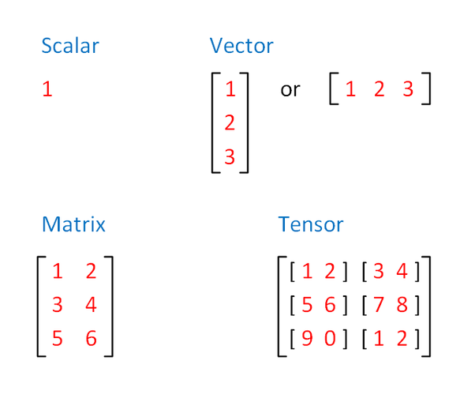
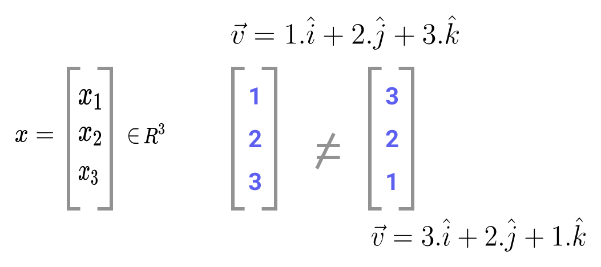
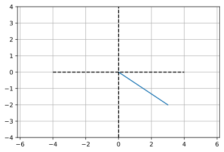
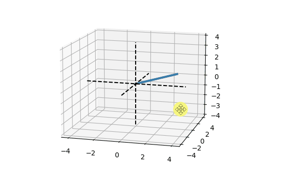

# Linear Algebra

- [Linear Algebra](#linear-algebra)
  - [Representation of Scalars, Vectors, Matrices and Tensors](#representation-of-scalars-vectors-matrices-and-tensors)
  - [Vectors](#vectors)
    - [Algebraic And Geometric Interpretations Of Vectors](#algebraic-and-geometric-interpretations-of-vectors)
      - [Algebraic Vector](#algebraic-vector)
      - [Geometric Vector](#geometric-vector)
  - [Resources](#resources)


```python
"""
jupyter nbconvert --to markdown la.ipynb --output README.md
"""
# interactive plotting in separate window
# %matplotlib qt
#normal charts inside notebooks
# %matplotlib inline
import matplotlib.pyplot as plt
import numpy as np
import warnings
warnings.filterwarnings('ignore')
from IPython import display
display.set_matplotlib_formats('svg')
```

## Representation of Scalars, Vectors, Matrices and Tensors

- `Scalar`: a **single number** like 7, -4.2, π, etc.
- `Vector`: a **list of numbers of numbers**. The list can be shown as a `row` or `column`.
  - A vector can be used to represent speed and direction (eg: wind),
  - can be used to indicate a point in 2D (eg: x & y coordinates, or r & θ radial distance and angle),
  - can be used for a point in 3D (x, y and z coordinates) and so on.
- `Matrix`: a **2-dimensional array of numbers**, usually `m x n` with `m rows` and `n columns`.
  -  In a sense, **`1 x n` or `n x 1` matrix is also a vector**.
- `Tensor`: an **n-dimensional array** and generalised recursive representation of any of the above objects.
  - A `0D` tensor is a scalar, a `1D` tensor is a vector, etc.
  - Hence, these can be used very effectively in solving complex computational problems. In Machine Learning, the whole set of features, or the weights and biases on a neural network can be expressed as a tensor.

<div align="center">

</div>

## Vectors

Linear algebra is the study of vectors. At the most general level, vectors are ordered finite lists of numbers. Vectors are the most fundamental mathematical object in machine learning. We use them to represent attributes of entities: age, sex, test scores, etc. We represent vectors by a bold lower-case letter like `v` or as a lower-case letter with an arrow on top like `v^` .

### Algebraic And Geometric Interpretations Of Vectors

#### Algebraic Vector

- `Vector`: An ordered list of numbers.
- `Dimension`: The number of elements in a vector.

**Elements of R**

Elements of `R^n` are sets of real numbers. This type of representation is arguably the most important for applied machine learning. It is how data is commonly represented in computers to build machine learning models. For instance, a vector in `R^3` takes the shape of:

<div align="center">

</div>


```python
x = np.array([[1],
              [2],
              [3]])

```


```python
x.shape  # (3 dimensions, 1 element on each)
```


    (3, 1)


```python
print(f'A 3-dimensional vector:\n{x}')
```

    A 3-dimensional vector:
    [[1]
     [2]
     [3]]


#### Geometric Vector


```python
# 2-dimensional vector
v2 = [3, -2]

# plot them
plt.plot([0, v2[0]], [0, v2[1]])
plt.axis('equal')
plt.plot([-4, 4], [0, 0], 'k--')
plt.plot([0, 0], [-4, 4], 'k--')
plt.grid()
plt.axis((-4, 4, -4, 4))
plt.show()
```





```python
# interactive plotting in separate window
%matplotlib qt
#normal charts inside notebooks
# %matplotlib inline

# 3-dimensional vector
v3 = [4, -3, 2]

# plot the 3D vector
fig = plt.figure(figsize=plt.figaspect(1))
ax = fig.gca(projection='3d')
ax.plot([0, v3[0]], [0, v3[1]], [0, v3[2]], linewidth=3)

# make the plot look nicer ( draw axises )
ax.plot([0, 0], [0, 0], [-4, 4],'k--')
ax.plot([0, 0], [-4, 4], [0, 0], 'k--')
ax.plot([-4, 4], [0, 0], [0, 0], 'k--')
# k=black,r- red,
# https://matplotlib.org/stable/tutorials/colors/colors.html
plt.show()

```

<div align="center">

</div>

## Resources

[https://pabloinsente.github.io/intro-linear-algebra](https://pabloinsente.github.io/intro-linear-algebra)
