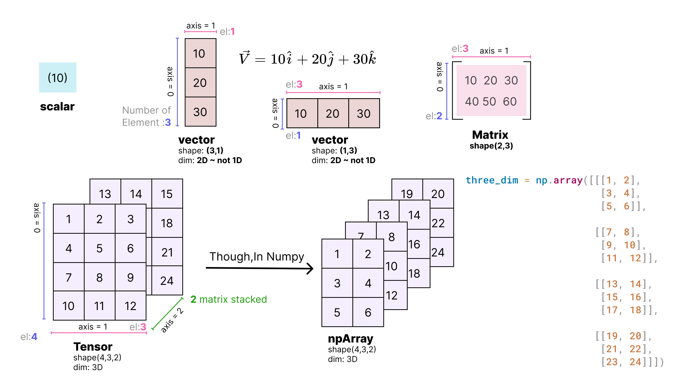

# Linear Algebra

- [Linear Algebra](#linear-algebra)
  - [Representation of Scalars, Vectors, Matrices and Tensors](#representation-of-scalars-vectors-matrices-and-tensors)
  - [Vectors](#vectors)
    - [Algebraic And Geometric Interpretations Of Vectors](#algebraic-and-geometric-interpretations-of-vectors)
      - [Algebraic Vector](#algebraic-vector)
      - [Geometric Vector](#geometric-vector)
    - [Basic vector operations](#basic-vector-operations)
      - [Vector-vector addition](#vector-vector-addition)
      - [Vector-Scalar multiplication](#vector-scalar-multiplication)
      - [Vector-Vector multiplication: 🌟 Dot product 🌟 (result is a scalar)](#vector-vector-multiplication--dot-product--result-is-a-scalar)
        - [Computation (result is a scaler)](#computation-result-is-a-scaler)
        - [Intuition 🌟🌟🌟](#intuition-)
          - [**Why cos(θ) ?**](#why-cosθ-)
        - [Linear Algebraic Computation 🌟🌟🌟](#linear-algebraic-computation-)
      - [Matrix-Vector Multiplication: 🌟 Dot Product of each row of the matrix with the vector 🌟 (result is a vector)](#matrix-vector-multiplication--dot-product-of-each-row-of-the-matrix-with-the-vector--result-is-a-vector)
      - [Vector cross product](#vector-cross-product)
    - [Vector Span](#vector-span)
  - [Resources](#resources)

```python
"""
jupyter nbconvert --to markdown la.ipynb --output README.md
"""
# interactive plotting in separate window
# %matplotlib qt
#normal charts inside notebooks
%matplotlib inline
import matplotlib.pyplot as plt
import numpy as np
import warnings
warnings.filterwarnings('ignore')
from IPython import display
display.set_matplotlib_formats('svg')
```

## Representation of Scalars, Vectors, Matrices and Tensors

- `Scalar`: a **single number** like 7, -4.2, π, etc.
- `Vector`: a **list of numbers of numbers**. The list can be shown as a `row` or `column`.
  - A vector can be used to represent speed and direction (eg: wind),
  - can be used to indicate a point in 2D (eg: x & y coordinates, or r & θ radial distance and angle),
  - can be used for a point in 3D (x, y and z coordinates) and so on.
- `Matrix`: a **2-dimensional array of numbers**, usually `m x n` with `m rows` and `n columns`.
  -  In a sense, **`1 x n` or `n x 1` matrix is also a vector**.
- `Tensor`: an **n-dimensional array** and generalised recursive representation of any of the above objects.
  - A `0D` tensor is a scalar, a `1D` tensor is a vector, etc.
  - Hence, these can be used very effectively in solving complex computational problems. In Machine Learning, the whole set of features, or the weights and biases on a neural network can be expressed as a tensor.

<div align="center">

</div>

## Vectors

Linear algebra is the study of vectors. At the most general level, vectors are ordered finite lists of numbers. Vectors are the most fundamental mathematical object in machine learning. We use them to represent attributes of entities: age, sex, test scores, etc. We represent vectors by a bold lower-case letter like `v` or as a lower-case letter with an arrow on top like `v^` .

### Algebraic And Geometric Interpretations Of Vectors

#### Algebraic Vector

- `Vector`: An ordered list of numbers.
- `Dimension`: The number of elements in a vector.

<div align="center">

</div>

**Elements of R**

Elements of `R^n` are sets of real numbers. This type of representation is arguably the most important for applied machine learning. It is how data is commonly represented in computers to build machine learning models. For instance, a vector in `R^3` takes the shape of:

<div align="center">

</div>

column vector


```python
x = np.array([[1],
              [2],
              [3]])
```


```python
x.shape  # (on axis=0 No. of element is 3, on axis=1 is 1)
```


    (3, 1)


```python
print("dimension of x:", x.ndim)
```

    dimension of x: 2


row vector


```python
x = np.array([[1, 2, 3]])  # (on axis=0 No. of element is 1, on axis=1 is 3)
x.shape

```


    (1, 3)


```python
print("dimension of x:", x.ndim)

```

    dimension of x: 2


#### Geometric Vector


```python
# 2-dimensional vector
v2 = [3, -2]

# plot them
plt.plot([0, v2[0]], [0, v2[1]])
plt.axis('equal')
plt.plot([-4, 4], [0, 0], 'k--')
plt.plot([0, 0], [-4, 4], 'k--')
plt.grid()
plt.axis((-4, 4, -4, 4))
plt.show()
```


```python
# interactive plotting in separate window
%matplotlib qt
#normal charts inside notebooks
# %matplotlib inline

# 3-dimensional vector
v3 = [4, -3, 2]

# plot the 3D vector
fig = plt.figure(figsize=plt.figaspect(1))
ax = fig.gca(projection='3d')
ax.plot([0, v3[0]], [0, v3[1]], [0, v3[2]], linewidth=3)

# make the plot look nicer ( draw axises )
ax.plot([0, 0], [0, 0], [-4, 4],'k--')
ax.plot([0, 0], [-4, 4], [0, 0], 'k--')
ax.plot([-4, 4], [0, 0], [0, 0], 'k--')
# k=black,r- red,
# https://matplotlib.org/stable/tutorials/colors/colors.html
plt.show()
```

<div align="center">

</div>

### Basic vector operations


#### Vector-vector addition


We used vector-vector addition to define vectors without defining vector-vector addition. Vector-vector addition is an **element-wise operation**, only defined for vectors of the same size (i.e., number of elements). Consider two vectors of the same size, then:

Given: `A = Axi + Ayj + AZk`
and `B = Bxi + Byj + BZk`
Vector Addition
Resultant `R = A + B`= `(Ax + Bx)i + (Ay + By )j + (AZ + BZ) k`

<div align="center">

</div>


```python
x = y = np.array([[1],
                  [2],
                  [3]])
x+y
```


    array([[2],
           [4],
           [6]])


```python
# two vectors in R2
v1 = np.array([3, -1])
v2 = np.array([2,  4])

v3 = v1 + v2
print(v3)

# plot them
plt.plot([0, v1[0]], [0, v1[1]], 'b', label='v1')
plt.plot([0, v2[0]], [0, v2[1]], '0.8', label='v2 - original')
# moving vector
plt.plot([0, v2[0]]+v1[0], [0, v2[1]]+v1[1], 'r', label='v2 - moved')
plt.plot([0, v3[0]], [0, v3[1]], 'k', label='v1+v2')

plt.legend()
plt.axis('square')
plt.axis((-6, 6, -6, 6))
plt.grid()
plt.show()

```

    [5 3]


#### Vector-Scalar multiplication


Vector-scalar multiplication is an element-wise operation. It’s defined as:

<div align="center">

</div>

Vector-scalar multiplication satisfies a series of important properties:

- Associativity: `(αβ)x=α(βx)`
- Left-distributive property: `(α+β)x=αx+βx`
- Right-distributive property: `x(α+β)=xα+xβ`
- Right-distributive property for vector addition: `α(x+y)=αx+αy`


```python
alpha = 2
x = np.array([[1],
             [2],
             [3]])
alpha*x
```


    array([[2],
           [4],
           [6]])


```python
# vector and scalar
v1 = np.array([3, -1])
l = 2.3
v1m = v1*l  # scalar-modulated

# plot them
plt.plot([0, v1[0]], [0, v1[1]], 'b', label='v_1')
plt.plot([0, v1m[0]], [0, v1m[1]], 'r:', label='\lambda v_1')

plt.axis('square')
axlim = max([max(abs(v1)), max(abs(v1m))])*1.5  # dynamic axis lim
plt.axis((-axlim, axlim, -axlim, axlim))
plt.grid()
plt.show()

```


#### Vector-Vector multiplication: 🌟 Dot product 🌟 (result is a scalar)

The dot product is one way of multiplying two or more vectors. **The resultant of the dot product of vectors is a scalar quantity.** Thus, the dot product is also known as a `scalar product`. Algebraically, it is the sum of the products of the corresponding entries of two sequences of numbers. Geometrically, it is the product of the Euclidean magnitude of two vectors and the cosine of the angle between them

##### Computation (result is a scaler)

<div align="center">

</div>

<div align="center">

</div>

<div align="center">

</div>

##### Intuition 🌟🌟🌟

Dot product is simply the **effect of one vector on the other** should it be acting in the same direction as the base vector.

The final result of the dot product process can be:

- Zero: we don't have any growth in the original direction
- Positive number: we have some growth in the original direction
- Negative number: we have negative (reverse) growth in the original direction

An example is the physical term `“Work”`. **Work is the product of force and displacement should the force be acting in the same direction as the displacement.**

But if the force was acting along **some other direction rather than** the direction of displacement, then the entire force does not cause displacement. **There is only a percentage of this force that goes into causing this displacement. And this percentage of force will be lesser than the actual force.**

Thus, work done = `F.s = |F||s|cos(θ)`

If the force was acting in the same direction as the resulting displacement, then the magnitude of the work done is maximum (as `cos(0) = 1`).

<div align="center">

</div>

In the example above, the person is pushing the object in the same direction as the displacement and hence this would result in the maximum work done by the person. **Hence with a smaller force applied, he can do the maximum work that is possible and hence he needs lesser effort to push the object along the direction of displacement.**

But if he was pushing at an inclined angle, then he would have had to apply more effort as the work exerted by him would be low.

<div align="center">

</div>

**Mario-Kart Speed Boost**

In Mario Kart, there are "boost pads" on the ground that increase your speed.

<div align="center">

</div>

Imagine the **red** vector is your `speed` (x and y direction), and the **blue** vector is the orientation of the `boost` pad (x and y direction).

How much boost will you get? For the analogy, imagine the pad multiplies your speed:

- If you come in going 0, you'll get nothing [if you are just dropped onto the pad, there's no boost]
- If you cross the pad perpendicularly, you'll get 0 [just like the banana obliteration, it will give you 0x boost in the perpendicular direction]

But, if we have some overlap, our x-speed will get an x-boost, and our y-speed gets a y-boost:

<div align="center">

</div>

Neat, eh? Another way to see it: your incoming **speed** is `|a|`, and the max **boost** is `|b|`. The percentage of boost you actually get (based on how you're lined up) is `cos(θ)`, for a total of `|a||b|cos(θ)`.

###### **Why cos(θ) ?**

OK, to multiply two vectors it makes sense to multiply their lengths together but **only when they point in the same direction.**

So we make one **"point in the same direction"** as the other by multiplying by cos(θ):

<div align="center">

</div>


##### Linear Algebraic Computation 🌟🌟🌟

<div align="center">

</div>


```python
# For loop
a = [1, 2]
b = [3,4]
c = 0
for i in range(len(a)):
    c += a[i]*b[i]
print(c)


# Vectorization
a = np.array([1, 2])
b = np.array([3, 4])
c = np.dot(a, b)
print(c)
c = np.dot(a.T, b)
print(c)

# To multiply two vectors with dimensions(rows=2, cols=1) in Numpy, we need to transpose the first vector at using the @ operator:
x = np.array([[1],[2]])
y = np.array([[3],[4]])
# print(np.dot(x, y))  # shapes (2,1) and (2,1) not aligned: 1 (dim 1) != 2 (dim 0)
print(np.dot(x.T,y)) # watch the transpose
x.T @ y
```

    11
    11
    11
    [[11]]


    array([[11]])


#### Matrix-Vector Multiplication: 🌟 Dot Product of each row of the matrix with the vector 🌟 (result is a vector)

Matrix-vector multiplication equals to taking the dot product of each row of the matrix with the vector resulting in a vector. Is defined as:

<div align="center">

</div>

<div align="center">

</div>


```python
import time
# Number of features
n = 100
# Number of training examples
m = 1000
# Initialize X and W
X = np.random.rand(n, m)
W = np.random.rand(n, 1)
# Vectorized code
t1 = time.time()
Z = np.dot(W.T, X)
print("Time taken for vectorized code is : ", (time.time()-t1)*1000, "ms")
# Non Vectorized code
Z1 = np.zeros((1, m))
t2 = time.time()
for each_feature in range(X.shape[1]):
    for j in range(X.shape[0]):
        Z[0][each_feature] += W[j]*X[j][each_feature]
print("Time taken for non vectorized code is : ", (time.time()-t2)*1000, "ms")
```

    Time taken for vectorized code is :  0.0 ms
    Time taken for non vectorized code is :  1185.6019496917725 ms


#### Vector cross product


```python
%matplotlib qt
# create vectors
v1 = [-3,  2, 5]
v2 = [4, -3, 0]

# Python's cross-product function
v3a = np.cross(v1, v2)

# "manual" method
v3b = [[v1[1]*v2[2] - v1[2]*v2[1]],
       [v1[2]*v2[0] - v1[0]*v2[2]],
       [v1[0]*v2[1] - v1[1]*v2[0]]]

print(v3a, v3b)


fig = plt.figure()
ax = fig.gca(projection='3d')

# draw plane defined by span of v1 and v2
xx, yy = np.meshgrid(np.linspace(-10, 10, 10), np.linspace(-10, 10, 10))
z1 = (-v3a[0]*xx - v3a[1]*yy)/v3a[2]
ax.plot_surface(xx, yy, z1, alpha=.2)

## plot the two vectors
ax.plot([0, v1[0] + 5], [0, v1[1] + 5], [0, v1[2] + 5], 'k--')
ax.plot([0, v2[0]], [0, v2[1]], [0, v2[2]], 'k--')
ax.plot([0, v3a[0]], [0, v3a[1]], [0, v3a[2]], 'r')


ax.view_init(azim=150, elev=45)
plt.show()

```

    [15 20  1] [[15], [20], [1]]


<div align="center">

</div>

### Vector Span


```python
# set S
S1 = np.array([1, 1, 0])
S2 = np.array([1, 7, 0])

# vectors v and w
v = np.array([1, 2, 0])
w = np.array([3, 2, 1])

# draw vectors
fig = plt.figure()
ax = fig.gca(projection='3d')
ax.plot([0, S1[0]], [0, S1[1]], [.1, S1[2]+.1], 'r', linewidth=3)
ax.plot([0, S2[0]], [0, S2[1]], [.1, S2[2]+.1], 'r', linewidth=3)

ax.plot([0, v[0]], [0, v[1]], [.1, v[2]+.1], 'g', linewidth=3)
ax.plot([0, w[0]], [0, w[1]], [0, w[2]], 'b')

# now draw plane
xx, yy = np.meshgrid(range(-15, 16), range(-15, 16))
cp = np.cross(S1, S2)
z1 = (-cp[0]*xx - cp[1]*yy)*1./cp[2]
ax.plot_surface(xx, yy, z1)

plt.show()

```

## Resources

[https://pabloinsente.github.io/intro-linear-algebra](https://pabloinsente.github.io/intro-linear-algebra)
