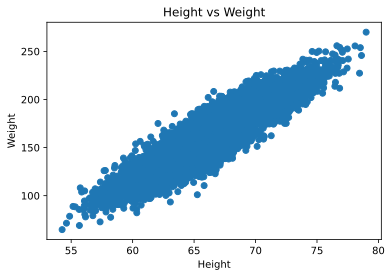
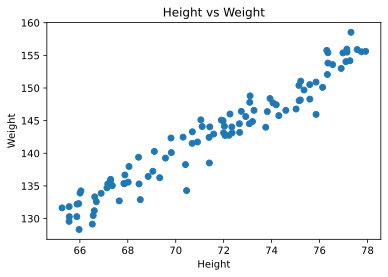
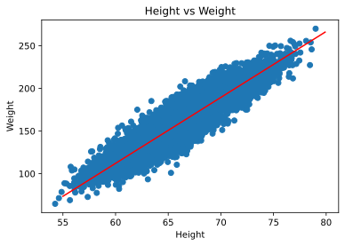

# Linear Regression

- [Linear Regression](#linear-regression)
  - [Load DataSet](#load-dataset)
  - [Generating our Own data](#generating-our-own-data)
  - [Process Data](#process-data)
  - [Train Model - fit](#train-model---fit)
  - [Predict and Score](#predict-and-score)

```python
"""
cd .\07linear_regression_i\
jupyter nbconvert --to markdown lin_r.ipynb --output README.md
"""
import numpy as np
import seaborn as sns
import pandas as pd
import matplotlib.pyplot as plt

from IPython import display
display.set_matplotlib_formats('svg')

```

## Load DataSet

[Weight-Height](https://www.kaggle.com/sonalisingh1411/linear-regression-using-weight-height/data)


```python
df = pd.read_csv('weight-height.csv')
df.head()
```


<div>

<table border="1" class="dataframe">
  <thead>
    <tr style="text-align: right;">
      <th></th>
      <th>Gender</th>
      <th>Height</th>
      <th>Weight</th>
    </tr>
  </thead>
  <tbody>
    <tr>
      <th>0</th>
      <td>Male</td>
      <td>73.847017</td>
      <td>241.893563</td>
    </tr>
    <tr>
      <th>1</th>
      <td>Male</td>
      <td>68.781904</td>
      <td>162.310473</td>
    </tr>
    <tr>
      <th>2</th>
      <td>Male</td>
      <td>74.110105</td>
      <td>212.740856</td>
    </tr>
    <tr>
      <th>3</th>
      <td>Male</td>
      <td>71.730978</td>
      <td>220.042470</td>
    </tr>
    <tr>
      <th>4</th>
      <td>Male</td>
      <td>69.881796</td>
      <td>206.349801</td>
    </tr>
  </tbody>
</table>
</div>


```python
df.describe()
```


<div>

<table border="1" class="dataframe">
  <thead>
    <tr style="text-align: right;">
      <th></th>
      <th>Height</th>
      <th>Weight</th>
    </tr>
  </thead>
  <tbody>
    <tr>
      <th>count</th>
      <td>10000.000000</td>
      <td>10000.000000</td>
    </tr>
    <tr>
      <th>mean</th>
      <td>66.367560</td>
      <td>161.440357</td>
    </tr>
    <tr>
      <th>std</th>
      <td>3.847528</td>
      <td>32.108439</td>
    </tr>
    <tr>
      <th>min</th>
      <td>54.263133</td>
      <td>64.700127</td>
    </tr>
    <tr>
      <th>25%</th>
      <td>63.505620</td>
      <td>135.818051</td>
    </tr>
    <tr>
      <th>50%</th>
      <td>66.318070</td>
      <td>161.212928</td>
    </tr>
    <tr>
      <th>75%</th>
      <td>69.174262</td>
      <td>187.169525</td>
    </tr>
    <tr>
      <th>max</th>
      <td>78.998742</td>
      <td>269.989699</td>
    </tr>
  </tbody>
</table>
</div>


```python
plt.scatter(x=df['Height'], y=df["Weight"])
plt.xlabel('Height')
plt.ylabel('Weight')
plt.title('Height vs Weight')
plt.show()

```





## Generating our Own data

For linear relationship : `y=βx+ϵ`


```python
scale = 2
e = np.random.randn(100)*scale
e[:20]

```


    array([ 0.04693432,  1.20214524,  1.1497429 ,  1.4257632 , -0.64547834,
            1.43834381,  1.12207361,  1.89293863,  0.47506907, -0.85878863,
            2.06764893, -0.08994633,  1.67588997,  3.02959755,  2.15196952,
           -1.39025646,  0.08985833, -0.38396899, -1.53876122,  0.44887422])


```python
start = 65
end = 78

x = np.random.rand(100)*(end-start) + start
x[:20]

```


    array([73.26670775, 71.4196531 , 67.26907155, 76.975376  , 72.3407478 ,
           67.28465027, 76.34896376, 71.10362274, 69.81645041, 71.99670736,
           69.10856961, 70.90860807, 77.14039143, 71.04797257, 66.04579698,
           72.0600471 , 66.61973751, 67.86272319, 65.55034215, 67.13162103])


```python
y = x * 2 + e
```


```python
df_gen = pd.DataFrame({'Weight':y , 'Height':x })
df_gen.head()

```


<div>

<table border="1" class="dataframe">
  <thead>
    <tr style="text-align: right;">
      <th></th>
      <th>Weight</th>
      <th>Height</th>
    </tr>
  </thead>
  <tbody>
    <tr>
      <th>0</th>
      <td>146.580350</td>
      <td>73.266708</td>
    </tr>
    <tr>
      <th>1</th>
      <td>144.041451</td>
      <td>71.419653</td>
    </tr>
    <tr>
      <th>2</th>
      <td>135.687886</td>
      <td>67.269072</td>
    </tr>
    <tr>
      <th>3</th>
      <td>155.376515</td>
      <td>76.975376</td>
    </tr>
    <tr>
      <th>4</th>
      <td>144.036017</td>
      <td>72.340748</td>
    </tr>
  </tbody>
</table>
</div>


```python
plt.scatter(x=df_gen['Height'], y=df_gen["Weight"])
plt.xlabel('Height')
plt.ylabel('Weight')
plt.title('Height vs Weight')
plt.show()

```





```python
df_gen.to_csv('weight-height_gen.csv')
```

## Process Data


```python
x= df['Height']
# x= df.iloc[:,1]
y= df['Weight']

```


```python
x.shape
```


    (10000,)


```python
from sklearn import model_selection
X_train, X_test, Y_train, Y_test = model_selection.train_test_split(
    x, y, test_size=0.3)
X_train.shape

```


    (7000,)


## Train Model - fit


```python
def fit(x_train, y_train):
    num = (x_train*y_train).mean() - x_train.mean() * y_train.mean()
    den = (x_train**2).mean() - x_train.mean()**2
    m = num/den
    c = y_train.mean() - m * x_train.mean()
    return m, c

```


```python
def predict(x, m, c):
    return m * x + c


def score(y_truth, y_pred):
    u = ((y_truth - y_pred)**2).sum()
    v = ((y_truth - y_truth.mean())**2).sum()
    return 1 - u/v


```


```python
m, c = fit(X_train, Y_train)
```

## Predict and Score


```python
# test data
y_test_pred = predict(X_test, m, c)
print(f"Test Score: {round(score(Y_test, y_test_pred)*100)}%")
```

    Test Score: 85%


```python
x_line = np.arange(55, 80, 0.1)
print(x_line[:5], x_line[-5:])
y_line = m*x_line + c
plt.plot(x_line, y_line,"r")
plt.scatter(x=df['Height'], y=df["Weight"])
plt.xlabel('Height')
plt.ylabel('Weight')
plt.title('Height vs Weight')
plt.show()

```

    [55.  55.1 55.2 55.3 55.4] [79.5 79.6 79.7 79.8 79.9]





```python
#train data
y_train_pred = predict(X_train, m, c)
print(f"Train Score: {round(score(Y_train, y_train_pred)*100)}%")

```

    Train Score: 86%
    Cost on training data  148.4278600984914


```python
def cost(x, y, m, c):
    return ((y - m * x - c)**2).mean()

```


```python
print("Cost on training data ", cost(X_train, Y_train, m, c))

```

    Cost on training data  148.4278600984914

