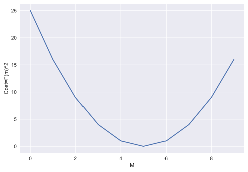
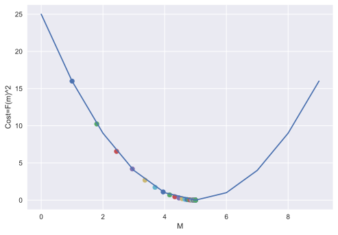
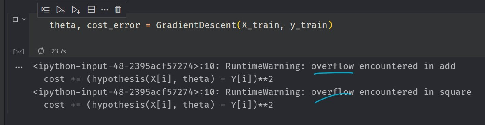
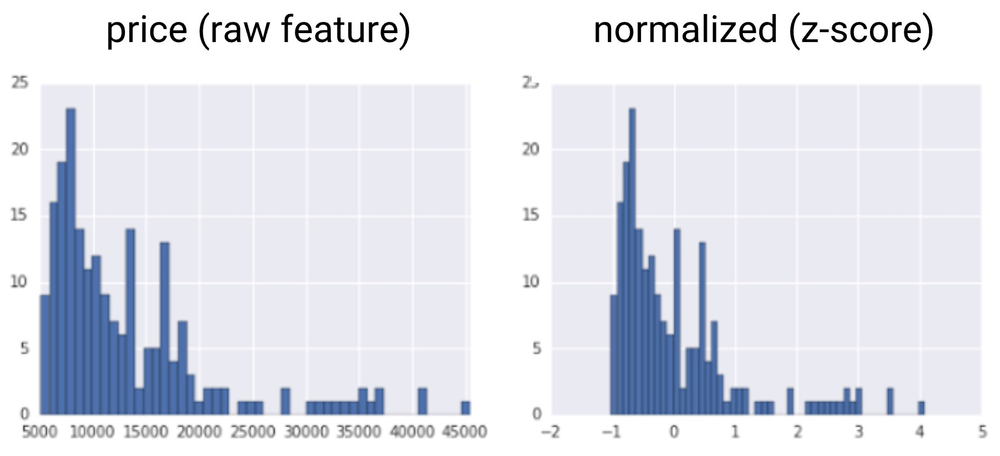
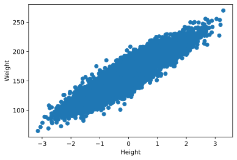
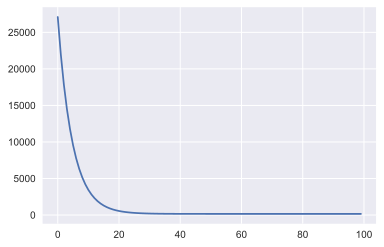
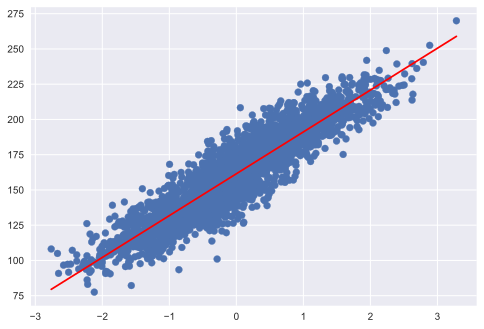

# Basic Linear Regression using Gradient Descent

- [Basic Linear Regression using Gradient Descent](#basic-linear-regression-using-gradient-descent)
  - [Gradient Descent Algorithm](#gradient-descent-algorithm)
  - [Prepare Data](#prepare-data)
    - [Load Data](#load-data)
    - [Normalization](#normalization)
    - [Train and Test Split](#train-and-test-split)
  - [Gradient Descent Update Rule for Regression](#gradient-descent-update-rule-for-regression)
  - [Prediction](#prediction)
  - [R-Score](#r-score)
    - [Using `sklearn`](#using-sklearn)
    - [Using `Np.corrcoef(actual, predicted)`](#using-npcorrcoefactual-predicted)
    - [Custom](#custom)

```python
"""
cd .\09linear_regression_i_gradientD\
jupyter nbconvert --to markdown lnrGD.ipynb --output README.md

"""
import numpy as np
import pandas as pd
import matplotlib.pyplot as plt

from IPython import display
display.set_matplotlib_formats('svg')

```

## Gradient Descent Algorithm


```python
M= np.arange(10)
Cost=(M-5)**2
print(Cost,M)
```

    [25 16  9  4  1  0  1  4  9 16] [0 1 2 3 4 5 6 7 8 9]


```python
plt.style.use("seaborn")
plt.plot(M, Cost)
plt.ylabel("Cost=F(m)^2")
plt.xlabel("M")
plt.show()
```





```python
# start with a random guess
m = 0
# learning rate
lr = 0.1
# repeat 50 times in the downhill direction
m_list = []

def slope(m):
	return 2 * (m - 5)

for i in range(50):
	# update the guess
	m = m - lr * slope(m)
	# plot the current guess
	m_list.append(m)

print(m_list[-10:])

```

    [4.999468308801686, 4.9995746470413485, 4.999659717633079, 4.9997277741064625, 4.99978221928517, 4.999825775428136, 4.999860620342509, 4.999888496274007, 4.999910797019206, 4.999928637615365]


We know `(m-5)^2=0` => `m=5` , that means we are approaching the minimum of the cost function.


```python
plt.plot(M,Cost)
plt.ylabel("Cost=F(m)^2")
plt.xlabel("M")
m = 0
lr = 0.1


def slope(m):
	return 2 * (m - 5)

for i in range(50):
	m = m - lr * slope(m)

	# cost at x=m
	cost = (m-5)**2
	plt.scatter(m, cost)


```





## Prepare Data

### Load Data


```python
data = pd.read_csv("weight-height.csv")
data.head()
```


<div>
<table border="1" class="dataframe">
  <thead>
    <tr style="text-align: right;">
      <th></th>
      <th>Gender</th>
      <th>Height</th>
      <th>Weight</th>
    </tr>
  </thead>
  <tbody>
    <tr>
      <th>0</th>
      <td>Male</td>
      <td>73.847017</td>
      <td>241.893563</td>
    </tr>
    <tr>
      <th>1</th>
      <td>Male</td>
      <td>68.781904</td>
      <td>162.310473</td>
    </tr>
    <tr>
      <th>2</th>
      <td>Male</td>
      <td>74.110105</td>
      <td>212.740856</td>
    </tr>
    <tr>
      <th>3</th>
      <td>Male</td>
      <td>71.730978</td>
      <td>220.042470</td>
    </tr>
    <tr>
      <th>4</th>
      <td>Male</td>
      <td>69.881796</td>
      <td>206.349801</td>
    </tr>
  </tbody>
</table>
</div>


```python
X = data.iloc[:, 1].values.reshape(-1, 1)
y = data.iloc[:, 2].values
print("Shape of X:", X.shape)
print("Shape of y:", y.shape)
print("Type of X:", type(X))
print("Type of y:", type(y))

```

    Shape of X: (10000, 1)
    Shape of y: (10000,)
    Type of X: <class 'numpy.ndarray'>
    Type of y: <class 'numpy.ndarray'>


```python
plt.scatter(X, y)
plt.xlabel("Height")
plt.ylabel("Weight")
plt.show()
```


### Normalization

<div align="center">

</div>

Because of the large range of the data, we need to normalize the data. Values of `X` are not in the same scale and Squaring such large value will no be efficient.

Normalization in machine learning is the process of translating data into the range `[0, 1]` (or any other range) or simply transforming data onto the unit sphere. Every dataset does not need to be normalized for machine learning. It is only required when the ranges of characteristics are different.

The most widely used types of normalization in machine learning are:

- scaling to a range
- clipping
- log scaling
- z-score

[Normalization Techniques at a Glance](https://developers.google.com/machine-learning/data-prep/transform/normalization)

> Z-Score

`Z-score` is a variation of scaling that represents the number of standard deviations away from the mean. You would use z-score to ensure your feature distributions have `mean = 0` and `std = 1`. It’s useful when there are a few outliers, but not so extreme that you need clipping.


<div align="center">

</div>


The formula for calculating the z-score of a point, `x`, is as follows:

`Z Score x'= (x – μ) / ơ`

where
- `x` = Datapoint
- `μ` = Mean
- `ơ` = Standard deviation

Z-Score Calculation:

<div align="center">

</div>

[More-Details](https://www.wallstreetmojo.com/z-score-formula/)


```python
u = X.mean()
std = X.std()
X_normalized = (X - u) / std
print(X_normalized[:5])

```

    [[1.94406149]
     [0.62753668]
     [2.01244346]
     [1.39406046]
     [0.9134207 ]]


```python
plt.scatter(X_normalized, y)
plt.xlabel("Height")
plt.ylabel("Weight")
plt.show()

```





### Train and Test Split


```python
from sklearn import model_selection
X_train, X_test, y_train, y_test = model_selection.train_test_split(
    X_normalized, y)
X_train.shape

```


    (7500, 1)


## Gradient Descent Update Rule for Regression


```python
def hypothesis(x,theta):
	y_ = theta[0] + theta[1] * x
	return y_


def costError(X, Y, theta):
	N = X.shape[0]
	cost = 0
	for i in range(N):
		cost += (hypothesis(X[i], theta) - Y[i])**2

	cost = cost / (N)
	return cost


def gradient(X,Y,theta):
	N = X.shape[0]
	grad = np.zeros((2,))

	for i in range(N):
		grad[0] += (hypothesis(X[i],theta) - Y[i])
		grad[1] += (hypothesis(X[i],theta) - Y[i]) * X[i]

	grad = grad / N
	return grad


def GradientDescent(X,Y,max_step=100,learning_rate=0.1):

	theta = np.zeros((2,))
	cost_error = []
	# for ploting
	theta_list = []
	for i in range(max_step):
		# compute the gradient
		grad = gradient(X,Y,theta)
		# also error
		e = costError(X, Y, theta)

		# update theta
		theta[0] = theta[0] - learning_rate * grad[0]
		theta[1] = theta[1] - learning_rate * grad[1]

		cost_error.append(e)
		theta_list.append((theta[0],theta[1]))


	return theta, cost_error, theta_list

```


```python
theta, cost_error, theta_list = GradientDescent(X_train, y_train)

```


```python
theta
```


    array([161.52807238,  29.66001707])


```python
plt.plot(cost_error)
```


    [<matplotlib.lines.Line2D at 0x1a703a2fd30>]





## Prediction


```python
X_test[0]
```


    array([-0.36043377])


```python
y_test[0]
```


    151.449737418287


```python
y_test_pred = hypothesis(X_test[0], theta)
y_test_pred

```


    array([150.79410844])


```python
Y_pred = hypothesis(X_test, theta)
```


```python
plt.scatter(X_test, y_test)
plt.plot(X_test, Y_pred, 'r')
```


    [<matplotlib.lines.Line2D at 0x1a74ffb9dc0>]





## R-Score

Watch Out Dimension of the Data


```python
y_test, Y_pred
```


    (array([151.44973742, 173.70750424, 186.50354996, ..., 170.27624778,
            210.20447889, 158.90043432]),
     array([[150.79410844],
            [167.23908258],
            [173.1744441 ],
            ...,
            [173.97877262],
            [200.68862213],
            [146.78664404]]))


```python
Y_pred[:,0]

```


    array([150.79410844, 167.23908258, 173.1744441 , ..., 173.97877262,
           200.68862213, 146.78664404])


### Using `sklearn`


```python
from sklearn.metrics import r2_score
r2_score(y_test, Y_pred[:, 0])
r2_score(y_test, Y_pred)*100
# Both way is possible
```


    85.15479340383303


### Using `Np.corrcoef(actual, predicted)`


```python
# corr_matrix = np.corrcoef(y_test, Y_pred) #not working
corr_matrix = np.corrcoef(y_test, Y_pred[:, 0])
corr = corr_matrix[0, 1]
R_sq = corr**2
R_sq*100

```


    85.15944115733068


### Custom


```python
def r2_score_1(Y,Y_):
	# instead of loop, np.sum() is recommended as it is fast
	num = ((Y-Y_)**2).sum()
	# or num = np.sum((Y-Y_)**2)
	denom = ((Y - Y.mean())**2).sum()
	score = (1 - num/denom)
	return score*100

```


```python
v = r2_score_1(y_test, Y_pred[:, 0])
print(v)
v = r2_score_1(y_test, Y_pred)
print(v)

```

    85.15479340383303
    -462167.7956591363


Watch Out Dimension of the Data
