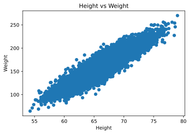
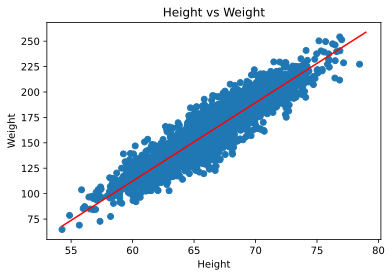

# Basic Liner Regression Using Scikit-Learn

- [Basic Liner Regression Using Scikit-Learn](#basic-liner-regression-using-scikit-learn)
  - [Prepare Data](#prepare-data)
    - [Prepare X and Y data](#prepare-x-and-y-data)
    - [What should be the shape of the data??](#what-should-be-the-shape-of-the-data)
    - [Reshape the data from `1D` to `2D` or `(n,)` to `(n,1)`](#reshape-the-data-from-1d-to-2d-or-n-to-n1)
      - [1️⃣ Both `X`,`Y` as `pd.DataFrame` format](#1️⃣-both-xy-as-pddataframe-format)
      - [2️⃣ Both `X`,`Y` as `np.Array` format](#2️⃣-both-xy-as-nparray-format)
  - [Train the Model](#train-the-model)
  - [Predict](#predict)
  - [Score the model](#score-the-model)
  - [Plot](#plot)

```python
"""
cd .\08linear_regression_i_scikit\
jupyter nbconvert --to markdown lin_r.ipynb --output README.md
"""
import numpy as np
import pandas as pd
import matplotlib.pyplot as plt

from IPython import display
display.set_matplotlib_formats('svg')

```

## Prepare Data


```python
data = pd.read_csv("weight-height.csv")
data.head()

```


<div>

<table border="1" class="dataframe">
  <thead>
    <tr style="text-align: right;">
      <th></th>
      <th>Gender</th>
      <th>Height</th>
      <th>Weight</th>
    </tr>
  </thead>
  <tbody>
    <tr>
      <th>0</th>
      <td>Male</td>
      <td>73.847017</td>
      <td>241.893563</td>
    </tr>
    <tr>
      <th>1</th>
      <td>Male</td>
      <td>68.781904</td>
      <td>162.310473</td>
    </tr>
    <tr>
      <th>2</th>
      <td>Male</td>
      <td>74.110105</td>
      <td>212.740856</td>
    </tr>
    <tr>
      <th>3</th>
      <td>Male</td>
      <td>71.730978</td>
      <td>220.042470</td>
    </tr>
    <tr>
      <th>4</th>
      <td>Male</td>
      <td>69.881796</td>
      <td>206.349801</td>
    </tr>
  </tbody>
</table>
</div>


```python
plt.scatter(x=data['Height'], y=data["Weight"])
plt.xlabel('Height')
plt.ylabel('Weight')
plt.title('Height vs Weight')
plt.show()

```





### Prepare X and Y data


```python
# x = data['Height']
x = data.iloc[:, 1]
y = data.iloc[:, 2]
print("Shape:", x.shape, y.shape)
print("Dimension:", x.ndim, y.ndim)
```

    Shape: (10000,) (10000,)
    Dimension: 1 1


### What should be the shape of the data??


```python
from sklearn.linear_model import LinearRegression
alg = LinearRegression()
alg.fit?
```

    Signature: alg.fit(X, y, sample_weight=None)
    Docstring:
    Fit linear model.

    Parameters
    ----------
    X : {array-like, sparse matrix} of shape (n_samples, n_features)
        Training data

    y : array-like of shape (n_samples,) or (n_samples, n_targets)
        Target values. Will be cast to X's dtype if necessary

    sample_weight : array-like of shape (n_samples,), default=None
        Individual weights for each sample

        .. versionadded:: 0.17
           parameter *sample_weight* support to LinearRegression.

    Returns
    -------
    self : returns an instance of self.
    File:      c:\users\soiko\anaconda3\lib\site-packages\sklearn\linear_model\_base.py
    Type:      method


Here `X : {array-like, sparse matrix} of shape (n_samples, n_features)`, so `X` is a matrix of features (2D matrix.
But our data is a  1D array `(n,)`, if we try to fit a linear regression model to this data, we will get an error.


```python
"""
ValueError: Expected 2D array, got 1D array instead:
Reshape your data either using array.reshape(-1, 1) if your data has a single feature or array.reshape(1, -1) if it contains a single sample.
"""
```

so we need to reshape it to a matrix `(n,1)`.

### Reshape the data from `1D` to `2D` or `(n,)` to `(n,1)`

#### 1️⃣ Both `X`,`Y` as `pd.DataFrame` format

The process includes:

1. Converting `pd.DataFrame` -->`np.Array` using `pd.DataFrame.values`
2. Reshape the data from `(n,)` to `(n,1)` using `np.reshape(n,1)` or `np.reshape(-1,1)`
3. Then Again Converting `np.Array` -->`pd.DataFrame` using `pd.DataFrame(np.array)`


```python
x = data.iloc[:, 1].reshape(-1, 1) # (n,1)
```


    ---------------------------------------------------------------------------

    AttributeError                            Traceback (most recent call last)

    <ipython-input-17-9ee7ee641642> in <module>
    ----> 1 x = data.iloc[:, 1].reshape(-1, 1) # (n,1)


    ~\anaconda3\lib\site-packages\pandas\core\generic.py in __getattr__(self, name)
       5463             if self._info_axis._can_hold_identifiers_and_holds_name(name):
       5464                 return self[name]
    -> 5465             return object.__getattribute__(self, name)
       5466
       5467     def __setattr__(self, name: str, value) -> None:


    AttributeError: 'Series' object has no attribute 'reshape'


> But this is not a numpy array, so we need to convert it to a numpy array.


```python
# convert series object into array
np_arr = x.values

# reshaping series
reshaped_np_arr = np_arr.reshape(-1,1)
x= reshaped_np_arr
reshaped_np_arr.shape


```


    (10000, 1)


```python
from sklearn import model_selection
X_train, X_test, y_train, y_test = model_selection.train_test_split(x, y)
print(X_train.shape)
print("X_train type:", type(X_train))
print("X_train type:", type(X_test))
print("y_train type:", type(y_train))
print("y_test type:", type(y_test))

```

    (7500, 1)
    X_train type: <class 'numpy.ndarray'>
    X_train type: <class 'numpy.ndarray'>
    y_train type: <class 'pandas.core.series.Series'>
    y_test type: <class 'pandas.core.series.Series'>


To avoid confusion: convert X to a pandas Object:


```python
df = pd.DataFrame(x)
df.head()
```


<div>

<table border="1" class="dataframe">
  <thead>
    <tr style="text-align: right;">
      <th></th>
      <th>0</th>
    </tr>
  </thead>
  <tbody>
    <tr>
      <th>0</th>
      <td>73.847017</td>
    </tr>
    <tr>
      <th>1</th>
      <td>68.781904</td>
    </tr>
    <tr>
      <th>2</th>
      <td>74.110105</td>
    </tr>
    <tr>
      <th>3</th>
      <td>71.730978</td>
    </tr>
    <tr>
      <th>4</th>
      <td>69.881796</td>
    </tr>
  </tbody>
</table>
</div>


```python
from sklearn import model_selection
X_train, X_test, y_train, y_test = model_selection.train_test_split(df, y)
X_train.shape
```


    (7500, 1)


```python
print("X_train type:", type(X_train))
print("X_train type:", type(X_test))
print("y_train type:", type(y_train))
print("y_test type:", type(y_test))

```

    X_train type: <class 'pandas.core.frame.DataFrame'>
    X_train type: <class 'pandas.core.frame.DataFrame'>
    y_train type: <class 'pandas.core.series.Series'>
    y_test type: <class 'pandas.core.series.Series'>


#### 2️⃣ Both `X`,`Y` as `np.Array` format


```python
X = data.iloc[:, 1].values
X = X.reshape(-1, 1)
y = data.iloc[:, 2].values
```


```python
print("Shape:", X.shape, y.shape)
```

    Shape: (10000, 1) (10000,)


```python
print("Type:", type(X), type(y))
```

    Type: <class 'numpy.ndarray'> <class 'numpy.ndarray'>


```python
from sklearn import model_selection
X_train, X_test, y_train, y_test = model_selection.train_test_split(x, y)
print(X_train.shape)
print("X_train type:", type(X_train))
print("X_train type:", type(X_test))
print("y_train type:", type(y_train))
print("y_test type:", type(y_test))
```

    (7500, 1)
    X_train type: <class 'numpy.ndarray'>
    X_train type: <class 'numpy.ndarray'>
    y_train type: <class 'numpy.ndarray'>
    y_test type: <class 'numpy.ndarray'>


1️⃣ Both `X`,`Y` as `pd.DataFrame` format - **Shortcut**


```python
# not V = data["Height"]
V = data[["Height"]]
V.shape

```


    (10000, 1)


## Train the Model


```python
from sklearn.linear_model import LinearRegression
alg = LinearRegression()
alg.fit(X_train, y_train)

```


    LinearRegression()


```python
m = alg.coef_
m
```


    array([7.71990524])


```python
c = alg.intercept_
c
```


    -350.8464117098158


## Predict


```python
no = np.random.randint(1,1000)
no
```


    120


```python
X_test_1 = X_test[no]
print("Height:", X_test_1)
```

    Height: [68.16583681]


```python
Y_test_1 = y_test[no]
print("Weight:", Y_test_1)

```

    Weight: 173.456455329526


```python
y_pred = c + m * X_test_1
print("Predicted Weight:", y_pred)

```

    Predicted Weight: [175.38738901]


```python
X_test_1 = X_test[0]
X_test_2 = X_test[1]
X_test_3 = X_test[2]

print("Height:", X_test_1)
print("Weight:", X_test_2)
print("Height:", X_test_3)

```

    Height: [64.16181757]
    Weight: [65.98761029]
    Height: [65.72858019]


```python
Y_test_1 = y_test[0]
Y_test_2 = y_test[1]
Y_test_3 = y_test[2]
print("Weight:", Y_test_1)
print("Weight:", Y_test_2)
print("Weight:", Y_test_3)

```

    Weight: 157.909028738342
    Weight: 166.844114319683
    Weight: 137.839895869937


```python
y_pred = alg.predict([X_test_1, X_test_2, X_test_3])
y_pred
```


    array([144.47673989, 158.57168667, 156.57199884])


## Score the model


```python
alg.score(X_test, y_test)
```


    0.855872170745217


## Plot


```python
min_X = np.min(X)
print("Min Height:", min_X)
max_X = np.max(X)
print("Max Height:", max_X)

x_line = np.arange(min_X, max_X, 0.1)
print(x_line[:5], x_line[-5:])

y_line = m*x_line + c

plt.plot(x_line, y_line, "r")
# plt.scatter(x=data['Height'], y=data["Weight"])
plt.scatter(x=X_test, y=y_test)
plt.xlabel('Height')
plt.ylabel('Weight')
plt.title('Height vs Weight')
plt.show()

```

    Min Height: 54.2631333250971
    Max Height: 78.9987423463896
    [54.26313333 54.36313333 54.46313333 54.56313333 54.66313333] [78.56313333 78.66313333 78.76313333 78.86313333 78.96313333]





