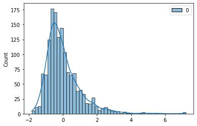

# Exploratory Data Analysis

- [Exploratory Data Analysis](#exploratory-data-analysis)
  - [What Is Exploratory Data Analysis?](#what-is-exploratory-data-analysis)
  - [Data Collection and Data Cleaning](#data-collection-and-data-cleaning)
    - [Explore data](#explore-data)
    - [Data Cleaning](#data-cleaning)
      - [Check missing values](#check-missing-values)
      - [Handle missing values with pandas](#handle-missing-values-with-pandas)
        - [`fillna()`](#fillna)
        - [`drop(index, axis)`](#dropindex-axis)
        - [`dropna()`](#dropna)
      - [Handle missing values with `sklearn:imputer`](#handle-missing-values-with-sklearnimputer)
    - [Data transformation](#data-transformation)
      - [Handling Categorical values: `Label encoding`](#handling-categorical-values-label-encoding)
      - [🥇Handling Categorical values: `OneHotEncoding`](#handling-categorical-values-onehotencoding)
      - [Discretization](#discretization)
  - [Analysis](#analysis)
    - [Univariate Analysis](#univariate-analysis)
    - [Bivariate Analysis](#bivariate-analysis)
      - [Comparing data: `Numeric-Numeric` Analysis](#comparing-data-numeric-numeric-analysis)
        - [Scatter plots](#scatter-plots)
        - [Correlation and Heatmap](#correlation-and-heatmap)
        - [Pair Plots](#pair-plots)
      - [Comparing data: `Numeric - Categorical` Analysis](#comparing-data-numeric---categorical-analysis)
        - [groupby](#groupby)
      - [Pandas.melt()](#pandasmelt)
        - [boxplot](#boxplot)
      - [Comparing data: `Categorical — Categorical` Analysis](#comparing-data-categorical--categorical-analysis)
  - [Feature Scaling](#feature-scaling)
    - [Intro](#intro)
    - [Normalization](#normalization)
    - [Standarization](#standarization)
    - [Compare Oiginal, Normalized, and Standardized datasets](#compare-oiginal-normalized-and-standardized-datasets)
    - [Finding most important feature](#finding-most-important-feature)
  - [Feature Selection](#feature-selection)
    - [Intro](#intro-1)
    - [Filter methods](#filter-methods)
      - [Remove Constant features](#remove-constant-features)
      - [Quasi constant features](#quasi-constant-features)
      - [Correlated features](#correlated-features)
        - [Test with 10 highest correlated features](#test-with-10-highest-correlated-features)
    - [Wrapper methods](#wrapper-methods)
      - [Forward Selection](#forward-selection)
        - [10 best features for LinearRegression model](#10-best-features-for-linearregression-model)
      - [Embedded methods](#embedded-methods)

```python
"""
cd .\09EDA\
jupyter nbconvert --to markdown jupyter.ipynb --output README.md
"""
```

- [https://amueller.github.io/ml-training-intro/slides/04-preprocessing.html#1](https://amueller.github.io/ml-training-intro/slides/04-preprocessing.html#1)

## What Is Exploratory Data Analysis?

Exploratory Data Analysis is a data analytics process to understand the data in depth and learn the different data characteristics, often with visual means. This allows you to get a better feel of your data and find useful patterns in it.

- Helps preparing the dataset for analysis.
- Allows a machine learning model to predict our dataset better.
- Gives more accurate results.
- It also helps us to choose a better machine learning model.

Steps Involved in Exploratory Data Analysis:

1. `Data Collection`
2. `Data Cleaning`
    - Removing missing values, outliers, and unnecessary rows/ columns.
    - Re-indexing and reformatting our data.
3. `Data Analysis`:
   1. `Univariate Analysis`: In Univariate Analysis, you analyze data of just one variable. A variable in your dataset refers to a single feature/ column.
      - `Histograms`: Bar plots in which the frequency of data is represented with rectangle bars.
      - `Box-plots`: Here the information is represented in the form of boxes.
   2. `Bivariate Analysis`: Use two variables and compare them. This way, you can find how one feature affects the other.
      - `Numeric-Numeric Analysis`: both the variables being compared have numeric data.s. To compare two numeric columns, you can use `scatter plots`, `pair plots`, and `correlation` matrices.
      - `Numeric - Categorical Analysis`: one variable is of numeric type and another is a categorical variable.You can use the `groupby` function to arrange the data into similar groups.
      - `Categorical — Categorical Analysis`: When both the variables contain categorical data, you perform categorical-categorical analysis

- [https://www.simplilearn.com/tutorials/data-analytics-tutorial/exploratory-data-analysis](https://www.simplilearn.com/tutorials/data-analytics-tutorial/exploratory-data-analysis)

## Data Collection and Data Cleaning

- Explore problem
- Identify data
- Import data
- Explore data
- Visualize ideas
- Cleaning data


```python
import pandas as pd
import seaborn as sns
import matplotlib.pyplot as plt
import numpy as np
from matplotlib_inline.backend_inline import set_matplotlib_formats
set_matplotlib_formats('jpg')
```

[House Prices](https://www.kaggle.com/competitions/house-prices-advanced-regression-techniques/data)


```python
data = pd.read_csv('house_prices.csv')
```

### Explore data


```python
data.shape

```


    (1460, 81)


```python
data.head()
```


<div>

<table border="1" class="dataframe">
  <thead>
    <tr style="text-align: right;">
      <th></th>
      <th>Id</th>
      <th>MSSubClass</th>
      <th>MSZoning</th>
      <th>LotFrontage</th>
      <th>LotArea</th>
      <th>Street</th>
      <th>Alley</th>
      <th>LotShape</th>
      <th>LandContour</th>
      <th>Utilities</th>
      <th>...</th>
      <th>PoolArea</th>
      <th>PoolQC</th>
      <th>Fence</th>
      <th>MiscFeature</th>
      <th>MiscVal</th>
      <th>MoSold</th>
      <th>YrSold</th>
      <th>SaleType</th>
      <th>SaleCondition</th>
      <th>SalePrice</th>
    </tr>
  </thead>
  <tbody>
    <tr>
      <th>0</th>
      <td>1</td>
      <td>60</td>
      <td>RL</td>
      <td>65.0</td>
      <td>8450</td>
      <td>Pave</td>
      <td>NaN</td>
      <td>Reg</td>
      <td>Lvl</td>
      <td>AllPub</td>
      <td>...</td>
      <td>0</td>
      <td>NaN</td>
      <td>NaN</td>
      <td>NaN</td>
      <td>0</td>
      <td>2</td>
      <td>2008</td>
      <td>WD</td>
      <td>Normal</td>
      <td>208500</td>
    </tr>
    <tr>
      <th>1</th>
      <td>2</td>
      <td>20</td>
      <td>RL</td>
      <td>80.0</td>
      <td>9600</td>
      <td>Pave</td>
      <td>NaN</td>
      <td>Reg</td>
      <td>Lvl</td>
      <td>AllPub</td>
      <td>...</td>
      <td>0</td>
      <td>NaN</td>
      <td>NaN</td>
      <td>NaN</td>
      <td>0</td>
      <td>5</td>
      <td>2007</td>
      <td>WD</td>
      <td>Normal</td>
      <td>181500</td>
    </tr>
    <tr>
      <th>2</th>
      <td>3</td>
      <td>60</td>
      <td>RL</td>
      <td>68.0</td>
      <td>11250</td>
      <td>Pave</td>
      <td>NaN</td>
      <td>IR1</td>
      <td>Lvl</td>
      <td>AllPub</td>
      <td>...</td>
      <td>0</td>
      <td>NaN</td>
      <td>NaN</td>
      <td>NaN</td>
      <td>0</td>
      <td>9</td>
      <td>2008</td>
      <td>WD</td>
      <td>Normal</td>
      <td>223500</td>
    </tr>
    <tr>
      <th>3</th>
      <td>4</td>
      <td>70</td>
      <td>RL</td>
      <td>60.0</td>
      <td>9550</td>
      <td>Pave</td>
      <td>NaN</td>
      <td>IR1</td>
      <td>Lvl</td>
      <td>AllPub</td>
      <td>...</td>
      <td>0</td>
      <td>NaN</td>
      <td>NaN</td>
      <td>NaN</td>
      <td>0</td>
      <td>2</td>
      <td>2006</td>
      <td>WD</td>
      <td>Abnorml</td>
      <td>140000</td>
    </tr>
    <tr>
      <th>4</th>
      <td>5</td>
      <td>60</td>
      <td>RL</td>
      <td>84.0</td>
      <td>14260</td>
      <td>Pave</td>
      <td>NaN</td>
      <td>IR1</td>
      <td>Lvl</td>
      <td>AllPub</td>
      <td>...</td>
      <td>0</td>
      <td>NaN</td>
      <td>NaN</td>
      <td>NaN</td>
      <td>0</td>
      <td>12</td>
      <td>2008</td>
      <td>WD</td>
      <td>Normal</td>
      <td>250000</td>
    </tr>
  </tbody>
</table>
<p>5 rows × 81 columns</p>
</div>


```python
data.columns

```


    Index(['Id', 'MSSubClass', 'MSZoning', 'LotFrontage', 'LotArea', 'Street',
           'Alley', 'LotShape', 'LandContour', 'Utilities', 'LotConfig',
           'LandSlope', 'Neighborhood', 'Condition1', 'Condition2', 'BldgType',
           'HouseStyle', 'OverallQual', 'OverallCond', 'YearBuilt', 'YearRemodAdd',
           'RoofStyle', 'RoofMatl', 'Exterior1st', 'Exterior2nd', 'MasVnrType',
           'MasVnrArea', 'ExterQual', 'ExterCond', 'Foundation', 'BsmtQual',
           'BsmtCond', 'BsmtExposure', 'BsmtFinType1', 'BsmtFinSF1',
           'BsmtFinType2', 'BsmtFinSF2', 'BsmtUnfSF', 'TotalBsmtSF', 'Heating',
           'HeatingQC', 'CentralAir', 'Electrical', '1stFlrSF', '2ndFlrSF',
           'LowQualFinSF', 'GrLivArea', 'BsmtFullBath', 'BsmtHalfBath', 'FullBath',
           'HalfBath', 'BedroomAbvGr', 'KitchenAbvGr', 'KitchenQual',
           'TotRmsAbvGrd', 'Functional', 'Fireplaces', 'FireplaceQu', 'GarageType',
           'GarageYrBlt', 'GarageFinish', 'GarageCars', 'GarageArea', 'GarageQual',
           'GarageCond', 'PavedDrive', 'WoodDeckSF', 'OpenPorchSF',
           'EnclosedPorch', '3SsnPorch', 'ScreenPorch', 'PoolArea', 'PoolQC',
           'Fence', 'MiscFeature', 'MiscVal', 'MoSold', 'YrSold', 'SaleType',
           'SaleCondition', 'SalePrice'],
          dtype='object')


```python
data.info()
```

    <class 'pandas.core.frame.DataFrame'>
    RangeIndex: 1460 entries, 0 to 1459
    Data columns (total 81 columns):
     #   Column         Non-Null Count  Dtype
    ---  ------         --------------  -----
     0   Id             1460 non-null   int64
     1   MSSubClass     1460 non-null   int64
     2   MSZoning       1460 non-null   object
     3   LotFrontage    1201 non-null   float64
     4   LotArea        1460 non-null   int64
     5   Street         1460 non-null   object
     6   Alley          91 non-null     object
     7   LotShape       1460 non-null   object
     8   LandContour    1460 non-null   object
     9   Utilities      1460 non-null   object
     10  LotConfig      1460 non-null   object
     11  LandSlope      1460 non-null   object
     12  Neighborhood   1460 non-null   object
     13  Condition1     1460 non-null   object
     14  Condition2     1460 non-null   object
     15  BldgType       1460 non-null   object
     16  HouseStyle     1460 non-null   object
     17  OverallQual    1460 non-null   int64
     18  OverallCond    1460 non-null   int64
     19  YearBuilt      1460 non-null   int64
     20  YearRemodAdd   1460 non-null   int64
     21  RoofStyle      1460 non-null   object
     22  RoofMatl       1460 non-null   object
     23  Exterior1st    1460 non-null   object
     24  Exterior2nd    1460 non-null   object
     25  MasVnrType     1452 non-null   object
     26  MasVnrArea     1452 non-null   float64
     27  ExterQual      1460 non-null   object
     28  ExterCond      1460 non-null   object
     29  Foundation     1460 non-null   object
     30  BsmtQual       1423 non-null   object
     31  BsmtCond       1423 non-null   object
     32  BsmtExposure   1422 non-null   object
     33  BsmtFinType1   1423 non-null   object
     34  BsmtFinSF1     1460 non-null   int64
     35  BsmtFinType2   1422 non-null   object
     36  BsmtFinSF2     1460 non-null   int64
     37  BsmtUnfSF      1460 non-null   int64
     38  TotalBsmtSF    1460 non-null   int64
     39  Heating        1460 non-null   object
     40  HeatingQC      1460 non-null   object
     41  CentralAir     1460 non-null   object
     42  Electrical     1459 non-null   object
     43  1stFlrSF       1460 non-null   int64
     44  2ndFlrSF       1460 non-null   int64
     45  LowQualFinSF   1460 non-null   int64
     46  GrLivArea      1460 non-null   int64
     47  BsmtFullBath   1460 non-null   int64
     48  BsmtHalfBath   1460 non-null   int64
     49  FullBath       1460 non-null   int64
     50  HalfBath       1460 non-null   int64
     51  BedroomAbvGr   1460 non-null   int64
     52  KitchenAbvGr   1460 non-null   int64
     53  KitchenQual    1460 non-null   object
     54  TotRmsAbvGrd   1460 non-null   int64
     55  Functional     1460 non-null   object
     56  Fireplaces     1460 non-null   int64
     57  FireplaceQu    770 non-null    object
     58  GarageType     1379 non-null   object
     59  GarageYrBlt    1379 non-null   float64
     60  GarageFinish   1379 non-null   object
     61  GarageCars     1460 non-null   int64
     62  GarageArea     1460 non-null   int64
     63  GarageQual     1379 non-null   object
     64  GarageCond     1379 non-null   object
     65  PavedDrive     1460 non-null   object
     66  WoodDeckSF     1460 non-null   int64
     67  OpenPorchSF    1460 non-null   int64
     68  EnclosedPorch  1460 non-null   int64
     69  3SsnPorch      1460 non-null   int64
     70  ScreenPorch    1460 non-null   int64
     71  PoolArea       1460 non-null   int64
     72  PoolQC         7 non-null      object
     73  Fence          281 non-null    object
     74  MiscFeature    54 non-null     object
     75  MiscVal        1460 non-null   int64
     76  MoSold         1460 non-null   int64
     77  YrSold         1460 non-null   int64
     78  SaleType       1460 non-null   object
     79  SaleCondition  1460 non-null   object
     80  SalePrice      1460 non-null   int64
    dtypes: float64(3), int64(35), object(43)
    memory usage: 924.0+ KB


```python
data.describe()
```


<div>

<table border="1" class="dataframe">
  <thead>
    <tr style="text-align: right;">
      <th></th>
      <th>Id</th>
      <th>MSSubClass</th>
      <th>LotFrontage</th>
      <th>LotArea</th>
      <th>OverallQual</th>
      <th>OverallCond</th>
      <th>YearBuilt</th>
      <th>YearRemodAdd</th>
      <th>MasVnrArea</th>
      <th>BsmtFinSF1</th>
      <th>...</th>
      <th>WoodDeckSF</th>
      <th>OpenPorchSF</th>
      <th>EnclosedPorch</th>
      <th>3SsnPorch</th>
      <th>ScreenPorch</th>
      <th>PoolArea</th>
      <th>MiscVal</th>
      <th>MoSold</th>
      <th>YrSold</th>
      <th>SalePrice</th>
    </tr>
  </thead>
  <tbody>
    <tr>
      <th>count</th>
      <td>1460.000000</td>
      <td>1460.000000</td>
      <td>1201.000000</td>
      <td>1460.000000</td>
      <td>1460.000000</td>
      <td>1460.000000</td>
      <td>1460.000000</td>
      <td>1460.000000</td>
      <td>1452.000000</td>
      <td>1460.000000</td>
      <td>...</td>
      <td>1460.000000</td>
      <td>1460.000000</td>
      <td>1460.000000</td>
      <td>1460.000000</td>
      <td>1460.000000</td>
      <td>1460.000000</td>
      <td>1460.000000</td>
      <td>1460.000000</td>
      <td>1460.000000</td>
      <td>1460.000000</td>
    </tr>
    <tr>
      <th>mean</th>
      <td>730.500000</td>
      <td>56.897260</td>
      <td>70.049958</td>
      <td>10516.828082</td>
      <td>6.099315</td>
      <td>5.575342</td>
      <td>1971.267808</td>
      <td>1984.865753</td>
      <td>103.685262</td>
      <td>443.639726</td>
      <td>...</td>
      <td>94.244521</td>
      <td>46.660274</td>
      <td>21.954110</td>
      <td>3.409589</td>
      <td>15.060959</td>
      <td>2.758904</td>
      <td>43.489041</td>
      <td>6.321918</td>
      <td>2007.815753</td>
      <td>180921.195890</td>
    </tr>
    <tr>
      <th>std</th>
      <td>421.610009</td>
      <td>42.300571</td>
      <td>24.284752</td>
      <td>9981.264932</td>
      <td>1.382997</td>
      <td>1.112799</td>
      <td>30.202904</td>
      <td>20.645407</td>
      <td>181.066207</td>
      <td>456.098091</td>
      <td>...</td>
      <td>125.338794</td>
      <td>66.256028</td>
      <td>61.119149</td>
      <td>29.317331</td>
      <td>55.757415</td>
      <td>40.177307</td>
      <td>496.123024</td>
      <td>2.703626</td>
      <td>1.328095</td>
      <td>79442.502883</td>
    </tr>
    <tr>
      <th>min</th>
      <td>1.000000</td>
      <td>20.000000</td>
      <td>21.000000</td>
      <td>1300.000000</td>
      <td>1.000000</td>
      <td>1.000000</td>
      <td>1872.000000</td>
      <td>1950.000000</td>
      <td>0.000000</td>
      <td>0.000000</td>
      <td>...</td>
      <td>0.000000</td>
      <td>0.000000</td>
      <td>0.000000</td>
      <td>0.000000</td>
      <td>0.000000</td>
      <td>0.000000</td>
      <td>0.000000</td>
      <td>1.000000</td>
      <td>2006.000000</td>
      <td>34900.000000</td>
    </tr>
    <tr>
      <th>25%</th>
      <td>365.750000</td>
      <td>20.000000</td>
      <td>59.000000</td>
      <td>7553.500000</td>
      <td>5.000000</td>
      <td>5.000000</td>
      <td>1954.000000</td>
      <td>1967.000000</td>
      <td>0.000000</td>
      <td>0.000000</td>
      <td>...</td>
      <td>0.000000</td>
      <td>0.000000</td>
      <td>0.000000</td>
      <td>0.000000</td>
      <td>0.000000</td>
      <td>0.000000</td>
      <td>0.000000</td>
      <td>5.000000</td>
      <td>2007.000000</td>
      <td>129975.000000</td>
    </tr>
    <tr>
      <th>50%</th>
      <td>730.500000</td>
      <td>50.000000</td>
      <td>69.000000</td>
      <td>9478.500000</td>
      <td>6.000000</td>
      <td>5.000000</td>
      <td>1973.000000</td>
      <td>1994.000000</td>
      <td>0.000000</td>
      <td>383.500000</td>
      <td>...</td>
      <td>0.000000</td>
      <td>25.000000</td>
      <td>0.000000</td>
      <td>0.000000</td>
      <td>0.000000</td>
      <td>0.000000</td>
      <td>0.000000</td>
      <td>6.000000</td>
      <td>2008.000000</td>
      <td>163000.000000</td>
    </tr>
    <tr>
      <th>75%</th>
      <td>1095.250000</td>
      <td>70.000000</td>
      <td>80.000000</td>
      <td>11601.500000</td>
      <td>7.000000</td>
      <td>6.000000</td>
      <td>2000.000000</td>
      <td>2004.000000</td>
      <td>166.000000</td>
      <td>712.250000</td>
      <td>...</td>
      <td>168.000000</td>
      <td>68.000000</td>
      <td>0.000000</td>
      <td>0.000000</td>
      <td>0.000000</td>
      <td>0.000000</td>
      <td>0.000000</td>
      <td>8.000000</td>
      <td>2009.000000</td>
      <td>214000.000000</td>
    </tr>
    <tr>
      <th>max</th>
      <td>1460.000000</td>
      <td>190.000000</td>
      <td>313.000000</td>
      <td>215245.000000</td>
      <td>10.000000</td>
      <td>9.000000</td>
      <td>2010.000000</td>
      <td>2010.000000</td>
      <td>1600.000000</td>
      <td>5644.000000</td>
      <td>...</td>
      <td>857.000000</td>
      <td>547.000000</td>
      <td>552.000000</td>
      <td>508.000000</td>
      <td>480.000000</td>
      <td>738.000000</td>
      <td>15500.000000</td>
      <td>12.000000</td>
      <td>2010.000000</td>
      <td>755000.000000</td>
    </tr>
  </tbody>
</table>
<p>8 rows × 38 columns</p>
</div>


```python
data.dtypes

```


    Id                 int64
    MSSubClass         int64
    MSZoning          object
    LotFrontage      float64
    LotArea            int64
                      ...
    MoSold             int64
    YrSold             int64
    SaleType          object
    SaleCondition     object
    SalePrice          int64
    Length: 81, dtype: object


### Data Cleaning


Data cleaning refers to the process of removing unwanted variables and values from your dataset and getting rid of any irregularities in it. Such anomalies can disproportionately skew the data and hence adversely affect the results. Some steps that can be done to clean data are:

- Removing missing values, outliers, and unnecessary rows/ columns.
- Re-indexing and reformatting our data.

Now, it’s time to clean the housing dataset. You first need to check to see the number of missing values in each column and the percentage of missing values they contribute to.


#### Check missing values


```python
total = data.isnull().sum().sort_values(ascending=False)
# percent = (data.isnull().sum() / data.isnull().count()).sort_values(ascending=False) * 100
# data.isnull().count() returns the total number of rows irrespective of missing values
percent = (data.isnull().sum() / len(data)).sort_values(ascending=False) * 100
missing_data = pd.concat([total, percent], axis=1, keys=['Total', 'Percent'])
missing_data.head(20)
```


<div>

<table border="1" class="dataframe">
  <thead>
    <tr style="text-align: right;">
      <th></th>
      <th>Total</th>
      <th>Percent</th>
    </tr>
  </thead>
  <tbody>
    <tr>
      <th>PoolQC</th>
      <td>1453</td>
      <td>99.520548</td>
    </tr>
    <tr>
      <th>MiscFeature</th>
      <td>1406</td>
      <td>96.301370</td>
    </tr>
    <tr>
      <th>Alley</th>
      <td>1369</td>
      <td>93.767123</td>
    </tr>
    <tr>
      <th>Fence</th>
      <td>1179</td>
      <td>80.753425</td>
    </tr>
    <tr>
      <th>FireplaceQu</th>
      <td>690</td>
      <td>47.260274</td>
    </tr>
    <tr>
      <th>GarageType</th>
      <td>81</td>
      <td>5.547945</td>
    </tr>
    <tr>
      <th>GarageYrBlt</th>
      <td>81</td>
      <td>5.547945</td>
    </tr>
    <tr>
      <th>GarageFinish</th>
      <td>81</td>
      <td>5.547945</td>
    </tr>
    <tr>
      <th>GarageQual</th>
      <td>81</td>
      <td>5.547945</td>
    </tr>
    <tr>
      <th>GarageCond</th>
      <td>81</td>
      <td>5.547945</td>
    </tr>
    <tr>
      <th>BsmtExposure</th>
      <td>38</td>
      <td>2.602740</td>
    </tr>
    <tr>
      <th>BsmtFinType2</th>
      <td>38</td>
      <td>2.602740</td>
    </tr>
    <tr>
      <th>BsmtFinType1</th>
      <td>37</td>
      <td>2.534247</td>
    </tr>
    <tr>
      <th>BsmtCond</th>
      <td>37</td>
      <td>2.534247</td>
    </tr>
    <tr>
      <th>BsmtQual</th>
      <td>37</td>
      <td>2.534247</td>
    </tr>
    <tr>
      <th>MasVnrType</th>
      <td>8</td>
      <td>0.547945</td>
    </tr>
    <tr>
      <th>MasVnrArea</th>
      <td>8</td>
      <td>0.547945</td>
    </tr>
    <tr>
      <th>Electrical</th>
      <td>1</td>
      <td>0.068493</td>
    </tr>
    <tr>
      <th>KitchenQual</th>
      <td>0</td>
      <td>0.000000</td>
    </tr>
    <tr>
      <th>TotRmsAbvGrd</th>
      <td>0</td>
      <td>0.000000</td>
    </tr>
  </tbody>
</table>
</div>


#### Handle missing values with pandas

##### `fillna()`


```python
data_num = data.select_dtypes(include=['number'])
data_num.head()
```


<div>

<table border="1" class="dataframe">
  <thead>
    <tr style="text-align: right;">
      <th></th>
      <th>Id</th>
      <th>MSSubClass</th>
      <th>LotFrontage</th>
      <th>LotArea</th>
      <th>OverallQual</th>
      <th>OverallCond</th>
      <th>YearBuilt</th>
      <th>YearRemodAdd</th>
      <th>MasVnrArea</th>
      <th>BsmtFinSF1</th>
      <th>...</th>
      <th>OpenPorchSF</th>
      <th>EnclosedPorch</th>
      <th>3SsnPorch</th>
      <th>ScreenPorch</th>
      <th>PoolArea</th>
      <th>MiscVal</th>
      <th>MoSold</th>
      <th>YrSold</th>
      <th>SalePrice</th>
      <th>SaleType_Label</th>
    </tr>
  </thead>
  <tbody>
    <tr>
      <th>0</th>
      <td>1</td>
      <td>60</td>
      <td>65.0</td>
      <td>8450</td>
      <td>7</td>
      <td>5</td>
      <td>2003</td>
      <td>2003</td>
      <td>196.0</td>
      <td>706</td>
      <td>...</td>
      <td>61</td>
      <td>0</td>
      <td>0</td>
      <td>0</td>
      <td>0</td>
      <td>0</td>
      <td>2</td>
      <td>2008</td>
      <td>208500</td>
      <td>8</td>
    </tr>
    <tr>
      <th>1</th>
      <td>2</td>
      <td>20</td>
      <td>80.0</td>
      <td>9600</td>
      <td>6</td>
      <td>8</td>
      <td>1976</td>
      <td>1976</td>
      <td>0.0</td>
      <td>978</td>
      <td>...</td>
      <td>0</td>
      <td>0</td>
      <td>0</td>
      <td>0</td>
      <td>0</td>
      <td>0</td>
      <td>5</td>
      <td>2007</td>
      <td>181500</td>
      <td>8</td>
    </tr>
    <tr>
      <th>2</th>
      <td>3</td>
      <td>60</td>
      <td>68.0</td>
      <td>11250</td>
      <td>7</td>
      <td>5</td>
      <td>2001</td>
      <td>2002</td>
      <td>162.0</td>
      <td>486</td>
      <td>...</td>
      <td>42</td>
      <td>0</td>
      <td>0</td>
      <td>0</td>
      <td>0</td>
      <td>0</td>
      <td>9</td>
      <td>2008</td>
      <td>223500</td>
      <td>8</td>
    </tr>
    <tr>
      <th>3</th>
      <td>4</td>
      <td>70</td>
      <td>60.0</td>
      <td>9550</td>
      <td>7</td>
      <td>5</td>
      <td>1915</td>
      <td>1970</td>
      <td>0.0</td>
      <td>216</td>
      <td>...</td>
      <td>35</td>
      <td>272</td>
      <td>0</td>
      <td>0</td>
      <td>0</td>
      <td>0</td>
      <td>2</td>
      <td>2006</td>
      <td>140000</td>
      <td>8</td>
    </tr>
    <tr>
      <th>4</th>
      <td>5</td>
      <td>60</td>
      <td>84.0</td>
      <td>14260</td>
      <td>8</td>
      <td>5</td>
      <td>2000</td>
      <td>2000</td>
      <td>350.0</td>
      <td>655</td>
      <td>...</td>
      <td>84</td>
      <td>0</td>
      <td>0</td>
      <td>0</td>
      <td>0</td>
      <td>0</td>
      <td>12</td>
      <td>2008</td>
      <td>250000</td>
      <td>8</td>
    </tr>
  </tbody>
</table>
<p>5 rows × 39 columns</p>
</div>


```python
data_num['LotFrontage'].fillna(data_num['LotFrontage'].mean(), inplace=True)

```

##### `drop(index, axis)`


```python
# drop columns with more than 1 missing value
data = data.drop((missing_data[missing_data['Total'] > 1]).index, axis=1)
data = data.drop(data.loc[data['Electrical'].isnull()].index)
data.isnull().sum()
```


    Id               0
    MSSubClass       0
    MSZoning         0
    LotArea          0
    Street           0
                    ..
    MoSold           0
    YrSold           0
    SaleType         0
    SaleCondition    0
    SalePrice        0
    Length: 63, dtype: int64


```python
# or
# drops the records with missing values
# data = data[~data['Electrical'].isnull()].copy()

```


```python
data.shape
```


    (1459, 63)


##### `dropna()`

- Useful for `Y` dataset


```python
df = pd.read_csv('car-sales-extended-missing-data.csv')
Y = df['Price']
Y.isna().sum()
```


    50


```python
Y.dropna(inplace=True)
Y.isna().sum()

```


    0


#### Handle missing values with `sklearn:imputer`


```python
df = pd.read_csv('car-sales-extended-missing-data.csv')
X = df.drop('Price',axis=1)
y = df['Price']
X.shape,y.shape
```


    ((1000, 4), (1000,))


```python
df.head()
```


<div>

<table border="1" class="dataframe">
  <thead>
    <tr style="text-align: right;">
      <th></th>
      <th>Make</th>
      <th>Colour</th>
      <th>Odometer (KM)</th>
      <th>Doors</th>
      <th>Price</th>
    </tr>
  </thead>
  <tbody>
    <tr>
      <th>0</th>
      <td>Honda</td>
      <td>White</td>
      <td>35431.0</td>
      <td>4.0</td>
      <td>15323.0</td>
    </tr>
    <tr>
      <th>1</th>
      <td>BMW</td>
      <td>Blue</td>
      <td>192714.0</td>
      <td>5.0</td>
      <td>19943.0</td>
    </tr>
    <tr>
      <th>2</th>
      <td>Honda</td>
      <td>White</td>
      <td>84714.0</td>
      <td>4.0</td>
      <td>28343.0</td>
    </tr>
    <tr>
      <th>3</th>
      <td>Toyota</td>
      <td>White</td>
      <td>154365.0</td>
      <td>4.0</td>
      <td>13434.0</td>
    </tr>
    <tr>
      <th>4</th>
      <td>Nissan</td>
      <td>Blue</td>
      <td>181577.0</td>
      <td>3.0</td>
      <td>14043.0</td>
    </tr>
  </tbody>
</table>
</div>


```python
from sklearn.impute import SimpleImputer
from sklearn.compose import ColumnTransformer

# !Define strategy:
# Filling categorical missing values with `unknown` & numerical with `mean` value
cat_imputer = SimpleImputer(strategy='constant',fill_value='unknown')
num_imputer = SimpleImputer(strategy='mean')
# Note: value of `Doors` can't be taken as either numeric or categorical
# nonetheless,we will be treating it a categorical
door_imputer = SimpleImputer(strategy='constant',fill_value=4)

# !Define columns
categorical_features = ['Make','Colour']
numerical_features = ["Odometer (KM)"]
door_column = ["Doors"]

# *Create an imputer (something that fills missing data)
imputer = ColumnTransformer(
	[
		('cat_imputer_random_skjsdfh',cat_imputer,categorical_features),
		('num_imputer',num_imputer,numerical_features),
		('door_imputer',door_imputer,door_column),
	]
)

filled_X = imputer.fit_transform(X)
filled_X
```


    array([['Honda', 'White', 35431.0, 4.0],
           ['BMW', 'Blue', 192714.0, 5.0],
           ['Honda', 'White', 84714.0, 4.0],
           ...,
           ['Nissan', 'Blue', 66604.0, 4.0],
           ['Honda', 'White', 215883.0, 4.0],
           ['Toyota', 'Blue', 248360.0, 4.0]], dtype=object)


```python
filled_X = pd.DataFrame(filled_X,columns=X.columns)
filled_X.head()
```


<div>

<table border="1" class="dataframe">
  <thead>
    <tr style="text-align: right;">
      <th></th>
      <th>Make</th>
      <th>Colour</th>
      <th>Odometer (KM)</th>
      <th>Doors</th>
    </tr>
  </thead>
  <tbody>
    <tr>
      <th>0</th>
      <td>Honda</td>
      <td>White</td>
      <td>35431.0</td>
      <td>4.0</td>
    </tr>
    <tr>
      <th>1</th>
      <td>BMW</td>
      <td>Blue</td>
      <td>192714.0</td>
      <td>5.0</td>
    </tr>
    <tr>
      <th>2</th>
      <td>Honda</td>
      <td>White</td>
      <td>84714.0</td>
      <td>4.0</td>
    </tr>
    <tr>
      <th>3</th>
      <td>Toyota</td>
      <td>White</td>
      <td>154365.0</td>
      <td>4.0</td>
    </tr>
    <tr>
      <th>4</th>
      <td>Nissan</td>
      <td>Blue</td>
      <td>181577.0</td>
      <td>3.0</td>
    </tr>
  </tbody>
</table>
</div>


### Data transformation

#### Handling Categorical values: `Label encoding`


```python
data['SaleType'].unique()

```


    array(['WD', 'New', 'COD', 'ConLD', 'ConLI', 'CWD', 'ConLw', 'Con', 'Oth'],
          dtype=object)


```python
from sklearn.preprocessing import LabelEncoder
label_encoder=LabelEncoder()
data['SaleType_Label']= label_encoder.fit_transform(data['SaleType'])
data['SaleType_Label'].unique()
```


    array([8, 6, 0, 3, 4, 1, 5, 2, 7])


#### 🥇Handling Categorical values: `OneHotEncoding`


```python
df = pd.read_csv('car-sales-extended-missing-data.csv')
df.head()
```


<div>

<table border="1" class="dataframe">
  <thead>
    <tr style="text-align: right;">
      <th></th>
      <th>Make</th>
      <th>Colour</th>
      <th>Odometer (KM)</th>
      <th>Doors</th>
      <th>Price</th>
    </tr>
  </thead>
  <tbody>
    <tr>
      <th>0</th>
      <td>Honda</td>
      <td>White</td>
      <td>35431.0</td>
      <td>4.0</td>
      <td>15323.0</td>
    </tr>
    <tr>
      <th>1</th>
      <td>BMW</td>
      <td>Blue</td>
      <td>192714.0</td>
      <td>5.0</td>
      <td>19943.0</td>
    </tr>
    <tr>
      <th>2</th>
      <td>Honda</td>
      <td>White</td>
      <td>84714.0</td>
      <td>4.0</td>
      <td>28343.0</td>
    </tr>
    <tr>
      <th>3</th>
      <td>Toyota</td>
      <td>White</td>
      <td>154365.0</td>
      <td>4.0</td>
      <td>13434.0</td>
    </tr>
    <tr>
      <th>4</th>
      <td>Nissan</td>
      <td>Blue</td>
      <td>181577.0</td>
      <td>3.0</td>
      <td>14043.0</td>
    </tr>
  </tbody>
</table>
</div>


```python
df.isnull().sum()
```


    Make             49
    Colour           50
    Odometer (KM)    50
    Doors            50
    Price            50
    dtype: int64


```python
from sklearn.preprocessing import OneHotEncoder
from sklearn.compose import ColumnTransformer

categorical_features = ['Colour','Make','Doors']
ct = ColumnTransformer([('one_hot',OneHotEncoder(), categorical_features)], remainder='passthrough')
# remainder: {‘drop’, ‘passthrough’}, default=’drop’ ->drops non-specified columns

transformed = ct.fit_transform(df)
pd.DataFrame(transformed.toarray()).head()


```


<div>

<table border="1" class="dataframe">
  <thead>
    <tr style="text-align: right;">
      <th></th>
      <th>0</th>
      <th>1</th>
      <th>2</th>
      <th>3</th>
      <th>4</th>
      <th>5</th>
      <th>6</th>
      <th>7</th>
      <th>8</th>
      <th>9</th>
      <th>10</th>
      <th>11</th>
      <th>12</th>
      <th>13</th>
      <th>14</th>
      <th>15</th>
      <th>16</th>
    </tr>
  </thead>
  <tbody>
    <tr>
      <th>0</th>
      <td>0.0</td>
      <td>0.0</td>
      <td>0.0</td>
      <td>0.0</td>
      <td>1.0</td>
      <td>0.0</td>
      <td>0.0</td>
      <td>1.0</td>
      <td>0.0</td>
      <td>0.0</td>
      <td>0.0</td>
      <td>0.0</td>
      <td>1.0</td>
      <td>0.0</td>
      <td>0.0</td>
      <td>35431.0</td>
      <td>15323.0</td>
    </tr>
    <tr>
      <th>1</th>
      <td>0.0</td>
      <td>1.0</td>
      <td>0.0</td>
      <td>0.0</td>
      <td>0.0</td>
      <td>0.0</td>
      <td>1.0</td>
      <td>0.0</td>
      <td>0.0</td>
      <td>0.0</td>
      <td>0.0</td>
      <td>0.0</td>
      <td>0.0</td>
      <td>1.0</td>
      <td>0.0</td>
      <td>192714.0</td>
      <td>19943.0</td>
    </tr>
    <tr>
      <th>2</th>
      <td>0.0</td>
      <td>0.0</td>
      <td>0.0</td>
      <td>0.0</td>
      <td>1.0</td>
      <td>0.0</td>
      <td>0.0</td>
      <td>1.0</td>
      <td>0.0</td>
      <td>0.0</td>
      <td>0.0</td>
      <td>0.0</td>
      <td>1.0</td>
      <td>0.0</td>
      <td>0.0</td>
      <td>84714.0</td>
      <td>28343.0</td>
    </tr>
    <tr>
      <th>3</th>
      <td>0.0</td>
      <td>0.0</td>
      <td>0.0</td>
      <td>0.0</td>
      <td>1.0</td>
      <td>0.0</td>
      <td>0.0</td>
      <td>0.0</td>
      <td>0.0</td>
      <td>1.0</td>
      <td>0.0</td>
      <td>0.0</td>
      <td>1.0</td>
      <td>0.0</td>
      <td>0.0</td>
      <td>154365.0</td>
      <td>13434.0</td>
    </tr>
    <tr>
      <th>4</th>
      <td>0.0</td>
      <td>1.0</td>
      <td>0.0</td>
      <td>0.0</td>
      <td>0.0</td>
      <td>0.0</td>
      <td>0.0</td>
      <td>0.0</td>
      <td>1.0</td>
      <td>0.0</td>
      <td>0.0</td>
      <td>1.0</td>
      <td>0.0</td>
      <td>0.0</td>
      <td>0.0</td>
      <td>181577.0</td>
      <td>14043.0</td>
    </tr>
  </tbody>
</table>
</div>


#### Discretization

Data discretization refers to a method of converting a huge number of data values into smaller ones so that the evaluation and management of data become easy.In other words, data discretization is a method of converting attributes values of continuous data into a finite set of intervals with minimum data loss.

Suppose we have an attribute of Age with the given values

`Age: 1,5,9,4,7,11,14,17,13,18,19,31,33,36,42,44,46,70,74,78,77`

Discretization:

| Age       | Age               | Age               | Age         |
| --------- | ----------------- | ----------------- | ----------- |
| 1,5,4,9,7 | 11,14,17,13,18,19 | 31,33,36,42,44,46 | 70,74,77,78 |
| Child     | Young             | Mature            | Old         |


```python
data['SalePrice'].agg([min,max,np.mean])
```


    min      34900.000000
    max     755000.000000
    mean    180930.394791
    Name: SalePrice, dtype: float64


```python
data['Price_label'] = pd.cut(x=data['SalePrice'], bins=[34900, 100000,400000,755000], labels=['Cheap', 'Medium', 'Expensive'])
data[['SalePrice','Price_label']].head()
```


<div>

<table border="1" class="dataframe">
  <thead>
    <tr style="text-align: right;">
      <th></th>
      <th>SalePrice</th>
      <th>Price_label</th>
    </tr>
  </thead>
  <tbody>
    <tr>
      <th>0</th>
      <td>208500</td>
      <td>Medium</td>
    </tr>
    <tr>
      <th>1</th>
      <td>181500</td>
      <td>Medium</td>
    </tr>
    <tr>
      <th>2</th>
      <td>223500</td>
      <td>Medium</td>
    </tr>
    <tr>
      <th>3</th>
      <td>140000</td>
      <td>Medium</td>
    </tr>
    <tr>
      <th>4</th>
      <td>250000</td>
      <td>Medium</td>
    </tr>
  </tbody>
</table>
</div>


## Analysis

### Univariate Analysis

In Univariate Analysis, you analyze data of just one variable. A variable in your dataset refers to a single feature/ column. You can do this either with graphical or non-graphical means by finding specific mathematical values in the data. Some visual methods include:

- `Histograms`: Bar plots in which the frequency of data is represented with rectangle bars.
- `Box-plots`: Here the information is represented in the form of boxes.


```python
data.head()
```


<div>

<table border="1" class="dataframe">
  <thead>
    <tr style="text-align: right;">
      <th></th>
      <th>Id</th>
      <th>MSSubClass</th>
      <th>MSZoning</th>
      <th>LotArea</th>
      <th>Street</th>
      <th>LotShape</th>
      <th>LandContour</th>
      <th>Utilities</th>
      <th>LotConfig</th>
      <th>LandSlope</th>
      <th>...</th>
      <th>EnclosedPorch</th>
      <th>3SsnPorch</th>
      <th>ScreenPorch</th>
      <th>PoolArea</th>
      <th>MiscVal</th>
      <th>MoSold</th>
      <th>YrSold</th>
      <th>SaleType</th>
      <th>SaleCondition</th>
      <th>SalePrice</th>
    </tr>
  </thead>
  <tbody>
    <tr>
      <th>0</th>
      <td>1</td>
      <td>60</td>
      <td>RL</td>
      <td>8450</td>
      <td>Pave</td>
      <td>Reg</td>
      <td>Lvl</td>
      <td>AllPub</td>
      <td>Inside</td>
      <td>Gtl</td>
      <td>...</td>
      <td>0</td>
      <td>0</td>
      <td>0</td>
      <td>0</td>
      <td>0</td>
      <td>2</td>
      <td>2008</td>
      <td>WD</td>
      <td>Normal</td>
      <td>208500</td>
    </tr>
    <tr>
      <th>1</th>
      <td>2</td>
      <td>20</td>
      <td>RL</td>
      <td>9600</td>
      <td>Pave</td>
      <td>Reg</td>
      <td>Lvl</td>
      <td>AllPub</td>
      <td>FR2</td>
      <td>Gtl</td>
      <td>...</td>
      <td>0</td>
      <td>0</td>
      <td>0</td>
      <td>0</td>
      <td>0</td>
      <td>5</td>
      <td>2007</td>
      <td>WD</td>
      <td>Normal</td>
      <td>181500</td>
    </tr>
    <tr>
      <th>2</th>
      <td>3</td>
      <td>60</td>
      <td>RL</td>
      <td>11250</td>
      <td>Pave</td>
      <td>IR1</td>
      <td>Lvl</td>
      <td>AllPub</td>
      <td>Inside</td>
      <td>Gtl</td>
      <td>...</td>
      <td>0</td>
      <td>0</td>
      <td>0</td>
      <td>0</td>
      <td>0</td>
      <td>9</td>
      <td>2008</td>
      <td>WD</td>
      <td>Normal</td>
      <td>223500</td>
    </tr>
    <tr>
      <th>3</th>
      <td>4</td>
      <td>70</td>
      <td>RL</td>
      <td>9550</td>
      <td>Pave</td>
      <td>IR1</td>
      <td>Lvl</td>
      <td>AllPub</td>
      <td>Corner</td>
      <td>Gtl</td>
      <td>...</td>
      <td>272</td>
      <td>0</td>
      <td>0</td>
      <td>0</td>
      <td>0</td>
      <td>2</td>
      <td>2006</td>
      <td>WD</td>
      <td>Abnorml</td>
      <td>140000</td>
    </tr>
    <tr>
      <th>4</th>
      <td>5</td>
      <td>60</td>
      <td>RL</td>
      <td>14260</td>
      <td>Pave</td>
      <td>IR1</td>
      <td>Lvl</td>
      <td>AllPub</td>
      <td>FR2</td>
      <td>Gtl</td>
      <td>...</td>
      <td>0</td>
      <td>0</td>
      <td>0</td>
      <td>0</td>
      <td>0</td>
      <td>12</td>
      <td>2008</td>
      <td>WD</td>
      <td>Normal</td>
      <td>250000</td>
    </tr>
  </tbody>
</table>
<p>5 rows × 63 columns</p>
</div>


```python
data['SalePrice'].plot(kind='hist', bins=50, figsize=(10,6))
```


    <AxesSubplot:ylabel='Frequency'>


```python
plt.figure(figsize=(10, 8))
sns.histplot(data['SalePrice'], kde=True)
plt.show()

```


From the above graph, you can say that the graph deviates from the `normal` and is `positively skewed`. Now, find the Skewness and Kurtosis of the graph.

<div align="center">

</div>

- [https://www.analyticsvidhya.com/blog/2021/05/shape-of-data-skewness-and-kurtosis/](https://www.analyticsvidhya.com/blog/2021/05/shape-of-data-skewness-and-kurtosis/)
- [https://statistical-aid.medium.com/skewness-and-kurtosis-in-statistics-55332d5c062](https://statistical-aid.medium.com/skewness-and-kurtosis-in-statistics-55332d5c062)


```python
# skewness and kurtosis
print('Skewness: %f' % data['SalePrice'].skew())
print('Kurtosis: %f' % data['SalePrice'].kurt())
```

    Skewness: 1.881943
    Kurtosis: 6.529263


To understand exactly which variables are outliers, you need to establish a threshold. To do this, you have to standardize the data. Hence, the data should have a mean of 1 and a standard deviation of 0.


```python
data['SalePrice'].values.reshape(-1, 1)
```


    array([[208500],
           [181500],
           [223500],
           ...,
           [266500],
           [142125],
           [147500]], dtype=int64)


```python
np.array(data['SalePrice']).reshape(-1, 1)
```


    array([[208500],
           [181500],
           [223500],
           ...,
           [266500],
           [142125],
           [147500]], dtype=int64)


```python
from sklearn.preprocessing import StandardScaler
scaler = StandardScaler()
saleprice_scaled = scaler.fit_transform(data['SalePrice'].values.reshape(-1, 1))
sns.histplot(saleprice_scaled, kde=True)
```


    <AxesSubplot:ylabel='Count'>





```python
low_range = saleprice_scaled[saleprice_scaled[:, 0].argsort()][:5]
high_range = saleprice_scaled[saleprice_scaled[:, 0].argsort()][-10:]
print('outer range (low) :', low_range)
print('outer range (high) :', high_range)
```

    outer range (low) : [[-1.83820775]
     [-1.83303414]
     [-1.80044422]
     [-1.78282123]
     [-1.77400974]]
    outer range (high) : [[3.82758058]
     [4.0395221 ]
     [4.49473628]
     [4.70872962]
     [4.728631  ]
     [5.06034585]
     [5.42191907]
     [5.58987866]
     [7.10041987]
     [7.22629831]]


The above figure shows that the lower range values fall in a similar range and are too far from 0. Meanwhile, all the higher range values have a range far from 0. You cannot consider that all of them are outliers, but you have to be careful with the last two variables that are above 7.


```python
data.LotConfig.value_counts(normalize=True).plot(kind='barh', figsize=(10,6))
```


    <AxesSubplot:>


```python
data['SalePrice'].mean()
```


    180159.92852233676


```python
(data['SalePrice'] < 180159).shape
# both true and false
```


    (1455,)


```python
data[data['SalePrice'] < 180159]['SalePrice'].shape
# only true values are in the dataframe
```


    (894,)


```python
(data['SalePrice'] < 180159).value_counts().plot.pie(colors=['r', 'g'],
                                                     labels=['>=17.5', '<17.5'], autopct='%1.1f%%')


```


    <AxesSubplot:ylabel='SalePrice'>


### Bivariate Analysis


**Here, you use two variables and compare them**. This way, you can find how one feature affects the other. It is done with scatter plots, which plot **individual data points** or **correlation** matrices that plot the correlation in hues.


#### Comparing data: `Numeric-Numeric` Analysis


```python
data[['SalePrice', 'LotArea']].loc[:50].plot()
```


    <AxesSubplot:>


##### Scatter plots

Let's plot a scatter plot of the greater living area and Sales prices. Here, you can see that most of the values follow the same trend and are concentrated around one point, except for two isolated values at the very top. These are probably the data points with values above 7.


```python
data.plot.scatter(x='GrLivArea', y='SalePrice', ylim=(0,800000),figsize=(10,6))
```


    <AxesSubplot:xlabel='GrLivArea', ylabel='SalePrice'>


Now, delete the last two values as they are outliers.


```python
data.shape
```


    (1457, 63)


```python
# delete outliers
outliers = data.sort_values(by='GrLivArea', ascending=False)[:2]
outliers
```


<div>

<table border="1" class="dataframe">
  <thead>
    <tr style="text-align: right;">
      <th></th>
      <th>Id</th>
      <th>MSSubClass</th>
      <th>MSZoning</th>
      <th>LotArea</th>
      <th>Street</th>
      <th>LotShape</th>
      <th>LandContour</th>
      <th>Utilities</th>
      <th>LotConfig</th>
      <th>LandSlope</th>
      <th>...</th>
      <th>EnclosedPorch</th>
      <th>3SsnPorch</th>
      <th>ScreenPorch</th>
      <th>PoolArea</th>
      <th>MiscVal</th>
      <th>MoSold</th>
      <th>YrSold</th>
      <th>SaleType</th>
      <th>SaleCondition</th>
      <th>SalePrice</th>
    </tr>
  </thead>
  <tbody>
    <tr>
      <th>1298</th>
      <td>1299</td>
      <td>60</td>
      <td>RL</td>
      <td>63887</td>
      <td>Pave</td>
      <td>IR3</td>
      <td>Bnk</td>
      <td>AllPub</td>
      <td>Corner</td>
      <td>Gtl</td>
      <td>...</td>
      <td>0</td>
      <td>0</td>
      <td>0</td>
      <td>480</td>
      <td>0</td>
      <td>1</td>
      <td>2008</td>
      <td>New</td>
      <td>Partial</td>
      <td>160000</td>
    </tr>
    <tr>
      <th>523</th>
      <td>524</td>
      <td>60</td>
      <td>RL</td>
      <td>40094</td>
      <td>Pave</td>
      <td>IR1</td>
      <td>Bnk</td>
      <td>AllPub</td>
      <td>Inside</td>
      <td>Gtl</td>
      <td>...</td>
      <td>0</td>
      <td>0</td>
      <td>0</td>
      <td>0</td>
      <td>0</td>
      <td>10</td>
      <td>2007</td>
      <td>New</td>
      <td>Partial</td>
      <td>184750</td>
    </tr>
  </tbody>
</table>
<p>2 rows × 63 columns</p>
</div>


```python
data = data.drop(outliers['Id'].index)
data.shape
```


    (1457, 63)


```python
data.plot.scatter(x='GrLivArea', y='SalePrice', ylim=(0,800000),figsize=(10,6))
```


    <AxesSubplot:xlabel='GrLivArea', ylabel='SalePrice'>


```python
data.dtypes

```


    Id                int64
    MSSubClass        int64
    MSZoning         object
    LotArea           int64
    Street           object
                      ...
    MoSold            int64
    YrSold            int64
    SaleType         object
    SaleCondition    object
    SalePrice         int64
    Length: 63, dtype: object


##### Correlation and Heatmap


```python
# plt.figure(figsize=(20,20))
# sns.heatmap(data.corr(),annot=True)
sns.heatmap(data[['YrSold','MoSold','LotArea']].corr(),annot=True)
```


    <AxesSubplot:>


##### Pair Plots


```python
# g = sns.PairGrid(data,hue='sex')
g = sns.PairGrid(data[['YrSold', 'MoSold', 'LotArea']])
# g.map_diag(plt.hist)
# g.map_offdiag(plt.scatter);
g.map_diag(sns.histplot)
g.map_offdiag(sns.scatterplot)
g.add_legend()
plt.show()
```


#### Comparing data: `Numeric - Categorical` Analysis


When one variable is of numeric type and another is a categorical variable, then you perform numeric-categorical analysis.

##### groupby

You can use the groupby function to arrange the data into similar groups. Rows that have the same value in a particular column will be arranged in a group together. This way, you can see the numerical occurrences of a certain category across a column.

- `groupby(~).~.size()`
- `groupby(~).~.count()`
- `groupby(~).~.min()`
- `groupby(~).~.max()`
- `groupby(~).~.agg()`
- `groupby(~).~.mean()`
- `groupby(~).~.median()`
- `groupby(~).~.std()`


```python
data.groupby('SaleCondition')['SaleCondition'].size().sort_values(ascending=True).plot(kind='barh', figsize=(10,6))
```


    <AxesSubplot:ylabel='SaleCondition'>


```python
data.groupby('SaleCondition')['SalePrice'].mean().sort_values(ascending=False)
```


    SaleCondition
    Partial    273916.414634
    Normal     175208.654135
    Alloca     167377.416667
    Family     149600.000000
    Abnorml    146526.623762
    AdjLand    104125.000000
    Name: SalePrice, dtype: float64


```python
data.groupby('SaleCondition')['SalePrice'].agg([len,min, max, np.mean,np.std])
```


<div>

<table border="1" class="dataframe">
  <thead>
    <tr style="text-align: right;">
      <th></th>
      <th>len</th>
      <th>min</th>
      <th>max</th>
      <th>mean</th>
      <th>std</th>
    </tr>
    <tr>
      <th>SaleCondition</th>
      <th></th>
      <th></th>
      <th></th>
      <th></th>
      <th></th>
    </tr>
  </thead>
  <tbody>
    <tr>
      <th>Abnorml</th>
      <td>101</td>
      <td>34900</td>
      <td>745000</td>
      <td>146526.623762</td>
      <td>82796.213395</td>
    </tr>
    <tr>
      <th>AdjLand</th>
      <td>4</td>
      <td>81000</td>
      <td>127500</td>
      <td>104125.000000</td>
      <td>26135.464411</td>
    </tr>
    <tr>
      <th>Alloca</th>
      <td>12</td>
      <td>55993</td>
      <td>359100</td>
      <td>167377.416667</td>
      <td>84460.527502</td>
    </tr>
    <tr>
      <th>Family</th>
      <td>20</td>
      <td>82500</td>
      <td>259000</td>
      <td>149600.000000</td>
      <td>47820.002421</td>
    </tr>
    <tr>
      <th>Normal</th>
      <td>1197</td>
      <td>39300</td>
      <td>755000</td>
      <td>175208.654135</td>
      <td>69742.418781</td>
    </tr>
    <tr>
      <th>Partial</th>
      <td>125</td>
      <td>113000</td>
      <td>611657</td>
      <td>272291.752000</td>
      <td>103696.404119</td>
    </tr>
  </tbody>
</table>
</div>


```python
data.groupby('SaleCondition')['SalePrice'].mean().sort_values(ascending=False).plot(
    kind='barh', figsize=(10, 6))

```


    <AxesSubplot:ylabel='SaleCondition'>


```python
data.groupby('SaleCondition')['SalePrice'].count().sort_values(ascending=False).plot(
    kind='barh', figsize=(10, 6))

```


    <AxesSubplot:ylabel='SaleCondition'>


```python
data.groupby('SaleCondition')['SalePrice'].std().sort_values(ascending=False).plot(
    kind='barh', figsize=(10, 6))

```


    <AxesSubplot:ylabel='SaleCondition'>


#### Pandas.melt()


```python
data['SaleCondition'].unique()
```


    array(['Normal', 'Abnorml', 'Partial', 'AdjLand', 'Alloca', 'Family'],
          dtype=object)


```python

```


```python
df = data[['SaleCondition','EnclosedPorch','3SsnPorch','ScreenPorch']]
df
```


<div>

<table border="1" class="dataframe">
  <thead>
    <tr style="text-align: right;">
      <th></th>
      <th>SaleCondition</th>
      <th>EnclosedPorch</th>
      <th>3SsnPorch</th>
      <th>ScreenPorch</th>
    </tr>
  </thead>
  <tbody>
    <tr>
      <th>0</th>
      <td>Normal</td>
      <td>0</td>
      <td>0</td>
      <td>0</td>
    </tr>
    <tr>
      <th>1</th>
      <td>Normal</td>
      <td>0</td>
      <td>0</td>
      <td>0</td>
    </tr>
    <tr>
      <th>2</th>
      <td>Normal</td>
      <td>0</td>
      <td>0</td>
      <td>0</td>
    </tr>
    <tr>
      <th>3</th>
      <td>Abnorml</td>
      <td>272</td>
      <td>0</td>
      <td>0</td>
    </tr>
    <tr>
      <th>4</th>
      <td>Normal</td>
      <td>0</td>
      <td>0</td>
      <td>0</td>
    </tr>
    <tr>
      <th>...</th>
      <td>...</td>
      <td>...</td>
      <td>...</td>
      <td>...</td>
    </tr>
    <tr>
      <th>1455</th>
      <td>Normal</td>
      <td>0</td>
      <td>0</td>
      <td>0</td>
    </tr>
    <tr>
      <th>1456</th>
      <td>Normal</td>
      <td>0</td>
      <td>0</td>
      <td>0</td>
    </tr>
    <tr>
      <th>1457</th>
      <td>Normal</td>
      <td>0</td>
      <td>0</td>
      <td>0</td>
    </tr>
    <tr>
      <th>1458</th>
      <td>Normal</td>
      <td>112</td>
      <td>0</td>
      <td>0</td>
    </tr>
    <tr>
      <th>1459</th>
      <td>Normal</td>
      <td>0</td>
      <td>0</td>
      <td>0</td>
    </tr>
  </tbody>
</table>
<p>1457 rows × 4 columns</p>
</div>


```python
df = df.melt('SaleCondition', var_name='cols',  value_name='vals')
df
```


<div>

<table border="1" class="dataframe">
  <thead>
    <tr style="text-align: right;">
      <th></th>
      <th>SaleCondition</th>
      <th>cols</th>
      <th>vals</th>
    </tr>
  </thead>
  <tbody>
    <tr>
      <th>0</th>
      <td>Normal</td>
      <td>EnclosedPorch</td>
      <td>0</td>
    </tr>
    <tr>
      <th>1</th>
      <td>Normal</td>
      <td>EnclosedPorch</td>
      <td>0</td>
    </tr>
    <tr>
      <th>2</th>
      <td>Normal</td>
      <td>EnclosedPorch</td>
      <td>0</td>
    </tr>
    <tr>
      <th>3</th>
      <td>Abnorml</td>
      <td>EnclosedPorch</td>
      <td>272</td>
    </tr>
    <tr>
      <th>4</th>
      <td>Normal</td>
      <td>EnclosedPorch</td>
      <td>0</td>
    </tr>
    <tr>
      <th>...</th>
      <td>...</td>
      <td>...</td>
      <td>...</td>
    </tr>
    <tr>
      <th>4366</th>
      <td>Normal</td>
      <td>ScreenPorch</td>
      <td>0</td>
    </tr>
    <tr>
      <th>4367</th>
      <td>Normal</td>
      <td>ScreenPorch</td>
      <td>0</td>
    </tr>
    <tr>
      <th>4368</th>
      <td>Normal</td>
      <td>ScreenPorch</td>
      <td>0</td>
    </tr>
    <tr>
      <th>4369</th>
      <td>Normal</td>
      <td>ScreenPorch</td>
      <td>0</td>
    </tr>
    <tr>
      <th>4370</th>
      <td>Normal</td>
      <td>ScreenPorch</td>
      <td>0</td>
    </tr>
  </tbody>
</table>
<p>4371 rows × 3 columns</p>
</div>


```python
plt.figure(figsize=(10,6))
sns.barplot(x='cols', y='vals', data=df,hue='SaleCondition')
```


    <AxesSubplot:xlabel='cols', ylabel='vals'>


##### boxplot


```python
sns.boxplot(x='SaleCondition', y='SalePrice', data=data)
```


    <AxesSubplot:xlabel='SaleCondition', ylabel='SalePrice'>


#### Comparing data: `Categorical — Categorical` Analysis


When both the variables contain categorical data, you perform categorical-categorical analysis. First, convert the categorical response column into a numerical column


## Feature Scaling

### Intro

What is Feature Scaling?:

- **Feature Scaling** transforms values in the similar range for machine learning algorithms to behave optimal.
- **Feature Scaling** can be a problems for **Machine Learing** algorithms on multiple features spanning in different magnitudes.
- **Feature Scaling** can also make it is easier to compare results


Feature Scaling Techniques:

- **Normalization** is a special case of **MinMaxScaler**
    - **Normalization**: Converts values between `0-1`
    - `(values - values.min())/(values.max() - values.min())`
- **Standardization** (**StandardScaler** from sklearn)
    - Mean: `0`, StdDev: `1`
    - `(values - values.mean())/values.std()`
    - **Less sensitive to outliers**

Machine Learning algorithms:

- Some algorithms are more sensitive than others
- **Distance-based** algorithms are most effected by the range of features.
    - Examples include: [KNN](https://en.wikipedia.org/wiki/K-nearest_neighbors_algorithm), [K-means](https://en.wikipedia.org/wiki/K-means_clustering), [SVM](https://en.wikipedia.org/wiki/Support-vector_machine)


```python
data = pd.read_csv('weather.csv', index_col=0, parse_dates=True)
data.head()

```


<div>

<table border="1" class="dataframe">
  <thead>
    <tr style="text-align: right;">
      <th></th>
      <th>MinTemp</th>
      <th>MaxTemp</th>
      <th>Rainfall</th>
      <th>Evaporation</th>
      <th>Sunshine</th>
      <th>WindGustDir</th>
      <th>WindGustSpeed</th>
      <th>WindDir9am</th>
      <th>WindDir3pm</th>
      <th>WindSpeed9am</th>
      <th>...</th>
      <th>Humidity3pm</th>
      <th>Pressure9am</th>
      <th>Pressure3pm</th>
      <th>Cloud9am</th>
      <th>Cloud3pm</th>
      <th>Temp9am</th>
      <th>Temp3pm</th>
      <th>RainToday</th>
      <th>RISK_MM</th>
      <th>RainTomorrow</th>
    </tr>
    <tr>
      <th>Date</th>
      <th></th>
      <th></th>
      <th></th>
      <th></th>
      <th></th>
      <th></th>
      <th></th>
      <th></th>
      <th></th>
      <th></th>
      <th></th>
      <th></th>
      <th></th>
      <th></th>
      <th></th>
      <th></th>
      <th></th>
      <th></th>
      <th></th>
      <th></th>
      <th></th>
    </tr>
  </thead>
  <tbody>
    <tr>
      <th>2008-02-01</th>
      <td>19.5</td>
      <td>22.4</td>
      <td>15.6</td>
      <td>6.2</td>
      <td>0.0</td>
      <td>NaN</td>
      <td>NaN</td>
      <td>S</td>
      <td>SSW</td>
      <td>17.0</td>
      <td>...</td>
      <td>84.0</td>
      <td>1017.6</td>
      <td>1017.4</td>
      <td>8.0</td>
      <td>8.0</td>
      <td>20.7</td>
      <td>20.9</td>
      <td>Yes</td>
      <td>6.0</td>
      <td>Yes</td>
    </tr>
    <tr>
      <th>2008-02-02</th>
      <td>19.5</td>
      <td>25.6</td>
      <td>6.0</td>
      <td>3.4</td>
      <td>2.7</td>
      <td>NaN</td>
      <td>NaN</td>
      <td>W</td>
      <td>E</td>
      <td>9.0</td>
      <td>...</td>
      <td>73.0</td>
      <td>1017.9</td>
      <td>1016.4</td>
      <td>7.0</td>
      <td>7.0</td>
      <td>22.4</td>
      <td>24.8</td>
      <td>Yes</td>
      <td>6.6</td>
      <td>Yes</td>
    </tr>
    <tr>
      <th>2008-02-03</th>
      <td>21.6</td>
      <td>24.5</td>
      <td>6.6</td>
      <td>2.4</td>
      <td>0.1</td>
      <td>NaN</td>
      <td>NaN</td>
      <td>ESE</td>
      <td>ESE</td>
      <td>17.0</td>
      <td>...</td>
      <td>86.0</td>
      <td>1016.7</td>
      <td>1015.6</td>
      <td>7.0</td>
      <td>8.0</td>
      <td>23.5</td>
      <td>23.0</td>
      <td>Yes</td>
      <td>18.8</td>
      <td>Yes</td>
    </tr>
    <tr>
      <th>2008-02-04</th>
      <td>20.2</td>
      <td>22.8</td>
      <td>18.8</td>
      <td>2.2</td>
      <td>0.0</td>
      <td>NaN</td>
      <td>NaN</td>
      <td>NNE</td>
      <td>E</td>
      <td>22.0</td>
      <td>...</td>
      <td>90.0</td>
      <td>1014.2</td>
      <td>1011.8</td>
      <td>8.0</td>
      <td>8.0</td>
      <td>21.4</td>
      <td>20.9</td>
      <td>Yes</td>
      <td>77.4</td>
      <td>Yes</td>
    </tr>
    <tr>
      <th>2008-02-05</th>
      <td>19.7</td>
      <td>25.7</td>
      <td>77.4</td>
      <td>NaN</td>
      <td>0.0</td>
      <td>NaN</td>
      <td>NaN</td>
      <td>NNE</td>
      <td>W</td>
      <td>11.0</td>
      <td>...</td>
      <td>74.0</td>
      <td>1008.3</td>
      <td>1004.8</td>
      <td>8.0</td>
      <td>8.0</td>
      <td>22.5</td>
      <td>25.5</td>
      <td>Yes</td>
      <td>1.6</td>
      <td>Yes</td>
    </tr>
  </tbody>
</table>
<p>5 rows × 22 columns</p>
</div>


```python
data.shape
```


    (3337, 22)


```python
data_clean = data.dropna()
data_clean.shape
```


    (1690, 22)


```python
X = data_clean.select_dtypes('number')
X.shape
```


    (1690, 17)


```python
y = data_clean['RainTomorrow']
print(y)
print()
y = np.array([0 if value == 'No' else 1 for value in y])
y
```

    Date
    2010-10-20     No
    2010-10-21     No
    2010-10-22     No
    2010-10-26     No
    2010-10-27    Yes
                 ...
    2017-06-21     No
    2017-06-22     No
    2017-06-23     No
    2017-06-24     No
    2017-06-25     No
    Name: RainTomorrow, Length: 1690, dtype: object


    array([0, 0, 0, ..., 0, 0, 0])


```python
from sklearn.model_selection import train_test_split
```


```python

X_train, X_test, y_train, y_test = train_test_split(X, y, test_size=.2, random_state=42)

pd.DataFrame(X_train).describe()
```


<div>

<table border="1" class="dataframe">
  <thead>
    <tr style="text-align: right;">
      <th></th>
      <th>MinTemp</th>
      <th>MaxTemp</th>
      <th>Rainfall</th>
      <th>Evaporation</th>
      <th>Sunshine</th>
      <th>WindGustSpeed</th>
      <th>WindSpeed9am</th>
      <th>WindSpeed3pm</th>
      <th>Humidity9am</th>
      <th>Humidity3pm</th>
      <th>Pressure9am</th>
      <th>Pressure3pm</th>
      <th>Cloud9am</th>
      <th>Cloud3pm</th>
      <th>Temp9am</th>
      <th>Temp3pm</th>
      <th>RISK_MM</th>
    </tr>
  </thead>
  <tbody>
    <tr>
      <th>count</th>
      <td>1352.000000</td>
      <td>1352.000000</td>
      <td>1352.000000</td>
      <td>1352.000000</td>
      <td>1352.000000</td>
      <td>1352.000000</td>
      <td>1352.000000</td>
      <td>1352.000000</td>
      <td>1352.000000</td>
      <td>1352.000000</td>
      <td>1352.000000</td>
      <td>1352.000000</td>
      <td>1352.000000</td>
      <td>1352.000000</td>
      <td>1352.000000</td>
      <td>1352.000000</td>
      <td>1352.000000</td>
    </tr>
    <tr>
      <th>mean</th>
      <td>14.980399</td>
      <td>23.429734</td>
      <td>2.851775</td>
      <td>5.414571</td>
      <td>7.511612</td>
      <td>41.677515</td>
      <td>14.980030</td>
      <td>19.761095</td>
      <td>66.477071</td>
      <td>52.886095</td>
      <td>1018.535873</td>
      <td>1016.135281</td>
      <td>4.151627</td>
      <td>4.093195</td>
      <td>18.089053</td>
      <td>21.879216</td>
      <td>3.082988</td>
    </tr>
    <tr>
      <th>std</th>
      <td>4.553343</td>
      <td>4.453831</td>
      <td>8.176845</td>
      <td>2.839351</td>
      <td>3.696782</td>
      <td>12.521289</td>
      <td>6.600499</td>
      <td>7.246114</td>
      <td>15.161828</td>
      <td>15.902517</td>
      <td>7.054959</td>
      <td>7.048462</td>
      <td>2.721996</td>
      <td>2.589659</td>
      <td>4.951512</td>
      <td>4.219905</td>
      <td>9.268624</td>
    </tr>
    <tr>
      <th>min</th>
      <td>5.000000</td>
      <td>11.700000</td>
      <td>0.000000</td>
      <td>0.000000</td>
      <td>0.000000</td>
      <td>19.000000</td>
      <td>2.000000</td>
      <td>2.000000</td>
      <td>19.000000</td>
      <td>10.000000</td>
      <td>996.700000</td>
      <td>994.000000</td>
      <td>0.000000</td>
      <td>0.000000</td>
      <td>6.700000</td>
      <td>11.000000</td>
      <td>0.000000</td>
    </tr>
    <tr>
      <th>25%</th>
      <td>11.200000</td>
      <td>20.200000</td>
      <td>0.000000</td>
      <td>3.400000</td>
      <td>5.100000</td>
      <td>31.000000</td>
      <td>11.000000</td>
      <td>15.000000</td>
      <td>57.000000</td>
      <td>43.000000</td>
      <td>1013.975000</td>
      <td>1011.500000</td>
      <td>1.000000</td>
      <td>1.000000</td>
      <td>14.200000</td>
      <td>18.800000</td>
      <td>0.000000</td>
    </tr>
    <tr>
      <th>50%</th>
      <td>15.000000</td>
      <td>23.200000</td>
      <td>0.000000</td>
      <td>5.000000</td>
      <td>8.500000</td>
      <td>41.000000</td>
      <td>15.000000</td>
      <td>20.000000</td>
      <td>67.000000</td>
      <td>54.000000</td>
      <td>1018.600000</td>
      <td>1016.300000</td>
      <td>4.000000</td>
      <td>4.000000</td>
      <td>18.400000</td>
      <td>21.600000</td>
      <td>0.000000</td>
    </tr>
    <tr>
      <th>75%</th>
      <td>18.900000</td>
      <td>26.400000</td>
      <td>1.000000</td>
      <td>7.400000</td>
      <td>10.300000</td>
      <td>50.000000</td>
      <td>19.000000</td>
      <td>24.000000</td>
      <td>78.000000</td>
      <td>63.000000</td>
      <td>1023.400000</td>
      <td>1021.000000</td>
      <td>7.000000</td>
      <td>7.000000</td>
      <td>21.900000</td>
      <td>24.800000</td>
      <td>1.000000</td>
    </tr>
    <tr>
      <th>max</th>
      <td>27.100000</td>
      <td>45.800000</td>
      <td>94.400000</td>
      <td>15.800000</td>
      <td>13.600000</td>
      <td>91.000000</td>
      <td>44.000000</td>
      <td>48.000000</td>
      <td>100.000000</td>
      <td>95.000000</td>
      <td>1039.000000</td>
      <td>1036.000000</td>
      <td>8.000000</td>
      <td>8.000000</td>
      <td>36.500000</td>
      <td>44.700000</td>
      <td>119.400000</td>
    </tr>
  </tbody>
</table>
</div>


```python
X_train.plot.box(figsize=(20,5), rot=90)
```


    <AxesSubplot:>


### Normalization

- [`MinMaxScaler`](https://scikit-learn.org/stable/modules/generated/sklearn.preprocessing.MinMaxScaler.html) Transform features by scaling each feature to a given range.
    - Notice: We only do it on training data


```python
# data['SalePrice'].values.reshape(-1,1)
# np.array(data['SalePrice']).reshape(-1,1)
```


    array([[208500],
           [181500],
           [223500],
           ...,
           [266500],
           [142125],
           [147500]], dtype=int64)


```python
from sklearn.preprocessing import MinMaxScaler
scaler = MinMaxScaler()
X_train_norm = scaler.fit_transform(X_train)
X_test_norm = scaler.fit_transform(X_test)

pd.DataFrame(X_train_norm).describe().round(2)
```


<div>

<table border="1" class="dataframe">
  <thead>
    <tr style="text-align: right;">
      <th></th>
      <th>0</th>
      <th>1</th>
      <th>2</th>
      <th>3</th>
      <th>4</th>
      <th>5</th>
      <th>6</th>
      <th>7</th>
      <th>8</th>
      <th>9</th>
      <th>10</th>
      <th>11</th>
      <th>12</th>
      <th>13</th>
      <th>14</th>
      <th>15</th>
      <th>16</th>
    </tr>
  </thead>
  <tbody>
    <tr>
      <th>count</th>
      <td>1352.00</td>
      <td>1352.00</td>
      <td>1352.00</td>
      <td>1352.00</td>
      <td>1352.00</td>
      <td>1352.00</td>
      <td>1352.00</td>
      <td>1352.00</td>
      <td>1352.00</td>
      <td>1352.00</td>
      <td>1352.00</td>
      <td>1352.00</td>
      <td>1352.00</td>
      <td>1352.00</td>
      <td>1352.00</td>
      <td>1352.00</td>
      <td>1352.00</td>
    </tr>
    <tr>
      <th>mean</th>
      <td>0.45</td>
      <td>0.34</td>
      <td>0.03</td>
      <td>0.34</td>
      <td>0.55</td>
      <td>0.31</td>
      <td>0.31</td>
      <td>0.39</td>
      <td>0.59</td>
      <td>0.50</td>
      <td>0.52</td>
      <td>0.53</td>
      <td>0.52</td>
      <td>0.51</td>
      <td>0.38</td>
      <td>0.32</td>
      <td>0.03</td>
    </tr>
    <tr>
      <th>std</th>
      <td>0.21</td>
      <td>0.13</td>
      <td>0.09</td>
      <td>0.18</td>
      <td>0.27</td>
      <td>0.17</td>
      <td>0.16</td>
      <td>0.16</td>
      <td>0.19</td>
      <td>0.19</td>
      <td>0.17</td>
      <td>0.17</td>
      <td>0.34</td>
      <td>0.32</td>
      <td>0.17</td>
      <td>0.13</td>
      <td>0.08</td>
    </tr>
    <tr>
      <th>min</th>
      <td>0.00</td>
      <td>0.00</td>
      <td>0.00</td>
      <td>0.00</td>
      <td>0.00</td>
      <td>0.00</td>
      <td>0.00</td>
      <td>0.00</td>
      <td>0.00</td>
      <td>0.00</td>
      <td>0.00</td>
      <td>0.00</td>
      <td>0.00</td>
      <td>0.00</td>
      <td>0.00</td>
      <td>0.00</td>
      <td>0.00</td>
    </tr>
    <tr>
      <th>25%</th>
      <td>0.28</td>
      <td>0.25</td>
      <td>0.00</td>
      <td>0.22</td>
      <td>0.38</td>
      <td>0.17</td>
      <td>0.21</td>
      <td>0.28</td>
      <td>0.47</td>
      <td>0.39</td>
      <td>0.41</td>
      <td>0.42</td>
      <td>0.12</td>
      <td>0.12</td>
      <td>0.25</td>
      <td>0.23</td>
      <td>0.00</td>
    </tr>
    <tr>
      <th>50%</th>
      <td>0.45</td>
      <td>0.34</td>
      <td>0.00</td>
      <td>0.32</td>
      <td>0.62</td>
      <td>0.31</td>
      <td>0.31</td>
      <td>0.39</td>
      <td>0.59</td>
      <td>0.52</td>
      <td>0.52</td>
      <td>0.53</td>
      <td>0.50</td>
      <td>0.50</td>
      <td>0.39</td>
      <td>0.31</td>
      <td>0.00</td>
    </tr>
    <tr>
      <th>75%</th>
      <td>0.63</td>
      <td>0.43</td>
      <td>0.01</td>
      <td>0.47</td>
      <td>0.76</td>
      <td>0.43</td>
      <td>0.40</td>
      <td>0.48</td>
      <td>0.73</td>
      <td>0.62</td>
      <td>0.63</td>
      <td>0.64</td>
      <td>0.88</td>
      <td>0.88</td>
      <td>0.51</td>
      <td>0.41</td>
      <td>0.01</td>
    </tr>
    <tr>
      <th>max</th>
      <td>1.00</td>
      <td>1.00</td>
      <td>1.00</td>
      <td>1.00</td>
      <td>1.00</td>
      <td>1.00</td>
      <td>1.00</td>
      <td>1.00</td>
      <td>1.00</td>
      <td>1.00</td>
      <td>1.00</td>
      <td>1.00</td>
      <td>1.00</td>
      <td>1.00</td>
      <td>1.00</td>
      <td>1.00</td>
      <td>1.00</td>
    </tr>
  </tbody>
</table>
</div>


```python
pd.DataFrame(X_train_norm, columns=X_train.columns).plot.box(figsize=(20,5), rot=90)
```


    <AxesSubplot:>


### Standarization


- [`StandardScaler`](https://scikit-learn.org/stable/modules/generated/sklearn.preprocessing.StandardScaler.html) Standardize features by removing the mean and scaling to unit variance.


```python
from sklearn.preprocessing import StandardScaler
scale = StandardScaler()
X_train_stand = scale.fit_transform(X_train)
X_test_stand = scale.fit_transform(X_test)
pd.DataFrame(X_train_stand).describe().round(2)
```


<div>

<table border="1" class="dataframe">
  <thead>
    <tr style="text-align: right;">
      <th></th>
      <th>0</th>
      <th>1</th>
      <th>2</th>
      <th>3</th>
      <th>4</th>
      <th>5</th>
      <th>6</th>
      <th>7</th>
      <th>8</th>
      <th>9</th>
      <th>10</th>
      <th>11</th>
      <th>12</th>
      <th>13</th>
      <th>14</th>
      <th>15</th>
      <th>16</th>
    </tr>
  </thead>
  <tbody>
    <tr>
      <th>count</th>
      <td>1352.00</td>
      <td>1352.00</td>
      <td>1352.00</td>
      <td>1352.00</td>
      <td>1352.00</td>
      <td>1352.00</td>
      <td>1352.00</td>
      <td>1352.00</td>
      <td>1352.00</td>
      <td>1352.00</td>
      <td>1352.00</td>
      <td>1352.00</td>
      <td>1352.00</td>
      <td>1352.00</td>
      <td>1352.00</td>
      <td>1352.00</td>
      <td>1352.00</td>
    </tr>
    <tr>
      <th>mean</th>
      <td>0.00</td>
      <td>0.00</td>
      <td>0.00</td>
      <td>0.00</td>
      <td>-0.00</td>
      <td>-0.00</td>
      <td>0.00</td>
      <td>0.00</td>
      <td>0.00</td>
      <td>0.00</td>
      <td>-0.00</td>
      <td>0.00</td>
      <td>-0.00</td>
      <td>-0.00</td>
      <td>-0.00</td>
      <td>0.00</td>
      <td>0.00</td>
    </tr>
    <tr>
      <th>std</th>
      <td>1.00</td>
      <td>1.00</td>
      <td>1.00</td>
      <td>1.00</td>
      <td>1.00</td>
      <td>1.00</td>
      <td>1.00</td>
      <td>1.00</td>
      <td>1.00</td>
      <td>1.00</td>
      <td>1.00</td>
      <td>1.00</td>
      <td>1.00</td>
      <td>1.00</td>
      <td>1.00</td>
      <td>1.00</td>
      <td>1.00</td>
    </tr>
    <tr>
      <th>min</th>
      <td>-2.19</td>
      <td>-2.63</td>
      <td>-0.35</td>
      <td>-1.91</td>
      <td>-2.03</td>
      <td>-1.81</td>
      <td>-1.97</td>
      <td>-2.45</td>
      <td>-3.13</td>
      <td>-2.70</td>
      <td>-3.10</td>
      <td>-3.14</td>
      <td>-1.53</td>
      <td>-1.58</td>
      <td>-2.30</td>
      <td>-2.58</td>
      <td>-0.33</td>
    </tr>
    <tr>
      <th>25%</th>
      <td>-0.83</td>
      <td>-0.73</td>
      <td>-0.35</td>
      <td>-0.71</td>
      <td>-0.65</td>
      <td>-0.85</td>
      <td>-0.60</td>
      <td>-0.66</td>
      <td>-0.63</td>
      <td>-0.62</td>
      <td>-0.65</td>
      <td>-0.66</td>
      <td>-1.16</td>
      <td>-1.19</td>
      <td>-0.79</td>
      <td>-0.73</td>
      <td>-0.33</td>
    </tr>
    <tr>
      <th>50%</th>
      <td>0.00</td>
      <td>-0.05</td>
      <td>-0.35</td>
      <td>-0.15</td>
      <td>0.27</td>
      <td>-0.05</td>
      <td>0.00</td>
      <td>0.03</td>
      <td>0.03</td>
      <td>0.07</td>
      <td>0.01</td>
      <td>0.02</td>
      <td>-0.06</td>
      <td>-0.04</td>
      <td>0.06</td>
      <td>-0.07</td>
      <td>-0.33</td>
    </tr>
    <tr>
      <th>75%</th>
      <td>0.86</td>
      <td>0.67</td>
      <td>-0.23</td>
      <td>0.70</td>
      <td>0.75</td>
      <td>0.66</td>
      <td>0.61</td>
      <td>0.59</td>
      <td>0.76</td>
      <td>0.64</td>
      <td>0.69</td>
      <td>0.69</td>
      <td>1.05</td>
      <td>1.12</td>
      <td>0.77</td>
      <td>0.69</td>
      <td>-0.22</td>
    </tr>
    <tr>
      <th>max</th>
      <td>2.66</td>
      <td>5.02</td>
      <td>11.20</td>
      <td>3.66</td>
      <td>1.65</td>
      <td>3.94</td>
      <td>4.40</td>
      <td>3.90</td>
      <td>2.21</td>
      <td>2.65</td>
      <td>2.90</td>
      <td>2.82</td>
      <td>1.41</td>
      <td>1.51</td>
      <td>3.72</td>
      <td>5.41</td>
      <td>12.55</td>
    </tr>
  </tbody>
</table>
</div>


```python
pd.DataFrame(X_train_stand, columns=X_train.columns).plot.box(figsize=(20,5), rot=90)
```


    <AxesSubplot:>


### Compare Oiginal, Normalized, and Standardized datasets


- For the Original, Normalized, and Standardized datasets
    - Create a `SVM` model and fit it
    - Predict values to calculate an accuracy score
- HINT: For each dataset be inspired by this
```Python
svc = SVC()
svc.fit(X_train, y_train)
y_pred = svc.predict(X_test)
accuracy_score(y_test, y_pred)
```


```python
from sklearn.svm import SVC
from sklearn.metrics import accuracy_score


score = []

trainX = [X_train, X_train_norm, X_train_stand]
testX = [X_test, X_test_norm, X_test_stand]

for train, test in zip(trainX, testX):
    svc = SVC()

    svc.fit(train, y_train)
    y_pred = svc.predict(test)

    score.append(accuracy_score(y_test, y_pred))

df_svr = pd.DataFrame({'Accuracy score': score}, index=[
                      'Original', 'Normalized', 'Standardized'])
df_svr

```


<div>

<table border="1" class="dataframe">
  <thead>
    <tr style="text-align: right;">
      <th></th>
      <th>Accuracy score</th>
    </tr>
  </thead>
  <tbody>
    <tr>
      <th>Original</th>
      <td>0.718935</td>
    </tr>
    <tr>
      <th>Normalized</th>
      <td>0.869822</td>
    </tr>
    <tr>
      <th>Standardized</th>
      <td>0.881657</td>
    </tr>
  </tbody>
</table>
</div>


### Finding most important feature


- Now we need to find the most important features
- [`permutation_importance`](https://scikit-learn.org/stable/modules/generated/sklearn.inspection.permutation_importance.html) Permutation importance for feature evaluation.
- We will use the standardized data and fit a new `SVC` model
- Then use the `permutation_importance` to calculate it.
- The results will be found in `perm_importance.importances_mean`


```python
from sklearn.inspection import permutation_importance
```


```python
svc = SVC()
svc.fit(X_train_stand, y_train)

perm_importance = permutation_importance(svc, X_test_stand, y_test)
perm_importance.importances_mean

```


    array([-0.00414201, -0.00177515, -0.00118343, -0.00591716,  0.00118343,
           -0.00532544, -0.00295858, -0.0035503 ,  0.00059172,  0.01183432,
           -0.00414201, -0.00236686, -0.00118343,  0.00532544, -0.00532544,
            0.0035503 ,  0.16745562])


```python
sorted_idx = perm_importance.importances_mean.argsort()
sorted_idx
```


    array([ 3, 14,  5, 10,  0,  7,  6, 11,  1,  2, 12,  8,  4, 15, 13,  9, 16],
          dtype=int64)


```python
sorted_list = perm_importance.importances_mean[sorted_idx]
sorted_list

```


    array([-0.00591716, -0.00532544, -0.00532544, -0.00414201, -0.00414201,
           -0.0035503 , -0.00295858, -0.00236686, -0.00177515, -0.00118343,
           -0.00118343,  0.00059172,  0.00118343,  0.0035503 ,  0.00532544,
            0.01183432,  0.16745562])


```python
sorted_idx = perm_importance.importances_mean.argsort()
df = pd.DataFrame(
    perm_importance.importances_mean[sorted_idx], X_test.columns[sorted_idx], columns=['Value'])
df.plot.barh(figsize=[15, 15])

```


    <AxesSubplot:>


## Feature Selection

### Intro

- **Feature selection** is about selecting attributes that have the greatest impact towards the **problem** you are solving.
- Notice: It should be clear that all steps are interconnected.

Why Feature Selection?
- Higher accuracy
- Simpler models
- Reducing overfitting risk


Feature Selection Resources:
- [An Introduction to Feature Selection](https://machinelearningmastery.com/an-introduction-to-feature-selection/)
- [Comprehensive Guide on Feature Selection](https://www.kaggle.com/prashant111/comprehensive-guide-on-feature-selection/)

Feature Selection Techniques:

- Filter Method
- Wrapper Method
- Embedded Method


```python
data = pd.read_parquet('house_sales.parquet')
data.shape
```


    (1460, 56)


```python
data = data.select_dtypes(include=[np.number])
data.shape
```


    (1460, 56)


### Filter methods


- Independent of Model
- Based on scores of statistical
- Easy to understand
- Good for early feature removal
- Low computational requirements

Examples
- [Chi square](https://en.wikipedia.org/wiki/Chi-squared_test)
- [Information gain](https://en.wikipedia.org/wiki/Information_gain_in_decision_trees)
- [Correlation score](https://en.wikipedia.org/wiki/Correlation_coefficient)
- [Correlation Matrix with Heatmap](https://vitalflux.com/correlation-heatmap-with-seaborn-pandas/)


#### Remove Constant features


- Remove constant features: dataset having integer features that are the same in every sample.
- Constant features add no value


```python
len(data.columns[(data == data.iloc[0]).all()])

```


    0


Using Sklearn:

- [`VarianceThreshold`](https://scikit-learn.org/stable/modules/generated/sklearn.feature_selection.VarianceThreshold.html) Feature selector that removes all low-variance features.


```python
from sklearn.feature_selection import VarianceThreshold
sel = VarianceThreshold()
sel.fit(data)
len(data.columns[sel.get_support()])

```


    56


#### Quasi constant features


- Same value for the great majority of the observations


```python
sel = VarianceThreshold(threshold=0.01)
sel.fit(data)
len(sel.get_feature_names_out())

```


    54


```python
quasi_features = [col for col in data.columns if col not in sel.get_feature_names_out()]
quasi_features
```


    ['Street', 'Utilities']


```python
train = data[sel.get_feature_names_out()]

```

#### Correlated features


- Calculate the correlation matrix `corr_matrix` and inspect it
- Get all the correlated features: A feature is correlated to a feature before it if
```Python
(corr_matrix[feature].iloc[:corr_matrix.columns.get_loc(feature)] > 0.8).any()
```
    - HINT: Use list comprehension to get a list of the correlated features


```python
# data.corr().style.background_gradient(cmap='Blues')
```


```python
corr_matrix = data.corr()

```


```python
feature = 'BsmtFinSF2'
(corr_matrix[feature].iloc[:corr_matrix.columns.get_loc(feature)] > 0.8).any()
```


    True


```python
corr_features = [feature for feature in corr_matrix.columns if (corr_matrix[feature].iloc[:corr_matrix.columns.get_loc(feature)] > 0.8).any()]
corr_features
```


    ['BsmtFinSF2', '1stFlrSF', 'TotRmsAbvGrd', 'GarageYrBlt', 'GarageArea']


##### Test with 10 highest correlated features

- Find the 10 highest correlated features
    - HITN: `corr_matrix['SalePrice'].sort_values(ascending=False)`
- Then calculate the `r2_score` for them.
- Does the score surprice you?


```python
columns = corr_matrix['SalePrice'].sort_values(ascending=False)[1:11].index
columns
```


    Index(['OverallQual', 'GrLivArea', 'ExterQual', 'KitchenQual', 'BsmtQual',
           'GarageCars', 'GarageArea', 'TotalBsmtSF', '1stFlrSF', 'FullBath'],
          dtype='object')


```python
X_train, X_test, y_train, y_test = train_test_split(
    data.drop('SalePrice', axis=1), y, random_state=0)

lin = LinearRegression()
lin.fit(X_train[columns], y_train)
y_pred = lin.predict(X_test[columns])
r2_score(y_test, y_pred)
```


    0.7028207002269211


### Wrapper methods


- Compare different subsets of features and run the model on them
- Basically a search problem

Examples
- [Best-first search](https://en.wikipedia.org/wiki/Best-first_search)
- [Random hill-climbing algorithm](https://en.wikipedia.org/wiki/Hill_climbing)
- [Forward selection](https://en.wikipedia.org/wiki/Stepwise_regression)
- [Backward elimination](https://en.wikipedia.org/wiki/Stepwise_regression)

See more on [wikipedia](https://en.wikipedia.org/wiki/Feature_selection#Subset_selection)

#### Forward Selection


- [`SequentialFeatureSelector`](https://scikit-learn.org/stable/modules/generated/sklearn.feature_selection.SequentialFeatureSelector.html#sklearn.feature_selection.SequentialFeatureSelector.fit_transform) Sequential Feature Selection for Classification and Regression.
- For preparation remove all quasi-constant features and correlated features
```Python
X = data.drop(['TARGET'] + quasi_features + corr_features, axis=1)
y = data['TARGET']
```
- To demonstrate this we create a small training set
```Python
X_train, X_test, y_train, y_test = train_test_split(X, y, test_size=.75, random_state=42)
```
- We will use the `SVC` model with the `SequentialFeatureSelector`.
    - For two features

##### 10 best features for LinearRegression model

- Assign all features in `X`
    - HINT: Use `.drop(['SalePrice'] + quasi_features + corr_features, axis=1)`
        - (assuming the same naming)
- Assign the target to `y`
    - HINT: The target is column `SalePrice`
- Split into train and test using `train_test_split`


```python
data = data.fillna(-1)

```


```python
X = data.drop(['SalePrice'] + quasi_features + corr_features, axis=1)
y = data['SalePrice']
```


```python
X_train, X_test, y_train, y_test = train_test_split(X, y, random_state=0)

```


```python
from sklearn.feature_selection import VarianceThreshold
from sklearn.model_selection import train_test_split
# from mlxtend.feature_selection import SequentialFeatureSelector as SFS
from sklearn.linear_model import LinearRegression
from sklearn.metrics import r2_score
```


```python
# from mlxtend.feature_selection import SequentialFeatureSelector as SFS
from sklearn.feature_selection import SequentialFeatureSelector as SFS

```


```python
sfs = SFS(LinearRegression(), n_features_to_select=10)
sfs.fit_transform(X_train, y_train)

```


    array([[7.0000e+01, 6.6000e+03, 5.0000e+00, ..., 2.3720e+03, 2.0000e+00,
            1.0000e+00],
           [8.0000e+01, 1.0784e+04, 7.0000e+00, ..., 1.4720e+03, 3.0000e+00,
            2.0000e+00],
           [8.0000e+01, 1.0246e+04, 4.0000e+00, ..., 9.6000e+02, 2.0000e+00,
            1.0000e+00],
           ...,
           [9.0000e+01, 8.9300e+03, 6.0000e+00, ..., 1.9020e+03, 2.0000e+00,
            2.0000e+00],
           [1.2000e+02, 3.1960e+03, 7.0000e+00, ..., 1.5570e+03, 3.0000e+00,
            2.0000e+00],
           [6.0000e+01, 1.6770e+04, 7.0000e+00, ..., 1.8390e+03, 2.0000e+00,
            2.0000e+00]])


```python
sfs.get_feature_names_out()
```


    array(['MSSubClass', 'LotArea', 'OverallQual', 'MasVnrArea', 'ExterQual',
           'BsmtExposure', 'BsmtFinSF1', 'GrLivArea', 'KitchenQual',
           'GarageCars'], dtype=object)


```python
sfs.get_support(indices=True)
```


    array([ 0,  2,  6, 10, 11, 15, 17, 25, 32, 35], dtype=int64)


```python
lin = LinearRegression()
lin.fit(X_train, y_train)
y_pred = lin.predict(X_test)
r2_score(y_test, y_pred)

```


    0.7114881294083206


```python
columns = X_train.columns[sfs.get_support(indices=True)]
lin.fit(X_train[columns], y_train)
y_pred = lin.predict(X_test[columns])
r2_score(y_test, y_pred)

```


    0.7239540198372515


#### Embedded methods


- Find features that contribute most to the accuracy of the model while it is created
- Regularization is the most common method - it penalizes higher complexity

- [LASSO](https://en.wikipedia.org/wiki/Lasso_(statistics))
- [Elastic Net](https://en.wikipedia.org/wiki/Elastic_net_regularization)
- [Ridge Regression](https://en.wikipedia.org/wiki/Ridge_regression)
