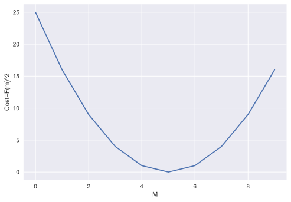
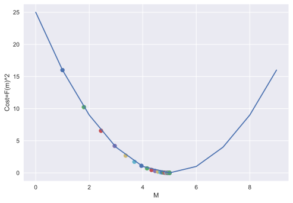

# Basic Linear Regression using Gradient Descent

- [Basic Linear Regression using Gradient Descent](#basic-linear-regression-using-gradient-descent)
  - [Gradient Descent Algorithm](#gradient-descent-algorithm)
  - [Prepare Data](#prepare-data)
  - [Gradient Descent Update Rule for Regression](#gradient-descent-update-rule-for-regression)

```python
"""
cd .\09linear_regression_i_gradientD\
jupyter nbconvert --to markdown lnrGD.ipynb --output README.md

"""
import numpy as np
import pandas as pd
import matplotlib.pyplot as plt

from IPython import display
display.set_matplotlib_formats('svg')

```

## Gradient Descent Algorithm


```python
M= np.arange(10)
Cost=(M-5)**2
print(Cost,M)
```

    [25 16  9  4  1  0  1  4  9 16] [0 1 2 3 4 5 6 7 8 9]


```python
plt.style.use("seaborn")
plt.plot(M, Cost)
plt.ylabel("Cost=F(m)^2")
plt.xlabel("M")
plt.show()
```





```python
# start with a random guess
m = 0
# learning rate
lr = 0.1
# repeat 50 times in the downhill direction
error = []
for i in range(50):
	# compute the slope
	slope = 2 * (m - 5)
	# update the guess
	m = m - lr * slope
	# plot the current guess
	error.append(m)

print(error[-10:])

```

    [4.999468308801686, 4.9995746470413485, 4.999659717633079, 4.9997277741064625, 4.99978221928517, 4.999825775428136, 4.999860620342509, 4.999888496274007, 4.999910797019206, 4.999928637615365]


We know `(m-5)^2=0` => `m=5` , that means we are approaching the minimum of the cost function.


```python
plt.plot(M,Cost)
plt.ylabel("Cost=F(m)^2")
plt.xlabel("M")
m = 0
lr = 0.1
error = []
for i in range(50):
	slope = 2 * (m - 5)
	m = m - lr * slope
	error.append(m)

	# cost at x=m
	cost = (m-5)**2
	plt.scatter(m, cost)

```





## Prepare Data


```python
data = pd.read_csv("weight-height.csv")
data.head()
```


<div>

<table border="1" class="dataframe">
  <thead>
    <tr style="text-align: right;">
      <th></th>
      <th>Gender</th>
      <th>Height</th>
      <th>Weight</th>
    </tr>
  </thead>
  <tbody>
    <tr>
      <th>0</th>
      <td>Male</td>
      <td>73.847017</td>
      <td>241.893563</td>
    </tr>
    <tr>
      <th>1</th>
      <td>Male</td>
      <td>68.781904</td>
      <td>162.310473</td>
    </tr>
    <tr>
      <th>2</th>
      <td>Male</td>
      <td>74.110105</td>
      <td>212.740856</td>
    </tr>
    <tr>
      <th>3</th>
      <td>Male</td>
      <td>71.730978</td>
      <td>220.042470</td>
    </tr>
    <tr>
      <th>4</th>
      <td>Male</td>
      <td>69.881796</td>
      <td>206.349801</td>
    </tr>
  </tbody>
</table>
</div>


```python
X = data.iloc[:, 1].values.reshape(-1, 1)
y = data.iloc[:, 2].values
print("Shape of X:", X.shape)
print("Shape of y:", y.shape)
print("Type of X:", type(X))
print("Type of y:", type(y))

```

    Shape of X: (10000, 1)
    Shape of y: (10000,)
    Type of X: <class 'numpy.ndarray'>
    Type of y: <class 'numpy.ndarray'>


## Gradient Descent Update Rule for Regression
