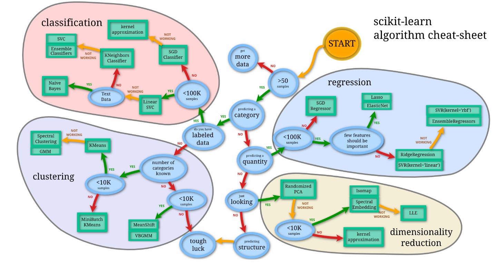
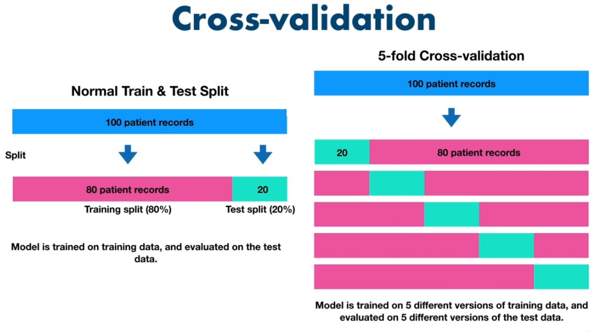
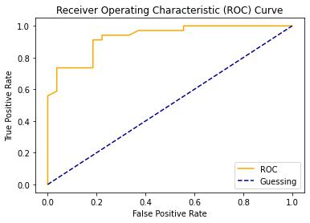
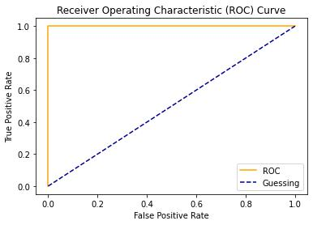

# Sklearn

- [Sklearn](#sklearn)
  - [Choosing the right Estimator](#choosing-the-right-estimator)
    - [Regression](#regression)
      - [Ensemble methods](#ensemble-methods)
    - [Classification](#classification)
      - [Ensemble methods for classification](#ensemble-methods-for-classification)
  - [Making Predictions](#making-predictions)
    - [With Classification Model](#with-classification-model)
      - [`predict()`](#predict)
      - [`predict_proba()`](#predict_proba)
    - [With Regression Model](#with-regression-model)
  - [Evaluation](#evaluation)
    - [`model.score(X_test, y_test)`](#modelscorex_test-y_test)
    - [cross validation with `cross_val_score()`](#cross-validation-with-cross_val_score)
    - [Problem Specific Metrics for Classification](#problem-specific-metrics-for-classification)
      - [Accuracy](#accuracy)
      - [Area Under the ROC Curve](#area-under-the-roc-curve)


```python
"""
cd .\100sklearn\
jupyter nbconvert --to markdown sklearn.ipynb --output README.md
"""
```


```python
import pandas as pd
import numpy as np
import matplotlib.pyplot as plt
import seaborn as sns

from matplotlib_inline.backend_inline import set_matplotlib_formats
set_matplotlib_formats('jpg')
```

## Choosing the right Estimator


- [https://scikit-learn.org/stable/tutorial/machine_learning_map/index.html](https://scikit-learn.org/stable/tutorial/machine_learning_map/index.html)

<div align="center">

</div>

### Regression


```python
# from sklearn.datasets import load_boston
# boston = load_boston()
# boston_df = pd.DataFrame(boston.data, columns=boston.feature_names)
# boston_df['target'] = boston.target
# boston_df.head()
# !FutureWarning: load_boston is deprecated; `load_boston` is deprecated in 1.0 and will be removed in 1.2.
```


```python
df = pd.read_csv("Boston.csv",index_col=0)
df.head()
```


<div>

<table border="1" class="dataframe">
  <thead>
    <tr style="text-align: right;">
      <th></th>
      <th>crim</th>
      <th>zn</th>
      <th>indus</th>
      <th>chas</th>
      <th>nox</th>
      <th>rm</th>
      <th>age</th>
      <th>dis</th>
      <th>rad</th>
      <th>tax</th>
      <th>ptratio</th>
      <th>black</th>
      <th>lstat</th>
      <th>medv</th>
    </tr>
  </thead>
  <tbody>
    <tr>
      <th>1</th>
      <td>0.00632</td>
      <td>18.0</td>
      <td>2.31</td>
      <td>0</td>
      <td>0.538</td>
      <td>6.575</td>
      <td>65.2</td>
      <td>4.0900</td>
      <td>1</td>
      <td>296</td>
      <td>15.3</td>
      <td>396.90</td>
      <td>4.98</td>
      <td>24.0</td>
    </tr>
    <tr>
      <th>2</th>
      <td>0.02731</td>
      <td>0.0</td>
      <td>7.07</td>
      <td>0</td>
      <td>0.469</td>
      <td>6.421</td>
      <td>78.9</td>
      <td>4.9671</td>
      <td>2</td>
      <td>242</td>
      <td>17.8</td>
      <td>396.90</td>
      <td>9.14</td>
      <td>21.6</td>
    </tr>
    <tr>
      <th>3</th>
      <td>0.02729</td>
      <td>0.0</td>
      <td>7.07</td>
      <td>0</td>
      <td>0.469</td>
      <td>7.185</td>
      <td>61.1</td>
      <td>4.9671</td>
      <td>2</td>
      <td>242</td>
      <td>17.8</td>
      <td>392.83</td>
      <td>4.03</td>
      <td>34.7</td>
    </tr>
    <tr>
      <th>4</th>
      <td>0.03237</td>
      <td>0.0</td>
      <td>2.18</td>
      <td>0</td>
      <td>0.458</td>
      <td>6.998</td>
      <td>45.8</td>
      <td>6.0622</td>
      <td>3</td>
      <td>222</td>
      <td>18.7</td>
      <td>394.63</td>
      <td>2.94</td>
      <td>33.4</td>
    </tr>
    <tr>
      <th>5</th>
      <td>0.06905</td>
      <td>0.0</td>
      <td>2.18</td>
      <td>0</td>
      <td>0.458</td>
      <td>7.147</td>
      <td>54.2</td>
      <td>6.0622</td>
      <td>3</td>
      <td>222</td>
      <td>18.7</td>
      <td>396.90</td>
      <td>5.33</td>
      <td>36.2</td>
    </tr>
  </tbody>
</table>
</div>


```python
df.shape
```


    (506, 14)


```python
from sklearn.model_selection import train_test_split
# let's try the ridge regression model
from sklearn.linear_model import Ridge
# random seed for reproducibility
np.random.seed(0)

# create the data
X = df.drop('medv', axis=1)
y = df['medv']

# split the data into train and test
X_train, X_test, y_train, y_test = train_test_split(X, y, test_size=0.2, random_state=0)
print(X_train.shape, X_test.shape, y_train.shape, y_test.shape)
# instantiate the model
model = Ridge()

# fit the model (taring the machine learning model)
model.fit(X_train, y_train)

# check the score on the test set (use the patterns the model has learned)
model.score(X_test, y_test)
```

    (404, 13) (102, 13) (404,) (102,)


    0.5796111714164921


 - How do we improve the model?
 - What if Ridge regression wasn't working?

#### Ensemble methods

The goal of ensemble methods is to combine the predictions of several base estimators built with a given learning algorithm in order to improve generalizability / robustness over a single estimator.

- [https://scikit-learn.org/stable/modules/ensemble.html](https://scikit-learn.org/stable/modules/ensemble.html)


```python
from sklearn.model_selection import train_test_split
# let try the random forest regressor
from sklearn.ensemble import RandomForestRegressor

# seed the random number generator
np.random.seed(0)

# create the data
X = df.drop('medv', axis=1)
y = df['medv']

# split the data into train and test
X_train, X_test, y_train, y_test = train_test_split(X, y, test_size=0.2, random_state=0)
print(X_train.shape, X_test.shape, y_train.shape, y_test.shape)

# instantiate and fit the model
model = RandomForestRegressor(n_estimators=100)
model.fit(X_train, y_train)

# check the score on the test set
model.score(X_test, y_test)
```

    (404, 13) (102, 13) (404,) (102,)


    0.7734908201180223


### Classification


```python
df = pd.read_csv("heart-disease.csv")
df.head()
```


<div>

<table border="1" class="dataframe">
  <thead>
    <tr style="text-align: right;">
      <th></th>
      <th>age</th>
      <th>sex</th>
      <th>cp</th>
      <th>trestbps</th>
      <th>chol</th>
      <th>fbs</th>
      <th>restecg</th>
      <th>thalach</th>
      <th>exang</th>
      <th>oldpeak</th>
      <th>slope</th>
      <th>ca</th>
      <th>thal</th>
      <th>target</th>
    </tr>
  </thead>
  <tbody>
    <tr>
      <th>0</th>
      <td>63</td>
      <td>1</td>
      <td>3</td>
      <td>145</td>
      <td>233</td>
      <td>1</td>
      <td>0</td>
      <td>150</td>
      <td>0</td>
      <td>2.3</td>
      <td>0</td>
      <td>0</td>
      <td>1</td>
      <td>1</td>
    </tr>
    <tr>
      <th>1</th>
      <td>37</td>
      <td>1</td>
      <td>2</td>
      <td>130</td>
      <td>250</td>
      <td>0</td>
      <td>1</td>
      <td>187</td>
      <td>0</td>
      <td>3.5</td>
      <td>0</td>
      <td>0</td>
      <td>2</td>
      <td>1</td>
    </tr>
    <tr>
      <th>2</th>
      <td>41</td>
      <td>0</td>
      <td>1</td>
      <td>130</td>
      <td>204</td>
      <td>0</td>
      <td>0</td>
      <td>172</td>
      <td>0</td>
      <td>1.4</td>
      <td>2</td>
      <td>0</td>
      <td>2</td>
      <td>1</td>
    </tr>
    <tr>
      <th>3</th>
      <td>56</td>
      <td>1</td>
      <td>1</td>
      <td>120</td>
      <td>236</td>
      <td>0</td>
      <td>1</td>
      <td>178</td>
      <td>0</td>
      <td>0.8</td>
      <td>2</td>
      <td>0</td>
      <td>2</td>
      <td>1</td>
    </tr>
    <tr>
      <th>4</th>
      <td>57</td>
      <td>0</td>
      <td>0</td>
      <td>120</td>
      <td>354</td>
      <td>0</td>
      <td>1</td>
      <td>163</td>
      <td>1</td>
      <td>0.6</td>
      <td>2</td>
      <td>0</td>
      <td>2</td>
      <td>1</td>
    </tr>
  </tbody>
</table>
</div>


Consulting the estimator map above, let's try `LinearSVC`


```python
from sklearn.model_selection import train_test_split

from sklearn.svm import LinearSVC

# seed the random number generator
np.random.seed(0)

# create the data
X = df.drop('target', axis=1)
y = df['target']

# split the data into train and test
X_train, X_test, y_train, y_test = train_test_split(X, y, test_size=0.2, random_state=0)
print(X_train.shape, X_test.shape, y_train.shape, y_test.shape)

# instantiate the model
model = LinearSVC()
model.fit(X_train, y_train)

# check the score on the test set
model.score(X_test, y_test)
```

    (242, 13) (61, 13) (242,) (61,)


    c:\Users\soiko\anaconda3\lib\site-packages\sklearn\svm\_base.py:1206: ConvergenceWarning: Liblinear failed to converge, increase the number of iterations.
      warnings.warn(


    0.45901639344262296


#### Ensemble methods for classification


```python
from sklearn.model_selection import train_test_split
from sklearn.ensemble import RandomForestClassifier

# seed the random number generator
np.random.seed(0)

# create the data
X = df.drop('target', axis=1)
y = df['target']

# split the data into train and test
X_train, X_test, y_train, y_test = train_test_split(X, y, test_size=0.2, random_state=0)
print(X_train.shape, X_test.shape, y_train.shape, y_test.shape)

# instantiate the model
model = RandomForestClassifier()
model.fit(X_train, y_train)

# check the score on the test set
model.score(X_test, y_test)
```

    (242, 13) (61, 13) (242,) (61,)


    0.8852459016393442


Titbit:

- If you have structured data, use `ensemble` methods
- If you have unstructured data, use `deep learning` or `transfer learning`

## Making Predictions

### With Classification Model

Using
- `predict()`
- `predict_proba()`


```python
from sklearn.model_selection import train_test_split
from sklearn.ensemble import RandomForestClassifier
df = pd.read_csv("heart-disease.csv")
np.random.seed(0)

X = df.drop('target', axis=1)
y = df['target']

X_train, X_test, y_train, y_test = train_test_split(X, y, test_size=0.2, random_state=0)
print(X_train.shape, X_test.shape, y_train.shape, y_test.shape)

# instantiate the model
clf = RandomForestClassifier()
clf.fit(X_train, y_train)

# check the score on the test set
clf.score(X_test, y_test)
```

    (242, 13) (61, 13) (242,) (61,)


    0.8852459016393442


#### `predict()`


```python
# get prediction:
clf.predict(X_test)

```


    array([0, 0, 0, 0, 0, 1, 0, 0, 0, 0, 1, 1, 0, 1, 1, 1, 0, 1, 0, 1, 1, 0,
           0, 0, 1, 0, 0, 0, 1, 1, 1, 0, 1, 1, 1, 0, 0, 1, 0, 0, 1, 1, 1, 0,
           0, 1, 1, 0, 0, 1, 1, 1, 1, 1, 1, 0, 1, 1, 1, 1, 1], dtype=int64)


```python
# original label
np.array(y_test)
```


    array([0, 1, 0, 0, 1, 0, 0, 0, 0, 0, 1, 1, 0, 1, 1, 1, 1, 1, 0, 1, 1, 0,
           0, 0, 1, 0, 0, 0, 1, 1, 0, 0, 1, 1, 1, 0, 0, 1, 0, 0, 1, 1, 1, 0,
           1, 1, 1, 0, 0, 1, 1, 1, 1, 1, 1, 0, 1, 0, 1, 1, 1], dtype=int64)


```python
# compare the prediction with the truth label to evaluate the model
y_preds = clf.predict(X_test)
np.mean(y_preds == y_test)
```


    0.8852459016393442


using `accuracy_score(y_test, y_preds)`:


```python
from sklearn.metrics import accuracy_score
accuracy_score(y_test, y_preds)
```


    0.8852459016393442


which is same as the `score(X_test, y_test)` method in scikit-learn


```python
# ~
clf.score(X_test, y_test)

```


    0.8852459016393442


#### `predict_proba()`


```python
# return probabilities of a classification model
clf.predict_proba(X_test[:5])

```


    array([[0.9 , 0.1 ],
           [0.56, 0.44],
           [0.5 , 0.5 ],
           [1.  , 0.  ],
           [0.88, 0.12]])


### With Regression Model


```python
df = pd.read_csv("Boston.csv",index_col=0)
from sklearn.model_selection import train_test_split
from sklearn.ensemble import RandomForestRegressor
np.random.seed(0)
X = df.drop('medv', axis=1)
y = df['medv']

X_train, X_test, y_train, y_test = train_test_split(X, y, test_size=0.2, random_state=0)
print(X_train.shape, X_test.shape, y_train.shape, y_test.shape)

model = RandomForestRegressor(n_estimators=100)
model.fit(X_train, y_train)
model.score(X_test, y_test)
```

    (404, 13) (102, 13) (404,) (102,)


    0.7734908201180223


```python
y_preds = model.predict(X_test)
y_preds[:5]
```


    array([23.932, 29.111, 22.14 , 11.006, 20.543])


```python
np.array(y_test[:5])

```


    array([22.6, 50. , 23. ,  8.3, 21.2])


```python
# compare the prediction with the truth label to evaluate the model
y_preds = model.predict(X_test)
np.mean(y_preds == y_test)
# ?????
```


    0.0


```python
from sklearn.metrics import mean_absolute_error
mean_absolute_error(y_test, y_preds)
```


    2.6503039215686295


## Evaluation

- [https://scikit-learn.org/stable/modules/model_evaluation.html](https://scikit-learn.org/stable/modules/model_evaluation.html)

There are 3 different APIs for evaluating the quality of a model’s predictions:

- Estimator `score()` method
- The `scoring` parameter;  `cross-validation`
- Problem Specific Metric functions

### `model.score(X_test, y_test)`


```python
from sklearn.model_selection import train_test_split
from sklearn.ensemble import RandomForestClassifier
df = pd.read_csv("heart-disease.csv")
np.random.seed(0)

X = df.drop('target', axis=1)
y = df['target']

X_train, X_test, y_train, y_test = train_test_split(
    X, y, test_size=0.2, random_state=0)
print(X_train.shape, X_test.shape, y_train.shape, y_test.shape)

# instantiate the model
clf = RandomForestClassifier()
clf.fit(X_train, y_train)


```

    (242, 13) (61, 13) (242,) (61,)


    RandomForestClassifier()


```python
# check the score on the test set
clf.score(X_test, y_test)
```


    0.8852459016393442


```python
df = pd.read_csv("Boston.csv",index_col=0)
from sklearn.model_selection import train_test_split
from sklearn.ensemble import RandomForestRegressor
np.random.seed(0)
X = df.drop('medv', axis=1)
y = df['medv']

X_train, X_test, y_train, y_test = train_test_split(X, y, test_size=0.2, random_state=0)
print(X_train.shape, X_test.shape, y_train.shape, y_test.shape)

regr = RandomForestRegressor(n_estimators=100)
regr.fit(X_train, y_train)

```

    (404, 13) (102, 13) (404,) (102,)


    RandomForestRegressor()


```python
regr.score(X_test, y_test)
```


    0.7734908201180223


### cross validation with `cross_val_score()`

<div align="center">

</div>


```python
from sklearn.model_selection import train_test_split
from sklearn.ensemble import RandomForestClassifier
df = pd.read_csv("heart-disease.csv")
np.random.seed(0)

X = df.drop('target', axis=1)
y = df['target']

X_train, X_test, y_train, y_test = train_test_split(
    X, y, test_size=0.2, random_state=0)
print(X_train.shape, X_test.shape, y_train.shape, y_test.shape)

# instantiate the model
clf = RandomForestClassifier(n_estimators=100)
clf.fit(X_train, y_train)
clf.score(X_test, y_test)
```

    (242, 13) (61, 13) (242,) (61,)


    0.8852459016393442


```python
from sklearn.model_selection import cross_val_score
```


```python
cross_val_score(clf, X, y, cv=10)
```


    array([0.87096774, 0.80645161, 0.83870968, 0.9       , 0.86666667,
           0.76666667, 0.73333333, 0.9       , 0.73333333, 0.8       ])


```python
np.random.seed(0)

# single training and test split score
clf_single_score = clf.score(X_test, y_test)

# take the mean of 10-fold cross validation score
clf_cross_val_score = np.mean(cross_val_score(clf, X, y, cv=10))

# compare the two scores
print(clf_single_score, clf_cross_val_score)
```

    0.8852459016393442 0.8347311827956989


### Problem Specific Metrics for Classification

 - Accuracy
 - Area Under the ROC Curve
 - Confusion Matrix
 - Classification Report

#### Accuracy


```python
from sklearn.model_selection import train_test_split
from sklearn.ensemble import RandomForestClassifier
df = pd.read_csv("heart-disease.csv")
np.random.seed(0)
X = df.drop('target', axis=1)
y = df['target']

X_train, X_test, y_train, y_test = train_test_split(
    X, y, test_size=0.2, random_state=0)
print(X_train.shape, X_test.shape, y_train.shape, y_test.shape)
clf = RandomForestClassifier(n_estimators=100)

```

    (242, 13) (61, 13) (242,) (61,)


```python
cross_val_score = cross_val_score(clf, X, y, cv=10)
```


```python
np.mean(cross_val_score)
```


    0.8347311827956989


```python
print(f"Heart disease Cross-Validated Accuracy: {np.mean(cross_val_score) * 100:.2f}%")
```

    Heart disease Cross-Validated Accuracy: 83.47%


#### Area Under the ROC Curve

**Area Under the receiver operating characteristic curve (ROC/AUC)**

- Area under the cure(AUC)
- ROC curve

ROC curve are a comparison of the true positive rate (TPR) versus a models false positive rate (FPR).

- `True positive`  = model predicts `1` and truth is `1`
- `False positive` = model predicts `1` and truth is `0`
- `True negative`  = model predicts `0` and truth is `0`
- `False negative` = model predicts `0` and truth is `1`


```python
from sklearn.model_selection import train_test_split
from sklearn.ensemble import RandomForestClassifier
df = pd.read_csv("heart-disease.csv")
np.random.seed(0)
X = df.drop('target', axis=1)
y = df['target']

X_train, X_test, y_train, y_test = train_test_split(
    X, y, test_size=0.2, random_state=0)
print(X_train.shape, X_test.shape, y_train.shape, y_test.shape)
clf = RandomForestClassifier(n_estimators=100)

```

    (242, 13) (61, 13) (242,) (61,)


```python
from sklearn.metrics import roc_curve

# fit
clf.fit(X_train, y_train)

# make predictions with probabilities
y_probs = clf.predict_proba(X_test)
y_probs[:5]
```


    array([[0.86, 0.14],
           [0.46, 0.54],
           [0.4 , 0.6 ],
           [1.  , 0.  ],
           [0.84, 0.16]])


```python
y_probs_positive  = y_probs[:, 1]
y_probs_positive[:5]
```


    array([0.14, 0.54, 0.6 , 0.  , 0.16])


```python
# calculate fpr,tp,thresholds
fpr, tpr, thresholds = roc_curve(y_test, y_probs_positive)
fpr
```


    array([0.        , 0.        , 0.        , 0.        , 0.        ,
           0.        , 0.        , 0.        , 0.        , 0.        ,
           0.03703704, 0.03703704, 0.03703704, 0.14814815, 0.18518519,
           0.18518519, 0.18518519, 0.18518519, 0.22222222, 0.22222222,
           0.33333333, 0.37037037, 0.55555556, 0.55555556, 0.7037037 ,
           0.81481481, 0.88888889, 1.        ])


```python
def plot_roc_curve(fpr,tpr):
	"""
	Plots a ROC curve given the false positive rate and true positive rate.
	"""
	plt.plot(fpr, tpr, color='orange', label='ROC')
	plt.plot([0, 1], [0, 1], color='darkblue', linestyle='--', label='Guessing')
	# customise the plot
	plt.xlabel('False Positive Rate')
	plt.ylabel('True Positive Rate')
	plt.title('Receiver Operating Characteristic (ROC) Curve')
	plt.legend()
	plt.show()

plot_roc_curve(fpr,tpr)
```





```python
# how a perfect ROC curve looks like?
ftr , tpr, thresholds = roc_curve(y_test, y_test)
plot_roc_curve(ftr,tpr)
```





```python
from sklearn.metrics import roc_auc_score

roc_auc_score(y_test, y_probs_positive)

```


    0.9281045751633987


```python
# ho
```


