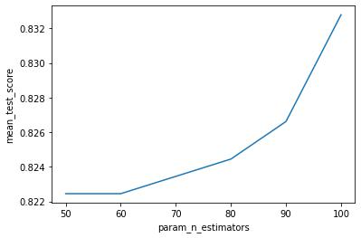
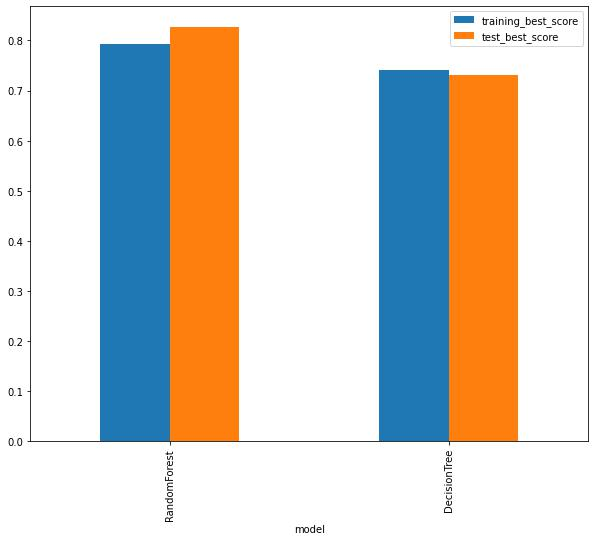
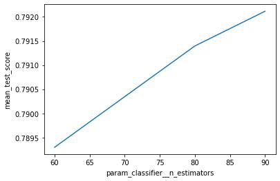

# Sklearn

- [Sklearn](#sklearn)
  - [Choosing the right Estimator](#choosing-the-right-estimator)
    - [Regression](#regression)
      - [Ensemble methods](#ensemble-methods)
    - [Classification](#classification)
      - [Ensemble methods for classification](#ensemble-methods-for-classification)
  - [Making Predictions](#making-predictions)
    - [With Classification Model](#with-classification-model)
      - [`predict()`](#predict)
      - [`predict_proba()`](#predict_proba)
    - [With Regression Model](#with-regression-model)
  - [Evaluation](#evaluation)
    - [`model.score(X_test, y_test)`](#modelscorex_test-y_test)
    - [cross validation with `cross_val_score()`](#cross-validation-with-cross_val_score)
    - [Problem Specific Metrics for Classification](#problem-specific-metrics-for-classification)
      - [Accuracy](#accuracy)
      - [Area Under the ROC Curve](#area-under-the-roc-curve)
  - [🔥Grid Search](#grid-search)
  - [Putting All Together: PipeLine + GridSearchCV](#putting-all-together-pipeline--gridsearchcv)
    - [🥈V1: Pipelining with Single Estimator](#v1-pipelining-with-single-estimator)
      - [1. EDA](#1-eda)
      - [2. Define numerical and categorical features.](#2-define-numerical-and-categorical-features)
      - [3. PipeLine 1: For categorical features: fill missing values then label encode](#3-pipeline-1-for-categorical-features-fill-missing-values-then-label-encode)
      - [4. PipeLine 2: For numerical features: fill missing values then feature scale](#4-pipeline-2-for-numerical-features-fill-missing-values-then-feature-scale)
      - [5. Combine numerical and categorical transformer using `ColumnTransformer`.](#5-combine-numerical-and-categorical-transformer-using-columntransformer)
      - [6. (optional) Apply PCA to reduce dimensions.](#6-optional-apply-pca-to-reduce-dimensions)
      - [7. Final Pipeline With an Estimator](#7-final-pipeline-with-an-estimator)
      - [Visualizing Pipeline](#visualizing-pipeline)
      - [🚀All In One](#all-in-one)
    - [🥈V2: Pipelining + GridSearchCV (Single Model Hyperparameter Tuning)](#v2-pipelining--gridsearchcv-single-model-hyperparameter-tuning)
    - [🥇V3: Pipelining + GridSearchCV (Multi Models Hyperparameter Tuning) 🔥](#v3-pipelining--gridsearchcv-multi-models-hyperparameter-tuning-)
  - [GridSearch: Clustering](#gridsearch-clustering)
  - [Resource](#resource)


```python
"""
cd .\100sklearn\
jupyter nbconvert --to markdown sklearn.ipynb --output README.md
"""
```


```python
import pandas as pd
import numpy as np
import matplotlib.pyplot as plt
import seaborn as sns

from matplotlib_inline.backend_inline import set_matplotlib_formats
set_matplotlib_formats('jpg')
```

## Choosing the right Estimator


- [https://scikit-learn.org/stable/tutorial/machine_learning_map/index.html](https://scikit-learn.org/stable/tutorial/machine_learning_map/index.html)

<div align="center">

</div>

### Regression


```python
# from sklearn.datasets import load_boston
# boston = load_boston()
# boston_df = pd.DataFrame(boston.data, columns=boston.feature_names)
# boston_df['target'] = boston.target
# boston_df.head()
# !FutureWarning: load_boston is deprecated; `load_boston` is deprecated in 1.0 and will be removed in 1.2.
```


```python
df = pd.read_csv("Boston.csv",index_col=0)
df.head()
```


<div>

<table border="1" class="dataframe">
  <thead>
    <tr style="text-align: right;">
      <th></th>
      <th>crim</th>
      <th>zn</th>
      <th>indus</th>
      <th>chas</th>
      <th>nox</th>
      <th>rm</th>
      <th>age</th>
      <th>dis</th>
      <th>rad</th>
      <th>tax</th>
      <th>ptratio</th>
      <th>black</th>
      <th>lstat</th>
      <th>medv</th>
    </tr>
  </thead>
  <tbody>
    <tr>
      <th>1</th>
      <td>0.00632</td>
      <td>18.0</td>
      <td>2.31</td>
      <td>0</td>
      <td>0.538</td>
      <td>6.575</td>
      <td>65.2</td>
      <td>4.0900</td>
      <td>1</td>
      <td>296</td>
      <td>15.3</td>
      <td>396.90</td>
      <td>4.98</td>
      <td>24.0</td>
    </tr>
    <tr>
      <th>2</th>
      <td>0.02731</td>
      <td>0.0</td>
      <td>7.07</td>
      <td>0</td>
      <td>0.469</td>
      <td>6.421</td>
      <td>78.9</td>
      <td>4.9671</td>
      <td>2</td>
      <td>242</td>
      <td>17.8</td>
      <td>396.90</td>
      <td>9.14</td>
      <td>21.6</td>
    </tr>
    <tr>
      <th>3</th>
      <td>0.02729</td>
      <td>0.0</td>
      <td>7.07</td>
      <td>0</td>
      <td>0.469</td>
      <td>7.185</td>
      <td>61.1</td>
      <td>4.9671</td>
      <td>2</td>
      <td>242</td>
      <td>17.8</td>
      <td>392.83</td>
      <td>4.03</td>
      <td>34.7</td>
    </tr>
    <tr>
      <th>4</th>
      <td>0.03237</td>
      <td>0.0</td>
      <td>2.18</td>
      <td>0</td>
      <td>0.458</td>
      <td>6.998</td>
      <td>45.8</td>
      <td>6.0622</td>
      <td>3</td>
      <td>222</td>
      <td>18.7</td>
      <td>394.63</td>
      <td>2.94</td>
      <td>33.4</td>
    </tr>
    <tr>
      <th>5</th>
      <td>0.06905</td>
      <td>0.0</td>
      <td>2.18</td>
      <td>0</td>
      <td>0.458</td>
      <td>7.147</td>
      <td>54.2</td>
      <td>6.0622</td>
      <td>3</td>
      <td>222</td>
      <td>18.7</td>
      <td>396.90</td>
      <td>5.33</td>
      <td>36.2</td>
    </tr>
  </tbody>
</table>
</div>


```python
df.shape
```


    (506, 14)


```python
from sklearn.model_selection import train_test_split
# let's try the ridge regression model
from sklearn.linear_model import Ridge
# random seed for reproducibility
np.random.seed(0)

# create the data
X = df.drop('medv', axis=1)
y = df['medv']

# split the data into train and test
X_train, X_test, y_train, y_test = train_test_split(X, y, test_size=0.2, random_state=0)
print(X_train.shape, X_test.shape, y_train.shape, y_test.shape)
# instantiate the model
model = Ridge()

# fit the model (taring the machine learning model)
model.fit(X_train, y_train)

# check the score on the test set (use the patterns the model has learned)
model.score(X_test, y_test)
```

    (404, 13) (102, 13) (404,) (102,)


    0.5796111714164921


 - How do we improve the model?
 - What if Ridge regression wasn't working?

#### Ensemble methods

The goal of ensemble methods is to combine the predictions of several base estimators built with a given learning algorithm in order to improve generalizability / robustness over a single estimator.

- [https://scikit-learn.org/stable/modules/ensemble.html](https://scikit-learn.org/stable/modules/ensemble.html)


```python
from sklearn.model_selection import train_test_split
# let try the random forest regressor
from sklearn.ensemble import RandomForestRegressor

# seed the random number generator
np.random.seed(0)

# create the data
X = df.drop('medv', axis=1)
y = df['medv']

# split the data into train and test
X_train, X_test, y_train, y_test = train_test_split(X, y, test_size=0.2, random_state=0)
print(X_train.shape, X_test.shape, y_train.shape, y_test.shape)

# instantiate and fit the model
model = RandomForestRegressor(n_estimators=100)
model.fit(X_train, y_train)

# check the score on the test set
model.score(X_test, y_test)
```

    (404, 13) (102, 13) (404,) (102,)


    0.7734908201180223


### Classification


```python
df = pd.read_csv("heart-disease.csv")
df.head()
```


<div>

<table border="1" class="dataframe">
  <thead>
    <tr style="text-align: right;">
      <th></th>
      <th>age</th>
      <th>sex</th>
      <th>cp</th>
      <th>trestbps</th>
      <th>chol</th>
      <th>fbs</th>
      <th>restecg</th>
      <th>thalach</th>
      <th>exang</th>
      <th>oldpeak</th>
      <th>slope</th>
      <th>ca</th>
      <th>thal</th>
      <th>target</th>
    </tr>
  </thead>
  <tbody>
    <tr>
      <th>0</th>
      <td>63</td>
      <td>1</td>
      <td>3</td>
      <td>145</td>
      <td>233</td>
      <td>1</td>
      <td>0</td>
      <td>150</td>
      <td>0</td>
      <td>2.3</td>
      <td>0</td>
      <td>0</td>
      <td>1</td>
      <td>1</td>
    </tr>
    <tr>
      <th>1</th>
      <td>37</td>
      <td>1</td>
      <td>2</td>
      <td>130</td>
      <td>250</td>
      <td>0</td>
      <td>1</td>
      <td>187</td>
      <td>0</td>
      <td>3.5</td>
      <td>0</td>
      <td>0</td>
      <td>2</td>
      <td>1</td>
    </tr>
    <tr>
      <th>2</th>
      <td>41</td>
      <td>0</td>
      <td>1</td>
      <td>130</td>
      <td>204</td>
      <td>0</td>
      <td>0</td>
      <td>172</td>
      <td>0</td>
      <td>1.4</td>
      <td>2</td>
      <td>0</td>
      <td>2</td>
      <td>1</td>
    </tr>
    <tr>
      <th>3</th>
      <td>56</td>
      <td>1</td>
      <td>1</td>
      <td>120</td>
      <td>236</td>
      <td>0</td>
      <td>1</td>
      <td>178</td>
      <td>0</td>
      <td>0.8</td>
      <td>2</td>
      <td>0</td>
      <td>2</td>
      <td>1</td>
    </tr>
    <tr>
      <th>4</th>
      <td>57</td>
      <td>0</td>
      <td>0</td>
      <td>120</td>
      <td>354</td>
      <td>0</td>
      <td>1</td>
      <td>163</td>
      <td>1</td>
      <td>0.6</td>
      <td>2</td>
      <td>0</td>
      <td>2</td>
      <td>1</td>
    </tr>
  </tbody>
</table>
</div>


Consulting the estimator map above, let's try `LinearSVC`


```python
from sklearn.model_selection import train_test_split

from sklearn.svm import LinearSVC

# seed the random number generator
np.random.seed(0)

# create the data
X = df.drop('target', axis=1)
y = df['target']

# split the data into train and test
X_train, X_test, y_train, y_test = train_test_split(X, y, test_size=0.2, random_state=0)
print(X_train.shape, X_test.shape, y_train.shape, y_test.shape)

# instantiate the model
model = LinearSVC()
model.fit(X_train, y_train)

# check the score on the test set
model.score(X_test, y_test)
```

    (242, 13) (61, 13) (242,) (61,)


    c:\Users\soiko\anaconda3\lib\site-packages\sklearn\svm\_base.py:1206: ConvergenceWarning: Liblinear failed to converge, increase the number of iterations.
      warnings.warn(


    0.45901639344262296


#### Ensemble methods for classification


```python
from sklearn.model_selection import train_test_split
from sklearn.ensemble import RandomForestClassifier

# seed the random number generator
np.random.seed(0)

# create the data
X = df.drop('target', axis=1)
y = df['target']

# split the data into train and test
X_train, X_test, y_train, y_test = train_test_split(X, y, test_size=0.2, random_state=0)
print(X_train.shape, X_test.shape, y_train.shape, y_test.shape)

# instantiate the model
model = RandomForestClassifier()
model.fit(X_train, y_train)

# check the score on the test set
model.score(X_test, y_test)
```

    (242, 13) (61, 13) (242,) (61,)


    0.8852459016393442


Titbit:

- If you have structured data, use `ensemble` methods
- If you have unstructured data, use `deep learning` or `transfer learning`

## Making Predictions

### With Classification Model

Using
- `predict()`
- `predict_proba()`


```python
from sklearn.model_selection import train_test_split
from sklearn.ensemble import RandomForestClassifier
df = pd.read_csv("heart-disease.csv")
np.random.seed(0)

X = df.drop('target', axis=1)
y = df['target']

X_train, X_test, y_train, y_test = train_test_split(X, y, test_size=0.2, random_state=0)
print(X_train.shape, X_test.shape, y_train.shape, y_test.shape)

# instantiate the model
clf = RandomForestClassifier()
clf.fit(X_train, y_train)

# check the score on the test set
clf.score(X_test, y_test)
```

    (242, 13) (61, 13) (242,) (61,)


    0.8852459016393442


#### `predict()`


```python
# get prediction:
clf.predict(X_test)

```


    array([0, 0, 0, 0, 0, 1, 0, 0, 0, 0, 1, 1, 0, 1, 1, 1, 0, 1, 0, 1, 1, 0,
           0, 0, 1, 0, 0, 0, 1, 1, 1, 0, 1, 1, 1, 0, 0, 1, 0, 0, 1, 1, 1, 0,
           0, 1, 1, 0, 0, 1, 1, 1, 1, 1, 1, 0, 1, 1, 1, 1, 1], dtype=int64)


```python
# original label
np.array(y_test)
```


    array([0, 1, 0, 0, 1, 0, 0, 0, 0, 0, 1, 1, 0, 1, 1, 1, 1, 1, 0, 1, 1, 0,
           0, 0, 1, 0, 0, 0, 1, 1, 0, 0, 1, 1, 1, 0, 0, 1, 0, 0, 1, 1, 1, 0,
           1, 1, 1, 0, 0, 1, 1, 1, 1, 1, 1, 0, 1, 0, 1, 1, 1], dtype=int64)


```python
# compare the prediction with the truth label to evaluate the model
y_preds = clf.predict(X_test)
np.mean(y_preds == y_test)
```


    0.8852459016393442


using `accuracy_score(y_test, y_preds)`:


```python
from sklearn.metrics import accuracy_score
accuracy_score(y_test, y_preds)
```


    0.8852459016393442


which is same as the `score(X_test, y_test)` method in scikit-learn


```python
# ~
clf.score(X_test, y_test)

```


    0.8852459016393442


#### `predict_proba()`


```python
# return probabilities of a classification model
clf.predict_proba(X_test[:5])

```


    array([[0.9 , 0.1 ],
           [0.56, 0.44],
           [0.5 , 0.5 ],
           [1.  , 0.  ],
           [0.88, 0.12]])


### With Regression Model


```python
df = pd.read_csv("Boston.csv",index_col=0)
from sklearn.model_selection import train_test_split
from sklearn.ensemble import RandomForestRegressor
np.random.seed(0)
X = df.drop('medv', axis=1)
y = df['medv']

X_train, X_test, y_train, y_test = train_test_split(X, y, test_size=0.2, random_state=0)
print(X_train.shape, X_test.shape, y_train.shape, y_test.shape)

model = RandomForestRegressor(n_estimators=100)
model.fit(X_train, y_train)
model.score(X_test, y_test)
```

    (404, 13) (102, 13) (404,) (102,)


    0.7734908201180223


```python
y_preds = model.predict(X_test)
y_preds[:5]
```


    array([23.932, 29.111, 22.14 , 11.006, 20.543])


```python
np.array(y_test[:5])

```


    array([22.6, 50. , 23. ,  8.3, 21.2])


```python
# compare the prediction with the truth label to evaluate the model
y_preds = model.predict(X_test)
np.mean(y_preds == y_test)
# ?????
```


    0.0


```python
from sklearn.metrics import mean_absolute_error
mean_absolute_error(y_test, y_preds)
```


    2.6503039215686295


## Evaluation

- [https://scikit-learn.org/stable/modules/model_evaluation.html](https://scikit-learn.org/stable/modules/model_evaluation.html)

There are 3 different APIs for evaluating the quality of a model’s predictions:

- Estimator `score()` method
- The `scoring` parameter;  `cross-validation`
- Problem Specific Metric functions

### `model.score(X_test, y_test)`


```python
from sklearn.model_selection import train_test_split
from sklearn.ensemble import RandomForestClassifier
df = pd.read_csv("heart-disease.csv")
np.random.seed(0)

X = df.drop('target', axis=1)
y = df['target']

X_train, X_test, y_train, y_test = train_test_split(
    X, y, test_size=0.2, random_state=0)
print(X_train.shape, X_test.shape, y_train.shape, y_test.shape)

# instantiate the model
clf = RandomForestClassifier()
clf.fit(X_train, y_train)


```

    (242, 13) (61, 13) (242,) (61,)


    RandomForestClassifier()


```python
# check the score on the test set
clf.score(X_test, y_test)
```


    0.8852459016393442


```python
df = pd.read_csv("Boston.csv",index_col=0)
from sklearn.model_selection import train_test_split
from sklearn.ensemble import RandomForestRegressor
np.random.seed(0)
X = df.drop('medv', axis=1)
y = df['medv']

X_train, X_test, y_train, y_test = train_test_split(X, y, test_size=0.2, random_state=0)
print(X_train.shape, X_test.shape, y_train.shape, y_test.shape)

regr = RandomForestRegressor(n_estimators=100)
regr.fit(X_train, y_train)

```

    (404, 13) (102, 13) (404,) (102,)


    RandomForestRegressor()


```python
regr.score(X_test, y_test)
```


    0.7734908201180223


### cross validation with `cross_val_score()`

<div align="center">

</div>


```python
from sklearn.model_selection import train_test_split
from sklearn.ensemble import RandomForestClassifier
df = pd.read_csv("heart-disease.csv")
np.random.seed(0)

X = df.drop('target', axis=1)
y = df['target']

X_train, X_test, y_train, y_test = train_test_split(
    X, y, test_size=0.2, random_state=0)
print(X_train.shape, X_test.shape, y_train.shape, y_test.shape)

# instantiate the model
clf = RandomForestClassifier(n_estimators=100)
clf.fit(X_train, y_train)
clf.score(X_test, y_test)
```

    (242, 13) (61, 13) (242,) (61,)


    0.8852459016393442


```python
from sklearn.model_selection import cross_val_score
```


```python
cross_val_score(clf, X, y, cv=10)
```


    array([0.87096774, 0.80645161, 0.83870968, 0.9       , 0.86666667,
           0.76666667, 0.73333333, 0.9       , 0.73333333, 0.8       ])


```python
np.random.seed(0)

# single training and test split score
clf_single_score = clf.score(X_test, y_test)

# take the mean of 10-fold cross validation score
clf_cross_val_score = np.mean(cross_val_score(clf, X, y, cv=10))

# compare the two scores
print(clf_single_score, clf_cross_val_score)
```

    0.8852459016393442 0.8347311827956989


### Problem Specific Metrics for Classification

 - Accuracy
 - Area Under the ROC Curve
 - Confusion Matrix
 - Classification Report

#### Accuracy


```python
from sklearn.model_selection import train_test_split
from sklearn.ensemble import RandomForestClassifier
df = pd.read_csv("heart-disease.csv")
np.random.seed(0)
X = df.drop('target', axis=1)
y = df['target']

X_train, X_test, y_train, y_test = train_test_split(
    X, y, test_size=0.2, random_state=0)
print(X_train.shape, X_test.shape, y_train.shape, y_test.shape)
clf = RandomForestClassifier(n_estimators=100)

```

    (242, 13) (61, 13) (242,) (61,)


```python
cross_val_score = cross_val_score(clf, X, y, cv=10)
```


```python
np.mean(cross_val_score)
```


    0.8347311827956989


```python
print(f"Heart disease Cross-Validated Accuracy: {np.mean(cross_val_score) * 100:.2f}%")
```

    Heart disease Cross-Validated Accuracy: 83.47%


#### Area Under the ROC Curve

**Area Under the receiver operating characteristic curve (ROC/AUC)**

- Area under the cure(AUC)
- ROC curve

ROC curve are a comparison of the true positive rate (TPR) versus a models false positive rate (FPR).

- `True positive`  = model predicts `1` and truth is `1`
- `False positive` = model predicts `1` and truth is `0`
- `True negative`  = model predicts `0` and truth is `0`
- `False negative` = model predicts `0` and truth is `1`


```python
from sklearn.model_selection import train_test_split
from sklearn.ensemble import RandomForestClassifier
df = pd.read_csv("heart-disease.csv")
np.random.seed(0)
X = df.drop('target', axis=1)
y = df['target']

X_train, X_test, y_train, y_test = train_test_split(
    X, y, test_size=0.2, random_state=0)
print(X_train.shape, X_test.shape, y_train.shape, y_test.shape)
clf = RandomForestClassifier(n_estimators=100)

```

    (242, 13) (61, 13) (242,) (61,)


```python
from sklearn.metrics import roc_curve

# fit
clf.fit(X_train, y_train)

# make predictions with probabilities
y_probs = clf.predict_proba(X_test)
y_probs[:5]
```


    array([[0.86, 0.14],
           [0.46, 0.54],
           [0.4 , 0.6 ],
           [1.  , 0.  ],
           [0.84, 0.16]])


```python
y_probs_positive  = y_probs[:, 1]
y_probs_positive[:5]
```


    array([0.14, 0.54, 0.6 , 0.  , 0.16])


```python
# calculate fpr,tp,thresholds
fpr, tpr, thresholds = roc_curve(y_test, y_probs_positive)
fpr
```


    array([0.        , 0.        , 0.        , 0.        , 0.        ,
           0.        , 0.        , 0.        , 0.        , 0.        ,
           0.03703704, 0.03703704, 0.03703704, 0.14814815, 0.18518519,
           0.18518519, 0.18518519, 0.18518519, 0.22222222, 0.22222222,
           0.33333333, 0.37037037, 0.55555556, 0.55555556, 0.7037037 ,
           0.81481481, 0.88888889, 1.        ])


```python
def plot_roc_curve(fpr,tpr):
	"""
	Plots a ROC curve given the false positive rate and true positive rate.
	"""
	plt.plot(fpr, tpr, color='orange', label='ROC')
	plt.plot([0, 1], [0, 1], color='darkblue', linestyle='--', label='Guessing')
	# customise the plot
	plt.xlabel('False Positive Rate')
	plt.ylabel('True Positive Rate')
	plt.title('Receiver Operating Characteristic (ROC) Curve')
	plt.legend()
	plt.show()

plot_roc_curve(fpr,tpr)
```


```python
# how a perfect ROC curve looks like?
ftr , tpr, thresholds = roc_curve(y_test, y_test)
plot_roc_curve(ftr,tpr)
```


```python
from sklearn.metrics import roc_auc_score

roc_auc_score(y_test, y_probs_positive)

```


    0.9281045751633987


## 🔥Grid Search


```python
import pandas as pd
import numpy as np
np.random.seed(42)
from tqdm.notebook import tqdm

# modelling
from sklearn.model_selection import train_test_split
from sklearn.ensemble import RandomForestRegressor, RandomForestClassifier
from sklearn.model_selection import GridSearchCV
from sklearn.tree import DecisionTreeClassifier
from sklearn.model_selection import RepeatedKFold

# matrics
from sklearn.metrics import accuracy_score
# # ignore ConvergenceWarnings
# from warnings import simplefilter
# from sklearn.exceptions import ConvergenceWarning
# simplefilter("ignore", category=ConvergenceWarning)

df = pd.read_csv("heart-disease.csv")
np.random.seed(0)

X = df.drop('target', axis=1)
y = df['target']

X_train, X_test, y_train, y_test = train_test_split(X, y, test_size=0.2, random_state=0)
print(X_train.shape, X_test.shape, y_train.shape, y_test.shape)

models = [
    {
      "model_instance": RandomForestClassifier(),
      "model_name": "RandomForest",
      "params": {
          "max_depth": [85],
          "max_features": ['sqrt'],
          "n_estimators": [50,60, 80, 90,100],
          "random_state": [42]
        }
    },
    { "model_instance": DecisionTreeClassifier(),
      "model_name": "DecisionTree",
      "params": {
          "criterion": ['gini','entropy'],
          "splitter": ['best','random'],
          "max_depth": [None,90,95,100],
          "max_features": [None, "sqrt","log2"],
          "random_state": [42]
      }
    },
]

scores = []
highest_acc = 0
best_model = None
# Cross validation Strategy
cv = RepeatedKFold(n_splits=5, n_repeats=2, random_state=1)

print("Running Model:")
for _,model in enumerate(tqdm(models)):

    # Create a based model
    model_instance = model["model_instance"]
    model_name = model["model_name"]
    grid = GridSearchCV(estimator=model_instance, param_grid=model["params"],
                              cv=cv, n_jobs=1)
    grid.fit(X_train, y_train)

    # get accuracy
    acc = grid.score(X_test, y_test)

    # acc = accuracy_score(predicted, y_test)
    # check if highest accuracy
    if acc > highest_acc:
        highest_acc = acc
        # save best model
        best_model = grid

    # save model details
    scores.append({
        "model":model_name,
        "training_best_score": grid.best_score_,
        "test_best_score": acc,
        "best_params": grid.best_params_
      })


res_df = pd.DataFrame(scores)
res_df
```

    (242, 13) (61, 13) (242,) (61,)
    Running Model:


      0%|          | 0/2 [00:00<?, ?it/s]


<div>

<table border="1" class="dataframe">
  <thead>
    <tr style="text-align: right;">
      <th></th>
      <th>model</th>
      <th>training_best_score</th>
      <th>test_best_score</th>
      <th>best_params</th>
    </tr>
  </thead>
  <tbody>
    <tr>
      <th>0</th>
      <td>RandomForest</td>
      <td>0.832781</td>
      <td>0.852459</td>
      <td>{'max_depth': 85, 'max_features': 'sqrt', 'n_estimators': 100, 'random_state': 42}</td>
    </tr>
    <tr>
      <th>1</th>
      <td>DecisionTree</td>
      <td>0.766454</td>
      <td>0.819672</td>
      <td>{'criterion': 'gini', 'max_depth': None, 'max_features': None, 'random_state': 42, 'splitter': 'random'}</td>
    </tr>
  </tbody>
</table>
</div>


```python
results = pd.DataFrame(best_model.cv_results_)
print(results.columns)
results.head(2)
```

    Index(['mean_fit_time', 'std_fit_time', 'mean_score_time', 'std_score_time',
           'param_max_depth', 'param_max_features', 'param_n_estimators',
           'param_random_state', 'params', 'split0_test_score',
           'split1_test_score', 'split2_test_score', 'split3_test_score',
           'split4_test_score', 'split5_test_score', 'split6_test_score',
           'split7_test_score', 'split8_test_score', 'split9_test_score',
           'mean_test_score', 'std_test_score', 'rank_test_score'],
          dtype='object')


<div>

<table border="1" class="dataframe">
  <thead>
    <tr style="text-align: right;">
      <th></th>
      <th>mean_fit_time</th>
      <th>std_fit_time</th>
      <th>mean_score_time</th>
      <th>std_score_time</th>
      <th>param_max_depth</th>
      <th>param_max_features</th>
      <th>param_n_estimators</th>
      <th>param_random_state</th>
      <th>params</th>
      <th>split0_test_score</th>
      <th>...</th>
      <th>split3_test_score</th>
      <th>split4_test_score</th>
      <th>split5_test_score</th>
      <th>split6_test_score</th>
      <th>split7_test_score</th>
      <th>split8_test_score</th>
      <th>split9_test_score</th>
      <th>mean_test_score</th>
      <th>std_test_score</th>
      <th>rank_test_score</th>
    </tr>
  </thead>
  <tbody>
    <tr>
      <th>0</th>
      <td>0.095308</td>
      <td>0.025508</td>
      <td>0.008096</td>
      <td>0.001643</td>
      <td>85</td>
      <td>sqrt</td>
      <td>50</td>
      <td>42</td>
      <td>{'max_depth': 85, 'max_features': 'sqrt', 'n_e...</td>
      <td>0.836735</td>
      <td>...</td>
      <td>0.791667</td>
      <td>0.875</td>
      <td>0.714286</td>
      <td>0.836735</td>
      <td>0.8125</td>
      <td>0.916667</td>
      <td>0.8125</td>
      <td>0.822449</td>
      <td>0.051033</td>
      <td>4</td>
    </tr>
    <tr>
      <th>1</th>
      <td>0.115407</td>
      <td>0.042089</td>
      <td>0.011100</td>
      <td>0.004404</td>
      <td>85</td>
      <td>sqrt</td>
      <td>60</td>
      <td>42</td>
      <td>{'max_depth': 85, 'max_features': 'sqrt', 'n_e...</td>
      <td>0.836735</td>
      <td>...</td>
      <td>0.812500</td>
      <td>0.875</td>
      <td>0.714286</td>
      <td>0.836735</td>
      <td>0.8125</td>
      <td>0.895833</td>
      <td>0.8125</td>
      <td>0.822449</td>
      <td>0.046586</td>
      <td>5</td>
    </tr>
  </tbody>
</table>
<p>2 rows × 22 columns</p>
</div>


```python
nesm = pd.DataFrame(best_model.cv_results_)[['param_n_estimators','mean_test_score']]
sns.lineplot(x='param_n_estimators', y='mean_test_score', data=nesm)
```


    <AxesSubplot:xlabel='param_n_estimators', ylabel='mean_test_score'>





- [https://amueller.github.io/ml-training-intro/slides/03-cross-validation-grid-search.html#1](https://amueller.github.io/ml-training-intro/slides/03-cross-validation-grid-search.html#1)

## Putting All Together: PipeLine + GridSearchCV

- [towardsdatascience.com/how-to-use-sklearn-pipelines-for-ridiculously-neat-code](https://towardsdatascience.com/how-to-use-sklearn-pipelines-for-ridiculously-neat-code-a61ab66ca90d)
- [towardsdatascience.com/are-you-using-pipeline-in-scikit-learn](https://towardsdatascience.com/are-you-using-pipeline-in-scikit-learn-ac4cd85cb27f)
- [https://medium.com/vickdata/a-simple-guide-to-scikit-learn-pipelines](https://medium.com/vickdata/a-simple-guide-to-scikit-learn-pipelines-4ac0d974bdcf)

### 🥈V1: Pipelining with Single Estimator


```python
# getting data ready
import pandas as pd
from sklearn.compose import ColumnTransformer
from sklearn.preprocessing import OneHotEncoder, MinMaxScaler,StandardScaler
from sklearn.impute import SimpleImputer
from sklearn.pipeline import Pipeline
from sklearn.decomposition import PCA

# modelling
from sklearn.model_selection import train_test_split
from sklearn.ensemble import RandomForestClassifier, RandomForestRegressor

# setup random seed for reproducibility
import numpy as np
np.random.seed(42)

```

Workflow:
- Handling Catagorical Features:
  - `Pipeline` to chain Sequences of different transforms:
    - `SimpleImputer` to replace missing values with most frequent value
    - `OneHotEncoder` can be used to encode categorical variables.
- Handling Numerical Features:
  - `Pipeline` to chain Sequences of different transforms:
    - `SimpleImputer` to replace missing values with mean
    - `MinMaxScaler` class can be used to scale numerical value
- `ColumnTransformer` to apply numerical transformer and categorical transformer and combine them into a single feature space after transformation.
-


#### 1. EDA


```python
df = pd.read_csv("house_prices.csv")
df.head()
```


<div>

<table border="1" class="dataframe">
  <thead>
    <tr style="text-align: right;">
      <th></th>
      <th>Id</th>
      <th>MSSubClass</th>
      <th>MSZoning</th>
      <th>LotFrontage</th>
      <th>LotArea</th>
      <th>Street</th>
      <th>Alley</th>
      <th>LotShape</th>
      <th>LandContour</th>
      <th>Utilities</th>
      <th>...</th>
      <th>PoolArea</th>
      <th>PoolQC</th>
      <th>Fence</th>
      <th>MiscFeature</th>
      <th>MiscVal</th>
      <th>MoSold</th>
      <th>YrSold</th>
      <th>SaleType</th>
      <th>SaleCondition</th>
      <th>SalePrice</th>
    </tr>
  </thead>
  <tbody>
    <tr>
      <th>0</th>
      <td>1</td>
      <td>60</td>
      <td>RL</td>
      <td>65.0</td>
      <td>8450</td>
      <td>Pave</td>
      <td>NaN</td>
      <td>Reg</td>
      <td>Lvl</td>
      <td>AllPub</td>
      <td>...</td>
      <td>0</td>
      <td>NaN</td>
      <td>NaN</td>
      <td>NaN</td>
      <td>0</td>
      <td>2</td>
      <td>2008</td>
      <td>WD</td>
      <td>Normal</td>
      <td>208500</td>
    </tr>
    <tr>
      <th>1</th>
      <td>2</td>
      <td>20</td>
      <td>RL</td>
      <td>80.0</td>
      <td>9600</td>
      <td>Pave</td>
      <td>NaN</td>
      <td>Reg</td>
      <td>Lvl</td>
      <td>AllPub</td>
      <td>...</td>
      <td>0</td>
      <td>NaN</td>
      <td>NaN</td>
      <td>NaN</td>
      <td>0</td>
      <td>5</td>
      <td>2007</td>
      <td>WD</td>
      <td>Normal</td>
      <td>181500</td>
    </tr>
    <tr>
      <th>2</th>
      <td>3</td>
      <td>60</td>
      <td>RL</td>
      <td>68.0</td>
      <td>11250</td>
      <td>Pave</td>
      <td>NaN</td>
      <td>IR1</td>
      <td>Lvl</td>
      <td>AllPub</td>
      <td>...</td>
      <td>0</td>
      <td>NaN</td>
      <td>NaN</td>
      <td>NaN</td>
      <td>0</td>
      <td>9</td>
      <td>2008</td>
      <td>WD</td>
      <td>Normal</td>
      <td>223500</td>
    </tr>
    <tr>
      <th>3</th>
      <td>4</td>
      <td>70</td>
      <td>RL</td>
      <td>60.0</td>
      <td>9550</td>
      <td>Pave</td>
      <td>NaN</td>
      <td>IR1</td>
      <td>Lvl</td>
      <td>AllPub</td>
      <td>...</td>
      <td>0</td>
      <td>NaN</td>
      <td>NaN</td>
      <td>NaN</td>
      <td>0</td>
      <td>2</td>
      <td>2006</td>
      <td>WD</td>
      <td>Abnorml</td>
      <td>140000</td>
    </tr>
    <tr>
      <th>4</th>
      <td>5</td>
      <td>60</td>
      <td>RL</td>
      <td>84.0</td>
      <td>14260</td>
      <td>Pave</td>
      <td>NaN</td>
      <td>IR1</td>
      <td>Lvl</td>
      <td>AllPub</td>
      <td>...</td>
      <td>0</td>
      <td>NaN</td>
      <td>NaN</td>
      <td>NaN</td>
      <td>0</td>
      <td>12</td>
      <td>2008</td>
      <td>WD</td>
      <td>Normal</td>
      <td>250000</td>
    </tr>
  </tbody>
</table>
<p>5 rows × 81 columns</p>
</div>


```python
X = df.drop('SalePrice', axis=1)
y = df.SalePrice

X_train, X_test, y_train, y_test = train_test_split(X, y, test_size=.25,
                                                      random_state=0)
print(X_train.shape, X_test.shape, y_train.shape, y_test.shape)

```

    (1095, 80) (365, 80) (1095,) (365,)


```python
X_train.describe().T.iloc[:5]

```


<div>

<table border="1" class="dataframe">
  <thead>
    <tr style="text-align: right;">
      <th></th>
      <th>count</th>
      <th>mean</th>
      <th>std</th>
      <th>min</th>
      <th>25%</th>
      <th>50%</th>
      <th>75%</th>
      <th>max</th>
    </tr>
  </thead>
  <tbody>
    <tr>
      <th>Id</th>
      <td>1095.0</td>
      <td>733.713242</td>
      <td>421.940022</td>
      <td>1.0</td>
      <td>366.50</td>
      <td>747.0</td>
      <td>1099.5</td>
      <td>1460.0</td>
    </tr>
    <tr>
      <th>MSSubClass</th>
      <td>1095.0</td>
      <td>56.602740</td>
      <td>42.201335</td>
      <td>20.0</td>
      <td>20.00</td>
      <td>50.0</td>
      <td>70.0</td>
      <td>190.0</td>
    </tr>
    <tr>
      <th>LotFrontage</th>
      <td>896.0</td>
      <td>69.764509</td>
      <td>23.116448</td>
      <td>21.0</td>
      <td>58.75</td>
      <td>69.5</td>
      <td>80.0</td>
      <td>313.0</td>
    </tr>
    <tr>
      <th>LotArea</th>
      <td>1095.0</td>
      <td>10554.273973</td>
      <td>10059.063819</td>
      <td>1300.0</td>
      <td>7734.00</td>
      <td>9531.0</td>
      <td>11592.0</td>
      <td>215245.0</td>
    </tr>
    <tr>
      <th>OverallQual</th>
      <td>1095.0</td>
      <td>6.071233</td>
      <td>1.363015</td>
      <td>1.0</td>
      <td>5.00</td>
      <td>6.0</td>
      <td>7.0</td>
      <td>10.0</td>
    </tr>
  </tbody>
</table>
</div>


```python
X_train.describe(include=object).T.iloc[:5]  # All object cols

```


<div>

<table border="1" class="dataframe">
  <thead>
    <tr style="text-align: right;">
      <th></th>
      <th>count</th>
      <th>unique</th>
      <th>top</th>
      <th>freq</th>
    </tr>
  </thead>
  <tbody>
    <tr>
      <th>MSZoning</th>
      <td>1095</td>
      <td>5</td>
      <td>RL</td>
      <td>873</td>
    </tr>
    <tr>
      <th>Street</th>
      <td>1095</td>
      <td>2</td>
      <td>Pave</td>
      <td>1090</td>
    </tr>
    <tr>
      <th>Alley</th>
      <td>65</td>
      <td>2</td>
      <td>Grvl</td>
      <td>33</td>
    </tr>
    <tr>
      <th>LotShape</th>
      <td>1095</td>
      <td>4</td>
      <td>Reg</td>
      <td>688</td>
    </tr>
    <tr>
      <th>LandContour</th>
      <td>1095</td>
      <td>4</td>
      <td>Lvl</td>
      <td>991</td>
    </tr>
  </tbody>
</table>
</div>


```python
above_0_missing = X_train.isnull().sum() > 0
missing = X_train.isnull().sum()[above_0_missing]
missing.shape,missing
```


    ((19,),
     LotFrontage      199
     Alley           1030
     MasVnrType         5
     MasVnrArea         5
     BsmtQual          25
     BsmtCond          25
     BsmtExposure      25
     BsmtFinType1      25
     BsmtFinType2      26
     Electrical         1
     FireplaceQu      521
     GarageType        56
     GarageYrBlt       56
     GarageFinish      56
     GarageQual        56
     GarageCond        56
     PoolQC          1091
     Fence            896
     MiscFeature     1048
     dtype: int64)


19 features have NaNs

#### 2. Define numerical and categorical features.


```python
numerical_features = X_train.select_dtypes(include='number').columns.tolist()

print(f'There are {len(numerical_features)} numerical features:', '\n')
print(numerical_features)
```

    There are 37 numerical features:

    ['Id', 'MSSubClass', 'LotFrontage', 'LotArea', 'OverallQual', 'OverallCond', 'YearBuilt', 'YearRemodAdd', 'MasVnrArea', 'BsmtFinSF1', 'BsmtFinSF2', 'BsmtUnfSF', 'TotalBsmtSF', '1stFlrSF', '2ndFlrSF', 'LowQualFinSF', 'GrLivArea', 'BsmtFullBath', 'BsmtHalfBath', 'FullBath', 'HalfBath', 'BedroomAbvGr', 'KitchenAbvGr', 'TotRmsAbvGrd', 'Fireplaces', 'GarageYrBlt', 'GarageCars', 'GarageArea', 'WoodDeckSF', 'OpenPorchSF', 'EnclosedPorch', '3SsnPorch', 'ScreenPorch', 'PoolArea', 'MiscVal', 'MoSold', 'YrSold']


```python
categorical_features = X_train.select_dtypes(exclude='number').columns.tolist()

print(f'There are {len(categorical_features)} categorical features:', '\n')
print(categorical_features)
```

    There are 43 categorical features:

    ['MSZoning', 'Street', 'Alley', 'LotShape', 'LandContour', 'Utilities', 'LotConfig', 'LandSlope', 'Neighborhood', 'Condition1', 'Condition2', 'BldgType', 'HouseStyle', 'RoofStyle', 'RoofMatl', 'Exterior1st', 'Exterior2nd', 'MasVnrType', 'ExterQual', 'ExterCond', 'Foundation', 'BsmtQual', 'BsmtCond', 'BsmtExposure', 'BsmtFinType1', 'BsmtFinType2', 'Heating', 'HeatingQC', 'CentralAir', 'Electrical', 'KitchenQual', 'Functional', 'FireplaceQu', 'GarageType', 'GarageFinish', 'GarageQual', 'GarageCond', 'PavedDrive', 'PoolQC', 'Fence', 'MiscFeature', 'SaleType', 'SaleCondition']


#### 3. PipeLine 1: For categorical features: fill missing values then label encode

For categoricals, we will use `SimpleImputer` to fill the missing values with the `mode`(value that appears most often) of each column. And then convert the categorical columns to numerical columns using `OneHotEncoder`.


```python
categorical_pipeline = Pipeline(steps=[
    # 1. fill missing values with the most frequent value in the column
    ('impute', SimpleImputer(strategy='most_frequent')),
    # 2. convert categorical features to numerical
    ('one-hot', OneHotEncoder(handle_unknown='ignore', sparse=False))
])

```

> Set `handle_unknown` to `ignore` to skip previously unseen labels. Otherwise, `OneHotEncoder` throws an error if there are labels in test set that are not in train set.

#### 4. PipeLine 2: For numerical features: fill missing values then feature scale

For numeric columns, we first fill the missing values with `SimpleImputer` using the `mean` and feature scale using `MinMaxScaler`.


```python
numeric_pipeline = Pipeline(steps=[
    # 1. fill missing values with the median value in the column
    ('impute', SimpleImputer(strategy='mean')),
    # 2. scale the values to a range of 0 to 1
    ('scale', MinMaxScaler())
])

```

#### 5. Combine numerical and categorical transformer using `ColumnTransformer`.

It is very common to want to perform different data preparation techniques on different columns in your input data.

For example, you may want to impute missing numerical values with a median value, then scale the values and impute missing categorical values using the most frequent value and one hot encode the categories.

Traditionally, this would require you to separate the numerical and categorical data and then manually apply the transforms on those groups of features before combining the columns back together in order to fit and evaluate a model.

Now, you can use the ColumnTransformer to perform this operation for you.

🚀 `ColumnTransformer` helps to define different transformers for different types of inputs and combine them into a single feature space after transformation. Here we are applying numerical transformer and categorical transformer created above for our numerical and categorical features.


```python
data_transformers = ColumnTransformer(transformers=[
    # use `numeric_pipeline` for transformations on the `numerical_features`
    ('number', numeric_pipeline, numerical_features),
    # use `categorical_pipeline` for transformations on the `categorical_features`
    ('category', categorical_pipeline, categorical_features)
])

```

> Remember that `numerical_features` and `categorical_features` contain the respective names of columns from `X_train`.

Similar to `Pipeline` class, `ColumnTransformer` takes a tuple of transformers. Each tuple `("step_name",transformer,columns)`should contain an arbitrary step name, the transformer itself and the list of column names that the transformer should be applied to . Here, we are creating a column transformer with 2 steps using both of our numeric and categorical preprocessing pipelines

#### 6. (optional) Apply PCA to reduce dimensions.

Principle Component Analysis aka PCA is a linear dimensionality reduction algorithm that is used to reduce the number of features in the dataset by keeping the maximum variance.


```python
#  Creating preprocessor pipeline which will first transform the data
# and then apply PCA.
preprocessor = Pipeline(steps=[('data_transformers', data_transformers),
                             ('reduce_dim',PCA())])
```

#### 7. Final Pipeline With an Estimator


```python
model = Pipeline(steps=[('preprocessor', preprocessor),
                      ('model', RandomForestRegressor())])
```


```python
model.fit(X_train, y_train)
model.score(X_test, y_test)
```


    0.6631921072752525


```python
from sklearn.linear_model import LinearRegression,Lasso,SGDRegressor,Ridge,RidgeCV,ElasticNetCV
from sklearn.svm  import LinearSVC,LinearSVR
from sklearn.ensemble import RandomForestRegressor
models = [
    LinearRegression(),
	Lasso(),
	RandomForestRegressor(),
    SGDRegressor(),
    Ridge(),
    RidgeCV(),
    LinearSVC(),
    LinearSVC(),
    ElasticNetCV()
    ]

for model in models:
    pipe = Pipeline(steps=[('preprocessor', preprocessor),
                      ('model', model)])
    pipe.fit(X_train, y_train)
    print(model)
    print(f"model score: {pipe.score(X_test, y_test)*100:.2f}%" )
```

    LinearRegression()
    model score: -486929079683966379753472.00%
    Lasso()
    model score: 55.11%
    RandomForestRegressor()
    model score: 65.00%
    SGDRegressor()
    model score: 73.26%
    Ridge()
    model score: 70.13%
    RidgeCV(alphas=array([ 0.1,  1. , 10. ]))
    model score: 70.13%
    LinearSVC()
    model score: 1.10%
    LinearSVC()
    model score: 1.10%
    ElasticNetCV()
    model score: 2.63%


#### Visualizing Pipeline


```python
# imports
from sklearn import set_config                      # to change the display
from sklearn.utils import estimator_html_repr       # to save the diagram into HTML format

# set config to diagram for visualizing the pipelines/composite estimators
set_config(display='diagram')

model
```

#### 🚀All In One


```python
# getting data ready
import pandas as pd
from sklearn.compose import ColumnTransformer
from sklearn.preprocessing import OneHotEncoder, MinMaxScaler,StandardScaler
from sklearn.impute import SimpleImputer
from sklearn.pipeline import Pipeline
from sklearn.decomposition import PCA

# modelling
from sklearn.model_selection import train_test_split
from sklearn.ensemble import RandomForestClassifier, RandomForestRegressor

# setup random seed for reproducibility
import numpy as np
np.random.seed(42)


df = pd.read_csv("house_prices.csv")

# 1. Prepare the data
X = df.drop('SalePrice', axis=1)
y = df.SalePrice

X_train, X_test, y_train, y_test = train_test_split(X, y, test_size=.25,
                                                      random_state=0)
print(X_train.shape, X_test.shape, y_train.shape, y_test.shape)

#### 2. Define numerical and categorical features.
numerical_features = X_train.select_dtypes(include='number').columns.tolist()
categorical_features = X_train.select_dtypes(exclude='number').columns.tolist()


#### 3. PipeLine 1: For categorical features: fill missing values then label encode
categorical_pipeline = Pipeline(steps=[
    ('cat_imputer', SimpleImputer(strategy='most_frequent')),
    ('one-hot', OneHotEncoder(handle_unknown='ignore', sparse=False))
])

#### 4. PipeLine 2: For numerical features: fill missing values then feature scale
numeric_pipeline = Pipeline(steps=[
    ('num_imputer', SimpleImputer(strategy='mean')),
    ('scale', MinMaxScaler())
])

#### 5. Combine numerical and categorical transformer using `ColumnTransformer`.
data_transformers = ColumnTransformer(transformers=[
    ('number_trans', numeric_pipeline, numerical_features),
    ('category_trans', categorical_pipeline, categorical_features)
])

#### 6. (optional) Apply PCA to reduce dimensions.
preprocessor = Pipeline(steps=[('data_transformers', data_transformers),
                             ('reduce_dim',PCA())])

#### 7. Final Pipeline With an Estimator
regr = RandomForestRegressor(max_depth=2, random_state=0)

regr_pipeline = Pipeline(steps=[
    ('preprocess', preprocessor),
    ('model', regr)
])

regr_pipeline.fit(X_train, y_train)
regr_pipeline.score(X_test, y_test)

```

    (1095, 80) (365, 80) (1095,) (365,)


    0.5815383582285798


### 🥈V2: Pipelining + GridSearchCV (Single Model Hyperparameter Tuning)

When creating a parameter grid for the model in the pipeline, the model’s name needs to be appended to each parameter. For example in the code block below, `'classifier__'` have been appended to match the name of the model in the pipeline (named the model `‘classifier’` in the pipeline).

```python
#Creating parameter grid for Random Forest
rand_forest_parms = {'classifier__n_estimators': [100, 300, 500],
                     'classifier__max_depth':[6, 25, 50, 70],
                     'classifier__min_samples_split': [2, 5, 10],
                     'classifier__min_samples_leaf': [1, 2, 10]}
#Calling the grid_search function using the parameters above
grid_search(RandomForestClassifier(), rand_forest_parms)
```


```python
# getting data ready
import pandas as pd
from sklearn.compose import ColumnTransformer
from sklearn.preprocessing import OneHotEncoder, MinMaxScaler,StandardScaler
from sklearn.impute import SimpleImputer
from sklearn.pipeline import Pipeline
from sklearn.decomposition import PCA


# modelling
from sklearn.linear_model import Ridge
from sklearn.model_selection import train_test_split
from sklearn.ensemble import RandomForestClassifier
from sklearn.model_selection import RepeatedKFold
from sklearn.model_selection import GridSearchCV

# setup random seed for reproducibility
import numpy as np
np.random.seed(42)


df = pd.read_csv("titanic.csv")
X = df.drop(['Survived', 'Name', 'Ticket','Cabin'], axis=1)
y = df['Survived']

X_train, X_test, y_train, y_test = train_test_split(X, y, test_size=0.2, random_state=0)
print(X_train.shape, X_test.shape, y_train.shape, y_test.shape)


#### 2. Define numerical and categorical features.
numerical_features = X_train.select_dtypes(include='number').columns.tolist()
categorical_features = X_train.select_dtypes(exclude='number').columns.tolist()


#### 3. PipeLine 1: For categorical features: fill missing values then label encode
categorical_pipeline = Pipeline(steps=[
    ('cat_imputer', SimpleImputer(strategy='most_frequent')),
    ('one-hot', OneHotEncoder(handle_unknown='ignore', sparse=False))
])

#### 4. PipeLine 2: For numerical features: fill missing values then feature scale
numeric_pipeline = Pipeline(steps=[
    ('num_imputer', SimpleImputer(strategy='mean')),
    ('scale', MinMaxScaler())
])

#### 5. Combine numerical and categorical transformer using `ColumnTransformer`.
data_transformers = ColumnTransformer(transformers=[
    ('number_trans', numeric_pipeline, numerical_features),
    ('category_trans', categorical_pipeline, categorical_features)
])

#### 6. (optional) Apply PCA to reduce dimensions.
preprocessor = Pipeline(steps=[('data_transformers', data_transformers),
                             ('reduce_dim',PCA())])

#### 7. GridSearchCV

# define model
model1 = RandomForestClassifier()
# define evaluation
cv = RepeatedKFold(n_splits=5, n_repeats=2, random_state=1)
# define parameters
# `classifier__` prefix is mandatory when pipeline is used
param = {
    "classifier__max_features": [None,'sqrt'],
    "classifier__max_depth": [2, 3],
    "classifier__n_estimators": [100, 200],
}
# define search
search = GridSearchCV(
    Pipeline(steps=[
        ('preprocess', preprocessor),
        ('classifier', model1)
    ]),
    param,
    n_jobs=-1,
    cv=cv
)

# execute search
result = search.fit(X_test, y_test)
# summarize result
print(f'Best Score: {result.best_score_}')
print(f'Best Hyperparameters: {result.best_params_}')
```

    (712, 8) (179, 8) (712,) (179,)
    Best Score: 0.7985714285714287
    Best Hyperparameters: {'classifier__max_depth': 3, 'classifier__max_features': 'sqrt', 'classifier__n_estimators': 200}


### 🥇V3: Pipelining + GridSearchCV (Multi Models Hyperparameter Tuning) 🔥


```python
# setup random seed for reproducibility
import numpy as np
np.random.seed(42)
import pandas as pd
from tqdm.notebook import tqdm

# getting data ready
from sklearn.compose import ColumnTransformer
from sklearn.preprocessing import OneHotEncoder, MinMaxScaler, StandardScaler
from sklearn.impute import SimpleImputer
from sklearn.pipeline import Pipeline
from sklearn.decomposition import PCA
from sklearn.model_selection import train_test_split

# modelling
from sklearn.model_selection import GridSearchCV
from sklearn.ensemble import RandomForestClassifier
from sklearn.svm import LinearSVC
from sklearn import svm
from sklearn.naive_bayes import MultinomialNB
from sklearn.linear_model import SGDClassifier
from sklearn.tree import DecisionTreeClassifier
from sklearn.neighbors import KNeighborsClassifier
from sklearn.model_selection import RepeatedKFold

# matrics
from sklearn.metrics import accuracy_score


# ignore ConvergenceWarnings
from  warnings import simplefilter
from sklearn.exceptions import ConvergenceWarning
simplefilter("ignore", category=ConvergenceWarning)

# 1. Get the data ready
df = pd.read_csv("titanic.csv")
X = df.drop(['Survived', 'Name', 'Ticket','Cabin'], axis=1)
y = df['Survived']

X_train, X_test, y_train, y_test = train_test_split(X, y, test_size=0.2, random_state=0)
print(X_train.shape, X_test.shape, y_train.shape, y_test.shape)

#### 2. Define numerical and categorical features.
numerical_features = X_train.select_dtypes(include='number').columns.tolist()
categorical_features = X_train.select_dtypes(exclude='number').columns.tolist()


#### 3. PipeLine 1: For categorical features: fill missing values then label encode
categorical_pipeline = Pipeline(steps=[
    ('cat_imputer', SimpleImputer(strategy='most_frequent')),
    ('one-hot', OneHotEncoder(handle_unknown='ignore', sparse=False))
])

#### 4. PipeLine 2: For numerical features: fill missing values then feature scale
numeric_pipeline = Pipeline(steps=[
    ('num_imputer', SimpleImputer(strategy='mean')),
    ('scale', MinMaxScaler())
])

#### 5. Combine numerical and categorical transformer using `ColumnTransformer`.
data_transformers = ColumnTransformer(transformers=[
    ('number_trans', numeric_pipeline, numerical_features),
    ('category_trans', categorical_pipeline, categorical_features)
])

#### 6. (optional) Apply PCA to reduce dimensions.
preprocessor = Pipeline(steps=[('data_transformers', data_transformers),
                             ('reduce_dim',PCA())])

##### 7. GridSearchCV
models = [
    { "model_instance": KNeighborsClassifier(),
      "model_name": "KNeighbors",
      "params": {
          "classifier__n_neighbors": range(3,5),
          "classifier__weights": ['uniform','distance'],
          "classifier__leaf_size": [25,30,35]
        }
    },
    { "model_instance": DecisionTreeClassifier(),
      "model_name": "DecisionTree",
      "params": {
          "classifier__criterion": ['gini','entropy'],
          "classifier__splitter": ['best','random'],
          "classifier__max_depth": [None,90,95,100],
          "classifier__max_features": [None,"sqrt","log2"],
          "classifier__random_state": [42]
      }
    },
    { "model_instance": LinearSVC(),
      "model_name": "SVC",
      "params": {
          "classifier__loss": ['hinge','squared_hinge'],
          "classifier__multi_class": ['ovr', 'crammer_singer'],
          "classifier__fit_intercept": [True, False],
          "classifier__random_state": [42],
          "classifier__max_iter": [900, 1000, 1100]
      }
    },
    { "model_instance": svm.SVC(),
      "model_name": "SVM",
      "params": {
          'classifier__C': [0.1,1, 10, 100, 1000],
          'classifier__gamma': [1,0.1,0.01,0.001,0.0001],
          'classifier__kernel': ['rbf']
      }
    },
    { "model_instance": RandomForestClassifier(),
      "model_name": "RandomForest",
      "params": {
      "classifier__criterion": ['gini','entropy'],
      "classifier__bootstrap": [True, False],
      "classifier__max_depth": [85,90,95,100],
      "classifier__max_features": ['sqrt','log2'],
      "classifier__n_estimators": [60, 80, 90],
      "classifier__random_state": [42]
      }
    },
    { "model_instance": SGDClassifier(),
      "model_name": "SGDClassifier",
      "params": {
          "classifier__loss": ['hinge', 'log_loss', 'perceptron'],
          "classifier__penalty": ['l2', 'l1'],
          "classifier__alpha": [0.0001, 0.0003, 0.0010],
          "classifier__early_stopping": [True],
          "classifier__max_iter": [1000, 1500],
          "classifier__random_state": [42]
      }
    }
]


scores = []
highest_acc = 0
best_model = None
# Cross validation Strategy
cv = RepeatedKFold(n_splits=5, n_repeats=2, random_state=1)

print("Running Model:")
for _,model in enumerate(tqdm(models)):
    # get model details
    model_instance = model["model_instance"]
    model_name = model["model_name"]

    # define grid search
    grid = GridSearchCV(
        Pipeline(steps=[
        ('preprocess', preprocessor),
        ('classifier', model_instance)
    ]),param_grid=model["params"],cv = cv, n_jobs = 1)

    grid.fit(X_train, y_train)
    # get accuracy
    # print(f'[{model_name}]Best mean cross-validation score: {grid.best_score_}')
    # print(f'[{model_name}]Best Hyperparameters: {grid.best_params_}' )
    acc = grid.score(X_test, y_test)
    # print(f'[{model_name}]Test-set score: {acc}' )

    # acc = accuracy_score(predicted, y_test)
    # check if highest accuracy
    if acc > highest_acc:
        highest_acc = acc
        # save best model
        best_model = grid

    # save model details
    scores.append({
        "model":model_name,
        "training_best_score": grid.best_score_,
        "test_best_score": acc,
        "best_params": grid.best_params_
      })


res_df = pd.DataFrame(scores)
res_df

```

    (712, 8) (179, 8) (712,) (179,)
    Running Model:


      0%|          | 0/6 [00:00<?, ?it/s]


<div>

<table border="1" class="dataframe">
  <thead>
    <tr style="text-align: right;">
      <th></th>
      <th>model</th>
      <th>training_best_score</th>
      <th>test_best_score</th>
      <th>best_params</th>
    </tr>
  </thead>
  <tbody>
    <tr>
      <th>0</th>
      <td>KNeighbors</td>
      <td>0.783709</td>
      <td>0.810056</td>
      <td>{'classifier__leaf_size': 25, 'classifier__n_neighbors': 4, 'classifier__weights': 'uniform'}</td>
    </tr>
    <tr>
      <th>1</th>
      <td>DecisionTree</td>
      <td>0.740855</td>
      <td>0.731844</td>
      <td>{'classifier__criterion': 'entropy', 'classifier__max_depth': None, 'classifier__max_features': None, 'classifier__random_state': 42, 'classifier__splitter': 'best'}</td>
    </tr>
    <tr>
      <th>2</th>
      <td>SVC</td>
      <td>0.791431</td>
      <td>0.798883</td>
      <td>{'classifier__fit_intercept': True, 'classifier__loss': 'squared_hinge', 'classifier__max_iter': 900, 'classifier__multi_class': 'ovr', 'classifier__random_state': 42}</td>
    </tr>
    <tr>
      <th>3</th>
      <td>SVM</td>
      <td>0.814607</td>
      <td>0.821229</td>
      <td>{'classifier__C': 1000, 'classifier__gamma': 0.1, 'classifier__kernel': 'rbf'}</td>
    </tr>
    <tr>
      <th>4</th>
      <td>RandomForest</td>
      <td>0.792116</td>
      <td>0.826816</td>
      <td>{'classifier__bootstrap': True, 'classifier__criterion': 'gini', 'classifier__max_depth': 85, 'classifier__max_features': 'sqrt', 'classifier__n_estimators': 90, 'classifier__random_state': 42}</td>
    </tr>
    <tr>
      <th>5</th>
      <td>SGDClassifier</td>
      <td>0.792835</td>
      <td>0.826816</td>
      <td>{'classifier__alpha': 0.001, 'classifier__early_stopping': True, 'classifier__loss': 'log_loss', 'classifier__max_iter': 1000, 'classifier__penalty': 'l1', 'classifier__random_state': 42}</td>
    </tr>
  </tbody>
</table>
</div>


```python
print(f"\nBest Model:{best_model.best_estimator_['classifier']}")
print(f"\nBest Model:{best_model.best_estimator_}")

```


    Best Model:RandomForestClassifier(max_depth=85, n_estimators=90, random_state=42)

    Best Model:Pipeline(steps=[('preprocess',
                     Pipeline(steps=[('data_transformers',
                                      ColumnTransformer(transformers=[('number_trans',
                                                                       Pipeline(steps=[('num_imputer',
                                                                                        SimpleImputer()),
                                                                                       ('scale',
                                                                                        MinMaxScaler())]),
                                                                       ['PassengerId',
                                                                        'Pclass',
                                                                        'Age',
                                                                        'SibSp',
                                                                        'Parch',
                                                                        'Fare']),
                                                                      ('category_trans',
                                                                       Pipeline(steps=[('cat_imputer',
                                                                                        SimpleImputer(strategy='most_frequent')),
                                                                                       ('one-hot',
                                                                                        OneHotEncoder(handle_unknown='ignore',
                                                                                                      sparse=False))]),
                                                                       ['Sex',
                                                                        'Embarked'])])),
                                     ('reduce_dim', PCA())])),
                    ('classifier',
                     RandomForestClassifier(max_depth=85, n_estimators=90,
                                            random_state=42))])


```python
best_pipeline = best_model.best_estimator_
best_pipeline.score(X_test, y_test)

```


    0.8268156424581006


```python
pd.DataFrame(scores)

```


<div>

<table border="1" class="dataframe">
  <thead>
    <tr style="text-align: right;">
      <th></th>
      <th>model</th>
      <th>training_best_score</th>
      <th>test_best_score</th>
      <th>best_params</th>
    </tr>
  </thead>
  <tbody>
    <tr>
      <th>0</th>
      <td>RandomForest</td>
      <td>0.792116</td>
      <td>0.826816</td>
      <td>{'classifier__max_depth': 85, 'classifier__max...</td>
    </tr>
    <tr>
      <th>1</th>
      <td>DecisionTree</td>
      <td>0.740855</td>
      <td>0.731844</td>
      <td>{'classifier__criterion': 'entropy', 'classifi...</td>
    </tr>
  </tbody>
</table>
</div>


```python
pd.set_option("display.max_columns", None) # show all cols
pd.set_option('display.max_colwidth', None) # show full width of showing cols
pd.set_option("display.expand_frame_repr", False) # print cols side by side as it's supposed to be
pd.DataFrame(scores)

```


<div>

<table border="1" class="dataframe">
  <thead>
    <tr style="text-align: right;">
      <th></th>
      <th>model</th>
      <th>training_best_score</th>
      <th>test_best_score</th>
      <th>best_params</th>
    </tr>
  </thead>
  <tbody>
    <tr>
      <th>0</th>
      <td>RandomForest</td>
      <td>0.792116</td>
      <td>0.826816</td>
      <td>{'classifier__max_depth': 85, 'classifier__max_features': 'sqrt', 'classifier__n_estimators': 90, 'classifier__random_state': 42}</td>
    </tr>
    <tr>
      <th>1</th>
      <td>DecisionTree</td>
      <td>0.740855</td>
      <td>0.731844</td>
      <td>{'classifier__criterion': 'entropy', 'classifier__max_depth': None, 'classifier__max_features': None, 'classifier__random_state': 42, 'classifier__splitter': 'best'}</td>
    </tr>
  </tbody>
</table>
</div>


```python
pd.DataFrame(scores).plot(x="model", y=["training_best_score", "test_best_score"], kind="bar", figsize=(10, 8))
```


    <AxesSubplot:xlabel='model'>





```python
pd.DataFrame(best_model.cv_results_)
```


<div>

<table border="1" class="dataframe">
  <thead>
    <tr style="text-align: right;">
      <th></th>
      <th>mean_fit_time</th>
      <th>std_fit_time</th>
      <th>mean_score_time</th>
      <th>std_score_time</th>
      <th>param_classifier__max_depth</th>
      <th>param_classifier__max_features</th>
      <th>param_classifier__n_estimators</th>
      <th>param_classifier__random_state</th>
      <th>params</th>
      <th>split0_test_score</th>
      <th>...</th>
      <th>split3_test_score</th>
      <th>split4_test_score</th>
      <th>split5_test_score</th>
      <th>split6_test_score</th>
      <th>split7_test_score</th>
      <th>split8_test_score</th>
      <th>split9_test_score</th>
      <th>mean_test_score</th>
      <th>std_test_score</th>
      <th>rank_test_score</th>
    </tr>
  </thead>
  <tbody>
    <tr>
      <th>0</th>
      <td>0.208997</td>
      <td>0.028888</td>
      <td>0.020902</td>
      <td>0.003240</td>
      <td>85</td>
      <td>sqrt</td>
      <td>60</td>
      <td>42</td>
      <td>{'classifier__max_depth': 85, 'classifier__max...</td>
      <td>0.853147</td>
      <td>...</td>
      <td>0.774648</td>
      <td>0.816901</td>
      <td>0.804196</td>
      <td>0.748252</td>
      <td>0.767606</td>
      <td>0.795775</td>
      <td>0.774648</td>
      <td>0.789299</td>
      <td>0.028563</td>
      <td>3</td>
    </tr>
    <tr>
      <th>1</th>
      <td>0.266900</td>
      <td>0.021876</td>
      <td>0.019300</td>
      <td>0.002235</td>
      <td>85</td>
      <td>sqrt</td>
      <td>80</td>
      <td>42</td>
      <td>{'classifier__max_depth': 85, 'classifier__max...</td>
      <td>0.860140</td>
      <td>...</td>
      <td>0.753521</td>
      <td>0.823944</td>
      <td>0.804196</td>
      <td>0.769231</td>
      <td>0.774648</td>
      <td>0.788732</td>
      <td>0.774648</td>
      <td>0.791397</td>
      <td>0.029332</td>
      <td>2</td>
    </tr>
    <tr>
      <th>2</th>
      <td>0.288898</td>
      <td>0.029934</td>
      <td>0.025804</td>
      <td>0.009366</td>
      <td>85</td>
      <td>sqrt</td>
      <td>90</td>
      <td>42</td>
      <td>{'classifier__max_depth': 85, 'classifier__max...</td>
      <td>0.860140</td>
      <td>...</td>
      <td>0.767606</td>
      <td>0.823944</td>
      <td>0.797203</td>
      <td>0.755245</td>
      <td>0.788732</td>
      <td>0.788732</td>
      <td>0.781690</td>
      <td>0.792116</td>
      <td>0.028535</td>
      <td>1</td>
    </tr>
  </tbody>
</table>
<p>3 rows × 22 columns</p>
</div>


```python
nesm = pd.DataFrame(best_model.cv_results_)[['param_classifier__n_estimators','mean_test_score']]
sns.lineplot(x='param_classifier__n_estimators', y='mean_test_score', data=nesm)
```


    <AxesSubplot:xlabel='param_classifier__n_estimators', ylabel='mean_test_score'>





- [https://scikit-learn.org/stable/tutorial/statistical_inference/putting_together.html](https://scikit-learn.org/stable/tutorial/statistical_inference/putting_together.html)
- [https://towardsdatascience.com/machine-learning-pipelines-with-scikit-learn](https://towardsdatascience.com/machine-learning-pipelines-with-scikit-learn-d43c32a6aa52)
- [https://machinelearninghd.com/gridsearchcv-hyperparameter-tuning-sckit-learn-regression-classification/](https://machinelearninghd.com/gridsearchcv-hyperparameter-tuning-sckit-learn-regression-classification/)
- [https://machinelearninghd.com/gridsearchcv-classification-hyper-parameter-tuning/](https://machinelearninghd.com/gridsearchcv-classification-hyper-parameter-tuning/	)
- [https://towardsdatascience.com/how-to-tune-multiple-ml-models-with-gridsearchcv-at-once](https://towardsdatascience.com/how-to-tune-multiple-ml-models-with-gridsearchcv-at-once-9fcebfcc6c23)
- [https://machinelearninghd.com/sklearn-svm-starter-guide/](https://machinelearninghd.com/sklearn-svm-starter-guide/)

## GridSearch: Clustering


```python
import pandas as pd
from sklearn.pipeline import Pipeline
from sklearn.model_selection import GridSearchCV
from sklearn.cluster import KMeans,AgglomerativeClustering
from sklearn.feature_extraction.text import TfidfVectorizer
```


```python
# Define the list of key phrases
data = ['paper', 'paper',
        'paper approach',
        'identif system',
        'speaker identif system',
        'recognit system',
        'industri',
        'line power system',
        'paper approach harmon',
        'identif process markov',
        'text speaker identif',
        'approach perform',
        'text speaker',
        'text',
        'speaker identif',
        'paper strategi text']

# Create a dataframe with the key phrases
df = pd.DataFrame(
    {'key_phrases': data}
)

# Define the pipeline with TfidfVectorizer and KMeans
pipeline = Pipeline([
    ('vectorizer', TfidfVectorizer()),
    ('model', KMeans())
])

# Define the grid search parameters
param_grid = {
    'vectorizer__analyzer': ["word", "char"],
    'vectorizer__ngram_range': [(1, 2),(1,3)],
    'model__n_clusters': range(2, 5)
}
# Create a grid search object with the pipeline and parameters
grid = GridSearchCV(pipeline, param_grid, cv=5)

# Fit the grid search object to the data
grid.fit(df['key_phrases'].tolist())

# Get the best parameters and model from the grid search
best_params = grid.best_params_
best_model = grid.best_estimator_
print(best_params)
# Predict the clusters for the key phrases using the best model
cluster_labels = best_model.predict(df['key_phrases'].tolist())

# Add the cluster labels to the dataframe
df["cluster"] = cluster_labels
df['cluster_name'] = df['cluster'].apply(lambda x: f"cluster {x}")

# Print the dataframe
df
```

    {'model__n_clusters': 4, 'vectorizer__analyzer': 'char', 'vectorizer__ngram_range': (1, 2)}


<div>

<table border="1" class="dataframe">
  <thead>
    <tr style="text-align: right;">
      <th></th>
      <th>key_phrases</th>
      <th>cluster</th>
      <th>cluster_name</th>
    </tr>
  </thead>
  <tbody>
    <tr>
      <th>0</th>
      <td>paper</td>
      <td>2</td>
      <td>cluster 2</td>
    </tr>
    <tr>
      <th>1</th>
      <td>paper</td>
      <td>2</td>
      <td>cluster 2</td>
    </tr>
    <tr>
      <th>2</th>
      <td>paper approach</td>
      <td>2</td>
      <td>cluster 2</td>
    </tr>
    <tr>
      <th>3</th>
      <td>identif system</td>
      <td>1</td>
      <td>cluster 1</td>
    </tr>
    <tr>
      <th>4</th>
      <td>speaker identif system</td>
      <td>1</td>
      <td>cluster 1</td>
    </tr>
    <tr>
      <th>5</th>
      <td>recognit system</td>
      <td>1</td>
      <td>cluster 1</td>
    </tr>
    <tr>
      <th>6</th>
      <td>industri</td>
      <td>3</td>
      <td>cluster 3</td>
    </tr>
    <tr>
      <th>7</th>
      <td>line power system</td>
      <td>1</td>
      <td>cluster 1</td>
    </tr>
    <tr>
      <th>8</th>
      <td>paper approach harmon</td>
      <td>2</td>
      <td>cluster 2</td>
    </tr>
    <tr>
      <th>9</th>
      <td>identif process markov</td>
      <td>1</td>
      <td>cluster 1</td>
    </tr>
    <tr>
      <th>10</th>
      <td>text speaker identif</td>
      <td>1</td>
      <td>cluster 1</td>
    </tr>
    <tr>
      <th>11</th>
      <td>approach perform</td>
      <td>2</td>
      <td>cluster 2</td>
    </tr>
    <tr>
      <th>12</th>
      <td>text speaker</td>
      <td>0</td>
      <td>cluster 0</td>
    </tr>
    <tr>
      <th>13</th>
      <td>text</td>
      <td>0</td>
      <td>cluster 0</td>
    </tr>
    <tr>
      <th>14</th>
      <td>speaker identif</td>
      <td>1</td>
      <td>cluster 1</td>
    </tr>
    <tr>
      <th>15</th>
      <td>paper strategi text</td>
      <td>0</td>
      <td>cluster 0</td>
    </tr>
  </tbody>
</table>
</div>


## Resource
