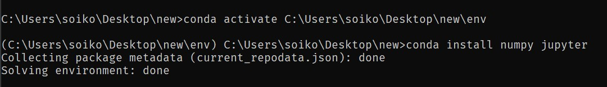

# Machine Learning

- [Machine Learning](#machine-learning)
	- [Virtual Environment](#virtual-environment)
		- [Activating Virtual Environment Using Conda](#activating-virtual-environment-using-conda)
		- [Installing packages inside Conda environment](#installing-packages-inside-conda-environment)
		- [Opening Jupyter Notebook](#opening-jupyter-notebook)
	- [Convert `ipynb` files into html, markdown, pdf and other format files](#convert-ipynb-files-into-html-markdown-pdf-and-other-format-files)

## Virtual Environment

<!-- <div align="center" ></div> -->

### Activating Virtual Environment Using Conda

```bash
conda create --prefix env
```

After creating the VM, `conda` will show a message to activate the environment.

```bash
conda activate __dir__\env
```

<div align="center"></div>

### Installing packages inside Conda environment

Once we are inside `Conda` environment, we use the following command to install `Jupyter Notebook`

```bash
conda install numpy jupyter
```

### Opening Jupyter Notebook

To open `Jupyter Notebook`, we firstly have to `activate` our environment and use command: `jupyter notebook`

```bash
jupyter notebook
```
<div align="center"></div>

## Convert `ipynb` files into html, markdown, pdf and other format files

```bash
# ipython nbconvert --to FORMAT notebook.ipynb

jupyter nbconvert --to html test.ipynb
jupyter nbconvert --to markdown test.ipynb --output README.md
jupyter nbconvert --to pdf test.ipynb

# Note: VsCode jupyter notebooks has built in converter
```

[https://ipython.org/ipython-doc/3/notebook/nbconvert.html](https://ipython.org/ipython-doc/3/notebook/nbconvert.html)

[https://www.programmersought.com/article/95748768264/](https://www.programmersought.com/article/95748768264/)
